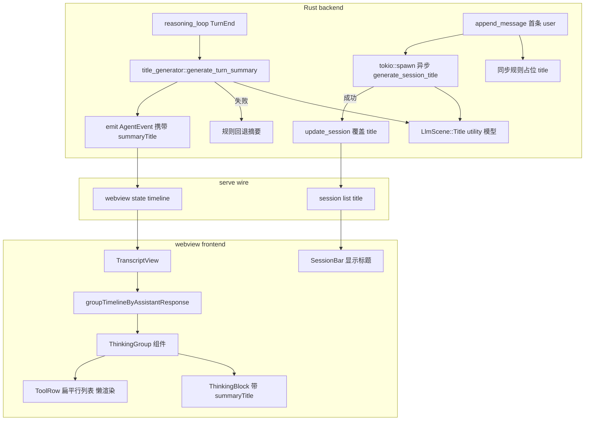

## 事故复盘与 rm -rf 防护条款（本次新增，最高优先级）

### 事故根因（2026-06-26 上午）

复现脚本 `/tmp/repro-serve.ts` 中：

```bash
HOME=$(mktemp -d /tmp/tomcat-init-XXXX) tomcat init ...
rm -rf "$HOME"
```

`HOME=...` 只对 `tomcat init` 这一条命令生效。分号之后 `rm -rf "$HOME"` 用的是**恢复后的真实 HOME `/Users/yankeben`**。由于仓库位于 `/Users/yankeben/workspace/Tomcat`（在 HOME 之下），`rm -rf` 遍历并删除了整个仓库——包括所有未提交的本次 transcript UI 重写工作、`.git`、源码、docs。Time Machine 无可用备份，未提交工作**永久丢失**。

### 执行本计划期间的强制防护规则

1. **禁止任何 `rm -rf "$VAR"` 形态命令**，无论 `$VAR` 看起来多"安全"。变量在命令分号后可能恢复为真实环境值，这是本次事故的直接成因。
2. **临时目录清理必须用字面量绝对路径**，或在**同一条命令内**消费 mktemp 变量：
   - 正确：`d=$(mktemp -d) && tomcat init ... && rm -rf "$d"`（同一 `&&` 链，HOME 不跨分号）
   - 正确：`rm -rf /tmp/tomcat-init-abc123`（字面量）
   - 错误：`HOME=$(mktemp -d) cmd; rm -rf "$HOME"`（分号后 HOME 恢复）
3. **任何删除命令优先用 `trash` / `git clean -nd` 预览**，而非 `rm -rf`。
4. **已配置双层防护（本机）**：
   - **Cursor beforeShellExecution Hook**（`~/.cursor/hooks/block-rm-rf.sh`）：Agent 执行任何含 `rm -rf` 的终端命令前拦截，包括脚本文件内容扫描与 `bash -c` 内联扫描。本计划所有工具调用都受此保护。
   - **safe-rm**（`/usr/local/bin/rm` → `safe-rm`）：系统层保护 `/`、`/Users`、`/etc`、`/usr`、`/Users/yankeben/workspace` 等关键路径，终端/脚本/其它程序调 `rm` 都经过它。
5. **执行本计划的 Agent 不得禁用、绕过、修改上述 Hook 与 safe-rm 配置**。若某条合法命令被误拦，需用户显式确认后由用户手动执行，不得自行关闭防护。

## 背景与约束

**参考仓库（VSCode 源码，实现时据此定位所有引用）**：`/Users/yankeben/workspace/vscode`
- 所有 VSCode 引用路径相对 `src/vs/workbench/contrib/chat/browser/widget/` 起缩写（如 `chatThinkingContentPart.ts:1261-1351`），绝对路径前缀 `/Users/yankeben/workspace/vscode/src/vs/workbench/contrib/chat/browser/widget/`。
- copilot 扩展引用前缀 `/Users/yankeben/workspace/vscode/extensions/copilot/src/extension/`。

用户要求仿 VSCode Chat 重做 Tomcat transcript **整体**（user 消息、assistant 输出、thinking、工具、进度、文件引用全部对齐 VSCode）。已确认：
- 绿灯不动（话题已结束）。
- 工具摘要粒度：per-thinking（每个 thinking 块 + 它挂的同轮 tool 一组折叠块）。
- 摘要生成：utility 模型生成自然语言（仿 VSCode `generateTitleViaLLM`），失败回退规则。
- bash：只折叠成 "Ran <cmd>" 单行，不做"在终端打开"（Tomcat bash 后端跑，无 VSCode terminal instance 对应物）。
- session 标题：加异步 utility 模型生成阶段，不做首轮后精炼。

### 不卡渲染原则（核心架构约束，贯穿全计划）

VSCode 的做法（已读源码确认），Tomcat 必须照搬：
- **占位优先 + 异步覆盖**：折叠标题、session 标题都用一个"当前最佳值"字段。初始 = 规则占位（thinking 首行截断 / 首条 user 截断），渲染层立即显示，**永不 await LLM**。LLM 回来后覆盖该字段，仅当值仍是占位时才覆盖（用户/LLM 已写过的不踩）。
- **折叠态懒渲染子项**：折叠时**不创建组内 tool 的 DOM**（仿 VSCode `appendItem` 懒加载，`chatThinkingContentPart.ts:1536-1559`：展开或已展开过才 `factory()`，否则压入 `lazyItems`），展开才创建。折叠态渲染成本恒定，与 tool 数量无关。
- **生成中 shimmer**：LLM 标题未就绪 + streaming 时，header 标题加 shimmer 动画（仿 `chat-thinking-title-shimmer`），表示"正在想标题"，但 thinking/tool 正文已经在流，不阻塞。
- **失败静默回退**：LLM 失败/超时/`title_model` 解析失败 → 保留规则占位，不报错、不阻塞、不重试阻塞。`title_model` 默认值 = `utility-flash`（见 todo `be-utility-model-default`，由 `LlmConfig::default()` + init 双保险写入）；resolver 仍保留 `title_model → compaction_model → default_model` 回落链作为兜底。

VSCode 源码关键参考（行号已逐项核对 HEAD，路径自 `src/vs/workbench/contrib/chat/browser/widget/`）：
- 用户消息气泡：请求行隐藏 header `chatListRenderer.ts:892-894`（`header-disabled`）+ 隐藏头像/用户名 `chatListRenderer.ts:811-812`；右侧气泡 CSS `media/chat.css:3586-3595`（`--vscode-chat-requestBubbleBackground`），容器右对齐 `chat.css:3580-3584`，header 隐藏 `chat.css:3769-3777`。
- assistant 消息：无气泡（response 侧无 bubble 规则，默认行为）、全宽 markdown 流 `chat.css:326-328`（`.value width:100%`）+ `chat.css:434-437`（换行）+ `chat.css:539-548`（`.rendered-markdown` 字号/行高/段距）。
- 文件 chip：`chatContentParts/chatInlineAnchorWidget.ts:87-133`（`renderFileWidgets` 扫 `<a>` 转 widget）+ `:135-340`（`InlineAnchorWidget` 类，className `chat-inline-anchor-widget`）+ `:306-328`（点击 `openerService.open`，open 在 324-327）；chip 样式 `chatContentParts/media/chatInlineAnchorWidget.css:6-16`。
- inline progress 行：`chatContentParts/chatProgressContentPart.ts:32`（`ChatProgressContentPart`）+ `:186-215`（`ChatProgressSubPart`，197 建 `.progress-container`，212-213 挂 `.progress-step`）+ `chat.css:3104-3190`（progress/shimmer 样式）。"Created N todos" 是工具 `pastTenseMessage`：`common/tools/builtinTools/manageTodoListTool.ts:179-182`（`generatePastTenseMessage` 整体 175-198，赋值在 167）。
- 底部 working 行：`chatProgressContentPart.ts:252-359`（`ChatWorkingProgressContentPart`，shimmer 核心 275-298），非原生 progress bar。
- 折叠基类：`chatContentParts/chatCollapsibleContentPart.ts:27`（`ChatCollapsibleContentPart`）+ `:70-92`（`init()` 建 `.chat-used-context` + chevron）+ `:127-132`（懒加载：首次展开才 `initContent()`）。
- thinking 折叠 + 工具挂载：`chatContentParts/chatThinkingContentPart.ts:270`（`ChatThinkingContentPart extends ChatCollapsibleContentPart`）；`chatListRenderer.ts:2551-2556`（`isAttachedToThinking=true` + `appendItem` 把 tool pin 进 thinking，首次创建 2541-2545）；**懒加载子项在 `chatThinkingContentPart.ts:1536-1559`**（`appendItem` 展开才 `factory()`，否则压入 `lazyItems`）。
- tool 行扁平 vs 卡片路由：`chatContentParts/toolInvocationParts/chatToolInvocationPart.ts:178-270`（`createToolInvocationSubPart` 按 `state.type`/`toolSpecificData.kind`/`resultDetails` 路由）；默认兜底扁平行 `chatToolProgressPart.ts:25`（`ChatToolProgressSubPart`，兜底实例化在 `chatToolInvocationPart.ts:269`）；可展开 I/O `chatSimpleToolProgressPart.ts:23`（路由 216-226）；引用列表 `chatResultListSubPart.ts:18`（路由 212-213、230-232）。
- tool 行竖线 + 行内图标隐藏：`chatContentParts/media/chatThinkingContent.css:274-321`（`.chat-thinking-tool-wrapper::before` 1px 竖线 + `:first/last/only-child` mask 断开 + `.chat-thinking-icon` 305-315）+ `:184-188`（`.codicon-check, .codicon-loading { display:none !important }`）。
- bash 折叠：`toolInvocationParts/chatTerminalToolProgressPart.ts:1657-1748`（`ChatTerminalThinkingCollapsibleWrapper`），plain 文案 "Ran/Running" 1681-1687，带 code 块标题 prefix `chat.terminal.ran.prefix`/`running.prefix` 1737-1738，实例化 545-569。
- todo 进度行 `(N/M)`：`chatContentParts/chatTodoListWidget.ts:114`（`ChatTodoListWidget`）+ `:408-464`（`updateTitleElement`，417 算 `currentTaskNumber = inProgress>0 ? completed+1 : max(1,completed)`，展开 `'Todos ({0}/{1})'` 折叠 `'{0} ({1}/{2})'`）。
- thinking 折叠组 LLM 标题：`chatThinkingContentPart.ts` `finalizeTitleIfDefault:1054-1178`（1177 调 LLM）→ `generateTitleViaLLM:1238-1414`；prompt 全文 1261-1351（模型 `copilot-utility-small` 在 1243），文件计数规则/示例 1294-1331（如 1323 `"Reviewed 2 files"`）；失败回退 `setFallbackTitle:1460-1475`。**注意：thinking 标题是"≤10 词 + 过去时 + 首词过去式动词"，不是 session 的 3-6 词。**
- session 标题 prompt：`extensions/copilot/src/extension/prompts/node/panel/title.tsx:18-39`（`TitlePrompt`，"sentence case / 3-6 words / 不加引号"），调用 `extensions/copilot/src/extension/prompt/node/title.ts:28-45`（`ChatTitleProvider.provideChatTitle`）。
- session 标题两阶段：异步触发 `chatServiceImpl.ts:1389`（调用点）+ `:1671-1690`（`generateInitialChatTitleIfNeeded`：仅首条请求且无 customTitle 时 fire-and-forget，成功 `setCustomTitle`）；占位 getter `chatModel.ts:2363-2365`（`title = _customTitle || getDefaultTitle()`），规则回退 `:2140-2146`（首条首行截断 ≤200 字符），异步写入 `:2832-2835`（`setCustomTitle`）。`title` getter 永不阻塞。

### 当前仓库基线关键文件（2026-06-26 23:00 重新核实，事故后从 teisun/tomcat-agent clone）

后端：
- [tomcat/src/core/llm/resolver.rs](tomcat/src/core/llm/resolver.rs) — `LlmScene::Title`(L22) + `title_model`(L201-204) 已定义未调用。
- [tomcat/src/core/compaction/preheat.rs:642-682](tomcat/src/core/compaction/preheat.rs) — `generate_summary` 非流式小模型调用模板（`tools: None` 双保险），复用其 `ChatRequest` 构造模式。
- [tomcat/src/core/agent_loop/reasoning_loop.rs:178-182](tomcat/src/core/agent_loop/reasoning_loop.rs) — `TurnEnd` 事件 emit 点，payload `{ turn_index, message, tool_results }`。
- [tomcat/src/core/agent_loop/types.rs:344-354](tomcat/src/core/agent_loop/types.rs) — `TurnEnd` 类型定义，`tool_results: Vec<crate::infra::events::Message>`。
- [tomcat/src/core/session/manager/session_impl.rs:35-54](tomcat/src/core/session/manager/session_impl.rs) — `derive_title_from_user_message` 规则截断（TITLE_MAX_CHARS=40），同步在 `append_message` 内。
- [tomcat/src/infra/events/mod.rs:77-111](tomcat/src/infra/events/mod.rs) — **wire 事件常量真实位置**（`WIRE_AGENT_START`..`WIRE_SEARCH_TOOLS_PREFLIGHT`）。**当前无 `WIRE_PLAN_TODOS`/`WIRE_SESSION_TODOS`/`WIRE_SESSION_TITLE_UPDATED`，需新建**。注意：原计划写"在 tomcat/src/api/serve/events/mod.rs"是旧仓库路径，当前仓库 wire 常量在 `infra/events/mod.rs`。
- [tomcat/src/api/serve/event_pump.rs:15+](tomcat/src/api/serve/event_pump.rs) — 已 `use wire::{WIRE_AGENT_START, ...}`，新增常量在此补 import 并订阅转发。
- [tomcat/src/api/serve/commands.rs:274](tomcat/src/api/serve/commands.rs) — `list_sessions` 调用点；`get_state` 需在此模块定位后加 `planTodos`/`sessionTodos`。
- [tomcat/src/api/chat/run_loop/mod.rs](tomcat/src/api/chat/run_loop/mod.rs) — 首条 user 消息处理入口，在此调 `generate_session_title` + `update_session`（保持 SessionManager 纯同步）。

前端：
- [tomcat-vscode-ext/gui/src/components/TranscriptView.tsx](tomcat-vscode-ext/gui/src/components/TranscriptView.tsx) — 按 type 分发，无 thinking 分组。
- [tomcat-vscode-ext/gui/src/components/MessageBubble.tsx](tomcat-vscode-ext/gui/src/components/MessageBubble.tsx) — user/assistant 共用，大灰框 + You/user header。
- [tomcat-vscode-ext/gui/src/components/ThinkingBlock.tsx](tomcat-vscode-ext/gui/src/components/ThinkingBlock.tsx) — 已可折叠，但不挂载 tool。
- [tomcat-vscode-ext/gui/src/components/ToolCallCard.tsx](tomcat-vscode-ext/gui/src/components/ToolCallCard.tsx) — 逐条独立卡片。
- [tomcat-vscode-ext/gui/src/components/PlanFileCard.tsx](tomcat-vscode-ext/gui/src/components/PlanFileCard.tsx) — plan 卡片，需加 planTodos 列表。
- [tomcat-vscode-ext/gui/src/styles.css](tomcat-vscode-ext/gui/src/styles.css) — `.tc-message--user` L520、`.tc-thinking` L658、`.tc-card` L533（基线已核实行号）。
- [tomcat-vscode-ext/src/ui/webview/protocol.ts](tomcat-vscode-ext/src/ui/webview/protocol.ts) — `WebviewThinkingBlock`(L27)、`WebviewToolCard`(L55)、`WebviewSessionSnapshot`(L94)、`WebviewSessionTab`(L110)。
- [tomcat-vscode-ext/src/ui/webview/state.ts](tomcat-vscode-ext/src/ui/webview/state.ts) — `activeAssistantId`(L39)、`buildHistoryToolNameLookup`(L193，作 `buildToolCallToAssistantMap` 模板)、`parseHistoryEntry`(L220)。
- [tomcat-vscode-ext/src/serveClient/sessionRouter.ts](tomcat-vscode-ext/src/serveClient/sessionRouter.ts) — wire 事件 → state 映射。
- [tomcat-vscode-ext/src/serveClient/wire.d.ts](tomcat-vscode-ext/src/serveClient/wire.d.ts) — wire 事件 TS 类型。
- [tomcat-vscode-ext/src/extension.ts](tomcat-vscode-ext/src/extension.ts) — extension host，openFile intent 落点。

## 架构



## 改动

### A. 后端：utility 摘要生成器（新模块）

**utility 模型配置（前置，见 todo `be-utility-model-default`）**：`LlmScene::Title` 默认解析到新增的 `utility-flash` 模型——`models_toml.rs` `MANAGED_MODELS` 末尾新增条目（`id=utility-flash`，`model_name=deepseek-v4-flash`，复用 `DEEPSEEK_API_KEY`，暂时就是 deepseek-v4-flash 的本地 id 隔离，后续换 utility 专用小模型只改 `models.toml` 一行）；`LlmConfig::default()` 的 `title_model` 从 `None` 改 `Some("utility-flash")`（[llm.rs:426](tomcat/src/infra/config/types/llm.rs)），init 新建配置经 `..Default::default()` 自动带上（双保险）。本机 `~/.tomcat` 配置不改，用户后续 `tomcat init` 自动生成 `utility-flash` 条目 + `title_model` 行。`llm`/`model` 两参数来源 = `resolver.resolve(LlmScene::Title, None)` 返回的 `ResolvedCall.provider_impl` / `ResolvedCall.model`，与 `preheat.rs` 调 `generate_summary(..., &*llm, &compaction_model)` 同款。

新建 [tomcat/src/core/summary/title_generator.rs](tomcat/src/core/summary/title_generator.rs)：

- `pub async fn generate_turn_summary(thinking_text, tools: &[ToolSnapshot], llm, model) -> Result<String>`：仿 `generate_summary`，用 `LlmScene::Title` 解析的 utility 模型，非流式 `chat`。prompt 模板仿 VSCode `generateTitleViaLLM`（`chatThinkingContentPart.ts:1261-1351`）——**≤10 词、过去时、首词为过去式动词**（如 "Reviewed"/"Updated"/"Created"），多文件用 "Reviewed N files"（示例 1294-1331）；模型对标 `copilot-utility-small`。输入 = thinking 首行 + 各 tool 的 `tool_name` + `one_line_summary`（复用 `cli_turn_renderer.rs` 已有的 `one_line_summary`）。
- `pub async fn generate_session_title(first_user_text, llm, model) -> Result<String>`：prompt 仿 VSCode `panel/title.tsx:18-39`（**3-6 词、sentence case、不加引号/尾标点**）。失败返回 `Err`（让上层保留规则占位）。
- 两个函数共用一个内部 `call_utility(prompt, llm, model) -> Result<String>`，复用 `preheat.rs:generate_summary` 的 `ChatRequest` 构造模式（`tools: None` 双保险）。
- 回退：`generate_turn_summary` 失败时调用纯规则 `fallback_turn_summary(tools)`（新，仿 VSCode `setFallbackTitle:1460-1475`，按工具类型计数拼 "Reviewed N files" / "Edited N files" / "Executed N bash commands" / 单个用 `one_line_summary`）。

### B. 后端：接入 reasoning_loop 的 TurnEnd

[tomcat/src/core/agent_loop/reasoning_loop.rs:178-182](tomcat/src/core/agent_loop/reasoning_loop.rs)：

- 在 `dispatch_tool_calls` 完成、`emit_event(TurnEnd)` 之前，若本轮有 thinking 或 tool，调 `generate_turn_summary`（`tokio::spawn` 不阻塞主循环；或 `await` 但加超时 8s）。
- 把生成的 `summary_title` 加进 `TurnEnd` 事件 payload：`{ turn_index, tool_results, summary_title: Option<String> }`（类型定义在 [tomcat/src/core/agent_loop/types.rs:344-354](tomcat/src/core/agent_loop/types.rs)）。
- 同步在 `reasoning_loop` 的 `TurnStart` 记录本轮 thinking 文本快照，供 `generate_turn_summary` 用。

### C. 后端：session 标题异步 LLM 阶段

[tomcat/src/core/session/manager/session_impl.rs](tomcat/src/core/session/manager/session_impl.rs)（`derive_title_from_user_message` 基线 L35-54）：

- `ensure_title_for_session_key` 保留同步规则占位（`derive_title_from_user_message`），**不再"永不覆盖"**——改为"仅当 title 仍为规则占位时允许覆盖一次"。
- 优选：不在 `SessionManager`（同步层）里 spawn，而是在 [tomcat/src/api/chat/run_loop/mod.rs](tomcat/src/api/chat/run_loop/mod.rs) 首条 user 消息处理完后调 `title_generator::generate_session_title` 并 `session_manager.update_session`，保持 `SessionManager` 纯同步。仿 VSCode `chatServiceImpl.ts:1389`（调用点）+ `:1671-1690`（`generateInitialChatTitleIfNeeded`：仅首条且无 customTitle 时 fire-and-forget，成功 `setCustomTitle`），占位/覆盖语义对标 `chatModel.ts:2363-2365`（`title = _customTitle || getDefaultTitle()`）+ `:2140-2146`（规则回退）+ `:2832-2835`（异步写入）。
- **事件下发（必须）**：session 标题异步覆盖发生在首条 user 之后，此时 UI 已渲染规则占位。LLM 标题回来后要实时反映到 webview，必须主动推送，不能等下次 `list_sessions`/`get_state` 轮询。**新建** wire 事件 `WIRE_SESSION_TITLE_UPDATED = "session.title_updated"`（落 [tomcat/src/infra/events/mod.rs](tomcat/src/infra/events/mod.rs)，与现有 `WIRE_*` 并列；非原计划所述 `serve/events/mod.rs`），`run_loop` 在 `generate_session_title` 成功且当前 title 仍是占位时 `emit_event`，payload `{ sessionId, title }`；[tomcat/src/api/serve/event_pump.rs](tomcat/src/api/serve/event_pump.rs) 订阅转发（在现有 `use wire::{...}` 处补 import）。前端 `sessionRouter.ts` 收到后 upsert 对应 session tab 的 `title`，webview state 更新触发 SessionBar + 当前会话头部 re-render。这是"占位优先 + 异步覆盖 + UI 永不卡顿"原则在 session 标题上的闭环。

### D. 后端：wire 传输 summary_title + plan/session todos

- [tomcat/src/api/serve/commands.rs](tomcat/src/api/serve/commands.rs) `list_sessions`（L274）：title 字段已有，行为不变（LLM 生成后落盘的 title 直接读）。`get_state` 响应加 `planTodos`/`sessionTodos` 字段（需先在 commands.rs 定位 `get_state` handler）。
- webview state timeline 的 thinking 条目加 `summaryTitle: string | null` 字段：[tomcat-vscode-ext/src/ui/webview/protocol.ts](tomcat-vscode-ext/src/ui/webview/protocol.ts) `WebviewThinkingBlock`(L27) + state 映射 + wire.d.ts。
- `TurnEnd` 事件的 `summary_title` 由 [tomcat-vscode-ext/src/serveClient/sessionRouter.ts](tomcat-vscode-ext/src/serveClient/sessionRouter.ts) 映射到对应 thinking 条目的 `summaryTitle`。
- **session 标题事件下发**：新建 `WIRE_SESSION_TITLE_UPDATED = "session.title_updated"`（见 C 节），`wire.d.ts` 加 type `session_title_updated` payload `{ sessionId, title }`；`sessionRouter.ts` 收到后 upsert 对应 session tab 的 `title`。与 `list_sessions`/`get_state` 的 title 字段形成"初始化拉取 + 运行时推送"双通道。
- **plan todos 下发**：**新建** wire 常量 `WIRE_PLAN_TODOS = "plan.todos"`（落 [tomcat/src/infra/events/mod.rs](tomcat/src/infra/events/mod.rs)，当前不存在需新建——原计划"已有未 emit"是旧仓库状态，基线已核实当前无此常量）。在 `update_plan` / `create_plan` 工具执行后 emit `plan.todos` 事件，payload = `{ sessionId, planId, todos: [{id, content, status}] }`（复用 `PlanFile.frontmatter.todos`）。`get_state` 响应也加 `planTodos` 字段，供 webview 初始化/恢复。
- **session scratchpad todos 下发**：**新建** wire 常量 `WIRE_SESSION_TODOS = "session.todos"`（落 [tomcat/src/infra/events/mod.rs](tomcat/src/infra/events/mod.rs)）。`todos` 工具执行后 emit `session.todos` 事件，payload = `{ sessionId, todos: [...] }`。`get_state` 加 `sessionTodos` 字段。
- webview state [tomcat-vscode-ext/src/ui/webview/state.ts](tomcat-vscode-ext/src/ui/webview/state.ts) 加 `planTodos: WebviewTodo[]` + `sessionTodos: WebviewTodo[]`，由对应事件 upsert。`WebviewTodo = { id, content, status: "pending"|"in_progress"|"completed"|"cancelled" }`。

### E. 前端：timeline 按 assistant response 分组（无框 markdown 流 + 同 tool_calls 折叠）

[tomcat-vscode-ext/gui/src/components/TranscriptView.tsx](tomcat-vscode-ext/gui/src/components/TranscriptView.tsx)：

**目标**（对齐 VSCode，见附件图 1/2）：保持现状的内容顺序，但把样式从"带框独立顶层卡片"改成"无框 markdown 流"；**同一条 assistant message 的多个 tool_calls 渲染成一组**（折叠成一行轻量 progress，展开是各 tool 子项）。多轮 tool 调用 = 多个组连续排列，每组折叠成一行"Reviewed N files"，视觉上是连续几行折叠头 + 末尾收束 markdown 流（正是 VSCode 附件图 2 的效果）。

**后端落盘语义（无需改动，已正确）**：一次 reasoning loop 多轮 stream，落盘 `MessageEntry` 序列。`content`(阐述) 和 `thinking_text`(推理) **都可为空**——LLM 经常只输出 thinking + tool_calls 不说话。真实形态归纳为四种，**统一用"一条带 tool_calls 的 assistant message = 一个组"归纳**：

```
形态 A（阐述→tool→收束）:
  [assistant] content="阐述…" thinking_text="…" tool_calls=[tc1]
  [tool] tool_call_id=tc1 content=结果        ← tool result = tool 卡片的内容，不是独立块
  [assistant] content="收束…" (无 tool_calls)  ← 独立无框 markdown 流

形态 B（无阐述，多轮串行）:
  [assistant] (无 content) thinking_text="…" tool_calls=[tc1]
  [tool] tc1结果
  [assistant] (无 content) thinking_text="…" tool_calls=[tc2]  ← 直接下一轮，开新组

形态 C（一条 assistant 带多个 tool_calls）:
  [assistant] (无 content) thinking_text="…" tool_calls=[tc1, tc2]
  [tool] tc1结果
  [tool] tc2结果                                   ← 两个 tool 卡片归同一组

形态 D（多轮 × 多 tool，你说的"阐述→tool→tool→tool→thinking→收束"）:
  [assistant] thinking tool_calls=[tc1]            ← 组1
  [tool] tc1结果
  [assistant] thinking tool_calls=[tc2,tc3]        ← 组2
  [tool] tc2结果 [tool] tc3结果
  [assistant] thinking tool_calls=[tc4,tc5,tc6]    ← 组3
  [tool] tc4结果 [tool] tc5结果 [tool] tc6结果
  [assistant] content="收束新闻汇总…"               ← 独立无框 markdown 流
```

**归纳规则**：每条带 `tool_calls` 的 assistant message = 一个组（不管 content/thinking_text 是否为空，不管带几个 tool_calls）；组内 = `content`(阐述，可空) + `thinking_text`(thinking，可空) + 该 message 所有 `tool_calls[].id` 对应的 tool 卡片（tool result 就是卡片内容，不是组内独立项）；下一轮 assistant message 开新组；末尾 text-only assistant message（无 tool_calls）= 独立无框 markdown 流（收束）。

**前端分组：显式归属，不靠顺序推断**（数据模型自描述，比顺序推断优雅且抗乱序）：

1. [tomcat-vscode-ext/src/ui/webview/protocol.ts](tomcat-vscode-ext/src/ui/webview/protocol.ts) `WebviewToolCard`(L55) 加 `assistantMessageId?: string`（可选，归属到哪条 assistant message）。
2. [tomcat-vscode-ext/src/ui/webview/state.ts](tomcat-vscode-ext/src/ui/webview/state.ts) `parseHistoryEntry`(L220)：
   - 处理 `role === "assistant"` 且 `tool_calls` 非空时，建立 `toolCallId → assistantMessageId` 映射（用 `buildHistoryToolNameLookup`(L193) 同款模式，新建 `buildToolCallToAssistantMap`）；把这条 assistant message 的 `id` 登记给所有 `tool_calls[].id`。
   - 处理 `role === "tool"` 时，用 `toolCallId` 查表回填 `assistantMessageId` 到 `WebviewToolCard`。
3. 新增纯函数 `groupTimelineByAssistantResponse(timeline)`（落 `gui/src/components/sessionList/groupTimelineByAssistantResponse.ts`，含单测）：
   - 遍历 timeline，**带 `assistantMessageId` 的 tool 卡片**归入对应 assistant message 的组；**同 `assistantMessageId` 的所有 tool 卡片**归同一组（一条 assistant message 的 N 个 tool_calls 是一组，覆盖形态 C/D）。
   - assistant text block + thinking block 若 `assistantMessageId` 与某组相同（即同一条 assistant message 的阐述/thinking），归入该组。**content/thinking 为空时组内对应位置省略**（不渲染空块）。
   - **收束阐述**（assistant text block 无对应 tool，text-only 收束回合）→ 独立无框 markdown 流，不进组。
   - message(user)/plan/approval 不进组。

**组内顺序**：`[阐述 MessageBubble(无框, 可空), ThinkingBlock(可空), ToolRow × N]`。折叠态：一行轻量 progress（`Reviewed 3 files` 风格的 LLM 摘要标题，来自 B 节 `summaryTitle`）+ 展开是各 tool 扁平行（每个 tool 自己的 `Ran <cmd>` / `Read [file]` 行，可再点开看结果，见 I 节）。**阐述 markdown 在折叠头上方独立渲染**（始终可见，不进折叠头）；thinking + tool 懒渲染。多轮 = 多个 ThinkingGroup 连续排列（形态 D 视觉上是 3 行折叠头 + 收束）。

render：组用 `ThinkingGroup`（无框容器）；非组项沿用 `MessageBubble`(无框)/`PlanFileCard`/`ApprovalCard`。`liveClusterTimeline` 同样先分组再 render。

**live 模式**（基本无需改动，补归属回填）：`tool_execution_start` → `clearStreaming` 置空 `activeAssistantId`(L39 已有) → 下一轮 `content_delta` 开新 block。live 事件流里 tool card 的 `assistantMessageId` 由 `tool_execution_start` 的 `toolCallId` + 当前 `activeAssistantId`(L443 已有) 回填（`appendStreamingMessage` 创建 assistant block 时记 `activeAssistantId`，tool 事件来时把它写到 tool card）。

### F. 前端：ThinkingGroup 组件（新，懒渲染 + shimmer + tool 扁平行）

新建 [tomcat-vscode-ext/gui/src/components/ThinkingGroup.tsx](tomcat-vscode-ext/gui/src/components/ThinkingGroup.tsx)：

**折叠 header**：显示 `item.summaryTitle`（后端 LLM 生成，如 "Reviewed 3 files"）或回退 `"Tomcat · Thinking"` + thinking 首行摘要。仿 VSCode `.chat-used-context`：chevron + 标题按钮。

- **`summaryTitle === null && streaming`**：header 标题加 shimmer 动画（`tc-thinking__title--shimmer`）。
- **懒渲染**：折叠态不渲染组内 `ThinkingBlock` 与 tool 行（`{collapsed ? null : ...}`），只显示 header 一行。**阐述 `MessageBubble` 在折叠头外、上方独立渲染**（始终可见）。展开才创建 thinking + tool DOM。

**展开态 DOM 结构**（对齐 VSCode `chatThinkingContentPart.appendItemToDOM` + `.chat-thinking-tool-wrapper`）：

```
.tc-thinking-box (折叠组根)
└─ .tc-thinking-list
   ├─ ThinkingBlock (若有 thinking_text)
   └─ 每个 tool 一行 .tc-thinking-tool-wrapper
      ├─ .tc-thinking-icon (codicon: read→book, grep→search, bash→terminal, web→globe)
      └─ .tc-tool-row (扁平行, flex, 无 border)
         └─ .tc-tool-row__label (markdown: "Read [Cargo.toml pill]")
```

- **左侧竖线**：`.tc-thinking-tool-wrapper::before` 1px 竖线 + mask 首尾断开（仿 `chatThinkingContent.css:274-321`）。
- **扁平行样式**：`.tc-tool-row` = `display:flex; align-items:center; gap:6px; font-size:13px;` 无 border 无卡片 padding（仿 VSCode `.progress-container`）。
- **行内 check/loading 图标隐藏**：状态由外层 `.tc-thinking-icon` + 折叠头表示，行内不重复（仿 `chatThinkingContent.css:184-188`）。
- **阐述在折叠头上方**，thinking + tool 行在折叠头下方。整体视觉：阐述（无框 markdown）→ 折叠头一行 → 展开是 thinking + N 个 tool 扁平行。

**tool 行按类型差异化编排**（对齐 VSCode `createToolInvocationSubPart` 路由，由 `toolName` + `display` 决定，见 H/I 节）：

- `read`/`grep`：扁平行 `Read [文件 pill]` / `Searched for ..., N results`，文件路径渲染成 FileChip（H 节）点击打开。
- `bash`：扁平行 `Ran <cmd>` / `Running <cmd>`，可展开看输出（I 节）。
- `web_search`/`web_fetch`：扁平行 `Searched "query"` / `Fetched {url}`。
- 默认：扁平行 `toolName + summary 首行`。
- **不使用** 现有带 border/padding/Done 按钮的大卡片 `ToolCallCard`（折叠组内）。

默认折叠：完成态折叠、streaming 态展开。`summaryTitle` 就绪是后端异步推送，前端不轮询、不 await。

### G. 前端：用户消息 pill + assistant 无框 markdown 流

[tomcat-vscode-ext/gui/src/components/MessageBubble.tsx](tomcat-vscode-ext/gui/src/components/MessageBubble.tsx)：

- `kind === "user"`：去掉 `.tc-message__header`（You/user 标签），改为右侧气泡：`.tc-message--user` 右对齐 + `margin-left: auto` + `max-width: 90%` + 圆角 + `--vscode-chat-requestBubbleBackground`。仿 VSCode `.interactive-request .value .rendered-markdown`。
- `kind === "assistant"`：**去卡片化**——去掉 `.tc-message__header`（无 "Tomcat"/"assistant" 标签）、无背景、无边框，纯 markdown 流。仿 VSCode `.interactive-response`（`chat.css:326-328,539-548`）。正文用 markdown 渲染（现有 `<p>` 若已是纯文本，保持；后续可接 markdown renderer，本次不强制）。
- `error`/`notice`：保留现有左边框样式（轻量提示，不进气泡）。

[tomcat-vscode-ext/gui/src/styles.css](tomcat-vscode-ext/gui/src/styles.css)：
- L520 改 `.tc-message--user`：去 `margin-left: 24px` 灰框，改 `margin-left: auto; max-width: 90%; background: var(--vscode-chat-requestBubbleBackground); border-radius: var(--vscode-cornerRadius-xLarge, 8px); padding: 8px 12px;`。新增 `.tc-message--user .message-text { margin: 0; }`。
- `.tc-message--assistant`：去背景/边框/padding，`width: 100%`，正文 `line-height: 1.5em`、`p { margin: 0 0 16px 0; }` 对齐 VSCode `.rendered-markdown`。
- 新增 `@keyframes tc-title-shimmer`（标题 shimmer，仿 `chat-thinking-title-shimmer`）+ `.tc-thinking__title--shimmer`。

### H. 前端：文件引用 chip（assistant 正文 + tool 行内）

新建 [tomcat-vscode-ext/gui/src/components/FileChip.tsx](tomcat-vscode-ext/gui/src/components/FileChip.tsx)。VSCode 参考：`renderFileWidgets`（`chatInlineAnchorWidget.ts:87-133`）扫描 `<a>` 转 `InlineAnchorWidget`（类 `:135-340`，className `chat-inline-anchor-widget`），点击 `openerService.open`（`:306-328`，open 在 324-327）：

- 仿 VSCode `InlineAnchorWidget`：`.tc-file-chip` = 边框 0.5px + 圆角 4px + padding 1px 3px + `--vscode-chat-font-size-body-s`（`chatInlineAnchorWidget.css:6-16`）。
- 内容：`<span class="tc-file-chip__icon">` + `<span class="tc-file-chip__label">文件名</span>`。
- 图标：按扩展名映射 codicon 近似（`.rs`/`.ts`/`.md`/文件夹等）。webview 拿不到 VSCode 文件图标主题，codicon 近似是优雅折中。
- 点击：`postIntent("openFile", { path })` 让 extension host 用 `vscode.workspace.openTextDocument` + `window.showTextDocument` 打开（仿 VSCode `openerService.open`）。
- **两处复用**：① assistant 正文里的文件路径（后端 markdown 标记 `[](file:///path)`，前端扫描 `<a>` 转 chip，本次先做组件，正文扫描留后续）；② **tool 行内的文件 pill**（read/grep 工具行 `Read [Cargo.toml pill]`，由 ToolRow 渲染时把 `display.file` 包成 FileChip，这是本次必做）。

### I. 前端：ToolRow 组件（tool 扁平行，全部可点击展开看结果）

新建 [tomcat-vscode-ext/gui/src/components/ToolRow.tsx](tomcat-vscode-ext/gui/src/components/ToolRow.tsx)（替代折叠组内的 `ToolCallCard`）。VSCode 参考：`createToolInvocationSubPart` 路由 `chatToolInvocationPart.ts:178-270`；默认扁平行兜底 `ChatToolProgressSubPart`（`chatToolProgressPart.ts:25`，兜底实例化 269）；可展开 I/O `ChatSimpleToolProgressPart`（`chatSimpleToolProgressPart.ts:23`）。

**数据来源（已核对 Tomcat 现有 `WebviewToolCard`(protocol.ts L55)，避免落地踩空）**：
- **扁平行标题** = `toolName` + 从 `args`（本计划新增字段）/`display` 派生（`summary` 是完整结果文本，不能当标题）。
- **展开结果** = `summary`（完整工具结果，现有字段，现 `ToolCallCard` 即用它）/ `display.text` / `display.plan`；file-kind 额外给 Open Diff / Apply Edit（编辑类）。
- **文件 pill** = `display.file`（read/grep/edit 的文件路径）包成 FileChip。

**所有 tool 行都可点击 chevron 展开看结果**（你明确要保留的能力，仿 VSCode `ChatSimpleToolProgressPart`：扁平行 + 展开看 input/output，不用大卡片 border/padding）：

- **read/grep**：扁平行 `Read [FileChip(display.file)]` / `Searched ...`。完成态图标 `codicon-book`/`codicon-search`。**展开**看 `summary`（read=文件内容/grep=命中文本，`<pre>`）。
- **edit/write**：扁平行 `Edited [FileChip(display.file)]`，展开保留现有 Open Diff / Apply Edit 按钮（file-kind 分支）。
- **bash**：扁平行 `Ran <cmd 首行>` / `Running <cmd>`（streaming），`<cmd>` 从 `args.command` 取首行（无 args 回退 `Ran command`）。完成态图标 `codicon-terminal`。**展开**看 `summary`（输出 `<pre>`）。不加"打开终端"按钮。
- **web_search**：扁平行 `Searched "query"` / `Searching "query"`，query 从 `args.query` 取。图标 `codicon-search`。**展开**看 `summary` 里的 hits（优先 markdown 渲染 title/url/snippet，对齐 `ChatResultListSubPart` 思路；回退 `<pre>`）。
- **web_fetch**：扁平行 `Fetched {url}` / `Fetching {url}`，url 从 `args.url` 取。图标 `codicon-globe`。**展开**看 `summary`。
- **默认**：扁平行 `humanize(toolName)`。图标 `codicon-tools`。**展开**看 `summary`（`<pre>` 兜底）。
- **通用扁平行样式**：`.tc-tool-row` = flex + 13px + descriptionForeground + 无 border 无卡片 padding（对齐 J 节）。完成态行内不显示 check/loading（状态由外层 `.tc-thinking-icon` 表示）。
- **展开态**：chevron 朝下，下方显示轻量结果区（无大卡片 border，仅 `padding-left` 对齐竖线 + 浅背景 `<pre>`/markdown）。展开/折叠是 ToolRow 内部状态，不影响 ThinkingGroup 折叠态。
- **默认展开/折叠**：完成态默认折叠（只看扁平行摘要）、streaming/error 态默认展开（看实时输出，沿用现有 `ToolCallCard` 的 `shouldExpandByDefault`）。
- **需确认的 tool**（approval）：不进 ThinkingGroup，沿用现有 `ApprovalCard`（仿 VSCode 从 thinking 移出）。
- **现有 `ToolCallCard`**：仅保留给 approval/需确认场景或未归组的孤立 tool；折叠组内一律用 `ToolRow`（file-kind 的 Open Diff/Apply Edit 逻辑从 `ToolCallCard` 抽到共用，避免重复）。

### J. 前端：tool 行 + 折叠头轻量 progress 样式

[tomcat-vscode-ext/gui/src/styles.css](tomcat-vscode-ext/gui/src/styles.css)：

- **ThinkingGroup 折叠 header**：`.tc-thinking-box__header` = flex + 13px + descriptionForeground + chevron + 标题，无卡片 border/padding（仿 VSCode `.chat-used-context`）。
- **ToolRow 扁平行**：`.tc-tool-row` = `display:flex; align-items:center; gap:6px; font-size:13px; color:var(--vscode-descriptionForeground);` 无 border 无卡片 padding（仿 VSCode `.progress-container`，`chat.css:3104-3190`）。**不使用** 现有 `.tc-card`(L533，padding 12px + 边框 + 圆角 12px 的大卡片)。
- **左侧竖线**：`.tc-thinking-tool-wrapper::before` 1px 竖线 + mask 首尾断开（仿 `chatThinkingContent.css:274-321`）。
- **行内 check/loading 隐藏**：`.tc-tool-row .codicon-check, .tc-tool-row .codicon-loading { display:none }`，状态由外层 `.tc-thinking-icon` + 折叠头表示（仿 `chatThinkingContent.css:184-188`）。
- **外层 thinking 图标**：`.tc-thinking-icon` 绝对定位 left:5px top:9px（仿 `chatThinkingContent.css:305-315`），按 tool 类型映射 codicon（read→book / grep/web_search→search / bash→terminal / web_fetch→globe / 默认→tools，仿 VSCode `getToolInvocationIcon`）。
- **可展开 tool（全部）**：展开态结果区 `.tc-tool-row__body` = 轻量背景（`var(--vscode-textBlockQuote-background)` 或浅 1px 左边框）+ `padding-left` 对齐竖线 + `<pre>`/markdown 内容，**不用大卡片 border/padding/圆角**。chevron 切换展开。完成态默认折叠、streaming 默认展开。
- 完成态折叠头 icon 用 `codicon-check`，streaming 用 `codicon-loading` spin 或 shimmer。
- 这样折叠态视觉跟 VSCode "Reviewed 3 files" 单行一致，不再是大块。

### K. 前端：底部进度行（两套 todo 数据源复用）

新建 [tomcat-vscode-ext/gui/src/components/ProgressRow.tsx](tomcat-vscode-ext/gui/src/components/ProgressRow.tsx) + [tomcat-vscode-ext/gui/src/hooks/useActiveTodoProgress.ts](tomcat-vscode-ext/gui/src/hooks/useActiveTodoProgress.ts)：

**复用核心**：一个 `ProgressRow` 组件吃统一契约 `{ title, current, total, phase, isComplete }`，两个 todo 数据源共用它。

**`useActiveTodoProgress(session)` 选择器**（按 `planState` 选数据源，仿 VSCode Plan 模式复用 todo 工具的思路）：
- `planState ∈ {planning, executing, pending, completed}` → 用 `planTodos`（`PlanFile.frontmatter.todos`，`update_plan` 维护）。
- 否则（`chat`）→ 若 `sessionTodos` 有 `in_progress` 项则用它，否则返回 null。
- 计算 `current/total`（仿 VSCode `ChatTodoListWidget.updateTitleElement`，`chatTodoListWidget.ts:408-464`，行 417：有 in_progress 时 current = completedCount+1，否则 max(1, completedCount)；展开 `'Todos ({0}/{1})'` 折叠 `'{0} ({1}/{2})'`）；`title` = in_progress 项 content 或最后一个 completed 项 content；`phase` = created/starting/completed/updated；`isComplete` = 全部 completed。

**`ProgressRow` 组件**：
- 仅当 `useActiveTodoProgress` 返回非 null 且 `busy` 时渲染，挂在 live cluster 末尾（替代原"通用 Working… 行"）。
- DOM：spinner（`isComplete` → check icon）+ `<p>{title} ({current}/{total})</p>`，shimmer 动画当 `!isComplete`。
- 仿 VSCode `.progress-container` + `ChatProgressSubPart`（`chatProgressContentPart.ts:186-215`）。
- 无 todo 数据时回退到通用 "Working…" shimmer 行（仿 `ChatWorkingProgressContentPart`，`chatProgressContentPart.ts:252-359`；`busy` 期间总要有指示）。

**Plan 模式 todo 跟踪**：同一份 `planTodos` 也用于 [tomcat-vscode-ext/gui/src/components/PlanFileCard.tsx](tomcat-vscode-ext/gui/src/components/PlanFileCard.tsx) 渲染 todo 列表（复选 + 状态色），执行时可见步骤推进。这是 plan todos 的第二处复用，跟底部进度行共用 state，不重复下发。

**数据流**：后端 `update_plan`/`create_plan`/`todos` 工具执行 → emit `plan.todos`/`session.todos` → webview state `planTodos`/`sessionTodos` → `useActiveTodoProgress` 选择 → `ProgressRow` 渲染。异步、增量、不阻塞 transcript。

### L. 测试（遵循 UNIT_TEST_SPEC / UNIT_TEST_LAYOUT_SPEC / INTEGRATION_MERGE_AND_ACCEPTANCE）

**交付顺序**：§1 规格/场景库 → §2 集成测试 → §3 E2E → §4 全量门禁（不可颠倒）。

**§1 规格与场景库（先做）**
- [tomcat/docs/openspec/specs/User_Stories.md](tomcat/docs/openspec/specs/User_Stories.md)：核对/补充 transcript 体验优化相关 P0/P1 故事（pill 消息、工具折叠摘要、plan todo 进度）验收标准。
- [tomcat/docs/openspec/specs/guides/testing/E2E_SCENARIO_LIBRARY.md](tomcat/docs/openspec/specs/guides/testing/E2E_SCENARIO_LIBRARY.md)：新增场景——工具按 assistant message 折叠分组、tool 扁平行可展开看结果、read 文件 chip 点击打开、bash "Ran <cmd>"、plan todo 进度行。

**§2 集成测试（仅 pub API 黑盒）**
- 列出新增对外能力：utility 摘要生成、session 标题异步覆盖、`plan.todos`/`session.todos` emit、`openFile` intent。
- `tomcat/tests/`（或对应 integration binary）：端到端断言 `reasoning_loop` 一轮后 `TurnEnd` 含 `summary_title`；首条 user 后 session title 异步覆盖；`update_plan`/`todos` 执行后事件 emit；含失败/超时回退路径。
- 验证：`RUST_LOG=tomcat=debug,info cargo test -j 1 --test '*' -- --nocapture --test-threads=1`（正式走 `./scripts/run-integration-tests.sh integration`，按 `test-groups.sh` 分组；新增 binary 须先登记 test-groups.sh）。

**§3 E2E（对应场景库）**
- [tomcat-vscode-ext/e2e-harness/src/test/manual-acceptance.test.ts](tomcat-vscode-ext/e2e-harness/src/test/manual-acceptance.test.ts) / installed.test.ts：`test_user_*` 命名。
- `captureWebviewDom` 新增字段：`assistantResponseGroups`、`groupFoldTitles`、`userPromptPill`、`assistantNoCard`、`progressRow`、`planTodos`、`toolRowFlat`、`toolRowExpandable`、`fileChipOpen`、`sessionTitleUpdated`、`ellipsisAboveGroupHeader`、`leftGuideLine`。
- 断言：同一 assistant message 的 tool 折叠成一组（`assistantResponseGroups`）+ 折叠态无 tool DOM（懒渲染）+ 展开后 tool 是扁平行非卡片（`toolRowFlat`）+ 左侧竖线（`leftGuideLine`）+ read 行 FileChip 点击打开（`fileChipOpen`）+ bash 行可展开（`toolRowExpandable`）+ 阐述在折叠头上方可见（`ellipsisAboveGroupHeader`）+ 收束独立无框 markdown 流 + plan executing 进度行 `(N/M)` + 首条 user 后 session 标题从占位实时更新为 LLM 标题。
- 验证：`npm run test:e2e:vscode-install` 全绿（14+ 含新增）。

**§4 单元测试（cargo test --lib + gui vitest，测试即契约）**

后端单测（落 `<dir>/tests/<stem>_test.rs`，不在业务源文件底部；命名 `测试对象_状态_预期结果`；AAA + tracing 三节点日志；mock `LlmProvider` 实现 trait，不依赖真实 key）：
- [tomcat/src/core/summary/tests/title_generator_test.rs](tomcat/src/core/summary/tests/title_generator_test.rs)：
  - `generate_turn_summary_with_tools_returns_llm_title`
  - `generate_turn_summary_llm_failure_falls_back_to_rule`
  - `generate_turn_summary_timeout_falls_back_to_rule`
  - `generate_turn_summary_prompt_contains_tool_info`
  - `generate_session_title_first_user_returns_llm_title`
  - `generate_session_title_llm_failure_returns_none`
  - `generate_session_title_timeout_returns_none`
- `reasoning_loop/tests`：`turnend_emits_summary_title_when_thinking_present`、`turnend_summary_title_none_when_no_thinking`、`assistant_message_tool_calls_ids_match_following_tool_results`（**契约守护**：一条 assistant message 的 `tool_calls[].id` 与紧随其后的 `role=tool` entries 的 `tool_call_id` 一一对应，确保前端 `buildToolCallToAssistantMap` 能正确回填 `assistantMessageId`）。
- `session_impl/tests`：`first_user_seeds_rule_title_then_async_llm_overrides`、`title_not_overwritten_when_already_customized`、`title_kept_on_llm_failure`、`title_override_emits_session_title_updated`、`no_emit_when_title_already_customized`、`no_emit_on_llm_failure`。
- `serve/events/tests`（注意：当前 wire 常量在 `infra/events`，单测落 `tomcat/src/infra/events/tests/`）：`update_plan_emits_plan_todos`、`todos_tool_emits_session_todos`、`get_state_contains_plan_and_session_todos`、`session_title_updated_forwarded_by_event_pump`。

前端单测（vitest，jsdom；AAA；`data-testid` 断言）：
- [tomcat-vscode-ext/gui/src/App.test.tsx](tomcat-vscode-ext/gui/src/App.test.tsx)：
  - `user_message_renders_as_right_pill_without_header`
  - `assistant_message_renders_without_card_or_header`
  - `error_and_notice_keep_left_border`
  - `thinking_group_collapses_thinking_with_tools`
  - `thinking_group_folded_does_not_render_tool_dom`（懒渲染）
  - `thinking_group_folded_renders_ellipsis_above_header`（折叠态阐述在折叠头上方仍可见）
  - `thinking_group_expanded_order_ellipsis_thinking_tools`（展开态顺序：阐述 → thinking → tool）
  - `thinking_group_same_assistant_message_tools_grouped`（同 assistantMessageId 的多个 tool 归一组）
  - `thinking_group_shimmer_when_summary_null_and_streaming`
  - `thinking_group_fallback_title_when_summary_null_and_not_streaming`
  - `toolrow_read_renders_filechip_and_click_opens_file`
  - `toolrow_bash_ran_command_expandable_output_no_terminal_button`
  - `toolrow_web_search_searched_query_expandable_hits_markdown`
  - `toolrow_default_expandable_raw_result`
  - `toolrow_complete_no_inline_check_icon`
  - `toolrow_complete_default_folded_streaming_default_expanded`
  - `filechip_renders_and_click_opens_file`
  - `useActiveTodoProgress_plan_executing_uses_plan_todos`
  - `useActiveTodoProgress_chat_uses_session_todos`
  - `useActiveTodoProgress_empty_returns_null`
  - `useActiveTodoProgress_current_total_with_in_progress`
  - `progress_row_shows_n_of_m_with_spinner`
  - `progress_row_no_data_busy_falls_back_working`
  - `progress_row_not_busy_not_rendered`
  - `planfilecard_renders_todos_with_status`
- [tomcat-vscode-ext/gui/src/components/sessionList/groupTimelineByAssistantResponse.test.ts](tomcat-vscode-ext/gui/src/components/sessionList/groupTimelineByAssistantResponse.test.ts)：纯函数分组——四种形态全覆盖：形态 A（阐述+thinking+1tool 一组 + 收束独立）、形态 B（无阐述，两轮两组连续）、形态 C（一条 assistant 带多 tool_calls 归一组）、形态 D（多轮×多 tool = 多组连续 + 收束独立）；content/thinking 为空时组内省略空块；未归属 tool 单独成组；空 timeline。
- state/tests：`buildToolCallToAssistantMap_maps_tool_calls_to_assistant_id`、`parseHistoryEntry_tool_result_backfills_assistantMessageId`、`live_tool_execution_start_writes_activeAssistantId_to_tool_card`、`tool_card_args_backfilled_from_live_start_and_history_tool_calls`（供 ToolRow 派生 Ran<cmd>/Searched query 标题）。
- [tomcat-vscode-ext/gui/src/hooks/useActiveTodoProgress.test.ts](tomcat-vscode-ext/gui/src/hooks/useActiveTodoProgress.test.ts)：数据源选择 + current/total 计算。
- state/tests：`plan_todos_event_upserts_state`、`session_todos_event_upserts_state`、`turnend_summary_maps_to_thinking`、`session_title_updated_event_upserts_session_tab_title`、`openFile_intent_emitted`。

**禁止行为（质量红线）**：不 `#[ignore]` 绕过、不弱化断言、不静默 return 跳过、不以 println 代替失败、不滥用 `#[ignore]`；失败须查因改码（UNIT_TEST_SPEC §1）。

### M. 验收（遵循 INTEGRATION_MERGE_AND_ACCEPTANCE §4）

**自动化门禁（必须 pass）**：
1. 构建与静态检查：`cargo build --release` + `cargo clippy --all-targets -- -D warnings` + `RUST_LOG=tomcat=debug,info cargo test --lib -- --nocapture`。
2. 集成测试：`RUST_LOG=tomcat=debug,info ./scripts/run-integration-tests.sh integration`（脚本内按 `test-groups.sh` 分组；新增 integration binary 先登记 test-groups.sh）。子 Agent 跑 + 主 Agent 轮询日志（模板 A，后台 + `.integration_test_output.log` + 指数退避）。
3. E2E：`npm run test:e2e:vscode-install` 全绿。
4. 前端单测：`npm run test:unit` 全绿（src + gui）。

**人工验收**：打 VSIX 装最新 VSCode，`cliclick kp:f8` + screencapture + PIL 裁剪 + Read 裁剪图，视觉确认：user 消息右侧 pill、assistant 无框 markdown 流、thinking+tool 折叠成单行轻量摘要（含 LLM 自然标题 + shimmer 生成中）、bash 折叠 "Ran ..."、Plan 执行时底部进度行 "(current/total) title" + 步骤推进、PlanFileCard 显示 todo 列表、FileChip 可点击打开。

**文档**：更新 [tomcat/docs/status/feature-tomcat-vscode-extension.md](tomcat/docs/status/feature-tomcat-vscode-extension.md) Cov% + 验收结论（按 STATUS_GUIDE）。

## 影响面

- 后端新增 `core/summary` 模块（utility LLM 调用，复用 `LlmScene::Title`），改 `reasoning_loop` TurnEnd payload、`run_loop` 首条 user 后异步生成 session 标题并 emit `session.title_updated`、`SessionManager` title 覆盖语义从"永不"改"仅占位时"。
- 后端**新建** wire 常量 `WIRE_PLAN_TODOS` + `WIRE_SESSION_TODOS` + `WIRE_SESSION_TITLE_UPDATED`（落 `tomcat/src/infra/events/mod.rs`，与现有 `WIRE_*` 并列；原计划"已有未 emit"是旧仓库状态，基线已核实当前不存在）；`event_pump.rs` 补 import 订阅转发；`get_state` 加 `planTodos`/`sessionTodos`。
- 前端 transcript 重构：TranscriptView 按 assistant response 分组（显式 `assistantMessageId` 归属，非顺序推断）+ 进度行、新增 ThinkingGroup（无框容器 + 懒渲染 + shimmer + 折叠态保留阐述在头上方 + 左侧竖线）、新增 ToolRow（tool 扁平行，按 toolName 差异化编排 read/grep/bash/web_search/web_fetch，替代折叠组内的 ToolCallCard 大卡片）、MessageBubble user pill + assistant 无框 markdown 流、新增 FileChip（assistant 正文 + tool 行内文件 pill，点击 openFile）+ ProgressRow + useActiveTodoProgress、PlanFileCard 渲染 todo 列表；SessionBar 处理 `session.title_updated` 事件实时刷新标题。**后端落盘语义无需改动**（一条 assistant message 的 content+thinking+tool_calls 已是自然 response 组）；live 通路仅补 `assistantMessageId` 回填（`tool_execution_start` 时把当前 `activeAssistantId` 写到 tool card）。现有 `ToolCallCard` 仅保留给 approval/需确认/未归组孤立 tool。
- wire 协议：`WebviewThinkingBlock` 加 `summaryTitle`；`WebviewToolCard` 加 `assistantMessageId` + `args`（供 ToolRow 派生扁平标题，从 live `tool_execution_start.args` + history `tool_calls[].arguments` 回填）；state 加 `planTodos`/`sessionTodos` + `WebviewTodo` 类型；新增 `session_title_updated` 事件 type。
- **复用点（优雅核心）**：① utility 模型一处定义、session 标题 + 工具摘要共用；② `ProgressRow` 一个组件、plan todos + session todos 两套数据源共用；③ plan todos 一份 state、底部进度行 + PlanFileCard 两处 UI 共用。
- 不动：绿灯、composer、session 列表分组/More、连接灯、滚动行为。
- **不卡渲染保证**：所有 LLM 摘要都是"占位优先 + 异步覆盖 + 懒渲染子项 + 失败静默回退"；todos 进度行也是异步增量推送，渲染层永不 await，UI 永不卡顿（贯穿 A-K 节）。
- **后续（本次不做）**：FileChip 的正文自动扫描（需后端 markdown 标记文件路径方案）；assistant markdown renderer 接入（当前正文若纯文本保持，接 renderer 留后续）。
- 风险：utility 模型调用有延迟/成本——per-thinking 一次非流式小模型调用，失败有规则回退；session 标题异步不阻塞 UI。`title_model` 默认 `utility-flash`（暂时复用 deepseek-v4-flash，后续换专用小模型只改 models.toml），resolver 保留 `title_model → compaction_model → default_model` 回落兜底。plan/session todos emit 频率需控制（每次 `update_plan` 一条，不逐字符）。
