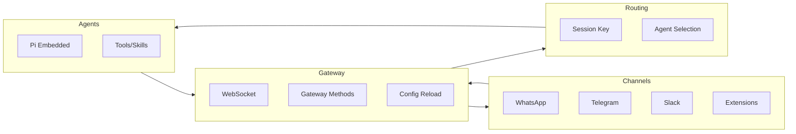

# OpenClaw（Clawdbot）产品需求与技术架构主文档

**版本**：1.0  
**基于**：OpenClaw 源码阅读（learn_openclaw / openclaw）  
**说明**：本文档为高层需求与技术架构总览；各模块的细节设计由后续分文档在深入阅读源码后撰写。

---

## 一、需求

### 1.1 产品定位与目标用户

- **产品定位**：Clawdbot 是一款**本地优先的个人 AI 助手**，用户在自己设备上运行，在已有通讯渠道上统一对话。
- **核心价值**：在 WhatsApp、Telegram、Slack、Discord、Signal、iMessage、Teams、WebChat 等渠道收发消息，由单一控制面（Gateway）统一管理会话、通道与技能；支持多 Agent 路由、语音唤醒、画布与伴侣应用。
- **目标用户**：希望拥有私密、可自托管、多通道、单用户个人助手的用户。

### 1.2 核心功能域（大纲）

- **Gateway 控制面**：会话、通道、工具、事件、配置、Cron、Webhook、Control UI、Canvas 宿主。
- **多通道收件箱**：内置/扩展渠道（WhatsApp、Telegram、Slack、Discord、Signal、iMessage、BlueBubbles、Teams、Matrix、Zalo、WebChat、Voice Call 语音通话等）；群组路由、@ 提及门控、DM 配对策略。
- **多 Agent 路由**：按通道/账号/对等体路由到不同 Agent；Workspace + 每 Agent 独立会话。
- **会话模型**：Main 会话、群组会话、激活模式（mention/always）、队列与回复策略。
- **工具与技能**：浏览器、Canvas、Nodes、Cron、Sessions、Discord/Slack 等动作；Agent 间协调（sessions_list、sessions_history、sessions_send、sessions_spawn）；Skills 目录（托管/工作区技能，含 Python 技能如 local-places）；ClawdHub 技能注册表（自动搜索与拉取技能）。
- **记忆（Memory）**：基于 MEMORY.md 与会话转录的向量/混合检索；Embedding（OpenAI/Gemini）；Agent 侧 memory 工具与 session-memory 钩子；CLI `memory status/index/search`；自动回复回合后的 memory flush/compaction。
- **媒体与多模态理解**：媒体管道（图/音/视频大小限制、临时文件生命周期）；Media-understanding（image/audio/video 描述与转录、多提供商）。
- **人机界面**：CLI（`clawdbot` 子命令：onboard、gateway、agent、message、doctor、channels、models、plugins、memory、hooks、cron 等）、TUI、Web Control UI、伴侣应用（macOS 菜单栏、iOS/Android）；渠道内 Chat commands（/status、/new、/compact、/think、/verbose、/usage、/restart、/activation 等）。
- **安全与合规**：DM 配对策略（pairing/open）、allowlist、执行审批（approvals）、`clawdbot doctor` 风险检查。
- **扩展与自动化**：Plugins 插件体系（加载、slots、extensions 注册）；Hooks 事件钩子（如 session-memory、llm-slug）；Cron 定时任务；Webhooks/Gmail Pub/Sub；Daemon（Gateway 以 launchd/systemd 服务运行）；Sandbox（Docker 等执行沙箱）。
- **外部协议**：ACP（Agent Control Protocol）供外部 Agent 客户端通过标准协议连接 Gateway。

### 1.3 非功能需求（概要）

- **本地优先**：配置与会话数据本地存储；Gateway 可本地或远程运行。
- **运行环境**：Node ≥22；推荐 pnpm；支持 macOS、Linux、Windows（WSL2 推荐）。
- **模型与鉴权**：支持多模型配置、OAuth/API Key、按 Agent 的模型与鉴权顺序（含 failover）。
- **远程访问**：Tailscale Serve/Funnel 或 SSH 隧道暴露 Gateway；开发渠道（stable/beta/dev）与 `clawdbot update --channel`。

---

## 二、技术架构

### 2.1 技术栈与仓库结构

- **主技术栈**：TypeScript/Node.js（ESM，Node ≥22.12），包管理 pnpm；Monorepo（根包 + `ui` + `extensions/*`）。
- **入口**：CLI 二进制 `clawdbot` → `openclaw/src/entry.ts` → `openclaw/src/index.ts`；主逻辑加载配置、Session Store、Gateway、channel-web、auto-reply、CLI 等。
- **仓库结构概要**：
  - **openclaw/src/**：Gateway、Agents（Pi 嵌入式）、Channels（插件类型与 dock）、Sessions、Config、Routing、Web（含 auto-reply）、CLI、TUI、Control UI、Canvas Host、Memory、Media、Plugins、Hooks、ACP 等。
  - **openclaw/ui/**：Vite 前端，与 Gateway 配合的控制/配置界面。
  - **openclaw/extensions/**：各渠道扩展（如 telegram、slack、signal、whatsapp、discord、msteams、matrix、zalo、zalouser、voice-call 语音通话、nostr 等），通过 `clawdbot.plugin.json` 等注册。
  - **openclaw/skills/**：技能定义（SKILL.md + 脚本/服务），部分为 Python（如 local-places）。
  - **openclaw/apps/**：macOS、iOS、Android 原生应用。

### 2.2 架构分层与数据流

- **Gateway**：HTTP + WSS 服务（`openclaw/src/gateway/server.impl.ts`、`openclaw/src/gateway/server-http.ts`）；通过 JSON-RPC 风格 Gateway Methods（chat、talk、sessions、config、agents 等）提供控制面；配置热更见 `openclaw/src/gateway/config-reload.ts`。
- **Channels**：插件化 ChannelPlugin（`openclaw/src/channels/plugins/types.plugin.ts`）（config、gateway、outbound、pairing、security、groups 等适配器）；内置与扩展通过 registry/dock 注册；发件经 `openclaw/src/infra/outbound` 按 deliveryMode（direct/gateway/hybrid）投递。
- **Agents**：Pi 嵌入式运行时（`openclaw/src/agents/pi-embedded.ts`），进程内队列化执行（session lane），事件订阅与 tool streaming 在 `openclaw/src/agents/pi-embedded-subscribe*.ts`；由 CLI agent、auto-reply、cron、hooks 等触发。
- **Sessions**：SessionEntry 与 main/group 会话 key 在 `openclaw/src/config/sessions`、`openclaw/src/routing`；群组激活策略在 `openclaw/src/web/auto-reply/monitor/group-activation.ts`。
- **Memory**：`openclaw/src/memory/` 提供向量/混合检索（sqlite-vec、BM25）、MEMORY.md 与会话转录索引、OpenAI/Gemini embedding 批处理；Agent 通过 `openclaw/src/agents/memory-search.ts`、`openclaw/src/agents/tools/memory-tool.ts` 与 `openclaw/src/hooks/bundled/session-memory/` 使用记忆；CLI 见 `openclaw/src/cli/memory-cli.ts`。
- **Media**：媒体管道与 `openclaw/src/media-understanding/`（image/audio/video 描述与转录、大小与超时限制、多提供商）在入站与 Agent 上下文前应用。
- **Plugins / Hooks**：插件在 `openclaw/src/plugins/` 加载与 slots 管理；Hooks 在 `openclaw/src/hooks/` 按事件（如 command:new）触发；扩展通过 `clawdbot.plugin.json` 注册。
- **ACP**：`openclaw/src/acp/` 实现 Agent Control Protocol 服务端，连接 Gateway，供外部 ACP 客户端接入。
- **Presence / Typing**：在线状态与打字指示（`openclaw/src/infra/system-presence.ts`、`openclaw/src/auto-reply/reply/typing.ts`）；Usage tracking 展示每轮 token/成本；Session pruning 与会话压缩（compaction）；Retry policy（`openclaw/src/infra/retry.ts`、`retry-policy.ts`）。
- **Tailscale**：`openclaw/src/infra/tailscale.ts` 支持 Gateway 远程暴露（Serve/Funnel）。
- **配置**：单一 ClawdbotConfig（`openclaw/src/config/types.clawdbot.ts`）（auth、models、agents、channels、session、skills、plugins 等）；从 `openclaw/src/config/io.ts` 加载/写入，校验与合并见 config 模块。

### 2.3 模块与文档映射（供后续分文档使用）

| 主 PRD 中的模块 | 源码主要位置 | 后续分文档建议 |
| ------------------ | ------------------------------------------------------- | ----------------------------- |
| Gateway | openclaw/src/gateway/ | Gateway 控制面、协议、WS、Methods |
| Channels | openclaw/src/channels/, openclaw/extensions/* | 通道插件模型、outbound、配对与安全 |
| Agents | openclaw/src/agents/, openclaw/src/commands/ | Pi 嵌入式、工具流、CLI agent |
| Sessions & Routing | openclaw/src/config/sessions/, openclaw/src/routing/, openclaw/src/web/auto-reply/ | 会话模型、路由、群组策略 |
| **Memory（记忆）** | openclaw/src/memory/, openclaw/src/agents/memory-search.ts, openclaw/src/agents/tools/memory-tool.ts, openclaw/src/auto-reply/reply/memory-flush*, openclaw/src/hooks/bundled/session-memory/ | 向量/混合检索、索引与同步、embedding、Agent 工具与钩子 |
| Media & Media-understanding | openclaw/src/media/, openclaw/src/media-understanding/ | 媒体管道、多模态理解与转录 |
| Config | openclaw/src/config/ | 配置结构、加载、校验、热更 |
| CLI | openclaw/src/cli/ | 子命令与入口 |
| Web / Control UI | openclaw/src/control-ui/, openclaw/src/web/, openclaw/ui/ | Control UI、WebChat、auto-reply |
| Skills & Tools | openclaw/skills/, openclaw/src/agents/tools/ | 技能契约、工具暴露与 Pi 适配 |
| Plugins | openclaw/src/plugins/, openclaw/src/plugin-sdk/ | 插件加载、slots、extensions 注册 |
| Hooks | openclaw/src/hooks/ | 事件钩子、bundled 实现、hooks CLI |
| Cron / Webhooks | openclaw/src/cron/, webhooks 相关 | 定时任务、Webhook、Gmail Pub/Sub |
| Daemon | openclaw/src/daemon/ | Gateway 服务安装与生命周期 |
| Sandbox & Approvals | openclaw/src/agents/sandbox/, openclaw/src/gateway/server-methods/exec-approvals.ts | 执行沙箱、exec 审批 |
| Pairing | openclaw/src/pairing/ | DM 配对、allowlist 存储 |
| ACP | openclaw/src/acp/ | Agent Control Protocol 桥接 |

---

## 三、附录

### 3.1 术语表

| 术语 | 简要说明 |
| ----- | ----- |
| Gateway | 本地优先的控制平面，提供 WebSocket + JSON-RPC 方法，管理会话、通道、配置、Cron、事件等。 |
| Session | 一次对话会话，由 session key 标识（如 agent:main:main、agent:id:channel:group:groupId）；含 main 会话与群组会话。 |
| Agent | 配置的 AI 助手实例，绑定 workspace，拥有独立会话与模型配置。 |
| Channel | 通讯渠道（WhatsApp、Telegram、Slack 等），以 ChannelPlugin 形式注册，负责入站/出站与配对等。 |
| Skill | 可被 Agent 调用的能力单元，由 SKILL.md 描述，常带脚本或服务（含 Python）。 |
| Memory | 基于 MEMORY.md 与会话转录的向量/混合检索与索引，供 Agent 与钩子使用。 |
| Hook | 按事件触发的扩展点（如 command:new），如 session-memory、llm-slug。 |
| ACP | Agent Control Protocol，供外部客户端通过标准协议连接 Gateway。 |
| Presence | 客户端在线状态，Gateway 用于管理连接与心跳。 |
| Chat command | 渠道内用户命令，如 /new、/compact、/think、/verbose、/usage、/restart、/activation 等。 |
| ClawdHub | 技能注册表，支持自动搜索与拉取技能。 |

### 3.2 参考

- 项目 README：`openclaw/README.md`
- 官方文档：<https://docs.clawd.bot>
- 入门：<https://docs.clawd.bot/start/getting-started>

### 3.3 相关文档

技术设计总览与各模块主文档、子文档：

- [01-技术设计总览](01-技术设计总览.md)
- [02-Gateway](02-Gateway.md)（含 [协议与Schema](02-Gateway/协议与Schema.md)、[WebSocket与连接](02-Gateway/WebSocket与连接.md)、[Methods与RPC](02-Gateway/Methods与RPC.md)、[配置热更与侧车](02-Gateway/配置热更与侧车.md)）
- [03-Channels](03-Channels.md)（含 [插件模型与适配器](03-Channels/插件模型与适配器.md)、[Outbound与配对](03-Channels/Outbound与配对.md)）
- [04-Agents](04-Agents.md)（含 [Pi嵌入式运行时](04-Agents/Pi嵌入式运行时.md)、[工具流与订阅](04-Agents/工具流与订阅.md)、[技能与Pi适配](04-Agents/技能与Pi适配.md)）
- [05-Sessions与Routing](05-Sessions与Routing.md)
- [06-Memory](06-Memory.md)（含 [索引与检索](06-Memory/索引与检索.md)、[Embedding与同步](06-Memory/Embedding与同步.md)）
- [07-Media与Media-understanding](07-Media与Media-understanding.md)
- [08-Config](08-Config.md)
- [09-CLI](09-CLI.md)
- [10-Web与Control-UI](10-Web与Control-UI.md)
- [11-Skills与Tools](11-Skills与Tools.md)
- [12-Plugins](12-Plugins.md)
- [13-Hooks](13-Hooks.md)
- [14-Cron与Webhooks](14-Cron与Webhooks.md)
- [15-Daemon](15-Daemon.md)
- [16-Sandbox与Approvals](16-Sandbox与Approvals.md)
- [17-Pairing](17-Pairing.md)
- [18-ACP](18-ACP.md)
