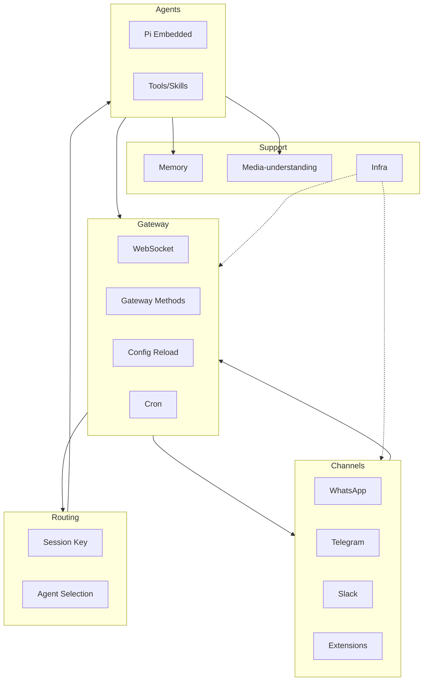

# OpenClaw 技术设计总览

**版本**：1.0  
**基于**：[PRD/00-主PRD.md](00-主PRD.md) 与 OpenClaw 源码  
**说明**：本文档描述 OpenClaw（Clawdbot）的整体设计思想、架构决策、核心数据流与模块边界，并索引各模块技术设计文档。

---

## 一、设计思想

OpenClaw 遵循以下核心设计原则：

1. **本地优先**：配置与会话数据存储在用户本地（`~/.clawdbot/`、workspace）；Gateway 默认绑定 loopback，可选择性通过 Tailscale 或 SSH 隧道暴露；无强制云端依赖。
2. **Gateway 仅作控制面**：Gateway 不承载业务逻辑，只提供 WebSocket + JSON-RPC 风格 Methods，协调会话、通道、配置、Cron、事件；实际 Agent 运行、Channel 连接、工具执行由各自模块完成。
3. **多通道统一收件箱**：各渠道（WhatsApp、Telegram、Slack 等）以 ChannelPlugin 形式注册，入站消息经统一路径进入 auto-reply，由路由解析 session key 后分发给 Agent。
4. **Agent 进程内队列化**：Pi Agent 以嵌入式方式运行，同一 session 的请求通过 session lane 串行执行（`enqueueCommandInLane`），避免并发冲突。
5. **配置单文件与热更**：单一 `ClawdbotConfig`（`clawdbot.json`）承载全部配置；Gateway 通过 `config-reload` 监听文件变化并热更，无需重启。

---

## 二、架构图与数据流

### 2.1 主架构图



### 2.2 核心数据流

**入站消息流**：

```
Channel 入站 → monitorWebInbox / 各 channel monitor
  → 路由解析 (resolveAgentRoute) → Session Key
  → handleCommands（Chat 命令）或 getReplyFromConfig（Agent 回复）
  → runEmbeddedPiAgent（Pi 嵌入式）
  → 工具调用 / Memory 检索 / Media 理解
  → deliver-reply → Channel Outbound
```

**关键路径**：

- **Monitor**：`openclaw/src/web/auto-reply/monitor.ts` 的 `monitorWebChannel` 调用 `monitorWebInbox`，接收消息后经 `createWebOnMessageHandler` 处理。
- **路由**：`openclaw/src/routing/resolve-route.ts` 的 `resolveAgentRoute` 根据 channel、account、peer 解析出 `sessionKey` 与 `agentId`。
- **命令 vs 回复**：`openclaw/src/auto-reply/reply/commands-core.ts` 的 `handleCommands` 处理 `/status`、`/new`、`/compact` 等；否则走 `getReplyFromConfig` → `runPreparedReply` → `runEmbeddedPiAgent`。
- **出站**：`openclaw/src/infra/outbound/` 的 `deliverOutboundPayloads` 按 channel 的 `deliveryMode`（direct/gateway/hybrid）投递。

### 2.3 Auto-reply 端到端流程

```
入站消息
  → web/auto-reply/monitor 接收
  → inbound debounce、group-gating、mention 检查
  → resolveAgentRoute 得到 sessionKey、agentId
  → handleCommands：若为 Chat 命令，直接处理并返回
  → 否则：getReplyFromConfig
    → finalizeInboundContext（媒体、模板）
    → applyMediaUnderstanding（图/音/视频理解）
    → resolveReplyDirectives（指令解析）
    → runPreparedReply → runEmbeddedPiAgent
    → 流式回调：typing、onPartialReply、onBlockReply
    → memory-flush（回合后 compaction）
  → deliverWebReply / 各 channel 的 send
```

---

## 三、模块边界与依赖

| 模块 | 职责 | 消费方 | 依赖 |
|------|------|--------|------|
| Config | 加载、校验、合并 ClawdbotConfig | Gateway、CLI、Channels、Agents、所有模块 | - |
| Gateway | 控制面、WS、Methods、Cron、健康、侧车 | CLI、UI、Channels、Agents、Nodes | Config、Plugins |
| Channels | 入站/出站、配对、安全 | Gateway、auto-reply | Config、Infra/outbound、Pairing |
| Routing | 解析 session key、agent 路由 | auto-reply、Gateway | Config/sessions |
| Agents | Pi 嵌入式、工具、技能 | CLI、auto-reply、Cron、Hooks | Config、Gateway、Memory、Channels |
| Memory | 向量/混合检索、索引、embedding | Agents、auto-reply、Hooks | Config、Media |
| Media-understanding | 图/音/视频描述与转录 | auto-reply、Agents | Config |
| Plugins | 加载、slots、extensions | Gateway、Channels | Config |
| Hooks | 事件钩子 | auto-reply、Gateway | Config |

**配置加载**：`openclaw/src/config/io.ts` 的 `loadConfig` 从 `~/.clawdbot/clawdbot.json` 读取；Gateway 的 `startGatewayConfigReloader` 监听文件变化并触发重载。

---

## 四、Infra 模块概述

| Infra 子模块 | 职责 | 消费方 |
|--------------|------|--------|
| outbound | 消息投递、targets、deliveryMode | Channels |
| tailscale | Gateway 远程暴露（Serve/Funnel） | Gateway |
| retry / retry-policy | 重试策略 | Channels、Agents |
| system-presence | 客户端在线状态 | Gateway |
| agent-events | Agent 事件广播 | Gateway、auto-reply |
| heartbeat-runner | 心跳与唤醒 | Gateway、Cron |
| control-ui-assets | Control UI 静态资源 | Gateway |
| bonjour-discovery | 设备发现 | Nodes |
| path-env、ports、binaries | 运行时环境 | CLI、Gateway |

---

## 五、关键实现决策

1. **JSON-RPC 风格 Methods**：Gateway 通过 `listGatewayMethods` 注册方法，WS 消息经 `message-handler` 解析后调用 `coreGatewayHandlers`；请求/响应为 JSON 对象，事件通过 `GATEWAY_EVENTS` 下发。
2. **ChannelPlugin 适配器契约**：每个 Channel 实现 `ChannelPlugin`，提供 config、gateway、outbound、pairing、security 等适配器；内置渠道在 `src/`，扩展在 `extensions/*`，通过 `clawdbot.plugin.json` 注册。
3. **Session lane 串行**：`enqueueCommandInLane(sessionLane, ...)` 确保同一 session 的 Agent 请求串行执行，避免 transcript 与状态冲突。
4. **Embedding 批处理与混合检索**：Memory 使用 `batch-openai`、`batch-gemini` 批量生成 embedding；检索时 `searchVector`（sqlite-vec）与 `searchKeyword`（BM25）合并为 hybrid 结果。

---

## 六、文档索引

| 文档 | 说明 |
|------|------|
| [00-主PRD.md](00-主PRD.md) | 产品需求与技术架构主文档 |
| [02-Gateway.md](02-Gateway.md) | Gateway 控制面、协议、WS、Methods、配置热更与侧车 |
| [02-Gateway/协议与Schema.md](02-Gateway/协议与Schema.md) | 协议帧、Schema、protocol-gen |
| [02-Gateway/WebSocket与连接.md](02-Gateway/WebSocket与连接.md) | WS 连接、认证、presence |
| [02-Gateway/Methods与RPC.md](02-Gateway/Methods与RPC.md) | Gateway Methods、调用路径 |
| [02-Gateway/配置热更与侧车.md](02-Gateway/配置热更与侧车.md) | config-reload、sidecars |
| [03-Channels.md](03-Channels.md) | 通道插件模型、Outbound、配对 |
| [04-Agents.md](04-Agents.md) | Pi 嵌入式、工具流、技能 |
| [05-Sessions与Routing.md](05-Sessions与Routing.md) | 会话模型、路由、群组策略 |
| [06-Memory.md](06-Memory.md) | 记忆、索引、Embedding |
| [07-Media与Media-understanding.md](07-Media与Media-understanding.md) | 媒体管道、多模态理解 |
| [08-Config.md](08-Config.md) | 配置结构、加载、校验、热更 |
| [09-CLI.md](09-CLI.md) | CLI 子命令、commands 实现层 |
| [10-Web与Control-UI.md](10-Web与Control-UI.md) | Web、Control UI、TUI、Chat commands |
| [11-Skills与Tools.md](11-Skills与Tools.md) | 技能、工具、ClawdHub |
| [12-Plugins.md](12-Plugins.md) | 插件加载、slots、extensions |
| [13-Hooks.md](13-Hooks.md) | 事件钩子、bundled 实现 |
| [14-Cron与Webhooks.md](14-Cron与Webhooks.md) | 定时任务、Webhook、Gmail |
| [15-Daemon.md](15-Daemon.md) | Gateway 服务安装与生命周期 |
| [16-Sandbox与Approvals.md](16-Sandbox与Approvals.md) | 执行沙箱、exec 审批 |
| [17-Pairing.md](17-Pairing.md) | DM 配对、allowlist |
| [18-ACP.md](18-ACP.md) | Agent Control Protocol 桥接 |
