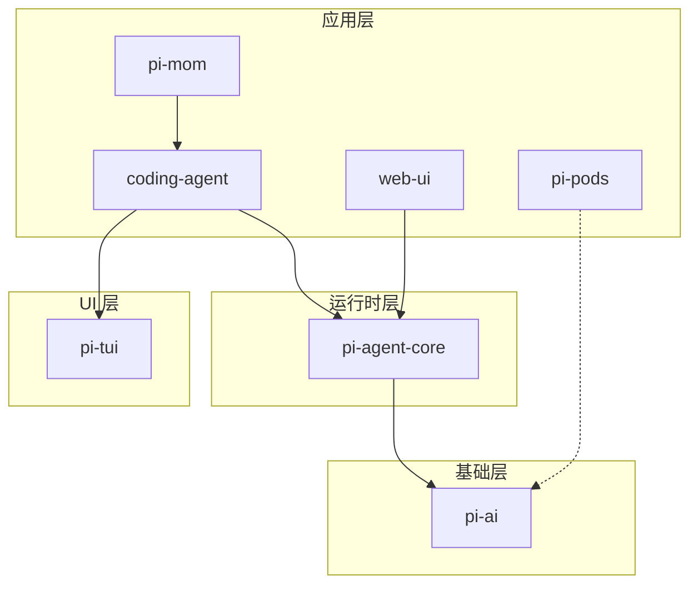
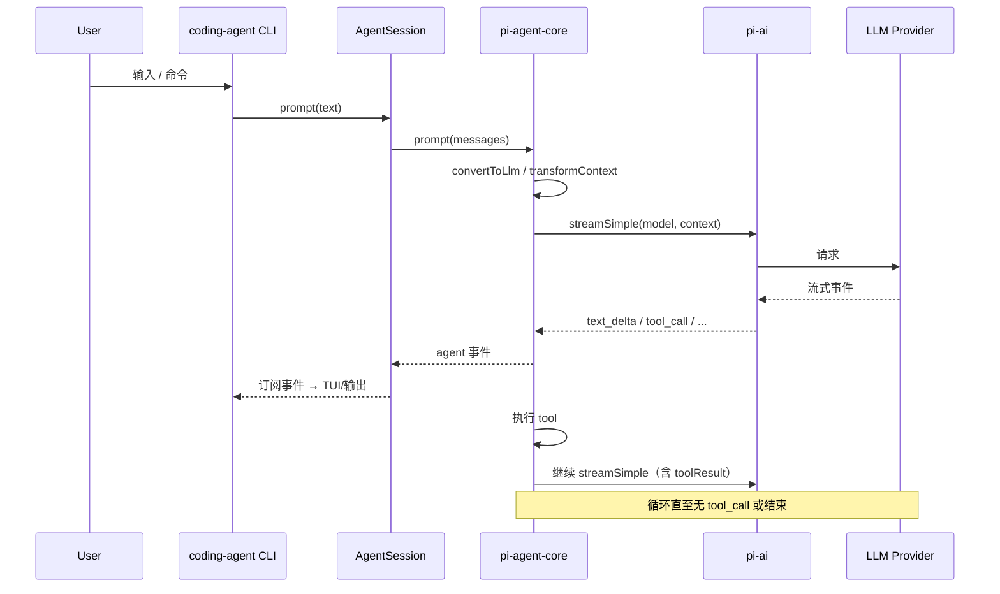

# pi-mono 技术总览

本文档为 pi-mono 仓库的技术架构主文档，总览技术栈、仓库结构、设计思想与包依赖；各模块细节见分文档。

---

## 1. 仓库定位

**pi-mono**（Pi Monorepo）是一套用于构建 AI Agent 与管理 LLM 部署的工具链，核心产品为 **pi** 交互式编码 Agent CLI，并提供统一 LLM API、Agent 运行时、终端/Web UI 组件、Slack Bot 与 GPU Pod 部署能力。

- **技术栈**：TypeScript/Node.js，ESM，Node ≥20；npm workspaces 管理 Monorepo。
- **设计原则**：统一 LLM 抽象（pi-ai）→ 通用 Agent 循环与事件（pi-agent-core）→ 可扩展 CLI/Web（coding-agent、web-ui）；coding-agent 强调通过扩展/技能适配工作流，而非修改内核。

---

## 2. 包列表与职责

| 包 | 说明 |
|----|------|
| **@mariozechner/pi-ai** | 统一多 Provider LLM API（OpenAI、Anthropic、Google、Bedrock 等），stream/complete、Context/Tools、TypeBox、跨 Provider 会话交接 |
| **@mariozechner/pi-agent-core** | 有状态 Agent 运行时：tool 执行、事件流，基于 pi-ai |
| **@mariozechner/pi-coding-agent** | 交互式编码 Agent CLI（`pi`），四种模式：交互 / print / JSON / RPC；Extensions、Skills、Prompt 模板、Themes |
| **@mariozechner/pi-tui** | 终端 UI 框架：差分渲染、CSI 2026 同步输出、组件化 |
| **@mariozechner/pi-web-ui** | Web 聊天组件（mini-lit + Tailwind），ChatPanel、IndexedDB 存储，基于 pi-agent-core + pi-ai |
| **@mariozechner/pi-mom** | Slack Bot，将消息委托给 pi coding agent，自管理工具与工作区、Docker 沙箱 |
| **@mariozechner/pi-pods** | GPU Pod 上 vLLM 部署与管理，OpenAI 兼容 API |

---

## 3. 架构与数据流

### 3.1 包依赖关系



### 3.2 从 LLM 到 Agent 到 CLI/Web 的数据流



---

## 4. Monorepo 结构（概要）

```
pi-mono/
  package.json          # workspaces: packages/*, 构建顺序 tui → ai → agent → coding-agent → mom → web-ui → pods
  packages/
    ai/                 # 统一 LLM API
    agent/              # Agent 运行时
    coding-agent/       # pi CLI、SDK、Interactive/Print/RPC 模式
    tui/                # 终端 UI 库
    web-ui/             # Web 组件与 example
    mom/                # Slack Bot
    pods/               # vLLM Pod 管理
```

构建顺序体现依赖：tui、ai 无 pi-* 依赖；agent 依赖 ai；coding-agent 依赖 agent 与 tui；web-ui 依赖 agent；mom 依赖 coding-agent。

---

## 5. 分文档索引

| 文档 | 内容 |
|------|------|
| [01-pi-ai 包](01-pi-ai%20包.md) | 多 Provider 抽象、Api/Model/Context、stream/complete/streamSimple、Tools 与 TypeBox、事件与跨 Provider 交接 |
| [02-pi-agent-core 包](02-pi-agent-core%20包.md) | Agent 类、agent-loop、convertToLlm/transformContext、事件流与 tool 执行 |
| [03-pi-coding-agent 包](03-pi-coding-agent%20包.md) | CLI 入口、createAgentSession、AgentSession、ResourceLoader、运行模式、内置工具与扩展 |
| [04-tui 与 web-ui](04-tui%20与%20web-ui.md) | pi-tui 差分渲染与组件、pi-web-ui ChatPanel 与存储 |
| [05-mom 与 pods](05-mom%20与%20pods.md) | pi-mom Slack 集成与沙箱、pi-pods vLLM 部署 |

---

## 6. 开发与构建

- **安装**：`npm install`（根目录）
- **构建**：`npm run build`（按依赖顺序构建各包）
- **检查**：`npm run check`（需先 build；Biome + 类型检查）
- **运行 pi 源码**：`./pi-test.sh`（需在仓库根目录）

各包版本锁步（lockstep），发布时统一升版本。
