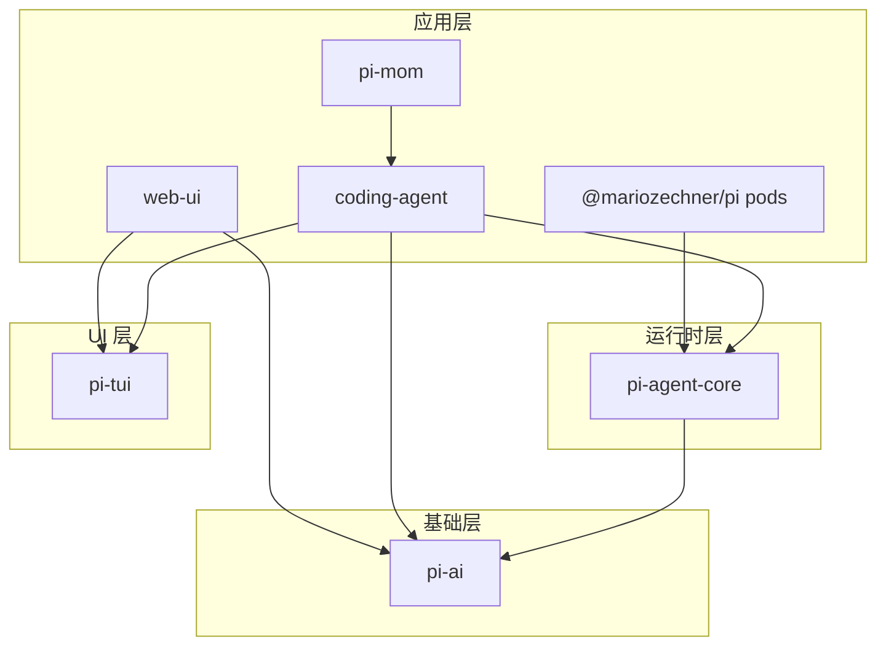
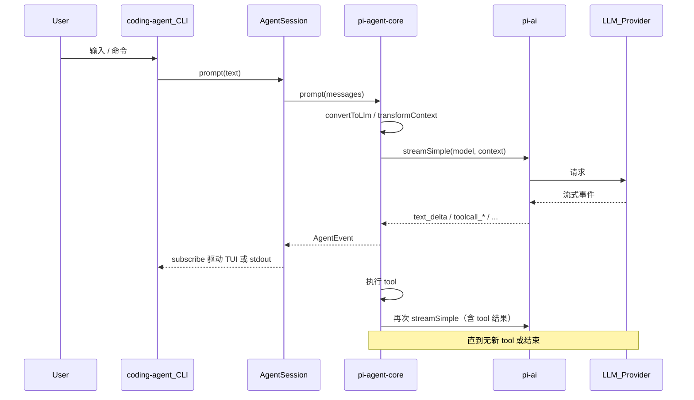

# pi-mono 技术总览

## 先用大白话

**pi-mono** 是一个大工具箱：里面有几块「积木」。一块负责跟各家大模型说话（pi-ai），一块负责「模型想调用工具时怎么跑循环」（pi-agent-core），一块是你在终端里用的 **pi** 命令行（pi-coding-agent），还有画图形的终端 UI、网页聊天组件、Slack 机器人、以及在 GPU 机器上管 vLLM 的小程序。

可以把它想成一家餐厅：**pi-ai** 是对外电话（打给 OpenAI、Anthropic 等），**pi-agent-core** 是后厨流程（点菜、上菜、撤盘），**pi-coding-agent** 是前台收银兼服务员（你天天交互的那一位）。

更细的分包说明见下文表格与分文档；**本篇负责定调**，避免各篇各说各话。

---

## 往里说：仓库定位与技术栈

- **语言与运行时**：TypeScript，ESM，`package.json` 里要求 **Node ≥ 20**。
- **仓库形态**：npm **workspaces**；除 `packages/*` 外，根配置里还挂了一些 **示例扩展/示例应用** 子目录（便于本地联调），日常心智模型仍以 `packages/` 下七个主包为主。
- **设计顺序（概念上）**：统一 LLM 抽象（pi-ai）→ 通用 Agent 循环与事件（pi-agent-core）→ 可扩展 CLI/Web（coding-agent、web-ui）；**尽量用扩展/技能改行为，少改内核**。

---

## 包列表与职责（与源码 `name` 一致）

| npm 包名（`packages/*/package.json`） | 目录 | 一句话 |
|--------------------------------------|------|--------|
| **@mariozechner/pi-ai** | `packages/ai/` | 多厂商 LLM 统一 API：流式/补全、Context、Tools |
| **@mariozechner/pi-agent-core** | `packages/agent/` | 有状态 Agent：工具执行、事件流，站在 pi-ai 之上 |
| **@mariozechner/pi-coding-agent** | `packages/coding-agent/` | **pi** CLI 与 SDK：交互 / 打印 / JSON / RPC |
| **@mariozechner/pi-tui** | `packages/tui/` | 终端 UI：差分渲染、CSI 2026 同步输出 |
| **@mariozechner/pi-web-ui** | `packages/web-ui/` | 网页侧聊天与附件等 UI（Web Components + Tailwind） |
| **@mariozechner/pi-mom** | `packages/mom/` | Slack Bot，把工作交给 coding-agent 那套能力 |
| **@mariozechner/pi** | `packages/pods/` | **注意**：目录叫 `pods`，但 npm 包名是 **`@mariozechner/pi`**；安装后提供的 CLI 里包含 `pi pods`、`pi start` 等，与 **全局安装 `pi-coding-agent` 得到的 `pi`** 是**不同 npm 包**，同时装时要分清 PATH。 |

---

## ASCII：包之间谁依赖谁（简图）

```
                    +----------+
                    |  pi-ai   |  <- 只负责「跟模型说话」
                    +----+-----+
                         ^
         +---------------+---------------+
         |               |               |
  +------+------+ +------+------+ +------+------+
  | pi-agent-core | | pi-web-ui  | |  @mariozechner/pi |
  | (packages/    | | (浏览器 UI) | | (packages/pods)   |
  |  agent/)      | | 依赖 pi-ai  | | 依赖 pi-agent-core|
  +-------+-------+ | + pi-tui 等| +-------------------+
          ^
          |
  +-------+-------+
  | pi-coding-    |  <- 终端里的 pi，依赖 agent-core + pi-tui + pi-ai
  | agent         |
  +-------+-------+
          ^
          |
    +-----+-----+
    |  pi-mom   |  <- Slack 侧再包一层
    +-----------+
```

说明：**pi-mom** 依赖 **pi-coding-agent**；**pods** 包（npm 名 `@mariozechner/pi`）依赖 **pi-agent-core**（用于 Pod 上 `pi agent` 等能力），**不**直接依赖 pi-ai。

---

## Mermaid：依赖关系（与上面对齐）



---

## ASCII：从你敲一行字到模型回复（主路径）

```
  你          pi CLI           AgentSession        Agent           pi-ai          云端模型
  |        (coding-agent)        |                |               |                |
  +-- 输入 ----------------------->+-- prompt ----->+-- prompt ---->+-- streamSimple >+---- HTTP ---->
  |                              |                |               |                |
  +<-- 终端刷新 / 打印输出 --------+<-- subscribe ---+<-- AgentEvent -+<-- text/tool  ---+
```

循环里若模型要跑工具：Agent 执行 tool，再把结果塞回上下文，继续调用 pi-ai，直到本轮不再产生新的 tool call 或会话结束（细节见 [02](02-pi-agent-core%20包.md)、[03](03-pi-coding-agent%20包.md)）。

---

## Mermaid：时序（与源码模块名一致）



---

## Monorepo 目录（概要）

```
pi-mono/
  package.json       # workspaces + scripts（见下）
  pi-test.sh         # 从源码跑 pi 的辅助脚本
  packages/
    ai/              # @mariozechner/pi-ai
    agent/           # @mariozechner/pi-agent-core
    coding-agent/    # @mariozechner/pi-coding-agent（命令 pi）
    tui/
    web-ui/
    mom/
    pods/            # npm 包名是 @mariozechner/pi，不是 pi-pods
```

根目录 **`npm run build`** 的**显式顺序**（见根 `package.json` 脚本）为：**tui → ai → agent → coding-agent → mom → web-ui → pods**。这与依赖方向一致：tui、ai 不依赖其它 workspace 包；agent 依赖 ai；coding-agent 依赖 agent 与 tui；web-ui 依赖 ai、tui；mom 依赖 coding-agent；pods 依赖 agent。

---

## 分文档索引

| 文档 | 内容 |
|------|------|
| [01-pi-ai 包](01-pi-ai%20包.md) | Provider、stream/streamSimple、类型与内置注册 |
| [02-pi-agent-core 包](02-pi-agent-core%20包.md) | Agent、agent-loop、事件与工具 |
| [03-pi-coding-agent 包](03-pi-coding-agent%20包.md) | CLI、`AgentSessionRuntime` 一脉、会话与扩展 |
| [04-tui 与 web-ui](04-tui%20与%20web-ui.md) | 终端 UI 与 Web 组件 |
| [05-mom 与 pods](05-mom%20与%20pods.md) | Slack 与 GPU Pod / vLLM |
| [storage-design-comparison](storage-design-comparison.md) | 与会话文件、其它项目存储对比 |

---

## 开发与构建（根目录命令）

- **安装依赖**：`npm install`
- **构建**：`npm run build`（按上面顺序逐包构建）
- **静态检查**：`npm run check`（Biome、`tsgo --noEmit`、浏览器 smoke、以及 `web-ui` 包内 check）；**文档不保证替你跑过**，改代码的人以仓库 CI/本地为准。
- **从源码试跑 pi**：仓库根目录 `./pi-test.sh`

各发布包 **版本号锁步**（lockstep），一次发布里各包 `version` 一起升。

---

## 对照源码时易错点（本目录已按此校正）

| 话题 | 说明 |
|------|------|
| **pods 包名** | npm 为 **`@mariozechner/pi`**，目录为 `packages/pods/`；CLI 帮助里显示 `pi v…` 指该包提供的 `pi` 可执行文件。 |
| **workspaces** | 除 `packages/*` 外还有若干 **examples** 路径挂在 workspaces 里，属正常。 |
| **web-ui 依赖** | `package.json` 显式列出 **pi-ai、pi-tui** 等；源码会 **re-export** `pi-agent-core` 的类型，阅读代码时仍会看到 agent-core。 |
| **CLI 主流程** | `main.ts` 通过 **`createAgentSessionRuntime` / `createAgentSessionServices` / `createAgentSessionFromServices`** 组装会话，不再是一行 `createAgentSession` 走到底（SDK 里仍有对外的 `createAgentSession` 能力，见 [03](03-pi-coding-agent%20包.md)）。 |
