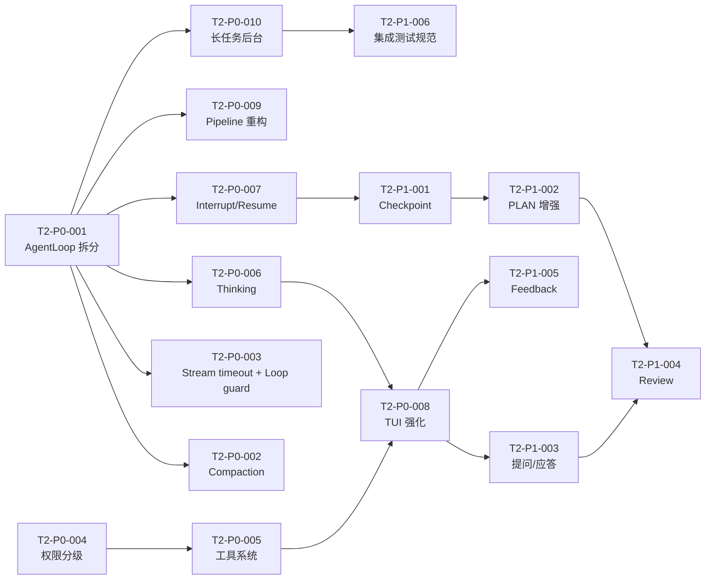

# 任务总看板 — 002-single-agent-complete

> 当前迭代：**单 Agent 完善期**。本看板同时承载迭代立项（目标/不做范围/验收/风险）与执行调度，不再拆分 `openspec/changes/00X` 四件套。
>
> 历史迭代已归档，本看板只聚焦当前迭代的立项与执行。

---

## 1. 迭代立项块

| 字段 | 值 |
|------|----|
| **迭代代号** | `002-single-agent-complete` |
| **启动日期** | 2026-04-22 |
| **迭代主题** | 把单 Agent 的基础体验、状态管理、任务循环做到极致，再考虑扩展到多 Agent / Skill / 插件生态 |
| **对应档位** | P0（基础体验）+ P1（状态管理） |
| **路线图** | [`openspec/specs/Product_Brief.md`](../openspec/specs/Product_Brief.md)（P0-P9 执行编排） |

### 1.1 迭代目标

1. **单 Agent 基础体验无 P0 bug**：工具授权、工作目录权限、中断/恢复、长任务后台化、TUI 体验 6 个方向全部达标；
2. **摘要与 compaction 行为对齐** [`docs/reports/compaction-prompt-cc-vs-pi.md`](../docs/reports/compaction-prompt-cc-vs-pi.md) §5.3/§5.4，升级 9 节模板 + 禁 tools 调用 + context v2 剩余落地；
3. **Agent Loop 模块化**：`src/core/agent_loop/run.rs`（832 行）拆为 dispatcher / tool_exec / stream_handler / error_classifier 子模块；三套管道（`src/ext/`）语义统一；
4. **Thinking API + 展示**：`src/core/llm/` 接入 Claude/GPT/Qwen 的 thinking 协议，TUI 支持可折叠展示；
5. **状态管理**：Checkpoint 机制 + 断点续跑、PLAN 模式增强、提问/应答机制、结果验证 review 子流程、Feedback 回路、集成测试规范 6 个方向全部达标；
6. **交付口径**：16 个 T2-P0/P1 任务全部 DONE；macOS/Linux 上单 Agent 可连续运行 ≥ 4 小时不退化；compaction 触发不产生死循环。

### 1.2 不做的范围

与 `Product_Brief.md` 新档位对齐，002 迭代明确**不做**：

1. **多 Agent / Agent 编排 / 安全体系 / 多会话**（P5）；
2. **插件系统新特性**（冻结区，P6；只做 T-001 VMActor shutdown 等维护性修复）；
3. **Skill 系统**（P2）；
4. **记忆系统 / USER.md / MEMORY.md**（P3）；
5. **自进化 / 学习回路**（P4）；
6. **跨平台（WasmEdge 下载脚本、Android、openclaw 兼容）**（P7）；
7. **多 LLM 适配 / 多 IM 网关**（P8）；
8. **UI（Tauri、Android、插件可视化）**（P9）。

### 1.3 验收口径

1. 16 个 T2-P0/P1 任务全部标记 `DONE` 并通过 Nibbles 复核；
2. 单元测试覆盖率 ≥ 80%，集成测试（compaction、agent loop、权限、中断恢复）全部绿灯；
3. `docs/TODOS.md` 的 P0 条目逐项在看板中有对应 T2 任务闭环；
4. `openspec/specs/Product_Brief.md` 与本看板、`docs/TODOS.md` 在档位/映射上内部一致（归档回归检查通过）。

### 1.4 风险与应对

| 风险 | 影响 | 应对 |
|------|------|------|
| Agent Loop 拆分涉及核心路径，可能引入回归 | 高 | 拆分前先补集成测试；分模块递进合并，每次 PR 附 e2e 截图/日志 |
| Thinking API 在 OpenAI / Anthropic / Qwen 协议不统一 | 高 | 先定义内部 `ThinkingEvent` 抽象，Provider 侧做适配；TUI 折叠面板复用 render 层 |
| TUI 体验重构（T2-P0-008）影响面大 | 中 | 合并到单个 T2 任务统一推进；先冻结现有 render 逻辑，新增面板分层叠加 |
| Checkpoint 设计需共识 | 中 | 先出 design 草案进 `agents/plan/`，由 Nibbles 发起 review 后再开工 |
| Compaction prompt 改动可能触发旧 transcript 不兼容 | 中 | 保留旧摘要兜底路径，新 prompt 先做 A/B 观察 2 个会话周期 |
| 权限分级（T2-P0-004）与既有 4 原语 audit 日志耦合 | 中 | 先补 dry-run 模式，再切换；审计日志新增 `permission_level` 字段 |

### 1.5 优先级说明（必读）

> ⚠️ **本看板 P0/P1 含义与 `Product_Brief.md` 的 P0/P1 含义不同。**
>
> - `Product_Brief.md` P0-P9：**执行编排顺序**（全项目尺度），上一档完成后才投入下一档。
> - 本看板 P0 / P1：**当前迭代内部优先级**——`P0 = 当前迭代必做`，`P1 = 当前迭代应做`，两档都落在 `Product_Brief.md` 的 P0-P1 区间内。
> - `docs/TODOS.md` 采用 `Product_Brief.md` 同义的 P0-P9 十档。三处语义通过前缀 `T-XXX`（全集想法）→ `T2-PX-YYY`（当前迭代任务）→ 档位 `P0..P9` 三层映射保持一致，跨档映射见各任务「关联 TODOS」字段。

---

## 2. 当前迭代上下文

| 字段 | 值 |
|------|----|
| 当前迭代 | `002-single-agent-complete` |
| 规格文档 | [../openspec/specs/Product_Brief.md](../openspec/specs/Product_Brief.md) · [../openspec/specs/Architecture.md](../openspec/specs/Architecture.md) · [../openspec/specs/Constitution.md](../openspec/specs/Constitution.md) |
| 全集想法池 | [../docs/TODOS.md](../docs/TODOS.md) |
| 关键设计报告 | [compaction-prompt-cc-vs-pi.md](../docs/reports/compaction-prompt-cc-vs-pi.md) · [plugin_skills_first_principles_pi_rust_wasm.md](../docs/reports/plugin_skills_first_principles_pi_rust_wasm.md) · [llm-tool-rounds-cli-display-thinking-protocol.md](../docs/reports/llm-tool-rounds-cli-display-thinking-protocol.md) · [agent_error_handling_cross_repo.md](../docs/reports/agent_error_handling_cross_repo.md) |
| 协作约定 | [Dispatcher.md](./Dispatcher.md) · [Nibbles.md](./Nibbles.md) · [INTEGRATION_MERGE_AND_ACCEPTANCE.md](./INTEGRATION_MERGE_AND_ACCEPTANCE.md) · [Tom.md](./Tom.md) · [Jerry.md](./Jerry.md) · [Spike.md](./Spike.md) |

---

## 3. 任务状态说明

| 状态 | 含义 |
|------|------|
| **TODO** | 待认领 |
| **DOING** | 开发中（已认领） |
| **PENDING_INTEGRATION** | 等待集成测试与合并：工程师已在功能分支按 [INTEGRATION_MERGE_AND_ACCEPTANCE.md](./INTEGRATION_MERGE_AND_ACCEPTANCE.md) 完成集成与 E2E 全量验收并推送；等待 Nibbles 合并入 develop 并复核通过 |
| **BLOCKED** | 阻塞（需在「阻塞点」中说明原因） |
| **DONE** | 已完成（含集成测试通过） |

**典型流转**：`TODO → DOING → PENDING_INTEGRATION → DONE`。阻塞时可为 `DOING` / `PENDING_INTEGRATION` → `BLOCKED` → `DOING` / `PENDING_INTEGRATION`。仅状态为 `TODO` 且负责人为空的任务可被认领；`PENDING_INTEGRATION` 表示已交集成、不可认领。

---

## 4. 待办任务

> 按 P0 → P1 顺序与模块依赖排列。工程师按 [Dispatcher.md](./Dispatcher.md) 流程认领。
>
> 字段约定：`关联 TODOS` 字段列出 `docs/TODOS.md` 中对应 `#T-XXX` 条目，便于双向追溯。

---

### T2-P0-001 | agent-loop-modularization | Agent Loop 模块化拆分

| 字段 | 内容 |
|------|------|
| **优先级** | P0 |
| **状态** | `DOING` |
| **负责人** | Jerry |
| **分支** | `feature/agent-loop-split` |
| **阻塞点** | — |
| **关联 TODOS** | `#T-018`、`#T-019` |
| **关联报告** | [plan-mode-execution-playbook-T2-P0-001.md](../docs/reports/plan-mode-execution-playbook-T2-P0-001.md) — Cursor PLAN 模式执行步骤复盘（Phase A-F SOP）|
| **计划文档** | `~/.cursor/plans/agent-loop-modularization_e99e067f.plan.md` |

**目标**：把 832 行的 `src/core/agent_loop/run.rs` 拆为可独立测试的子模块，并为 `src/ext/dispatcher/` 做对等拆分，消除核心循环的维护阻力。

**子项**：
- [ ] 新建 `src/core/agent_loop/dispatcher.rs`：消息调度 / tool call 路由
- [ ] 新建 `src/core/agent_loop/tool_exec.rs`：工具执行与结果回注
- [ ] 新建 `src/core/agent_loop/stream_handler.rs`：`chat_stream` delta 处理 + `ToolCallDelta`
- [ ] 新建 `src/core/agent_loop/error_classifier.rs`：Retryable / Fatal / ToolError 分类
- [ ] `run.rs` 保留三层循环骨架 ≤ 300 行
- [ ] 补独立 `tests.rs` 子模块单测（遵循 [RUST_FILE_LINES_SPEC.md §A](../openspec/specs/guides/coding/RUST_FILE_LINES_SPEC.md)，业务源文件不内联 `#[cfg(test)] mod tests {...}`），覆盖 Steering / FollowUp / Abort 注入时序
- [ ] `src/ext/dispatcher/` 子模块化（消息分发 / hostcall / audit）

**依赖**：归档 001-mvp 中的 TASK-14（DONE）

**被依赖**：T2-P0-003、T2-P0-007

**协作接口**：
- 消费：`LlmProvider::chat_stream`、`EventBus`、`ToolRegistry`
- 提供：`AgentLoop::run` 签名保持不变；对外行为 / 事件发布完全等价

**验收标准**：
- `run.rs` ≤ 300 行；各子模块 ≤ 300 行
- `cargo test -p pi-rust-wasm core::agent_loop` 全绿
- 所有现有 E2E（chat / tool-call / interrupt）行为无变化
- clippy 全量规则无警告

---

### T2-P0-002 | compaction-prompt-and-ctx-v2 | 摘要 prompt 升级 + context v2 收尾

| 字段 | 内容 |
|------|------|
| **优先级** | P0 |
| **状态** | `TODO` |
| **负责人** | — |
| **分支** | `feature/compaction-prompt-9section` |
| **阻塞点** | — |
| **关联 TODOS** | `#T-040`、`#T-041`、`#T-043`、`#T-044`、`#T-136`、`#T-137`；继承归档 TASK-19 剩余 |
| **关联报告** | [compaction-prompt-cc-vs-pi.md](../docs/reports/compaction-prompt-cc-vs-pi.md) §5.3/§5.4 |

**目标**：把 `src/core/compaction/summary.rs` 的 5 节摘要模板升级为 9 节（对齐 CC）；Compaction 路径的 `ChatRequest` 显式不传 `tools` 并加首行禁工具声明；合并 TASK-19 的异步预热 / 级联降压 / 落盘剩余项。

**子项**：
- [ ] 9 节摘要模板：Intent / Key Technical Concepts / Files and Code Sections / Errors and Fixes / Problem Solving / All User Messages / Pending Tasks / Current Work / Optional Next Step（+ Errors Encountered / Recent User Messages 两节）
- [ ] Compaction 入口禁 tools：`ChatRequest { tools: None, tool_choice: None, .. }`；Prompt 首行追加 `Respond with text only. Do not call any tools.`
- [ ] 超大文件处理（>800K / 超预算）：fallback 到截断 + 哨兵消息，不再 panic
- [ ] 压缩任务失败重试：指数退避 3 次；失败时留痕 transcript
- [ ] 大文件多次编辑写入：分块落盘 + 合并锚点
- [ ] 先写分析草稿再输出摘要正文（Two-pass summary）
- [ ] 回归集成测试：`tests/compaction/*` 全绿

**依赖**：T2-P0-001（Agent Loop 拆分后便于替换 compaction 注入点）

**被依赖**：T2-P1-001（Checkpoint 依赖新摘要锚点）

**协作接口**：
- 消费：`src/core/llm/`、`src/core/compaction/{summary,apply,preheat}.rs`
- 提供：`Compactor::summarize`（新签名，不变对外 API）

**验收标准**：
- 9 节模板的结构化输出通过 snapshot 测试
- 禁 tools 声明在 request 中生效（日志可验证）
- 大文件 / 压缩失败 / 多次编辑 3 个极端场景 E2E 全绿
- 与 `#T-136` `#T-137` 两条 TODO 一一对应

---

### T2-P0-003 | stream-timeout-and-tool-loop | Stream timeout + Tool loop detection

| 字段 | 内容 |
|------|------|
| **优先级** | P0 |
| **状态** | `TODO` |
| **负责人** | — |
| **分支** | `feature/stream-timeout-loop-guard` |
| **阻塞点** | — |
| **关联 TODOS** | `#T-131`、`#T-132` |

**目标**：把 `src/core/llm/openai.rs` 中的 `stream_timeout_sec` 接 `tokio::time::timeout`；替换 `src/core/agent_loop/types.rs:38-40` 的 `MAX_TOOL_ROUNDS` 硬限为 ToolLoopGuard 三道防线。

**子项**：
- [ ] `OpenAiProvider::chat_stream` 接入 `tokio::time::timeout` + 心跳超时；超时抛 `LlmError::StreamTimeout`（Retryable）
- [ ] 删除 `MAX_TOOL_ROUNDS` 硬编码，新增 `ToolLoopGuard`：① 连续同名 tool 调用次数阈值 ② 最近 N 轮 tool 输出相似度阈值 ③ 总轮数上限（可配）
- [ ] 触发 guard 后向 LLM 回注 `You appear to be in a tool-call loop, please reconsider.` 的 system 提示
- [ ] `openspec/specs/architecture/context-management.md:1017-1019` 规格侧 TODO 同步更新

**依赖**：T2-P0-001（error_classifier 已落位）

**被依赖**：—

**协作接口**：
- 消费：`error_classifier::classify`、配置 `llm.stream_timeout_sec` / `agent.tool_loop_guard.*`
- 提供：`ToolLoopGuard::check(&self, history)` → `GuardDecision`

**验收标准**：
- 流式挂起 ≥ timeout 时自动重连或失败，不再静默阻塞
- ToolLoopGuard 三档都有单测覆盖
- `#T-131` `#T-132` 两条 TODO 关闭

---

### T2-P0-004 | workspace-permission-tiers | 工作目录权限分级

| 字段 | 内容 |
|------|------|
| **优先级** | P0 |
| **状态** | `TODO` |
| **负责人** | — |
| **分支** | `feature/workspace-permission-tiers` |
| **阻塞点** | — |
| **关联 TODOS** | `#T-046`、`#T-047`、`#T-048`、`#T-050`、`#T-051` |

**目标**：落实工作目录 / 非工作目录的权限分级模型，避免现有「一刀切拒绝」带来的体验断层。

**子项**：
- [ ] 工作目录下：read 免授权；write 支持 `always / 单次` 两档授权
- [ ] 非工作目录：所有操作需显式授权（弹 prompt 而非直接 403）
- [ ] Bash：解析命令目标路径，按同规则分级；避免 `rm -rf /` 类命令越权
- [ ] 工作目录别名 + 描述字段；「说话就能改配置」的便捷入口
- [ ] 审计日志新增 `permission_level` / `grant_source` 字段
- [ ] `src/core/primitives.rs` 对齐新权限 API

**依赖**：归档 001-mvp 的 4 原语引擎（DONE）

**被依赖**：T2-P0-005（工具系统整改依赖权限模型）

**协作接口**：
- 消费：`config::workspace`、`audit`
- 提供：`PermissionGate::check(op, path) -> Decision`

**验收标准**：
- 5 条 TODO（T-046/T-047/T-048/T-050/T-051）全部闭环
- E2E：工作目录 / 非工作目录 / Bash / 写操作 四个场景用户体验符合 `Product_Brief.md` 新约束
- 审计日志 schema 变更有迁移脚本

---

### T2-P0-005 | tool-system-cleanup | 工具系统整改

| 字段 | 内容 |
|------|------|
| **优先级** | P0 |
| **状态** | `TODO` |
| **负责人** | — |
| **分支** | `feature/tool-system-cleanup` |
| **阻塞点** | — |
| **关联 TODOS** | `#T-033`、`#T-034`、`#T-035`、`#T-036`、`#T-037`、`#T-039` |

**目标**：修复 Bash 授权类型错配等具体 bug，补齐工具描述清单，让 Agent 在规划阶段能访问当前目录并执行 pi 子命令。

**子项**：
- [ ] **T-033**：Bash 授权类型从 `FS` 纠正为 `Exec`（对应 audit scope 枚举）
- [ ] **T-034**：补齐全部工具的 `description` / `usage` / `example`；产出 `docs/tool-catalog.md`
- [ ] **T-035**：默认工具内创建目录，不再 spawn `pi` 子进程
- [ ] **T-036**：Chat 默认尝试访问当前目录；无权限时申请授权而非静默
- [ ] **T-037**：规划阶段允许调用 pi 命令（新增 workspace、list plugin 等）
- [ ] **T-039**：删除操作改归档（moved-to `.trash/`，7 天后清理）

**依赖**：T2-P0-004（权限模型就位后才好改）

**被依赖**：T2-P0-008（TUI 要展示新描述清单）

**协作接口**：
- 消费：`ToolRegistry`、`PermissionGate`
- 提供：`ToolDescriptor` 增强字段

**验收标准**：
- 6 条 TODO（T-033~T-039）全部闭环
- `docs/tool-catalog.md` 覆盖所有已注册工具
- E2E：Bash 授权 / 删除归档 / 规划执行 pi 三个场景通过

---

### T2-P0-006 | thinking-api-and-display | Thinking API 接入 + TUI 展示

| 字段 | 内容 |
|------|------|
| **优先级** | P0 |
| **状态** | `TODO` |
| **负责人** | — |
| **分支** | `feature/thinking-api-display` |
| **阻塞点** | — |
| **关联 TODOS** | `#T-071` |
| **关联报告** | [llm-tool-rounds-cli-display-thinking-protocol.md](../docs/reports/llm-tool-rounds-cli-display-thinking-protocol.md) |

**目标**：在 `src/core/llm/` 引入统一 `ThinkingEvent` 抽象，Provider 侧分别适配 OpenAI / Anthropic / Qwen 的 thinking 协议；TUI 支持可折叠展示。

**子项**：
- [ ] 内部抽象：`StreamEvent::Thinking { delta, signature }`（对齐 Anthropic），兼容 OpenAI `reasoning_content`、Qwen `reasoning_summary`
- [ ] `OpenAiProvider` / `AnthropicProvider`（占位）/ `QwenProvider`（占位）接入
- [ ] TUI 新增 `thinking` 面板：默认折叠；`Ctrl+T` 展开；对话历史中以灰色渲染
- [ ] 配置项：`llm.thinking.enabled` / `.max_tokens` / `.show_by_default`
- [ ] Audit：thinking 内容不写入 transcript（或可配落盘）

**依赖**：T2-P0-001（stream_handler 落位后才好插 thinking delta）

**被依赖**：T2-P0-008（TUI 面板整合）

**协作接口**：
- 消费：`LlmProvider::chat_stream`
- 提供：`StreamEvent::Thinking` + `RenderEvent::ThinkingBlock`

**验收标准**：
- 至少 OpenAI Provider 的 thinking 链路可运行
- TUI 折叠 / 展开 / 历史渲染 E2E 通过
- 配置默认值不改变现有用户行为

---

### T2-P0-007 | interrupt-resume-transcript | 中断/恢复 + transcript 完整性

| 字段 | 内容 |
|------|------|
| **优先级** | P0 |
| **状态** | `DONE` |
| **负责人** | Spike |
| **分支** | `feature/interrupt-resume` |
| **阻塞点** | **依赖偏离（待 Nibbles 复核）**：看板标注依赖 T2-P0-001 / T2-P0-003（均 TODO）。本次破例先做，理由详见计划 `~/.cursor/plans/interruptible_agent_loop_c77e96ab.plan.md` §0.2——改动范围（`run.rs` / `types.rs` / `chat/*` / `cli/chat_cmd.rs`）不与 T2-P0-001 拆分冲突；T2-P0-003 可直接复用本次 CancellationToken 基建。impact-scan 结论（见 `docs/status/feature-interrupt-resume.md`）：未修改 `PrimitiveExecutor::execute_bash` trait 签名，零 mock 改动、零外部 plugin 影响。 |
| **关联 TODOS** | `#T-003`、`#T-004`、`#T-007`、`#T-017` |
| **计划文档** | `~/.cursor/plans/interruptible_agent_loop_c77e96ab.plan.md` |
| **架构文档** | `openspec/specs/architecture/interrupt-and-cancellation.md`（2026-04-22 定稿） |
| **状态文档** | `docs/status/feature-interrupt-resume.md` |

**目标**：用户中断期间不丢已生成的 LLM 回复；中断时 transcript 落盘；下次进入同会话可续写上下文。

**子项**：
- [x] **T-003**：工具输出过程中支持 Ctrl+C 中断（`tokio::select!` + `CancellationToken` + `kill_on_drop(true)`）
- [x] **T-004**：中断时保留已回复片段，`AgentRunOutcome::Interrupted` 与 `Completed` 走同一持久化路径
- [x] **T-017**：中断时同步落盘 transcript（`session.append_message` 覆盖 partial assistant + 已完成 tool_result；硬验收 `interrupt_persists_transcript_hard_ack`）
- [x] **T-007 最小版**：中断 partial 落盘 + 现有 `--resume` 路径天然满足"记得上下文"；完整 resume API（`session resume` 子命令、跨 session Checkpoint）推到 T2-P1-001
- [x] Ctrl+C 双击语义：首击 soft cancel、2s 内再击 `exit(130)`（纯函数 `check_double_tap` + 4 用例单测）
- [x] `AgentEvent::Interrupted` + `WIRE_AGENT_INTERRUPTED`；`AgentEnd.error="interrupted"` 保留兼容
- [x] 新增架构文档 `openspec/specs/architecture/interrupt-and-cancellation.md`
- [ ] Steering / FollowUp 三态流转完整集成：本次仅覆盖 Abort 维度；Steering / FollowUp 队列整合推 T2-P0-001 Agent Loop 拆分时统一处理

**依赖**：T2-P0-001、T2-P0-003（本次破例——见"阻塞点"字段）

**被依赖**：T2-P1-001（Checkpoint 依赖 transcript 完整性）

**协作接口**：
- 消费：`agent_loop::Abort`、`session::append_message`
- 提供：`ChatSession::resume_from_transcript`

**验收标准**：
- 4 条 TODO（T-003/T-004/T-007/T-017）全部闭环
- E2E：中断 → 恢复 → 续写 → 新 user 提问 不丢任何已生成 delta
- transcript schema 无破坏性变更

---

### T2-P0-008 | tui-experience-enhance | TUI 体验强化（合并 TASK-08）

| 字段 | 内容 |
|------|------|
| **优先级** | P0 |
| **状态** | `TODO` |
| **负责人** | — |
| **分支** | `feature/tui-experience` |
| **阻塞点** | — |
| **关联 TODOS** | `#T-009`、`#T-010`、`#T-011`、`#T-012`、`#T-013`、`#T-014` |
| **继承** | 归档 001-mvp TASK-08（CLI 交互体验优化） |

**目标**：成组处理 user turn 列表、状态总览、时间戳、编辑模式、重新输入、diff 视图 6 个 TUI 体验项；吸收旧 TASK-08 未完工作。

**子项**：
- [ ] **T-009** user turn list：侧栏展示最近 N 轮 user / assistant / tool turns，可翻阅
- [ ] **T-010** 状态总览：当前任务 / token 使用 / 压缩状态 / 工具轮次 一屏展示
- [ ] **T-011** 时间戳与相对时间（`3m ago`）
- [ ] **T-012** 编辑模式美化（对齐、输入框边界、placeholder）
- [ ] **T-013** user content 可重新输入（上键回溯 + 编辑 + 重发）
- [ ] **T-014** diff 视图：文件 edit 时展示增/减行数与内容，支持滚动
- [ ] 吸收 TASK-08 未完：加载状态 / 进度提示 / 错误提示友好度 / 命令自动补全

**依赖**：T2-P0-005（工具描述清单）、T2-P0-006（thinking 面板）

**被依赖**：—

**协作接口**：
- 消费：`render::*`、`EventBus`
- 提供：新 `TuiLayout` 组件集

**验收标准**：
- 6 条 TODO 全部闭环
- `cargo run --bin pi-wasm chat` 启动后 6 项体验可手工验证
- TUI 快照测试（若工具链允许）或至少手测记录附 PR

---

### T2-P0-009 | pipeline-refactor | 三套管道重构

| 字段 | 内容 |
|------|------|
| **优先级** | P0 |
| **状态** | `TODO` |
| **负责人** | — |
| **分支** | `feature/pipeline-unify` |
| **阻塞点** | — |
| **关联 TODOS** | `#T-002` |

**目标**：统一 `src/ext/` 下三套管道（dispatcher / vm_actor / hostcall）的语义，消除技术债；便于后续 P2 Skill 系统复用。

**子项**：
- [ ] 盘点三套管道现状并出一页设计（放 `agents/plan/pipeline-unify.md`）
- [ ] 定义统一 `PipelineMessage` 枚举 + 清晰的 owner / lifecycle
- [ ] 合并重复的 tokio task 派发逻辑
- [ ] 保留 VMActor 的 actor 模型对外接口，内部分层整理
- [ ] 更新相关集成测试

**依赖**：T2-P0-001

**被依赖**：—（P2 Skill 系统复用）

**协作接口**：
- 消费：`tokio`、`EventBus`
- 提供：`Pipeline` trait

**验收标准**：
- `#T-002` 关闭
- 三套管道接口文档在 design.md 齐备
- 集成测试无退化

---

### T2-P0-010 | long-task-background | 长任务后台化

| 字段 | 内容 |
|------|------|
| **优先级** | P0 |
| **状态** | `TODO` |
| **负责人** | — |
| **分支** | `feature/long-task-background` |
| **阻塞点** | — |
| **关联 TODOS** | `#T-020`、`#T-101` |

**目标**：Bash 与长任务（`>10s`）默认后台执行，不阻塞主 Agent 线程；把规范写入编码规范文档。

**子项**：
- [ ] Bash 工具：`detached: true` 时用 tokio spawn 独立 task，主线程继续处理事件
- [ ] 长任务 API：`LongRunningTask` trait，带 `progress` / `cancel`
- [ ] 主循环不再 `await` 长任务 future，改订阅 `EventBus::TaskProgress`
- [ ] 把「耗时操作后台化」写入 `openspec/specs/guides/coding-style.md` 或等价文档

**依赖**：T2-P0-001

**被依赖**：—

**协作接口**：
- 消费：`tokio::spawn`、`EventBus`
- 提供：`LongRunningTask` trait

**验收标准**：
- 2 条 TODO（T-020/T-101）闭环
- 3 分钟 Bash 长任务不阻塞 TUI 的 user turn
- 编码规范文档新增对应章节

---

### T2-P1-001 | checkpoint-resume | Checkpoint + 断点续跑

| 字段 | 内容 |
|------|------|
| **优先级** | P1 |
| **状态** | `TODO` |
| **负责人** | — |
| **分支** | `feature/checkpoint-resume` |
| **阻塞点** | — |
| **关联 TODOS** | `#T-042`、`#T-032`（回滚合并） |

**目标**：为文件/任务状态建立快照；支持中断后继续跑、必要时回滚。

**子项**：
- [ ] Checkpoint 数据模型 design.md（放 `agents/plan/`）
- [ ] `src/core/checkpoint/` 新建：写入时机（tool 前后 / compaction 前后 / 中断时）
- [ ] 回滚命令：`pi-wasm session rollback <checkpoint-id>`
- [ ] 断点续跑：进入会话时按 transcript 尾 + 最近 checkpoint 自动 resume

**依赖**：T2-P0-007

**被依赖**：T2-P1-002

**协作接口**：
- 消费：`session`、`audit`
- 提供：`CheckpointStore`

**验收标准**：
- 2 条 TODO 闭环
- E2E：中断 → 重启 pi-wasm → 自动 resume 到断点前状态
- 回滚命令可用

---

### T2-P1-002 | plan-mode-enhance | PLAN 模式增强

| 字段 | 内容 |
|------|------|
| **优先级** | P1 |
| **状态** | `TODO` |
| **负责人** | — |
| **分支** | `feature/plan-mode-enhance` |
| **阻塞点** | — |
| **关联 TODOS** | `#T-015`、`#T-086`、`#T-087`、`#T-089-plan`、`#T-091` |

**目标**：PLAN 模式形成「列计划 → 子 Agent review → 文件锁 → 进展记录 → 拆里程碑」闭环。

**子项**：
- [ ] PLAN 执行面板（待办 / 进行中 / 已完成，带 bash 输出）
- [ ] Planner 子 Agent 生成初稿；另一个 review 子 Agent 无污染审阅
- [ ] 更新计划时文件锁（防并发写）
- [ ] 计划过程中记录进展到 `agents/plan/<timestamp>.md`
- [ ] 拆里程碑 / 拆任务，每任务开独立上下文窗口

**依赖**：T2-P1-001

**被依赖**：T2-P1-004

**协作接口**：
- 消费：`CheckpointStore`、`ToolRegistry`
- 提供：PLAN 模式的 `PlanRuntime`

**验收标准**：
- 5 条 TODO 闭环
- E2E：创建一个 3 里程碑计划，review 子 Agent 给出意见，执行面板实时更新

---

### T2-P1-003 | ask-answer-mechanism | 提问/应答机制

| 字段 | 内容 |
|------|------|
| **优先级** | P1 |
| **状态** | `TODO` |
| **负责人** | — |
| **分支** | `feature/ask-answer` |
| **阻塞点** | — |
| **关联 TODOS** | `#T-090-plan` |

**目标**：Agent 在理解任务偏差时能向用户发问；用户回答后 Agent 继续执行。

**子项**：
- [ ] 新工具 `ask_user`：接收 `question` / `options?`，阻塞等待用户响应
- [ ] TUI 弹窗式 prompt，对话历史中保留 Q&A pair
- [ ] 防滥用：限制 per-turn 最多 2 次 ask；超过进入 review 模式
- [ ] 集成到系统提示词，引导 Agent「优先提问而非臆断」

**依赖**：T2-P0-008（TUI 就位）

**被依赖**：T2-P1-004

**协作接口**：
- 消费：`ToolRegistry`、`render`
- 提供：`AskUserTool`

**验收标准**：
- `#T-090-plan` 闭环
- E2E：Agent 在需求模糊时主动提问；用户回答后继续

---

### T2-P1-004 | review-verification | 结果验证 + review 子流程

| 字段 | 内容 |
|------|------|
| **优先级** | P1 |
| **状态** | `TODO` |
| **负责人** | — |
| **分支** | `feature/review-verification` |
| **阻塞点** | — |
| **关联 TODOS** | `#T-092` |

**目标**：Agent 完成任务前自 review；必要时启一个独立 review 子 Agent 做红绿灯测试。

**子项**：
- [ ] `review_self` 工具：对 diff / 测试结果 / 验收标准做结构化自审
- [ ] `review_by_child` 工具：启一个无上下文污染的子 Agent review
- [ ] 红绿灯判定：全绿放行、黄灯要求修复、红灯回到 PLAN 模式重规划
- [ ] 与 PLAN 模式的里程碑完成节点挂钩

**依赖**：T2-P1-002、T2-P1-003

**被依赖**：T2-P1-005

**协作接口**：
- 消费：`ToolRegistry`、子 Agent 派生（现阶段用 LLM 再调一次）
- 提供：`ReviewRuntime::run(target)`

**验收标准**：
- `#T-092` 升级闭环
- E2E：完成一个 3 步任务，自动触发两轮 review，最终红绿灯输出

---

### T2-P1-005 | feedback-loop | Feedback 回路（新增）

| 字段 | 内容 |
|------|------|
| **优先级** | P1 |
| **状态** | `TODO` |
| **负责人** | — |
| **分支** | `feature/feedback-loop` |
| **阻塞点** | — |
| **关联 TODOS** | 新增（为 P3 记忆 / P4 自进化铺垫） |

**目标**：捕获用户反馈（👍/👎 + 文字），沉淀到会话 feedback 日志，为 P3 记忆系统和 P4 自进化学习回路提供原料。

**子项**：
- [ ] CLI 命令 / 快捷键：`/feedback good|bad <text>`
- [ ] 落盘格式：`session.feedback.jsonl`（append-only）
- [ ] 结构化 schema：`{turn_id, rating, text, tags?}`
- [ ] TUI 消息上方的快捷按钮（与 T2-P0-008 一起做）
- [ ] 为后续 `USER.md` / `MEMORY.md` 预留字段

**依赖**：T2-P0-008

**被依赖**：P3 记忆系统（跨迭代）

**协作接口**：
- 消费：`session`、`render`
- 提供：`FeedbackStore`

**验收标准**：
- `/feedback` 命令落盘
- 格式稳定，可被 P3 直接消费

---

### T2-P1-006 | integration-test-standard | 集成测试规范

| 字段 | 内容 |
|------|------|
| **优先级** | P1 |
| **状态** | `TODO` |
| **负责人** | — |
| **分支** | `feature/integration-test-standard` |
| **阻塞点** | — |
| **关联 TODOS** | `#T-102` |

**目标**：把「集成测试工程师也要负责修复代码」写入流程规范；建立最小集成测试 / E2E 样例库。

**子项**：
- [ ] 更新 `openspec/specs/guides/testing.md`（如无则新建）
- [ ] 新建 `tests/integration/` 目录结构约定：`chat / compaction / permission / interrupt / plan`
- [ ] 规范：集成测试挂掉 → 第一责任人必须尝试修复而非仅提 issue
- [ ] `Dispatcher.md` / `INTEGRATION_MERGE_AND_ACCEPTANCE.md` 条款同步更新

**依赖**：T2-P0-010（长任务规范先落）

**被依赖**：—

**协作接口**：
- 消费：CI、现有测试
- 提供：规范文档 + 样例

**验收标准**：
- `#T-102` 闭环
- 规范文档发布；CI 无退化

---

## 5. 任务依赖拓扑（概览）

---

## 6. 变更记录

| 日期 | 变更 | 说明 |
|------|------|------|
| 2026-04-22 | 新建本看板 | 随 P0-P9 路线图调整；`001-mvp` 归档到 `openspec/specs/archive/` |
| 2026-04-22 | 认领 T2-P0-007 | Spike 认领（TODO→DOING），破例绕过 T2-P0-001 / T2-P0-003 依赖（见阻塞点）；计划 `interruptible_agent_loop_c77e96ab.plan.md` 经用户确认后进入开发 |
| 2026-04-23 | T2-P0-007 DOING→PENDING_INTEGRATION | Spike 完成 T-003 / T-004 / T-017 + T-007 最小版；全量门禁 `cargo build --all-targets`、`cargo clippy -- -D warnings`、`cargo fmt -- --check`、`cargo test --lib` (432/432) 与 `cargo test --test '*'` (含 cli_tests 77 / wasmedge_e2e_tests 39) 全绿；impact-scan 实际**未修改** `PrimitiveExecutor::execute_bash` trait 签名（零 mock 改动）；架构文档 `interrupt-and-cancellation.md` 定稿，E2E-CLI-062 / E2E-CLI-063 登记到场景库；待 Nibbles 集成复核 |
| 2026-04-23 | T2-P0-007 PENDING_INTEGRATION→DONE | Nibbles 集成复核通过：`feature/interrupt-resume` @ `a0c6260` `--no-ff` 合并入 develop（merge commit `3518089`，无冲突）；develop 上复跑 `cargo build --release` + `clippy --all-targets -- -D warnings`（零警告）+ `cargo test --lib`（432/432）+ `cargo test --test '*'`（含 cli_tests 77 / wasmedge_e2e_tests 39）全绿；编码规范家族四件套（Codeing&Architecture / RUST_FILE_LINES / RUST_IDIOMS / COMMENT）逐项核查通过（预警留痕：`run.rs` 948、`preheat.rs` 646、`chat/mod.rs` 502 落入 500–1000 黄金区上沿）；详见 `docs/status/develop.md` 顶部集成测试报告 status 块 |
