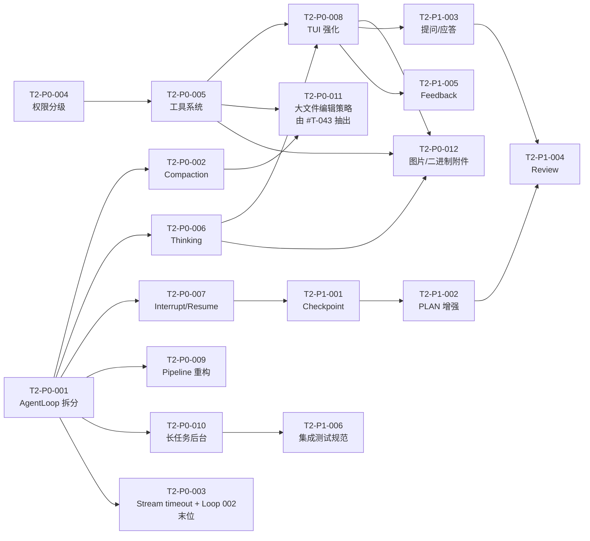

# 任务总看板 — 002-single-agent-complete

> 当前迭代：**单 Agent 完善期**。本看板同时承载迭代立项（目标/不做范围/验收/风险）与执行调度，不再拆分 `openspec/changes/00X` 四件套。
>
> 历史迭代已归档，本看板只聚焦当前迭代的立项与执行。

---

## 1. 迭代立项块

| 字段 | 值 |
|------|----|
| **迭代代号** | `002-single-agent-complete` |
| **启动日期** | 2026-04-22 |
| **迭代主题** | 把单 Agent 的基础体验、状态管理、任务循环做到极致，再考虑扩展到多 Agent / Skill / 插件生态 |
| **对应档位** | P0（基础体验）+ P1（状态管理） |
| **路线图** | [`openspec/specs/Product_Brief.md`](../openspec/specs/Product_Brief.md)（P0-P9 执行编排） |

### 1.1 迭代目标

1. **单 Agent 基础体验无 P0 bug**：工具授权、工作目录权限、中断/恢复、长任务后台化、TUI 体验 6 个方向全部达标；
2. **摘要与 compaction 行为对齐** [`docs/reports/compaction-prompt-cc-vs-pi.md`](../docs/reports/compaction-prompt-cc-vs-pi.md) §5.3/§5.4，升级 9 节模板 + 禁 tools 调用 + context v2 剩余落地；
3. **Agent Loop 模块化**：`src/core/agent_loop/run.rs`（832 行）拆为 dispatcher / tool_exec / stream_handler / error_classifier 子模块；三套管道（`src/ext/`）语义统一；
4. **Thinking API + 展示**：`src/core/llm/` 接入 Claude/GPT/Qwen 的 thinking 协议，TUI 支持可折叠展示；
5. **状态管理**：Checkpoint 机制 + 断点续跑、PLAN 模式增强、提问/应答机制、结果验证 review 子流程、Feedback 回路、集成测试规范 6 个方向全部达标；
6. **交付口径**：18 个 T2-P0/P1 任务全部 DONE；macOS/Linux 上单 Agent 可连续运行 ≥ 4 小时不退化；compaction 触发不产生死循环。

### 1.2 不做的范围

与 `Product_Brief.md` 新档位对齐，002 迭代明确**不做**：

1. **多 Agent / Agent 编排 / 安全体系 / 多会话**（P5）；
2. **插件系统新特性**（冻结区，P6；只做 T-001 VMActor shutdown 等维护性修复）；
3. **Skill 系统**（P2）；
4. **记忆系统 / USER.md / MEMORY.md**（P3）；
5. **自进化 / 学习回路**（P4）；
6. **跨平台（WasmEdge 下载脚本、Android、openclaw 兼容）**（P7）；
7. **多 LLM 适配 / 多 IM 网关**（P8）；
8. **UI（Tauri、Android、插件可视化）**（P9）。

### 1.3 验收口径

1. 18 个 T2-P0/P1 任务全部标记 `DONE` 并通过 Nibbles 复核；
2. 单元测试覆盖率 ≥ 80%，集成测试（compaction、agent loop、权限、中断恢复）全部绿灯；
3. `docs/TODOS.md` 的 P0 条目逐项在看板中有对应 T2 任务闭环；
4. `openspec/specs/Product_Brief.md` 与本看板、`docs/TODOS.md` 在档位/映射上内部一致（归档回归检查通过）。

### 1.4 风险与应对

| 风险 | 影响 | 应对 |
|------|------|------|
| Agent Loop 拆分涉及核心路径，可能引入回归 | 高 | 拆分前先补集成测试；分模块递进合并，每次 PR 附 e2e 截图/日志 |
| Thinking API 在 OpenAI / Anthropic / Qwen 协议不统一 | 高 | 先定义内部 `ThinkingEvent` 抽象，Provider 侧做适配；TUI 折叠面板复用 render 层 |
| TUI 体验重构（T2-P0-008）影响面大 | 中 | 合并到单个 T2 任务统一推进；先冻结现有 render 逻辑，新增面板分层叠加 |
| Checkpoint 设计需共识 | 中 | 先出 design 草案进 `agents/plan/`，由 Nibbles 发起 review 后再开工 |
| Compaction prompt 改动可能触发旧 transcript 不兼容 | 中 | 保留旧摘要兜底路径，新 prompt 先做 A/B 观察 2 个会话周期 |
| 权限分级（T2-P0-004）与既有 4 原语 audit 日志耦合 | 中 | 先补 dry-run 模式，再切换；审计日志新增 `permission_level` 字段 |
| T2-P0-003 末位调度、迭代末仍未闭环 | 低 | 主动取消 + `reqwest` 整请求超时已兜底主要挂死面；下迭代首周可补热修 / 提优先级 |

### 1.5 优先级说明（必读）

> ⚠️ **本看板 P0/P1 含义与 `Product_Brief.md` 的 P0/P1 含义不同。**
>
> - `Product_Brief.md` P0-P9：**执行编排顺序**（全项目尺度），上一档完成后才投入下一档。
> - 本看板 P0 / P1：**当前迭代内部优先级**——`P0 = 当前迭代必做`，`P1 = 当前迭代应做`，两档都落在 `Product_Brief.md` 的 P0-P1 区间内。
> - `docs/TODOS.md` 采用 `Product_Brief.md` 同义的 P0-P9 十档。三处语义通过前缀 `T-XXX`（全集想法）→ `T2-PX-YYY`（当前迭代任务）→ 档位 `P0..P9` 三层映射保持一致，跨档映射见各任务「关联 TODOS」字段。

---

## 2. 当前迭代上下文

| 字段 | 值 |
|------|----|
| 当前迭代 | `002-single-agent-complete` |
| 规格文档 | [../openspec/specs/Product_Brief.md](../openspec/specs/Product_Brief.md) · [../openspec/specs/Architecture.md](../openspec/specs/Architecture.md) · [../openspec/specs/Constitution.md](../openspec/specs/Constitution.md) |
| 全集想法池 | [../docs/TODOS.md](../docs/TODOS.md) |
| 关键设计报告 | [compaction-prompt-cc-vs-pi.md](../docs/reports/compaction-prompt-cc-vs-pi.md) · [plugin_skills_first_principles_pi_rust_wasm.md](../docs/reports/plugin_skills_first_principles_pi_rust_wasm.md) · [llm-tool-rounds-cli-display-thinking-protocol.md](../docs/reports/llm-tool-rounds-cli-display-thinking-protocol.md) · [agent_error_handling_cross_repo.md](../docs/reports/agent_error_handling_cross_repo.md) |
| 协作约定 | [Dispatcher.md](./Dispatcher.md) · [Nibbles.md](./Nibbles.md) · [INTEGRATION_MERGE_AND_ACCEPTANCE.md](./INTEGRATION_MERGE_AND_ACCEPTANCE.md) · [Tom.md](./Tom.md) · [Jerry.md](./Jerry.md) · [Spike.md](./Spike.md) |

---

## 3. 任务状态说明

| 状态 | 含义 |
|------|------|
| **TODO** | 待认领 |
| **DOING** | 开发中（已认领） |
| **PENDING_INTEGRATION** | 等待集成测试与合并：工程师已在功能分支按 [INTEGRATION_MERGE_AND_ACCEPTANCE.md](./INTEGRATION_MERGE_AND_ACCEPTANCE.md) 完成集成与 E2E 全量验收并推送；等待 Nibbles 合并入 develop 并复核通过 |
| **BLOCKED** | 阻塞（需在「阻塞点」中说明原因） |
| **DONE** | 已完成（含集成测试通过） |

**典型流转**：`TODO → DOING → PENDING_INTEGRATION → DONE`。阻塞时可为 `DOING` / `PENDING_INTEGRATION` → `BLOCKED` → `DOING` / `PENDING_INTEGRATION`。仅状态为 `TODO` 且负责人为空的任务可被认领；`PENDING_INTEGRATION` 表示已交集成、不可认领。

---

## 4. 待办任务

> 按 P0 → P1 顺序与模块依赖排列；**T2-P0-003** 在**全部其它 T2-P0-00x 完成之后**再排期（002 期全 P0 中最低优先级、末位调度）。工程师按 [Dispatcher.md](./Dispatcher.md) 流程认领。
>
> 字段约定：`关联 TODOS` 字段列出 `docs/TODOS.md` 中对应 `#T-XXX` 条目，便于双向追溯。

---

### T2-P0-001 | agent-loop-modularization | Agent Loop 模块化拆分

| 字段 | 内容 |
|------|------|
| **优先级** | P0 |
| **状态** | `DONE` |
| **负责人** | Jerry |
| **分支** | `feature/agent-loop-split` |
| **阻塞点** | — |
| **关联 TODOS** | `#T-018`、`#T-019` |
| **关联报告** | [plan-mode-execution-playbook-T2-P0-001.md](../docs/reports/plan-mode-execution-playbook-T2-P0-001.md) — Cursor PLAN 模式执行步骤复盘（Phase A-F SOP）|
| **状态文档** | [feature-agent-loop-split.md](../docs/status/feature-agent-loop-split.md) |
| **计划文档** | `~/.cursor/plans/agent-loop-modularization_e99e067f.plan.md` |

**目标**：把 832 行的 `src/core/agent_loop/run.rs` 拆为可独立测试的子模块，并为 `src/ext/dispatcher/` 做对等拆分，消除核心循环的维护阻力。

**子项**：
- [x] 新建 `src/core/agent_loop/tool_dispatcher.rs`：tool_calls 调度 + 事件配对（207 行）
- [x] 新建 `src/core/agent_loop/tool_exec.rs`：7 分支工具执行自由函数（151 行）
- [x] 新建 `src/core/agent_loop/stream_handler.rs`：`chat_stream` delta 消费 + StreamOutcome（166 行）
- [x] 新建 `src/core/agent_loop/error_classifier.rs`：Retryable / Fatal 分类 + L3 overflow trim（246 行）
- [x] 新建 `src/core/agent_loop/{accessors,turn_finalize,reasoning_loop}.rs`：访问器/收束/第三层循环
- [x] `run.rs` 保留 Conversation + Attempt 骨架（**213 行** ≤ 300 红线）
- [x] 独立 `tests/` 子目录（mocks / classify / run_basic / events_order / steering_followup / metrics / interrupt / submodules 共 8 文件 + 26 用例）；遵循 [RUST_FILE_LINES_SPEC.md §A](../openspec/specs/guides/coding/RUST_FILE_LINES_SPEC.md)，业务源文件不内联 `#[cfg(test)] mod tests {...}`
- [-] `src/ext/dispatcher/` 子模块化：经计划阶段评估**不在本任务内重构**（dispatch.rs 390 / ops.rs 345 / session_ops.rs 374 处于黄区下沿但未触红，且二次拆分会破坏"路由大表一处可见"的可读性）；详见 [feature-agent-loop-split.md §ext/dispatcher 现状决策](../docs/status/feature-agent-loop-split.md)，建议作为独立 ticket 在突破 450 行时再处理

**依赖**：归档 001-mvp 中的 TASK-14（DONE）

**被依赖**：T2-P0-003、T2-P0-007（003 为**末位调度**，不阻塞 007 等其它 P0 的合并与交付）

**协作接口**：
- 消费：`LlmProvider::chat_stream`、`EventBus`、`ToolRegistry`
- 提供：`AgentLoop::run` 签名保持不变；对外行为 / 事件发布完全等价

**验收标准**：
- `run.rs` ≤ 300 行；各子模块 ≤ 300 行
- `cargo test -p pi-rust-wasm core::agent_loop` 全绿
- 所有现有 E2E（chat / tool-call / interrupt）行为无变化
- clippy 全量规则无警告

---

### T2-P0-002 | compaction-prompt-and-ctx-v2 | 摘要 prompt 升级 + context v2 收尾

| 字段 | 内容 |
|------|------|
| **优先级** | P0 |
| **状态** | `DONE`（`2026-04-26` Nibbles 合并入 `develop` @ `1fb0a62`，develop 上全量门禁复跑通过） |
| **负责人** | Spike |
| **分支** | `feature/compaction-prompt-9section` |
| **阻塞点** | — |
| **关联 TODOS** | `#T-041`、`#T-136`、`#T-137`；**改判**：`#T-040` 关闭归并、`#T-044` 报告决议关闭、`#T-043` 抽出 T2-P0-011；继承归档 TASK-19 剩余 |
| **关联报告** | [compaction-prompt-cc-vs-pi.md](../docs/reports/compaction-prompt-cc-vs-pi.md) §5.3/§5.4/§5.6/§5.7 |
| **架构 spec** | [context-management.md §7.5 Compaction v2 修订](../openspec/specs/architecture/context-management.md)（4 个 H4 子节 + 3 项不实施决议回链表） |
| **计划文档** | `~/.cursor/plans/compaction_prompt_9-section_41653219.plan.md`（含 §6.C / §6.E 改判决议段） |
| **commit 列表** | `4b2717c` Phase B（9 节模板 + 禁 tools） / `447a61a` Phase D（退避 + 失败留痕） / `ff178ff` Phase G（context-management §7.5）|
| **门禁结果** | lib `454 passed / 1 ignored`；integration 14 crate `195 passed / 0 failed`（含 `cli_tests` / `wasmedge_e2e_tests` / `llm_tests` 真实路径）；`cargo fmt --check` + `cargo clippy --all-targets -- -D warnings` 零警告 |

**目标**：把 `src/core/compaction/preheat.rs` 的 5 节摘要模板升级为 9 节（对齐 CC）；Compaction 路径的 `ChatRequest` 显式不传 `tools` 并加首行禁工具声明；补齐指数退避 + transcript 失败留痕收尾项；合并 TASK-19 的异步预热 / 级联降压 / 落盘剩余项。

**子项**：
- [x] 9 节摘要模板：Goal / Constraints & Preferences / Progress（Done [带 file: 锚点] / In Progress / Blocked）/ Errors Encountered / Key Decisions / Recent User Messages（最近 10 条用户原话）/ Next Steps（含 verbatim 引用）/ Critical Context；指令区追加 `First reason internally, then output the final summary.`
- [x] Compaction 入口禁 tools：`ChatRequest { tools: None, .. }`（**不引入** `tool_choice` 字段，避免破 `ChatRequest` 公共结构）；Prompt 首行追加 `Respond with text only. Do not call any tools.`
- [-] ~~超大文件处理（>800K / 超预算）：fallback 到截断 + 哨兵消息，不再 panic~~ — **不实施 / `#T-040` 关闭归并**（`2026-04-26`，按 plan §6.C 决议；现有 Layer 0 + Phase D 失败留痕已覆盖；compaction 不兼任输入校验）
- [x] 压缩任务失败重试：指数退避 3 次（500ms / 1s / 2s）；3 次都失败时 transcript 写一条 `BranchSummaryEntry { summary: None, error, attempts }`（**同时承接 `#T-040` 超大消息 → LLM 拒绝路径**）
- [-] ~~大文件多次编辑写入：分块落盘 + 合并锚点~~ — **不实施 / `#T-043` 改判归属抽出 T2-P0-011**（`2026-04-26`，按 plan §6.E 决议；原 TODO 真实归属是 `executor/primitives.rs::edit_file`，与 compaction 无关）
- [-] ~~先写分析草稿再输出摘要正文（Two-pass summary）~~ — **不实施 / `#T-044` 报告决议关闭**（`2026-04-26`；详见 [`docs/reports/compaction-prompt-cc-vs-pi.md §5.7`](../docs/reports/compaction-prompt-cc-vs-pi.md#57-明确不做的事项anti-goals)，prompt 内加一句"先内部 reason 再输出"做隐式诱导）
- [x] 架构 spec 落档：在 [`openspec/specs/architecture/context-management.md §7.5`](../openspec/specs/architecture/context-management.md) 新增 4 个 H4 子节（9 节模板 / 显式 `tools: None` / 退避 + 留痕含字段 schema / 3 项不实施决议表），单一事实来源指向 `preheat.rs` 的 `pub(super) const`；不新建 `compaction-resilience.md`，不做 §7 索引化搬迁
- [x] 回归集成测试：lib `454 passed / 1 ignored` + integration 14 crate `195 passed / 0 failed`（含 `prompt_snapshot.rs` 13 用例 / `preheat_and_truncation.rs` 退避 + 失败留痕 2 用例 / `legacy_transcript_compat.rs` 3 用例 / `cli_tests` `wasmedge_e2e_tests` `llm_tests` 真实路径）

**依赖**：T2-P0-001（Agent Loop 拆分后便于替换 compaction 注入点；2026-04-25 已 DONE）

**被依赖**：T2-P1-001（Checkpoint 依赖新摘要锚点）

**协作接口**：
- 消费：`src/core/llm/`、`src/core/compaction/{preheat,apply,truncation}.rs`、`src/core/session/transcript.rs`
- 提供：`BranchSummaryEntry { error, attempts }` 字段扩展（向后兼容）；`Compactor::summarize` 行为不变

**验收标准**：
- 9 节模板的结构化输出通过 snapshot 测试
- 禁 tools 声明在 request 中生效（`tools: None` + 首行 prompt）
- 退避 + 留痕场景 E2E 全绿（含 mock `LlmError::ContextLengthExceeded` 用例覆盖 `#T-040` 承接语义）
- 与 `#T-041` / `#T-136` / `#T-137` 三条 TODO 一一对应；`#T-040` / `#T-044` 改判结论落档；`#T-043` 抽出后由 T2-P0-011 承接
- `context-management.md` 新增 `Compaction v2` 小节简明覆盖 3 个落地点 + 3 项不实施决议回链；与本分支 `preheat.rs` / `transcript.rs` 实际改动一一对应（No-Stale）；零悬空回链

---

### T2-P0-004 | workspace-permission-tiers | 工作目录权限分级

| 字段 | 内容 |
|------|------|
| **优先级** | P0 |
| **状态** | `DONE`（`2026-04-27` Nibbles 合并入 `develop` @ `11eb5e7`，develop 上全量门禁复跑通过） |
| **负责人** | Jerry |
| **分支** | `feature/workspace-permission-tiers` |
| **阻塞点** | — |
| **关联 TODOS** | `#T-046`、`#T-047`、`#T-048`、`#T-050`、`#T-051` |

**目标**：落实工作目录 / 非工作目录的权限分级模型，避免现有「一刀切拒绝」带来的体验断层。

**子项**：
- [x] 工作目录下：read 免授权；write 支持 `always / 单次` 两档授权（PR-1/PR-2 落地，`ConfirmDecision::AllowOnce` / `AllowAndPersistRoot` / `Deny` 三选项 UI）
- [x] 非工作目录：所有操作需显式授权（弹 prompt 而非直接 403）（PR-2，layer-2 NeedConfirm）
- [x] Bash：解析命令目标路径，按同规则分级；避免 `rm -rf /` 类命令越权（PR-3 `bash_parser` + `bash_forbidden` 默认值）
- [x] 工作目录别名 + 描述字段；「说话就能改配置」的便捷入口（PR-5 `WorkspaceConfig.entries` + PR-7 `config_get/set` LLM 工具）
- [x] 审计日志新增 `permission_level` / `grant_source` 字段（PR-6，外加 `in_working_dir`）
- [x] `src/core/primitives.rs` 对齐新权限 API（PR-2 `executor::primitives` 接入 `PermissionGate`，原语返回 `PermissionDecision`）

**依赖**：归档 001-mvp 的 4 原语引擎（DONE）

**被依赖**：T2-P0-005（工具系统整改依赖权限模型）

**协作接口**：
- 消费：`config::workspace`、`audit`
- 提供：`PermissionGate::check(op, path) -> Decision`

**验收标准**：
- 5 条 TODO（T-046/T-047/T-048/T-050/T-051）全部闭环
- E2E：工作目录 / 非工作目录 / Bash / 写操作 四个场景用户体验符合 `Product_Brief.md` 新约束
- 审计 JSONL 向后兼容（`PrimitiveAuditEntry` 新增 `permission_level` / `grant_source` / `in_working_dir` 一律 `#[serde(default)]`，老行缺字段可读；开发期无存量用户，不做批量迁移脚本——与设计 plan §5/§10/§11 一致）

---

### T2-P0-005 | tool-system-cleanup | 工具系统整改

| 字段 | 内容 |
|------|------|
| **优先级** | P0 |
| **状态** | `TODO` |
| **负责人** | — |
| **分支** | `feature/tool-system-cleanup` |
| **阻塞点** | — |
| **关联 TODOS** | `#T-033`、`#T-034`、`#T-035`、`#T-036`、`#T-037`、`#T-039` |

**目标**：修复 Bash 授权类型错配等具体 bug，补齐工具描述清单，让 Agent 在规划阶段能访问当前目录并执行 pi 子命令。

**子项**：
- [ ] **T-033**：Bash 授权类型从 `FS` 纠正为 `Exec`（对应 audit scope 枚举）
- [ ] **T-034**：补齐全部工具的 `description` / `usage` / `example`；产出 `docs/tool-catalog.md`
- [ ] **T-035**：默认工具内创建目录，不再 spawn `pi` 子进程
- [ ] **T-036**：Chat 默认尝试访问当前目录；无权限时申请授权而非静默
- [ ] **T-037**：规划阶段允许调用 pi 命令（新增 workspace、list plugin 等）
- [ ] **T-039**：删除操作改归档（moved-to `.trash/`，7 天后清理）

**依赖**：T2-P0-004（权限模型就位后才好改）

**被依赖**：T2-P0-008（TUI 要展示新描述清单）

**协作接口**：
- 消费：`ToolRegistry`、`PermissionGate`
- 提供：`ToolDescriptor` 增强字段

**验收标准**：
- 6 条 TODO（T-033~T-039）全部闭环
- `docs/tool-catalog.md` 覆盖所有已注册工具
- E2E：Bash 授权 / 删除归档 / 规划执行 pi 三个场景通过

---

### T2-P0-006 | thinking-api-and-display | Thinking API 接入 + TUI 展示

| 字段 | 内容 |
|------|------|
| **优先级** | P0 |
| **状态** | `TODO` |
| **负责人** | — |
| **分支** | `feature/thinking-api-display` |
| **阻塞点** | — |
| **关联 TODOS** | `#T-071` |
| **关联报告** | [llm-tool-rounds-cli-display-thinking-protocol.md](../docs/reports/llm-tool-rounds-cli-display-thinking-protocol.md) |

**目标**：在 `src/core/llm/` 引入统一 `ThinkingEvent` 抽象，Provider 侧分别适配 OpenAI / Anthropic / Qwen 的 thinking 协议；TUI 支持可折叠展示。

**子项**：
- [ ] 内部抽象：`StreamEvent::Thinking { delta, signature }`（对齐 Anthropic），兼容 OpenAI `reasoning_content`、Qwen `reasoning_summary`
- [ ] `OpenAiProvider` / `AnthropicProvider`（占位）/ `QwenProvider`（占位）接入
- [ ] TUI 新增 `thinking` 面板：默认折叠；`Ctrl+T` 展开；对话历史中以灰色渲染
- [ ] 配置项：`llm.thinking.enabled` / `.max_tokens` / `.show_by_default`
- [ ] Audit：thinking 内容不写入 transcript（或可配落盘）

**依赖**：T2-P0-001（stream_handler 落位后才好插 thinking delta）

**被依赖**：T2-P0-008（TUI 面板整合）

**协作接口**：
- 消费：`LlmProvider::chat_stream`
- 提供：`StreamEvent::Thinking` + `RenderEvent::ThinkingBlock`

**验收标准**：
- 至少 OpenAI Provider 的 thinking 链路可运行
- TUI 折叠 / 展开 / 历史渲染 E2E 通过
- 配置默认值不改变现有用户行为

---

### T2-P0-007 | interrupt-resume-transcript | 中断/恢复 + transcript 完整性

| 字段 | 内容 |
|------|------|
| **优先级** | P0 |
| **状态** | `DONE` |
| **负责人** | Spike |
| **分支** | `feature/interrupt-resume` |
| **阻塞点** | **依赖偏离（待 Nibbles 复核）**：看板标注依赖 T2-P0-001 / T2-P0-003（均 TODO）。本次破例先做，理由详见计划 `~/.cursor/plans/interruptible_agent_loop_c77e96ab.plan.md` §0.2——改动范围（`run.rs` / `types.rs` / `chat/*` / `cli/chat_cmd.rs`）不与 T2-P0-001 拆分冲突；T2-P0-003 可直接复用本次 CancellationToken 基建。impact-scan 结论（见 `docs/status/feature-interrupt-resume.md`）：未修改 `PrimitiveExecutor::execute_bash` trait 签名，零 mock 改动、零外部 plugin 影响。 |
| **关联 TODOS** | `#T-003`、`#T-004`、`#T-007`、`#T-017` |
| **计划文档** | `~/.cursor/plans/interruptible_agent_loop_c77e96ab.plan.md` |
| **架构文档** | `openspec/specs/architecture/interrupt-and-cancellation.md`（2026-04-22 定稿） |
| **状态文档** | `docs/status/feature-interrupt-resume.md` |

**目标**：用户中断期间不丢已生成的 LLM 回复；中断时 transcript 落盘；下次进入同会话可续写上下文。

**子项**：
- [x] **T-003**：工具输出过程中支持 Ctrl+C 中断（`tokio::select!` + `CancellationToken` + `kill_on_drop(true)`）
- [x] **T-004**：中断时保留已回复片段，`AgentRunOutcome::Interrupted` 与 `Completed` 走同一持久化路径
- [x] **T-017**：中断时同步落盘 transcript（`session.append_message` 覆盖 partial assistant + 已完成 tool_result；硬验收 `interrupt_persists_transcript_hard_ack`）
- [x] **T-007 最小版**：中断 partial 落盘 + 现有 `--resume` 路径天然满足"记得上下文"；完整 resume API（`session resume` 子命令、跨 session Checkpoint）推到 T2-P1-001
- [x] Ctrl+C 双击语义：首击 soft cancel、2s 内再击 `exit(130)`（纯函数 `check_double_tap` + 4 用例单测）
- [x] `AgentEvent::Interrupted` + `WIRE_AGENT_INTERRUPTED`；`AgentEnd.error="interrupted"` 保留兼容
- [x] 新增架构文档 `openspec/specs/architecture/interrupt-and-cancellation.md`
- [ ] Steering / FollowUp 三态流转完整集成：本次仅覆盖 Abort 维度；Steering / FollowUp 队列整合推 T2-P0-001 Agent Loop 拆分时统一处理

**依赖**：T2-P0-001、T2-P0-003（本次破例——见"阻塞点"字段）

**被依赖**：T2-P1-001（Checkpoint 依赖 transcript 完整性）

**协作接口**：
- 消费：`agent_loop::Abort`、`session::append_message`
- 提供：`ChatSession::resume_from_transcript`

**验收标准**：
- 4 条 TODO（T-003/T-004/T-007/T-017）全部闭环
- E2E：中断 → 恢复 → 续写 → 新 user 提问 不丢任何已生成 delta
- transcript schema 无破坏性变更

---

### T2-P0-008 | tui-experience-enhance | TUI 体验强化（合并 TASK-08）

| 字段 | 内容 |
|------|------|
| **优先级** | P0 |
| **状态** | `TODO` |
| **负责人** | — |
| **分支** | `feature/tui-experience` |
| **阻塞点** | — |
| **关联 TODOS** | `#T-009`、`#T-010`、`#T-011`、`#T-012`、`#T-013`、`#T-014` |
| **继承** | 归档 001-mvp TASK-08（CLI 交互体验优化） |

**目标**：成组处理 user turn 列表、状态总览、时间戳、编辑模式、重新输入、diff 视图 6 个 TUI 体验项；吸收旧 TASK-08 未完工作。

**子项**：
- [ ] **T-009** user turn list：侧栏展示最近 N 轮 user / assistant / tool turns，可翻阅
- [ ] **T-010** 状态总览：当前任务 / token 使用 / 压缩状态 / 工具轮次 一屏展示
- [ ] **T-011** 时间戳与相对时间（`3m ago`）
- [ ] **T-012** 编辑模式美化（对齐、输入框边界、placeholder）
- [ ] **T-013** user content 可重新输入（上键回溯 + 编辑 + 重发）
- [ ] **T-014** diff 视图：文件 edit 时展示增/减行数与内容，支持滚动
- [ ] 吸收 TASK-08 未完：加载状态 / 进度提示 / 错误提示友好度 / 命令自动补全

**依赖**：T2-P0-005（工具描述清单）、T2-P0-006（thinking 面板）

**被依赖**：—

**协作接口**：
- 消费：`render::*`、`EventBus`
- 提供：新 `TuiLayout` 组件集

**验收标准**：
- 6 条 TODO 全部闭环
- `cargo run --bin pi-wasm chat` 启动后 6 项体验可手工验证
- TUI 快照测试（若工具链允许）或至少手测记录附 PR

---

### T2-P0-009 | pipeline-refactor | 三套管道重构

| 字段 | 内容 |
|------|------|
| **优先级** | P0 |
| **状态** | `TODO` |
| **负责人** | — |
| **分支** | `feature/pipeline-unify` |
| **阻塞点** | — |
| **关联 TODOS** | `#T-002` |

**目标**：统一 `src/ext/` 下三套管道（dispatcher / vm_actor / hostcall）的语义，消除技术债；便于后续 P2 Skill 系统复用。

**子项**：
- [ ] 盘点三套管道现状并出一页设计（放 `agents/plan/pipeline-unify.md`）
- [ ] 定义统一 `PipelineMessage` 枚举 + 清晰的 owner / lifecycle
- [ ] 合并重复的 tokio task 派发逻辑
- [ ] 保留 VMActor 的 actor 模型对外接口，内部分层整理
- [ ] 更新相关集成测试

**依赖**：T2-P0-001

**被依赖**：—（P2 Skill 系统复用）

**协作接口**：
- 消费：`tokio`、`EventBus`
- 提供：`Pipeline` trait

**验收标准**：
- `#T-002` 关闭
- 三套管道接口文档在 design.md 齐备
- 集成测试无退化

---

### T2-P0-010 | long-task-background | 长任务后台化

| 字段 | 内容 |
|------|------|
| **优先级** | P0 |
| **状态** | `TODO` |
| **负责人** | — |
| **分支** | `feature/long-task-background` |
| **阻塞点** | — |
| **关联 TODOS** | `#T-020`、`#T-101` |

**目标**：Bash 与长任务（`>10s`）默认后台执行，不阻塞主 Agent 线程；把规范写入编码规范文档。

**子项**：
- [ ] Bash 工具：`detached: true` 时用 tokio spawn 独立 task，主线程继续处理事件
- [ ] 长任务 API：`LongRunningTask` trait，带 `progress` / `cancel`
- [ ] 主循环不再 `await` 长任务 future，改订阅 `EventBus::TaskProgress`
- [ ] 把「耗时操作后台化」写入 `openspec/specs/guides/coding-style.md` 或等价文档

**依赖**：T2-P0-001

**被依赖**：—

**协作接口**：
- 消费：`tokio::spawn`、`EventBus`
- 提供：`LongRunningTask` trait

**验收标准**：
- 2 条 TODO（T-020/T-101）闭环
- 3 分钟 Bash 长任务不阻塞 TUI 的 user turn
- 编码规范文档新增对应章节

---

### T2-P0-011 | large-file-edit-strategy | 大文件编辑策略

| 字段 | 内容 |
|------|------|
| **优先级** | P0 |
| **状态** | `TODO` |
| **负责人** | — |
| **分支** | `feature/large-file-edit-strategy` |
| **阻塞点** | — |
| **关联 TODOS** | `#T-043`（由 T2-P0-002 抽出，2026-04-26） |
| **关联报告** | [compaction-prompt-cc-vs-pi.md §5.7 Anti-goals](../docs/reports/compaction-prompt-cc-vs-pi.md) 第 3 行（决议来源） |

**目标**：让 Agent 在更新大文件时偏好「多次小 `edit_file`」而非「一次性 `write_file` 大字符串」，避免单条 `tool_input` 字符过大形成上下文 / token 压力。**与 compaction 无关**——本任务在 executor primitives + system prompt 引导层解决。

**子项**（具体方案由计划阶段确定，先列待研究方向）：
- [ ] 调研 CC / openclaw / hermes-agent 在「写大文件」时如何引导 Agent（system prompt 措辞 / tool description / 大字符串 hint 阈值），输出 ≤ 30 行调研笔记到 `agents/plan/large-file-edit-strategy.md`
- [ ] 选定方案（计划阶段决定，三选一或组合）：
  - ① **System prompt 引导**：在 `src/core/system_prompt.rs` 加一句「prefer multiple small `edit_file` calls over one `write_file` with large content」
  - ② **`write_file` 大字符串 hint**：当 `content.len() > N` 时返回非阻塞 hint（不 reject、不 panic），引导下次改用 `edit_file`
  - ③ **Tool description 增强**：在 `edit_file` / `write_file` 的 description 中说明使用偏好
- [ ] 若选方案 ②，新增配置项 `executor.write_file_hint_threshold_chars`（默认值由计划阶段确定）
- [ ] 集成测试：构造「Agent 修改 1MB 文件中 3 行」场景，验证 Agent 倾向用 `edit_file` 而非 `write_file` 整文件重写
- [ ] `docs/TODOS.md` 中 `#T-043` 状态改为 `[x]`

**依赖**：T2-P0-002（compaction 收尾后再做，避免与 docs 改动 / `preheat.rs` 路径冲突）；T2-P0-005（工具系统整改先就位再调整 description）

**被依赖**：—

**协作接口**：
- 消费：`PrimitiveExecutor::write_file` / `PrimitiveExecutor::edit_file`、`SystemPrompt`、`ToolRegistry::description`
- 提供：（无新公共 API；行为引导）

**验收标准**：
- `#T-043` 闭环（`docs/TODOS.md` 改 `[x]`）
- E2E：Agent 在「修改 1MB 文件中 3 行」场景下调用 `edit_file` 至少 1 次（而非全文 `write_file`）
- 计划阶段输出 design 短文（≤ 30 行）放 `agents/plan/large-file-edit-strategy.md`
- 不引入新 panic / reject 路径（兼容现有 4 原语）

**说明（来源溯源）**：本任务源自 plan T2-P0-002 §6.E 决议——`#T-043` 原始 TODO 文案「更新大文件时应该多次编辑写入」**真实归属是 `executor/primitives.rs`**（agent 写大文件方式），与 compaction 无关；原看板把它分到 T2-P0-002 子项 5 属归属错位。详见 [compaction-prompt-cc-vs-pi.md §5.7](../docs/reports/compaction-prompt-cc-vs-pi.md) Anti-goals 第 3 行 + plan §6.E 决议段。

---

### T2-P0-012 | llm-binary-attachments | 图片/二进制文件传给 LLM

| 字段 | 内容 |
|------|------|
| **优先级** | P0 |
| **状态** | `TODO` |
| **负责人** | — |
| **分支** | `feature/llm-binary-attachments` |
| **阻塞点** | — |
| **关联 TODOS** | 新增（多模态输入 / 二进制安全读取） |

**目标**：用户拖拽或显式指定图片 / 二进制文件时，系统应把文件作为 LLM attachment 传入模型，而不是走 `read_file` 的 UTF-8 文本路径误读、乱码或污染上下文。

**子项**（具体方案由计划阶段确定，先列待研究方向）：
- [ ] 新增文件类型判定层：按 MIME / magic bytes / UTF-8 可解码性区分 text、image、generic binary；文本文件继续走现有 `read_file`，二进制文件禁止静默 UTF-8 解码
- [ ] 设计 `ChatRequest` / message content 的 attachment 抽象：支持 image（PNG/JPEG/WebP/GIF 等）与 generic binary（文件名、MIME、大小、bytes/ref），并记录 provider capability
- [ ] Provider 适配：OpenAI / Anthropic / Qwen 分别映射到各自多模态输入协议；不支持的 provider 返回明确可恢复错误，不回退为乱码文本
- [ ] TUI / 拖拽路径接入：用户拖入图片或二进制文件时显示附件 chip / 文件摘要，并将附件随下一轮 user message 发送给 LLM
- [ ] 安全与预算：文件大小上限、MIME allowlist、权限复用 `PermissionGate`，transcript 只落 metadata / content hash，避免把原始二进制直接写进历史
- [ ] 回归测试：图片附件能被 mock LLM 收到；随机二进制不会触发 UTF-8 `read_file`；不支持多模态的 provider 给出结构化错误

**依赖**：T2-P0-005（工具系统整改后再调整 `read_file`/attachment 边界）；T2-P0-006（LLM content 抽象与 provider 适配先就位）；T2-P0-008（TUI 附件展示与拖拽交互承载）

**被依赖**：—

**协作接口**：
- 消费：`dragged_path`、`PrimitiveExecutor::read_file`、`ChatRequest`、`LlmProvider`、`PermissionGate`
- 提供：`AttachmentContent` / `BinaryAttachment`（命名由计划阶段定）、provider capability 查询、二进制安全读取路径

**验收标准**：
- PNG/JPEG 图片拖入后作为 LLM image attachment 发送，mock provider 可断言 MIME、文件名、bytes/hash
- 任意非 UTF-8 二进制文件不会被 `read_file` 当文本读入上下文；错误信息明确提示可用的附件路径或 provider 限制
- transcript / audit 只记录附件 metadata、hash、大小与路径权限来源，不落原始 bytes
- 多模态不支持场景有单测覆盖，行为为结构化失败而非 silent fallback

**说明（来源溯源）**：本任务承接用户反馈——当前用户想把图片 / 二进制文件交给 LLM 时，容易被系统当作 UTF-8 文本文件读取，造成乱码、token 浪费和模型误判。修复重点是「输入语义分流 + LLM 多模态附件通道」，不是扩大 `read_file` 的文本读取能力。

---

### T2-P0-003 | stream-timeout-and-tool-loop | Stream timeout + Tool loop detection

| 字段 | 内容 |
|------|------|
| **优先级** | P0（**002 期末位调度**：在**全部其它** `T2-P0-00x` 完成后再做；全 P0 中**最低**） |
| **状态** | `TODO` |
| **负责人** | — |
| **分支** | `feature/stream-timeout-loop-guard` |
| **阻塞点** | — |
| **关联 TODOS** | `#T-131`、`#T-132` |

**目标**：把 `src/core/llm/openai.rs` 中的 `stream_timeout_sec` 接 `tokio::time::timeout`；替换 `src/core/agent_loop/types.rs:38-40` 的 `MAX_TOOL_ROUNDS` 硬限为 ToolLoopGuard 三道防线。

**调度说明（2026-04-26）**：仍在 002 范围与「18 个 T2-P0/P1 全 DONE」交付内。主动取消 + `reqwest` 整请求超时已降低挂死概率；本任务为体验加固，**不阻塞**其它 P0 认领与合并；若迭代末期时间仍紧，以「末位调度」压线排期，接受短期依赖现有超时与取消路径。

**子项**：
- [ ] `OpenAiProvider::chat_stream` 接入 `tokio::time::timeout` + 心跳超时；超时抛 `LlmError::StreamTimeout`（Retryable）
- [ ] 删除 `MAX_TOOL_ROUNDS` 硬编码，新增 `ToolLoopGuard`：① 连续同名 tool 调用次数阈值 ② 最近 N 轮 tool 输出相似度阈值 ③ 总轮数上限（可配）
- [ ] 触发 guard 后向 LLM 回注 `You appear to be in a tool-call loop, please reconsider.` 的 system 提示
- [ ] `openspec/specs/architecture/context-management.md:1017-1019` 规格侧 TODO 同步更新

**依赖**：T2-P0-001（error_classifier 已落位；**无硬依赖其它 P0**，仅**实施顺序**置末位）

**被依赖**：—

**协作接口**：
- 消费：`error_classifier::classify`、配置 `llm.stream_timeout_sec` / `agent.tool_loop_guard.*`
- 提供：`ToolLoopGuard::check(&self, history)` → `GuardDecision`

**验收标准**：
- 流式挂起 ≥ timeout 时自动重连或失败，不再静默阻塞
- ToolLoopGuard 三档都有单测覆盖
- `#T-131` `#T-132` 两条 TODO 关闭

---

### T2-P1-001 | checkpoint-resume | Checkpoint + 断点续跑

| 字段 | 内容 |
|------|------|
| **优先级** | P1 |
| **状态** | `TODO` |
| **负责人** | — |
| **分支** | `feature/checkpoint-resume` |
| **阻塞点** | — |
| **关联 TODOS** | `#T-042`、`#T-032`（回滚合并） |

**目标**：为文件/任务状态建立快照；支持中断后继续跑、必要时回滚。

**子项**：
- [ ] Checkpoint 数据模型 design.md（放 `agents/plan/`）
- [ ] `src/core/checkpoint/` 新建：写入时机（tool 前后 / compaction 前后 / 中断时）
- [ ] 回滚命令：`pi-wasm session rollback <checkpoint-id>`
- [ ] 断点续跑：进入会话时按 transcript 尾 + 最近 checkpoint 自动 resume

**依赖**：T2-P0-007

**被依赖**：T2-P1-002

**协作接口**：
- 消费：`session`、`audit`
- 提供：`CheckpointStore`

**验收标准**：
- 2 条 TODO 闭环
- E2E：中断 → 重启 pi-wasm → 自动 resume 到断点前状态
- 回滚命令可用

---

### T2-P1-002 | plan-mode-enhance | PLAN 模式增强

| 字段 | 内容 |
|------|------|
| **优先级** | P1 |
| **状态** | `TODO` |
| **负责人** | — |
| **分支** | `feature/plan-mode-enhance` |
| **阻塞点** | — |
| **关联 TODOS** | `#T-015`、`#T-086`、`#T-087`、`#T-089-plan`、`#T-091` |

**目标**：PLAN 模式形成「列计划 → 子 Agent review → 文件锁 → 进展记录 → 拆里程碑」闭环。

**子项**：
- [ ] PLAN 执行面板（待办 / 进行中 / 已完成，带 bash 输出）
- [ ] Planner 子 Agent 生成初稿；另一个 review 子 Agent 无污染审阅
- [ ] 更新计划时文件锁（防并发写）
- [ ] 计划过程中记录进展到 `agents/plan/<timestamp>.md`
- [ ] 拆里程碑 / 拆任务，每任务开独立上下文窗口

**依赖**：T2-P1-001

**被依赖**：T2-P1-004

**协作接口**：
- 消费：`CheckpointStore`、`ToolRegistry`
- 提供：PLAN 模式的 `PlanRuntime`

**验收标准**：
- 5 条 TODO 闭环
- E2E：创建一个 3 里程碑计划，review 子 Agent 给出意见，执行面板实时更新

---

### T2-P1-003 | ask-answer-mechanism | 提问/应答机制

| 字段 | 内容 |
|------|------|
| **优先级** | P1 |
| **状态** | `TODO` |
| **负责人** | — |
| **分支** | `feature/ask-answer` |
| **阻塞点** | — |
| **关联 TODOS** | `#T-090-plan` |

**目标**：Agent 在理解任务偏差时能向用户发问；用户回答后 Agent 继续执行。

**子项**：
- [ ] 新工具 `ask_user`：接收 `question` / `options?`，阻塞等待用户响应
- [ ] TUI 弹窗式 prompt，对话历史中保留 Q&A pair
- [ ] 防滥用：限制 per-turn 最多 2 次 ask；超过进入 review 模式
- [ ] 集成到系统提示词，引导 Agent「优先提问而非臆断」

**依赖**：T2-P0-008（TUI 就位）

**被依赖**：T2-P1-004

**协作接口**：
- 消费：`ToolRegistry`、`render`
- 提供：`AskUserTool`

**验收标准**：
- `#T-090-plan` 闭环
- E2E：Agent 在需求模糊时主动提问；用户回答后继续

---

### T2-P1-004 | review-verification | 结果验证 + review 子流程

| 字段 | 内容 |
|------|------|
| **优先级** | P1 |
| **状态** | `TODO` |
| **负责人** | — |
| **分支** | `feature/review-verification` |
| **阻塞点** | — |
| **关联 TODOS** | `#T-092` |

**目标**：Agent 完成任务前自 review；必要时启一个独立 review 子 Agent 做红绿灯测试。

**子项**：
- [ ] `review_self` 工具：对 diff / 测试结果 / 验收标准做结构化自审
- [ ] `review_by_child` 工具：启一个无上下文污染的子 Agent review
- [ ] 红绿灯判定：全绿放行、黄灯要求修复、红灯回到 PLAN 模式重规划
- [ ] 与 PLAN 模式的里程碑完成节点挂钩

**依赖**：T2-P1-002、T2-P1-003

**被依赖**：T2-P1-005

**协作接口**：
- 消费：`ToolRegistry`、子 Agent 派生（现阶段用 LLM 再调一次）
- 提供：`ReviewRuntime::run(target)`

**验收标准**：
- `#T-092` 升级闭环
- E2E：完成一个 3 步任务，自动触发两轮 review，最终红绿灯输出

---

### T2-P1-005 | feedback-loop | Feedback 回路（新增）

| 字段 | 内容 |
|------|------|
| **优先级** | P1 |
| **状态** | `TODO` |
| **负责人** | — |
| **分支** | `feature/feedback-loop` |
| **阻塞点** | — |
| **关联 TODOS** | 新增（为 P3 记忆 / P4 自进化铺垫） |

**目标**：捕获用户反馈（👍/👎 + 文字），沉淀到会话 feedback 日志，为 P3 记忆系统和 P4 自进化学习回路提供原料。

**子项**：
- [ ] CLI 命令 / 快捷键：`/feedback good|bad <text>`
- [ ] 落盘格式：`session.feedback.jsonl`（append-only）
- [ ] 结构化 schema：`{turn_id, rating, text, tags?}`
- [ ] TUI 消息上方的快捷按钮（与 T2-P0-008 一起做）
- [ ] 为后续 `USER.md` / `MEMORY.md` 预留字段

**依赖**：T2-P0-008

**被依赖**：P3 记忆系统（跨迭代）

**协作接口**：
- 消费：`session`、`render`
- 提供：`FeedbackStore`

**验收标准**：
- `/feedback` 命令落盘
- 格式稳定，可被 P3 直接消费

---

### T2-P1-006 | integration-test-standard | 集成测试规范

| 字段 | 内容 |
|------|------|
| **优先级** | P1 |
| **状态** | `TODO` |
| **负责人** | — |
| **分支** | `feature/integration-test-standard` |
| **阻塞点** | — |
| **关联 TODOS** | `#T-102` |

**目标**：把「集成测试工程师也要负责修复代码」写入流程规范；建立最小集成测试 / E2E 样例库。

**子项**：
- [ ] 更新 `openspec/specs/guides/testing.md`（如无则新建）
- [ ] 新建 `tests/integration/` 目录结构约定：`chat / compaction / permission / interrupt / plan`
- [ ] 规范：集成测试挂掉 → 第一责任人必须尝试修复而非仅提 issue
- [ ] `Dispatcher.md` / `INTEGRATION_MERGE_AND_ACCEPTANCE.md` 条款同步更新

**依赖**：T2-P0-010（长任务规范先落）

**被依赖**：—

**协作接口**：
- 消费：CI、现有测试
- 提供：规范文档 + 样例

**验收标准**：
- `#T-102` 闭环
- 规范文档发布；CI 无退化

---

## 5. 任务依赖拓扑（概览）

> **注**：T2-P0-003 仍从 T2-P0-001 出依赖边，**实施顺序**固定为**全部其它 T2-P0-00x 之后**（002 内最低、末位调度）。

---

## 6. 变更记录

| 日期 | 变更 | 说明 |
|------|------|------|
| 2026-04-26 | T2-P0-003 调度为 002 全 P0 末位（最低优先） | 任务块重排至 `T2-P0-011` 之后；§4 认领说明、§1.4 风险、§5 拓扑同步；仍属 002 交付与 `#T-131`/`#T-132` 闭环范围，不降低 P0 档 |
| 2026-04-22 | 新建本看板 | 随 P0-P9 路线图调整；`001-mvp` 归档到 `openspec/specs/archive/` |
| 2026-04-22 | 认领 T2-P0-007 | Spike 认领（TODO→DOING），破例绕过 T2-P0-001 / T2-P0-003 依赖（见阻塞点）；计划 `interruptible_agent_loop_c77e96ab.plan.md` 经用户确认后进入开发 |
| 2026-04-23 | T2-P0-007 DOING→PENDING_INTEGRATION | Spike 完成 T-003 / T-004 / T-017 + T-007 最小版；全量门禁 `cargo build --all-targets`、`cargo clippy -- -D warnings`、`cargo fmt -- --check`、`cargo test --lib` (432/432) 与 `cargo test --test '*'` (含 cli_tests 77 / wasmedge_e2e_tests 39) 全绿；impact-scan 实际**未修改** `PrimitiveExecutor::execute_bash` trait 签名（零 mock 改动）；架构文档 `interrupt-and-cancellation.md` 定稿，E2E-CLI-062 / E2E-CLI-063 登记到场景库；待 Nibbles 集成复核 |
| 2026-04-23 | T2-P0-007 PENDING_INTEGRATION→DONE | Nibbles 集成复核通过：`feature/interrupt-resume` @ `a0c6260` `--no-ff` 合并入 develop（merge commit `3518089`，无冲突）；develop 上复跑 `cargo build --release` + `clippy --all-targets -- -D warnings`（零警告）+ `cargo test --lib`（432/432）+ `cargo test --test '*'`（含 cli_tests 77 / wasmedge_e2e_tests 39）全绿；编码规范家族四件套（Codeing&Architecture / RUST_FILE_LINES / RUST_IDIOMS / COMMENT）逐项核查通过（预警留痕：`run.rs` 948、`preheat.rs` 646、`chat/mod.rs` 502 落入 500–1000 黄金区上沿）；详见 `docs/status/develop.md` 顶部集成测试报告 status 块 |
| 2026-04-25 | T2-P0-001 DOING→PENDING_INTEGRATION | Jerry 完成 agent_loop 模块化拆分：`run.rs` 948 → 213 行；新增 `error_classifier` / `stream_handler` / `tool_exec` / `tool_dispatcher` / `accessors` / `turn_finalize` / `reasoning_loop` 七个子模块；`tests.rs` 1277 行拆为 `tests/` 子目录 8 文件 26 用例（含 4 个直查 `pub(super)` 子模块的焦小测）；门禁 `cargo fmt --check` + `clippy --all-targets -D warnings` + `cargo test --lib --test-threads=1`（436/436、1 ignored）全绿；并发模式下 `api::cli::tests::run_doctor_after_init_returns_ok` / `core::executor::tests::list_dir_path_in_blacklist_returns_err` 因共享 `~/.pi_/assets/.lock` + chdir 资源竞争 flaky，与本次拆分无关，串行通过；外部 API + 事件顺序契约完全保持；`src/ext/dispatcher/` 经评估暂不重构（详见 status 文件决策段）；待 Nibbles 集成复核 |
| 2026-04-25 | T2-P0-001 PENDING_INTEGRATION→DONE | Nibbles 集成复核通过：`feature/agent-loop-split` @ `28b74dd` `--no-ff` 合并入 develop（merge commit `45c43b6`，无冲突）；develop 上复跑 `cargo build --release` + `clippy --all-targets -- -D warnings`（零警告）+ `cargo test -j 1 --lib --test-threads=1`（436/436、1 ignored）+ `cargo test -j 1 --test '*' --test-threads=1`（agent_loop_tests 11 / cli_tests 77 / context_management_tests 19 / wasmedge_e2e_tests 39 等共 195 用例）全绿；编码规范家族四件套（Codeing&Architecture / RUST_FILE_LINES / RUST_IDIOMS / COMMENT）逐项核查通过（业务文件最大 246 行，全部 ≤ 300 红线）；规格漂移已就地补齐：`openspec/specs/architecture/interrupt-and-cancellation.md` 与 `E2E_SCENARIO_LIBRARY.md` 中对原 `agent_loop/tests.rs` 单文件的引用改为 `agent_loop/tests/interrupt.rs`；外部 API + 事件顺序契约完全保持；详见 `docs/status/develop.md` 顶部集成测试报告 status 块 |
| 2026-04-26 | T2-P0-002 立项决议落档 + T2-P0-011 新建 | Spike 在 plan `compaction_prompt_9-section_41653219.plan.md` 阶段输出三项决议改判：① **`#T-040` 关闭归并**（plan §6.C；现有 Layer 0 + Phase D 失败留痕已覆盖；compaction 不兼任输入校验）；② **`#T-043` 改判归属抽出 T2-P0-011**（plan §6.E；原 TODO 真实归属是 `executor/primitives.rs::edit_file`，与 compaction 无关，归属错位）；③ **`#T-044` 在原报告关闭**（plan Phase A；CC fork+cache 抵消草稿成本，Pi 单次 LLM 直发多一轮草稿性价比不好；改在 prompt 内加一句"先内部 reason"做隐式诱导）。同步：T2-P0-002 子项 3/5/6 标"不实施"+保留删除线；新建 `T2-P0-011 \| large-file-edit-strategy` 任务承接 `#T-043`；`docs/TODOS.md` 顶部速查表 + 详细条目区三行同步落档；`docs/reports/compaction-prompt-cc-vs-pi.md §5.7 Anti-goals` 新增三行"明确不做的事项"。本次仅文档落档，无代码改动 |
| 2026-04-26 | T2-P0-002 TODO→DOING | Spike 认领并从 develop 拉出 `feature/compaction-prompt-9section`；同步把字段表「架构 spec 落档」子项与验收标准对齐 plan §6.G 决议——**不新增** `compaction-resilience.md`，**不做** §7 索引化搬迁，仅在 `openspec/specs/architecture/context-management.md` 增加一个简短小节（`Compaction v2（T2-P0-002）`）记录 9 节模板 / 禁 tools / 退避+留痕 + 3 项不实施决议回链。本次仅看板状态字段同步，无代码改动 |
| 2026-04-26 | T2-P0-002 DOING→PENDING_INTEGRATION | Spike 完成 plan `compaction_prompt_9-section_41653219.plan.md` 全部 Phase A/B/D/F/G 实施：① **Phase B**（`4b2717c`）`preheat.rs` 两个 `pub(super) const` 升级为 9 节模板（含「最近 10 条用户原话」+「先内部 reason 再输出」双声明），`generate_summary` 显式 `tools: None`，新增 `prompt_snapshot.rs` 13 用例；② **Phase D**（`447a61a`）重试 loop Err 分支追加 `tokio::time::sleep` 指数退避（500ms / 1s / 2s），`BranchSummaryEntry` 新增 `error: Option<String>` / `attempts: Option<u32>`（`#[serde(default, skip_serializing_if)]` 向后兼容），3 次耗尽后 `insert_entry_after_message_id` 写失败锁点，新增 `legacy_transcript_compat.rs` + 退避/失败留痕 2 用例，`Cargo.toml` `[dev-dependencies]` 启用 tokio `test-util` feature；③ **Phase F** 全量门禁 lib `454 passed / 1 ignored` + integration 14 crate `195 passed / 0 failed`（含 `cli_tests` / `wasmedge_e2e_tests` / `llm_tests` 真实路径，`.integration_test_output.log` 留痕）；④ **Phase G**（`ff178ff`）`context-management.md` 新增 §7.5（4 个 H4 子节 + 3 项不实施决议表），`docs/reports/compaction-prompt-cc-vs-pi.md §5.6` 三项 TODO 改 `[x]`。No-Stale 校验：spec 单一事实来源指向 `preheat.rs` `pub(super) const`；零悬空回链（git grep 校验既有 `context-management.md:1017-1019` 引用属于 §6.7 max_tool_rounds，未受插入位置影响）。待 Nibbles 集成复核 |
| 2026-04-26 | T2-P0-002 PENDING_INTEGRATION→DONE | Nibbles 集成复核通过：`feature/compaction-prompt-9section` @ `ceaa8b8` `--no-ff` 合并入 develop（merge commit `1fb0a62`，ort 无冲突）；`pi-rust-wasm` 上复跑 `cargo build --release` + `cargo clippy --all-targets -- -D warnings` + `cargo test -j 1 --lib`（454/454、1 ignored）+ `cargo test -j 1 --test '*'`（195 用例）全绿；集成报告见 [`docs/status/develop.md`](../docs/status/develop.md) 顶部 **T2-P0-002** 块；日志 `.integration_develop_merge.log` |
| 2026-04-27 | T2-P0-004 TODO→DOING | Jerry 认领并从 develop 拉出 `feature/workspace-permission-tiers`；按 plan `workspace_permission_tiers_design_1ad7681a.plan.md` §1 流程进入 PR-1～PR-10 实施；同步初始化 `docs/status/feature-workspace-permission-tiers.md` 元数据表（Owner=Jerry，State=ACTIVE，Cov%=-）；本次仅看板字段同步，无代码改动 |
| 2026-04-27 | T2-P0-004 DOING→PENDING_INTEGRATION | Jerry 完成 plan §9 PR-1～PR-10 全部 10 个 PR：核心 `PermissionGate` + 3 层决策（PR-1）、`ConfirmDecision` 升级 + executor 接入（PR-2）、`bash_parser` + 危险命令 regex 默认值（PR-3）、拖拽 UX 双语义（PR-4）、`PrimitiveConfig.path_rules` / `WorkspaceConfig.entries` schema + env sanitize（PR-5）、`PrimitiveAuditEntry` `permission_level` / `grant_source` / `in_working_dir`（PR-6）、`config_get` / `config_set` LLM 工具（PR-7）、System prompt `WorkspaceStateSection` + 启动横幅（PR-8）、`agents/{id}` 接入 `EffectiveRoots.read_only` + 凭据子目录默认 deny（PR-9）、`pi pathrules add/list` CLI（PR-10）。门禁全绿：`cargo fmt --all` + `cargo clippy --all-features --all-targets -- -D warnings` + `cargo test -j 1 --lib --test-threads=1`（538 passed / 0 failed / 1 ignored）+ `cargo test -j 1 --tests --no-fail-fast --test-threads=1`（含 `cli_tests` / `wasmedge_e2e_tests` 39 用例 70.8s 全绿）。验收口径勘误：「审计日志 schema 变更有迁移脚本」改为「审计 JSONL 向后兼容 + `#[serde(default)]` + 不做迁移脚本」（与 plan §5/§10/§11 一致）。详见 [`docs/status/feature-workspace-permission-tiers.md`](../docs/status/feature-workspace-permission-tiers.md)；待 Nibbles 集成复核 |
| 2026-04-27 | T2-P0-004 PENDING_INTEGRATION→DONE | Nibbles 集成复核通过：`feature/workspace-permission-tiers` @ `343d08d`（3 commits：`ebbb66d` 主体 + `af93941` 文档微调 + `343d08d` Nibbles.md 升级）`--no-ff` 合并入 develop（merge commit `11eb5e7`，ort 无冲突，55 文件 +5655/-196）；`pi-rust-wasm` 上复跑 `cargo build --release`（6m59s）+ `cargo clippy --all-features --all-targets -- -D warnings`（19.85s 零警告）+ `cargo test -j 1 --lib --test-threads=1`（538 passed / 0 failed / 1 ignored，14.79s）+ `cargo test -j 1 --tests --no-fail-fast --test-threads=1`（14 crate 195 passed / 0 failed / 0 ignored，含 `cli_tests` 77 / `wasmedge_e2e_tests` 39）全绿；编码规范家族四件套（Codeing&Architecture / RUST_FILE_LINES / RUST_IDIOMS / COMMENT）逐项核查：分层 / idioms / 注释 PASS；`core/permission/*` 全部 L-1 黄金区间，3 处存量大文件预警留痕（`api/chat/config_tool.rs` 725 / `core/executor/primitives.rs` 840 / `api/chat/mod.rs` 1024）记 follow-up，不阻塞合并；规格漂移：T2-P0-004 用户可见行为（pathrules / dragged_path / config_tool）尚未在 `E2E_SCENARIO_LIBRARY.md` 挂 E2E-CLI-* 编号，记 follow-up；集成报告见 [`docs/status/develop.md`](../docs/status/develop.md) 顶部 **T2-P0-004** 块；日志 `.integration_develop_merge.log` |
| 2026-04-27 | T2-P0-004 post-merge hotfix-1（DONE 不变） | Jerry 在 `feature/workspace-permission-tiers-hotfix` 分支补 plan §8.2 → lazy first-touch + cwd 注入 system prompt：① `ChatContext` 新增 `cwd` / `cfg_path` 启动 snapshot（`std::env::current_dir()` 一次性，避免 `set_current_dir` footgun）；② `WorkspaceStateSection` 新增 `## Current Working Directory` 段（先于 `## Workspace State`，三态文案随 cwd 是否在 effective_roots 切换），让 LLM 在每次推理首屏看到 cwd；③ 删除 `print_startup_banner` 与 `chat_loop` 调用；④ 新建 `src/api/chat/cwd_lazy_prompt.rs::CwdLazyPrompt` 装饰器（`[a]` 写盘 extra_roots + SessionGrants / `[s]` 仅 SessionGrants / `[n]` dismissed + fall-through，`Arc<AtomicBool>` 共享 dismissed，非 TTY 自动 dismiss 防 CI 阻塞）；⑤ `from_config` 用 `CwdLazyPrompt` 包裹 `CliConfirmation`。补丁 plan：[`.cursor/plans/cwd-startup-prompt-fix_7af19637.plan.md`](../../.cursor/plans/cwd-startup-prompt-fix_7af19637.plan.md)；规格更新见 `permission-system.md` §10.0 / §10.1。本行不把 T2-P0-004 主状态改回 DOING，仅追加 changelog |
| 2026-04-27 | T2-P0-004 post-merge hotfix-2（DONE 不变） | Jerry 在同一 hotfix 分支补 plan §7 拖拽切分误判：`src/api/chat/dragged_path.rs::interpret_dragged_paths` 引入 `split_path_and_suffix` 在 token 内做「存在性 + 字符边界切分」——`'/abs/path'这个文件夹下面有几个文件?` 类输入（POSIX 单引号闭合后紧贴非 ASCII 中文）不再被 `shell_words::split` 合成单 token 后误入 5 选项纯拖拽菜单，而是正确拆成 `(path, "这个文件夹下面有几个文件?")` 走 AutoAllow 自动 `SessionGrants += path`、整行原样发 LLM。区分 ASCII / 非 ASCII：纯 ASCII 不存在路径保留 plan §7 旧 `PromptMenu` 行为零回归。新增回归 case 4 个（quoted_path_with_intent / nonascii_existing_intact / nonascii_suffix_splits / nonexistent_ascii_keeps_legacy）。规格更新见 `permission-system.md` §8.1 |
| 2026-04-28 | T2-P0-004 post-merge hotfix 集成通过（DONE 不变） | Nibbles 将 `feature/workspace-permission-tiers-hotfix` @ `10c62dc` `--no-ff` 合并入 `develop`（merge commit `60189c0`，无冲突）；develop 上复跑 `cargo fmt --check` + `cargo build --release` + `cargo clippy --all-targets -- -D warnings` + `RUST_LOG=pi_wasm=debug,info cargo test -j 1 -- --nocapture --test-threads=1` 全绿（lib 567 passed / integration 201 passed / doc 0 passed，`EXIT_CODE=0`）。集成 review 发现并补漏：`cwd_lazy_prompt.rs` 内联测试迁移到 `src/api/chat/tests/cwd_lazy_prompt.rs`，业务文件回落到 L-1 黄金区间并符合测试物理位置规范。集成报告见 `docs/status/develop.md` 顶部 |
| 2026-04-28 | 新增 T2-P0-012 图片/二进制附件任务 | 根据用户反馈新增 `T2-P0-012 \| llm-binary-attachments`：用户拖拽或指定图片 / 二进制文件时走 LLM attachment 通道，而不是 `read_file` UTF-8 文本路径；同步 §1 交付/验收任务总数 16→18（本文件原 16 为历史口径且已存在 17 个任务），§5 依赖拓扑新增 T2-P0-005 / T2-P0-006 / T2-P0-008 → T2-P0-012 |
