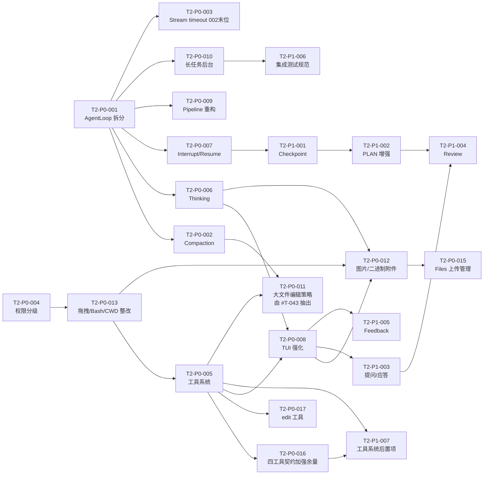

# 任务总看板 — 002-single-agent-complete

> 当前迭代：**单 Agent 完善期**。本看板同时承载迭代立项（目标/不做范围/验收/风险）与执行调度，不再拆分 `openspec/changes/00X` 四件套。
>
> 历史迭代已归档，本看板只聚焦当前迭代的立项与执行。

---

## 1–2. 迭代立项与当前上下文

立项（§1.1–§1.5）、风险、优先级说明及 **§2 当前迭代上下文** 的完整正文见 **[SCOPE_AND_CONTEXT.md](./SCOPE_AND_CONTEXT.md)**。

---

## 3. 任务状态说明

| 状态 | 含义 |
|------|------|
| **TODO** | 待认领 |
| **DOING** | 开发中（已认领） |
| **PENDING_INTEGRATION** | 等待集成测试与合并：工程师已在功能分支按 [INTEGRATION_MERGE_AND_ACCEPTANCE.md](../INTEGRATION_MERGE_AND_ACCEPTANCE.md) 完成集成与 E2E 全量验收并推送；等待 Nibbles 合并入 develop 并复核通过 |
| **BLOCKED** | 阻塞（需在「阻塞点」中说明原因） |
| **DONE** | 已完成（含集成测试通过） |

**典型流转**：`TODO → DOING → PENDING_INTEGRATION → DONE`。阻塞时可为 `DOING` / `PENDING_INTEGRATION` → `BLOCKED` → `DOING` / `PENDING_INTEGRATION`。仅状态为 `TODO` 且负责人为空的任务可被认领；`PENDING_INTEGRATION` 表示已交集成、不可认领。

---

## 4. 任务索引

按 P0 → P1 与依赖排序；**T2-P0-003** 在**全部其它 T2-P0-00x 完成之后**再排期（末位调度）。认领时先读本节索引，再打开对应 `tasks/T2-*.md`；**状态以任务文件内为准**。

**门禁口径**（避免各任务卡重复粘贴长命令）：fmt/clippy、分类集成与全量验收以 [INTEGRATION_TEST_SPEC §7](../../openspec/specs/guides/testing/INTEGRATION_TEST_SPEC.md)（§7.1 / §7.2 / §7.4）为准；E2E 见 [E2E_TEST_SPEC.md](../../openspec/specs/guides/testing/E2E_TEST_SPEC.md)。integration 二进制分组以 [`scripts/test-groups.sh`](../../scripts/test-groups.sh) 为准；交付前更新分组见 [Dispatcher §5](../Dispatcher.md)。

| ID | 名称 | 状态 | 负责人 | 分支 | 文件 |
|------|------|------|--------|------|------|
| **T2-P0-001** | Agent Loop 模块化拆分 | `DONE` | Jerry | `feature/agent-loop-split` | [tasks/T2-P0-001.md](./tasks/T2-P0-001.md) |
| **T2-P0-002** | 摘要 prompt 升级 + context v2 收尾 | `DONE`（`2026-04-26` Nibbles 合并入 `develop` @ `1fb0a62`，develop 上全量门禁复跑通过） | Spike | `feature/compaction-prompt-9section` | [tasks/T2-P0-002.md](./tasks/T2-P0-002.md) |
| **T2-P0-003** | OpenAI 流式 `stream_timeout_sec` | `PENDING_INTEGRATION` | Jerry | `feature/stream-timeout` | [tasks/T2-P0-003.md](./tasks/T2-P0-003.md) |
| **T2-P0-004** | 工作目录权限分级 | `DONE`（`2026-04-27` Nibbles 合并入 `develop` @ `11eb5e7`，develop 上全量门禁复跑通过） | Jerry | `feature/workspace-permission-tiers` | [tasks/T2-P0-004.md](./tasks/T2-P0-004.md) |
| **T2-P0-005** | 工具系统整改 | `DONE` | Spike | `feature/tool-system-cleanup` | [tasks/T2-P0-005.md](./tasks/T2-P0-005.md) |
| **T2-P0-006** | Thinking API 接入 + TUI 展示 | `TODO` | — | `feature/thinking-api-display` | [tasks/T2-P0-006.md](./tasks/T2-P0-006.md) |
| **T2-P0-007** | 中断/恢复 + transcript 完整性 | `DONE` | Spike | `feature/interrupt-resume` | [tasks/T2-P0-007.md](./tasks/T2-P0-007.md) |
| **T2-P0-008** | TUI 体验强化（合并 TASK-08） | `TODO` | — | `feature/tui-experience` | [tasks/T2-P0-008.md](./tasks/T2-P0-008.md) |
| **T2-P0-009** | 三套管道重构 | `TODO` | — | `feature/pipeline-unify` | [tasks/T2-P0-009.md](./tasks/T2-P0-009.md) |
| **T2-P0-010** | 长任务后台化 | `TODO` | — | `feature/long-task-background` | [tasks/T2-P0-010.md](./tasks/T2-P0-010.md) |
| **T2-P0-011** | 大文件编辑策略 | `TODO` | — | `feature/large-file-edit-strategy` | [tasks/T2-P0-011.md](./tasks/T2-P0-011.md) |
| **T2-P0-012** | 图片/二进制文件传给 LLM | `TODO` | — | `feature/llm-binary-attachments` | [tasks/T2-P0-012.md](./tasks/T2-P0-012.md) |
| **T2-P0-013** | 拖拽授权 / Bash 路径 / CWD 语义整改 | `DONE` | Jerry | `fix/drag-deny-cwd-remediation` | [tasks/T2-P0-013.md](./tasks/T2-P0-013.md) |
| **T2-P0-014** | 权限授权来源重构 | `DONE` | Tom | `feature/permission-source-redesign` | [tasks/T2-P0-014.md](./tasks/T2-P0-014.md) |
| **T2-P0-015** | OpenAI Files 上传管理 | `TODO` | — | `feature/llm-files-upload-manager` | [tasks/T2-P0-015.md](./tasks/T2-P0-015.md) |
| **T2-P0-016** | 四内置工具契约加强（write / bash 余量） | `DONE`（`2026-05-07` 合入 `develop` @ `a09ac01`，`run-integration-tests.sh all` EXIT_CODE=0） | Tom | `develop` | [tasks/T2-P0-016.md](./tasks/T2-P0-016.md) |
| **T2-P0-017** | `edit` 工具契约与实现 | `DONE`（`2026-05-07` 合入 `develop` @ `a09ac01`，同上全量门禁） | Tom | `develop` | [tasks/T2-P0-017.md](./tasks/T2-P0-017.md) |
| **T2-P1-001** | Checkpoint + 断点续跑 | `TODO` | — | `feature/checkpoint-resume` | [tasks/T2-P1-001.md](./tasks/T2-P1-001.md) |
| **T2-P1-002** | PLAN 模式增强 | `TODO` | — | `feature/plan-mode-enhance` | [tasks/T2-P1-002.md](./tasks/T2-P1-002.md) |
| **T2-P1-003** | 提问/应答机制 | `TODO` | — | `feature/ask-answer` | [tasks/T2-P1-003.md](./tasks/T2-P1-003.md) |
| **T2-P1-004** | 结果验证 + review 子流程 | `TODO` | — | `feature/review-verification` | [tasks/T2-P1-004.md](./tasks/T2-P1-004.md) |
| **T2-P1-005** | Feedback 回路（新增） | `TODO` | — | `feature/feedback-loop` | [tasks/T2-P1-005.md](./tasks/T2-P1-005.md) |
| **T2-P1-006** | 集成测试规范 | `TODO` | — | `feature/integration-test-standard` | [tasks/T2-P1-006.md](./tasks/T2-P1-006.md) |
| **T2-P1-007** | 工具系统后置项 | `TODO` | — | `feature/tool-system-deferred-followups` | [tasks/T2-P1-007.md](./tasks/T2-P1-007.md) |
| **T2-P1-008** | 内置 search_files 只读搜索工具 | `PENDING_INTEGRATION` | Spike | `feature/tool-system-cleanup` | [tasks/T2-P1-008.md](./tasks/T2-P1-008.md) |
| **T2-P1-009** | bash AST `detect_unsupported` 精度与误伤治理 | `TODO` | — | `feature/bash-ast-detect-precision` | [tasks/T2-P1-009.md](./tasks/T2-P1-009.md) |

## 5. 任务依赖拓扑（概览）

> **注**：T2-P0-003 仍从 T2-P0-001 出依赖边，**实施顺序**固定为**全部其它 T2-P0-00x 之后**（002 内最低、末位调度）。

---

