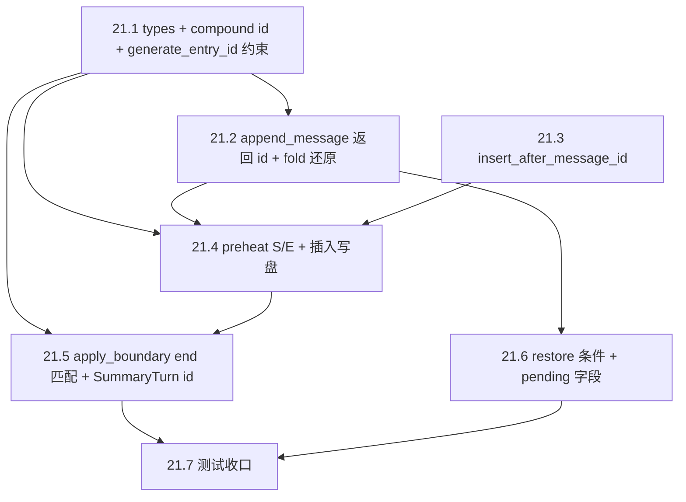

# 计划范例：TASK-21 §5.7 消息级 ID 与 compaction 锚点对齐

> 本文档由 Cursor 计划 `task-21_消息级_id` 迁入仓库，**路径已改为以 `agents/plan/` 为基准的相对链接**。任务已在主线完成；保留作 [PLAN_SPEC.md](./PLAN_SPEC.md) 第四节「完整计划」范例（认领流程、子项表、现状差距、API 一览、依赖图、集成 §4、Todo 第七节等）。

## 认领与分支（Dispatcher）

- 在 [TASK_BOARD.md](../TASK_BOARD.md) 将 **TASK-21** 负责人改为 **Jerry**、状态改为 **DOING**；**分支**列填写**当前实际 Git 分支名**（例如已在 `feature/context-async-compaction` 上则填该名）。**不**另建看板曾建议的 `feature/context-message-ids`，在本分支完成即可。
- **依赖**：TASK-20 为 `PENDING_INTEGRATION`。实施前将 **`develop`（含 TASK-20 合并结果）** 合并或 rebase 进**当前分支**，避免与主线长期分叉；无需为 TASK-21 单独再开一条功能分支。
- **行为规范**：编码、测试、提交、文档均须遵循 [Constitution.md](../../openspec/specs/Constitution.md) 与 Jerry 引用的各规范链接。

## 研发流程（对照 Dispatcher §3～§7 / Jerry）

| 阶段 | 动作 |
|------|------|
| **读上下文（§3）** | 除 §5.7 外，必读迭代 [tasks_details.md](../../openspec/changes/001-mvp/tasks_details.md) 中与 TASK-21 相关的原子子任务与边界、[design.md](../../openspec/changes/001-mvp/design.md) / [task.md](../../openspec/changes/001-mvp/task.md)；扫一眼 Architecture / Constitution 是否有关联约束。对应 todo：`context-read`。 |
| **开发前** | 工作区非 detached；已在目标分支上；按需与 `develop` 同步；阅读 [编码规范](../../openspec/specs/guides/coding/Codeing&Architecture_Spec.md)。含在 `claim-board-branch` / `context-read`。 |
| **开发中（§5）** | 编码（必要处注释）→ 单测 → 集成测；**每完成一个 21.x 或一块连贯改动即提交**（禁止囤积多子项一次提交）。 |
| **门禁** | `cargo fmt --all`、`cargo clippy --all-targets -- -D warnings`。**缩小范围**验证（单 crate / 过滤测试名 / `cargo test -j 1 … 某用例 -- --test-threads=1`）可前台短时跑。**§4 全量集成/E2E** 必须严格按 [INTEGRATION_MERGE_AND_ACCEPTANCE.md](../INTEGRATION_MERGE_AND_ACCEPTANCE.md)（见下文 **全量集成/E2E 执行规范**）；质量红线与顺序仍以该文档 §1 前质量红线、§「交付顺序」为准。对应 todo：`dev-gates`。 |
| **提交与进度** | 按 [commit-guard.mdc](../../.cursor/rules/commit-guard.mdc)；**历时**更新 `docs/status/` 下与**当前 Git 分支**对应的 md（分支名中 `/` 换成 `-`；见 [STATUS_GUIDE](../../openspec/specs/guides/workflow/STATUS_GUIDE.md)）。对应 todo：`status-ship`。 |
| **完成（§7）** | 自检通过后 TASK_BOARD → `PENDING_INTEGRATION`、推送远端；集成合并后由流程标 `DONE`。 |

## 子项清单与状态（对照看板 21.1～21.7）

| 子项 | 内容 | 计划状态 |
|------|------|----------|
| 21.1 | `UserTurn` 增加 `start_id`/`end_id`，`id` ≡ `start_id::end_id`；`SummaryTurn.id` 与 compaction 行一致 | 待做 |
| 21.2 | pack：`api/chat` 落盘后回填；fold：从 `MessageEntry.id` 还原 | 待做 |
| 21.3 | transcript：按 `MessageEntry.id == E` **之后**插入 compaction；锚点缺失策略 | 待做 |
| 21.4 | Preheat：`S`/`E` 与 `CompactionEntry.id = S::E`；成功后走 21.3；`transcript_compaction_entry_id` 存整串 | 待做 |
| 21.5 | `apply_boundary`：主路径 `UserTurn.end_id == E`，`splice(0..=k, [SummaryTurn])`；旧 turn-id 回退 | 待做 |
| 21.6 | `compaction_pending_from_entry` / `restore_completed` / `init_context_state` hydrate 与 §5.7.7 一致 | 待做 |
| 21.7 | 单测/集成测覆盖 §5.7.8 可表达场景 | 待做 |

---

## 目标与验收（含作用/意义）

**要做出什么**：运行时 `user_turns_list`、Layer 1 快照、`CompactionEntry`/`CompactionResult`、JSONL 行序与 Layer 2 splice 全部按 §5.7 的 **MessageId / `S::E` / 锚点后插入** 对齐。

**验收**（与看板 + §5.7.8 一致）：`cargo fmt --all`（或 `cargo fmt --check` 满足 CI）、`cargo clippy --all-targets -- -D warnings`；行为与 ASCII 总览及 5.7.1～5.7.6 条文一致；**标 `PENDING_INTEGRATION` 前**须完成 [INTEGRATION_MERGE_AND_ACCEPTANCE.md](../INTEGRATION_MERGE_AND_ACCEPTANCE.md) 分支侧 **§4 全量测试与验收**（执行方式见下文，**禁止**未确认全量通过即标集成）。

**用户故事/场景与意义**（分步）：

1. **持久化与内存一致**：用户多轮对话后，transcript 中每条 message 的 id 与内存 `UserTurn` 边界一一对应。**作用**：fold 与运行时共用同一套 id。**意义**：避免 restore/apply 因「turn 随机 id」找不到覆盖区间（不做则 §5.7.8 场景 2/3/4 易错）。
2. **Compaction 行插在语义锚点之后**：摘要覆盖段结束后若仍有新消息，compaction 行仍落在正确时间序。**作用**：`fold_entries_to_turns` 与磁盘顺序一致。**意义**：避免 fold 错位（场景 3）。
3. **apply 以 `end_id` 为主定位 `k`**：**作用**：与 L3 删前缀后「仅尾锚命中」规范一致。**意义**：与现有「start 缺失则从 0 splice 到 end」兼容路径合并为明确主路径 + 回退（场景 4）。

---

## 现状与差距（关键代码）

- [`TurnEntry::UserTurn`](../../src/core/session/manager/types.rs) 仅有单一 `id`；[`apply_boundary`](../../src/core/session/manager/types.rs) 用 `t.id() == covered_start_id/end_id` 定位区间，且 `SummaryTurn` 使用临时 `summary_*` id，与 §5.7.5/5.7.3 不符。
- [`Preheat::try_start`](../../src/core/compaction/preheat.rs) 中 `first_id`/`last_id` 来自 `t.id()`（将变为复合 id 后**不能**再代表 `S`/`E`）；`CompactionEntry.id` 为随机 `generate_entry_id()`，与 §5.7.3 的 **`S::E`** 不符；[`append_entry`](../../src/core/session/transcript.rs) 仅尾部追加，不满足 §5.7.4「插在 `id == E` 的 message 行之后」。
- [`api/chat/mod.rs`](../../src/api/chat/mod.rs) 先 `on_new_user_turn`（随机 id）再 `append_message`，内存 turn id 与 transcript message id **脱钩**。
- [`fold_entries_to_turns`](../../src/core/session/manager/context.rs) 仅在遇到 user 时用 `current_turn_id`（单值）作为整段 turn id，未区分 **首/末 message id**。
- [`init_context_state`](../../src/core/session/manager/context.rs) 中 `restore_completed` 条件 `t.id() == p.covered_end_id` 在 `covered_end_id` 为 message 级 **E** 后需改为匹配 **`end_id`**（并保留旧数据回退）。

---

## 子项与 API 一览（PLAN_SPEC「已有 / 新建」）

| 子项 | 主要已有接口 | 计划新建或变更 |
|------|----------------|----------------|
| 21.1 | `TurnEntry`、`generate_entry_id` | `compound_turn_id`（或等价）；`UserTurn` 字段；MessageId 与 `::` 的校验策略 |
| 21.2 | `SessionManager::append_message` / `try_append_message`、`on_new_user_turn`、`fold_entries_to_turns` | 两者返回 `MessageEntry` 新 id；chat 与 **dispatcher**（[session_ops.rs](../../src/ext/dispatcher/session_ops.rs)）等所有调用点同步 |
| 21.3 | `append_entry`、`write_file_atomic` | `insert_entry_after_message_id` |
| 21.4 | `Preheat::try_start`、`CompactionEntry` / `CompactionResult` | 快照 S/E 来源、`id = S::E`、写盘走插入 API |
| 21.5 | `ContextState::apply_boundary`、`set_compaction_entry_is_boundary_true` | 匹配与 splice 语义；`SummaryTurn.id` 来源 |
| 21.6 | `compaction_pending_from_entry`、`init_context_state`、`restore_completed` | restore 条件（`end_id` + 旧数据回退） |

---

## 各子项：文件、思路、接口、测试

### 21.1 类型与内存

- **文件**：[types.rs](../../src/core/session/manager/types.rs)、（可选）manager `mod` 导出辅助函数。
- **思路**：为 `UserTurn` 增加 `start_id: String`、`end_id: String`；`id` 字段保留但**约束**为 `format!("{start_id}::{end_id}")`（与文档 `::` 一致）。新增小函数如 `fn compound_turn_id(start: &str, end: &str) -> String`；在构造处统一调用。§5.7.1 要求 MessageId 不含子串 `::`：在 [`generate_entry_id`](../../src/core/session/manager/session_impl.rs) 或写入前加断言/校验（与现有 id 格式核对）。
- **接口**：扩展 `TurnEntry::UserTurn { id, start_id, end_id, ... }`；`id()` 仍返回 `&str`（即复合 id）。所有构造 `UserTurn` 的站点（chat、fold、单测 `make_user_turn` 等）补齐字段。
- **测试要点**：复合 id 解析辅助函数；非法 `::` 入参（若做校验）应失败或拒绝拼接。

### 21.2 pack / fold

- **文件**：[session_impl.rs](../../src/core/session/manager/session_impl.rs)（`append_message` / `try_append_message`）、[api/chat/mod.rs](../../src/api/chat/mod.rs)、[context.rs](../../src/core/session/manager/context.rs)、[session_ops.rs](../../src/ext/dispatcher/session_ops.rs) 等一切调用 `append_message` / `try_append_message` 的路径。
- **思路（pack）**：**pack** 指回合收尾时构造 `TurnEntry::UserTurn` 并调用 `on_new_user_turn`（非单独函数名）。当前用户句在 L343–344 已 `append_message`；回合结束后再写 assistant/tool。需**拿到每条落盘 message 的 id**：将 `append_message` / `try_append_message` 改为返回 `Result<String, AppError>`（新分配的 `MessageEntry.id`）。在 chat 中：记录 **user 行 id** 为 `start_id`；对 `convert_to_llm_format(&result.new_messages)` 的每次 append 记录 **最后一条 id** 为 `end_id`；然后构造 `UserTurn` 并 `on_new_user_turn`（顺序改为：**先写满 transcript，再 pack 内存**，与「回填」一致）。若 `new_messages` 不含 user，仍以已写的 user 行为 `start_id`，避免双写 user。**dispatcher / 插件**路径仅追加单条消息时，若本任务不要求为其构造 `UserTurn`，仍须适配新返回类型并在将来多消息回合与 id 语义一致。
- **思路（fold）**：在 `fold_entries_to_turns` 扫描 `Message` 时维护 `Option<String>`：`turn_first_msg_id`（该 turn 首条 user 对应行 id）、`turn_last_msg_id`（每条非 skip 的 message 更新为当前行 id）。闭合 `UserTurn` 时写入 `start_id`/`end_id`/`id = compound_turn_id(...)`。
- **接口**：`SessionManager::{append_message, try_append_message} -> Result<String, AppError>`；所有调用处用 `let _ = ...?` 或消费返回 id。
- **测试要点**：仅 user、无 assistant；多 tool 轮次；旧 JSONL 无 id 时仍走 `generate_entry_id` 回退（与现有 fold 行为兼容）。

### 21.3 Transcript 锚点插入

- **文件**：[transcript.rs](../../src/core/session/transcript.rs)（新函数 + 单测）、必要时 [transcript/tests.rs](../../src/core/session/transcript/tests.rs)。
- **思路**：实现 `insert_entry_after_message_id(path: &Path, anchor_message_id: &str, entry: &TranscriptEntry) -> Result<(), AppError>`：跳过 header，逐行解析；找到第一条 `Message` 且 `id == Some(anchor)` 的行，在其后插入序列化后的新行；其余行保持原字节或统一用 serde 再序列化（与 `set_compaction_entry_is_boundary_true` 一致：**整文件原子写** `write_file_atomic`）。**找不到锚点**：warn + 回退 `append_entry` 或返回 Err（在计划中**写死一种**并在 preheat 调用处统一处理）；与 [session_impl 并发 TODO](../../src/core/session/manager/session_impl.rs) 一致保持单线程假设。
- **接口**：新增 `insert_entry_after_message_id`；保留 `append_entry` 供无锚点/测试简路径。
- **测试要点**：多行 JSONL；锚点在中间；锚点缺失；compaction 行 `id` 为 `S::E`。

### 21.4 Preheat

- **文件**：[preheat.rs](../../src/core/compaction/preheat.rs)。
- **思路**：从 `snapshot` 首末 **`UserTurn`** 取 `start_id` / `end_id`（若无新字段则回退旧 `id()` 以兼容测试数据）。`S = first.start_id`，`E = last.end_id`，`batch_id = compound_turn_id(&S, &E)`。构造 `CompactionEntry`：`id = Some(batch_id.clone())`，`covered_start_id/covered_end_id = Some(S/E)`，`preheat_compaction_id` 与 `id` 对齐（与 §5.7.3 一致）。写盘：有路径且 `E` 非空时调 **`insert_entry_after_message_id(path, &E, ...)`**；失败时与现逻辑一致打 warn 且 `transcript_compaction_entry_id` 置 `None` / `append_ok = false`。`CompactionResult.transcript_compaction_entry_id = Some(batch_id)`。
- **依赖接口**：21.1、21.3；`generate_summary` 仍消费 `TurnEntry` 快照（仅 id 语义变严）。
- **测试要点**：多 turn 快照时 `CompactionEntry.id` ≠ 任一单条 `UserTurn.id`；单 turn 时可能相等。

### 21.5 apply_boundary

- **文件**：[types.rs](../../src/core/session/manager/types.rs)、[apply.rs](../../src/core/compaction/apply.rs)（`write_boundary_transcript` 已用整串 id，保持）。
- **思路**：求最小 `k` 使 `UserTurn.end_id == result.covered_end_id`；若无独立 `end_id`（旧数据）：用 `UserTurn.id` 按 `::` **拆右段**与 `covered_end_id` 比对（§5.7.5）。可选：`k` 命中后 `debug_assert`/`warn` 校验 `user_turns_list[k].start_id == covered_start_id`。`splice(0..=k, [summary_turn])`，其中 `SummaryTurn.id = result.transcript_compaction_entry_id.clone().unwrap_or_else(|| compound(S,E))`。保留 `(None, Some(e))` 的 **0..=e** 回退（L3）。
- **接口**：仅内部算法变更；`CompactionResult` 字段不变。
- **测试要点**：更新 [compaction/tests.rs](../../src/core/compaction/tests.rs) 中 `UserTurn` 构造；覆盖主路径 end 匹配、旧双 turn-id、缺失 start 的 0..=end；场景 5：`SummaryTurn`/boundary 与 `S::E` 碰撞时拒绝或明确错误（按你实现的策略写断言）。

### 21.6 restore / hydrate

- **文件**：[context.rs](../../src/core/session/manager/context.rs)（`compaction_pending_from_entry`、`init_context_state`）、[preheat.rs](../../src/core/compaction/preheat.rs)（`restore_completed` 消费字段已齐）。
- **思路**：`compaction_pending_from_entry` 继续从 `ce.id` / `covered_*` 填 `CompactionResult`；确认 `covered_end_id` 为 **E**。`init_context_state` 中 `restore_completed` 条件改为：存在 `UserTurn` 满足 `end_id == p.covered_end_id` **或** 旧 `t.id() == p.covered_end_id`（兼容 TASK-20 已写磁盘）。
- **测试要点**：与 [context_management_tests.rs](../../tests/context_management_tests.rs) 中 restore 用例对齐并增量扩展。

### 21.7 测试

- **单测**：`transcript` 插入行序；`apply_boundary` 多 turn；`fold_entries_to_turns` 还原 `start_id`/`end_id`；id 冲突策略（场景 5）。
- **集成测**：在 `tests/context_management_tests.rs` 构造「旧消息 + 新消息 + 中间插入 compaction」的 JSONL，验证 fold 顺序与 `restore_completed`（场景 3/2）；必要时补充「仅 end 匹配」片段（场景 4）。
- **E2E / 场景库 / §4 全量**：与下文 **「集成与 E2E 交付」** 一致：场景库 **无变更则不改**；若 INTEGRATION 文档要求全量 `cli_tests` / E2E，在 **`dev-gates`** 按 **§4 全量**（`.integration_test_output.log` + 后台 + 轮询 + 超时）补跑并修复，不得弱化断言。

---

## 实施顺序与依赖



---

## 风险与备选

| 风险 | 备选/降级 |
|------|-----------|
| `append_message` 改返回类型触及大量调用点 | 先加 `append_message_with_id`，逐步迁移；或一次性改签名并批量修复编译错误（推荐一次到位避免双 API）。 |
| 大文件上「插入行」重写全文件 O(n) | 与 §5.7.4 及现有 `set_compaction_entry_is_boundary_true` 一致；后续优化为稀疏索引（超出 TASK-21）。 |
| 旧 transcript 无 `MessageEntry.id` | fold 继续 `generate_entry_id` 回退；`end_id` 匹配失败时走 §5.7.5 旧双 id 回退。 |
| TASK-20 尚未合并 | 将 `develop` merge/rebase 进**当前分支**；冲突集中在 `preheat`/`context_management_tests` 时以 §5.7 正文为准解决。 |

---

## 集成与 E2E 交付（PLAN_SPEC §6）

- **集成测试**：扩展 [tests/context_management_tests.rs](../../tests/context_management_tests.rs) 覆盖锚点插入与重启 restore（§5.7.8 场景 2–4 的可自动化部分）；实现与断言须符合 [INTEGRATION_TEST_SPEC.md](../../openspec/specs/guides/testing/INTEGRATION_TEST_SPEC.md)。
- **E2E / 场景库**：本任务核心是 **transcript 与内存一致性**，无新增用户可见 CLI 子命令时，**E2E 场景库可按「无变更则不改」**处理；若 [INTEGRATION_MERGE_AND_ACCEPTANCE.md](../INTEGRATION_MERGE_AND_ACCEPTANCE.md) §1 核对后需补 [E2E_SCENARIO_LIBRARY.md](../../openspec/specs/guides/testing/E2E_SCENARIO_LIBRARY.md)，按该文档 **交付顺序**在 §4 前完成。若对本分支仍要求全量 `cli_tests` / E2E 门槛，则在 **`dev-gates`** 中按下文 **§4 全量**流程补跑并修复，不得弱化断言。

### 全量集成/E2E 执行规范（对齐 INTEGRATION_MERGE_AND_ACCEPTANCE 约 L41–L79）

与文档 **「测试执行策略：子 Agent 跑测试 + 主 Agent 监控」** 及 **「常见错误（须避免）」「日志要求」「禁止行为」**（约 L41–L79）一致，**禁止**以下做法作为 §4 全量验收：

- 在 **前台**直接跑**全量** `cargo test`（尤其 Agent/IDE **短 block 超时**），以免编译 + 多 crate 长时间无输出被 **Abort**、误判卡死。
- 使用 **`cargo test … 2>&1 | tail`** 等管道试探全量（结束前下游读不到流、看不到当前用例名）。
- 把全量当成「应立刻失败」的探测；**快速失败**仅适用于**缩小范围**后的命令。

**§4 全量门禁（正确习惯）**：

1. 在仓库 **`pi-rust-wasm/`** 目录下，将全量测试 **重定向** 到已 gitignore 的 **[`.integration_test_output.log`](../../.integration_test_output.log)**，**后台**运行（`&`），记录 `TEST_PID=$!`。
2. 推荐命令骨架与文档一致（可按项目最终清单调整 crate/flags），例如：

```bash
cd pi-rust-wasm
RUST_LOG=pi_wasm=debug,info cargo test -j 1 -- --nocapture --test-threads=1 \
  > .integration_test_output.log 2>&1 &
TEST_PID=$!
wait $TEST_PID
echo "EXIT_CODE=$?" >> .integration_test_output.log
```

（若主 Agent 不阻塞：后台启动后周期性读日志；收尾可由子 shell 或 `wait` 在子 Agent 内完成，**须**把 `EXIT_CODE` 追加进同一日志文件。）

3. **主 Agent 监控**：**不得**对全量进程无限阻塞等待；应周期性读取 `.integration_test_output.log`（如 `tail -80`），轮询间隔 **指数退避**（5s → 10s → 20s → 30s，上限 30s），必要时 `tail -f` 观察。
4. **超时与介入**（与文档一致）：
   - 单用例约 **120 秒**无新输出且未完成 → 判定卡住；
   - 全量约 **10 分钟**仍未结束 → 整体超时；
   - 达到阈值 → **`kill`** 对应 PID → 保留/追加完整日志 → **分析**卡住的用例与最后输出 → **修复**（禁止无根因 `#[ignore]`/删断言）→ **按同样模式重跑**直至通过或确认为环境限制。
5. **日志与状态**：每次执行（含超时中止）保留完整日志；卡住时诊断结论写入 **`docs/status/`** 下当前分支对应 md 或提交说明（**卡在哪里、为什么、如何修复**）。
6. **禁止行为（与文档 L72–L77 一致）**：禁止未确认测试全部通过即标 **`PENDING_INTEGRATION`**；禁止为通过而弱化断言或糊弄 `#[ignore]`。

**与 `dev-gates` todo 的分工**：日常开发可用 **缩小范围** `cargo test` 前台快速验证；**交付前**必须按本节完成 **§4 全量**流程并确认日志末尾 **`EXIT_CODE=0`**（或文档规定的等价判定）。

---

## 计划输出前自检（PLAN_SPEC）

- [x] 子项 21.1～21.7 全部列出并标「待做」
- [x] 总体目标与验收标准已写
- [x] 用户故事/作用/意义已按步骤说明
- [x] 每子项含文件、思路、接口、测试要点（接口维度见上文 **子项与 API 一览** 表）
- [x] 实施顺序与依赖图已给出
- [x] 风险与备选已写
- [x] 集成与 E2E：已说明集成测、场景库条件、以及与 [INTEGRATION_MERGE_AND_ACCEPTANCE.md](../INTEGRATION_MERGE_AND_ACCEPTANCE.md) **§4 全量**执行方式（后台日志、轮询、超时、禁止项）的衔接

---

## 完成后的 Dispatcher 动作（实现阶段执行，非本 Plan 模式）

与 todo `status-ship` 一致：**开发过程中**持续更新 `docs/status/` 下当前分支对应的 status 文件；全子项与门禁通过后，将 TASK-21 → `PENDING_INTEGRATION`；按 [commit-guard.mdc](../../.cursor/rules/commit-guard.mdc) 提交并推送。若 `append_message` / transcript 行为对外部集成方可见，按 [DOCUMENTATION_GUIDE.md](../../openspec/specs/guides/workflow/DOCUMENTATION_GUIDE.md) 更新 `docs/` 或 [core/README.md](../../src/core/README.md) 等现有说明，**不**新建用户未要求的独立长篇文档。

---

## 七、Todo 总表（与 YAML / 正文对照，[PLAN_SPEC.md](./PLAN_SPEC.md) 一.7）

| id | 类型 | 对应正文 |
| :--- | :--- | :--- |
| `claim-board-branch` | 流程 | 认领与分支 |
| `context-read` | 流程 | 研发流程表 · 读上下文 |
| `types-userturn-ids` | 实施 | **21.1** |
| `append-return-id-pack-fold` | 实施 | **21.2** |
| `transcript-insert-anchor` | 实施 | **21.3** |
| `preheat-S-E` | 实施 | **21.4** |
| `apply-boundary-end-k` | 实施 | **21.5** |
| `restore-hydrate` | 实施 | **21.6** |
| `tests-578` | 实施 | **21.7** |
| `dev-gates` | 流程 | 门禁与 §4 全量 |
| `status-ship` | 流程 | status / commit / PENDING_INTEGRATION |

**写后复核**：每条 todo 与上表及正文 **21.x** 双向一致（见 PLAN_SPEC 第六节）。
