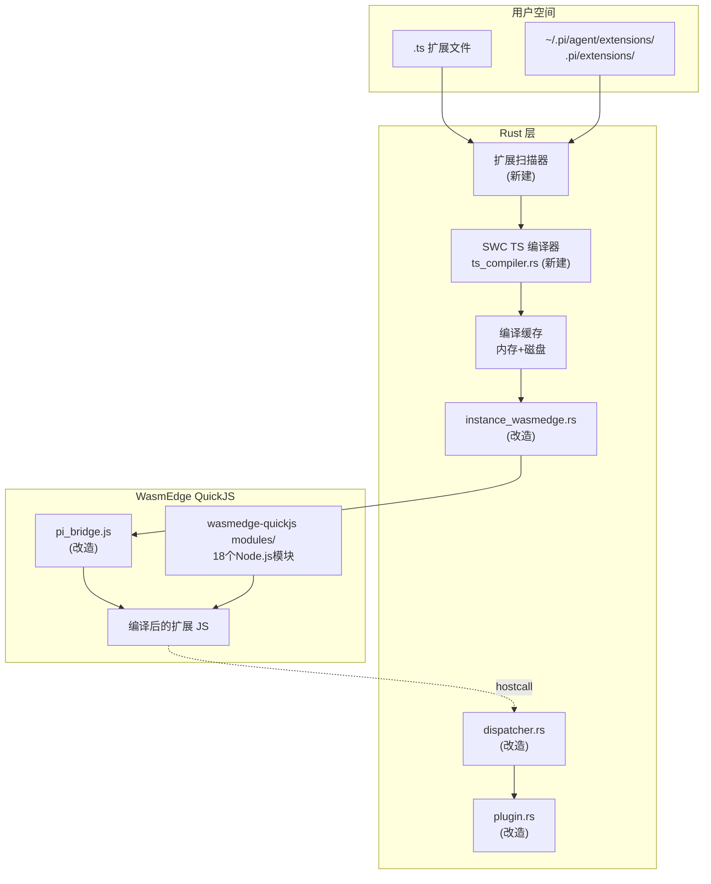
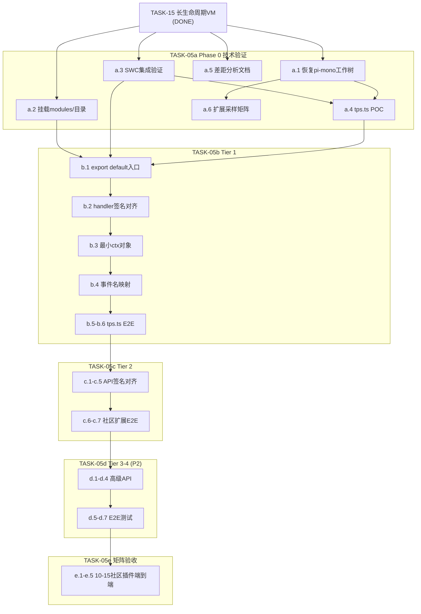

# 开发计划：pi-mono 生态插件兼容（TASK-05a/b/c/d/e）

**案例定位**（[PLAN_SPEC.md](./PLAN_SPEC.md) 第四节）：**多 Phase、多 Tier、矩阵式验收**横切任务的长计划范例；与 [PLAN_EXAMPLE_CLI.md](./PLAN_EXAMPLE_CLI.md) 的「单 crate 多子命令渐进」互补。新任务若规模类似可复用章节顺序，**不必**等同长度；仅 Phase 0 时可缩为 SKELETON + 技术方案链接。

本计划对照 PLAN_SPEC 编写，覆盖 TASK-05 拆分后的全部阶段（含矩阵端到端验收 **TASK-05e**）。  
技术方案详见 [pi-mono-compat-strategy.md](../../openspec/specs/architecture/plugin-system/pi-mono-compat-strategy.md)。

**总体验收（社区规模）**：由 **TASK-05e** 统一执行并勾选——在 TASK-05d 完成后，按 `extension_compat_matrix.md` 对 **10–15 个** pi-mono **社区**插件做端到端兼容验收（与 Phase 0 矩阵采样一致）。TASK-05b/c/d 子项中的少量社区扩展为**分层门禁**，不替代 05e。

---

## 一、子项清单（与 [TASK_BOARD.md](./TASK_BOARD.md) 同步）

### TASK-05a | Phase 0 技术验证与差距分析（`DONE`）

- [✓] a.1 恢复 pi-mono 完整工作树（确保能 npm install + tsc 编译）
- [✓] a.2 挂载 wasmedge-quickjs modules/ 目录（启用 18 个已有 Node.js 模块）
- [✓] a.3 SWC crate 集成验证（TS→JS 转译 POC）
- [✓] a.4 tps.ts 打包+加载 POC（在 wasmedge_quickjs 中执行编译后的 JS）
- [✓] a.5 ExtensionAPI 差距分析文档输出
- [✓] a.6 采样 10-15 个 pi-mono 社区扩展，输出兼容性评估矩阵

### TASK-05b | Tier 1 纯事件监听型扩展

- [ ] b.1 改造扩展入口：支持 `export default function(pi)` 模式
- [ ] b.2 对齐 `pi.on(event, handler)` handler 签名（传 ctx 参数）
- [ ] b.3 实现最小 ctx 对象（hasUI、cwd、ui.notify）
- [ ] b.4 对齐事件类型名（agent_start/agent_end 等 pi-mono 映射）
- [ ] b.5 tps.ts 端到端测试（零修改加载 + 事件触发 + notify 回调）
- [ ] b.6 固化为自动化 E2E 测试

### TASK-05c | Tier 2 命令+exec+基础 UI

- [x] c.1 对齐 `pi.exec(cmd, args[], opts)` 签名
- [x] c.2 对齐 `pi.registerCommand(name, {description, handler})`
- [x] c.3 对齐 `pi.registerTool(toolDef)` TypeBox schema 兼容
- [x] c.4 扩展 ctx.ui：select、confirm、input、setStatus
- [x] c.5 对齐 `pi.sendMessage(msg, options)` 签名
- [x] c.6 2-3 个 Tier 2 社区扩展兼容性测试（选自矩阵；服务于总体 10–15 个社区插件兼容目标）
- [x] c.7 固化为自动化 E2E 测试

### TASK-05d | Tier 3-4 TUI 组件+深度会话 API

- [ ] d.1 实现 `ctx.ui.custom()` + TUI 组件兼容层
- [ ] d.2 实现高级 UI：setWidget、setFooter、setHeader、editor
- [ ] d.3 实现 `ctx.sessionManager` 只读接口
- [ ] d.4 实现 `ctx.model` / `ctx.modelRegistry`
- [ ] d.5 diff.ts 端到端测试
- [ ] d.6 files.ts 端到端测试
- [ ] d.7 固化为自动化 E2E 测试

### TASK-05e | 社区插件矩阵端到端兼容验收

- [ ] e.1 对照 [`extension_compat_matrix.md`](../../docs/reports/extension_compat_matrix.md) 锁定本批次 **10–15** 个社区插件清单（名称、来源、Tier、核心验证路径）
- [ ] e.2 为每个插件写明「通过」判定（如：SWC 编译 → `load_plugin` → 触发约定事件/命令/工具路径）
- [ ] e.3 逐插件执行验证并记录结果（建议在同目录或 `docs/reports/` 下维护验收表，与矩阵交叉引用）
- [ ] e.4 将其中高价值路径纳入 `tests/` 或 `./scripts/run-integration-tests.sh` 可复用步骤（可选，不降低 10–15 全量手测/记录要求）
- [ ] e.5 提交 Nibbles 集成前自检：矩阵内本批次插件 **≥10** 个已勾选为通过（与 TASK-05a 验收「10+ 矩阵」口径一致）

---

## 二、目标与验收

**总体目标**：使 pi-mono 社区扩展（`.ts` 文件）可在 pi-rust-wasm 上零修改运行，用户体验与 pi-mono 一致——写 `.ts` 放目录，自动加载。

**技术路线**：方案 C（SWC + Rust 模块解析）——Rust 层完成 TS→JS 转译，通过 WasmEdge QuickJS 执行编译产物，配合改造后的 `pi_bridge.js` 提供 pi-mono 兼容 API。

**总体验收标准**：
- **社区插件兼容测试**：全系列完成后，**10–15 个** pi-mono **社区**插件通过兼容测试（与 `extension_compat_matrix` 采样规模一致）
- Tier 1: 至少 1 个纯事件监听扩展零修改运行（tps.ts）
- Tier 2: 至少 2 个含 registerCommand + exec 的扩展零修改运行
- 每个 Tier 有对应的自动化 E2E 测试（可优先覆盖矩阵中各 Tier 的代表扩展）
- 交付前全量门禁与 [INTEGRATION_MERGE_AND_ACCEPTANCE.md](../INTEGRATION_MERGE_AND_ACCEPTANCE.md) 一致（推荐 `./scripts/run-integration-tests.sh all` 或等价 `cargo test -j 1 … --test-threads=1` 串行策略，见 INTEGRATION_TEST_SPEC §7.1）

### 架构数据流



---

## 三、各子项详细计划

### TASK-05a：Phase 0 技术验证与差距分析

#### a.1 恢复 pi-mono 完整工作树

**用户故事**：开发者需要一份可编译的 pi-mono 源码来测试扩展打包和 API 分析。
**作用**：提供 pi-mono 扩展的编译环境和 npm 依赖树。
**意义**：不做则无法验证 SWC 编译产物的正确性，也无法获取完整的 ExtensionAPI 类型。

**涉及文件**：`Tomcat/pi-mono/`（当前为浅克隆无工作树）
**实现思路**：`git clone` 完整仓库或 `git checkout` 恢复工作树，然后 `npm install`。
**依赖接口**：无
**测试要点**：
- `tsc --noEmit` 无错误
- `node_modules/@mariozechner/pi-coding-agent` 存在

#### a.2 挂载 wasmedge-quickjs modules/ 目录

**用户故事**：扩展中 `require('fs')` 或 `import fs from 'fs'` 能正常解析。
**作用**：激活 wasmedge-quickjs 自带的 18 个 Node.js 兼容模块（fs/path/buffer/crypto/events 等）。
**意义**：不做则扩展中任何 Node.js API 调用都会失败，无法运行实际扩展。

**涉及文件**：
- [`src/ext/instance_wasmedge.rs`](../../src/ext/instance_wasmedge.rs)：WasmEdge 实例创建、preopen 配置
- `assets/wasm/wasmedge_quickjs.wasm`：QuickJS Wasm 二进制
- `Tomcat/wasmedge-quickjs/modules/`：Node.js polyfill 源码

**当前状态**：`instance_wasmedge.rs` 的 preopen 只有一条脚本目录挂载：
```rust
let preopen = format!(".:{}", host_dir.display());
WasiModule::create(Some(argv), None, Some(vec![preopen.as_str()]))
```

**实现思路**：
1. 将 `Tomcat/wasmedge-quickjs/modules/` 拷贝到 `pi-rust-wasm/assets/modules/`
2. 在 `WasiModule::create` 的 preopen 列表中新增 `modules/` 挂载：

```rust
let preopen_script = format!(".:{}", host_dir.display());
let modules_dir = resolve_modules_path(); // assets/modules/
let preopen_modules = format!("./modules:{}", modules_dir.display());
WasiModule::create(Some(argv), None, Some(vec![preopen_script.as_str(), preopen_modules.as_str()]))
```

**依赖接口**：`WasiModule::create()` 的 preopen 参数
**测试要点**：
- 正常：JS 脚本中 `require('path').join('a', 'b')` 返回 `'a/b'`
- 边界：`require('child_process')` 应抛出明确的 "module not found" 而非 crash

#### a.3 SWC crate 集成验证

**用户故事**：在 Rust 层将 `.ts` 文件转译为 `.js`，为后续零构建加载奠定基础。
**作用**：验证 SWC 7 个 crate 可在 pi-rust-wasm 中正常编译和执行。
**意义**：确认方案 C 的可行性；若不可行则及时退回方案 A（esbuild）。

**涉及文件**：
- [`Cargo.toml`](../../Cargo.toml)：新增 7 个 SWC 依赖
- 新建 [`src/ext/ts_compiler.rs`](../../src/ext/ts_compiler.rs)：TS→JS 编译模块

**依赖版本**（参考 pi_agent_rust `Cargo.toml`）：
```toml
swc_common = "18.0.1"
swc_ecma_ast = "20.0.1"
swc_ecma_parser = "34.0.0"
swc_ecma_transforms_base = "37.0.0"
swc_ecma_transforms_typescript = "41.0.0"
swc_ecma_codegen = "23.0.0"
swc_ecma_visit = "20.0.0"
```

**实现思路**（参考 pi_agent_rust `extensions_js.rs:6872`）：
```rust
pub fn transpile_typescript(source: &str, filename: &str) -> Result<String, AppError> {
    // 1. swc_ecma_parser::parse_module (Syntax::Typescript, tsx 自动检测)
    // 2. resolver(unresolved_mark, top_level_mark, false)
    // 3. strip(unresolved_mark, top_level_mark) -- 去除类型注解
    // 4. swc_ecma_codegen::Emitter 输出 JS 字符串
}
```

**依赖接口**：`swc_ecma_parser::parse_module`、`swc_ecma_transforms_typescript::strip`
**需新建接口**：`pub fn transpile_typescript(source: &str, filename: &str) -> Result<String, AppError>`
**测试要点**：
- 正常：`const x: number = 1` → `const x = 1`
- 正常：`export default function(pi: ExtensionAPI) {}` → `export default function(pi) {}`
- 边界：TSX 语法、装饰器、枚举
- 异常：语法错误的 TS 返回清晰错误信息

#### a.4 tps.ts 打包+加载 POC

**用户故事**：验证一个真实的 pi-mono 扩展能在 pi-rust-wasm 环境中加载。
**作用**：端到端验证 SWC 编译 + WasmEdge QuickJS 执行的完整链路。
**意义**：确认从 .ts 到运行的全流程可行，暴露可能的兼容性问题。

**涉及文件**：
- `pi-mono/.pi/extensions/tps.ts`：测试用扩展源码
- [`src/ext/ts_compiler.rs`](../../src/ext/ts_compiler.rs)：a.3 产出
- [`src/ext/instance_wasmedge.rs`](../../src/ext/instance_wasmedge.rs)：执行编译后的 JS

**实现思路**：
1. 用 a.3 的 `transpile_typescript` 编译 tps.ts
2. 将编译产物喂给 `run_script`（带 pi_bridge.js 前置）
3. 记录成功/失败，列出遇到的问题（缺失 API、模块解析失败等）

**依赖接口**：`transpile_typescript`、`WasmInstance::run_script`
**测试要点**：
- JS 产物可被 QuickJS 解析（无语法错误）
- `export default function` 入口被正确识别（此时可能还不能调用，但不能 crash）

#### a.5 ExtensionAPI 差距分析文档

**用户故事**：团队需要一份正式文档来评估每个 API 的兼容工作量。
**作用**：为 Tier 1-4 的实施提供精确的 API 级工作项列表。
**意义**：不做则后续实施时无法准确估工，容易遗漏。

**涉及文件**：新建 [`docs/reports/extension_api_gap_analysis.md`](../../docs/reports/extension_api_gap_analysis.md)
**实现思路**：基于技术方案文档 §13.4 的差距表，对 ExtensionAPI 全部公开方法逐一标注：已对齐 / 签名不同需适配 / 完全缺失需新增 / 需 stub，并标注所属 Tier。
**测试要点**：文档覆盖 ExtensionAPI 的全部公开方法

#### a.6 扩展采样评估矩阵

**用户故事**：需要了解真实社区扩展的 API 使用分布，避免只对齐少数 API 而遗漏常用功能。
**作用**：按 Tier 1-5 分类 10-15 个扩展，形成兼容性矩阵。
**意义**：3 个内部样本不能代表社区，需要更广泛的采样。

**涉及文件**：新建 [`docs/reports/extension_compat_matrix.md`](../../docs/reports/extension_compat_matrix.md)
**实现思路**：
1. 从 pi-mono 社区收集 10-15 个扩展（GitHub、npm）
2. 对每个扩展提取 import 列表和 API 调用列表
3. 按 Tier 1-5 分类，输出矩阵表

**测试要点**：矩阵至少覆盖 10 个扩展，每个标注 Tier 和依赖的 API 列表

> **a.2 / a.3 / a.5 可并行执行；a.4 依赖 a.1 + a.3；a.6 依赖 a.1**

---

### TASK-05b：Tier 1 纯事件监听型扩展

#### b.1 改造扩展入口

**用户故事**：扩展以 `export default function(pi)` 为入口，与 pi-mono 一致。
**作用**：支持 pi-mono 扩展的标准入口模式。
**意义**：不做则所有 pi-mono 扩展都无法加载——入口机制根本不兼容。

**涉及文件**：
- [`assets/js/pi_bridge.js`](../../assets/js/pi_bridge.js)：需增加扩展加载 wrapper
- [`src/ext/plugin.rs`](../../src/ext/plugin.rs)：扩展加载流程
- [`src/ext/instance_wasmedge.rs`](../../src/ext/instance_wasmedge.rs)：`run_script` 调用方式

**当前状态**：脚本顶层执行，`globalThis.pi` 预注入，扩展直接使用 `pi.on(...)` 等全局调用。

**实现思路**：
1. SWC 编译后的 JS 包含 `export default function(pi) { ... }`
2. pi_bridge.js 增加扩展加载 wrapper：执行扩展 JS 获取模块后调用 `module.default(pi)`
3. WasmEdge QuickJS 的 ESM `export default` 支持需验证——**兜底方案**：若不支持 ESM export，在 SWC 编译阶段通过自定义 visitor 将 `export default function` 转换为 `globalThis.__pi_ext_init = function`，pi_bridge.js 侧调用 `globalThis.__pi_ext_init(pi)`

**依赖接口**：`globalThis.pi`（pi_bridge.js 构建）
**需新建接口**：扩展加载 wrapper（在 pi_bridge.js 中）
**测试要点**：
- 正常：`export default function(pi) { pi.on('test', () => {}) }` 成功注册 handler
- 异常：非函数导出返回明确错误

#### b.2 对齐 pi.on handler 签名

**用户故事**：扩展 handler 收到 `(event, ctx)` 两个参数，可通过 ctx 访问上下文。
**作用**：使 handler 签名与 pi-mono 一致。
**意义**：几乎所有 pi-mono 扩展的 handler 都使用 `ctx` 参数，不对齐则无扩展可运行。

**涉及文件**：
- [`assets/js/pi_bridge.js`](../../assets/js/pi_bridge.js)：事件分发逻辑（`events.subscribe` / `__pi_dispatch_event`）
- [`src/ext/dispatcher.rs`](../../src/ext/dispatcher.rs)：事件分发时需携带 ctx 数据

**当前状态**：handler 只收到 `(eventPayload)`，ctx 未传递。

**实现思路**：
1. `__pi_dispatch_event` 中构造 ctx 对象（见 b.3）
2. 调用 handler 时传 `handler(eventPayload, ctx)` 而非 `handler(eventPayload)`
3. Rust 侧 `deliver_event()` 需携带 ctx 所需数据（cwd、hasUI 等）序列化到 event payload 中

**依赖接口**：当前 `pi_bridge.js` 的 `events.subscribe` / `events.emit`
**测试要点**：
- handler 第二个参数 ctx 非 undefined
- `ctx.hasUI` 返回布尔值
- `ctx.cwd` 返回字符串

#### b.3 实现最小 ctx 对象

**用户故事**：Tier 1 扩展使用 `ctx.hasUI` 判断是否有 UI，用 `ctx.ui.notify()` 发通知。
**作用**：提供 Tier 1 扩展运行所需的最小上下文。
**意义**：ctx 是 pi-mono handler 的核心参数，不提供则所有 handler 内的逻辑都会报错。

**涉及文件**：
- [`assets/js/pi_bridge.js`](../../assets/js/pi_bridge.js)：ctx 对象构造
- [`src/ext/dispatcher.rs`](../../src/ext/dispatcher.rs)：提供 ctx 数据源

**当前状态**：pi_bridge.js 中 ctx 对象可能已有定义（`cwd`, `model`, `hasUI`, `ui.*`），但 handler 调用时未正确传递第二个参数。需确认后最小改动。

**Tier 1 最小集**：

```javascript
var ctx = {
    hasUI: true,
    cwd: hostCall('system', 'getCwd', {}).data,
    ui: {
        notify: function(message, options) {
            return hostCallAsync('ui', 'notify', { message: message, options: options });
        }
    }
};
```

**依赖接口**：`hostCall('system', 'getCwd')`（已有）、`hostCallAsync('ui', 'notify')`（已有）
**需新建接口**：无（复用已有 hostcall）
**测试要点**：
- `ctx.hasUI === true`
- `ctx.cwd` 为有效路径
- `ctx.ui.notify('hello')` 不抛错

#### b.4 对齐事件类型名

**用户故事**：扩展通过 `pi.on("agent_start", ...)` 注册 handler，事件名须与 pi-mono 一致。
**作用**：确保 pi-mono 的事件名在 pi-rust-wasm 中可被正确识别和分发。
**意义**：事件名不匹配则 handler 永远不会触发。

**涉及文件**：
- [`src/ext/dispatcher.rs`](../../src/ext/dispatcher.rs)：事件分发，需建立映射表
- [`assets/js/pi_bridge.js`](../../assets/js/pi_bridge.js)：事件注册侧

**实现思路**：建立 pi-mono 事件名 → pi-rust-wasm 内部事件的映射表。核心 Tier 1 映射：
- `agent_start` / `agent_end`
- `turn_start` / `turn_end`
- `session_start` / `session_end`
- `tool_call` / `tool_result`

**测试要点**：`pi.on("agent_start", handler)` 在 agent 启动时触发

#### b.5-b.6 tps.ts E2E + 自动化测试

**用户故事**：CI 能自动验证 tps.ts 零修改运行。
**作用**：端到端验证 Tier 1 的完整链路。
**意义**：无自动化测试则回归时无法发现兼容性退化。

**涉及文件**：[`tests/wasmedge_e2e_tests.rs`](../../tests/wasmedge_e2e_tests.rs)（新增测试用例）

**实现思路**（参考现有 `setup_long_lived_vm_test()` 模式）：
1. 用 `transpile_typescript` 编译 tps.ts
2. 通过 `start_session_vm` 加载编译后的 JS
3. `dispatch_session_event` 分发 `agent_start`
4. 验证 handler 被调用、`ctx.ui.notify` 被回调宿主

**测试要点**：
- 编译成功，无语法错误
- `agent_start` 事件触发 handler
- `ctx.ui.notify` 回调被 HostApiDispatcher 接收

---

### TASK-05c：Tier 2 命令+exec+基础 UI

#### c.1 对齐 exec 签名

**用户故事**：扩展调用 `pi.exec('git', ['log', '--oneline'], { cwd: projectDir })` 执行命令。
**作用**：使 exec 签名与 pi-mono 完全一致。
**意义**：pi-mono 扩展大量使用 exec 三参数形式，当前 bridge 只支持单参数。

**涉及文件**：
- [`assets/js/pi_bridge.js`](../../assets/js/pi_bridge.js)：exec 参数透传
- [`src/ext/dispatcher.rs`](../../src/ext/dispatcher.rs)：`fs::executeBash` 处理 args

**当前状态**：`pi.exec(command, args, options)` 在 bridge 已声明三参数，但 dispatcher 的 `executeBash` 只使用 `command` 和 `cwd`，**args 未处理**。

**实现思路**：dispatcher `fs::executeBash` 增加 `args` 参数解析，拼接到命令中或作为独立参数传递；支持 `options.cwd`、`options.timeout`、`options.env`。

**依赖接口**：已有 `hostCallAsync('fs', 'executeBash', {...})`
**测试要点**：`pi.exec('echo', ['hello'], { cwd: '/tmp' })` 返回 `{ stdout: 'hello\n', stderr: '', exitCode: 0 }`

#### c.2 对齐 registerCommand

**用户故事**：扩展注册 `/diff` 命令，handler 收到命令参数和上下文。
**作用**：使 registerCommand handler 签名与 pi-mono 一致。
**意义**：当前 dispatcher 只记录命令，不执行，handler 无法被调用。

**涉及文件**：
- [`assets/js/pi_bridge.js`](../../assets/js/pi_bridge.js)
- [`src/ext/dispatcher.rs`](../../src/ext/dispatcher.rs)

**当前状态**：dispatcher 只记录命令注册，命令触发时未分发给扩展的 handler。

**实现思路**：handler 签名改为 `(args, ctx: ExtensionCommandContext)`，ctx 增加 `waitForIdle()`、`newSession()`、`fork()` 等 Tier 2 专用方法；dispatcher 命令触发时调用对应 handler。

**依赖接口**：已有命令注册 hostcall
**测试要点**：触发命令后 handler 收到正确的 args 和 ctx

#### c.3 对齐 registerTool + TypeBox schema 兼容

**用户故事**：扩展用 TypeBox 的 `Type.Object({ name: Type.String() })` 定义工具 schema。
**作用**：使 registerTool 兼容 TypeBox schema 格式。
**意义**：pi-mono 扩展普遍使用 TypeBox，当前 bridge 只支持简单 JSON schema。

**涉及文件**：[`assets/js/pi_bridge.js`](../../assets/js/pi_bridge.js)

**当前状态**：简单 JSON schema 格式。

**实现思路**：TypeBox 的 `Type.Object(...)` 实际输出的**就是标准 JSON Schema**（带 `$schema`/`type`/`properties` 字段），只需确保 bridge 接受并正确传递给 Rust——通常不需要特殊转换，只需去掉 TypeBox 特有的 `$static` 等内部字段。

**测试要点**：TypeBox 风格的 toolDef 能正确注册并被 LLM 调用

#### c.4 扩展 ctx.ui 四件套

**用户故事**：扩展弹出 `ctx.ui.select(['选项A', '选项B'])` 让用户选择。
**作用**：提供 Tier 2 扩展所需的基础交互 UI。
**意义**：select/confirm/input 是命令型扩展的核心交互方式。

**涉及文件**：
- [`assets/js/pi_bridge.js`](../../assets/js/pi_bridge.js)
- [`src/ext/dispatcher.rs`](../../src/ext/dispatcher.rs)

**当前状态**：`ui.notify/select/confirm/input` 在 bridge 有实现，但 dispatcher 返回 stub，无真实行为。

**实现思路**：dispatcher 的 `uiSelect`/`uiConfirm`/`uiInput` 需要真实实现——通过回调通知宿主 CLI 层渲染交互界面，等待用户输入后返回结果。

**依赖接口**：已有 `hostCallAsync('ui', 'select', {...})`
**测试要点**：各 UI 方法返回 Promise，resolve 为用户选择结果；超时或取消时 reject

#### c.5 对齐 sendMessage 签名

**用户故事**：扩展调用 `pi.sendMessage({ role: 'user', content: '...' }, { silent: true })` 发送消息。
**作用**：使 sendMessage 签名与 pi-mono 一致。
**意义**：签名不对齐则扩展发出的消息参数丢失或错乱。

**涉及文件**：[`assets/js/pi_bridge.js`](../../assets/js/pi_bridge.js)
**实现思路**：确认 `pi.sendMessage(msg, options)` 的 options 格式（`silent`、`broadcast` 等）与 pi-mono 对齐，补充缺失的选项透传。
**测试要点**：发送消息后 agent 处理正常，options 生效

#### c.6-c.7 社区扩展测试 + 自动化

选取 a.6 矩阵中 2-3 个 Tier 2 扩展，端到端验证兼容性并固化为 E2E 测试。

---

### TASK-05d：Tier 3-4 TUI 组件+深度会话 API（P2）

**优先级 P2，不阻塞 Tier 1-2 交付。**

#### d.1-d.2 TUI 组件层

**用户故事**：扩展调用 `ctx.ui.custom(new Container([new SelectList(items)]))` 渲染自定义 TUI。
**作用**：支持 diff.ts 等使用 TUI 自定义组件的扩展。
**意义**：不做则 Tier 3 扩展全部无法运行；但工作量大，需独立设计。

**涉及文件**：[`assets/js/pi_bridge.js`](../../assets/js/pi_bridge.js)、新建 TUI 渲染层
**实现思路**：`ctx.ui.custom()` 接受 TUI 组件树（JSON 描述），宿主渲染为终端 UI；需实现 Container/SelectList/Text/DynamicBorder 等基础组件。
**降级方案**：先返回纯文本降级 stub（在终端输出组件内容的纯文本），不阻塞交付，后续迭代完整渲染。

#### d.3 ctx.sessionManager

**涉及文件**：[`assets/js/pi_bridge.js`](../../assets/js/pi_bridge.js)、[`src/ext/dispatcher.rs`](../../src/ext/dispatcher.rs)
**实现思路**：提供 `getBranch()`、`getCurrent()` 等只读接口，走 hostcall 查询 Rust 层 SessionManager。
**测试要点**：`ctx.sessionManager.getBranch()` 返回当前会话的分支信息

#### d.4 ctx.model / ctx.modelRegistry

**涉及文件**：同上
**实现思路**：提供 model 名称查询和 registry 列表，走 hostcall 查询 Rust 层配置。

#### d.5-d.7 diff.ts / files.ts E2E 测试

**涉及文件**：[`tests/wasmedge_e2e_tests.rs`](../../tests/wasmedge_e2e_tests.rs)
**实现思路**：与 b.5-b.6 类似，但使用更复杂的扩展（diff.ts 需 TUI，files.ts 需 sessionManager）。

---

### TASK-05e：社区插件矩阵端到端兼容验收

**依赖 TASK-05d 全部完成。** 对照 `extension_compat_matrix.md` 中本批 **10–15** 个 pi-mono 社区插件，逐项端到端验证（加载 + 各插件约定核心路径），维护可勾选验收表；**不替代** 05b/c/d 内少量代表扩展的门禁用例，而是矩阵级总收口。

**涉及文件**：[`docs/reports/extension_compat_matrix.md`](../../docs/reports/extension_compat_matrix.md)、（建议）同目录或 `docs/reports/` 下 `plugin_community_e2e_acceptance.md` 等验收记录

---

## 四、实施顺序与依赖关系



---

## 五、涉及文件清单

**新建**：
- [`src/ext/ts_compiler.rs`](../../src/ext/ts_compiler.rs)：SWC TS→JS 编译模块
- [`src/ext/extension_scanner.rs`](../../src/ext/extension_scanner.rs)：扩展目录扫描器（Tier 2+）
- `assets/modules/`：wasmedge-quickjs Node 模块拷贝
- [`docs/reports/extension_api_gap_analysis.md`](../../docs/reports/extension_api_gap_analysis.md)
- [`docs/reports/extension_compat_matrix.md`](../../docs/reports/extension_compat_matrix.md)
- `tests/fixtures/wasmedge_quickjs/tps_compat_test.js`：tps.ts 编译产物测试 fixture

**改造**：
- [`Cargo.toml`](../../Cargo.toml)：新增 SWC 7 个 crate
- [`src/ext/instance_wasmedge.rs`](../../src/ext/instance_wasmedge.rs)：modules/ preopen 挂载
- [`src/ext/plugin.rs`](../../src/ext/plugin.rs)：支持 .ts 扩展加载、export default 入口
- [`src/ext/dispatcher.rs`](../../src/ext/dispatcher.rs)：exec args 支持、事件名映射、ctx 数据传递
- [`assets/js/pi_bridge.js`](../../assets/js/pi_bridge.js)：扩展加载 wrapper、handler 签名、ctx 构造
- [`tests/wasmedge_e2e_tests.rs`](../../tests/wasmedge_e2e_tests.rs)：新增 E2E 测试

**参考（只读）**：
- `pi_agent_rust/src/extensions_js.rs`：SWC 编译、虚拟模块、API 兼容层
- `pi_agent_rust/src/extensions.rs`：扩展协议、事件系统
- `pi_agent_rust/Cargo.toml`：SWC crate 版本参考

---

## 六、风险点与可能的阻塞项

### 风险 1：WasmEdge QuickJS ESM 支持不足

**风险**：WasmEdge QuickJS 可能不支持 `export default function` 这种 ESM 导出语法，导致 b.1 的入口改造失败。

**缓解**：a.4 POC 阶段即可发现。**兜底方案**：SWC 编译时通过自定义 visitor 将 `export default function` 转换为 `globalThis.__pi_ext_init = function`，pi_bridge.js 侧调用 `globalThis.__pi_ext_init(pi)`，无需 ESM 支持。

### 风险 2：wasmedge-quickjs Node.js polyfill 完整性

**风险**：wasmedge-quickjs 的 `fs`、`crypto` 等模块实现可能不完整，真实扩展调用时报错。

**缓解**：a.2 完成后立即运行 Node.js 模块基础测试，发现问题后可补充或替换 polyfill。

### 风险 3：裸 npm 包说明符无法解析

**风险**：扩展编译后的 JS 仍包含 `import { ... } from "@mariozechner/pi-coding-agent"`，QuickJS 无法解析。

**缓解**：通过 Rust 模块解析器拦截裸包说明符，返回 shim 实现。若不可行，退回 esbuild `--alias` 打包方案（用户需多一步构建，但功能不受影响）。

### 风险 4：modules/ preopen 未生效

**风险**：preopen 配置后 `require('fs')` 仍失败，需检查 wasmedge-quickjs 的模块搜索路径逻辑。

**缓解**：a.2 验收时重点测试，必要时查阅 wasmedge-quickjs 文档或调试 wasm 模块加载流程。

### 风险 5：pi-mono ExtensionAPI 持续演进

**风险**：pi-mono 持续更新 API，兼容目标是移动靶。

**缓解**：以当前稳定版为基准，后续按需跟进。Tier 分层策略确保核心功能优先。

### 风险 6：Tier 3-4 TUI 组件工作量

**风险**：TUI 组件（Container/SelectList 等）需要完整的终端渲染框架，工作量可能远超预期。

**降级思路**：Tier 3-4 降为 P2，不阻塞 Tier 1-2 的交付。TUI 组件先返回纯文本降级 stub，后续迭代再实现完整渲染。

---

## 七、Todo 总表与章节映射（符合 [PLAN_SPEC.md](./PLAN_SPEC.md) 一.7、第六节）

> 长任务可在 Cursor 计划 frontmatter 增加 YAML `todos`（如 TASK-20：`ops-*` + `phase-*`），与本节 Markdown 表**双轨同步**；本仓库内 Markdown 计划以本节表为权威汇总。

| Todo 范围 | 类型 | 对应正文 |
| :--- | :--- | :--- |
| `ops-claim` / 分支与 `develop` 同步 | 流程 | [Dispatcher.md](../Dispatcher.md) §1–§5；实施前单独一行写明即可 |
| `ops-after-each-tier` | 流程 | 每完成 **一** 中一个 Tier（05b/05c/05d）或 05e 子批：`docs/status/<分支>.md` → commit-guard → push（Dispatcher §5） |
| `ops-pending-integration` | 流程 | 05e 与全量门禁通过后 TASK_BOARD → `PENDING_INTEGRATION`（Dispatcher §7） |
| TASK-05a（a.1–a.6） | 实施 | **一、** `### TASK-05a` |
| TASK-05b（b.1–b.6） | 实施 | **一、** `### TASK-05b` |
| TASK-05c（c.1–c.7） | 实施 | **一、** `### TASK-05c` |
| TASK-05d（d.1–d.7） | 实施 | **一、** `### TASK-05d` |
| TASK-05e（e.1–e.5） | 实施 | **一、** `### TASK-05e` |
| 下文「三～」各技术子节 | 实施 | 与 **一** 中字母子项交叉引用（新增子节时须回填本表一行） |

**写后复核**：每条 a./b./c./d./e. 子项在「一」中有勾选行；流程三行在实施计划执行段有交代；与 TASK-20 类计划同样做一次 **Todo ↔ 正文** 双向扫描。

---

## 八、工作量估算

| 阶段 | 估算 | 最大工作项 |
|------|------|---------|
| TASK-05a | 3-5 个工作日 | a.3 SWC 集成（首次引入，需调试编译流程） |
| TASK-05b | 3-4 个工作日 | b.1 入口改造（ESM 支持验证为最大风险） |
| TASK-05c | 4-6 个工作日 | c.4 UI 真实实现（需 dispatcher 端支持） |
| TASK-05d | 8-12 个工作日 | d.1 TUI 组件（需独立设计，P2 可延后） |
| TASK-05e | 2-4 个工作日 | 10-15 个社区插件环境差异与验收记录 |
| **Tier 1-2 合计** | **10-15 个工作日** | — |
| **Tier 3-4 额外** | **8-12 个工作日** | — |

---

## 九、PLAN_SPEC 自检

- [x] 列出了全部子项及状态
- [x] 写明了总体目标与验收标准
- [x] 每步写了用户故事/作用/意义（不做的后果）
- [x] 每个子项列出了涉及的文件与模块（含源码路径与依赖文档）
- [x] 每个子项写了实现思路含调用链路（谁调谁、在什么时机）
- [x] 每个子项列出了依赖的现有接口和需新建的接口
- [x] 每个子项写了预期测试要点含边界场景与期望的错误表现
- [x] 写了实施顺序与子项间依赖关系（含 mermaid 图）
- [x] 写了风险点，且每个风险有备选方案或降级思路
