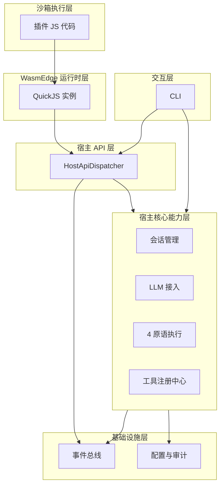
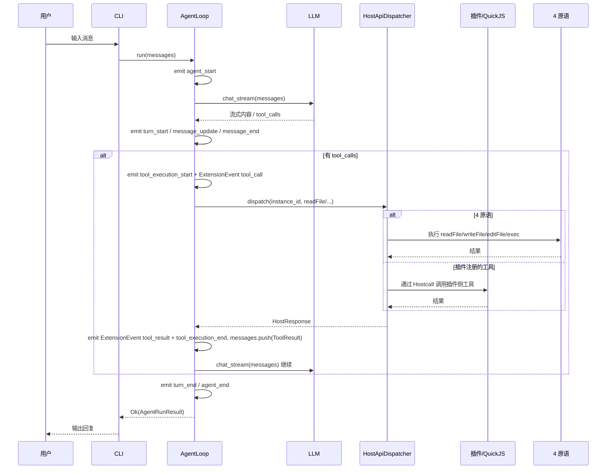

本文为 [Architecture](../Architecture.md) 中「项目全貌」的详细设计，总览见主文档。

## 项目全貌

本文用「术语表 + 基础两图 + 代码同款补图两张」帮助你在不熟悉代码的情况下，先建立整体心智模型，再按需进入各层详细设计。

### 阅读顺序建议

1. 先看 **术语解释表**，扫一眼常出现的专业词。
2. 再看 **抽象图（基础）**：各层职责与依赖关系。
3. 再看 **具体图（基础）**：一条从用户输入到回复的完整调用链。
4. 接着看 **抽象补图（代码同款）**：三层循环与 Dispatcher 分叉的主干动线。
5. 最后看 **具体补图（代码同款）**：一次 turn 中同步/异步工具调用如何回流。
6. 需要细节时，从主文档「各层核心模块详细设计」进入对应子文档。

---

### 术语解释表

| 术语 | 白话解释 | 在系统中的位置 |
|------|----------|----------------|
| **宿主 (Host)** | 用 Rust 写的、你完全信任的那部分程序，负责调度、安全与核心能力。 | 整个 Rust 侧：基础设施层、宿主核心能力层、宿主API层、以及调度 Agent 的交互层。 |
| **插件 (Plugin / Extension)** | 用 JS/TS 写的、跑在沙箱里的扩展逻辑，不能直接动系统，只能通过宿主提供的 API 调用。 | 运行在 WasmEdge + QuickJS 的沙箱执行层；通过「宿主API层」与宿主通信。 |
| **WasmEdge** | 负责跑 WebAssembly 的运行时；本项目里主要用来跑内置的 QuickJS，从而执行插件的 JS 代码。 | WasmEdge 运行时层：每个插件对应独立 Store/Instance，与宿主内存隔离。 |
| **Hostcall** | 插件向宿主「发起一次请求」的统称；所有请求都走同一个入口（如 `__pi_host_call`），用 JSON 里 module/method 做路由。 | 宿主API层：HostApiDispatcher 按 (module, method) 分发给各个 Processor。 |
| **4 原语** | 宿主提供给插件的四种原子能力：读文件、写文件、编辑文件、执行 Shell 命令；是插件与系统交互的主通道。 | 宿主核心能力层实现，经宿主API层暴露；调用可审计、可权限管控。 |
| **Agent Loop** | Agent 的「主循环」：不断「问 LLM → 拿到回复 → 若需要就执行工具 → 把结果再喂给 LLM」，直到产出最终回答或出错/中断。 | 核心编排逻辑，在宿主侧；详见 [Agent Loop 设计](agent-loop.md)。 |
| **EventBus / 事件总线** | 全局发布-订阅通道：宿主在关键节点发事件，插件可以订阅（如 `agent.on("tool_call", ...)`），用于 UI 或扩展钩子。 | 基础设施层提供；事件系统设计见 [事件系统设计](plugin-system/events.md)。 |
| **会话 (Session)** | 一次对话的上下文：包含历史消息、当前 sessionKey 等；列表与 transcript 由宿主管理。 | 宿主核心能力层（会话管理）；插件通过会话 API 读/写当前会话。 |
| **LLM** | 大语言模型；本项目中由宿主统一接入，插件通过 Hostcall 调用（如 createChatCompletion / createChatCompletionStream）。 | 宿主核心能力层接入；宿主API层暴露给插件；耗时调用走异步 Hostcall。 |
| **Steering / FollowUp / Abort** | 用户对 Agent 的干预：Steering 注入新指令，FollowUp 追加追问，Abort 中断当前运行。 | Agent Loop 的运行时状态（队列与信号），在每轮推理中检查。 |
| **异步 Hostcall (submit/poll)** | 耗时请求（如 LLM、exec）不阻塞插件：插件先「提交」拿一个 callId，再通过「轮询」该 callId 取结果。 | 宿主API层 HostApiDispatcher：submit 写 Pending 并 spawn 任务，poll 查 async_results。 |

---

### 抽象图：分层与职责

下图表示「从下到上」的依赖关系：上层只依赖下层，不反向依赖。



- **基础设施层**：事件总线、配置、审计、日志；无业务逻辑，全项目共用。
- **宿主核心能力层**：会话、LLM、4 原语、工具注册、插件生命周期、权限；只跑在宿主侧，不暴露实现给插件。
- **宿主 API 层**：插件能调到的唯一入口（Hostcall）；单入口多路复用，按 module/method 路由。
- **WasmEdge 运行时层**：跑 Wasm/QuickJS，每插件独立实例，内存隔离。
- **沙箱执行层**：插件代码的真实执行环境；只能通过宿主 API 与外界通信。
- **交互层**：CLI 等入口，驱动会话与 Agent 运行。

---

### 具体图：一条用户请求的调用链

下面是一条「用户发一句话 → Agent 调用工具 → 返回结果」的简化路径（先看图，再对照文字）。



- 用户从 **CLI** 输入，CLI 调用 **AgentLoop.run**。
- AgentLoop 在关键节点发布 **AgentEvent / ExtensionEvent**（agent_start、turn_start、**tool_execution_*** 观察事件与 **tool_call** / **tool_result** 钩子事件等；见 [events.md 工具链对照](plugin-system/events.md)）。
- 需要 LLM 时由宿主侧 **LLM** 流式返回；若有 **tool_calls**，由 AgentLoop 调用 **HostApiDispatcher**，再根据工具类型走 **4 原语** 或 **插件注册工具**（插件侧同样通过 Hostcall 与宿主通信）。
- 工具结果写回消息列表，再喂给 LLM，直到没有新的 tool_calls，AgentLoop 结束本轮并 **emit agent_end**，把结果返回给 CLI。

---


### ASCII 核心四图

以下四图严格对齐 `agent_loop.rs` / `dispatcher.rs` 的“结构示意 + 调用流 + 时序 + 全链路”阅读方式。

#### 1) 结构示意（AgentLoop 主体 + Dispatcher 桥接）

```text
┌──────────────────────────────────────────────────────────────────────────────┐
│                                AgentLoop                                     │
├──────────────────────────────────────────────────────────────────────────────┤
│ 注入依赖                                                                      │
│   llm       ─────────► chat_stream(messages)                                  │
│   primitive ─────────► read/write/edit/bash                                   │
│   event_bus ─────────► AgentEvent/ExtensionEvent                              │
├──────────────────────────────────────────────────────────────────────────────┤
│ 配置                                                                            │
│   max_attempts / max_tool_rounds / retry_base_delay / tool_definitions        │
├──────────────────────────────────────────────────────────────────────────────┤
│ 运行时状态                                                                      │
│   steering_queue / follow_up_queue / abort_signal / on_stream_delta           │
├──────────────────────────────────────────────────────────────────────────────┤
│ 外部桥接                                                                        │
│   tool 执行（execute_tool / dispatch）──► HostApiDispatcher 或 4 原语              │
│   host_response ─────► messages.push(ToolResult) -> 下一轮 Reasoning          │
└──────────────────────────────────────────────────────────────────────────────┘
```

- 入口对象是 `AgentLoop`，它管理依赖、配置和运行态，不直接耦合具体 Processor 实现。
- 与插件系统的连接点只有一个：`dispatch(instance_id, request)`。
- 回流点固定：`HostResponse -> ToolResult -> 下一轮 Reasoning`。

#### 2) 调用流（三层循环 + 工具分叉）

```text
调用方(chat.rs)
  │ run(initial_messages)
  ▼
Conversation Loop
  └─ Attempt Loop (for attempt in 1..=max_attempts)
      └─ Reasoning Loop
          ├─ emit: turn_start
          ├─ llm.chat_stream(messages)
          ├─ tool_calls 为空 ? ──是──► emit: turn_end -> return Ok(text)
          └─ tool_calls 非空
              └─ for each tool_call
                  ├─ emit: tool_execution_start + ExtensionEvent tool_call
                  ├─ dispatch(instance_id, request) / execute_tool
                  ├─ emit: ExtensionEvent tool_result + tool_execution_end
                  ├─ messages.push(ToolResult)
                  └─ continue 下一轮 llm.chat_stream(updated_messages)
```

- 主分叉在 `tool_calls 为空?`，决定本轮直接结束还是进入工具执行回路。
- 每次工具执行都会产生 `ToolResult`，并立即写入上下文消息序列。
- 写回后继续 LLM 推理，直到无工具调用、达到轮次上限或中断。

#### 3) 时序（一次 turn 的同步/异步路径）

```text
User/CLI            AgentLoop              HostApiDispatcher         async_results/Tokio
   │                   │                           │                          │
   │ run()             │                           │                          │
   │──────────────────►│                           │                          │
   │                   │ llm.chat_stream()         │                          │
   │                   │──────────────┐            │                          │
   │                   │◄─────────────┘ tool_calls │                          │
   │                   │                           │                          │
   │                   │ dispatch(req)             │                          │
   │                   │──────────────────────────►│                          │
   │                   │                           ├─ sync: dispatch_async ───► result
   │                   │                           └─ async: submit_async      │
   │                   │                                ├─ insert Pending ─────►│
   │                   │                                └─ spawn task ─────────►│
   │                   │                           │◄──────── pending/ready ───│
   │                   │ messages.push(ToolResult) │                          │
   │                   │──────────────┐            │                          │
   │                   │◄─────────────┘ 下一轮推理 │                          │
```

- 同步路径直接返回结果；异步路径先返回 `pending`，后续通过轮询拿到 `ready`。
- 无论同步异步，AgentLoop 最终消费的都是统一的 `ToolResult`。
- `ToolResult` 是时序中唯一会改变下一轮 LLM 输入的关键数据。

#### 4) 具体全链路数据动线（端到端）

```text
用户输入
  │
  ▼
CLI / chat.rs
  │ run(initial_messages)
  ▼
AgentLoop (Conversation -> Attempt -> Reasoning)
  │
  ├─ LLM 产出 content_delta / tool_calls
  │
  ├─ 无 tool_calls ───────────────► turn_end -> agent_end -> 最终回复
  │
  └─ 有 tool_calls
       │
       ▼
    HostApiDispatcher
       ├─ fs.* / tools.* / events.* / session.* / context.* / agent.log
       ├─ sync dispatch_async
       └─ async submit + poll (__async.poll)
       │
       ▼
    HostResponse
       │
       ▼
    ToolResult 写回 messages
       │
       ▼
    AgentLoop 下一轮推理
       │
       ▼
最终回复返回 CLI -> 用户
```

- 这条链路覆盖“入口、分叉、回流、出口”四个读图核心点。
- `HostApiDispatcher` 是执行层分发中心，`AgentLoop` 是编排层闭环中心。
- 全链路里唯一必须回流的数据对象是 `ToolResult`。

---

### src 全量 .rs 协作总图（ASCII）

看图提示：按编号 `① -> ⑩` 阅读。先看左上结构区，再看中部 `ext` 内核区，最后看右侧时序区与回流箭头。

```text
src 总计 39 个 .rs（main/lib=2, api=4, core=16, ext=8, infra=9）

┌────────────────────────────────────────────── 统一协作总图（结构 + 内核 + 时序）──────────────────────────────────────────────┐
│ [A] 结构区（模块边界 + 代表文件 + 关键 public）                                                                            │
│                                                                                                                            │
│  main.rs::main() ① -> lib.rs(re-export) -> api::run_cli() ②                                                               │
│                                 │                                                                                          │
│                                 └──────────────► core::AgentLoop::run() ③                                                 │
│                                                   ├─ llm::* (openai/provider/types/token_usage)                           │
│                                                   ├─ session::* (manager/store/transcript/mod)                            │
│                                                   ├─ tools::* / primitives::* / executor.rs                               │
│                                                   └─ [已删除] convert_to_llm_format（统一使用 ChatMessage，无需转换层） │
│                                                                                                                            │
│  infra::*（config/error/event_bus/events/logging/platform/audit/audit_store）                                             │
│    └─ AppError / EventBus / AgentEvent / ExtensionEvent / load_config / normalize_path / write_file_atomic               │
│                                                                                                                            │
│ [B] ext 内核区（文件级协作，重点 host_binding.rs）                                                                         │
│                                                                                                                            │
│  plugin.rs::PluginManager::load_plugin() ④                                                                                │
│      ├─ engine_wasmedge.rs::WasmEngine::global()/create_instance() ⑤                                                      │
│      ├─ instance_wasmedge.rs::WasmInstance::register_host_binding(invoke_fn) ⑥                                            │
│      └─ invoke_fn(request_json) => host_binding::invoke_host_func_with(...) ⑦                                             │
│                                                                                                                            │
│  instance_wasmedge.rs::build_vm() 注册 env.__pi_host_call                                                                  │
│      └─ JS(pi_bridge.js) / QuickJS 触发 __pi_host_call(request_json)                                                       │
│                                                                                                                            │
│  host_binding.rs（协议层 + 分发桥）                                                                                        │
│      ├─ HostRequest{module,method,params,call_id?} 反序列化                                                                │
│      ├─ invoke_host_func_with(Some(dispatcher), instance_id, request_json)                                                 │
│      ├─ dispatcher.dispatch(instance_id, HostRequest)                                                                       │
│      └─ HostResponse{ok,data,error,call_id?} 序列化回传                                                                     │
│                                                                                                                            │
│  dispatcher.rs::HostApiDispatcher（单入口多路复用） ⑧                                                                      │
│      ├─ dispatch() 同步入口：call_id? -> submit_async : block_on(dispatch_async)                                          │
│      ├─ dispatch_async() 路由：fs.* / tools.* / llm.* / events.* / session.* / context.* / agent.log                    │
│      ├─ async_results + instance_calls（DashMap）维护 Pending/Done/Error                                                   │
│      └─ 调用 core trait/infra 能力：PrimitiveExecutor/ToolRegistry/LlmProvider/EventBus/AuditRecorder                    │
│                                                                                                                            │
│ [C] 时序区（Hostcall 同步/异步 + 错误路径 + 回流）                                                                         │
│                                                                                                                            │
│  JS插件 -> __pi_host_call -> invoke_fn -> host_binding -> dispatcher                                                       │
│                           │                                                                                                │
│                           ├─[sync] 无 call_id ─► dispatch_async ─► HostResponse(ok|error) ⑨                              │
│                           │                                                                                                │
│                           └─[async] 有 call_id ─► submit_async(Pending) ─► 立即返回 pending:true                          │
│                                                 └─ 后台任务完成后 __async.poll(call_id) -> Done/Error                      │
│                                                                                                                            │
│  HostResponse -> ToolResult -> core::AgentLoop messages.push(...) -> 下一轮推理 ⑩                                         │
└────────────────────────────────────────────────────────────────────────────────────────────────────────────────────────────┘
```

- **模块与文件规模**：`main/lib(2) + api(4) + core(16) + ext(8) + infra(9) = 39`，这张图保持了全量边界与数量信息。
- **单图三分区**：`[A]` 负责全局结构，`[B]` 负责 `ext` 文件级细节，`[C]` 负责调用时序与回流，避免拆成多图跳读。
- **`host_binding.rs` 关键职责**：统一 Hostcall 协议 DTO（`HostRequest/HostResponse`）、JSON 解析/序列化、`invoke_host_func_with` 分发桥接、无 dispatcher 时桩响应（`{"stub":true}`）。
- **关键分叉点**：`dispatcher.dispatch()` 以 `call_id` 判断同步/异步；异步由 `submit_async + __async.poll` 完成生命周期闭环。
- **关键回流点**：宿主结果统一回流为 `ToolResult` 写回 `AgentLoop` 消息上下文，驱动下一轮模型推理。

### 与各层详细设计的对应关系

- 分层与各层职责的细节 → [各层核心模块详细设计](../Architecture.md#各层核心模块详细设计) 下的 1–7 节及对应子文档。
- 插件如何与宿主通信、异步 Hostcall、事件与工具回路 → [插件系统全貌](plugin-system-overview.md)。
- Agent 主循环、Steering/FollowUp/Abort、重试与事件发布时机 → [13. Agent Loop 设计](agent-loop.md)。
