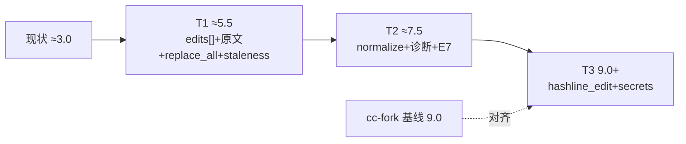
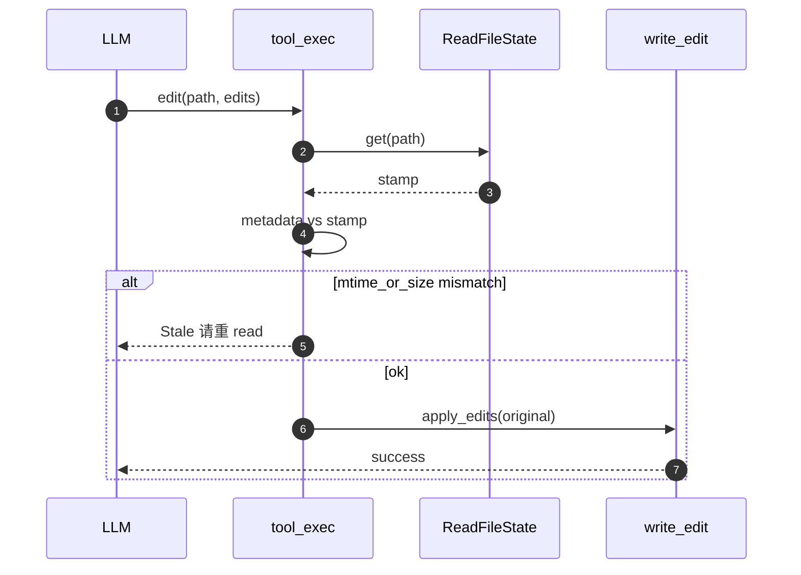

# `edit` 工具：原文契约、陈旧检测与分阶段增强

本文档是内置工具 **`edit`**（当前代码中仍为 `edit_file`）的冻结版技术方案（OpenSpec **B 类**：`docs/architecture/tools/`），承接主计划 [`strengthen-four-core-tools_b51c9eae.plan.md`](../../../../../.cursor/plans/strengthen-four-core-tools_b51c9eae.plan.md)（§0.4 edit 维度、§2.3 **PR-D**、§3.3 **PR-H**、§4.4 **PR-M** / T3-K）、看板中与四工具相关的条目，以及调研 [`docs/reports/agent-tools-comparison.md`](../../../../docs/reports/agent-tools-comparison.md) §4.2。**已定稿部分**与 **计划合入部分** 在 §2.4 用「实施点」表区分；**实现以合入后的仓库代码为准**。

**兄弟 spec**：[`read.md`](read.md)（`ReadFileState`、dedup、`hashline`、edit 前陈旧检查 **§7.3**、会话表 **§8**）；[`search_files.md`](search_files.md)（先搜后改工作流）。

---

## 目录

- [1. 目标与设计原则](#1-目标与设计原则)
- [2. 竞品 / 选型对比](#2-竞品--选型对比)
  - [2.1 Agent 编辑文件的典型关切](#21-agent-编辑文件的典型关切)
  - [2.2 常见实现横向对比（E1–E7）](#22-常见实现横向对比e1e7)
  - [2.3 落地选型决策表](#23-落地选型决策表)
  - [2.4 实施点（排期与已规划 PR）](#24-实施点排期与已规划-pr)
  - [2.5 评分演进路径](#25-评分演进路径)
  - [2.6 项目级移植说明](#26-项目级移植说明)
- [3. 术语统一](#3-术语统一)
- [4. 协议（入参 / 出参 / Schema）](#4-协议入参--出参--schema)
- [5. One-Glance Map（文件职责总览）](#5-one-glance-map文件职责总览)
- [6. 调度时序（运行时图）](#6-调度时序运行时图)
- [7. 单次 `edit` 调用状态机](#7-单次-edit-调用状态机)
  - [7.1 状态图（ASCII）](#71-状态图ascii)
  - [7.2 转移表](#72-转移表)
- [8. 配置与环境变量](#8-配置与环境变量)
  - [8.1 配置表](#81-配置表)
  - [8.2 总则与优先级](#82-总则与优先级)
- [9. 错误模型与归一化结局](#9-错误模型与归一化结局)
  - [9.1 归一化结局（框图）](#91-归一化结局框图)
  - [9.2 错误表与模型恢复](#92-错误表与模型恢复)
  - [9.3 与 read 的交叉引用](#93-与-read-的交叉引用)
- [10. 测试矩阵（验收）](#10-测试矩阵验收)
  - [10.1 测试矩阵](#101-测试矩阵)
- [11. 风险与应对](#11-风险与应对)
  - [11.1 风险表](#111-风险表)
- [12. 历史决策（已被本方案取代）](#12-历史决策已被本方案取代)
  - [12.1 历史决策表](#121-历史决策表)
- [13. 关联文档](#13-关联文档)
- [附录：旧节号 → 本版对照](#附录旧节号--本版对照)

---

## 1. 目标与设计原则

**一句话**：让模型用 **`edit` 精确改文件** 时，**语义可预测**（多段一律对**磁盘快照**匹配）、**失败可恢复**（错误可分诊、磁盘不处于半写入谜态）、**与 `read` 陈旧检测同一底座**，而不是靠「改完再 match 下一段」碰运气。

| 原则（可观察） | 说明 | 说人话 |
| --- | --- | --- |
| **契约对齐 pi-mono** | 每条 `edits[].old_content` 匹配**同一份原文**；禁止链式增量 patch | 多段一起改时，每段都在「改之前的整份文件」里找字，不要改完第一段再去找第二段。 |
| **多段 + `replace_all`** | `oneOf` 形状 A/B；每段可选 `replace_all`；`count>1` 且无 `replace_all` → 明确 `Ambiguous` | 一段里同样的字出现好几次时，要么说清楚「全换」，要么报错让模型加上下文。 |
| **重叠可检测** | 多段替换 span 在原文坐标上相交 → `Overlap`，不写盘 | 两段修改不能「踩到同一块肉」，否则直接拒，避免半成品写进磁盘。 |
| **陈旧可拦截** | 与 [`read.md`](read.md) **§1** 术语、`read_state` **§8** 表一致：`mtime_ms` + `size` 快路径；与 write 同节奏时可要求 **先 read** | 你上次读过之后文件要是被人动过了，先别改，让模型重新读一遍再动手。 |
| **校验先于写** | 校验阶段**不**创建 `.bak`、**不**改写目标文件；`.bak` 仅覆盖「校验已通过后的写盘途中失败」 | 没算清楚之前别碰文件；备份只防「写一半崩了」。 |
| **命名对齐 read** | 对外仅 `edit`；无 `edit_file` 运行时别名（与 `read` 的 PR-RA 口径一致） | 工具名就叫 `edit`，别搞两套名字让模型和日志对不上。 |
| **锚点双轨** | 普通 `edit` 保持子串模型；**行级强一致**走独立 `hashline_edit` + `read hashline=true`（算法与入参字段见 [`read.md`](read.md) **§5**、实施拆节 **§4.2.5**） | 普通替换用子串；要「第几行、还带指纹」那种精细活，用另一个工具，别全塞进 `edit`。 |

### 1.1 观察指标表（与 §10 验收一一对应）

| 目标 | 观察指标（落地后可核对） | 说人话 |
| --- | --- | --- |
| G1 | catalog / `tool_exec` 仅注册并匹配 `edit` | 搜全仓只能看到一个 `edit` 工具名。 |
| G2 | 同一次调用内多段 `edits[]` 均在**读入后固定的 `original` 字符串**上完成计数与 span 计算 | 一次改多处时，每处都在「刚读进来的那份字」上算，不搞连环改。 |
| G3 | `replace_all=false` 且子串出现次数 ≠1 → 结构化 `Ambiguous`，且目标文件未被改写 | 找不到唯一匹配就只报错，别把文件改花。 |
| G4 | 任意两段 span 相交 → `Overlap`，且目标文件未被改写 | 两段改到同一片区域就停，文件保持原样。 |
| G5 | `ReadFileState::get` + `metadata`：`mtime`/`size` 与 stamp 不一致 → `Stale` | 文件大小或修改时间变了，就别按旧记忆改。 |
| G6 | （与 write 同节奏时）无 prior read → `NoPriorRead` 或等价策略**在 spec 与代码中一致** | 若规定要先读再改，没读过就不让改（和写文件一条心）。 |
| G7 | T2：`normalize` 后匹配成功且写回保留原 BOM/行尾（见 §2.4.4） | 智能引号、换行那种「差一点就对不上」的事，工具帮你对齐，但别乱改文件原来的行尾习惯。 |
| G8 | T3：`hashline_edit` 与 `read` hashline 输出可闭环验证（见 `read.md` §11 与本文件 §10.1「T3 `hashline_edit`」行） | 带「行号+指纹」的读和专门的改要能配套测通。 |

### 1.2 非目标

| 非目标 | 说明 | 说人话 |
| --- | --- | --- |
| 本期内置 **V4A `apply_patch`** | 行业对照见 openclaw；本仓另议 | 本期不当「万能补丁解析器」，那种大规格以后再说。 |
| **Notebook 结构化编辑** | `.ipynb` 仅拒绝 + 指引（T2）；不实现 Jupyter JSON 编辑器 | 笔记本文件别用纯文本改，先拦下来，免得 JSON 散架。 |
| **`edit_file` 运行时别名** | 与 `read` 一致：不重定向；transcript 仅 warn（见 §2.4.2） | 老录音里叫 `edit_file` 只打个警告，不当真去执行。 |
| **hermes 式多策略模糊匹配** | 难测、与「精确编辑」定位冲突；T2 仅取 cc-fork 的 quote/sanitize **有限集** | 不做「猜你想改哪」的黑魔法；只做少数可控的字符归一化。 |

---

## 2. 竞品 / 选型对比

### 2.1 Agent 编辑文件的典型关切

本地 `edit` 要解决的四件事可以压成一张图：**契约**（多段到底对谁的文本）、**歧义**（重复子串）、**陈旧**（磁盘已变）、**生态**（与 `read` / `write` / `hashline` 如何拼）。

```text
┌────────────────────────────────────────────────────────────────────────────┐
│  本地 edit 工具通常要同时解决的四类问题                                    │
├────────────────────┬─────────────────────────────────────────────────────┤
│  契约              │  多段是对「原文」还是对「已改过的串」→ 必须钉死，否则与 pi-mono 训练分布冲突 │
│  歧义              │  同一 old 子串出现多次 → 需要 replace_all 或可诊断的 Ambiguous │
│  陈旧              │  用户 / git / 另一 agent 已改文件 → 需要 read_state 快路径拦截 │
│  生态              │  行级强锚点 → hashline_edit 与 read hashline 闭环，而非塞进子串 edit │
└────────────────────┴─────────────────────────────────────────────────────┘
```

### 2.2 常见实现横向对比（E1–E7）

**E1–E7** 与主计划 §0.1 权重一致（各维对「精确编辑」产品的重要性）。

| 维度 | **pi-rust-wasm**（现状） | **pi-mono** | **pi_agent_rust** | **openclaw** | **hermes-agent** | **cc-fork-01**（plan 锚点） | 说人话 |
| --- | --- | --- | --- | --- | --- | --- | --- |
| **E1** | 链式替换；schema 单段 | `edits[]` + legacy 单段合一；**对原文** | 单段 `edit` + 独立 `hashline_edit` 多段 | Pi `edit` + 条件 `apply_patch` | `patch` 与 file 工具同族 | 单段对外 + 内部多段 patch 工具 | 多段编辑到底对「哪一版全文」动手，各家做法差很多。 |
| **E2** | 无 | 隐含唯一命中（多段可各配 `replace_all`） | 单段内唯一 | 依宿主 | 多种 patch 策略 | **`replace_all` 一等公民** | 一句话出现很多次时，允不允许「全换掉」要能说清楚。 |
| **E3** | 无 | 无 | **hashline 与 read 闭环** | V4A 类 patch | V4A 等 | 唯一性 + `replace_all`，无 hashline | 除了子串，要不要「行号+指纹」这种硬锚点。 |
| **E4** | 无 | 精确匹配 + BOM/LF 规范化 | normalize 匹配（引号/空白等） | 透传 | 模糊匹配多策略 | **curly-quote + de-sanitize** | 模型打的字和磁盘差一点点时，工具帮不帮「对上眼」。 |
| **E5** | 2 类中文提示 | 错误信息明确 | 锚点失败提示重读 | — | 多策略提示 | **errorCode 8/9 式细分** | 错了之后，是糊一句还是告诉模型下一步咋办。 |
| **E6** | `.bak` + 恢复 | 依赖文件队列 | 原子写模式 | — | — | 关键区设计 | 写坏了能不能撤回、会不会半截文件。 |
| **E7** | 无 | 无区分 | 无 | **apply_patch 独立** | patch 独立 | **`.ipynb` → NotebookEdit** | 特殊文件（笔记本、大补丁）要不要单独工具。 |
| **加权分**¹ | **≈3.0** | 5.0 | 8.0 | 6.5 | 7.0 | 9.0 | 分数只是横向对比锚点，不是绝对成熟度。 |

¹ 权重：E1×0.15、E2×0.15、E3×0.15、E4×0.10、E5×0.15、E6×0.15、E7×0.15。

#### 2.2.1 现状速览（代码基线，实施前对照）

| 项 | pi-rust-wasm 现状 | 关键 file:line | 说人话 |
| --- | --- | --- | --- |
| 工具名 | `edit_file`（计划收敛为 `edit`） | [`catalog.rs`](../../../../src/core/tools/contract/catalog.rs) `BUILTIN_TOOL_CATALOG`、`edit_file_parameters` | 对外名字还没改成短名 `edit`。 |
| 对外 schema | 仅 `path` + `old_content` + `new_content` | 同上 `edit_file_parameters` 约 296–304 行 | 模型只能传「一段老字 + 一段新字」，不能一次传多段。 |
| 调度层 | 单段包装为一条 `Replace`，无 `replace_all`、无 `edits[]` | [`tool_exec.rs`](../../../../src/core/agent_loop/tool_exec.rs) `edit_file` 约 213–234 行 | 调度层帮你包成一条替换，没有「全替换」开关。 |
| 执行层 | 无行号时对 `lines.join("\n")` **链式** `replacen`；**隐性 bug**：`new_content.lines()` 丢尾换行后再 `join` | [`write_edit.rs`](../../../../src/core/tools/primitive/executor/write_edit.rs) `edit_file_impl` 约 63–92 行 | 多段时其实是「改完再改」，还容易弄丢行尾换行。 |
| 行号 API | `EditOperation` 仍可走 dispatcher/extension，**LLM schema 未暴露** | 同上 + [`types.rs`](../../../../src/core/tools/primitive/types.rs) `EditOperation` | 内部还有行号版接口，但模型调不到。 |
| 备份 | 写前 `.bak`，写失败恢复；成功后删 `.bak` | `write_edit.rs` | 写之前先留个备份，炸了能往回拷。 |

### 2.3 落地选型决策表

#### 2.3.0 落地选型决策表（维度取舍）

以下矩阵与主计划 §0.7「取其精华」行一一对应，**实施 PR 不得静默删行**；若弃案须在 §12 登记。**代码落点、交付物、阶段**见 **[§2.4](#24-实施点排期与已规划-pr)**，与 [`ARCHITECTURE_SPEC.md`](../../../openspec/specs/guides/workflow/ARCHITECTURE_SPEC.md) **§4.1 / §4.2** 分工一致。

| 维度 | 关切 | 现状/对标 | 取自 | 入选理由 | 未入选 + 拒因 | 说人话 |
| --- | --- | --- | --- | --- | --- | --- |
| **E1** | 多段 `edits[]` 是否对**同一份原文快照** | 链式 `replacen` vs pi-mono「全程对 original」 | pi-mono | 计数 / 重叠 / `replace_all` 均在读入后的 `original`（及 T2 起 `working`）上完成；单次 `write_file_atomic` | × 保留链式：与 pi-mono / 训练分布冲突、跨度误判 | 多段一起改：都在「刚读的那份字」上算完再写。 |
| **E2** | 多命中子串是否需显式 `replace_all` | 仅靠扩唯一子串 vs cc-fork **replace_all** 一等公民 | cc-fork | 每段 `replace_all?: bool`；否则 `Ambiguous` 可诊断 | — | 想全局替换同一句话，要有一个明确的开关。 |
| **E3** | 行级强锚点是否塞进子串 `edit` | 内嵌 V4A / MD5 vs **pi_agent_rust** 独立 `hashline_edit` + [`read.md`](read.md) `hashline` | pi_agent_rust + 已落地 read | 协议隔离；算法与 wire 单点维护于 read §5 / §4.2.5 | × 普通 `edit` 内嵌 V4A：范围爆炸；× 本期不做 `apply_patch` | 特别准的「第几行」编辑单独做，别和子串 `edit` 搅在一起。 |
| **E4** | 模型字面与磁盘微差如何消化 | 九策略模糊 vs 有限 normalize | cc-fork + pi-mono | curly-quote / de-sanitize / BOM + LF **工作副本**；纯函数管道 | × hermes 式多策略模糊：难测 | 弯引号、消毒字符这类坑，用一小套规则消化掉。 |
| **E5** | 失败时模型能否自愈 | 含糊中文 vs errorCode 式细分 | cc-fork | 逻辑错误码 + 可执行 hint（`AppError::Tool` / 枚举映射） | — | 报错要带「下一步咋办」，别只骂一句。 |
| **E6** | 写盘失败是否留半成品 | 现状 `.bak` + 恢复 | 现状 + 主 plan PR-D | 先校验后写；`.bak` 仅兜底写失败路径 | — | 算不对就不写；备份只防写一半崩了。 |
| **E7** | `.ipynb` 是否走纯文本 `edit` | Notebook 另工具 vs 纯文本一把梭 | cc-fork | `gate` 后扩展名拒绝 + 指引 | — | 笔记本先别用纯文本改，直接拦。 |
| **—（staleness）** | 改前是否校验「仍是上次读的那份」 | 无校验 vs read 共用 `ReadFileState` | cc-fork + [`read_state.rs`](../../../../src/core/tools/pipeline/read_state.rs) | `mtime_ms + size` 快路径；与 read 同形注入 `tool_exec` | × 无校验：与 read 陈旧目标相悖 | 改之前对一下表：文件还是不是你上次看的那份。 |
| **—（命名）** | 对外工具名是否短名单轨 | `edit_file` 别名 vs `read` PR-RA 口径 | pi-mono + 本仓库 read | 仅 `edit`；transcript legacy **warn** + UnknownTool | × `edit_file` 运行时别名 | 就叫 `edit`，和 `read` 一样短、一样好记。 |
| **—（secrets）** | `new_content` 是否可能夹带密钥 | 无扫描 vs cc-fork 类钩子 | cc-fork（主 plan T3-K） | 每段 `new_content` 扫描；与 write 共用 `secrets` 钩子 | — | 往文件里贴密钥前，先扫一眼能不能过。 |

> ² **staleness 行脚注**：与 write「必须先 read」**同 PR 节奏**落地时，edit 侧复用同一张 `ReadFileState`；语义见 [`read.md`](read.md) **§1**（术语）、**§7.3**（edit 前陈旧检查概念）、**§8**（会话表字段）。

#### 2.3.1 摘要表（`ARCHITECTURE_SPEC` §4.1 下可选扫读；列名与 §2.3.0 七列分工一致）

| 决策点 | 选择 | 现状/过去/其他 | 选择理由（为何不是其他） | 说人话 |
| --- | --- | --- | --- | --- |
| 多段编辑语义 | 全程对 `original` 快照一次应用 | 链式 `replacen` 逐步改 | 与 pi-mono / 模型训练一致；链式会误判跨度 | 多段别「改一步找一步」。 |
| `replace_all` | 每段独立 bool，默认 `false` | 无字段、只靠扩唯一子串 | 批量替换需显式开关，否则 Ambiguous 可诊断 | 想全换要说一声，别默认瞎换。 |
| 行级强锚点 | 独立 `hashline_edit` + `read hashline` | 在 `edit` 内嵌 V4A / MD5 块 | 协议隔离、算法单点维护于 `read.md` §5 / §4.2.5 | 精细活单独工具，协议别搅成一锅粥。 |
| 模糊匹配深度 | 有限 normalize（T2） | hermes 多策略模糊 | 可测性与产品定位 | 只做「能讲清楚规则」的容错，不做玄学猜词。 |
| partial view 后能否 edit | **允许**（stamp 在且 mtime/size 未变） | 强制仅全文 stamp 才允许 | 与 read 分页一致；不逼模型整文件 read | 读了半文件也允许改，只要文件本身没变。 |
| staleness 指纹 | `mtime_ms` + `size` | `content_hash` 参与硬门 | 与 read dedup 同哲学；hash 存表供诊断与 hashline 纵深 | 先看「改没改过」用轻量指纹，别每次全文件哈希卡性能。 |
| 对外工具名 | 仅 `edit` | `edit_file` 别名 | 单轨审计与 prompt；历史回放仅 warn | 一个名字走天下，老名字只提醒不执行。 |
| `apply_patch` | 本期不做 | 内置 V4A | 范围与工期 | 大补丁格式本期不接，免得 scope 爆。 |

### 2.4 实施点（排期与已规划 PR）

总表列名对齐 `ARCHITECTURE_SPEC` **§4.2**；**验收锚点**在 §10 展开，**合入与用例名以 §10 矩阵与仓库测试为准**。

| 实施点 | 交付范围（含交付物） | 主要代码落点（含落地点） | 验收锚点（示例） | 说人话 |
| --- | --- | --- | --- | --- |
| **PR-命名** | **交付物**：catalog/schema/system_prompt/测试字面量仅 `edit`；legacy **warn**。**落地点**：对外工具名与 match 表 | `src/core/tools/contract/catalog.rs`、`src/core/agent_loop/tool_exec.rs`、`src/core/llm/system_prompt.rs`、全仓断言 | 见 §10「命名」行 | 把名字改短、改干净，和 `read` 一套规矩。 |
| **PR-D（T1）** | **交付物**：`oneOf` + `edits[]` + 原文快照 + `replace_all` + 重叠检测 + staleness 注入 + 单次原子写。**落地点**：schema 解析 / 编辑主循环 / 写路径 | `src/core/tools/contract/catalog.rs`、`src/core/agent_loop/tool_exec.rs`、`src/core/tools/primitive/executor/write_edit.rs` | `edit_replace_all_replaces_every_match`、`edit_multiple_edits_apply_against_original`、`edit_overlap_rejected`、`edit_validation_failure_restores_or_noop`、`edit_rejected_when_read_stamp_stale`（§10） | 第一刀：契约、安全、能测的核心行为先落地。 |
| **PR-H（T2）** | **交付物**：normalize 管道、E5 文案、`.ipynb` 拒绝。**落地点**：normalize 纯函数模块 + 执行层 + tool_exec | `src/core/tools/pipeline/edit_normalize.rs`（新）、`write_edit.rs`、`tool_exec.rs` | `edit_curly_quote_matches`、`edit_desanitize_matches`、`edit_rejects_ipynb`（§10） | 第二刀：用起来少撞墙、报错听得懂。 |
| **PR-M + T3-K（T3）** | **交付物**：`hashline_edit` 注册；secrets 扫描钩子。**落地点**：catalog / tools 分发 / `secrets.rs` | `catalog.rs`、`tools.rs` 或独立模块、`src/core/security/secrets.rs`（新） | 与 `read.md` §11 hashline 用例 + 新增工具测（§10） | 第三刀：行级精修 + 密钥别误写进仓库。 |

下列小节保留**全部技术点描述与 ASCII 图**（对应旧版 §0.0、§2 命名、§3.1–§3.3），文字上做了分层标题，便于与上表对照。

#### 2.4.1 不变量（与 pi-mono 对齐，实施 PR-D 时 MUST 满足）

[`pi-mono/.../edit.ts`](../../../../../pi-mono/packages/coding-agent/src/core/tools/edit.ts) 明确：**每条 `edits[].oldText` 匹配「原始文件」**，禁止链式增量 patch。

当前实现把多段 `Replace(old_content)` 依次施加在**已变异**的字符串上，与上述契约**不等价**。目标实现必须为：

1. 读入后固定 **`original: String`**（UTF-8 解码后的磁盘快照）；
2. **所有**匹配计数、歧义检测、`replace_all` 展开、**区间重叠检测**均在 `original`（及 T2 起的 **`working`** 副本，见 §2.4.4）上完成；
3. 生成全文 `new_content` 后 **单次** `write_file_atomic`；
4. **校验阶段不动磁盘**（不做 `.bak` 拷贝、不预留写句柄）；`.bak` 仅作为「校验已通过、写盘途中崩溃」的兜底，写成功后立即删除。校验失败直接返回结构化错误，目标文件保持原样、无 `.bak` 残留。

#### 2.4.2 PR-命名：对齐 `read` §1

与 [`read.md`](read.md) **§4.2.1**（PR-RA）口径**完全对齐**：

- [`catalog.rs`](../../../../src/core/tools/contract/catalog.rs)：`name: "edit_file"` → **`"edit"`**；`description` 内 `edit_file` 字面量同步改 **`edit`**。
- [`tool_exec.rs`](../../../../src/core/agent_loop/tool_exec.rs)：`match` **仅** `"edit"`；**不**新增 `"edit_file"` 分支，**不**做重定向。
- **transcript 重放**：`tool_call.name == "edit_file"` → 仅 `tracing::warn`（`OnceLock` 限频可与 read 同模式），**不**重定向执行，避免双轨审计。

```text
  LLM / transcript
        │
        ▼
┌───────────────────┐     注册名仅 "edit"
│  catalog.rs       │──────────────────────────────┐
└───────────────────┘                              │
        │                                            ▼
        ▼                               ┌────────────────────┐
  tool_exec  match "edit"               │ "edit_file" 等    │
        │                                │ → UnknownTool 错误 │
        ▼                                └────────────────────┘
   正常 edit 路径
```

#### 2.4.3 PR-D（T1）：契约 + 安全

> **概念前置**：「原文快照」= 一次读入得到的 `String`（`original`），后续所有 `matches` / span 计算只读它（T1 可仅用 `original`；T2 引入 `working` 见 §2.4.4）。

**错误（链式） vs 正确（pi-mono）——ASCII 对照（须原样保留语义）**

```text
wrong (current for multi Replace on text):
  original → apply edit1 → text1 → apply edit2 on text1   ← NOT pi-mono

right:
  original → find all spans → check overlap → build new_content once → atomic write
```

| # | 落地点 | 说明 | 说人话 |
| --- | --- | --- | --- |
| 1 | **Schema `oneOf`** | **形状 A**：`{ path, old_content, new_content, replace_all? }`；**形状 B**：`{ path, edits: [{ old_content, new_content, replace_all? }] }`。字段名 **snake_case**；与 pi-mono `oldText`/`newText` **语义同构**。 | 单段、多段两种 JSON 都能认，和主流 agent 习惯对齐。 |
| 2 | **`replace_all`** | 默认 `false`：`count>1` → `Ambiguous`；`true`：替换全部命中。 | 没开「全换」却撞见多处一样，就报错别瞎改。 |
| 3 | **重叠检测** | 多段均在 `original` 上算 **UTF-8 字符区间或字节区间（二选一做全仓统一）**；任两段 span 相交或嵌套 → `Overlap`。 | 两段改到同一块肉上，必须拦下来。 |
| 4 | **单次写盘** | 仅校验全通过后调用 `write_file_atomic`。 | 算对了才落盘，别边算边写。 |
| 5 | **staleness 接入** | `dispatch_tool` / `tool_exec` 的 `edit` 分支接收 `read_file_state: Option<&Arc<ReadFileState>>`（与 **`read`** 分支同形态，见 `tool_exec.rs`）：① `state.get(resolved)`（**`resolved = normalize_path(path)`**，与 read 落 stamp 同形 key）；② 当前 `fs::metadata` 的 `mtime_ms` + `size` 与 stamp **不一致** → `Stale`；③ **stamp 不存在** → `NoPriorRead`（**T2-P0-016 同 PR 强拒**，`is_error: true`，与 write `overwrite=true` 同函数 `tool_exec::check_mutation_stamp`）。`put` 仍仅在 read 成功路径（见 `read.md` §7–§8 数据流）。 | 动手前先问：这文件还是你上次看的那份吗？和 write 同一套规矩。 |
| 6 | **行号 API 不改** | `EditOperation` 行号路径（`Replace`/`Insert`/`Delete`）保留给 **dispatcher / extension**；**本期 LLM 主路径**只暴露字符串 `edits[]`。 | 扩展还能用行号；模型这边本期只玩子串数组。 |

**T1 刻意不做（防 PR 膨胀）**：BOM/LF 全量规范化留在 **PR-H（T2）**，与 pi-mono `stripBom` / `normalizeToLF` 对齐。

**staleness 与 partial view（须与 read 底座一致）**

```text
  edit(path)
      │
      ▼
 ReadFileState.get(path)     fs::metadata(path)
      │                              │
      └──────────┬───────────────────┘
                 ▼
           mtime_ms + size
           与 stamp 一致？
      ┌──────┴──────┐
      ▼             ▼
    通过           Stale → 要求先 read
      │
      ▼
  executor：original 快照上校验 edits
```

- **`is_partial_view` / `offset` / `limit` 不参与 staleness**：`ReadFileState` 每 path **只保留最新** stamp（`put` 覆盖语义）；这些字段服务 **read dedup** 同窗口短路，**不是**「禁止 edit」的门槛。
- **允许** `read(path, offset, limit)` 分窗后立刻 `edit`：只要 stamp 仍在且 `mtime`+`size` 未变（与 cc-fork 系「mtime 比对」一致）。
- **NoPriorRead 与 T2-P0-016 write 同 PR 锁同节奏**（**T2-P0-016 同 PR 落地，2026-05-06**）：
  `tool_exec::check_mutation_stamp`（前身为 `check_edit_staleness`，与 write 共用）在「stamp == None」分支
  **强拒** `NoPriorRead`（`is_error: true`），与 **T2-P0-016 write** 子项同一 PR 统一打开门禁，
  避免 edit / write 节奏分叉。模型必须先 `read(path)` 再 `edit` / `hashline_edit` / `write(overwrite=true)`，
  staleness 也仍会继续拦「读过又被外部改了」的情况。

#### 2.4.4 PR-H（T2）：体验

| # | 落地点 | 说明 | 说人话 |
| --- | --- | --- | --- |
| 1 | **normalize 管道** | **工作副本仅用于匹配**：`stripBom` → `normalizeToLF` 得 `working`（与 `original` **同坐标**）→ 在 `working` 上 find / 计数 / 重叠检测 → 用**同一坐标 span** 在 `original` 上构造 `new_content` → **`restoreLineEndings`** 写回磁盘语义。**不**对磁盘做静默 LF 化；与未来 **write spec** 的全仓 LF 策略**正交**。 | 只在「比对用副本」上统一换行和 BOM，写回去还按用户原来的行尾习惯。 |
| 2 | **curly-quote / de-sanitize** | 匹配路径上对 `old_content` 与磁盘切片做**同一**规范化；de-sanitize 表在实现 PR 冻结。 | 弯引号、消毒字符这类，两边一起洗，别一边洗一边不洗。 |
| 3 | **E5 诊断** | 至少：`NotFound`、`Ambiguous`、`Stale`、`Overlap`、`NoPriorRead`、`Oversized`、`BinaryFile`、`Notebook`、`Io`；每条附 **下一步 hint**（见 §9）。 | 每种失败都有名字，并告诉模型下一步怎么救。 |
| 4 | **`.ipynb`** | 命中扩展名 → 拒绝 + 固定模板（中/英策略与现 Primitive 一致）。 | 笔记本 JSON 别当纯文本硬改，直接挡。 |
| 5 | **成功回执（轻量）** | 替换块数、可选行号摘要；**完整 structured_patch** 与 write T2（主 plan PR-G）对齐时由共享 diff 模块输出，本文不重复字段表。 | 成了也别灌一整本 diff，先给点数和摘要够用。 |

**normalize 数据流 ASCII（T2）**

```text
  disk bytes
      │
      ▼
 stripBom ──▶ original（逻辑内容）
      │
      ▼
 normalizeToLF ──▶ working（仅匹配用）
      │
      ▼
 find spans on working ──▶ map spans to original indices
      │
      ▼
 splice original ──▶ new_content
      │
      ▼
 restoreLineEndings + prepend BOM if any ──▶ write_file_atomic
```

#### 2.4.5 PR-M + T3-K（T3）：平台

| # | 落地点 | 说明 | 说人话 |
| --- | --- | --- | --- |
| 1 | **`hashline_edit`** | 独立注册；入参 `{ path, edits: [{ op, pos?, end?, lines }] }`；**行哈希与 tag 语法** → 只读 [`read.md`](read.md) **§5**（含调用样例 §5.3），本文不重复 `xxh32` 与双字符表。 | 要「对哪一行下刀」用专用工具，细节全在 read 那一篇。 |
| 2 | **secrets** | 每段 `new_content` 写入前扫描；命中 → 拒绝并走 permission `confirm`（主计划 §4.2）。 | 新内容里像密钥的东西，先拦再问人。 |
| 3 | **`apply_patch`（V4A）** | **不在本期范围**；openclaw 仅作行业对照。 | 大段 unified diff 式补丁本期不接。 |

### 2.5 评分演进路径



### 2.6 项目级移植说明

- **pi-mono**：TS 不可直搬；**只搬契约**（`edits[]`、原文匹配、BOM/LF 顺序）。
- **cc-fork-01**：取 `replace_all`、诊断分层、quote/sanitize **设计**；Rust 重写。
- **pi_agent_rust**：`hashline_edit` 协议 → [`read.md`](read.md) §5。
- **hermes**：多策略 patch **不移植**。
- **openclaw**：`apply_patch` **本期不做**。

---

## 3. 术语统一

| 术语 | 语义（大白话） | 数据载体 / 位置 | 行为约束 | 说人话 |
| --- | --- | --- | --- | --- |
| **`original`** | 从磁盘读出来、解码后的整文件文本快照 | `write_edit.rs` 局部 `String` | 所有 span 计算以它为坐标；**T1 唯一真源** | 改之前先拍一张「全文照」，后面都算在这张上。 |
| **`working`** | 为匹配而做的临时视图（去 BOM、LF 化等） | T2 起 `edit_normalize` 输出 | **仅用于 find**；写回必须还原行尾与 BOM | 为了对上眼临时洗一版，写完别忘洗回去。 |
| **`edits[]`** | 一次 tool_call 里多段互不相交的修改意图 | JSON `edits` 数组 | 每段对 **同一 `original`/`working`**；禁止链式 | 一口气好几刀，但都是对着同一张照片下刀。 |
| **`replace_all`** | 允许多次命中同一子串全部替换 | 每段 bool，默认 `false` | `false` 且 `count≠1` → `Ambiguous` | 出现很多次时，要么扩上下文，要么明说「全换」。 |
| **形状 A / B** | 单段 vs 多段两种 JSON 形状 | `catalog` `oneOf` | 同时出现时 **`edits` 优先**；否则包装为单元素 `edits` | 老写法一段、新写法数组，两套都认。 |
| **`Stale`** | 磁盘文件在你上次 read 之后又变了 | `ReadFileState::get` + `metadata` | 必须先 `read` 再 `edit`；见 [`read.md`](read.md) §1「staleness」 | 文件被人动过了，别拿旧脑子改。 |
| **`NoPriorRead`** | 这张表里没有该 path 的成功 read 记录 | `get` 返回 `None` | **强拒**（T2-P0-016 同 PR 落地，2026-05-06）；与 write `overwrite=true` 同函数 `check_mutation_stamp` | 你压根没读过这文件，就别先改（策略和 write 完全一致）。 |
| **`hashline_edit`** | 用 `行号#哈希` 锚点做行级改 | 独立工具名 | 与普通 `edit` **互斥职责**；算法见 `read.md` §5 / §4.2.5 | 要锁「第几行」时用另一个工具，别和普通查找替换混谈。 |

**时间点钉死**：「**LLM 发出 `edit` tool_call 之后、进入 `write_file_atomic` 之前**」统称为 **校验阶段**；此阶段**不得**创建 `.bak`、**不得**改写目标文件（见 §9）。

---

## 4. 协议（入参 / 出参 / Schema）

**单一事实源（目标态）**：合入后以 [`catalog.rs`](../../../../src/core/tools/contract/catalog.rs) 内嵌 JSON Schema + [`types.rs`](../../../../src/core/tools/primitive/types.rs) 解析结构为准；本文描述目标契约。

### 4.1 形状 A（兼容单段）

| 字段 | JSON 类型 | 必填 | 默认值 | 说明 | 说人话 |
| --- | --- | --- | --- | --- | --- |
| `path` | string | 是 | — | 绝对或相对；经 `PermissionGate` **Edit**。 | 改哪个文件。 |
| `old_content` | string | 是 | — | 在**原文**中查找；须足够上下文保证唯一性（除非 `replace_all`）。 | 找这段老字。 |
| `new_content` | string | 是 | — | 替换内容。 | 换成这段新字。 |
| `replace_all` | boolean | 否 | `false` | `true` 时允许 `count>1`。 | 要不要把出现的每一处都换掉。 |

### 4.2 形状 B（pi-mono 主路径）

| 字段 | JSON 类型 | 必填 | 说明 | 说人话 |
| --- | --- | --- | --- | --- |
| `path` | string | 是 | 同形状 A。 | 还是改哪个文件。 |
| `edits` | array | 是 | 元素：`{ old_content, new_content, replace_all? }`；**至少 1 项**。 | 多段「老→新」列成数组，至少一条。 |

**解析规则**：若同时出现 `edits` 与顶层 `old_content`/`new_content`，以 **`edits` 优先**；否则将顶层两段包装为单元素 `edits`（与 pi-mono `prepareEditArguments` 同构）。

### 4.3 调用样例（jsonc）

**形状 A**

```jsonc
{
  "path": "src/lib.rs",
  "old_content": "fn old()",
  "new_content": "fn new()",
  "replace_all": false
}
```

**形状 B（两段、第二段批量替换）**

```jsonc
{
  "path": "src/lib.rs",
  "edits": [
    { "old_content": "use std::io;", "new_content": "use std::io::{self, Write};" },
    { "old_content": "TODO", "new_content": "DONE", "replace_all": true }
  ]
}
```

### 4.4 出参（工具消息）

实施期可保持简短自然语言成功回执；T2 起可附加结构化字段（块数、路径），须与 LLM provider 的 tool 结果长度策略对齐。

---

## 5. One-Glance Map（文件职责总览）

```text
┌─────────────────────────────────────────────────────────────────────────────┐
│  LLM（tool_call.name = "edit"，arguments JSON）                              │
└─────────────────────────────────────────────────────────────────────────────┘
        │
        ▼
┌───────────────────────────────┐       ┌────────────────────────────────────┐
│  src/core/llm/system_prompt.rs │       │  src/core/tools/contract/catalog.rs         │
│  • 引导：edit / edits[] /      │       │  • BUILTIN_TOOL_CATALOG name=edit  │
│    replace_all；先 read 再改   │       │  • edit_parameters(): oneOf A|B    │
└───────────────────────────────┘       └───────────────────┬────────────────┘
                                                            │
                                                            ▼
┌───────────────────────────────────────────────────────────────────────────────┐
│  src/core/agent_loop/tool_exec.rs                                            │
│  • match "edit"：解析 oneOf；offset/limit 无（edit 无分页）                    │
│  • ReadFileState::get(path) + metadata → Stale / NoPriorRead（策略见 §2.4.3）│
│  • 调 PrimitiveExecutor::edit_file（或重命名为 edit）                          │
└───────────────────────────────┬───────────────────────────────────────────────┘
                                ▼
┌───────────────────────────────────────────────────────────────────────────────┐
│  src/core/tools/primitive/executor/write_edit.rs                              │
│  • edit_file_impl：gate_check_path(Edit) → read UTF-8 → original 快照         │
│  • 校验：计数 / replace_all / overlap → new_content → write_file_atomic       │
│  • .bak：仅校验通过后、写前创建；成功删；失败恢复                             │
│  • build_simple_diff（副作用日志；可选回执）                                   │
└───────────────────────────────┬───────────────────────────────────────────────┘
              ┌─────────────────┴─────────────────┐
              ▼                                   ▼
┌─────────────────────────────┐       ┌─────────────────────────────────────┐
│  src/core/tools/pipeline/read_state.rs│       │  src/core/tools/pipeline/edit_normalize.rs   │
│  • ReadStamp / ReadFileState  │       │  【T2 新建】stripBom / toLF / quote   │
│  • get / put / invalidate     │       │  纯函数；供 write_edit 与单测调用     │
└─────────────────────────────┘       └─────────────────────────────────────┘

┌─────────────────────────────┐       ┌─────────────────────────────────────┐
│  src/core/tools/primitive/   │       │  src/infra/audit + permission gate   │
│  types.rs                    │       │  • EditOperation（扩展路径）         │
│  • EditFileResult            │       │  • gate_check_path / 审计落库        │
└─────────────────────────────┘       └─────────────────────────────────────┘

【测试挂点】
  • src/core/tools/primitive/tests/suite_test.rs — edit 原语焦小测
  • src/core/agent_loop/tests/tool_exec_dedup_test.rs — read dedup（edit staleness 可并列加）
  • tests/primitives_tools_tests.rs — 端到端原语
```

**说人话**：模型喊 `edit` → **catalog** 告诉它长什么样 → **tool_exec** 先看「这文件还是不是你上次 read 的样子」，再让 **write_edit** 在内存里把要改的几段都算清楚，**全对才写盘**；旁边 **read_state** 记着你上次 read 的指纹；T2 再加 **edit_normalize** 帮模型对上引号和换行。

---

## 6. 调度时序（运行时图）

### 6.1 成功路径（ASCII 多泳道）

```text
LLM          tool_exec              ReadFileState        write_edit (primitive)
 │               │                        │                  │
 │ edit(args)    │                        │                  │
 │──────────────>│ get(path)?             │                  │
 │               │──────────────────────>│                  │
 │               │<──────────────────────│ stamp ok         │
 │               │─────────────────────────────────────────>│
 │               │                        │   load original  │
 │               │                        │   validate+write │
 │               │<─────────────────────────────────────────│
 │<──────────────│ ok                     │                  │
```

### 6.2 Stale / NoPriorRead 分支（ASCII）

```text
LLM          tool_exec              ReadFileState
 │               │                        │
 │ edit(args)    │                        │
 │──────────────>│ get(path)              │
 │               │──────────────────────>│
 │               │<──────────────────────│ stamp mismatch OR missing
 │<──────────────│ Stale / NoPriorRead    │（不调 primitive）
```

### 6.3 Mermaid（Stale 拦截，与 read.md §7.3 概念一致）



---

## 7. 单次 `edit` 调用状态机

### 7.1 状态图（ASCII）

```text
                    ┌──────────┐
         开始 ─────▶│ Parsed   │
                    └────┬─────┘
                         │ args 合法
                         ▼
                    ┌──────────┐     stamp 缺失且策略要求
         ┌─────────│ StaleCk  │─────────────┐
         │         └────┬─────┘             │
         │ stale        │ ok                │ NoPriorRead
         ▼              ▼                   ▼
   ┌──────────┐  ┌──────────┐        ┌──────────┐
   │ Reject   │  │ Loaded   │        │ Reject   │
   └──────────┘  └────┬─────┘        └──────────┘
                      │ UTF-8 OK
                      ▼
                 ┌──────────┐
                 │ Validate │─── overlap / ambiguous / notfound ──▶ Reject
                 └────┬─────┘
                      │ all spans ok
                      ▼
                 ┌──────────┐
                 │ Writing  │─── IO err ──▶ RestoreFromBak / Err
                 └────┬─────┘
                      │ ok
                      ▼
                 ┌──────────┐
                 │   Done   │
                 └──────────┘
```

### 7.2 转移表

| 当前状态 | 事件 | 下一状态 | 副作用 | 说人话 |
| --- | --- | --- | --- | --- |
| Parsed | 参数非法 | Reject | 返回 `AppError::Tool`；不写盘 | JSON 都不过关，直接打回。 |
| StaleCk | metadata 不匹配 stamp | Reject | `Stale` | 文件变了，先去 read。 |
| StaleCk | 无 stamp 且策略禁止 | Reject | `NoPriorRead` | 没读过不让改（若策略如此）。 |
| Loaded | 非 UTF-8 | Reject | `BinaryFile` | 二进制别当文本改。 |
| Validate | 任一编辑段失败 | Reject | **不写盘、无 .bak** | 算不对就不碰磁盘，也别留备份垃圾。 |
| Writing | `write_file_atomic` 失败 | Err | 从 `.bak` 恢复（若已创建） | 真写挂了，靠备份往回捞。 |

---

## 8. 配置与环境变量

### 8.1 配置表

| 键 / 变量 | 取值 | 含义 | 优先级 | 说人话 |
| --- | --- | --- | --- | --- |
| （本期无 `[tools.edit]` 专节） | — | 单段 `new_content` 上限与 **write** 共享常量（若存在 `WRITE_TOOL_MAX_BYTES`） | 代码常量 | 改文件能塞多大，先跟 write 用同一套天花板。 |
| 未来 `[tools.edit] max_new_bytes` | u64 | 可选：限制单段替换后膨胀 | config > 默认 | 以后可以单独限制「一段替换后别爆太大」。 |

### 8.2 总则与优先级

总则：**env > config > 默认**（与仓库全局约定一致）；本期无独立 env 开关时本表可仅一行声明。

---

## 9. 错误模型与归一化结局

### 9.1 归一化结局（框图）

```text
                    ┌─────────────────────────────────────┐
                    │         edit 归一化结局              │
                    └─────────────────────────────────────┘
  校验期（未写盘）          │              写盘期（已校验通过）
        │                 │                        │
        ▼                 │                        ▼
 NotFound / Ambiguous     │              IO 错误 → .bak 恢复
 Overlap / Stale          │                        │
 NoPriorRead / Oversized  │                        ▼
 BinaryFile / Notebook    │                     Done
        │                 │
        └─────────────────┴── 一律 Err 或结构化 Tool 失败字符串；磁盘目标文件不变
```

### 9.2 错误表与模型恢复

| 逻辑名 | 触发条件 | 模型侧恢复 | 说人话 |
| --- | --- | --- | --- |
| `NotFound` | 某段 `count==0`（T1：`original`；T2：`working`） | 重 `read`；检查空格/引号；T2 依赖 normalize | 文件里压根找不到你要的那段字。 |
| `Ambiguous` | `count>1 && !replace_all` | 扩大 `old_content` 或设 `replace_all` | 同一句话出现好几次，你没说全换就不敢动。 |
| `Overlap` | 多段 span 相交或嵌套 | 合并为单段或拆两次 tool_call | 两段改到同一块，逻辑上打架。 |
| `Stale` | stamp 与 `metadata` 不一致 | **必须**重新 `read` | 磁盘上的文件已经和你脑子里的不一样了。 |
| `NoPriorRead` | `get` 为空且策略要求先 read | 先 `read(path)` | 会话里没这条文件的 read 记录，先读再改。 |
| `Oversized` | `new_content` 超上限 | 拆段或 `write` 整文件 | 一段塞太大，要么拆开要么整文件写。 |
| `BinaryFile` | 非 UTF-8 | 对齐 [`read.md`](read.md) §10：结构化 Tool 错误 + hex + `bash file` 等建议 | 这不是 UTF-8 文本，别硬当代码改。 |
| `Notebook` | `.ipynb`（T2） | 等专用工具或结构化路径 | Jupyter 笔记本走别的道。 |
| `Io` | 读/写/metadata 失败 | 查权限与路径 | 盘或权限出了问题。 |

**E5 vs E6 边界**：`NotFound`…`Oversized` 属**校验阶段**，不得触碰目标文件；`Io` 在写盘阶段可触发 `.bak` 恢复（见 §2.4.1 不变量第 4 条）。

### 9.3 与 read 的交叉引用

节号以当前 [`read.md`](read.md) 为准。

- **dedup**：只影响 **read** 的返回值，与 **edit** 无直接耦合。见 [`read.md`](read.md) **§1**（`FILE_UNCHANGED`）、**§7.2**。
- **staleness**：见 [`read.md`](read.md) **§1**「staleness」、**§7.3**、**§8** 字段表。
- **hashline 纵深**：[`read.md`](read.md) **§5** / **§4.2.5**；**edit 本文不重复** `xxh32` 细节。

---

## 10. 测试矩阵（验收）

**测试挂点（与仓库路径一致）**：

- 原语 / `write_edit`：`src/core/tools/primitive/tests/suite_test.rs`
- `tool_exec`（含 staleness、未知工具、`hashline_edit`、secrets 编排）：`src/core/agent_loop/tests/tool_exec_dedup_test.rs`
- `read` 侧 `hashline` 与多模态：`read.md` §11、`src/core/tools/primitive/tests/read_window_test.rs`、`tests/read_tool_tests.rs`

### 10.1 测试矩阵

| 维度 | 用例（实际函数名） | 所在模块 / 文件 | 状态 |
| --- | --- | --- | --- |
| 命名（对齐 `read` PR-RA） | `edit_legacy_edit_file_returns_unknown_tool_error` | `tool_exec_dedup_test.rs` | ✅ 2026-05-06 |
| T1 `replace_all` | `edit_replace_all_replaces_every_match` | `suite_test.rs` | ✅ 2026-05-06 |
| T1 原文多段 | `edit_multiple_edits_apply_against_original` | `suite_test.rs` | ✅ 2026-05-06 |
| T1 重叠 | `edit_overlap_rejected`、`edit_overlap_adjacent_not_rejected` | `suite_test.rs` | ✅ 2026-05-06 |
| T1 校验不写盘 | `edit_validation_failure_restores_or_noop` | `suite_test.rs` | ✅ 2026-05-06 |
| T1 staleness | `edit_rejected_when_read_stamp_stale` | `tool_exec_dedup_test.rs` | ✅ 2026-05-06 |
| T1 NoPriorRead（**T2-P0-016 同 PR 强拒**） | `edit_no_prior_read_rejects_after_t2_p0_016` | `tool_exec_dedup_test.rs` | ✅ 2026-05-06（见 §10.2） |
| T2 normalize / 行尾 / BOM | `edit_curly_quote_matches_disk_straight_quote`、`edit_desanitize_matches_nbsp_and_zwsp`、`edit_preserves_trailing_newline`、`edit_preserves_crlf_line_endings`、`edit_preserves_bom` | `suite_test.rs` | ✅ 2026-05-06 |
| T2 `.ipynb` | `edit_rejects_ipynb_before_touching_disk` | `tool_exec_dedup_test.rs` | ✅ 2026-05-06 |
| T3 `hashline_edit` + read 闭环 | `hashline_edit_replace_matches_read_hashline`、`hashline_edit_rejects_hash_mismatch`；read 侧见 `read.md` §11 `read_with_hashline_*` / `read_tool_tests.rs` | `tool_exec_dedup_test.rs` 等 | ✅ 2026-05-06 |
| T3 secrets | `edit_secrets_hit_denied_reverts_to_no_op`、`edit_secrets_pass_when_no_hit`、`edit_secrets_hit_proceeds_with_allow_all_confirmation` | `suite_test.rs`、`tool_exec_dedup_test.rs` | ✅ 2026-05-06 |
| oneOf / 诊断归一 | `edit_oneof_shape_b_edits_array_is_parsed`、`edit_error_codes_normalized` | `tool_exec_dedup_test.rs` | ✅ 2026-05-06 |
| 扩展路径（dispatcher 行号 API） | `edit_legacy_line_oriented_path_still_works` | `suite_test.rs` | ✅ 2026-05-06 |
| 观察指标 §1.1 G1–G8 | 以上用例组合对照 G1–G8 | — | ✅ 2026-05-06（**G6 硬门禁 `NoPriorRead`**：T2-P0-016 同 PR 落地强拒，对应 `edit_no_prior_read_rejects_after_t2_p0_016` + write 侧 `write_overwrite_without_prior_read_rejected_with_no_prior_read`） |

### 10.2 `NoPriorRead` 是什么

**含义**：`ReadFileState` 里**还没有**该 path 的**成功 `read` 落表记录**（`get(canonical_path)` 为 `None`）时，若产品策略规定「必须先 `read` 再 `edit` / `write`」，调度层应返回 **`NoPriorRead`**（或等价结构化 `AppError::Tool`），提示模型先读盘，避免在从未进入过上下文的文件上盲改。

**与 `Stale` 的区别**：`Stale` 是「**读过**，但磁盘 `mtime`/`size` 已与 stamp 不一致」；`NoPriorRead` 是「**会话里压根没有**该文件的 read stamp」。

**本仓库当前策略（T2-P0-016 同 PR 强拒，2026-05-06 落地）**：`edit` / `hashline_edit` / `write(overwrite=true)` 在 **stamp 缺失时统一强拒** `NoPriorRead`（`is_error: true`）。共享门禁函数为 `tool_exec::check_mutation_stamp`（前身 `check_edit_staleness`，与 write 共用，仅在错误文案里区分 `op_label`）。已落锁的验收用例：

- `edit_no_prior_read_rejects_after_t2_p0_016`（替换原 `edit_no_prior_read_does_not_block_phase1` 的 Phase1 反向断言）；
- `write_overwrite_without_prior_read_rejected_with_no_prior_read`（write 侧对称用例，见 [write.md](write.md) §10）。

---

## 11. 风险与应对

### 11.1 风险表

| 风险 | 影响 | 应对（具体动作） | 说人话 |
| --- | --- | --- | --- |
| UTF-8 字符索引 vs 字节索引混用 | span 算错 → 静默改错 | 全仓统一一种索引；`#[cfg(test)]` 用含多字节字符的 fixture | 中英文混排时，数「字」还是数「字节」不能混。 |
| `lines()` 丢尾换行回归 | 尾部空行被吃掉 | 单测覆盖「`new_content` 以 `\\n` 结尾」；T2 后改走不丢尾的拼接 API | 别又用会吃掉最后一行换行的 API。 |
| staleness 与 write 策略分叉 | 模型困惑 | **同一 PR** 锁 `NoPriorRead` 语义；双工具共用集成测 | read/edit/write 对「先读后写」要同一套人话。 |
| 大文件全量 `original` | wasm 堆压力 | 与 read 上限策略对齐；超大文件引导 `offset/limit` + 分段 edit 或 `write` | wasm 里别硬扛整本巨书进内存。 |
| secrets 误报 | 合法代码被拒 | 规则集可配置；命中走 `confirm` 而非硬拒（主计划 T3-K） | 扫密钥别太神经，宁可让人点一下确认。 |

---

## 12. 历史决策（已被本方案取代）

### 12.1 历史决策表

| 旧方案 | 结论 | 说人话 |
| --- | --- | --- |
| 多段 `Replace` **链式**施加在已修改字符串上 | → **否**：与 pi-mono「对原文」冲突；PR-D 改为快照一次应用 | 以前那种「改完再找」不要了。 |
| 仅暴露 `old_content`/`new_content` 单段 schema | → **否**：无法表达多段；PR-D 引入 `oneOf` | 一段不够，得上数组形态。 |
| 「先拷 `.bak` 再做字符串校验」 | → **否**：校验阶段不应触碰磁盘；PR-D 调整顺序 | 没算对就别先动磁盘、别先建备份。 |
| `edit_file` 运行时别名 / 单迭代 fallback | → **否**：与 `read` PR-RA 一致，避免双轨审计 | 老名字可以 warn，别悄悄还能执行。 |

---

## 13. 关联文档

- [`read.md`](read.md) — §1 术语；§5 `hashline` 等协议；§7–§8 调度与会话表；§10 错误；§11 测试。
- [`search_files.md`](search_files.md) — 先搜后改。
- [`bash.md`](bash.md) — shell 工具与 `search_files` 分工（勿用 bash 跑 rg）。
- [`../permission-system.md`](../permission-system.md) — Edit 权限与 secrets `confirm`。
- 主计划：[strengthen-four-core-tools_b51c9eae.plan.md](../../../../../.cursor/plans/strengthen-four-core-tools_b51c9eae.plan.md)。
- 调研：[agent-tools-comparison.md](../../../../docs/reports/agent-tools-comparison.md) §4.2。
- 代码：[read_state.rs](../../../../src/core/tools/pipeline/read_state.rs)、[write_edit.rs](../../../../src/core/tools/primitive/executor/write_edit.rs)、[tool_exec.rs](../../../../src/core/agent_loop/tool_exec.rs)、[types.rs](../../../../src/core/tools/primitive/types.rs)。

---

## 附录：旧节号 → 本版对照

| 旧 `edit.md`（重构前） | 本版位置 | 说人话 |
| --- | --- | --- |
| §0 现状表 | [§2.2.1](#221-现状速览代码基线实施前对照) | 以前开头的「现在代码啥样」挪到 §2.2.1。 |
| §0.0 不变量 | [§2.4.1](#241-不变量与-pi-mono-对齐实施-pr-d-时-must-满足) | 必须遵守的规则在 §2.4.1。 |
| §0.A.1 维度 | [§2.1](#21-agent-编辑文件的典型关切) + [§2.2](#22-常见实现横向对比e1e7) | E1–E7 那套关切拆到 §2.1 / §2.2。 |
| §0.A.2 横向表 | [§2.2](#22-常见实现横向对比e1e7) | 横向对比就是现在的 §2.2 大表。 |
| §0.A.3 决策矩阵 | [§2.3.0](#230-落地选型决策表维度取舍) | 维度取舍一张总表在 §2.3.0；代码落点 / 交付在 §2.4。 |
| §0.A.4 mermaid | [§2.5](#25-评分演进路径) | 分数演进图在 §2.5。 |
| §0.A.5 移植说明 | [§2.6](#26-项目级移植说明) | 各项目抄啥不抄啥在 §2.6。 |
| §2 命名 | [§2.4.2](#242-pr-命名对齐-read-1) | 改名 `edit` 在 §2.4.2。 |
| §3.1–§3.3 实施排期 | [§2.4.3](#243-pr-dt1契约--安全)–[§2.4.5](#245-pr-m--t3-kt3平台) | PR-D/H/M 分段在 §2.4.3–§2.4.5。 |
| §4 协议 | [§4](#4-协议入参--出参--schema) | JSON 长啥样看 §4。 |
| §4.3–§4.4 错误与 read 协作 | [§9](#9-错误模型与归一化结局) + 嵌入引用 | 错误和 read 联动主要在 §9。 |
| §5 One-Glance | [§5](#5-one-glance-map文件职责总览)（已增强节点要点） | 文件谁管啥看 §5 大图。 |
| §6 时序 | [§6](#6-调度时序运行时图) | 运行时谁先谁后看 §6。 |
| §7 测试 | [§10](#10-测试矩阵验收) | 测啥看 §10。 |
| §8 关联 | [§13](#13-关联文档) | 外链清单在 §13。 |

---

**一句话总结**：`edit` 的硬骨头只有两件——**多段编辑永远对同一快照算 span**，以及**改前用 `read_state` 看磁盘变没变**；其余体验（引号、换行、`.ipynb`）和纵深（`hashline_edit`、secrets）按 PR-D / PR-H / PR-M 分拨合入，测试与 `read` 共用一张会话表锁行为。
