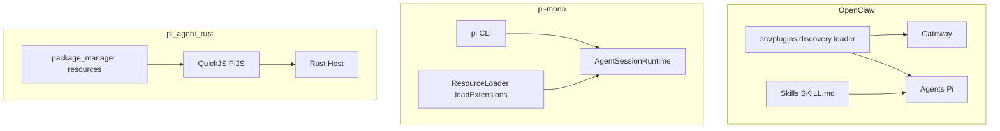
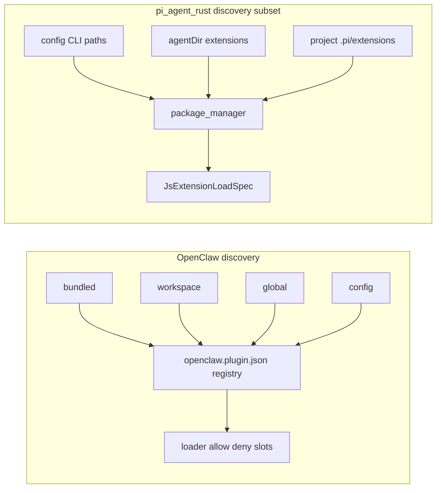
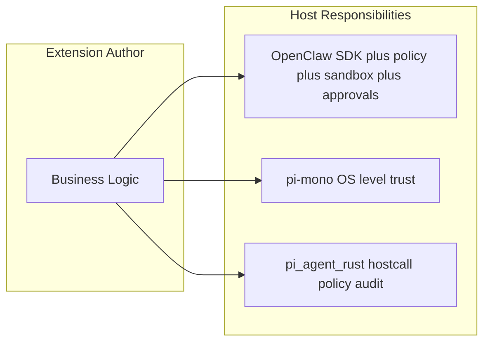

# OpenClaw、pi-mono（pi-coding-agent）与 pi_agent_rust 插件/扩展体系对比报告

**版本**：1.4（**v1.4**：全文穿插 **ASCII 示意图**（导读路线、清单、发现、加载、注册面、加载顺序等），便于在不渲染 Mermaid 的环境下阅读；**v1.3** 及更早结论保留）  
**日期**：2026-04-15（**§4.4 增补**：2026-04-19；**ASCII 图**：2026-04-19）  
**落盘路径**：`pi-rust-wasm/docs/reports/plugin_systems_openclaw_pi_mono_pi_agent_rust.md`

---

## 设计理念：三家的「脾气」先搞清楚（推荐先读）

如果把「主程序」当成一栋房子，「插件」就是房客想加的小功能（多一个开关、多一个聊天渠道、多一个工具按钮）。**三家最大的不同，是「房东怎么跟房客立规矩」。**

### 一句话比喻

| 项目 | 像什么？ |
|------|----------|
| **OpenClaw** | 像**民宿前台**：你要先填一张**固定格式的登记表**（`openclaw.plugin.json`），再领钥匙。房间里很多地方贴了「**请走正门（Plugin SDK）**」，不要翻员工通道。 |
| **pi-mono** | 像**自己家厨房**：锅碗瓢盆（Node 生态）基本都在，你会做菜就**快**。爸妈默认相信你会收拾，但两个房客抢同一个抽屉时，会**吵一架记在纸上**，人还是都留着。 |
| **pi_agent_rust** | 像**银行小隔间**：你在隔间里用**小号练习版 JS**（QuickJS）写逻辑；要取钱、要盖章，得按**小窗口（hostcall）**跟柜员说，柜员**记账、可拒绝**。 |

### 设计理念对照表（「为什么这样设计」）

| 维度 | OpenClaw | pi-mono | pi_agent_rust |
|------|----------|---------|---------------|
| **最想解决的事** | 私人助手要接很多渠道，还要**可控、可审查**：插件别乱摸核心。 | 终端 Agent 要**写得爽**：跟写普通 TS 项目差不多。 | Rust 版要**快、可审计**：扩展别当成完整服务器跑。 |
| **信什么当「真相」** | **清单 + 类型**：先发现 `openclaw.plugin.json`，再决定装不装、谁先谁后。 | **入口文件 + 运行时**：`package.json` 里 `pi.extensions` 指到哪，就从哪跑起来。 | **跑完以后的一张总表**：扩展在 JS 里注册完，收成一份 JSON（`RegisterPayload`）交给 Rust。 |
| **给插件多大权力** | **中等**：还是 Node，但强烈鼓励只走公开 SDK，别 import 宿主私房代码。 | **大**：接近完整 Node/Bun，读写盘、子进程都常见。 | **小**：很多能力要**问宿主**才能做；方便加权限和日志。 |
| **冲突了怎么办** | 诊断 + 配置里开关（偏「**先讲清楚再启用**」）。 | **不赶人**：扩展都留着，**谁后加载谁盖前面**；错误写进列表提醒你。 | 多种入口类型分顺序加载；扩展钩子错了，**往往只打日志，不挡主程序跑**。 |
| **最适合谁读** | 要做**多通道私人助手**、在乎边界与安全的人。 | 要写**终端里的 pi 扩展**、熟悉 npm 的人。 | 要盯 **Rust 宿主 + 合规/审计** 的人。 |

### 和后面章节怎么对应？

- **想比「清单长什么样」** → 看 **§2**。  
- **想比「从哪扫出来、谁先谁后」** → 看 **§3**。  
- **想比「代码怎么跑、怎么登记能力」** → 看 **§4～§5**；**想比三家注册 API 谁多谁少、和运行时啥关系** → 看 **§4.4**。  
- **想比「坏了会不会拖垮主程序」** → 看 **§6～§7**。  
- **想比「作者日常累不累」** → 看 **§10**。

### 导读路线图（ASCII）

```text
                         ┌──────────────────────────────┐
                         │   你想从哪个问题切入？       │
                         └──────────────┬───────────────┘
                                        │
     ┌──────────────────┬───────────────┼───────────────┬──────────────────┐
     ▼                  ▼               ▼               ▼                  ▼
 「登记表」        「从哪扫」      「怎么跑起来」    「坏了会怎样」     「我写扩展选谁」
     │                  │               │               │                  │
     └──────── §2 ──────┴───── §3 ─────┴──── §4～§5 ───┴──── §6～§8 ──────┘
                                                                        │
                                                                        ▼
                                                               「甜头/代价」§9～§10
```

---

## 0. 这份报告在说什么（范围与方法）

### 0.1 三个主角是谁？

| 代号 | 你可以把它想成 | 写「对不对」主要看了哪类代码 |
|------|----------------|------------------------------|
| **OpenClaw** | 自己电脑上的**私人助理总台**（Gateway）+ 会干活的 Agent；插件是带登记表的扩展包 | `openclaw/src/plugins/` 下面 discovery、loader、类型定义等 |
| **pi-mono** | 终端里的 **`pi`**；扩展就是给 pi 加功能的 TS/JS | `pi-mono/packages/coding-agent/src/core/extensions/loader.ts`、`resource-loader.ts` |
| **pi_agent_rust** | 用 **Rust** 重写的 Pi 类 Agent；扩展跑在**小号 JS**里，登记结果交给 Rust | `pi_agent_rust/src/extensions.rs`、`package_manager.rs`、`agent.rs` |

**另外**：本仓库里的 **`pi-rust-wasm`** 不是第四套「并列产品」，只拿来当**旁白**（例如 hostcall、Wasm 隔间），帮助理解「为什么 pi_agent_rust 要收得那么紧」。

### 0.2 我们读了什么、没逐字抄什么？

| 材料 | 说明（人话） |
|------|--------------|
| 三端源码（`.ts` / `.rs`） | **读过、对比过**，细节在下面各节和附录里指路。 |
| `pi_agent_rust` 里的 `EXTENSIONS.md`、`CONFORMANCE.md` | **书很厚**，本报告只告诉你「**去那两本书里查细则**」，不把整本书抄进来。 |

### 0.3 三个词别混了

- **OpenClaw 的 Plugin**：有 `openclaw.plugin.json` 的那种扩展包，用来挂工具、钩子、渠道等。  
- **pi 系的 Extension**：在 `package.json` 里用 `pi.extensions` 指一个或多个入口文件；mono 里用一套 **ExtensionAPI**；Rust 里跑完会变成 **`RegisterPayload`** 那张总表。  
- **OpenClaw 的 Skill**：是 **`SKILL.md` 菜谱**，走另一条线进模型视野；**不是**上面那种 Plugin 登记表路线。

### 0.4 想自己核对？看这些文件（Tomcat 里的路径）

| 主题 | 路径 |
|------|------|
| OpenClaw 插件根目录（bundled stock / 全局 extensions / 工作区 `.openclaw/extensions`） | `openclaw/src/plugins/roots.ts`（`resolvePluginSourceRoots`、`resolvePluginCacheInputs`） |
| OpenClaw 发现缓存（默认约 1s、可关、cache key 含 workspace/uid/global/stock/loadPaths） | `openclaw/src/plugins/discovery.ts`（`discoveryCache`、`OPENCLAW_PLUGIN_DISCOVERY_CACHE_MS`、`OPENCLAW_DISABLE_PLUGIN_DISCOVERY_CACHE`） |
| OpenClaw 加载管线入口（`discoverOpenClawPlugins`、`loadPluginManifestRegistry`、`jiti` alias 等） | `openclaw/src/plugins/loader.ts` |
| OpenClaw 插件 API 类型（`OpenClawPluginApi`、`registerTool` / `registerHook` / `registerCommand` 等） | `openclaw/src/plugins/types.ts`；产品向总览另见 `openclaw/docs/plugins/sdk-overview.md` |
| pi-mono 扩展作者 API | `pi-mono/packages/coding-agent/src/core/extensions/types.ts`（`ExtensionAPI`） |
| pi_agent_rust 嵌入方（Rust）稳定库 API（与 JS 扩展不是同一层） | `pi_agent_rust/src/sdk.rs`（`pi::sdk`） |
| pi-mono jiti、Bun 二进制 `virtualModules`、Node 侧 alias | `pi-mono/packages/coding-agent/src/core/extensions/loader.ts` |
| pi-mono 扩展冲突检测与 **仍保持全部扩展已加载** | `pi-mono/packages/coding-agent/src/core/resource-loader.ts`（`detectExtensionConflicts` 调用处注释） |
| pi_agent_rust `RegisterPayload` / `CapabilityManifest` | `pi_agent_rust/src/extensions.rs` |
| pi_agent_rust 支持的扩展文件后缀与 manifest 形态 | `pi_agent_rust/src/package_manager.rs`（`is_supported_extension_file`） |
| pi_agent_rust JS → Native → WASM 顺序与 `startup` fail-open | `pi_agent_rust/src/agent.rs` |

---

## 1. 术语与信任边界

**本节人话**：这一节回答两件事——**插件跑在谁的地盘上**，以及**主程序敢不敢让插件随便摸文件、开进程**。

### 1.1 谁加载谁、谁信任谁

| 维度 | OpenClaw | pi-mono | pi_agent_rust |
|------|----------|---------|---------------|
| 宿主形态 | **总台 + 多个小助手**：Gateway 管连线，Agents 管对话；插件帮它们加功能 | **终端里的 pi**：交互、打印 JSON、RPC 都有；扩展被 `ResourceLoader` 一起卷进来 | **Rust 写的程序外壳**：里面嵌小号 JS；扩展从 `package_manager` / `resources` 被发现 |
| 信任模型 | **「走正门」**：宿主给插件准备好 **`openclaw/plugin-sdk/*` 这几条公开走廊**（`loader.ts` + `sdk-alias.ts`），不鼓励偷偷 import 宿主私房代码（细节还在仓库 CI 里卡） | **「大房间」**：跟写 Node 项目很像；做成 Bun 一个文件时，只把**写在白名单里**的大库塞进 `virtualModules`，其余用别名找磁盘 | **「小隔间 + 窗口」**：敏感事要问宿主（**hostcall**），可以配策略、记日志；**不是**把整个 Node 搬进来 |

**小结（再压缩一遍）**：OpenClaw = **清单 + 窄走廊**；pi-mono = **大厨房，快但自己要管好**；pi_agent_rust = **小隔间 + 柜台，安全好讲清楚**。

### 1.2 结构示意（三端插件在系统中的位置）

下面的 **ASCII** 与紧随其后的 **Mermaid** 表达同一对比：可先扫 ASCII，再在支持图表的渲染器里看 Mermaid。

```text
  OpenClaw                    pi-mono                     pi_agent_rust
 ┌─────────────┐             ┌─────────────┐             ┌─────────────┐
 │ Gateway     │             │ pi CLI      │             │ Rust host   │
 │ Agents(Pi)  │             │ Runtime     │             │ + pkg mgr   │
 └──────┬──────┘             └──────┬──────┘             └──────┬──────┘
        │                          │                          │
        ▼                          ▼                          ▼
 ┌─────────────┐             ┌─────────────┐             ┌─────────────┐
 │ plugins/    │             │ ResourceLoader           │ PiJS / QJS  │
 │ discovery   │             │ loadExtensions           │ → Register  │
 │ + loader    │             │                          │   Payload   │
 └──────┬──────┘             └──────┬──────┘             └──────┬──────┘
        │                          │                          │
        ▼                          ▼                          ▼
 Skills 并行 (SKILL.md)      同进程·长生命 JS           hostcall 小隔间
```



---

## 2. 清单与元数据

**本节人话**：三家**「插件自我介绍」用的纸不一样**——有的用一张专用表，有的在 npm 的 `package.json` 里写几行。

### 2.1 清单载体与字段级差异

| 项 | OpenClaw | pi-mono / pi_agent_rust |
|----|----------|-------------------------|
| 主清单文件 | **`openclaw.plugin.json`**（与 `extensions/*` workspace 包配合） | **`package.json`** 内 `pi.extensions`（字符串或字符串数组，指向入口文件） |
| 与 npm 包关系 | 文档强调 **extensions 为 workspace 包** + manifest；与 **Skills**（`skills/`、`SKILL.md`）分流 | 扩展通常即 npm/工作区包的一部分；`pi.extensions` 声明入口 |
| pi_agent_rust 解析 | 不适用 | 与 pi-mono 字段一致：`pi.extensions` 必须为 string 或 string 数组，否则 `Error::config`（实现见 `pi_agent_rust/src/extensions.rs` 中 `read_pi_extensions_from_package`） |

### 2.2 多入口包 `pi.extensions`（pi 系专有问题）

**问题陈述**（来自 `pi_agent_rust-docs`）：若 `pi.extensions` 声明多个文件，但加载时只执行其中一个入口，则其它文件内的 `registerTool` / `registerCommand` / `pi.on` 不会运行，与 pi-mono 行为不一致。

**pi_agent_rust 策略**：对主入口沿目录向上找祖先 `package.json`，若其中 `pi.extensions` 列表**包含当前入口**，则把列表中**全部**解析路径作为关联入口并依次加载（`pi_agent_rust/src/extensions.rs`：`discover_related_extension_entries`；同文件含大量单元测试覆盖边界情况）。

**OpenClaw**：主要靠 **`openclaw.plugin.json` 这一张主表** 驱动；和 pi 那种「`package.json` 里列好几个入口文件」不是同一种玩法，本文不强行逐条对齐。

### 2.3 清单载体对照（ASCII）

```text
  OpenClaw (Plugin)                    pi-mono / pi_agent_rust (Extension)
 ┌─────────────────────────┐          ┌────────────────────────────────────┐
 │ openclaw.plugin.json    │          │ package.json                       │
 │  · id / main / channels │          │  "pi.extensions": [ "./a","./b" ]   │
 │  · workspace 扩展包     │          │         （可多入口）                │
 └────────────┬────────────┘          └───────────────────┬────────────────┘
              │                                          │
              ▼                                          ▼
     discover → registry → enable              （Rust：同族入口依次全加载）
              │
              ▼
     jiti → plugin.register(api)
```

---

## 3. 发现与优先级

**本节人话**：**「系统从哪些文件夹里找插件」**以及**「找重了听谁的」**。

### 3.1 OpenClaw

**物理根目录（源码）**（`openclaw/src/plugins/roots.ts`）：

- **`stock`**：`resolveBundledPluginsDir(env)` —— 随包自带的 bundled 插件树。  
- **`global`**：`resolveConfigDir(env) + "/extensions"` —— 用户配置目录下的全局扩展根。  
- **`workspace`**：`<workspaceDir>/.openclaw/extensions` —— 工作区本地扩展（无 `workspaceDir` 时可为空）。  

**额外 loadPaths**：`resolvePluginCacheInputs` 将调用方传入的 `loadPaths` 逐项 `resolveUserPath`；注释写明 **「Preserve caller order because load-path precedence follows input order」** —— 即 **显式路径顺序本身参与优先级**。

**发现缓存（源码）**：`discovery.ts` 内 `discoveryCache` + 默认 `DEFAULT_DISCOVERY_CACHE_MS = 1000`；可用 `OPENCLAW_PLUGIN_DISCOVERY_CACHE_MS` / `OPENCLAW_DISABLE_PLUGIN_DISCOVERY_CACHE` 调节（用于合并启动期的突发 rediscovery）。

**管线（与 `loader.ts` import 一致）**：`discoverOpenClawPlugins` → `loadPluginManifestRegistry` → `createPluginRegistry` →（`getCachedPluginJitiLoader` 等）**jiti** 加载 → `setActivePluginRegistry`；`config-state.ts` 中的 `normalizePluginsConfig`、`resolveEffectiveEnableState`、`resolveMemorySlotDecision` 等在 `loader.ts` 中参与 **enable / memory slot** 决策。

### 3.2 pi-mono（源码）

`DefaultResourceLoader` 在合并 CLI 与设置中的扩展路径后调用 `loadExtensions`（`resource-loader.ts`）。**冲突语义（源码注释，比「报错但继续」更精确）**：

- `detectExtensionConflicts(extensionsResult.extensions)` 检测 **跨扩展** 的 tool / command / flag 重名；  
- 对每个冲突 **`extensionsResult.errors.push({ path, error })`**；  
- 注释明确：**「Keep all extensions loaded. Conflicts are reported as diagnostics, and precedence is handled by load order.」** —— 即 **不卸载冲突扩展**，由 **加载顺序** 决定最终生效优先级。

**冲突时 pi-mono 怎么做（ASCII）**：

```text
  ext A 注册 tool "x"          ext B 也注册 tool "x"
         │                              │
         └──────────────┬───────────────┘
                        ▼
              errors[] 里记一条诊断
                        │
              两个扩展都还在内存里
                        │
              后加载覆盖先加载（同名言工具）
```

### 3.3 pi_agent_rust

**发现**：`package_manager` + `resources`；`resources.rs` 文件头注释声明实现 **pi-mono 资源发现行为的子集**（含 skills / prompts / themes / **extensions** 等管线中的扩展部分）。

**逻辑顺序**（兼容说明 ASCII）：配置/CLI 路径 → 全局 agent `extensions/` 与项目 `.pi/extensions` 等 → `package_manager` 过滤支持的入口类型 → 去重后的 `JsExtensionLoadSpec` 列表。



**纯 ASCII 平行视角**（与上图同构，便于纯文本终端阅读）：

```text
  OpenClaw discovery                         pi_agent_rust discovery（子集）
 ┌──────────────────────────┐              ┌──────────────────────────┐
 │ stock  · workspace       │              │ CLI / 配置里写的路径      │
 │ global · loadPaths…      │              │ ~/.pi … / 项目 .pi/…     │
 └─────────────┬────────────┘              └─────────────┬────────────┘
               │                                         │
               ▼                                         ▼
      openclaw.plugin.json 聚合                    package_manager 过滤
               │                                 （支持的扩展后缀）
               ▼                                         │
      loader + enable/slots                              ▼
               │                                 JsExtensionLoadSpec[]
               ▼
      Runtime Plugin Registry
```

---

## 4. 加载与注册机制

**本节人话**：**「插件代码怎么被跑起来」**，以及**「跑完之后，主程序怎么知道多了哪些按钮/工具」**。

### 三条加载主轴（ASCII）

```text
 OpenClaw                         pi-mono                           pi_agent_rust
┌──────────────────────┐        ┌──────────────────────┐          ┌──────────────────────┐
│ jiti 执行入口模块     │        │ jiti（Node）          │          │ QuickJS 执行入口       │
│ plugin.register(api) │        │ 或 Bun + virtualMods │          │ 收集 JsExtensionSnapshot│
└──────────┬───────────┘        └──────────┬───────────┘          └──────────┬───────────┘
           │                             │                               │
           ▼                             ▼                               ▼
  OpenClawPluginApi 登记      ExtensionAPI：registerTool/…    RegisterPayload（JSON）
  （工具/钩子/渠道/…）        on(event) EventBus…                + CapabilityManifest 等
```

### 4.1 执行与注册路径

| 阶段 | OpenClaw | pi-mono | pi_agent_rust |
|------|----------|---------|---------------|
| 执行扩展代码 | **jiti load** 后 `plugin.register(api)` | **`loader.ts`**：`isBunBinary` 时用 `createJiti(..., { virtualModules })`；否则 Node 下 `createJiti` + `getAliases()` | **QuickJS（PiJS）** 执行 TS/JS |
| 注册 API 形态 | `registerTool` / `registerHook` / `registerCommand` / …（Plugin SDK 公开面） | **ExtensionAPI**（`registerTool`、`registerCommand`、`on` 等） | 运行时收集 **JsExtensionSnapshot**，归并为 **`RegisterPayload`（JSON）** 交给宿主 |

### 4.2 `RegisterPayload` 与 OpenClaw「注册面」的逐项对照

`RegisterPayload` 字段（`pi_agent_rust/src/extensions.rs`）：`name`、`version`、`api_version`、`capabilities`、`capability_manifest`（可选）、`tools`、`slash_commands`、`shortcuts`、`flags`、`event_hooks`。

`CapabilityManifest`（同文件，**`#[serde(deny_unknown_fields)]`**）含 `schema` 与 `capabilities: Vec<CapabilityRequirement>`；每条 requirement 可声明 `capability`、`methods`、`intents`、`connector_classes`、`hostcall_classes`、`risk_tier` 等 —— 用于宿主侧 **能力策略** 与扩展自描述，比「仅工具名列表」更结构化。

| 注册物 / 能力 | pi_agent_rust（源码） | OpenClaw（源码 + 产品分册） | pi-mono（源码） |
|---------------|----------------------|-----------------------------|-----------------|
| 工具 | `tools: Vec<Value>` | `openclaw/src/plugins/types.ts`：`registerTool`；Agent 侧另有内置 tools + Skills 管线（见 `openclaw_docs/11-Skills与Tools.md`） | `registerTool`（`extensions/types.ts` 经 loader 暴露的 ExtensionAPI） |
| 斜杠命令 | `slash_commands` | `registerCommand`（`types.ts`） | `registerCommand` |
| 快捷键 / flags | `shortcuts`、`flags` | `types.ts` 中 `registerCommand` 同表意链上还有 CLI 元数据能力；UI 层对齐见产品文档 | `registerFlag` 等由 `ExtensionRuntime` 承载（`loader.ts` 中 stub/绑定前后行为需结合 `Runner.bindCore` 阅读） |
| 事件钩子 | `event_hooks` | `registerHook`；另有独立 **`src/hooks/`**（产品架构） | EventBus + `pi.on`（`loader.ts` 创建 `createEventBus`） |
| 渠道 Channel | **不在** `RegisterPayload` 结构体内 | OpenClaw 插件管线包含 **channel 插件**（`openclaw_docs/12-Plugins.md` 与 `types.ts` 中 channel 相关注册面） | **未在本文逐字段**把 IM Channel 与 `RegisterPayload` 对齐（pi_agent_rust 面向「编码 Agent 扩展」模型） |
| Provider（模型侧扩展） | `capability_manifest` + `capabilities: Vec<String>` 等与策略协作；扩展 Provider 流详见 **`pi_agent_rust/EXTENSIONS.md`** | OpenClaw 有 **provider 插件**契约（`openclaw/src/plugins/types.ts` 与 `plugin-sdk/provider-entry.ts` 等源码树） | `loader.ts`：`registerProvider` 在 **bindCore 之前** 进入 `pendingProviderRegistrations` 队列，待 runtime 绑定后刷入 |

**小结**：OpenClaw 将 **渠道、钩子、工具** 统一收口到 **Plugin Pipeline + Hooks 分册**；pi_agent_rust 将「可序列化注册结果」收口到 **RegisterPayload**，并另支持 **Native / WASM** 形态入口（见下节）。

**`RegisterPayload` 在纸面上长什么样（ASCII，非穷举字段）**：

```text
┌──────────────── RegisterPayload（pi_agent_rust，可序列化总表）───────────────┐
│  name / version / api_version                                              │
│  tools[]  ·  slash_commands[]  ·  shortcuts[]  ·  flags[]                 │
│  event_hooks[]  ·  capabilities[]                                           │
│  capability_manifest?  ──► 结构化能力/hostcall 需求、risk_tier 等            │
└────────────────────────────────────────────────────────────────────────────┘
         │
         │  OpenClaw 侧「同类能力」分散在：
         │   registerTool / registerCommand / registerHook / registerChannel …
         │   （管线 + Hooks 分册；见 types.ts / 产品文档）
         ▼
   不是字段 1:1 对齐 —— 产品面更宽 vs JSON 总表更紧
```

### 4.3 Native / WASM（pi_agent_rust）

- **JS/TS 等入口**：`pi_agent_rust/src/package_manager.rs` 中 `is_supported_extension_file` 接受：`extension.json`、`**/*.native.json`、扩展名为 **`wasm`** 的文件，以及 **`ts` / `tsx` / `js` / `mjs` / `cjs` / `mts` / `cts`**。不符合时错误信息字面提示：`use extension.json, JS/TS entrypoints, *.native.json, or *.wasm`。  
- **WASM**（`#[cfg(feature = "wasm-host")]`，`agent.rs`）：在 JS、Native 加载及 **auto-repair diagnostics drain** 之后创建 `WasmExtensionHost` 并 `load_wasm_extensions`。

### 4.4 Plugin SDK、`ExtensionAPI` 与 pi 扩展：能力接口对照（源码锚点级）

**本节人话**：前面 §4.1～§4.3 说的是「跑完以后宿主手里有什么数据结构」；这里专门回答：**扩展作者拿到的那个 `api`/`pi` 对象，表面上能 register 哪些东西**，以及 **和「能不能随便 exec/fs」是不是一回事**。

#### 4.4.1 三份「作者面向的契约」各是谁？

| 端 | 注入对象（类型名） | 锚点文件（Tomcat） |
|----|-------------------|-------------------|
| **OpenClaw** | `OpenClawPluginApi`（`register(api)` 回调参数） | `openclaw/src/plugins/types.ts`（`OpenClawPluginApi` 定义段） |
| **pi-mono** | `ExtensionAPI`（扩展工厂里的 `pi`） | `pi-mono/packages/coding-agent/src/core/extensions/types.ts` |
| **pi_agent_rust（JS 扩展）** | 宿主注入的 **`pi`**（文档称 Extension API）；加载完成后归并为 **`RegisterPayload`** JSON | `pi_agent_rust/src/extensions.rs`（`RegisterPayload` 等）；细则合约见 `pi_agent_rust/EXTENSIONS.md` |

**务必区分**：`pi_agent_rust/src/sdk.rs` 公开的 **`pi::sdk`** 是给 **Rust 嵌入 Agent 的库消费者**（`Agent`、`Config`、`ToolDefinition` 等），**不是** JS 扩展作者手里的 `pi`；下文「能力接口」若无特殊说明，指 **插件/扩展作者面**，不把 `pi::sdk` 与 OpenClaw `OpenClawPluginApi` 放在同一维度对比。

#### 4.4.2 注册面（`register*` / 序列化字段）：谁最宽？

**共同点（三家在语义上可对齐的一块）**

- **工具**：OpenClaw `registerTool`，pi-mono `registerTool`，pi_agent_rust → `RegisterPayload.tools`。  
- **斜杠类命令**：OpenClaw `registerCommand`，pi-mono `registerCommand`，pi_agent_rust → `slash_commands`。  
- **钩子**：OpenClaw 有 `registerHook` 以及类型化的 `on(...)`（`OpenClawPluginApi`）；pi-mono 是大量 **会话/轮次/消息/工具** 相关的 `on(event, …)`；pi_agent_rust → `event_hooks` 为**可序列化的钩子名列表**，侧重点是协议化与宿主派发，而不是 mono 里那一整张细粒度事件枚举。

**OpenClaw 明显更宽（面向 Gateway / 多渠道 / 控制面）**

`OpenClawPluginApi` 除文本推理外，还包含 **渠道**（`registerChannel`）、**Gateway**（`registerGatewayMethod`、`registerHttpRoute`）、**CLI / 常驻能力**（`registerCli`、`registerService`、`registerCliBackend` 等）、**多类 Provider 槽位**（语音、实时语音/转写、媒体理解、图像/音乐/视频生成、web fetch/search 等）、**内存/上下文独占槽**（如 `registerMemoryCapability`、`registerContextEngine`）、以及安全/迁移/探针等（详见同文件 `OpenClawPluginApi` 成员列表）。产品向总表见 **`openclaw/docs/plugins/sdk-overview.md`**（与源码相互印证，以 `types.ts` 为准）。

**pi-mono 独有或更贴「终端 TUI + 编码会话」**

`ExtensionAPI` 在 **会话生命周期与 UI 流** 上事件更细（如 `session_before_compact`、`tool_execution_*`、`message_*`、`user_bash`、`input` 等，见 `extensions/types.ts` 中 `on(...)` 重载列表）；另有 **`registerMessageRenderer`**、**`events: EventBus`**；**`exec`** 出现在同一 API 面上（扩展可直接走宿主绑定的 shell 路径，与 Rust 侧「敏感能力走 hostcall」形成对照）。

**pi_agent_rust 扩展：注册 JSON 收紧 + 策略元数据加强**

`RegisterPayload` 显式承载的主要是 `tools`、`slash_commands`、`shortcuts`、`flags`、`event_hooks`，以及 **`capabilities` / `capability_manifest`**（`CapabilityManifest` 带 `#[serde(deny_unknown_fields)]`，用于声明 hostcall 类需求、风险层级等）。**不包含** OpenClaw 意义上的 **channel / gateway HTTP / 整套内存插件独占槽** 等产品面；那不是 PiJS 扩展这张「登记总表」的设计目标（与 §4.2 小结一致）。

**谁「登记面」最宽 / 事件最细 / OS 面最大（ASCII）**：

```text
register* 方法多 ──►  OpenClaw（Gateway/渠道/多类 Provider/内存槽…）
        │
        │        会话与 TUI 事件粒度细 ──►  pi-mono（message_*/tool_* / session_* …）
        │
        └──  默认可直触 OS（fs/exec）相对大 ──►  pi-mono
             刻意收小 + hostcall ──►  pi_agent_rust

（「宽」≠ 更好；= 产品与信任假设不同）
```

#### 4.4.3 运行时与侧效应（和「注册面」不是一张表）

| 维度 | OpenClaw Plugin SDK | pi-mono `ExtensionAPI` | pi_agent_rust JS 扩展 |
|------|----------------------|-------------------------|----------------------|
| 模块与依赖 | Node + jiti；**约定**只从 **`openclaw/plugin-sdk/*`** 进宿主走廊 | **Node/Bun 全栈**：`node_modules`、jiti、白名单 `virtualModules`（Bun 单文件）等 | **PiJS（QuickJS）**：无任意 npm 包解析；合规见 **`pi_agent_rust/EXTENSIONS.md`** |
| 敏感能力 | 仍是大号 Node 侧插件；**纵深防御**靠沙箱、审批、策略等（见 `openclaw_docs/16-Sandbox与Approvals.md` 等） | **`exec` 等在 API 上直达**（由 pi 会话/TUI 宿主绑定） | **`pi.tool` / `pi.exec` / `pi.http` / `pi.session.*` 等经 hostcall 与策略门控**（概述见 `pi_agent_rust/docs/ext-compat.md`） |

**小结一句**：**注册方法「多不多」** —— OpenClaw 最广；**会话/TUI 事件「细不细」** —— pi-mono 最贴终端产品；**默认 OS 面「大不大」** —— pi-mono 最大，pi_agent_rust 刻意收小。

**侧效应从哪里来（和 `register*` 不是同一张图）**：

```text
  OpenClaw 扩展代码                pi-mono 扩展                    pi_agent_rust 扩展
 ┌──────────────────┐            ┌──────────────────┐          ┌──────────────────┐
 │ 仍是 Node 里跑   │            │ 仍是 Node/Bun    │          │ PiJS（裁剪 JS）   │
 │ + SDK/策略/沙箱  │            │ exec/fs 等可直达  │          │ 敏感能力走        │
 │   纵深防御        │            │ （ExtensionAPI） │          │ hostcall + 策略   │
 └──────────────────┘            └──────────────────┘          └──────────────────┘
```

---

## 5. 运行时与模块解析

**本节人话**：**「扩展里能不能 `import` 任意 npm 包」**、**「能不能随便读写盘」**——三家答案差很多。

### 5.1 pi-mono 与 pi_agent_rust：能力差别一眼表

| 能力 | pi-mono | pi_agent_rust |
|------|---------|---------------|
| 模块解析 | Node 解析 + jiti；可访问 `node_modules` | PiJS：**无裸包名解析**、无任意 `node_modules` 遍历（合约与限制见 **`pi_agent_rust/EXTENSIONS.md`**；本报告不逐条摘录） |
| 内置/虚拟模块 | **编译进 Bun 二进制** 时：`loader.ts` 中 `VIRTUAL_MODULES` 静态注入 `@sinclair/typebox`、`@mariozechner/pi-agent-core`、`pi-ai`、`pi-tui`、`pi-coding-agent` 等；`createJiti(..., { virtualModules: VIRTUAL_MODULES })`。开发/Node 模式则用 `getAliases()` 将上述包解析到 monorepo `dist` 或 `import.meta.resolve`。 | QuickJS 侧 shim/polyfill/虚拟模块（差距与用例见 **`pi_agent_rust/CONFORMANCE.md`**，本报告不展开逐条） |
| IO / 子进程 | 真实 `fs`、`child_process` | **hostcall**；能力策略 + 审计；表面积 **刻意小于 Node** |

### 5.2 OpenClaw

- **jiti + SDK 别名**：`loader.ts` 组合 `buildPluginLoaderJitiOptions` / `buildPluginLoaderAliasMap` / `listPluginSdkExportedSubpaths`（定义于 `sdk-alias.ts`），将扩展运行时对 **`openclaw/plugin-sdk/*` 子路径** 的解析钉在宿主提供的真实文件上，而不是让扩展随意 `import` 任意 `src/**`。  
- **Node 版本**：仓库 `AGENTS.md` 要求 **Node 22+**（与早期导读「≥22」一致）。  
- **Skills 与 Tools**：仍为产品面能力；实现入口见 `openclaw/src/agents/skills/` 与 `openclaw/src/agents/tools/`（本报告不展开 Skills 扫描算法）。

### 5.3 旁证：pi-rust-wasm 的 hostcall 模型（帮助理解 pi_agent_rust 类「窄宿主」）

`host-call-protocol.md`：`Guest` 通过 `__pi_host_call(requestJson)` 调用宿主；`HostRequest` 含 `module` / `method` / `params` / 可选 `callId`；`HostResponse` 含 `ok`、`data`、`error`。这与 pi_agent_rust 文档中的 **hostcall + 策略 + 审计** 叙述同构，便于读者把 **「Node 全量」vs「JSON 边界」** 区分清楚。

**模块从哪里来（一眼对比）**：

```text
 pi-mono                         pi_agent_rust
 ───────                         ─────────────
 node_modules 可解析             无任意包名解析
 jiti + getAliases               QuickJS shim / 合约内模块
 Bun: virtualModules 白名单       CONFORMANCE / EXTENSIONS 说了算
```

---

## 6. 生命周期与跨调用状态

**本节人话**：**「插件搞砸了，主程序会不会一起崩」**，以及**「插件里的变量能不能记住上一句话」**。

### 6.1 pi_agent_rust 加载顺序与 startup 语义

`pi_agent_rust/src/agent.rs`（节选逻辑顺序）：

1. `load_js_extensions`  
2. `load_native_extensions`  
3. `manager.runtime()` 上 **drain auto-repair diagnostics**（`drain_repair_events`，与扩展健康相关）  
4.（`feature = "wasm-host"`）`load_wasm_extensions`  

随后派发 **`ExtensionEventName::Startup`** 与 **`SessionStart`**；源码注释写明 **「Fail-open: extension errors must not prevent the agent from running」** —— 失败仅 `tracing::warn!`（含 `session_start extension hook failed` 分支）。

**加载与事件顺序（ASCII，pi_agent_rust）**：

```text
  time ───────────────────────────────────────────────────────────────►

  load_js_extensions
        │
        ▼
  load_native_extensions
        │
        ▼
  drain auto-repair diagnostics   （修健康/诊断）
        │
        ▼
  [optional] load_wasm_extensions   (feature = wasm-host)
        │
        ▼
  ExtensionEvent: Startup · SessionStart
        │
        ▼
  （扩展错 → warn，主 Agent 仍可跑 —— fail-open）
```

### 6.2 pi-mono：为何大量插件依赖「持久 JS 状态」（机理）

**证据来源**：`pi-rust-wasm/openspec/.../phase2-long-lived-vm.md` 明确以 **pi-mono 生态插件** 为例，说明 `git-checkpoint`、`todo`、`plan-mode`、`ssh`、定时器等依赖 **跨事件/跨 tool 调用** 的内存状态；并指出 **短生命周期 VM**「每次新建 VM、全局变量清零」的根本限制。

**对照结论**：

- **pi-mono（Node/Bun + jiti）**：默认更接近 **长寿命 JS 上下文**（同一进程内模块状态可持续），与上列插件形态一致。  
- **pi_agent_rust（QuickJS）**：注册结果以 **`RegisterPayload`/工具包装器** 形式接进 `Agent`（`agent.rs` 末尾 `collect_extension_tool_wrappers` + `extend_tools`）；扩展运行时对象保存在 `self.extensions`。跨调用是否保留 **与 pi-mono 同构的「模块全局可变状态」** 取决于 `extensions.rs` / PiJS 宿主实现 —— 需对照 **`EXTENSIONS.md`** 与集成测试，本报告不替代码做保证。  
- **OpenClaw（插件）**：管线描述停在 **registry + hooks/tools**；插件内状态是否跨会话持久、与 Gateway 热更关系 → **未在 openclaw_docs 细述**；导读仅提示 **改 extensions/ 不一定立刻影响运行中 Gateway，需看 reload 计划或重启**。

---

## 7. 安全、沙箱与运维语义

**本节人话**：**「危险动作要不要家长签字」**（审批）、**「要不要关进围栏里跑」**（沙箱），以及**「关掉插件是不是删文件夹就行」**。

### 7.1 OpenClaw

| 机制 | 文档要点 |
|------|----------|
| 插件 vs 核心权限 | 插件跑在 **受控 API** 后；越权 **加载失败或被拒** |
| Sandbox | **Docker** 隔离；**tool-policy** 与 sandbox 白名单 |
| Approvals | 敏感 exec 走 **exec-approval-manager** + Gateway methods；**非 main 会话 tool-policy 更严**（常见默认） |
| 运维 | `openclaw doctor`；Daemon 管理 Gateway 生命周期（launchd/systemd/schtasks） |
| 密钥 | 主 PRD 提到 **SecretRef** 与预加载/只读对齐（与扩展作者可见性细节 → **未在插件分册展开**） |

### 7.2 pi_agent_rust

- **hostcall** + **能力策略** + **审计日志**（兼容说明、总览表）。  
- **侧效应表面积小于 Node** 是设计取舍。

### 7.3 pi-mono

- 运行时与 Node/Bun 一致：扩展可调用真实 `fs`、`child_process`（与 `loader.ts` 使用场景一致）。  
- **冲突处理**（`resource-loader.ts`）：**不卸载**冲突扩展；错误写入 `extensionsResult.errors`；**优先级 = 加载顺序**（见 §3.2）。运维需消费该错误列表或上层 diagnostics。

### 7.4 禁用 / 卸载 / 热更（对照）

**安全与责任一刀切的图（ASCII）**：

```text
                    扩展作者写的逻辑
                           │
           ┌───────────────┼───────────────┐
           ▼               ▼               ▼
    ┌────────────┐  ┌────────────┐  ┌────────────────┐
    │ OpenClaw    │  │ pi-mono     │  │ pi_agent_rust   │
    │ SDK+沙箱+   │  │ 宿主信 OS   │  │ hostcall 闸门   │
    │ 审批+策略   │  │ 自由度大    │  │ + 审计 + 裁剪   │
    └────────────┘  └────────────┘  └────────────────┘
```

| 场景 | OpenClaw | pi-mono（笔记） | pi_agent_rust |
|------|----------|-----------------|---------------|
| 「删掉目录就算禁用」 | **否**；需看 **plugins 配置状态、缓存、manifest 诊断** | **未在已检出文档描述等价 checklist** | **未在已检出文档描述等价 checklist** |
| 热更 | **reload 计划**；有的需重启 Gateway | `ResourceLoader.reload()`（笔记） | **未在已检出文档描述 Gateway 级热更**；Agent 内顺序与 fail-open 有述 |

---

## 8. 验证、兼容与诊断

**本节人话**：**「怎么检查自己没写坏」**——有的像体检（doctor），有的像对答案（Conformance）。

### 8.1 OpenClaw

- **`openclaw doctor`**：风险检查（主 PRD、Daemon 分册均强调与渠道状态交叉验证）。  
- **插件管线**：`diagnostics / precedence` 在 manifest registry 阶段出现（`12-Plugins.md`）。

### 8.2 pi_agent_rust

| 手段 | 定位 |
|------|------|
| **Differential Oracle** | 仓库内 **`pi_agent_rust/CONFORMANCE.md`** 描述；配套测试与 harness 见该文件及 `tests/ext_conformance_*`（本报告未逐文件枚举） |
| **`PI_EXT_COMPAT_SCAN` / `ext-conformance` feature** | `extensions.rs`：`compat_static_registration_enabled()`；**正则扫描** TS/JS 源以 **补齐** `RegisterPayload`（测试/元数据向）；**生产路径仍以 QuickJS 执行为准** |

**假阳性/假阴性（作者视角）**：静态扫描对动态拼接注册名易 **漏报**；oracle 侧重 **registration snapshot** 一致，对 **运行期行为** 差异需另设测试 —— 以 `CONFORMANCE.md` 与具体测试用例为准。

### 8.3 pi-mono

- 用户向说明：`pi-mono/packages/coding-agent/docs/extensions.md`。  
- **与 pi_agent_rust 同级的「registration JSON diff oracle」**：**非** pi-mono 核心仓库义务；pi_agent_rust 另建 harness 做跨运行时对齐。

---

## 9. 综合：优势、代价与适用场景

**本节人话**：每张表 **左边三格是「甜头」**，**右边三格是「要付出的代价」**——没有完美方案，只有更合适你的。

每端 **不少于 3 条优势 / 3 条代价**（结合源码与仓库文档；若带推测会写明）。

### 9.1 OpenClaw

| 类型 | 内容 |
|------|------|
| 优势 1 | **产品与运维一体化**：Gateway、多 Agent、Cron、Daemon、doctor、沙箱/审批在同一叙事内（主 PRD + 分册）。 |
| 优势 2 | **扩展面分层清晰**：**Plugins（manifest）** 与 **Skills（SKILL.md）** 分流；渠道可通过插件 pipeline 进入同一控制面（`12-Plugins.md`）。 |
| 优势 3 | **工程边界可审查**：Plugin SDK 公开 + 禁止 import 核心私有，利于 code review 与供应链治理（`12-Plugins.md`）。 |
| 代价 1 | **运行时信任仍偏「全能力 Node」一侧**（与 pi_agent_rust 的 QuickJS+hostcall 相比）；沙箱/审批是 **纵深防御**，配置错误仍有风险（`16-Sandbox与Approvals.md`）。 |
| 代价 2 | **心智负担**：plugins 状态、缓存、manifest 诊断 + **reload/重启** 语义交织（`12-Plugins.md` 常见误会）。 |
| 代价 3 | **与 pi 系扩展模型不 trivial 互移植**：清单格式、Gateway 装配、Skills 市场（ClawdHub）与 pi 的 `pi.extensions` **不等价**。 |

### 9.2 pi-mono

| 类型 | 内容 |
|------|------|
| 优势 1 | **开发者体验贴近常规 Node/TS 工具链**：`node_modules`、jiti、完整 I/O 与子进程（兼容说明 QA）。 |
| 优势 2 | **扩展 API 表达力强**：工具、slash、主题、Provider 等在同一 Extension 叙事（笔记 + gap 报告侧证）。 |
| 优势 3 | **嵌入 vs CLI 双入口清晰**（`createAgentSession` vs `AgentSessionRuntime`），利于产品集成。 |
| 代价 1 | **安全与确定性更依赖宿主环境与扩展自律**；不如嵌入式引擎路径易做全局表面积裁剪。 |
| 代价 2 | **冲突扩展不会被卸载**（`resource-loader.ts`），仅 `errors` 报告 + **加载顺序定优先级** —— 现场易呈「多扩展并存、静默覆盖」形态，需运维显式治理。 |
| 代价 3 | **多入口包** 在发现/加载上的陷阱需作者与工具链共同规避（`pi_agent_rust-docs` 反向说明其重要性）。 |

### 9.3 pi_agent_rust

| 类型 | 内容 |
|------|------|
| 优势 1 | **对齐 pi-mono 的发现与 manifest 字段**（`pi.extensions`、resources 子集），利于复用生态扩展包的部分结构。 |
| 优势 2 | **运行时强约束 + hostcall + 审计**，更易做「侧效应可记账」的多租户/合规向设计（兼容说明）。 |
| 优势 3 | **可选 WASM / Native**（`package_manager.rs` 入口过滤 + `agent.rs` 中 `wasm-host` 条件加载）。 |
| 代价 1 | **PiJS 与 Node 差异**导致大量 npm 包/写法不可用或行为不同；调试成本高（兼容说明 §4 + QA）。 |
| 代价 2 | **多入口、虚拟模块、Conformance** 等需要作者与 CI 额外投入；`extensions.rs` 内 **大量** `discover_related_extension_entries_*` 测试说明边界极多，静态扫描仍有局限（`compat_static_registration_enabled`）。 |
| 代价 3 | **startup fail-open** 可能掩盖扩展初始化错误，运维需依赖日志与 oracle（`agent.rs` 引用段）。 |

---

## 10. 开发者视角（写插件的人累不累）

**本节人话**：如果你要自己写扩展，**哪一家上手快、哪一家踩坑多**——用表格把「日常会卡的事」摊开说。

本章用 **总览表 + 主题子表** 收束上文。和源码对不上的地方已在 v1.1 修过；v1.2 主要改「好读」；信息不够的地方会写 **「材料里没写清楚」**，不乱编。

### 10.1 总览表（作者日常）

| 主题 | OpenClaw | pi-mono | pi_agent_rust |
|------|----------|---------|---------------|
| 上手入口 | `openclaw/src/plugins/`、`openclaw/src/plugin-sdk/` + 产品文档 `docs.openclaw.ai` | `pi-mono/packages/coding-agent/docs/extensions.md` + 源码 `extensions/loader.ts` | `pi_agent_rust/EXTENSIONS.md` + `src/extensions.rs` |
| 最小扩展形态 | `openclaw.plugin.json` + 注册函数 + workspace 包 | `package.json` `pi.extensions` + default export 工厂 | `pi.extensions` / `extension.json` 等 + **PiJS** + `RegisterPayload` |
| 热更 / reload | 插件：产品文档强调 reload/重启语义；**发现**侧有 **~1s 默认 discovery cache**（可调 env，见 `discovery.ts`） | `ResourceLoader.reload()`（`resource-loader.ts` 接口） | 与 OpenClaw 的 Gateway 级热更 **不等价**；扩展失败 **fail-open**（`agent.rs`） |
| 排障第一工具 | `openclaw doctor` + manifest diagnostics +（开发时）**关闭 discovery cache** 以排除缓存干扰 | **无**与 `openclaw doctor` 同名的单一入口；依赖 **TUI/日志 + `extensionsResult.errors`** | `CONFORMANCE.md` oracle + `PI_EXT_COMPAT_SCAN` + `tracing::warn`（`startup`/`session_start`） |
| 类型与 IDE | 完整 Node 类型 + monorepo；插件仅 **`openclaw/plugin-sdk/*` 子路径** 为稳定契约面 | 完整 Node/Bun；Bun 二进制依赖 **`virtualModules` 白名单** | PiJS 裁剪 + **`CapabilityManifest` deny_unknown_fields** |
| 分包/多入口 | 与 `pi.extensions` 数组语义 **不同模型**（manifest-first） | jiti 多文件加载顺序敏感；冲突见 §3.2 | `discover_related_extension_entries` + 大量单元测试 |
| 市场/分发 | **ClawdHub** 等技能市场属 **Skills 产品面**（`openclaw_docs`）；与 npm 插件分发关系未在源码展开 | 上游 npm/包管理 CLI（见 `pi-rust-wasm` gap 报告） | 以本地路径 + `package_manager` 为主；**无**与 ClawdHub 对等的内置市场（源码未体现） |
| i18n / a11y | **未在插件源码路径单列**扩展级 i18n 强制钩子 | TUI/Web 能力强弱见 gap 报告；扩展渲染器属产品能力 | **未在 `RegisterPayload` 体现**消息渲染扩展点 |
| metrics/tracing | **未在 `src/plugins` 热路径源码单列**扩展级 metrics 标准 | **未在 extensions 源码单列** | 审计/hostcall 向能力在 `extensions.rs` 政策模型中延展（细读见该文件） |

### 10.2 上手与心智负担

| 点 | 说明 |
|----|------|
| OpenClaw | 需同时理解 **Plugins / Skills / Hooks / Gateway**；`12-Plugins.md` 用「插头形状」比喻降低认知负载。 |
| pi-mono | Runtime vs SDK 双线；扩展与 **ResourceLoader** 绑定（`pi-mono_docs`）。 |
| pi_agent_rust | 必读 **`pi_agent_rust/EXTENSIONS.md`**（合约与限制以该文件为准；本报告仅对齐 `extensions.rs` 中可见类型）。 |

### 10.3 工具链与构建

| 端 | jiti/直跑 | 预编译 | 备注 |
|----|-----------|--------|------|
| OpenClaw | 插件：**jiti**（`loader.ts` + `getCachedPluginJitiLoader`） | 扩展包依赖安装/发布约束由仓库 **CI 与插件包 `package.json`** 共同定义（本报告未展开 install 脚本清单） | `openclaw/package.json` **`engines.node": ">=22.14.0"`** |
| pi-mono | **Node**：`createJiti` + `getAliases`；**Bun 二进制**：`virtualModules` 注入白名单包（`loader.ts`） | 标准 monorepo `dist` 输出假设 | |
| pi_agent_rust | QuickJS 执行 | WASM/Native 另径 | 与 npm 生态 **不等价** |

### 10.4 API 稳定性与演进

| 端 | 可见机制 |
|----|----------|
| pi_agent_rust | `RegisterPayload` / `CapabilityManifest` 见 **`extensions.rs`**；破坏性演进策略 → **未在本文展开**（见 `CHANGELOG.md` / 维护流程） |
| OpenClaw | **未在 openclaw_docs 给出** `openclaw.plugin.json` 版本演进表 |
| pi-mono | **未在已检出 pi-mono_docs 给出** ExtensionAPI semver 契约表 |

### 10.5 本地开发循环与错误可定位性

- **OpenClaw**：插件发现可受 **`OPENCLAW_DISABLE_PLUGIN_DISCOVERY_CACHE` / `OPENCLAW_PLUGIN_DISCOVERY_CACHE_MS`** 影响（`discovery.ts`）；Skills 热更见产品文档中的 chokidar 描述。  
- **pi_agent_rust**：`PI_EXT_COMPAT_SCAN` + **`compat_static_registration_enabled`**（`extensions.rs`）；`startup`/`session_start` **fail-open**（`agent.rs`）— 注意「warn 即失败」。  
- **pi-mono**：冲突写入 **`extensionsResult.errors`**，元素含 **`path` + `error` 文本**（`resource-loader.ts`）。

### 10.6 性能与资源（作者侧）

| 关切 | OpenClaw | pi-mono | pi_agent_rust |
|------|----------|---------|---------------|
| 扫描开销 | discovery + **可选 1s 内内存缓存**（`discovery.ts`） | `reload` 合并多路路径后 `loadExtensions` | `package_manager` 过滤、忽略不支持的文件（`is_supported_extension_file`） |
| 同步钩子阻塞 | **未在插件导读量化** | pi-mono 插件可阻塞事件循环（引擎特性） | **未在已检出文档量化**；WASM/actor 方案见 pi-rust-wasm openspec（**旁证**） |

### 10.7 并发与确定性

- **OpenClaw**：主 PRD 写 Agents **session lane 串行**；多 Agent 由 Gateway 路由 — 扩展是否应写「无全局可变单例」→ **未在插件分册给出规范**。  
- **pi-mono**：长寿命 JS 状态常见（§6 旁证）。  
- **pi_agent_rust**：RegisterPayload 快照式；并发下扩展状态语义 → **未在已检出文档展开**。

### 10.8 安全责任划分（作者 vs 宿主）



### 10.9 配置、密钥、网络 I/O

| 项 | OpenClaw | pi-mono | pi_agent_rust |
|----|----------|---------|---------------|
| 配置面 | `openclaw.json` + `~/.openclaw/`（主 PRD） | pi 配置路径；**细节未在已检出笔记展开** | CLI + 配置聚合（兼容说明图） |
| SecretRef | 主 PRD提及行为对齐 | **未在已检出文档对比** | **未在已检出文档对比** |
| 网络默认 | Sandbox/Approvals 对 exec；插件出站默认 → **未在 openclaw_docs 插件章展开** | Node 级自由度大 | hostcall 表面积裁剪 |

### 10.10 依赖与供应链

- **OpenClaw**：pnpm monorepo；扩展 workspace 包；**SBOM 要求** → **未在 openclaw_docs 插件章读到**。  
- **pi-mono**：`node_modules` + 上游供应链常态。  
- **pi_agent_rust**：**刻意弱化** `node_modules` 假设；更适合「扩展包内聚、少外部动态依赖」。

### 10.11 测试与 CI

| 端 | 可操作建议（文档级） |
|----|----------------------|
| pi_agent_rust | **Differential Oracle** + 可选静态扫描（§8） |
| OpenClaw | 主 PRD 提 **CI/QA Matrix** 总体趋势；**扩展作者标准模板** → **未在已检出插件分册** |
| pi-mono | **未在已检出材料**给出官方扩展 E2E 模板 |

### 10.12 发布与治理

- **OpenClaw**：**ClawdHub** 与技能白名单/沙箱并列出现（`11-Skills与Tools.md`）；**插件签名/市场** → **未在已检出导读明确**。  
- **pi-mono**：npm/开源常态；企业内网 registry → **未在已检出文档讨论**。  
- **pi_agent_rust**：WASM 路径或适合「可审计制品」；**签名** → **未在已检出文档明确**。

### 10.13 Code review 清单（跨端通用 + 各端特化）

| 检查项 | OpenClaw | pi-mono | pi_agent_rust |
|--------|----------|---------|---------------|
| 越权依赖 | 绕过 `openclaw/plugin-sdk/*` 去 `import` 宿主私有 `src/**`（与 `sdk-alias`+loader 设计目标相悖） | 依赖图过大 / 恶意生命周期脚本风险（通用 Node 系） | 动态 require 裸包名、Node API |
| 侧效应在注册阶段 | manifest 与 enabled 集 | 扩展加载时修改全局 | RegisterPayload 与真实行为不一致 |
| 幂等与重试 | 工具与 Gateway 调用 | 工具与会话 JSONL | hostcall 重复调用语义 → **未在本地 host 协议分册完整读到** |

---

## 附录 A. 引用路径索引（Tomcat 仓库内）

### A.1 产品/导读文档（v1.0 起沿用）

| 文档 |
|------|
| `openclaw_docs/12-Plugins.md` |
| `openclaw_docs/11-Skills与Tools.md` |
| `openclaw_docs/16-Sandbox与Approvals.md` |
| `openclaw_docs/15-Daemon.md` |
| `openclaw_docs/00-主PRD.md` |
| `pi-mono_docs/03-pi-coding-agent 包.md` |
| `pi-mono_docs/README.md` |
| `pi_agent_rust-docs/插件与-pi-mono-扩展系统兼容说明.md` |
| `pi-rust-wasm/src/ext/README.md`（旁证） |
| `pi-rust-wasm/openspec/specs/architecture/plugin-system/host-call-protocol.md`（旁证） |
| `pi-rust-wasm/openspec/specs/architecture/plugin-system/phase2-long-lived-vm.md`（旁证） |
| `pi-rust-wasm/docs/reports/pi_mono_gap_analysis.md` §3（旁证） |

### A.2 源码主锚点（v1.1 复核）

| 仓库 | 路径 |
|------|------|
| OpenClaw | `openclaw/src/plugins/discovery.ts`、`roots.ts`、`loader.ts`、`sdk-alias.ts`、`types.ts`、`config-state.ts` |
| pi-mono | `pi-mono/packages/coding-agent/src/core/extensions/loader.ts`、`resource-loader.ts`、`extensions/types.ts` |
| pi_agent_rust | `pi_agent_rust/src/extensions.rs`、`package_manager.rs`、`agent.rs` |
| pi_agent_rust 库嵌入 API（非扩展作者） | `pi_agent_rust/src/sdk.rs` |

---

## 附录 B. 上游 Web 与长文（非本报告逐页引用）

- OpenClaw 官方文档：<https://docs.openclaw.ai>  
- pi-mono 上游：`https://github.com/badlogic/pi-mono`  
- pi_agent_rust 仓库内长文：`EXTENSIONS.md`、`CONFORMANCE.md`（与 §0.2 一致）

---

**v1.1 修订说明**：已用 Tomcat 内 **`openclaw/`、`pi-mono/`、`pi_agent_rust/`** 源码核对并修正 v1.0 中「工作区未检出」「本地未检出 CONFORMANCE」等过时表述；补充 OpenClaw **插件根路径 / discovery 缓存环境变量**、pi-mono **冲突不卸载仅 errors+顺序**、pi_agent_rust **`RegisterPayload`/`CapabilityManifest`/`is_supported_extension_file`/`agent.rs` fail-open** 等实现级结论。

**v1.2 修订说明**：文首新增 **「设计理念」** 通俗对照（民宿 / 厨房 / 银行隔间比喻 + 表格）；各章补 **「本节人话」** 短引导；用语整体往短句、少黑话收拢（技术细节仍保留在后续表格与路径索引中）。

**v1.3 修订说明**：在 **§4** 新增 **§4.4**，系统整理 **OpenClaw `OpenClawPluginApi` / pi-mono `ExtensionAPI` / pi_agent_rust `RegisterPayload`+`pi`** 的注册面与运行时差异；区分 **`pi_agent_rust` 的 `pi::sdk`（Rust 嵌入）** 与 **JS 扩展的 `pi`**；更新 **§0.4** 锚点表、**§「和后面章节怎么对应」** 指引与 **附录 A.2** 一行。

**v1.4 修订说明**：在 §1～§7 关键位置增加 **ASCII 示意图**（与已有 Mermaid 互补），覆盖导读路线、三端结构、清单载体、发现管线、加载主轴、`RegisterPayload`、注册面宽度、侧效应来源、模块解析、pi_agent_rust 启动顺序、安全责任切片等，降低纯 Markdown 阅读成本。

*本报告随各仓库 HEAD 变更而过时；若源码与导读冲突，以源码为准。*
