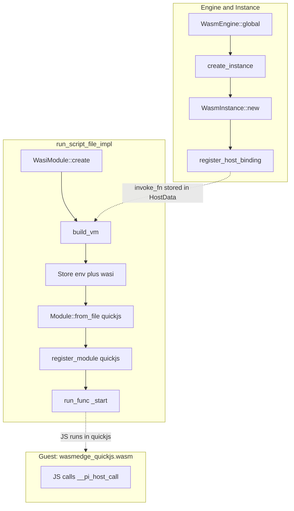
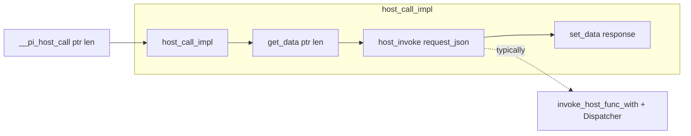

# Wasm 运行时层与插件生命周期 (ext)

## 1. 概述

- **职责**：WasmEdge 运行时骨架、宿主导入绑定、Hostcall 分发、插件生命周期管理；与 design/Architecture 第 3、4 节及 CODE_BLOCK_P1_007/008/009 对齐。
- **所在层级**：宿主 API 层 + WasmEdge 运行时层（依赖 infra、core traits）。
- **核心文件**：
  - `src/ext/mod.rs` — 聚合 engine/instance、host_binding、dispatcher、plugin
  - `src/ext/engine_stub.rs` — WasmEngine 单例与 WasmInstance 创建（桩实现）
  - `src/ext/instance_stub.rs` — 单插件 Wasm 实例（桩）
  - `src/ext/host_binding.rs` — HostRequest/HostResponse、invoke_host_func / invoke_host_func_with 入口
  - `src/ext/dispatcher.rs` — HostApiDispatcher，按 module/method 路由
  - `src/ext/plugin.rs` — PluginManifest、PluginInstance、PluginStatus、PluginManager
  - `src/core/*.rs` — PrimitiveExecutor、ToolRegistry、LlmProvider 等 Trait 定义

### 1.1 Wasm / Hostcall / 插件 — 结构总览（ASCII）

```text
  PluginManager
       |
       | load_plugin(path)
       v
  +----+----------------------------+-----------------------------+
  | WasmEngine::global (单例)        | 每插件 WasmInstance (独立 Vm) |
  +----+------------------------------+-----------------------------+
       |                              |
       | register_host_binding        | QuickJS (wasmedge_quickjs.wasm)
       v                              v
  invoke_host_func_with --------> __pi_host_call (guest)
       |                              ^
       v                              |
  HostApiDispatcher 按 module/method 路由
       |
       +---> 4 原语 / tools / llm / session / event ...
```

- **单入口**：Guest 仅通过 `__pi_host_call` 进入宿主；路由集中在 `HostApiDispatcher`（与规格 [host-call-protocol](../../openspec/specs/architecture/plugin-system/host-call-protocol.md) 一致）。
- **Mermaid**：实例化到单次 `run_script` 的细粒度流程见下文「3.1」中的流程图，与本 ASCII 互补。

## 2. 设计要点

- **007**：WasmEngine 全局单例、单插件独立 WasmInstance、宿主导入绑定骨架；资源上限预留 Standard 默认。**默认构建即包含 WasmEdge 真实实现**（见下节），需安装 WasmEdge C 库。
- **008**：HostApiDispatcher 单入口多路复用；EventBus 必选，PrimitiveExecutor/ToolRegistry/LlmProvider 可选注入。
- **009**：PluginManifest 解析与校验；PluginManager 注册/启用/禁用/卸载；卸载时调用 EventBus.remove_plugin_listeners、ToolRegistry.unregister_plugin_tools。**9.2 完整加载流程**：`PluginManager::load_plugin(path)` 从磁盘路径完成「读清单与 main → 权限校验与用户确认 → 创建 Wasm 实例 → 注册授权 API → 注入并执行插件初始化代码 → 注册到 PluginManager」；调用前须通过 `set_wasm_engine` 注入引擎，`set_host_dispatcher` / `set_confirm_permissions` 可选；与 design CODE_BLOCK_P1_009 对齐。

## 3. WasmEdge 真实实现（默认包含）

- **构建方式**：默认即启用 WasmEdge，`cargo build` 即可；需先安装 WasmEdge C 库（见 https://wasmedge.org/docs/start/install，或运行 `./scripts/install-wasmedge.sh`（Linux/macOS））。
- **WasmEngine**：全局单例，Config 开启 WASI、统计、内存上限（max_memory_pages）；`set_memory_limit` 已预留，MVP 使用固定 Standard 值。
- **WasmInstance**：每插件独立 Vm；宿主导入 `env.__pi_host_call` 注册，供 QuickJS 映射到全局；`run_script` / `run_script_file` 通过 wasmedge_quickjs.wasm 执行 JS，每次执行新建 Vm 与 WasiModule（argv + preopen），脚本会被真正执行。`run_script` 写入的临时 script.js 可放在工作目录的 agent tmp（见 [工作目录与数据布局](../../openspec/specs/architecture/work-dir-and-data-layout.md)）；QuickJS wasm 路径可通过 config `[wasm] quickjs_path` 或环境变量 `PI_WASM__WASM__QUICKJS_PATH`（覆盖 config）、未设置时回退到 `WASMEDGE_QUICKJS_PATH` 配置。
- **Node 兼容层**：由 wasmedge_quickjs.wasm 提供，范围包括 fs、path、process、console、http 等常用模块；具体能力以 WasmEdge QuickJS 扩展为准。
- **线性内存边界**：Hostcall 时宿主通过 WasmEdge 的 `get_data`/`set_data` 访问线性内存；**边界检查由 WasmEdge 运行时保证**，防止越界访问。响应缓冲区不足时仅回写长度，由 guest 重试更大缓冲区。

### 3.1 从实例化到 QuickJS 与 host_call 的执行链

本节描述从 WasmEngine 单例创建、WasmInstance 创建与宿主导入注册，到单次 `run_script`/`run_script_file` 执行（新建 Vm、挂载 env 与 WasiModule、加载 quickjs wasm、执行 `_start`），再到 JS 中调用 `__pi_host_call` 时宿主侧处理的完整代码链。宿主导入回调由调用方通过 `register_host_binding` 注入，通常封装 `invoke_host_func_with(Some(&dispatcher), plugin_id, request_json)` 并将 `HostResponse` 序列化为字符串；Dispatcher 按 module/method 路由到 4 原语、LLM、工具、事件、会话等实现。

**执行流程概览（创建与单次运行）**



**JS 调用 __pi_host_call 时（宿主侧）**



- **build_vm 懒创建 env**：仅在首次调用 `build_vm` 时用 `ImportObjectBuilder` 创建 env 模块（含 `__pi_host_call`），之后复用同一 `import_object`；`HostData` 携带 `plugin_id` 与 `host_invoke`。
- **每次执行新建 Vm 与 WasiModule**：每次 `run_script`/`run_script_file` 都会先设置当次 `WasiModule`（argv、preopen），再 `build_vm` 得到新 Vm（Store 持有当次 env + wasi），然后加载 quickjs 模块并执行 `_start`。
- **Guest 侧**：wasmedge_quickjs.wasm 须从 env 导入 `__pi_host_call` 并暴露给 JS，JS 方能通过约定协议调用宿主；协议与调用约定见 [Hostcall JSON 协议](../../openspec/specs/architecture/plugin-system/host-call-protocol.md)。

**关键代码节点**

| 阶段 | 文件 | 函数/位置 | 作用 |
|------|------|-----------|------|
| A | `src/ext/engine_wasmedge.rs` | `WasmEngine::global` | 构建 WasmEdge Config（WASI/统计/内存上限）、解析 quickjs_path，返回引擎单例 |
| A | `src/ext/engine_wasmedge.rs` | `WasmEngine::create_instance` | 调用 `WasmInstance::new`，创建单插件独立实例 |
| A | `src/ext/instance_wasmedge.rs` | `WasmInstance::new` | 保存 config、plugin_id、quickjs_path；import_object / wasi_module 尚未创建 |
| A | `src/ext/instance_wasmedge.rs` | `WasmInstance::register_host_binding` | 将「request_json → response_json」回调存入 `host_invoke`，供后续 build_vm 的 HostData 使用 |
| B | `src/ext/instance_wasmedge.rs` | `run_script_file_impl` | 设置 WasiModule（argv/preopen）、build_vm、加载 quickjs 模块、执行 _start |
| B | `src/ext/instance_wasmedge.rs` | `build_vm` | 懒创建 env（含 __pi_host_call）、将 env + wasi 放入 Store、构造 Vm |
| B | `src/ext/instance_wasmedge.rs` | `ImportObjectBuilder::new("env", HostData).with_func("__pi_host_call", host_call_impl)` | 将宿主导入函数注册到 env 模块，HostData 携带 plugin_id 与 host_invoke |
| B | wasmedge_sdk | `Module::from_file` / `Vm::register_module` / `Vm::run_func` | 加载 wasmedge_quickjs.wasm、注册为 "quickjs"、执行 _start 运行 JS |
| C | `src/ext/instance_wasmedge.rs` | `host_call_impl` | 从线性内存读取 request_json，调用 host_invoke，将 response 写回内存并返回长度 |
| — | `src/ext/host_binding.rs` | `invoke_host_func_with` | 宿主导入回调通常封装此函数；解析 HostRequest、交给 HostApiDispatcher::dispatch、返回 HostResponse 序列化字符串 |

### 集成测试要求

- 全量集成测试要求使用真实 Wasm 运行时，**环境缺失不允许跳过**。可执行 `./scripts/run-integration-tests.sh` 自动完成环境检查、未安装则安装（并写入 profile，新开终端无需再 source）、再跑集成测试；或须先全局安装 WasmEdge（见 https://wasmedge.org/docs/start/install，或执行 `./scripts/install-wasmedge.sh`），并配置 quickjs 路径，再执行 `cargo build`、`cargo test --test wasmedge_e2e_tests`；若构建或测试失败则视为集成测试失败。
- wasmedge_quickjs 集成测试包含：**真实 .js Hello World**（`tests/fixtures/wasmedge_quickjs/hello.js`，`run_script` 内联与 `run_script_file` 路径两种方式）、**4 原语 .js**（`tests/fixtures/wasmedge_quickjs/primitives_test.js`），依赖 run_script/run_script_file 的 WASI argv/preopen 与每次新建 Vm。

## 4. 插件完整加载流程（9.2）

`PluginManager::load_plugin(path)` 实现从磁盘到可用的完整链路，供 CLI plugin 子命令与 chat 调用。

- **路径**：`path` 可为插件根目录（其下需有 `plugin.json` 或 `pi-plugin.json`）或清单文件路径；插件根用于解析 `manifest.main` 及后续 `dispatch_event`。
- **依赖注入**：须先 `set_wasm_engine(Arc<WasmEngine>)`；可选 `set_host_dispatcher`（未设则 host 调用走桩）、`set_confirm_permissions`（未设则不弹确认、视为同意）。
- **流程**：解析路径 → 读清单并 `parse_manifest` → 读 main 入口脚本（并校验不逃逸插件根）→ 调用权限确认回调（若已注入）→ `WasmEngine::create_instance` → `instance.register_host_binding`（闭包内 `invoke_host_func_with(dispatcher, instance_id, request_json)`）→ `instance.run_script(plugin_code)` → 构造 `PluginInstance`（含 `plugin_root`）→ `register_plugin` 并 `enable_plugin`。
- **错误**：清单非法、路径无效、用户拒绝、Wasm/QuickJS 失败均返回 `Result`，信息清晰；若已创建实例则先 `destroy` 再返回。

## 5. 依赖与后续

- **005/006/004**：Dispatcher 通过 with_primitive/with_tools/with_llm 注入；未注入时返回明确错误，待合并后接实线。
- **跨平台**：Windows/macOS/Linux 各需在对应环境安装 WasmEdge 后执行 `cargo build` 验证。
