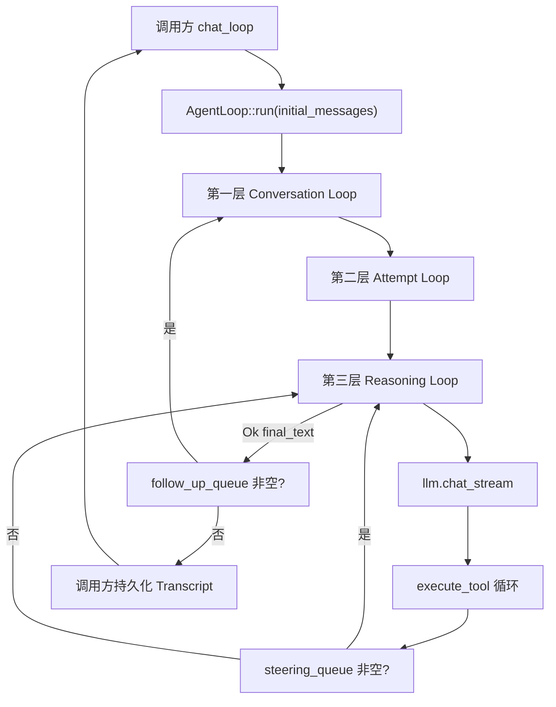

# Agent Loop 模块说明 (Agent Loop Module)

## 1. 概述 (Overview)

- **职责**：编排「用户输入 → LLM 流式调用 → 工具执行 → 结果回注 → 再调 LLM」的三层嵌套循环，支持 Steering（中途改向）、FollowUp（同上下文追问）、Abort（Ctrl+C 中断）、AgentEvent 全生命周期发布、错误分类与指数退避重试。
- **所在层级**：宿主核心能力层（`src/core/agent_loop.rs`），被 `src/api/chat.rs` 调用，依赖 `LlmProvider`、`PrimitiveExecutor`、`EventBus`。
- **核心文件**：
  - `src/core/agent_loop.rs` — AgentMessage、ToolCallInfo、convert_to_llm_format、agent_messages_from_chat、AgentLoopConfig、AgentLoop、LoopError、compact_messages
  - `src/core/mod.rs` — core 层 re-export
  - `src/lib.rs` — 对外导出 AgentLoop、AgentLoopConfig、AgentRunResult、AgentMessage、convert_to_llm_format、agent_messages_from_chat

### 1.1 三层嵌套循环 + 干预点（ASCII）

```text
Layer 1  Conversation Loop
    |     FollowUp 队列非空 -> 注入 User 再继续
    v
Layer 2  Attempt Loop (max_attempts, 指数退避)
    |
    v
Layer 3  Reasoning Loop (max_tool_rounds)
    |     LLM 流式 -> tool_calls?
    |     +-- 执行工具 -> ToolResult 回注
    |     +-- Steering 队列 -> 改向，跳过后续工具
    |     +-- Abort 信号 -> 中断
    v
  final_text (由调用方决定是否写 Session)
```

- **消息边界**：内部 `AgentMessage`，调用 `LlmProvider` 前经 `convert_to_llm_format` 转为 `ChatMessage`（与 [agent-loop 规格](../../openspec/specs/architecture/agent-loop.md) 13.4 一致）。
- **总览**：与 [模块技术文档索引](./README.md)「图 1」中 `core/agent_loop` 位置对照。

## 2. 设计方案 (Design Details)

- **设计模式**：三层嵌套循环（Conversation → Attempt → Reasoning），职责分离；内部使用富类型 `AgentMessage`，仅在调 LLM 边界通过 `convert_to_llm_format` 转为 `ChatMessage`，与 [agent-loop.md](../../openspec/specs/architecture/agent-loop.md) 13.4 消息类型边界一致。
- **关键权衡**：System Prompt 与工具定义由**调用方**（如 chat）拼装并注入：AgentLoop 只接受已拼好的 `initial_messages`（含首条 System 若需要）和构造时传入的 `config.tool_definitions`，不在 Loop 内再拼 system，便于多调用方复用同一 Loop 逻辑。Transcript 持久化由调用方在 `run()` 返回后根据 `AgentRunResult.final_text` 自行 append 并写入 Session，AgentLoop 不依赖 SessionManager。
- **线程安全/并发**：`steering_queue`、`follow_up_queue` 为 `Arc<Mutex<Vec<AgentMessage>>>`，`abort_signal` 为 `Arc<AtomicBool>`；`steer()`、`follow_up()`、`abort()` 可从其他线程调用，`run()` 内读队列与信号，无数据竞争。`run()` 需 `&mut self` 因持有 `on_stream_delta: Option<Box<dyn FnMut(&str) + Send>>`。

## 3. 核心 API 与数据结构 (API Definitions)

- **AgentMessage**：Agent 内部富类型消息；变体包括 `User`、`Assistant`（含 `tool_calls: Vec<ToolCallInfo>`）、`ToolResult`（含 `is_error`）、`System`、`Steering`（含 `timestamp`）、`CompactionSummary`。
- **ToolCallInfo**：`{ id, name, arguments }`，与 LLM 流式 tool_calls 对应。
- **convert_to_llm_format(messages: &[AgentMessage]) -> Vec<ChatMessage>**：将 AgentMessage 序列转为 LlmProvider 使用的 ChatMessage；User/Steering/CompactionSummary → user，System → system，Assistant 按有无 tool_calls 分别转为 assistant 或 assistant_with_tool_calls，ToolResult → tool。
- **agent_messages_from_chat(messages: &[ChatMessage]) -> Vec<AgentMessage>**：反向转换，供 chat 从 Session 加载历史后拼装 `initial_messages`。
- **AgentLoopConfig**：`max_attempts`（默认 3）、`max_tool_rounds`（默认 10）、`retry_base_delay_ms`（默认 300）、`model`、`session_id`、`tool_definitions: Vec<serde_json::Value>`（由调用方 `build_tool_definitions()` 等生成）。
- **AgentRunResult**：`{ final_text: String }`，run 成功时最后一轮 LLM 文本回复。
- **AgentLoop::new(llm, primitive, event_bus, config, abort_signal)**：标准构造函数；内部创建默认的 steering_queue、follow_up_queue。
- **AgentLoop::run(&mut self, initial_messages: Vec<AgentMessage>) -> Result<AgentRunResult, AppError>**：主入口；执行第一层 Conversation Loop（含 FollowUp 检查）、第二层 Attempt Loop（重试与 classify_error）、第三层 Reasoning Loop（LLM 流式 + 工具执行 + Steering/Abort 检查）。
- **AgentLoop::steer(&self, msg: String)**：向 steering_queue 推入 `AgentMessage::Steering { text, timestamp }`；第三层每工具执行完后检查，非空则注入并跳过剩余工具进入下一轮 LLM。
- **AgentLoop::follow_up(&self, msg: String)**：向 follow_up_queue 推入 `AgentMessage::User { text }`；第一层循环尾部检查，非空则 drain 追加到 messages 并 continue。
- **AgentLoop::abort(&self)**：将 `abort_signal` 置为 true；第三层每工具执行前检查，为 true 则返回 `Err` 并发布 agent_end(interrupted)。
- **AgentLoop::set_on_stream_delta(&mut self, f)**：设置流式 delta 回调，供 chat 做 Markdown 渲染等。
- **LoopError**（内部）：`Retryable(String)`、`Fatal(String)`、`Aborted`；`classify_error(AppError)` 将 429/5xx/超时/请求失败等归为 Retryable，401/400 归为 Fatal。
- **compact_messages(messages, keep_recent)**：MVP 压缩：保留首条 System（若有）+ 最近 `keep_recent` 条，其余丢弃。

## 4. 配置项 (Configuration)

| 字段 | 类型 | 默认值 | 说明 |
|------|------|--------|------|
| max_attempts | u32 | 3 | 第二层 Attempt 最大重试次数（含首次） |
| max_tool_rounds | usize | 10 | 单次 Attempt 内第三层最大工具轮次 |
| retry_base_delay_ms | u64 | 300 | 指数退避基准延迟（ms），实际 delay = base × 2^(attempt-1) |
| model | String | — | LLM 模型名，由调用方从 Session/Config 填入 |
| session_id | String | — | 会话 ID，随 AgentEvent 发布 |
| tool_definitions | Vec<serde_json::Value> | [] | 传入 LLM 的工具 JSON Schema，由调用方 build_tool_definitions() 生成 |

无环境变量或配置文件直连；上述均在构造 `AgentLoopConfig` 时由调用方设置。

## 5. 交互流程 (Workflow)



- 第一层：处理用户输入与 FollowUp；每次循环开始注入 steering_queue 中已有消息；Attempt 成功后在循环尾检查 follow_up_queue，非空则 drain 追加后 continue，否则 return。
- 第二层：按 attempt 计数，Retryable 错误时指数退避后重试，Fatal 或 Aborted 则终止并返回 Err。
- 第三层：turn_start → chat_stream → message_start/update/end → 若有 tool_calls 则逐个 execute_tool，每工具前检查 abort、每工具后检查 steering_queue；无 tool_calls 或达到 max_tool_rounds 则 return Ok(final_text)。

## 6. 示例代码 (Usage Examples)

chat 层构造并调用 AgentLoop 的典型片段（见 `src/api/chat.rs`）：

```rust
let messages = agent_messages_from_chat(&chat_messages); // 从 Session 历史 + 当前用户消息
let config = AgentLoopConfig {
    max_attempts: 3,
    max_tool_rounds: 10,
    retry_base_delay_ms: 300,
    model: model.clone(),
    session_id: ctx.session.current_session_key().to_string(),
    tool_definitions: build_tool_definitions(),
};
let mut agent_loop = AgentLoop::new(
    ctx.llm.clone(),
    ctx.primitive.clone(),
    ctx.event_bus.clone(),
    config,
    ctx.cancelled.clone(),
);
agent_loop.set_on_stream_delta(Box::new(move |delta: &str| { /* 渲染 delta */ }));

match agent_loop.run(messages).await {
    Ok(result) => {
        // AgentLoop 不负责写入 Session；调用方自行 append 并持久化
        if !result.final_text.is_empty() {
            let assistant_msg = ChatMessage::assistant(&result.final_text);
            ctx.session.append_message(serde_json::to_value(&assistant_msg)?)?;
        }
    }
    Err(e) => return Err(e),
}
```

## 7. 验收标准 (Testing & QA)

- **单测**：`cargo test --lib` 全通过（当前 250 passed）；`core::agent_loop::tests` 覆盖：正常单轮无工具、多轮工具循环、Steering 注入后跳过剩余工具、FollowUp 同上下文继续、Abort 终止并 agent_end(interrupted)、429 触发重试后成功、401/503 Fatal 立即终止、convert_to_llm_format 各变体与 CompactionSummary→user、agent_messages_from_chat 往返。
- **门禁**：`cargo clippy --lib` 无新增警告（既有 3 条在 config/logging，非本模块）。
- **事件**：agent_start、turn_start/end、message_start/update/end、tool_execution_start/end、auto_retry_start/end、agent_end(success|error|interrupted) 发布时机与 [agent-loop.md](../../openspec/specs/architecture/agent-loop.md) 13.6 一致。
