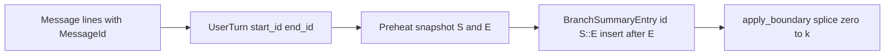

本文为 [Architecture](../Architecture.md) 中「上下文管理」的详细设计，总览见主文档。关联文档：[Agent Loop 设计](agent-loop.md)、[会话存储数据结构](session-storage.md)。研究报告：[context-management-deep-dive.md](../../../docs/reports/context-management-deep-dive.md)。重构建议报告：[context-management-refactoring-proposal.md](../../../docs/reports/context-management-refactoring-proposal.md)。

---

# 上下文管理技术方案

## 1. 概述

### 1.1 背景

TASK-17 落地了四层同步防护（Layer 0 截断 → Layer 1 占位符 → Layer 2 LLM 摘要 → Layer 3 强制删除）和 token-aware 滑窗。后续基于 [Claude Code 上下文管理机制](../../../docs/reports/context-management-refactoring-proposal.md) 的对比分析，升级为 ratio 水位线 + 级联降压模式。

本轮重构将 **LLM 摘要从同步阻塞改为异步预热 + 延迟应用**，核心目标是 **主线程零等待**，避免压缩操作卡住 UI。四层重新定义为：


| 层级      | 名称             | 执行模式               |
| ------- | -------------- | ------------------ |
| Layer 0 | tool_result 清理 | 同步（每轮必跑，纯内存操作极快，用户无感知） |
| Layer 1 | 异步预热           | 异步（后台 Task，主线程不等待） |
| Layer 2 | 检查与应用          | 非阻塞检查 / 仅极端时同步等待   |
| Layer 3 | 物理截断           | 同步（API 报错后兜底）      |


**关键时序定义**：

- **「LLM 回复后」**：指 reasoning loop 的**最终 assistant 回复**——此时当前 user turn 内所有 tool 已执行完毕，LLM 给出了无 tool_calls 的文本回答，reasoning loop 结束。**不是** reasoning loop 内每次中间 LLM 调用之后。
- **「发起下一次 LLM 请求前」**：指**下一个 user turn** 进入时，在构建 `messages` 并调用 LLM 之前。两个时机之间是用户阅读/思考/输入的间隔期，异步预热在此期间后台运行。

核心改进点：

- **Token 计数精度**：从纯字符估算升级为 API Usage 优先 + 字符 fallback
- **异步摘要**：LLM 摘要从同步阻塞改为 Layer 1 异步预热 + Layer 2 延迟应用，LLM 回复后主线程零等待
- **Preheat 状态机（单任务）**：`Preheat` 保证后台同一时间至多一个预热 task，防止竞态和 token 浪费
- **信息保全**：Layer 0 从「截断丢弃」升级为「落盘 + preview 占位符」，大 tool_result 内容不丢失、可按需读回
- **UI 不卡顿**：LLM 回复后（L0/L1 时机）绝不阻塞主线程；仅在发起下一次 LLM 请求前、且 ratio >= 0.98 时才可能同步等待
- **可观测性**：`ContextState` 内嵌 **`live: ContextLiveMetrics`**（瞬时利用率与预热标志）与 **`session_obs: SessionContextObservation`**（会话累计：压缩次数、释放量、工具落盘字符）；`context_metrics_update` 由二者组装，其中 `session_obs` 在 user turn 末写入 `sessions.json`；UI 状态栏反馈压缩进度（见 §10.6）。类型别名 `ContextMetrics` ≡ `ContextLiveMetrics`（见 `context_metrics.rs`）。

### 1.2 设计目标

1. **防溢出**：所有发给 LLM 的 prompt 估算 token 不超过安全水位，消除 context overflow
2. **语义完整**：被压缩的旧消息通过 LLM 结构化摘要保留核心语义（Goal / Constraints / Progress）
3. **信息保全**：超大 tool_result 落盘保全，不截断丢弃，未来可按需读回
4. **主线程零等待**：LLM 回复后绝不阻塞 UI；压缩通过异步预热 + 延迟应用实现
5. **主动降压**：ratio 水位线驱动的分级主动压缩，而非被动等 API 报错
6. **防御性兜底**：Layer 3 物理截断确保极端场景不崩溃
7. **可配置**：`context_window`、`max_output_tokens`、`compaction_model` 等均可在配置中覆盖
8. **可观测**：L0–L3 事件与 `context_metrics_update` 提供分层与累计指标；UI 反馈压缩状态（§10.4 / §10.6）

---

## 2. 术语表


| 术语                     | 说明                                                                                                                                                                                                                        |
| ---------------------- | ------------------------------------------------------------------------------------------------------------------------------------------------------------------------------------------------------------------------- |
| **user turn**          | 一条 `role=user` 消息 + 其后所有 `role=assistant` / `role=tool` 消息，直到下一条 `role=user`。上下文管理的最小粒度单位。                                                                                                                                |
| **MessageId**          | Transcript 中每条 `MessageEntry.id`（user/assistant/tool 各一行一条）。会话内须**唯一**，且不得包含子串 `::`（与复合 id 分隔符冲突），详见 §5.7。                                                                                                            |
| **TurnId（复合）**      | `start_id + "::" + end_id`，其中 `start_id` / `end_id` 均为 MessageId。单条 `UserTurn` 表示「本条 turn 内首条与末条 message」；`BranchSummaryEntry.id` 表示「预热 snapshot 首 turn 的 `start_id` + 末 turn 的 `end_id`」，见 §5.7。                                |
| **context_window**     | 模型固有的最大上下文长度（输入 + 输出），由模型提供商决定（如 GPT-4o 128K, GPT-5.2 400K）。                                                                                                                                                              |
| **input_budget**       | 输入 token 预算，`context_window - max_output_tokens`。分母，用于计算 ratio。                                                                                                                                                           |
| **ratio**              | 上下文使用率，`estimated_token_count / input_budget`，取值 0.0 ~ 1.0+。驱动多级水位线触发。                                                                                                                                                    |
| **compactable zone**   | `userTurnsList` 中可被 Layer 0 占位符替换的区间 `[0, N-m)`，排除保护区。m 固定为 5。**仅适用于 Layer 0**。                                                                                                                                           |
| **protected zone**     | 最近 `m` 个 user turns（m=5），**不参与 Layer 0 占位符替换**。Layer 1 摘要压缩**整个 userTurnsList**，不受保护区限制。                                                                                                                                  |
| **m 值**                | 保护区大小，固定为 5。**仅影响 Layer 0** 占位符替换范围。                                                                                                                                                                                      |
| **preview 占位符**        | Layer 0 落盘后替换 tool_result 的短文本，包含路径 + 工具名 + 前 500 chars 预览。                                                                                                                                                               |
| **placeholder**        | Layer 0 替换旧 turn 中 tool_result 的常量文本 `[Previous tool result replaced to save context space]`。                                                                                                                             |
| **CompactionSummary**  | 多指 `AgentMessage::CompactionSummary`：摘要展平到消息列表中的形态。运行时 Layer 1 由 **`Preheat`** 封装 task、3× retry 与 `Idle`/`Running`/`ExhaustedPending`（及重载用的 **`CachedCompleted`**）；成功产物类型为 **`CompactionResult`**（文本 + `covered_*` + **`transcript_compaction_entry_id`**，与 §5.7 中 **`BranchSummaryEntry.id`（整串 `S::E`）** 一致），供 Layer 2 取出并应用。任务完成写入 transcript 时，**按 §5.7 插在 `MessageEntry.id == covered_end_id` 的行之后**（`is_boundary=false`），而非仅依赖「文件尾追加」。 |
| **预热（Preheat）**        | Layer 1 的异步压缩任务。在 ratio >= 0.5 时启动，克隆 `userTurnsList` 后台调用 `compaction_model` 生成摘要，主线程不等待。快照边界 id 取 **message 级** `covered_start_id` / `covered_end_id`（§5.7），与旧版「首/尾 turn 的 `id()`」区分。                                                                                                                                |
| **Boundary 切换**        | Layer 2 从 **`preheat`** 取得已完成的 **`CompactionResult`** 并应用到 `userTurnsList`：按 §5.7 **`splice(0..=k)`** 用 `SummaryTurn` 替换前缀；**更新内存中的 `start_idx`**（reasoning loop 的消息起始位置）；并按 **`transcript_compaction_entry_id`（= `BranchSummaryEntry.id` 整串 `S::E`）** **原地**将 JSONL 中对应 compaction 行的 `isBoundary` 改为 `true`（不追加第二份全文）。切换后水位从 ~~70% 瞬降至 10~~20%。                                    |
| **compaction summary** | Layer 1 LLM 对**整个 `userTurnsList`** 生成的结构化摘要，一条消息替换整批 turns。                                                                                                                                                              |
| **compact boundary**   | `TranscriptEntry::BranchSummary` 中的 `is_boundary: bool` 标记。每个逻辑批次在 JSONL 中 **仅一行**：预热写入 `boundary=false`（位置见 §5.7「锚点插入」；fold 时跳过）；应用 **原地升级** 为 `boundary=true`（`init_context_state` 遇到后丢弃其前所有 entry）。重载时若最后一行 compaction 仍为 `false`，`init_context_state` 通过 **`restore_completed`** 将摘要 Hydrate 回 `Preheat`（`id`/`covered_*` 须与 §5.7 字段语义一致）。                                                                     |
| **API Usage**          | LLM API 返回的 `usage` 字段（`prompt_tokens` + `completion_tokens`），用于精确 token 计数。                                                                                                                                              |


---

## 3. 核心架构图

### 图一：Token 计数与 Ratio 计算

```
  ════════════════════ Token 计数策略 ════════════════════

  方式 A（优先）：API Usage 精确计数
  ──────────────────────────────────────
  LLM 响应结束时，API 返回本次请求的 token 用量：
      → prompt_tokens  = 180,000  （本次请求的输入 token 数，API 精确值）
      → completion_tokens = 2,000  （本次 LLM 生成的输出 token 数，API 精确值）
      │
      │ prompt_tokens + completion_tokens = 下一轮请求的基线输入量
      │ （因为 LLM 的回复也会成为下一轮的历史消息）
      │
      │ 在 API 响应之后、下一次 LLM 调用之前，
      │ 可能追加了新消息（如 tool result），这部分没有精确 token 数，
      │ 只能用字符数 / 4 估算：
      │   post_usage_appended_chars = 12,000 chars → ~3,000 tokens
      ▼
  estimated_token_count = (prompt_tokens + completion_tokens)
                        + post_usage_appended_chars / 4
                        = (180,000 + 2,000) + 3,000
                        = 185,000

  注意：绝大部分 token 计数来自 API 返回的精确值（prompt_tokens + completion_tokens），
  字符数 / 4 仅用于估算「最近一次 API 响应之后新追加的消息」这一小段增量。

  方式 B（fallback）：字符启发式
  ──────────────────────────────────────
  首轮无 usage / Boundary 切换后旧 usage 失效时
      → estimated_token_count = estimate_context_chars / 4
  此模式仅短暂使用，等下一次 LLM 响应即可切回方式 A。


  ════════════════════ Ratio 与水位线 ════════════════════

  input_budget = context_window - max_output_tokens
               = 400,000 - 128,000 = 272,000 tokens（GPT-5.2）

  ratio = estimated_token_count / input_budget

    0%          50%     70%    85%           98%  100%    API Error
    ├───────────┼───────┼──────┼─────────────┼───┤         │
    │  正常区    │ L1    │ L2   │L1+L2        │L2 │         ▼
    │  无压缩    │预热   │请求前│回复后检查+   │请求前:    L3 物理截断
    │  (L0每轮)  │async  │检查  │请求前检查+   │同上+      │ 目标<0.50
    │           │       │      │可能启动新预热│sync wait  │

  注：Layer 0 每轮必跑（同步清理），不受 ratio 控制，图中省略。
      「LLM 回复后」= user turn 结束（reasoning loop 最终回复，所有 tool 已执行）。
      「发起 LLM 请求前」= 下一个 user turn 进入时。
      100% 水位本身不触发 Layer 3；Layer 3 仅在 API 明确返回 Context Overflow 错误时触发。
      LLM 回复后 ratio 允许暂时超过 0.98 甚至 >1.0（input_budget 已扣除 max_output_tokens，有余量）。
      仅在发起下一次 LLM 请求前，ratio >= 0.98 时才可能同步等待。
```

### 图二：四层防护流程

```
  User turn 结束：reasoning loop 最终回复（所有 tool 已执行，无 tool_calls）
  当前 turn 打包追加到 userTurnsList + 写入 transcript
      │
      ▼
  ┌─ Layer 0（每轮必跑，同步，纯内存操作极快）─────────────┐
  │  A. 单条 tool_result >= 50K chars？                    │
  │     → 落盘 + 500 chars preview 占位符                  │
  │  B. compactable zone (turn 0..N-5) 中                  │
  │     tool_result >= 10K chars？                         │
  │     → 占位符替换（不落盘）                             │
  │  C. 写入 transcript JSONL（新 message entry）           │
  │  D. 重新估算 tokens 用量和水位                          │
  └────────────────────────────────────────────────────────┘
      │
      ▼ 计算 ratio
      │
      ratio >= 0.50 且无进行中的异步任务？
      │  ──Yes──► 触发 Layer 1（异步，不等待）
      │
      ▼
  ┌─ Layer 1（异步预热，主线程不等待）─────────────────────┐
  │  1. 克隆当前 user_turns_list                           │
  │  2. 启动后台 Task：                                    │
  │     → 按模板压缩整个 user turn list（记录首尾 **MessageId**）│
  │     → 调用 compaction_model，限制 <= 10K tokens         │
  │     → 写入 transcript: type=branch_summary, boundary=false   │
  │        （插入在 id==covered_end_id 的 message 行**之后**，§5.7）│
  │  3. 产物 → CompactionResult（由 Preheat 持有至 Layer 2 消费）   │
  │  单例：后台只允许一个压缩任务                           │
  └────────────────────────────────────────────────────────┘
      │
      ▼ 主线程继续（不等待）
      │
      ratio >= 0.85？
      │  ──Yes──► Layer 2 - LLM 回复后检查（非阻塞）
      │            preheat 已有可应用结果？
      │              → Yes: 立即 Boundary 切换
      │              → No:  跳过，不等待
      │
      ▼ 当前 user turn 处理完毕
      ·
      · （用户阅读回复、思考、输入下一条消息）
      · （异步预热在此期间后台运行）
      ·
      ▼
  ┌─ 下一个 user turn 发起 LLM 请求前 ─────────────────────┐
  │  ratio >= 0.70？                                       │
  │    → try_restart_if_pending；preheat 已有结果则 Boundary 切换 │
  │                                                        │
  │  ratio >= 0.98？                                       │
  │    → Layer 2 - 发请求前检查：                          │
  │      已有结果？→ 直接 Boundary 切换                        │
  │      未完成？→ **化异步为同步**（await_result）           │
  │        阻塞等待摘要完成，再 Boundary 切换               │
  │        （阻塞的是推理启动，UI 已完成渲染）              │
  └────────────────────────────────────────────────────────┘
      │
      ▼ 发起 LLM 请求
      ·
      · （若 API 返回 Context Overflow 错误）
      ·
      ▼
  ┌─ Layer 3（物理截断，防御性兜底）───────────────────────┐
  │  从最旧 summary/turn 起逐条删除，直到 ratio < 0.50     │
  │  （几乎不可达的安全网）                                │
  └────────────────────────────────────────────────────────┘
```

### 图三：滑动窗口与保护区

```
  userTurnsList (内存中维护)：

  m = 5（固定，仅用于 Layer 0）:
  [turn_0] [turn_1] ... [turn_n-6] │ [turn_n-5] ... [turn_n-1]
  ◄──── compactable zone ─────────►│◄──── protected zone (5) ──►
  （仅 Layer 0 占位符替换适用此分区）

  Layer 0 占位符替换：作用于 compactable zone（turn 0..N-5）中 tool_result >= 10K 的消息
  Layer 1 异步预热：摘要覆盖**整个 userTurnsList**（记录首尾 **MessageId** `S`/`E`，§5.7），不区分保护区
  Layer 2 Boundary 切换：用摘要替换 **CompactionResult** 覆盖范围内的 turns，保留之后新增的 turns
```

### 图四：异步预热与 Boundary 切换演进

```
  ════════════════════ 初始状态 ════════════════════

  [turn_0][turn_1]...[turn_9] [turn_10]...[turn_n-1]
  ◄──────────── 整个 userTurnsList ─────────────────►

  ════════════════════ ratio >= 0.50 → Layer 1 异步预热 ════════════

  后台 Task：克隆整个 user_turns_list → 调用 compaction_model
  → 生成 summary_A（Goal/Constraints/Progress...）
  → 追加 transcript: { type: branch_summary, is_boundary: false, id: ... }（持久化备份；每批次单行）
  → CompactionResult { summary_text: summary_A, covered: turn_0..turn_n-1, ... }（由 Preheat 暂存）

  主线程不等待，对话正常继续。

  ════════════════════ ratio >= 0.70 → 发起 LLM 请求前检查 ════════════

  preheat 已有可应用结果？
    → Yes: 执行 Boundary 切换（非阻塞）
           原地更新已存在 compaction 行: is_boundary: true（同一 id，不追加第二行）
    → No:  跳过，不阻塞

  ════════════════════ ratio >= 0.85 → LLM 回复后检查（⑤，非阻塞）════════════

  preheat 已有可应用结果？
    → Yes: 立即执行 Boundary 切换
           原地更新已存在 compaction 行: is_boundary: true

  [summary_A] [turn_new_1]...[turn_new_k]
  ◄─ 1 条摘要 ──► ◄── Layer 1 快照后新增的 turns ──►

  ratio 降回 ~10-20%（常规场景；若快照后有大量新增 turns，降幅可能不到位，
  会触发新一轮 Layer 1 预热）

  ════════════════════ ratio >= 0.98 → 发起 LLM 请求前强制检查（②）════════════

  try_restart_if_pending；已有结果？→ 直接 Boundary 切换
  未完成？→ 化异步为同步（await_result），再 Boundary 切换

  ════════════════════ 已有旧 summary 时 ════════════════════

  若后续 ratio 再次达 0.50，summary_A 与新 turn 均在 userTurnsList 中：
  Layer 1 使用 UPDATE 模式合并旧 summary（参考 UPDATE_SUMMARIZATION_PROMPT）
```

---

## 4. 预算计算与水位线

### 4.1 Token 计数策略

精确的 token 计数是所有压缩决策的基础。采用 **API Usage 优先 + 字符 fallback** 双模式：

```
fn estimated_token_count(state: &ContextState) -> usize:
    if let Some(usage) = state.last_api_usage:
        let base = usage.prompt_tokens + usage.completion_tokens
        let incremental = state.post_usage_appended_chars / CHARS_PER_TOKEN_ESTIMATE
        base + incremental
    else:
        state.estimate_context_chars / CHARS_PER_TOKEN_ESTIMATE

fn usage_ratio(state: &ContextState) -> f64:
    estimated_token_count(state) / state.context_budget_tokens
```

- `**last_api_usage**`：每次 LLM 响应结束后，从 `StreamEvent::Usage` 更新
- `**post_usage_appended_chars**`：自最近一次 API 返回 usage 之后，新追加到对话中的消息字符数（如 tool result、用户新消息等）。由于这些消息没有 API 精确 token 数，只能用 `字符数 / 4` 近似估算其 token 数，作为增量叠加到 API Usage 基线上
- **compact 后**：`last_api_usage` 失效（上下文已变），清零回退到字符 fallback，等下次 API 响应刷新

> **关于 `estimate_context_chars` 的度量单位**：Rust 的 `String::len()` 返回 UTF-8 字节数而非 Unicode 字符数。`CHARS_PER_TOKEN_ESTIMATE = 4` 对英文内容（1 byte ≈ 1 char）较为准确；对中文内容（3 bytes/char，约 1.5 token/char），4 bytes/token 的估算会偏保守（低估 token 数），可能导致压缩触发略晚。**API Usage 优先模式下此偏差被消除**，字符 fallback 仅在首轮和 compact 后短暂使用。

### 4.2 Ratio 水位线

`ratio = estimated_token_count / input_budget`，其中 `input_budget = context_window - max_output_tokens`。

分母是输入 token 预算（已扣除输出预留），ratio 衡量的是输入空间的使用率，不会挤占输出空间。


| ratio 档位         | 触发层       | 检查时机              | 动作                                                                      |
| ---------------- | --------- | ----------------- | ----------------------------------------------------------------------- |
| 每轮结束             | Layer 0   | LLM 回复后（⑤）        | 同步清理 tool_result（主线程同步但极快，用户无感知）                                          |
| `>= 0.50`        | Layer 1   | LLM 回复后（⑤）        | `try_restart_if_pending` → 异步预热 `preheat.try_start`（若无进行中的任务），主线程不等待                                                   |
| `>= 0.70`        | Layer 2   | **发起 LLM 请求前（②）** | `try_restart_if_pending` → 检查 `preheat` 结果，完成则 Boundary 切换（非阻塞）                               |
| `>= 0.85`        | Layer 1+2 | LLM 回复后（⑤）        | `try_restart_if_pending` → 先 `poll_result`：**已有结果则立即 Boundary 切换**（非阻塞）；再判断是否需要新一轮 `try_start`      |
| `>= 0.98`        | Layer 2   | **发起 LLM 请求前（②）** | `try_restart_if_pending` → **已有结果则直接 Boundary 切换**（非阻塞）；仅**未完成**时 `await_result` 化异步为同步阻塞等待 |
| Context Overflow | Layer 3   | API 返回错误后（③内）     | 物理截断至 ratio < 0.50                                                      |


**设计原则**：

- **LLM 回复后绝不阻塞主线程**，即使 ratio 暂时超过 0.98 甚至 >1.0 也只做 L0 清理和 L1 异步预热，不卡 UI
- 因为 `input_budget = context_window - max_output_tokens`，LLM 回复完成时实际还有 `max_output_tokens` 的空间余量，ratio 超过 1.0 不代表立即 Context Overflow
- **仅在发起下一次 LLM 请求前**才可能阻塞（L2 化异步为同步），此时 UI 已完成当前轮的渲染，阻塞的是推理启动而非 UI 交互

**触发总表**（含 Layer 0 细节）：


| 触发条件                                                      | 层级        | 时机           | 动作                                   |
| --------------------------------------------------------- | --------- | ------------ | ------------------------------------ |
| 单条 tool_result >= 50K chars                               | Layer 0   | ⑤            | 落盘 + 500 chars preview 占位符           |
| compactable zone (turn 0..N-5) 中 tool_result >= 10K chars | Layer 0   | ⑤            | 占位符替换（不落盘）                           |
| ratio >= 0.50 且 preheat 可启动                                   | Layer 1   | ⑤            | `try_restart_if_pending` → `preheat.try_start`（后台 Task，内 3× retry）                   |
| ratio >= 0.70                                             | Layer 2   | ② 发起 LLM 请求前 | `try_restart_if_pending` → `poll_result`/`apply`，完成则 Boundary 切换 |
| ratio >= 0.85                                             | Layer 1+2 | ⑤ LLM 回复后    | `try_restart_if_pending` → 非阻塞 `poll_result` + 切换 + 可能 `try_start`                 |
| ratio >= 0.98                                             | Layer 2   | ② 发起 LLM 请求前 | `try_restart_if_pending` → 已完成→切换；未完成→`await_result` 同步等待                      |
| API 返回 Context Overflow                                   | Layer 3   | ③ 内          | 物理截断至 ratio < 0.50                   |


### 4.3 配置项


| 配置项                                  | 类型       | 默认值         | 说明                                                                                                                                |
| ------------------------------------ | -------- | ----------- | --------------------------------------------------------------------------------------------------------------------------------- |
| `context_window`                     | `usize`  | `400_000`   | 默认对齐 **GPT-5.2**（400K）；其他模型请在配置中覆盖                                                                                                |
| `max_output_tokens`                  | `usize`  | `128_000`   | 默认对齐 **GPT-5.2** 单轮最大输出；对齐 API 的 `max_tokens`                                                                                     |
| `layer0_single_result_max_chars`     | `usize`  | `50_000`    | Layer 0 触发条件 A：单条 tool_result 超过此值则落盘 + preview 占位符                                                                               |
| `layer0_placeholder_threshold_chars` | `usize`  | `10_000`    | Layer 0 触发条件 B：compactable zone 中 tool_result 超过此值则占位符替换                                                                          |
| `compaction_model`                   | `String` | `"gpt-5.2"` | Compaction 摘要专用模型 ID（与主对话 `model` 可相同或不同）                                                                                         |
| `compaction_max_tokens`              | `usize`  | `10_000`    | Layer 1 异步预热生成摘要的 token 上限（预留）。当前**不设 API `max_tokens` 硬限制**以保证摘要语义完整性；仅在 prompt 中软引导 LLM 控制在 ~8K tokens 篇幅。未来若摘要频繁超标，可启用 API 硬限制 |


> 配置位于 `pi.config.toml` 的 `[context]` 节，或通过 `PrimitiveConfig` 结构体注入。

### 4.4 典型值


| 模型                | context_window | max_output_tokens | input_budget | ratio=0.50 时已用 |
| ----------------- | -------------- | ----------------- | ------------ | -------------- |
| GPT-4o            | 128,000        | 16,384            | 111,616      | 55,808         |
| GPT-5.2           | 400,000        | 128,000           | 272,000      | 136,000        |
| Claude 3.5 Sonnet | 200,000        | 8,192             | 191,808      | 95,904         |
| DeepSeek-V3       | 64,000         | 8,192             | 55,808       | 27,904         |


### 4.5 与旧方案对比

旧方案（TASK-17）使用 `contextBudgetChars = (context_window - max_output_tokens) × 4 × 0.75`，额外乘 0.75 安全系数用于补偿字符→token 估算误差。新方案有了精确 token 计数后，0.75 系数不再需要——ratio 水位线本身提供分级保护，且 `is_over_budget()` 改为基于 token 维度判断。

---

## 5. 初始化与动态维护

### 5.1 会话启动时初始化

```
fn init_context_state(session: &Session, config: &ContextConfig) -> ContextState:
    turns = load_user_turns_from_transcript(session.transcript_path)

    # 优先取当天所有 turns
    today_turns = turns.filter(|t| t.date == today())

    # 不足 10 则向前补全（确保短会话或跨午夜场景仍有足够上下文）
    if today_turns.len() < 10:
        extra = turns.before(today_turns.first())
                     .rev()
                     .take(10 - today_turns.len())
        today_turns = extra.rev() + today_turns

    let input_budget = config.context_window - config.max_output_tokens
    estimate = sum(today_turns.map(|t| estimate_turn_chars(t)))

    return ContextState {
        user_turns_list: today_turns,
        estimate_context_chars: estimate,
        context_budget_chars: input_budget * CHARS_PER_TOKEN_ESTIMATE,  # fallback 用
        context_budget_tokens: input_budget,
        last_api_usage: None,
        post_usage_appended_chars: 0,
        transcript_path: ...,  # 当前会话 JSONL
        preheat: Preheat::default(),  # Layer 1 异步预热状态机
        session_obs: ...,  # 从 SessionEntry 恢复累计；新建即默认 0
        live: ContextLiveMetrics::default(),
    }
```

> **边界情况说明**：
>
> - **跨午夜会话**：用户 23:55 开始对话，重启后 `today()` 返回新日期。当天 turns 为空时，向前补全最近 10 条覆盖前一天的对话，不影响正确性。
> - **长期不活跃**：transcript 最后活跃在数天前，补全的 10 条为旧消息。上下文可能已不相关，但不影响正确性——后续新对话产生后旧 turns 会自然进入 compactable zone 被压缩。
> - 此策略优先保证**不丢失近期上下文**；上下文"相关性"由 Layer 1 摘要在运行过程中自然优化。

### 5.2 `Preheat` 与 `CompactionResult`

**`CompactionResult`**（预热成功时的产物，与 Layer 2 应用、`AgentMessage::CompactionSummary` 展平形态对应）：

实现中另有 `transcript_compaction_entry_id`、`estimated_*`、`preheat_elapsed_ms` 等字段；与 §5.7 对齐的**核心语义**如下：

```
struct CompactionResult {  // 规范语义（字段名以实现为准）
    summary_text: String,
    covered_start_id: String,   // = 预热 snapshot 第一个 UserTurn 的 start_id（MessageId）
    covered_end_id: String,     // = 预热 snapshot 最后一个 UserTurn 的 end_id（MessageId）
    covered_count: usize,
    transcript_compaction_entry_id: Option<String>,  // 须与 BranchSummaryEntry.id 整串一致，即 S::E
    // …估算与耗时等
}
```

**`Preheat`**：封装 Layer 1 的完整状态机（内部 `Idle` / `Running` / `ExhaustedPending`，对调用方不可见）。`ContextState` 字段为 **`preheat: Preheat`**（非 `Option`）。

**对外方法**：

- `try_start(...)`：ratio 等条件满足且当前可启动时 spawn **唯一**后台 task；`Running` 或已有可应用的完成结果时不再重复启动。
- `try_restart_if_pending(...)`：在 **`ExhaustedPending`**（3× retry 耗尽）时，若条件仍满足则重新启动；与 §6.6、步骤 ⑤/② 双点调用配合。
- `poll_result()` / `await_result()`：供 Layer 2 非阻塞探测或发请求前同步等待。
- `abort()`：任意状态 → `Idle`，取消 task、清理 pending。

**生命周期**：Session 销毁或用户退出时应调用 **`preheat.abort()`**，等价于取消 `JoinHandle` 并复位状态；勿依赖仅 drop handle 来取消 task。

### 5.3 动态更新

每次 reasoning loop 中追加新 turn（包括 assistant、tool 消息），同步更新估算：

```
fn on_message_appended(state: &mut ContextState, msg: &Message):
    state.estimate_context_chars += msg.content.len()
    state.post_usage_appended_chars += msg.content.len()

fn on_new_user_turn(state: &mut ContextState, turn: UserTurn):
    let chars = estimate_turn_chars(&turn)
    state.estimate_context_chars += chars
    state.post_usage_appended_chars += chars
    state.user_turns_list.push(turn)

fn update_api_usage(state: &mut ContextState, prompt_tokens: u32, completion_tokens: u32):
    state.last_api_usage = Some(ApiUsage { prompt_tokens, completion_tokens })
    state.post_usage_appended_chars = 0

fn invalidate_api_usage(state: &mut ContextState):
    state.last_api_usage = None
    state.post_usage_appended_chars = 0
```

> `invalidate_api_usage` 在 Boundary 切换后调用——上下文已变，旧 usage 不再有效。

### 5.4 system prompt 纳入估算

`estimateContextChars` 应包含 system prompt 的字符数。system prompt 在会话期间通常不变，初始化时计算一次即可：

```
estimate = system_prompt.len() + sum(today_turns.map(|t| estimate_turn_chars(t)))
```

> 若 system prompt 较短（< 5K chars），水位线已足够覆盖。但为准确性，仍建议显式计入。
> 若 system prompt 在会话中可能变化（如工具动态注册/卸载导致工具描述段变化），应在每轮 ② 构建 `messages` 时重新计算 system prompt 字符数并更新 `estimateContextChars`。

### 5.5 Session 重载与 Compact Boundary

从 transcript JSONL 加载 user turns 时，需识别 `SessionEntry::BranchSummary` entry（`type: branch_summary`）并处理 boundary 语义：

1. 遇到 `branch_summary` entry 且 `is_boundary=true` → 作为 `SummaryTurn` 加入 `userTurnsList`，**丢弃其前**已暂存的所有 entry
2. 遇到 `branch_summary` entry 且 `is_boundary=false` → **跳过**（这是预热阶段的备用记录，尚未被应用；**不在** `userTurnsList` 中生成 `SummaryTurn`）
3. 已被摘要覆盖的原始 turns **不重复加载**
4. 后续 Layer 1 可直接定位已有 summary，进入 UPDATE 模式
5. **重载 Hydrate**：在 `fold_entries_to_turns` 与 `init_context_state` 使用的 **同一 entry 切片** 内，正向扫描维护「最后一条未应用 preheat」：遇 `is_boundary=false` 且摘要与 `covered_*` 齐全则更新；遇下一条 `is_boundary=true` 则清空。切片结束后若仍保留该 pending，且当前 `userTurnsList`（经日筛选后）仍含 `covered_end_id`，则调用 **`preheat.restore_completed`**，使下一轮 `poll_result` 与「任务刚完成」一致（无需再 spawn LLM）。

**Compact Boundary 处理（单行不变式）**：

```
Transcript 文件（JSONL；每个压缩逻辑批次仅一行 `type: branch_summary`）
═════════════════════════════════════════════

  entry 1~8:  原始消息（已被摘要覆盖）
  entry 9:    BranchSummary { id, summary: "...", is_boundary: false }  ← 预热追加
              … apply 成功后同一行原地改为 is_boundary: true（不追加第二行）
  entry 10~11: 新消息

init_context_state 处理流程：
  读到 entry 1~8 → 暂存
  读到 entry 9：若仍为 false → fold 跳过；pending_preheat → restore_completed
            若已 true → 丢弃暂存的 1~8，保留 summary
  读到 entry 10~11 → 构建 UserTurn

  结果: [SummaryTurn(该行), UserTurn(entry 10~11)]  （与运行时一致，无重复全文 compaction）
```

**被压缩的 user turn 是否仍留在 transcript JSONL 中？**

采用 **消息行仅追加、`branch_summary` 行可原地改写 `isBoundary`** 约定，与 pi 系 transcript 一致：

- **保留**：原先写入的 `Message` 行（user / assistant / tool）**不删除、不改写**，仍在 `.jsonl` 中，便于审计、回放与调试。
- **BranchSummary（transcript 行）**：预热成功后写入一行 `type: branch_summary`，`is_boundary=false`，**插入位置**为 transcript 中 **`MessageEntry.id == covered_end_id`（即 `E`）的那一行之后**（见 §5.7），以保持 JSONL 时间序与 fold 一致；**`id`/`covered_*`** 与 §5.7 一致（`BranchSummaryEntry.id = S::E`）。Boundary 切换时 **按该整串 `id` 原地**将 `isBoundary` 置为 `true`（**不**再追加一条带全文摘要的新行）。开发阶段 **不** 向前兼容历史上「false 一行 + true 一行双份全文」JSONL。
- **构建 LLM 上下文**：`userTurnsList` / `build_context_from_state` 在内存中按 Compaction 元数据 **折叠**——已摘要区间只表现为一条 summary，**不把同一区间的原始 Message 再次拼进 prompt**（避免双倍 token）。

若未来需要「物理瘦身」大文件，可作为独立运维能力（压缩归档副本），**不**作为默认行为。

### 5.6 `userTurnsList` 与现有消息结构的关系

#### 现有三种消息类型

下列三列表示三种**并存**的表示层；**列从左到右**刻意排成 **持久化 → 内部工作集 → LLM wire**，与「发往 API」的方向一致：**先 `AgentMessage`，再 `convert_to_llm_format` → `ChatMessage`**（与下方含 `userTurnsList` 的第二张图一致）。  

另：`agent_messages_from_chat` 用于**已有** `Vec<ChatMessage>` 时转为 `Vec<AgentMessage>`（测试、回放等）；**从 transcript 恢复主路径**是 JSONL → `userTurnsList` → `build_context_from_state`（展平为 `AgentMessage`），**不经过**该函数。

```
  ┌─ transcript JSONL ─┐    ┌── AgentMessage ─────────────┐    ┌── ChatMessage ──────┐
  │ serde_json::Value   │    │ AgentLoop 工作集 / 富类型    │    │ LLM 请求/响应格式    │
  │ (磁盘持久化格式)    │    │ (内部：User/Assistant/…)    │    │ (API 载荷)          │
  └─────────┬──────────┘    └─────────┬───────────────────┘    └─────────▲──────────┘
            │                           │                              │
            │ init + fold               │ 每轮请求前                     │
            │ build_context_from_state  │ convert_to_llm_format ─────────┘
            └──────────────────────────►│
            （自 userTurnsList 展平；见第二张图）

  ④ LLM / run 结束后（见第二张图展开）：
       AgentRunResult.new_messages ──► TurnEntry::UserTurn ──on_new_user_turn──► userTurnsList
       └─ 通常为 messages[start_idx..]（本轮循环内新追加片段；chat 路径上用户句常已先 append 到 JSONL）

  落盘：本轮 new_messages ──convert_to_llm_format──► ChatMessage ──serde_json──► JSONL 行追加
```

将 `userTurnsList` 纳入同一纵深的示意图如下（**不是**第四种 wire 格式，而是 JSONL 与 `Vec<AgentMessage>` 之间的**内存分组层**）：

```
  磁盘 / 会话初始化                         上下文管理（内存）                    Agent / LLM
  ══════════════════                        ═══════════════════                   ═══════════

  ┌─────────────────────┐
  │ transcript JSONL    │
  │ (serde_json::Value  │
  │  逐行持久化)        │
  └──────────┬──────────┘
             │
             │  BufReader 逐行 + fold_entries / boundary
             │  （按 user turn 分组，Compaction 区间折叠成 SummaryTurn）
             ▼
  ┌─────────────────────────────────────────────────────────┐
  │  userTurnsList: Vec<UserTurn | SummaryTurn>             │
  │  ┌──────────────┐ ┌──────────────┐ ┌──────────────────┐ │
  │  │ SummaryTurn? │ │   UserTurn   │ │     UserTurn     │ │
  │  │  (摘要占位)  │ │ messages:[]  │ │   messages:[]    │ │
  │  └──────────────┘ └──────────────┘ └──────────────────┘ │
  │         ↑ 仅内存视图；不是第四种「消息 wire 格式」          │
  └────────────────────────────┬────────────────────────────┘
                               │
                               │  ② 本轮发起 LLM 请求前
                               │     userTurnsList.flatten()
                               │     + system + 本轮 User
                               ▼
                        ┌─────────────────────┐      ┌─────────────────────┐
                        │ Vec<AgentMessage>   │      │ Vec<ChatMessage>    │
                        │ reasoning loop      │ ──►  │ ChatRequest.messages│
                        │ 工作集 messages     │      │ convert_to_llm_     │
                        └──────────┬──────────┘      │ format(...)         │
                                   │                 └──────────┬──────────┘
                                                                ▼
                                                       ┌─────────────┐
                                                       │  LLM 流式   │
                                                       └──────┬──────┘
                                                              │
                        ┌─────────────────────────────────────┘
                        │  reasoning loop 结束（含 tool 轮），run 返回 Ok(AgentRunResult)
                        ▼
               ┌────────────────────────────┐
               │ new_messages =             │
               │ messages[start_idx..]      │  ← start_idx：run 入口在合并 steering 后
               │ （本轮相对前缀新增长度）    │    对 messages 做快照；中途 L3 trim 会重算
               └─────────────┬──────────────┘
                             │
                             │  TurnEntry::UserTurn { id, messages: new_messages, ... }
                             ▼
               ┌────────────────────────────┐
               │ ContextState::             │
               │ on_new_user_turn(turn)     │
               └─────────────┬──────────────┘
                             │
                             │  user_turns_list.push(…)
                             ▼
               ┌─────────────────────────────────────────────────────────┐
               │  userTurnsList（末尾新增一个 UserTurn，供下一轮 ② flatten） │
               └────────────────────────────┬────────────────────────────┘
                                            │
                                            │  convert_to_llm_format(&new_messages)
                                            │  + append_message（逐 ChatMessage 行）
                                            ▼
                                    transcript JSONL（与 run 前已写的 user 行衔接）

  ⑤ 随后：Layer 0 / 预热等在本轮 turn 已入表前提下运行（见 §1「关键时序」步骤⑤与 §6）；此处从略。
```

（另有从 `ChatMessage` 经 `agent_messages_from_chat` 得到 `Vec<AgentMessage>` 的路径，与 transcript 主路径在「进入 AgentLoop」前语义汇合；本图只强调 **JSONL ↔ userTurnsList ↔ flatten** 主链路。）

读图要点：**进入 reasoning loop 前**由 `flatten` 得到 `AgentMessage` 序列；**LLM / run 返回后**用 `new_messages` 构造 `TurnEntry::UserTurn` 并 `on_new_user_turn` 追加到 `userTurnsList`，再 `convert_to_llm_format` 写 JSONL；L0/L1/L2 在 turn 已入表后作用于 `userTurnsList`，下一轮 ② 再 `flatten` 重建（与下方「发给 LLM 的完整链路」一致）。

- `**serde_json::Value**`：transcript JSONL 的原始 JSON 行；会话初始化时流式读入并折叠进 `userTurnsList`（见 `init_context_state` / `fold_entries_to_turns` 等），**不是**先整体变成 `ChatMessage` 再转 `AgentMessage`。
- `**ChatMessage**`：LLM 请求/响应格式（`role` + `content` + `tool_calls`），由 `src/core/llm/types.rs` 定义。
- `**AgentMessage**`：agent loop 内部富类型（User / Assistant / ToolResult / System / **Steering** / **CompactionSummary**），比 `ChatMessage` 多出 `Steering`（用户中途注入指令）和 `CompactionSummary`（摘要）。

#### `userTurnsList` 的定位

`userTurnsList` 是 **上下文管理模块的内存视图**，它**不是**第四种消息类型，而是对上述结构的**逻辑分组**：

```
  userTurnsList: Vec<UserTurn>
      │
      ├─ UserTurn { start_id, end_id, id=start_id::end_id, messages: Vec<AgentMessage> }   // §5.7
      ├─ UserTurn { ... }
      └─ SummaryTurn { id: S::E, summary: String }   // Compaction 产物；id 与 compaction 行一致
```

- 每个 `UserTurn` 内部持有 `Vec<AgentMessage>`，按 user turn 粒度分组；**`start_id` / `end_id` / `id`** 见 §5.7。
- `SummaryTurn` 展平为一条 `AgentMessage::CompactionSummary`（在 `convert_to_llm_format` 中映射为 `ChatMessage::user`）。

#### 发给 LLM 的完整链路

```
  ┌─────────────────────────────────────────────────────────────────────────┐
  │ ① 会话初始化（用户首次输入前，一次性）                                    │
  │                                                                         │
  │  transcript JSONL ──[BufReader 逐行]──► 按 user turn 分组               │
  │       │                                      │                          │
  │       │  识别 Compaction entry + boundary     │ 折叠已摘要区间            │
  │       ▼                                      ▼                          │
  │  userTurnsList: [SummaryTurn?, UserTurn, UserTurn, ...]                  │
  │  estimateContextChars = system_prompt.len() + Σ turn_chars              │
  └─────────────────────────────────────────────────────────────────────────┘
                          │
                          ▼
  ┌─────────────────────────────────────────────────────────────────────────┐
  │ ② 每轮对话进入前（用户按下回车）                                          │
  │                                                                         │
  │  ◆ 发起 LLM 请求前检查（详见下方 ⑤→② 循环）：                            │
  │    preheat.try_restart_if_pending(...)（② 补偿 ExhaustedPending）        │
  │                                                                         │
  │  userTurnsList.flatten() ──► Vec<AgentMessage>                          │
  │       + 注入 system prompt                                              │
  │       + 追加本轮 AgentMessage::User                                     │
  │       ──► initial_messages: Vec<AgentMessage>                           │
  │                                                                         │
  │  AgentLoop::run(initial_messages)                                       │
  └─────────────────────────────────────────────────────────────────────────┘
                          │
                          ▼
  ┌─────────────────────────────────────────────────────────────────────────┐
  │ ③ reasoning loop 内（LLM ↔ 工具循环，可能多轮）                           │
  │                                                                         │
  │  messages: &mut Vec<AgentMessage>    ← AgentLoop 工作集                  │
  │       │                                                                 │
  │       │  convert_to_llm_format(messages)                                │
  │       ▼                                                                 │
  │  Vec<ChatMessage> ──► ChatRequest.messages ──► llm.chat_stream          │
  │       │                                                                 │
  │       │  LLM 返回 assistant + tool_calls                                │
  │       │  工具执行 → tool result                                         │
  │       ▼                                                                 │
  │  messages.push(AgentMessage::ToolResult { .. })                         │
  │  estimateContextChars += result.len()       ← 实时更新                  │
  │  update_api_usage(usage)                    ← 从 StreamEvent 更新       │
  │                                                                         │
  │  reasoning loop 内 messages 自由增长，不做压缩。                          │
  │  若 API 返回 Context Overflow → 触发 Layer 3 物理截断（见 §6.4）         │
  │  最终 LLM 回复（无 tool_calls）→ 退出 reasoning loop                    │
  └─────────────────────────────────────────────────────────────────────────┘
                          │
                          ▼
  ┌─────────────────────────────────────────────────────────────────────────┐
  │ ④ user turn 完成：打包 + 持久化                                          │
  │                                                                         │
  │  打包（与 §5.6 大图一致）：`new_messages = messages[start_idx..]`，        │
  │    `TurnEntry::UserTurn { messages: new_messages, ... }`                │
  │  （chat：`new_messages` 多为本轮 assistant/tool；user 行常已先写 JSONL；   │
  │    hydrate 自磁盘的 `UserTurn` 可含完整 user+assistant）                   │
  │  userTurnsList.push(current_turn)          ← 此时才追加                  │
  │  再 `convert_to_llm_format` + 写入 transcript 中尚未落盘的 Message 行    │
  └─────────────────────────────────────────────────────────────────────────┘
                          │
                          ▼
  ┌─────────────────────────────────────────────────────────────────────────┐
  │ ⑤ LLM 回复后：上下文管理检查（绝不阻塞 UI）                               │
  │                                                                         │
  │  此时 userTurnsList 已包含刚完成的 turn。                                │
  │                                                                         │
  │  → preheat.try_restart_if_pending(...)（⑤ 与 ② 双点恢复）               │
  │  → Layer 0（同步清理 userTurnsList 中的 tool_result）                    │
  │  → 计算 ratio → 若 >= 0.50：`preheat.try_start(...)`（异步预热，不等待）   │
  │  → 若 ratio >= 0.85：Layer 2 回复后检查                                 │
  │    （preheat 已有结果？→ 立即 Boundary 切换；未完成→跳过）                 │
  └─────────────────────────────────────────────────────────────────────────┘
                          │
                          ▼
               用户阅读回复、思考、输入下一条消息
              （异步预热在此期间后台运行）
                          │
                          ▼
  ┌─────────────────────────────────────────────────────────────────────────┐
  │ ② 下一个 user turn 进入前（用户按下回车）                                 │
  │                                                                         │
  │  ◆ 发起 LLM 请求前检查：                                                │
  │    → preheat.try_restart_if_pending(...)                                │
  │    → 若 ratio >= 0.70：Layer 2 检查（完成则 Boundary 切换）              │
  │    → 若 ratio >= 0.98：Layer 2 发请求前检查                              │
  │      （完成→切换；未完成→化异步为同步，阻塞等待）                        │
  │                                                                         │
  │  userTurnsList.flatten() ──► Vec<AgentMessage>                          │
  │       + 注入 system prompt                                              │
  │       + 追加本轮 AgentMessage::User                                     │
  │       ──► initial_messages: Vec<AgentMessage>                           │
  │                                                                         │
  │  AgentLoop::run(initial_messages) → 进入 ③                              │
  └─────────────────────────────────────────────────────────────────────────┘
```

`**userTurnsList` 与 `messages` 的关系**：

- `**userTurnsList`**：管理**已完成的历史 turns**。只在 ② 进入前读取（flatten）、④ 结束后追加、⑤ 被 L0/L1/L2 修改。
- `**messages`**：reasoning loop 的**实时工作集**，包含历史 + 当前 turn 正在产生的新消息。每次进入 ② 时从 `userTurnsList` 重新构建。
- **估算更新**：`estimateContextChars` 在 ③ 每次 push 时实时累加，`last_api_usage` 在每次 LLM 响应后刷新。
- **上下文管理与 `messages` 无交集**：L0/L1/L2 在 ⑤ 操作 `userTurnsList`；reasoning loop 内的 `messages` 不受压缩影响。下一轮 ② 时 `messages` 从更新后的 `userTurnsList` 重建，自然包含 Boundary 切换后的摘要。

即：`**userTurnsList` 是持久化 transcript 与 `AgentMessage` 之间的中间层**——负责分组、Compaction 折叠与估算维护；最终转为 `AgentMessage` 后走已有的 `convert_to_llm_format` 链路，**不改变** reasoning loop 内部已有的消息流转方式。

### 5.7 消息级 ID 与 Compaction 一致性

本节约定 **MessageId**、**UserTurn** 与 **Compaction** 之间的 id 体系，用于解决摘要应用失败、restore 失败、水位下降不及预期等与 **id 不一致或 transcript 行序** 相关的问题。**实现须与本文对齐**（实现排期独立于本文档迭代）。

**总览（ASCII）**——从左到右：内存 `userTurnsList` → 预热快照 `S`/`E` → 落盘锚点 → Layer 2 替换。

```
  userTurnsList（Layer 1 克隆的 snapshot 示意）
  ═══════════════════════════════════════════════════════════════════

   UserTurn（首条）              …  中间若干条 …           UserTurn（末条）
   start_id = S                 （每条自有 start::end）    end_id = E
   end_id = …                                            start_id = …
   id = S::…                                              id = …::E
        │                                                    │
        └──────────── snapshot 边界：首条的 S、末条的 E ────┘
                                    │
                                    ▼
                    ┌───────────────────────────────┐
                    │  covered_start_id = S         │
                    │  covered_end_id   = E         │
                    │  BranchSummaryEntry.id = S::E    │
                    └───────────────┬───────────────┘
                                    │
        transcript JSONL（message / compaction 行序示意）
        ═══════════════════════════════════════════════════════
        …  Msg … Msg(id=E) …                    ← 锚点：最后一条被摘要的 message
                    │
                    │ 预热成功后：在此行**之后**插入 compaction 行
                    ▼
              ┌─────────────────────┐
              │ type: branch_summary    │
              │ id = S::E           │
              │ is_boundary = false │
              └──────────┬──────────┘
                         │
        … 若其后仍有新 Msg … │
                         │
        Layer 2：user_turns_list 中找 k 使 UserTurn.end_id == E
                splice(0..=k → SummaryTurn{id: S::E})
                再按 id=S::E 将该 compaction 行 is_boundary → true
```

**读图要点**：单条 **`UserTurn.id` = 本条首末 message 的 `start::end`**；**`BranchSummaryEntry.id` = 整段快照首 turn 的 `start` 与末 turn 的 `end` 拼成的 `S::E`**，二者仅在「快照只有一条 turn」时可能相等。下文 **5.7.1～5.7.6** 为逐条规范。

#### 5.7.1 标识符定义

- **MessageId**：与 transcript 中 `MessageEntry.id` 一一对应（每条 user / assistant / tool 行一条）。**会话内唯一**；字符集**不得**包含子串 `::`（与复合 TurnId 分隔符冲突）。若未来需任意字符串 id，则以 **`start_id` / `end_id` 双字段** 为准、避免依赖拼接解析。
- **TurnId（复合）**：`turn_id := start_id + "::" + end_id`（固定分隔符 **`::`**）。
- **`UserTurn`（内存）**：除 `messages` / `timestamp` 外须维护：
  - **`start_id`**：本条 user turn 在 transcript 中**第一条** message 的 MessageId（通常为该 turn 的 user 行）。
  - **`end_id`**：本条 user turn 在 transcript 中**最后一条** message 的 MessageId（该 turn 内最后一条 assistant 或 tool 等）。
  - **`id`**：恒等于 `start_id::end_id`（本条 turn 自己的首尾 message，**不**等同于跨多 turn 的 compaction 批次 id）。
- **`pack` / `fold` 路径**：在 **写入** `userTurnsList` 与 **从 JSONL 恢复** 时均须维护上述字段，使内存与磁盘可逆对齐。

#### 5.7.2 预热快照（Layer 1）

Layer 1 启动时克隆 `userTurnsList` 为 snapshot，并记录：

- **`covered_start_id`** = snapshot **第一个** `UserTurn` 的 **`start_id`**（记为 **`S`**）。
- **`covered_end_id`** = snapshot **最后一个** `UserTurn` 的 **`end_id`**（记为 **`E`**）。

与旧叙述「首/尾 **turn 的 `id()`**」区分：此处边界均为 **message 级** MessageId。

#### 5.7.3 `BranchSummaryEntry` / `CompactionResult` / `SummaryTurn`

- **`BranchSummaryEntry.id`（必填）**：**`S::E`** —— 即 **`covered_start_id::covered_end_id`**，其中 `S`/`E` 来自 §5.7.2 的快照首尾。**与单条 `UserTurn.id` 同形**（均为 `a::b`），但当 snapshot 含多条 `UserTurn` 时，`BranchSummaryEntry.id` **一般不等于** 任一单条 `UserTurn.id`（仅当 snapshot 恰为一条 turn 时可能偶然相等）。
- **`BranchSummaryEntry.covered_start_id` / `covered_end_id`**：分别等于 **`S`** / **`E`**，与将 `BranchSummaryEntry.id` 按 `::` 拆出的左、右段一致。
- **`CompactionResult`**：上述三字段与落盘前构造的 **`BranchSummaryEntry` 完全一致**；**`transcript_compaction_entry_id`**（或等价字段）须存 **整串 `S::E`**，供 Layer 2 调用「按 `id` 将 compaction 行 `isBoundary` 置 true」时使用（与 [`set_branch_summary_entry_is_boundary_true`](../../../src/core/session/transcript.rs) 入参一致）。
- **`SummaryTurn.id`**：成功 apply boundary 后，**等于**本次 **`BranchSummaryEntry.id`（`S::E`）**，以便 fold 与 transcript 对齐。

#### 5.7.4 Transcript 写入顺序（锚点插入）

- 预热 **成功后** 将 `branch_summary` 行写入 JSONL：**插入到「`MessageEntry.id == E`（`covered_end_id`）」的那一行之后**，而不是无条件追加到文件物理尾部。这样当 covered 段之后仍有新 message 时，摘要行仍位于 **语义时间序**正确位置，fold 不会错位。
- **实现提示**：需在 transcript 层提供「按锚点 message id 插入」能力（读行、定位、重写文件原子替换等）；大文件成本与 **单线程 append** 假设见 [`session_impl`](../../../src/core/session/manager/session_impl.rs) 中并发 TODO。

#### 5.7.5 Layer 2 应用算法

- **定位**：在 `user_turns_list` 中求最小 **`k`**，使得该 `UserTurn` 与 **`CompactionResult.covered_end_id`** 匹配：主路径为 **`UserTurn.end_id == covered_end_id`**；兼容 **`UserTurn.id == covered_end_id`** 或 **`UserTurn.id` 按 `::` 拆出的右段** 与 `covered_end_id` 相等（与实现 `user_turn_matches_covered_end` 一致）。**不存在任何匹配**时不得再按 `covered_start_id` 与 `covered_end_id` 做第二遍区间扫描；应返回 **`AppError::ApplyBoundaryStale`**（见 **§5.7.5.1**）。
- **替换（唯一推荐表述）**：**`user_turns_list.splice(0..=k, [summary_turn])`** —— 用一条 `SummaryTurn` 替换下标 **0 到 k（含）** 的全部 `TurnEntry`；**不要**拆成「先删 `[0..k)` 再改下标 `k`」，避免 off-by-one。
- **`covered_start_id`**：**不参与** splice 右端点定位；**仍须保留**于 `CompactionResult`，供与 **`user_turns_list` 首条 `UserTurn`** 的 `start_id` / 复合 `id` 左段 **一致性校验**（不一致时 `warn` 但继续 `0..=k`）、日志与 transcript 行 id（`S::E`）构造。

#### 5.7.5.1 列表不一致（陈旧 `CompactionResult`）

当 **`covered_end_id` 无法在**当前内存中的 **`user_turns_list` 匹配**到任何 `UserTurn` 时（典型诱因：Layer 3 删前缀、会话重载、ID 漂移；**错误类型不绑定「Layer3」字样**）：

1. **内存**：`apply_boundary` 返回 **`AppError::ApplyBoundaryStale`**；**不得**对该类失败调用 **`restore_pending_result`**（否则会对同一陈旧结果无限重试）。
2. **Transcript**：按 **`transcript_compaction_entry_id`**（若 `None` 则回退 **`compound_turn_id(covered_start_id, covered_end_id)`**，与落盘批次 id 一致）调用 **`remove_branch_summary_entry_by_id`**，**删除 JSONL 中所有** `type: branch_summary` 且 **`id` 相等**的行（防重复插入）；删行 I/O 失败须 **`warn`**，但仍丢弃内存中的已完成结果（保持 `Idle`），避免死循环。
3. **事件**：发射 **`CompactionError`**（`source: "apply"`、`exhausted_after_retries: false`），payload 文案可为 `ApplyBoundaryStale` 的 `Display`。
4. **预热再起**：**不在** Layer 2 陈旧分支内 **`try_start`**。**时机 ②**（`check_before_request`）在陈旧恢复后 **刻意不** `try_start`；下一次预热由 **时机 ⑤**（`run.rs`：`check_after_reply` 之后、同段末尾已有的 **`preheat.try_start`**）在条件满足时自然挂上（含「本轮 ⑤ 内刚因陈旧丢掉结果」——**同一段 ⑤** 即可接上）。

#### 5.7.6 复合 id 与 transcript 锚点（小结）

**A. `BranchSummaryEntry.id`**：即 **`S::E`**，`S` = snapshot 首 `UserTurn.start_id`，`E` = snapshot 末 `UserTurn.end_id`。

**B. 与 `isBoundary` 原地升级**：查找 compaction 行时，主键必须为写入时的 **整串 `BranchSummaryEntry.id`（`S::E`）**，不能只匹配 `S` 或 `E`。

**C. `covered_end_id`（`E`）**：被摘要范围在 transcript 上的**最后一条 message**；插入 compaction 行依赖 **`E` 在会话内唯一可定位**；若锚点缺失则插入失败须可观测（日志 / 错误路径）。



#### 5.7.7 重启与 `restore_completed`

与 §5.5 一致：`is_boundary=false` 的 `branch_summary` 行在 fold 时跳过，但应参与 **pending hydrate**；`restore_completed` / `branch_summary_pending_from_entry` 的字段须能消费 §5.7.3 的 **`id`/`covered_*`/`summary`** 语义。

#### 5.7.8 验收与测试场景

| 场景 | 描述 |
|------|------|
| **1** | 进入 chat，**不重启**，ratio 触发 L1→L2，摘要成功应用，**水位下降**符合预期 |
| **2** | 预热完成且 compaction 已写入（`is_boundary=false`）后 **重启**，`init_context_state` + **`restore_completed`**，再触发 L2 apply |
| **3** | **插入位置**：covered 段之后仍有新 message 时，compaction 行须在 **`MessageEntry.id == E` 的行之后**、后续新消息 **之前**（fold 顺序与单义性） |
| **4** | **仅 `covered_end_id` 命中**：右端点唯由 **`user_turn_matches_covered_end`** 决定；若 **`covered_end_id` 已无法匹配**则走 **§5.7.5.1** 陈旧恢复（删 `branch_summary` 行、不 restore、预热仅 **⑤** 再起） |
| **5** | **id 冲突**：复合 `turn_id` 与历史 boundary compaction **`id` 碰撞**时的策略（拒绝 apply / 报错 / 审计日志）须在实现中明确 |

**验收要点**：`BranchSummaryEntry.id` 与 `set_branch_summary_entry_is_boundary_true` 使用同一整串；**MessageId 唯一**；**锚点插入**后 JSONL 顺序与 `userTurnsList` fold 一致；restore 后 `poll_result` 行为与「任务刚完成」等价。

> **与 [session-storage.md](session-storage.md) 的关系**：会话级 `SessionEntry` 中的 compaction 累计字段仍以 user turn 末刷盘为准；MessageId 体系主要约束 **transcript JSONL** 与 **`userTurnsList`**，二者交叉引用即可。

---

## 6. 防护算法（Layer 0~3）

### 6.1 Layer 0：tool_result 清理（每轮同步）

在 user turn 完成后（步骤⑤，reasoning loop 已结束，当前 turn 已追加到 `userTurnsList`）立即执行，**不受 ratio 控制**。操作对象是 `userTurnsList`（包含刚完成的当前 turn）。合并了旧方案的 Layer 0 落盘和 Layer 1 占位符为一个同步步骤。

**步骤 A：大结果落盘**

单条 tool_result >= `layer0_single_result_max_chars`（默认 **50K chars**，~12.5K token）→ 落盘 + 500 chars preview 占位符。**先让 LLM 看到完整内容，再收纳落盘**——LLM 在本轮已正常分析和使用了完整结果，落盘是为了未来轮次的上下文不膨胀。

```
fn persist_tool_result(result: &ToolResult, work_dir: &Path) -> String:
    let path = format!("{}/agents/{}/tool-results/{}.txt",
                       work_dir, session_id, result.tool_call_id)
    fs::write(&path, &result.content)

    let preview = &result.content[..min(500, result.content.len())]
    format!("[Tool result persisted: {} (来源: {}(\"{}\"), {})]\\nPreview: {}...",
            path, result.tool_name, result.arg_summary,
            human_readable_size(result.content.len()), preview)
```

**步骤 B：compactable zone 占位符替换**

compactable zone（turn 0..N-5）中 tool_result >= `layer0_placeholder_threshold_chars`（默认 **10K chars**）→ 占位符替换（不落盘）。

```
const PLACEHOLDER: &str = "[Previous tool result replaced to save context space]";

fn compact_old_tool_results(state: &mut ContextState) -> usize:
    let m = 5
    let compactable_end = state.user_turns_list.len().saturating_sub(m)
    let mut reduced = 0

    for turn in state.user_turns_list[..compactable_end]:
        for msg in turn.messages where msg.role == Tool:
            if msg.content.len() >= 10_000:
                if msg.content.starts_with("[Tool result persisted:") || msg.content == PLACEHOLDER:
                    continue  # 已处理
                let before = msg.content.len()
                msg.content = PLACEHOLDER
                reduced += before - PLACEHOLDER.len()
                state.estimate_context_chars =
                    state.estimate_context_chars.saturating_sub(before - PLACEHOLDER.len())
    return reduced
```

**步骤 C：写入 transcript JSONL**

Layer 0 处理后的新 message entry 写入 transcript（落盘的 tool_result 以 preview 占位符形式写入，确保 transcript 中记录的是处理后的版本）。

**步骤 D：重新估算 tokens 和水位**

更新 `estimate_context_chars`，重新计算 `usage_ratio()`，供后续 Layer 1/2 触发判断。

**留 preview 的理由**：仅靠路径和工具名，LLM 在未来轮次无法判断内容是否与当前任务相关。500 chars 的 preview 成本极低（~125 token），但能帮助 LLM 决定是否需要按需读回。

### 6.2 Layer 1：异步预热

Layer 0 完成后（仍在步骤⑤），先 **`preheat.try_restart_if_pending(...)`**，再计算 ratio；若 **ratio >= 0.50** 且 `preheat.try_start(...)` 接受启动，则 spawn 异步预热。

**主线程不等待**，当前 user turn 处理完毕。异步预热在用户阅读/思考/输入期间后台运行。

```
fn layer1_preheat(state: &mut ContextState, llm: Arc<dyn LlmProvider>, config: &ContextConfig, ...):
    state.preheat.try_restart_if_pending(state, llm, config, ...)  # 与 ② 对称；见 §6.6

    if state.usage_ratio() < 0.50:
        return
    if state.user_turns_list.is_empty():
        return

    # try_start 内部：Idle 且无双任务时克隆 snapshot、spawn task；
    # task 内 generate_summary 最多重试 3 次（§6.6）；成功且 append 成功（或无 transcript 路径）时发 AutoCompactionEnd；耗尽发 CompactionError 并转入 ExhaustedPending
    state.preheat.try_start(state, llm, config, ...)
```

**异步任务单例性**：

- 由 `Preheat` 内部状态保证：同一时间至多一个 `Running` task
- 防止 51%、52% 连续触发多个 Task 导致 token 浪费和竞态
- 任务结果被 Layer 2 `poll_result` / `await_result` 消费并 `apply` 后，`preheat` 回到可再次 `try_start` 的状态；**`ExhaustedPending`** 依赖 **`try_restart_if_pending`**（⑤ 与 ②）恢复

### 6.3 Layer 2：检查与应用

Layer 2 在 **两个时机** 检查预热结果是否可取用，对应步骤⑤和②；两时机均应先 **`preheat.try_restart_if_pending`**（与 §6.6 一致）。

#### LLM 回复后检查（ratio >= 0.85）

在 Layer 0 和 Layer 1 之后执行。**绝不阻塞主线程**——使用 **`poll_result()`**（或等价非阻塞路径），`Completed(result)` 则应用，否则跳过。

```
fn check_preheat_after_reply(state: &mut ContextState):
    state.preheat.try_restart_if_pending(...)
    if state.usage_ratio() < 0.85:
        return
    if let PreheatOutcome::Completed(_) = state.preheat.poll_result() {
        apply_boundary_switch(state)
    }
```

> 不区分 ratio 是否 >= 0.98——高水位时尽早非阻塞应用可减少下一轮 ② 发请求前同步等待的概率。

#### 发起 LLM 请求前检查（ratio >= 0.70）

```
fn check_preheat_before_request(state: &mut ContextState):
    state.preheat.try_restart_if_pending(...)
    let ratio = state.usage_ratio()
    if ratio < 0.70:
        return

    match state.preheat.poll_result() {
        PreheatOutcome::Completed(_) => apply_boundary_switch(state),
        PreheatOutcome::NotReady => {
            if ratio >= 0.98 {
                # 化异步为同步：await_result / 阻塞直至完成或失败
                if let PreheatOutcome::Completed(_) = state.preheat.await_result() {
                    apply_boundary_switch(state)
                }
            }
        }
        _ => {}
    }
```

#### Boundary 切换动作（两个检查时机共用）

```
fn apply_boundary_switch(state: &mut ContextState):
    let result = match state.preheat.poll_result() {
        PreheatOutcome::Completed(r) => r,
        _ => return,
    }
    # 消费结果后 preheat 内部回到 Idle（或等价可再 try_start）

    # 在 user_turns_list 中求最小 k 使 UserTurn 与 covered_end_id 匹配（见 §5.7.5）；无匹配 → ApplyBoundaryStale（§5.7.5.1）
    let covered_range = find_covered_range_by_covered_end_only(
        &state.user_turns_list,
        &result.covered_end_id,
    )
    let batch_chars = sum(state.user_turns_list[covered_range].map(|t| estimate_turn_chars(t)))
    let summary_chars = result.summary_text.len()

    state.user_turns_list.splice(covered_range, [SummaryTurn(result.summary_text.clone())])
    # 注意：使用 saturating_sub 防止 usize 下溢（累积估算误差可能导致 batch_chars > estimate）
    state.estimate_context_chars = state.estimate_context_chars.saturating_sub(batch_chars)
    state.estimate_context_chars += summary_chars

    invalidate_api_usage(state)

    # 按 transcript 行 id 原地将 isBoundary 改为 true（`Some(id)` → set_branch_summary_entry_is_boundary_true(path, id)；无 id 则 warn）

    # apply 路径从 preheat 取出并消费 CompactionResult，随后可再次 try_start
```

### 6.4 Layer 3：物理截断（防御性兜底）

API 返回 Context Overflow 错误时触发。从 `user_turns_list[0]`（最旧 summary/turn）起逐个删除，**直到 ratio < 0.50**。

```
fn force_delete_oldest(state: &mut ContextState):
    while state.usage_ratio() >= 0.50 && !state.user_turns_list.is_empty():
        let oldest = state.user_turns_list.remove(0)
        state.estimate_context_chars =
            state.estimate_context_chars.saturating_sub(estimate_turn_chars(&oldest))
    invalidate_api_usage(state)
```

**为什么目标是 0.50 而不是刚好 < 1.0**：若只降到 < 1.0，下一条消息或工具调用就可能再次触发 Layer 3，形成频繁振荡。删到 0.50 一次性创造充足缓冲，远低于 Layer 1 首次触发线（0.50），确保 Layer 3 触发后有足够的对话增长空间。

**设计定位**：几乎不可达的安全网。正常运行中，0.50 的 Layer 1 异步预热 + Layer 2 应用通常已足够将 ratio 降回 0.1~0.2。Layer 3 是最后兜底。

#### 6.4.1 Context Overflow 自动重试时的 `messages` 重拼（图二，与 `run.rs` 一致）

在 reasoning loop 的 **可重试**路径中，当错误被判定为 **Context Overflow** 且已执行 **`force_drop_oldest_to_target`**（内部先 **`invalidate_api_usage`**，见 [`cascade.rs`](../../../src/core/compaction/cascade.rs)）后，**同一次 LLM 调用**重试前将工作集 **`messages`** 重组为：

1. **可选保留首条 `System`**：若 `messages[0]` 为 `AgentMessage::System`，则拷贝到重建列表首部（保留系统提示不被折叠丢失）。
2. **`build_context_from_state(ctx_state)`**：由更新后的 **`user_turns_list`** 扁平化出历史上下文。
3. **尾部原位保留**：`messages[self.context_tail_start ..]`（当前 user turn 在 overflow 前已产生的 assistant/tool 等），与 `start_idx` 更新配合，避免截断正在进行的轮次。

上述顺序在实现中为：`rebuilt = [optional System] + build_context_from_state + tail`；随后写回 **`messages`** 并调整 **`start_idx`**。这与 **§5.6** 中「`**userTurnsList**` 在 ⑤ 被 L3 修改、下一轮 ② 从之重建」的模型一致，但 overflow 重试发生在 **同轮**内，故需显式重拼 **`messages`**。

> **Layer 3 不受 m 值保护区约束**：当所有 turn 都在 protected zone 内（`compactable_end = 0`）时，Layer 0/1/2 无法工作。Layer 3 作为最后兜底，**必须能删除任何 turn**（包括 protected zone 内的），否则极端场景下无法降压。

### 6.5 防振荡设计

落盘后如果 LLM 再次全量读取同一文件，新 tool_result 仍可能超阈值、再次落盘，形成「读 → 落盘 → 再读 → 再落盘」的无效循环。

防范策略：

1. **分页读取引导**：system prompt 中明确告知 LLM「已落盘的工具结果可通过 `read_file` 的 offset/limit 参数按需读取指定行范围，无需全量读取」
2. **占位符自包含**：preview（前 500 chars）+ 来源工具名 + 参数 + 大小，让 LLM 有足够信息决定是否需要读回、读哪部分
3. **兜底保障**：即使 LLM 仍然全量读取，Layer 0 会再次正常落盘。流程上不会死循环（每轮仍正常推进），只是浪费了一次全量读取的 token。这属于 LLM 行为问题，通过优化 system prompt 引导来改善，不需要在代码层做硬拦截

### 6.6 异步预热失败处理（Preheat 状态机）

Layer 1 由 **`Preheat`** 封装，取代原先在 `ContextState` 上直接持有 `Option<CompactionSummary>` 的做法。

**内部状态（实现细节，不对外暴露）**：`Idle` / `Running` / `ExhaustedPending`。

**对外 API（仅此与预热交互）**：`try_start`、`try_restart_if_pending`、`poll_result`、`await_result`、`abort`。

**3× retry（在 spawn 的 task 内部）**：

- 对 `generate_summary` **最多连续尝试 3 次**。
- **成功**：在 **`append_entry` 成功**（或无 transcript 路径）后发出 **`AutoCompactionEnd`**（L1 可观测性），返回 `CompactionResult`，供 Layer 2 Boundary 应用。**不在** Layer 2 `apply_boundary` 路径重复发射 `AutoCompactionEnd`。
- **三次均失败（耗尽）**：发出 **`CompactionError`**，含 `exhausted_after_retries: true`、`attempts: 3`、`source: "preheat"` 等字段；task 以 **`Err`** 结束；状态转入 **`ExhaustedPending`**（不会在同一失败点自动再 spawn，需走恢复路径）。
- **`apply_boundary` 失败**：
  - **`AppError::ApplyBoundaryStale`**（`covered_end_id` 在当前列表不可解析）：发出 **`CompactionError`**（`source: "apply"`、`exhausted_after_retries: false`），**删除** transcript 中对应 **`branch_summary`** 行（见 **§5.7.5.1**），**不** **`restore_pending_result`**；可选 **`discard_cached_completed`** 防御清理。
  - **其它可重试错误**（未来若扩展）：仍 **`restore_pending_result`**，与旧「待消费 `CompactionResult`」语义一致。

**⑤ + ② 双点 `try_restart_if_pending`**：

- 时机 **⑤**（LLM 回复后）与时机 **②**（下一次发起 LLM 请求前）**都调用** `preheat.try_restart_if_pending(...)`。
- 这样即使 **⑤ 未执行到**（例如走了 **tool_calls** 分支、提前结束本轮），仍可在 **②** 补上恢复，避免长期卡在 `ExhaustedPending`。

**`abort`**：

`preheat.abort()` 将状态从 **任意** 状态收束到 **`Idle`**：取消运行中的 task、清除 pending / 未完成句柄，与 Session 销毁或用户中止时释放资源一致。

### 6.7 与 `max_tool_rounds` 的关系

> **TODO**：`max_tool_rounds` 硬限暂时**移除**（不再限制 reasoning loop 工具轮数）。防死循环由上下文预算 + 后续独立的 tool-loop-detection 方案负责。等 tool-loop-detection 方案落地后再评估是否需要恢复硬限。

**对照 openclaw / pi-mono**

- **openclaw**：无对等固定轮数上限；靠 **tool-loop-detection**（重复/无进展/乒乓）+ **tool-result 上下文守卫** + **Compaction / overflow 恢复**组合约束。
- **pi-mono（coding-agent）**：无 `max_tool_rounds`；由 **token 预算 + Compaction** + 用户中止约束行为。

两者均**不**硬编码轮数上限，pi-rust-wasm 对齐此策略：工具轮次受 **上下文预算（本方案）** 自然约束——token 用尽时 Compaction 压缩或兜底中止，无需额外硬限。

---

## 7. Compaction 摘要模板

### 7.1 首次摘要（SUMMARIZATION_PROMPT）

```
Create a structured context checkpoint summary that another LLM will use to continue the work.

Use this EXACT format:

## Goal
[What is the user trying to accomplish? Can be multiple items.]

## Constraints & Preferences
- [Any constraints, preferences, or requirements mentioned by user]
- [Or "(none)" if none were mentioned]

## Progress
### Done
- [x] [Completed tasks/changes]

### In Progress
- [ ] [Current work]

### Blocked
- [Issues preventing progress, if any]

## Key Decisions
- **[Decision]**: [Brief rationale]

## Next Steps
1. [Ordered list of what should happen next]

## Critical Context
- [Any data, examples, or references needed to continue]
- [Or "(none)" if not applicable]

Keep each section concise. The entire summary should be under ~8K tokens.
Preserve exact file paths, function names, and error messages.
Prioritize actionable information over verbose descriptions.
```

### 7.2 Compaction 模型选择


| 策略               | 说明                                                         | 推荐        |
| ---------------- | ---------------------------------------------------------- | --------- |
| **默认：`gpt-5.2`** | 与主对话同代模型，摘要质量与长上下文能力一致；`compaction_model` 默认值为 `"gpt-5.2"` | **当前默认**  |
| 与主对话对齐           | 将 `compaction_model` 设为与 `model` 相同，行为与「全用主模型」一致           | 可选        |
| 轻量模型             | 如 `gpt-4o-mini` / DeepSeek-V3，成本低但需自行评估摘要质量                | 成本敏感时可改配置 |


> 实现上 Compaction 的 LLM 调用使用 `**compaction_model`**，与 `ChatRequest.model`（主对话）分离配置；若希望完全一致，将两项设为同一模型 ID 即可。

### 7.3 增量更新（UPDATE_SUMMARIZATION_PROMPT）

当 `user_turns_list` 中已有上一次 summary 时，采用 UPDATE 模式合并：

```
Update the existing structured summary with new information. RULES:
- PRESERVE all existing information from the previous summary
- ADD new progress, decisions, and context from the new messages
- UPDATE the Progress section: move items from "In Progress" to "Done" when completed
- UPDATE "Next Steps" based on what was accomplished
- PRESERVE exact file paths, function names, and error messages
- If something is no longer relevant, you may remove it
- The complete updated summary (which REPLACES the old one entirely) should be under ~8K tokens
- When the old summary is already large, compress older/less relevant details to stay within budget

Use this EXACT format (same as the original summary):

## Goal
[Updated goal]

## Constraints & Preferences
- [Updated constraints]

## Progress
### Done
- [x] [Completed tasks]

### In Progress
- [ ] [Current work]

### Blocked
- [Issues, if any]

## Key Decisions
- **[Decision]**: [Brief rationale]

## Next Steps
1. [Updated ordered list]

## Critical Context
- [Updated references]
```

### 7.4 摘要消息格式

摘要以 `type: branch_summary` 的 `SessionEntry::BranchSummary` entry 写入 transcript JSONL（类型定义见 [session-storage.md](session-storage.md)）。**每个压缩批次仅一行**：

- **预热阶段**（Layer 1 异步任务完成时）：在锚点 message 行**之后插入**一行，`is_boundary: false`，分配行 **`id`**，写入 `CompactionResult.transcript_compaction_entry_id`；`init_context_state` fold 时**跳过**该行（不生成 `SummaryTurn`），并可 **`restore_completed`** 注入 `Preheat`。
- **应用阶段**（Layer 2 Boundary 切换时）：**原地**将该行的 `isBoundary` 改为 `true`（summary / `covered_*` 不变）。`init_context_state` 遇到 `is_boundary=true` 后**丢弃其前所有 entry**，使重启时重建结果与运行时一致。

在内存中作为一条 `role=user` 消息（content 为摘要文本）放入 `user_turns_list`，替换被压缩的原始 turns。

---

## 8. 超出本方案范围（Out of Scope）

以下机制在研究报告中分析过，但不纳入本方案实现：


| 机制                              | 说明                                                                                                | 后续计划                     |
| ------------------------------- | ------------------------------------------------------------------------------------------------- | ------------------------ |
| **Snip（中间段删除）**                 | CC Level 1，删除中间历史保留头尾，零 API 成本。当前 Layer 1 异步摘要可覆盖此场景。                                             | 若 Layer 1 触发过于频繁/费用高，再评估 |
| **Prompt Cache 管理**             | CC 的 `cache_control` / `cache_reference` / `cache_edits` 三原语为 Anthropic API 专属，OpenAI 自动缓存无需客户端配置 | 不适用                      |
| **Cached Microcompact**         | 依赖 `cache_edits` 服务端打洞能力                                                                          | 不适用                      |
| **Session Stability Latching**  | 锁定运行时状态防 cache bust，Pi 无 Prompt Cache                                                             | 不适用                      |
| **Context Collapse**            | CC 实验性 commit-log 视图投影，通用性差                                                                       | 不纳入                      |
| **工具循环检测（tool-loop-detection）** | openclaw 的滑窗重复检测 + steering 注入 + 熔断                                                               | 独立方案在 agent-loop 中实现     |
| **RAG 检索增强**                    | 旧消息向量化 + 按相关性检索注入                                                                                 | 长期方向                     |
| **System Prompt 自动注入**          | 从对话中自动提取约束/偏好到 system prompt                                                                      | 可与 Compaction 互补，后续独立方案  |


---

## 9. 涉及改动文件


| 文件                                                                                | 改动内容                                                                                                                                                                        |
| --------------------------------------------------------------------------------- | --------------------------------------------------------------------------------------------------------------------------------------------------------------------------- |
| `[src/core/session/manager/types.rs](../../../src/core/session/manager/types.rs)` | `ContextState` 持有 `preheat: Preheat`（Layer 1 状态机）、`start_idx` 等；`CompactionResult` 含 `transcript_compaction_entry_id`；`apply_boundary` 仅按 **`covered_end_id`** 定位 `k`，无匹配返回 **`AppError::ApplyBoundaryStale`**                                           |
| `[src/core/session/transcript.rs](../../../src/core/session/transcript.rs)` | `BranchSummaryEntry` 可选 `preheatCompactionId`；`set_branch_summary_entry_is_boundary_true` 按 id 原地升级；**`remove_branch_summary_entry_by_id`** 按 id 删除 `branch_summary` 行（陈旧 apply）                                                     |
| `[src/core/agent_loop/run.rs](../../../src/core/agent_loop/run.rs)`               | reasoning loop 每轮 LLM 回复后：① Layer 0 同步清理 ② ratio check → Layer 1 异步预热 ③ 0.85<=r<0.98 时 Layer 2 回复后检查；发起 LLM 请求前：r>=0.70 时 Layer 2 检查、r>=0.98 时发请求前检查（可能同步等待）                |
| `[src/infra/config/types.rs](../../../src/infra/config/types.rs)`                 | `[context]` 配置节更新 `layer0_single_result_max_chars` 为 50K、新增 `layer0_placeholder_threshold_chars`（10K）、新增 `compaction_max_tokens`（10K）                                       |
| `[src/core/compaction/](../../../src/core/compaction/)`                           | 重构模块结构：`layer0.rs`（同步清理：落盘 + 占位符）、`preheat.rs`（异步预热：克隆整个 userTurnsList + 后台 Task + 写 transcript）、`apply.rs`（检查与应用：两个检查时机 + Boundary 切换）、`truncation.rs`（物理截断）               |
| `[src/core/system_prompt.rs](../../../src/core/system_prompt.rs)`                 | 新增分页读取引导 section                                                                                                                                                            |
| `[src/infra/events/mod.rs](../../../src/infra/events/mod.rs)`                     | 压缩可观测性：L0 `Layer0ContextRelease`、L1 `AutoCompactionStart`/`End`（含估算三字段）、`CompactionError`、L2 `BoundarySwitched`（含 `estimatedTokensFreed`）、L3 `ContextOverflowTrimStart`/`End`（含删轮与释放）、`context_metrics_update`（详见 §10.4 / §10.6） |
| `[src/core/context_metrics.rs](../../../src/core/context_metrics.rs)`             | `ContextLiveMetrics`（别名 `ContextMetrics`）字段语义；运行时嵌入 `ContextState::live`。**会话累计**在 `ContextState::session_obs`，见 §10.6 |


---

## 10. 与其他模块的关联

### 10.1 Agent Loop（agent-loop.md §13.3）

Agent Loop 中有 **三个检查时机** 与上下文管理交互（对应 §5.6 步骤编号）：

- **⑤ LLM 回复后**（user turn 完成，绝不阻塞）：
  - `preheat.try_restart_if_pending(...)`（与 ② 双点恢复 ExhaustedPending）
  - Layer 0 同步清理 `userTurnsList` 中的 tool_result（落盘 + 占位符）
  - ratio check → `preheat.try_start(...)`（Layer 1 异步预热，不等待）
  - ratio >= 0.85 → Layer 2 回复后检查（`poll_result` 已有 `CompactionResult` 则立即切换，非阻塞）
- **② 发起下一次 LLM 请求前**（下一个 user turn 进入时）：
  - `preheat.try_restart_if_pending(...)`
  - ratio >= 0.70 → Layer 2 检查（完成则 Boundary 切换）
  - ratio >= 0.98 → Layer 2 发请求前检查（未完成则**化异步为同步**阻塞等待）
  - Boundary 切换后 `userTurnsList` 已更新，`messages` 从中重建
- **③ reasoning loop 内 API 返回 Context Overflow 错误**：
  - Layer 3 物理截断 + 重试

**容错重试循环（第二层）**：LLM 返回 ContextOverflow 错误时，发布 **`context_overflow_trim_start` / `context_overflow_trim_end`**（L3），驱动 Layer 3 物理截断与可选重试；异步预热进度仍由 L1 的 **`auto_compaction_*`** 表示。

### 10.2 会话存储（session-storage.md）

- 压缩摘要以 `SessionEntry::BranchSummary` entry（JSONL `type: branch_summary`）写入 transcript（**每批次单行**）。
  - 预热阶段 **追加** `is_boundary: false`（含行 `id`）
  - 应用阶段 **原地**将该行改为 `is_boundary: true`（重启时生效；不追加第二份全文）
- Tool result 落盘文件存储在 `{work_dir}/agents/{session_id}/tool-results/` 目录。
- 初始化时从 transcript 流式读取 user turns（遵守「禁止全量加载」约定，使用 `BufReader` 逐行解析），识别 compact boundary，跳过 `is_boundary=false` 的预热记录。

### 10.3 配置管理（infrastructure-layer.md）

- `[context]` 配置节由 `PrimitiveConfig` 加载，支持 `pi.config.toml` 覆盖。
- 新增/更新 `layer0_single_result_max_chars`（50K）、`layer0_placeholder_threshold_chars`（10K）、`compaction_max_tokens`（10K）配置项。
- 不同模型可通过 `[model.<name>]` 节覆盖 `context_window` 和 `max_output_tokens`。

### 10.4 事件系统（events.md）

本模块发布的压缩相关事件按 **L0 / L1 / L2 / L3** 分层（Rust variant ↔ wire name）；字段表与 camelCase 细节以 [events.md](plugin-system/events.md) 为准。


| Layer | Rust variants | wire names |
| ----- | ------------- | ---------- |
| **L0（⑤ 同步清理）** | `Layer0ContextRelease { persist_tokens_freed, placeholder_tokens_freed }` | `layer0_context_release` |
| **L1（异步预热）** | `AutoCompactionStart { covered_count, ratio_before }` / `AutoCompactionEnd { elapsed_ms, summary_chars, covered_count, ratio_after, estimated_covered_tokens_before, estimated_summary_tokens, estimated_tokens_saved }` / `CompactionError { exhausted_after_retries, attempts, error, source, ratio }` | `auto_compaction_start` / `auto_compaction_end` / `compaction_error` |
| **L2（边界切换）** | `BoundarySwitched { ratio_before, ratio_after, covered_count, was_sync_wait, estimated_tokens_freed }` | `boundary_switched` |
| **L3（溢出裁剪）** | `ContextOverflowTrimStart { reason, ratio }` / `ContextOverflowTrimEnd { ratio_before, ratio_after, will_retry, estimated_tokens_freed, turns_removed }` | `context_overflow_trim_start` / `context_overflow_trim_end` |


其他与本模块相关的通用事件（未归入上表分层）：`tool_result_persisted`（Layer 0 单条落盘）、`context_metrics_update`（**每个 user turn** 内约两次：本轮首次 `chat_stream` 前与 timing ⑤ 末尾；payload 中累计字段来自 `ContextState`）等，见 `events` 模块定义。

**CLI / 宿主按 wire name 订阅时的语义对应**：

- `layer0_context_release` → **L0** 本轮落盘 + 占位符释放的估算 tok（已写入会话累计）
- `auto_compaction_start` / `auto_compaction_end` → **L1** 异步预热进度与前/后/差展示（**不在** `auto_compaction_end` 时累加会话 `compactionTokensFreed`）；`auto_compaction_end` 仅在 L1 任务写入 transcript（或跳过路径）后发射一次
- `compaction_error`：`source: "preheat"` 且 **`exhausted_after_retries == true`** → **待恢复**提示（需结合 ⑤/② 的 `try_restart_if_pending` 或用户操作）；`source: "apply"` → apply 失败：若错误为 **`ApplyBoundaryStale`**（列表不可解析），**不**再挂起同一 `CompactionResult` 重试；其它 apply 失败仍表示摘要 **待 `restore_pending_result` 重试**
- `context_overflow_trim_start` / `context_overflow_trim_end` → **L3** Context Overflow 后的物理裁剪与释放量
- `boundary_switched` → **L2** 摘要已应用、边界重置（`estimatedTokensFreed` 与本次计入累计的量一致）


### 10.5 UI 反馈


| ratio 档位            | UI 表现               |
| ------------------- | ------------------- |
| ratio >= 0.50 且预热中  | 状态栏转圈图标："后台准备压缩..." |
| Boundary 切换完成       | 闪过提示："上下文已重置"       |
| ratio >= 0.98 同步等待中 | 状态栏："等待压缩完成..."     |


### 10.6 可观测性与 token 估算约定

- **`context_metrics_update` 节奏**：与实现一致，**每个 user turn** 内约发射两次（本轮首次流式请求前 + timing ⑤ 末尾）；中间 tool round **不**额外发射。`compactionCount` / `compactionTokensFreed` / `totalToolResultBytesPersisted`（字段名历史兼容，**值为 Unicode 字符累计**）来自 **`ContextState::session_obs`**；瞬时字段来自 **`ContextState::live`**（含 `preheatInProgress` = 预热 LLM 任务仍在跑；`preheatResultPending` = 摘要已就绪待 poll/apply，与前者互斥）。`AgentLoop` **不**再持有独立 `metrics` 结构。
- **Transcript（暂缓专项）**：同一会话 JSONL 中可能出现多条 `isBoundary: false` 的 compaction 行或边界行语义重叠；合并策略与 LLM 约束待后续排查。
- **估算函数**：分层释放量与 transcript 中三字段均通过 `estimated_tokens_from_chars`（与 `estimated_token_count()` 的 **chars/4** fallback 同阶）换算；与带 API usage 的精确计数相比均为**估算**，仅保证与水位线逻辑一致。
- **防重复计入**：**L1** 在拿到 `summary_text` 时**一次性**计算 `estimatedCoveredTokensBefore` / `estimatedSummaryTokens` / `estimatedTokensSaved`，写入 `BranchSummaryEntry` 与 `CompactionResult`；**不在 L2** 再用 `estimated_token_count()` 前后差重算。**L2** `apply_boundary` **成功**后将会话 `compaction_tokens_freed` 加上 `estimated_tokens_saved`，并 `compaction_count += 1`。**L0** 在 timing ⑤ 将落盘与占位符释放折算为 tok 后立即计入会话累计，并发射 `layer0_context_release`。**L3** 按被删 turn 的字符累计折算 tok 后计入会话累计；**每次成功 trim 段**计 **1** 次 compact 动作（与 `compaction_count` 语义对齐），`turns_removed` 由事件给出。
- **持久化（方案 B）**：`sessions.json` 的 `SessionEntry` 持有 `compaction_count`、`compaction_tokens_freed`、`tool_result_chars_persisted`；**仅在 user turn 结束**（含可恢复错误路径）刷盘；进程在 turn 中途崩溃可能丢失本 turn 内尚未写入 store 的观测累计，详见 [session-storage.md](session-storage.md)。


