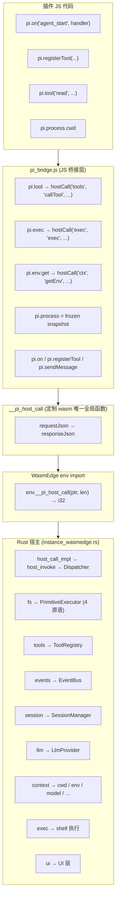
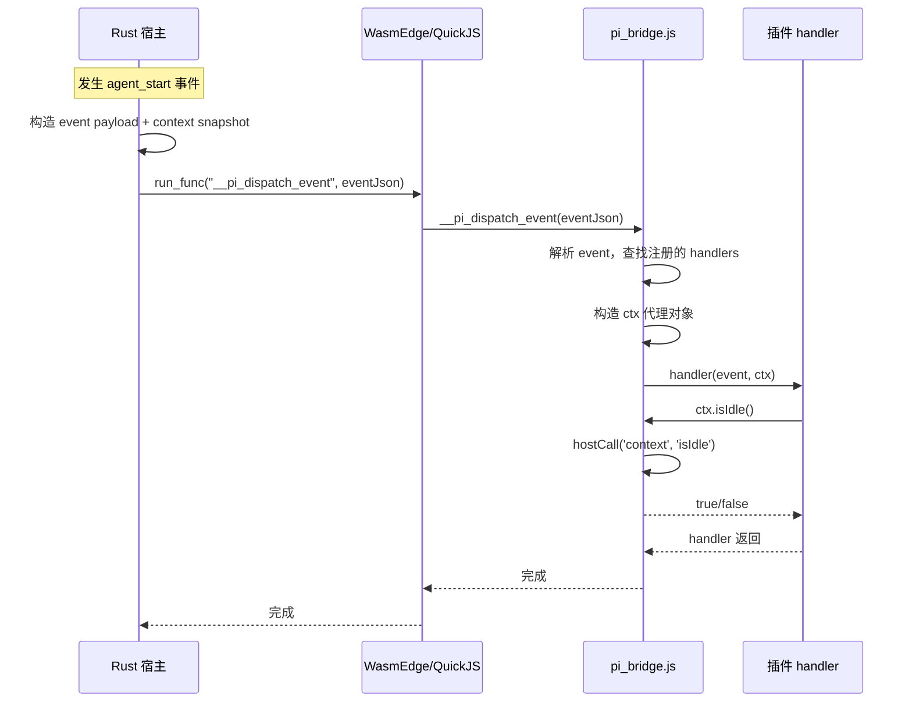
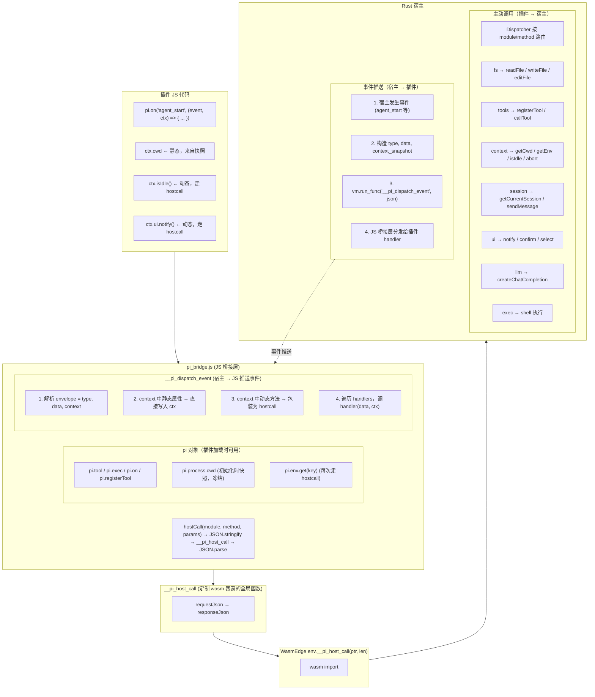

# pi-mono / pi-agent-rust 插件接口标准

> 插件除了 4 原语，还能拿到宿主的很多上下文属性和能力。以下是完整梳理。

---

## 1. 宿主上下文属性（插件可读取）


| 属性     | pi-mono (TS)                               | pi-agent-rust (Rust+QuickJS)      | pi-rust-wasm 当前状态                     |
| ------ | ------------------------------------------ | --------------------------------- | ------------------------------------- |
| 当前工作目录 | `ctx.cwd`                                  | `pi.process.cwd`                  | host-call-protocol 中无对应 module/method |
| 命令行参数  | -                                          | `pi.process.args`                 | 未实现                                   |
| 环境变量   | Node `process.env`                         | `pi.env.get(key)` 受策略过滤           | 未实现                                   |
| 当前模型   | `ctx.model` / `pi.getModel()`              | `pi.getModel()`                   | host-call-protocol 无对应                |
| 会话状态   | `ctx.sessionManager`                       | `pi.session(op, args)`            | protocol 有 session module             |
| UI 能力  | `ctx.ui.*`（select/confirm/notify/editor 等） | `pi.ui(op, args)`                 | 未实现                                   |
| 路径工具   | Node `path`                                | `pi.path.join/basename/normalize` | Node 兼容层提供                            |
| 是否空闲   | `ctx.isIdle()`                             | -                                 | 未实现                                   |
| 系统提示   | `ctx.getSystemPrompt()`                    | -                                 | 未实现                                   |
| 上下文用量  | `ctx.getContextUsage()`                    | -                                 | 未实现                                   |


---

## 2. 完整 API 分类（4 原语 + 其他能力）


| 分类       | 具体方法                                                                 | pi-mono                 | pi-agent-rust          | pi-rust-wasm host-call-protocol |
| -------- | -------------------------------------------------------------------- | ----------------------- | ---------------------- | ------------------------------- |
| 4 原语     | `readFile` / `writeFile` / `editFile` / `executeBash`                | 内置工具                    | `pi.tool("read"        | "write"                         |
| 额外工具     | `grep` / `find` / `ls`                                               | 内置工具                    | `pi.tool("grep"        | "find"                          |
| Shell 执行 | `exec(cmd, args, opts)`                                              | `pi.exec()`             | `pi.exec()` (能力: exec) | 未定义                             |
| HTTP     | `http(request)`                                                      | -                       | `pi.http()` (能力: http) | 未定义                             |
| LLM      | `createChatCompletion` / `stream`                                    | 通过 agent 层              | -                      | llm module 已定义                  |
| 工具注册     | `registerTool` / `unregisterTool` / `getToolList`                    | `pi.registerTool()`     | `pi.registerTool()`    | tools module 已定义                |
| 事件       | `on` / `off` / `emit` / `once`                                       | `pi.on()` / `pi.events` | `pi.events(op, args)`  | events module 已定义               |
| 会话       | `getCurrentSession` / `getMessages` / `sendMessage`                  | `pi.sendMessage()` 等    | `pi.session(op, args)` | session module 已定义              |
| 配置       | `getConfig` / `setConfig`                                            | `pi.getFlag()`          | `pi.getFlag()`         | 未定义                             |
| 日志       | `log` / `info` / `warn` / `error`                                    | -                       | `pi.log(entry)`        | agent module 有 log/debug        |
| UI       | `select` / `confirm` / `input` / `notify` / `setStatus` / `editor` 等 | `ctx.ui.*`              | `pi.ui(op, args)`      | 未定义                             |
| 模型       | `getModel` / `setModel` / `getThinkingLevel` / `setThinkingLevel`    | `pi.setModel()` 等       | `pi.getModel()` 等      | 未定义                             |
| 消息       | `sendMessage` / `sendUserMessage` / `appendEntry`                    | `pi.sendMessage()`      | `pi.sendMessage()`     | session module 部分               |


宿主只暴露一个 `host.call(name, input_json)` 入口——和 pi-rust-wasm 的 `__pi_host_call` 思路一致（单入口多路复用），通过 JSON 里的 `capability` / `method` 路由。

---

## 3. pi-agent-rust 的 hostcall 协议

pi-agent-rust 的 `docs/schema/extension_protocol.json` 定义的 hostcall 请求体：

- `call_id` — 调用 ID
- `capability` — 能力类型（`tool` / `exec` / `http` / `session` / `ui` / `log` / `env`）
- `method` — 方法名
- `params` — 参数
- `timeout_ms` — 超时
- `cancel_token` — 取消令牌
- `context` — 调用上下文

---

## 4. pi-rust-wasm 定制 wasm 模块现状

当前 pi-rust-wasm 的 `host-call-protocol.md` 和 `host-api-layer.md` 已规划了 7 大类 module：


| module                      | 方法                                                    | 状态                             |
| --------------------------- | ----------------------------------------------------- | ------------------------------ |
| `fs` / `primitive`          | `readFile` / `writeFile` / `editFile` / `executeBash` | Dispatcher 已实现                 |
| `llm`                       | `createChatCompletion` / `stream`                     | 已定义                            |
| `tools`                     | `registerTool` / `unregisterTool` / `callTool`        | 已定义                            |
| `events`                    | `on` / `off` / `emit` / `once`                        | 已定义                            |
| `session`                   | `getCurrentSession` / `getMessages` / `sendMessage`   | 已定义                            |
| `agent`                     | `log` / `debug`                                       | 已定义                            |
| 配置 / env / ui / exec / http | `getConfig`, `env.get`, `ui.*`, `exec`, `http`        | 尚未定义，需对齐 pi-mono/pi-agent-rust |


定制 wasm 时，只需暴露一个 `__pi_host_call(requestJson) -> responseJson` 给 JS；JS 层通过这个单入口传不同的 `module` + `method` 即可调用以上所有能力。所以定制 wasm 的方案不需要改——暴露一个 `__pi_host_call` 就够了，后续增加 env/ui/exec/http 等能力只是宿主侧 Dispatcher 路由的事，不需要改 wasm。

---

## 5. pi-agent-rust 参照架构

pi-agent-rust 用的是两层架构：

### 5.1 第 1 层：Rust → QuickJS（注入原生函数）

在 `install_pi_bridge()` 中，Rust 向 QuickJS 全局注入了一批 `__pi_*_native` 函数：

```text
__pi_tool_native(name, input_json) -> call_id
__pi_exec_native(cmd, args, opts) -> call_id
__pi_session_native(op, args) -> call_id
__pi_ui_native(op, args) -> call_id
__pi_events_native(op, args) -> call_id
__pi_log_native(entry) -> call_id
__pi_env_get_native(key) -> string | null
__pi_process_cwd_native() -> string
__pi_process_args_native() -> string[]
...
```

### 5.2 第 2 层：JS 桥接脚本（构建 pi 对象）

然后执行一段 JS 桥接代码（`PI_BRIDGE_JS`），在 JS 里把这些原生函数包装成用户友好的 `pi` 对象：

```javascript
const pi = {
    tool: __pi_make_hostcall(__pi_tool_native),
    exec: (cmd, args, opts) => ...,
    http: (request) => ...,
    session: __pi_make_hostcall(__pi_session_native),
    ui: __pi_make_hostcall(__pi_ui_native),
    events: __pi_make_hostcall(__pi_events_native),
    log: __pi_make_hostcall(__pi_log_native),

    registerTool: __pi_register_tool,
    registerCommand: __pi_register_command,
    on: __pi_register_hook,
    getFlag: ...,
    sendMessage: ...,
    // ...
};
pi.env = { get: __pi_env_get };
pi.process = {
    cwd: __pi_process_cwd_native(),  // 初始化时调一次，之后冻结
    args: __pi_process_args_native(),
};
Object.freeze(pi.process);
globalThis.pi = pi;
```

### 5.3 宿主上下文属性的处理


| 属性类型         | 做法                                          | 例子                                 |
| ------------ | ------------------------------------------- | ---------------------------------- |
| 静态属性（不变）     | 初始化时调一次原生函数，结果写进 `pi` 对象，然后 `Object.freeze` | `pi.process.cwd`、`pi.process.args` |
| 动态属性（每次可能不同） | 每次访问时调原生函数                                  | `pi.env.get(key)`                  |
| 事件上下文（随事件变化） | 宿主分发事件时把 context 传给 handler                 | pi-mono 的 `(event, ctx)`           |


---

## 6. pi-rust-wasm 设计方案

pi-rust-wasm 和 pi-agent-rust 有一个关键区别：

- **pi-agent-rust**：直接在 Rust 中嵌入 QuickJS（rquickjs crate），可以向 QuickJS 注入任意多个原生函数
- **pi-rust-wasm**：Rust → WasmEdge → `wasmedge_quickjs.wasm` → QuickJS，中间隔了一层 wasm，只能通过 wasm import 注入函数

所以有两条路：

### 6.1 方案 A：单入口 `__pi_host_call` + JS 桥接脚本（推荐）

只在 wasm 中暴露一个 `__pi_host_call(requestJson) -> responseJson`，然后用一段 JS 桥接脚本（在用户脚本之前执行）把它包装成完整的 `pi` 对象：

```javascript
// pi_bridge.js — 在用户插件脚本之前执行
function hostCall(module, method, params) {
    var req = JSON.stringify({ module: module, method: method, params: params || {} });
    var res = __pi_host_call(req);
    return JSON.parse(res);
}
var pi = {
    tool: function(name, input) {
        return hostCall('tools', 'callTool', { name: name, input: input });
    },
    exec: function(cmd, args, opts) {
        return hostCall('exec', 'exec', { command: cmd, args: args, options: opts });
    },

    registerTool: function(def) { return hostCall('tools', 'registerTool', def); },
    on: function(event, handler) { /* 本地事件表 + 宿主注册 */ },
    sendMessage: function(msg) { return hostCall('session', 'sendMessage', { message: msg }); },
    getFlag: function(name) { return hostCall('config', 'getFlag', { name: name }); },
    setModel: function(m) { return hostCall('agent', 'setModel', { model: m }); },
    // ... 其他 pi-mono 兼容方法
};
// 宿主上下文属性
pi.env = {
    get: function(key) {
        var r = hostCall('context', 'getEnv', { key: key });
        return r.ok ? r.data.value : undefined;
    }
};
pi.process = {
    cwd: hostCall('context', 'getCwd', {}).data.cwd,
    args: hostCall('context', 'getArgs', {}).data.args || []
};
Object.freeze(pi.process);
globalThis.pi = pi;
```

**执行顺序：**

1. 宿主通过 `run_script_file` 执行脚本前，先在同一 QuickJS 上下文中执行 `pi_bridge.js`
2. 然后再执行用户的插件脚本，插件里就能直接用 `pi.tool()`、`pi.process.cwd` 等

**优点：**

- 定制 wasm 只需暴露一个 `__pi_host_call`，改动最小
- 桥接脚本是纯 JS，可以放在仓库里随时修改，不需要重新编译 wasm
- 新增 API 只改 JS 桥接脚本 + Rust 侧 Dispatcher

**缺点：**

- 所有调用都经过 JSON 序列化/反序列化，有一定开销（但 pi-agent-rust 也是全 JSON 协议）

### 6.2 方案 B：多个原生函数（不推荐）

在定制 wasm 中暴露多个 env import（`__pi_tool_native`、`__pi_env_get_native`、`__pi_process_cwd_native` 等），每个对应一种能力。

**缺点：**

- 每新增一个能力就要改 wasm（重新编译）
- wasm import 表膨胀
- 违背了已有的「单入口多路复用」设计原则

不推荐，因为已经选了单入口 `__pi_host_call` 的架构。

### 6.3 整体架构图

┌──────────────────────────────────────────────────┐
│                   插件 JS 代码                      │
│  export default function(pi) {                    │
│    pi.on('agent_start', (event, ctx) => {...})    │
│    pi.registerTool({...})                         │
│    pi.tool('read', {path: '/tmp/x'})              │
│    console.log(pi.process.cwd)                    │
│  }                                                │
├──────────────────────────────────────────────────┤
│              pi_bridge.js （JS 桥接层）              │
│  globalThis.pi = {                                │
│    tool: (n,i) => hostCall('tools','callTool',…) │
│    exec: (c,a,o) => hostCall('exec','exec',…)    │
│    env: { get: (k) => hostCall('ctx','getEnv',…)}│
│    process: { cwd: '...', args: [...] }           │
│    on / registerTool / sendMessage / ...          │
│  }                                                │
├──────────────────────────────────────────────────┤
│    __pi_host_call(requestJson) -> responseJson     │
│    （定制 wasm 暴露的唯一全局函数）                      │
├──────────────────────────────────────────────────┤
│              WasmEdge env import                   │
│    env.__pi_host_call(ptr, len) -> i32            │
├──────────────────────────────────────────────────┤
│              Rust 宿主 (instance_wasmedge.rs)       │
│    host_call_impl → host_invoke → Dispatcher      │
│    按 module/method 路由：                           │
│      fs → PrimitiveExecutor (4原语)                │
│      tools → ToolRegistry                         │
│      events → EventBus                            │
│      session → SessionManager                     │
│      llm → LlmProvider                            │
│      context → cwd/env/model/...                  │
│      exec → shell 执行                             │
│      ui → UI 层                                    │
└──────────────────────────────────────────────────┘




---

## 7. 宿主上下文属性具体解法

在方案 A 下：

### 7.1 Dispatcher 新增 `context` module

支持以下 method：


| method            | 说明              |
| ----------------- | --------------- |
| `getCwd`          | 返回当前工作目录        |
| `getArgs`         | 返回命令行参数         |
| `getEnv`          | 返回指定环境变量（受策略过滤） |
| `getModel`        | 返回当前模型信息        |
| `getContextUsage` | 返回上下文用量         |
| `getSystemPrompt` | 返回系统提示          |


### 7.2 `pi_bridge.js` 中的处理

- **静态属性**（`cwd`、`args`）：在桥接脚本执行时调一次 `hostCall('context', 'getCwd')`，写入 `pi.process` 并冻结
- **动态属性**（`env`、`model`）：每次访问时调 `hostCall`
- **事件上下文**（pi-mono 的 `ctx` 参数）：
  - 宿主通过 `__pi_host_call` 分发事件时，可以把当前 context 作为事件 payload 的一部分传给 JS
  - 或者 handler 内部按需调 `hostCall('context', 'getCwd')` 等获取最新状态

---

## 8. 性能与实现细节

### 8.1 单入口 + JS 桥接的性能

**结论：损耗很小，不影响体验。**

每次 `pi.tool("read", {...})` 调用链路是：

```text
JS 对象构造 → JSON.stringify (几μs)
→ __pi_host_call (wasm import，几十ns)
→ Rust host_call_impl 读内存 (几μs)
→ Dispatcher 路由 + 实际执行 (ms 级，如文件 IO / LLM)
→ 响应写回内存 (几μs)
→ JSON.parse (几μs)
```

JSON 序列化/反序列化大约 10–50 微秒（取决于 payload 大小），而实际操作（读文件、写文件、调 LLM）都是毫秒到秒级。JSON 开销占比 < 1%，完全可忽略。

pi-agent-rust 也是全程 JSON 协议，在生产环境跑得很好，没有因为 JSON 产生性能问题。QuickJS 对 JSON 解析还有原生优化。

> 唯一需要注意的是：不要在热循环里高频调 hostcall（如一秒几千次），但插件正常使用场景不会这样。

### 8.2 JS 桥接脚本的放置方式

有两种放法：

#### 放法 A：嵌入定制 wasm（编译进去）

像 pi-agent-rust 那样，把桥接 JS 作为字符串常量写在 Rust 源码里，编译进 wasm。改桥接脚本 = 改 Rust 源码 = 重新编译 wasm。

#### 放法 B：作为独立 JS 文件，在用户脚本前预加载（推荐）

桥接脚本作为一个独立的 `.js` 文件放在 pi-rust-wasm 仓库里（如 `assets/js/pi_bridge.js`），不编译进 wasm。执行流程变为：

1. `run_script_file(plugin.js)` 时，宿主先读取 `pi_bridge.js` 的内容
2. 把 `pi_bridge.js` + 用户脚本拼成一个文件（或先执行桥接再执行用户脚本）
3. 交给 `wasmedge_quickjs.wasm` 执行

这样改桥接脚本不需要重新编译 wasm，只改 JS 文件即可。定制 wasm 只负责暴露 `__pi_host_call`（稳定的底层契约），桥接层的 API 变化在 JS 层处理。

> 前提：`run_script_file_impl` 需要支持「在执行用户脚本前先执行一段 prelude JS」。这可以通过把两段代码拼接后一起喂给 QuickJS 来实现，或者 QuickJS 的 argv 支持多文件执行。

---

## 9. 事件上下文传递机制

### 9.1 pi-mono 的做法（回顾）

pi-mono 里 handler 签名是 `(event, ctx) => {}`，`ctx` 是宿主在触发事件时动态构造的，包含当时的 `cwd`、`model`、`sessionManager` 等。

```text
宿主发生事件（如 agent_start）
  → ExtensionRunner.emit('agent_start')
    → createContext()     // 构造当前时刻的 ctx
    → handler(event, ctx) // ctx 作为第二参数传给 JS handler
```

`ctx` 是一个活的对象，handler 可以调 `ctx.isIdle()`、`ctx.abort()` 等方法。

### 9.2 pi-rust-wasm 中的做法

宿主要触发插件事件时，不是 JS 侧主动调 hostcall，而是**宿主主动向 JS 推送**。

### 9.3 事件分发序列图




### 9.4 桥接层事件机制实现

桥接层（`pi_bridge.js`）里的事件机制：

```javascript
var __pi_hooks = {};

pi.on = function(eventName, handler) {
    if (!__pi_hooks[eventName]) __pi_hooks[eventName] = [];
    __pi_hooks[eventName].push(handler);
};

// 宿主调用此函数来分发事件
// eventJson 包含 { type, data, context }
globalThis.__pi_dispatch_event = function(eventJson) {
    var envelope = JSON.parse(eventJson);
    var eventType = envelope.type;
    var eventData = envelope.data;
    var contextSnapshot = envelope.context;
    // contextSnapshot = { cwd: "/...", model: "...", isIdle: true, ... }

    var handlers = __pi_hooks[eventType];
    if (!handlers || handlers.length === 0) return;

    // 构造 ctx 代理对象：静态属性直接用 snapshot，动态方法通过 hostcall 实时查询
    var ctx = {
        cwd: contextSnapshot.cwd,
        model: contextSnapshot.model,
        hasUI: contextSnapshot.hasUI,
        isIdle: function() {
            return hostCall('context', 'isIdle', {}).data.idle;
        },
        abort: function() {
            return hostCall('context', 'abort', {});
        },
        getContextUsage: function() {
            return hostCall('context', 'getContextUsage', {}).data;
        },
        getSystemPrompt: function() {
            return hostCall('context', 'getSystemPrompt', {}).data.prompt;
        },
        ui: {
            notify: function(msg) { return hostCall('ui', 'notify', { message: msg }); },
            confirm: function(msg) { return hostCall('ui', 'confirm', { message: msg }); },
            // ...
        }
    };

    for (var i = 0; i < handlers.length; i++) {
        handlers[i](eventData, ctx);
    }
};
```

### 9.5 Rust 宿主侧触发事件

```rust
// 当 agent_start 发生时
let context_snapshot = json!({
    "cwd": current_cwd,
    "model": current_model_name,
    "hasUI": has_ui,
    "isIdle": is_idle,
});
let event_envelope = json!({
    "type": "agent_start",
    "data": { /* event specific data */ },
    "context": context_snapshot,
});
// 调用 JS 侧的 __pi_dispatch_event
vm.run_func("__pi_dispatch_event",
    &[WasmValue::from(event_envelope.to_string())]);
```

### 9.6 完整架构图

┌──────────────────────────────────────────────────────────┐
│                     插件 JS 代码                           │
│                                                          │
│  export default function(pi) {                           │
│    pi.on('agent_start', (event, ctx) => {                │
│      console.log('cwd:', ctx.cwd);        ← 静态，来自快照  │
│      if (!ctx.isIdle()) ctx.abort();      ← 动态，走hostcall│
│      ctx.ui.notify('started!');           ← 动态，走hostcall│
│    });                                                   │
│    pi.registerTool({...});                               │
│  }                                                       │
├──────────────────────────────────────────────────────────┤
│                  pi_bridge.js （JS 桥接层）                 │
│                                                          │
│  ┌─ pi 对象（插件加载时可用）──────────────────────┐         │
│  │ pi.tool / pi.exec / pi.on / pi.registerTool │         │
│  │ pi.process.cwd (初始化时快照，冻结)             │         │
│  │ pi.env.get(key) (每次走 hostcall)             │         │
│  └──────────────────────────────────────────────┘         │
│                                                          │
│  ┌─ __pi_dispatch_event（宿主 → JS 推送事件）──┐            │
│  │ 1. 解析 envelope = { type, data, context }  │            │
│  │ 2. context 中静态属性 → 直接写入 ctx 对象     │            │
│  │ 3. context 中动态方法 → 包装为 hostcall 调用  │            │
│  │ 4. 遍历注册的 handlers，调 handler(data, ctx)│            │
│  └──────────────────────────────────────────────┘         │
│                                                          │
│  hostCall(module, method, params)                         │
│    → JSON.stringify → __pi_host_call → JSON.parse         │
├──────────────────────────────────────────────────────────┤
│    __pi_host_call(requestJson) -> responseJson             │
│    （定制 wasm 暴露的全局函数）                                │
├──────────────────────────────────────────────────────────┤
│              WasmEdge env.__pi_host_call(ptr, len)         │
├──────────────────────────────────────────────────────────┤
│                    Rust 宿主                               │
│                                                          │
│  ┌─ 主动调用（插件 → 宿主）────────────────────┐             │
│  │ Dispatcher 按 module/method 路由：          │             │
│  │   fs      → readFile/writeFile/editFile/…  │             │
│  │   tools   → registerTool/callTool          │             │
│  │   context → getCwd/getEnv/isIdle/abort     │             │
│  │   session → getCurrentSession/sendMessage  │             │
│  │   ui      → notify/confirm/select          │             │
│  │   llm     → createChatCompletion           │             │
│  │   exec    → shell 执行                      │             │
│  └────────────────────────────────────────────┘             │
│                                                          │
│  ┌─ 事件推送（宿主 → 插件）────────────────────┐             │
│  │ 1. 宿主发生事件（agent_start 等）           │             │
│  │ 2. 构造 { type, data, context_snapshot }   │             │
│  │ 3. vm.run_func("__pi_dispatch_event", json)│             │
│  │ 4. JS 桥接层分发给插件的 handler            │             │
│  └────────────────────────────────────────────┘             │
└──────────────────────────────────────────────────────────┘





---

## 10. 关键点总结


| 通信方向              | 机制                           | 上下文属性处理                                                                  |
| ----------------- | ---------------------------- | ------------------------------------------------------------------------ |
| 插件 → 宿主（主动调用）     | JS 调 `__pi_host_call`        | 不涉及 `ctx`                                                                |
| 宿主 → 插件（事件推送）     | Rust 调 `__pi_dispatch_event` | 静态属性（`cwd` / `model`）放 snapshot 传过去；动态方法（`isIdle` / `abort`）包装成 hostcall |
| handler 内访问 `ctx` | 静态属性直接读；动态方法走 hostcall       | 混合策略，避免每个属性都 hostcall                                                    |


这样设计的好处是：事件分发时不需要每个上下文属性都做一次 hostcall——把当时的快照一次性传过去，只有真正需要「当前最新状态」或「执行操作」的方法才走 hostcall。