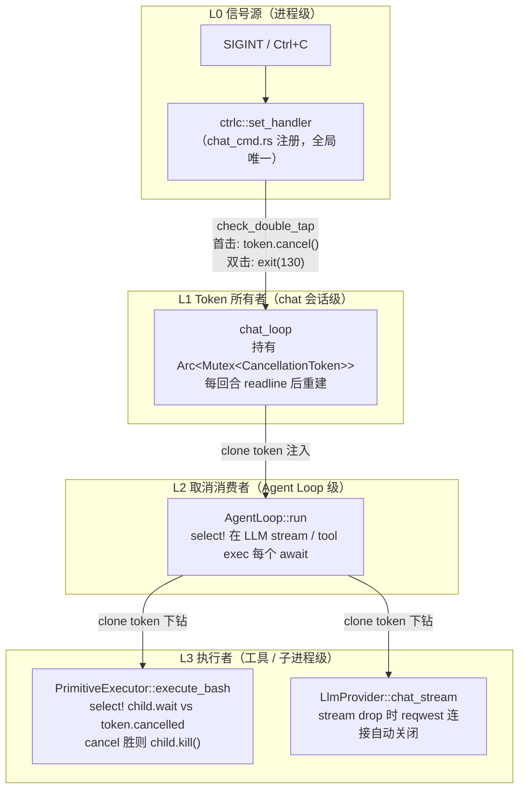
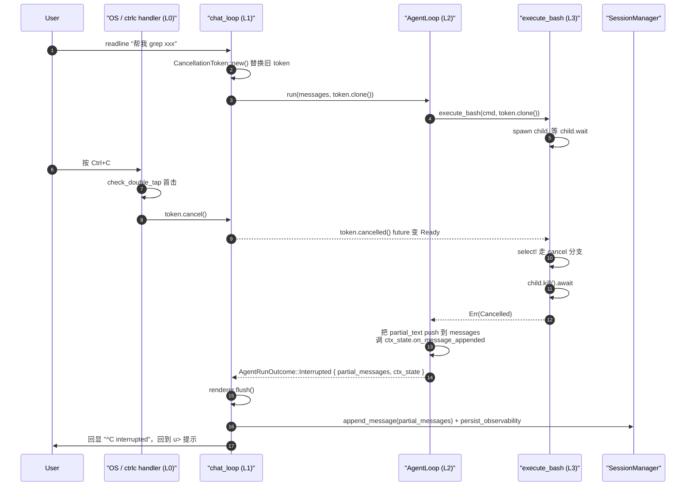

# Interrupt & Cancellation 传播设计

> 本文为 [agent-loop.md](./agent-loop.md) §13.2「Abort」语义与 §13.3.2 控制流伪代码的**补充设计**，聚焦"Ctrl+C 按下之后，信号如何一路穿过 CLI → chat_loop → AgentLoop → PrimitiveExecutor，并在任意 `await` 点把正在飞的 future 真正停下来"。落地看板单见 [T2-P0-007](../../../agents/TASK_BOARD_002.md)。
>
> 与 `agent-loop.md` 出现冲突时，**以 `agent-loop.md` 为准**；本文补充"如何实现"的机制，`agent-loop.md` 定义"是什么行为"。

---

## 1. 目标与非目标

### 1.1 目标（Goals）

| 目标 | 观察指标（落地后用户可感知） |
|------|---|
| G1 | 任何时刻按 Ctrl+C，**2 秒内** 当前 `execute_bash` 子进程死亡、LLM 流式连接被 drop |
| G2 | 中断时已生成的 assistant 文本片段、已完成的 tool_result **不丢**，与 `Completed` 走同一条持久化路径（transcript JSONL + `ContextState` 观测量） |
| G3 | 2 秒内**连按两次** Ctrl+C 退出整个 `pi chat`（exit code 130），区别于"软中断当前回合" |
| G4 | 中断后 `u>` 提示符立即回到用户面前，用户下一条输入能在含 partial 的上下文上继续对话 |
| G5 | 同一 session 中断后重启 `pi chat --resume <id>`，transcript 末尾的 partial assistant 可见——T-007 最小版满足 |

### 1.2 非目标（Non-Goals）

| 非目标 | 推给 |
|---|---|
| 跨 session 的断点续跑 / `session resume` 子命令 / Checkpoint 快照 | T2-P1-001 |
| Stream 心跳 / `tokio::time::timeout`（正常超时语义，非用户手动中断） | T2-P0-003 |
| 中断期间的"摘要中断原因"元数据 | 本次**仅**给 `AgentEnd.error="interrupted"` 标签，不再多塞字段 |
| 插件 Hook 的取消传播（WasmEdge VM 回调路径） | 后续接入 T2-P0-009 pipeline 重构时统一处理 |
| Windows 平台 Ctrl+Break 区分 | 暂不支持，沿用 `ctrlc` crate 默认行为 |
| 清理 `ext/dispatcher/session_ops.rs` 等既有 `abort_signal` / `cancelled` 引用 | 保留 `AtomicBool` 作为 poll 兼容出口 |

---

## 2. 术语统一

本文通篇使用下列术语，避免与 `Abort` / `Cancel` 混淆：

| 术语 | 定义 | 触发源 |
|---|---|---|
| **Interrupt**（中断） | 用户层意图，"我现在不想继续这回合" | 单次 Ctrl+C、TUI Esc 等 |
| **Cancel**（取消） | 机制层动作，`CancellationToken::cancel()` 调用一次 | `ctrlc` handler / TUI 控制器 |
| **Abort**（中止） | Agent Loop 层状态，`run_reasoning_loop` 因取消提前返回 `LoopError::Aborted` | 内部状态 |
| **Soft Interrupt**（软中断） | 首击 Ctrl+C 的效果：打断当前回合，保留 session，回到 prompt | 本设计默认行为 |
| **Hard Interrupt**（硬中断） | 2 秒内第二击 Ctrl+C：`std::process::exit(130)`，类 POSIX 约定 | 双击升级 |

事件侧对外仍发布 `AgentEnd { error: Some("interrupted") }`（向后兼容），**不**替换旧事件。新增 `AgentEvent::Interrupted { session_id, partial_text_len, tool_results_count }` 供需要区分"失败 vs 中断"的订阅者使用。

---

## 3. 背景与问题锚点

现有实现（[`src/core/agent_loop/run.rs`](../../../src/core/agent_loop/run.rs) / [`src/api/chat/mod.rs`](../../../src/api/chat/mod.rs)）的三个缺陷：

1. **无法打断工具 await**：`self.execute_tool(tc).await`（`run.rs:665`）是单次 await，不检 `abort_signal`；`ctrlc::set_handler` 只置 `AtomicBool`，`tokio` 不能 `await` 一个 `AtomicBool`。用户按 Ctrl+C 后必须等当前 `bash sleep 30` 自己结束。
2. **Aborted 丢数据**：`run_reasoning_loop` 返回 `LoopError::Aborted`（`run.rs:378 / 436 / 647`）→ `run()` 翻成 `AppError::Config("用户中断")`（`run.rs:203`）→ `chat_loop` 按错误分支 `continue`，`result.new_messages` 整块丢；`content_buf` 的 partial assistant + 已完成的 tool_result 全部蒸发（T-004 / T-017）。
3. **无 UX 层级**：一次 Ctrl+C 究竟是"停一下当前回合"还是"退出整个 chat"？目前没区分，用户只能靠 Ctrl+D / `:q` 退出。

---

## 4. 技术原理

本节回答三个"为什么"：**为什么要引入 `CancellationToken`、为什么用 `tokio::select!`、为什么必须每回合重建 token**。这是后续实现选型与接口契约的依据。

### 4.1 `AtomicBool` 为什么不够用

当前代码的取消机制：

```rust
let cancelled: Arc<AtomicBool> = Arc::new(AtomicBool::new(false));
loop {
    if cancelled.load(Ordering::SeqCst) { break; }   // 主动轮询
    let res = primitive.execute_bash("sleep 30").await; // 这里卡 30s
}
```

关键限制：`AtomicBool` **不能 `.await`**。只能主动 `.load()` 去问"现在取消了吗？"。一旦进入 `bash.await`，就得等它自己返回。

```
时间 →

任务状态：    [loop头]   [bash.await ─────────────────────┐ check]
                │                                         ↑
                │                                       30秒后才检查
                │
用户：                    Ctrl+C（此刻按）
                           │
cancelled:   false ───────→true ───────────────────────── true
                           ↑ 标志位已置 true          ↑ 但程序没机会看
```

后果：

- **感知延迟** = 当前 await 的剩余时间。
- **资源浪费**：bash 子进程还在跑，Rust 代码即使 break，`sleep 30` 仍在消耗系统资源。

要解决，取消信号必须是**能 await 的东西**，然后把"干正事的 future"和"等取消的 future"**放在一起竞赛**——这就是 `tokio::select!`。

### 4.2 `tokio::select!` 的赛跑语义

心智模型：`tokio::select!` = 同时 poll 多个 future，**任一个就绪**就返回它的结果，**其它被 drop**。

```rust
tokio::select! {
    result = long_work()     => { /* 干活赢了 */ }
    _      = cancel_signal() => { /* 取消赢了 */ }
}
```

底层两件事：

1. 用同一个 `Waker` 喂给所有参赛 future，任一个 `Poll::Ready` 就终止比赛。
2. 输掉的 future 被**直接 drop** —— 在 Rust 异步里，drop 一个 future ≡ "再也不会被 poll" ≡ "取消"。

```
                    ┌──────────────────────────────────┐
        注册 Waker  │        tokio::select!            │
    ┌──────────────▶│   同时持有两个 future 的所有权    │
    │               └──────────────────────────────────┘
    │                            │
    │                            ▼ poll 每个 future
    │          ┌───────────┐                 ┌─────────────┐
    │          │ long_work │                 │ cancelled() │
    │          │  Pending  │                 │   Pending   │
    │          └───┬───────┘                 └───────┬─────┘
    │    网络数据→ │                                 │ ←Ctrl+C
    │    Ready(x)  │                                 │  Ready()
    │              └───────┐                 ┌───────┘
    │                      ▼                 ▼
    │              谁先 Ready？──────────────────────┐
    │                                               │
    │              ┌───────────┬──────────────────┐ │
    │              │ long_work │    cancelled     │ │
    │              │  先完成   │    先完成        │ │
    │              └─────┬─────┴─────────┬────────┘ │
    │                    ▼               ▼          │
    │         返回 Ok(x)          drop(long_work)   │
    │         drop(cancelled)     返回 ()           │
    │                                               │
    │         drop 的那一刻 ≡ long_work 任务"死亡"   │
    │         它内部的 Child、TcpStream、缓冲区全被析构
    └───────────────────────────────────────────────┘
```

**drop = 取消** 的原理：

- Rust `async fn` 在 `await` 点让出；让出时整个调用栈被"折叠"成堆上的状态机。
- drop 状态机 ⇒ 永久停止 poll + 运行内部 `Drop`（例如 `reqwest::Response` 的 `Drop` 关 TCP 连接）。

这解释了本设计里 **"LLM stream 靠 drop 自然断连"**：select 的另一臂赢了 → stream future 被 drop → reqwest 连接关闭，不需要显式 abort。

但 `tokio::process::Child` 的 `Drop` 行为在不同配置下不一致（有时残留 zombie），所以我们**显式** `child.kill().await`，不依赖 drop。

### 4.3 `execute_bash` 的两层 select 落地

```
  agent_loop 层                    primitive 层                   OS
  ─────────────                    ───────────                    ──
                  cancel: token
  select! {        ──────────────▶
    res = execute_bash(token) ────▶  select! {
    _ = token.cancelled()             child.wait() ─────────────▶ sleep 30
  }                                   token.cancelled() ◀───────  (子进程在跑)
                                    }
                                    ↑
                Ctrl+C 时：        └─── 取消胜出
                                    child.kill().await ──────────▶ SIGKILL
                                                                   子进程死亡
                                    返回 Err(Cancelled) ───┐
  select 顶层也命中 cancelled ◀───────────────────────────┘
  drop 掉 execute_bash 分支
  保存 partial，返回 Interrupted
```

两层 select 的分工：

- **里层**（`execute_bash` 内）：负责"真正杀子进程并毫秒级返回"。
- **外层**（`agent_loop` 内）：兜底——"即使工具层没立刻停，我也不等你"。

### 4.4 `CancellationToken` = `AtomicBool + Notify` 的工程化封装

`tokio::select!` 需要一个**可 await 的取消源**。候选方案：

| 方案 | 优点 | 缺点 |
|---|---|---|
| `AtomicBool` + 轮询 | 零新依赖 | 不能 `.await`；取消要等当前 await 自己返回 |
| `tokio::sync::Notify` | 能 await | 一次性，每次重建；多消费者有陷阱 |
| `tokio_util::sync::CancellationToken` | 广播 / 可 clone / 可分叉 / 幂等 | 引入 `tokio-util` 依赖（项目已通过 tokio 间接持有） |

本设计选 `CancellationToken`。它内部就是 `AtomicBool + Notify` 的封装，额外帮你处理：

- **广播**：多处 clone，任一处 `cancel()` 全部可见。
- **可重复 await**：已 cancelled 时 `cancelled()` 立即 `Ready`；未 cancelled 时挂起等待。
- **父子关系**：`child_token()` 生出的子 token，父取消 ⇒ 子也取消；子取消不影响父（本次不用，预留给多 Agent 编排）。

```
                       ┌───────────────────────────┐
                       │  CancellationToken (root) │
                       │  inner: Arc<TreeNode>     │
                       │    is_cancelled: bool     │
                       │    notify: Notify         │
                       │    children: Vec<..>      │
                       └─────────────┬─────────────┘
                                     │ clone / child_token()
            ┌────────────────────────┼────────────────────────┐
            ▼                        ▼                        ▼
    ┌───────────────┐       ┌────────────────┐      ┌────────────────┐
    │ token clone 1 │       │ token clone 2  │      │ child token    │
    │ ctrlc handler │       │ bash 工具      │      │ stream select  │
    │ .cancel()     │       │ .cancelled()   │      │ .cancelled()   │
    └───────┬───────┘       └───────┬────────┘      └───────┬────────┘
            │                       │                       │
   Ctrl+C → │ cancel()              │                       │
            └───────────┬───────────┘                       │
                        ▼                                   ▼
            Notify::notify_waiters() ──广播──▶ 所有 cancelled() Future
                                                全部 Ready
                                                所有 select! 臂触发
                                                所有 await 解除
```

### 4.5 一次 chat 回合中的 token 生命周期

```
chat_loop 主循环
────────────────────────────────────────────────────────────────────
 回合 1 开始
   ├─ token1 = CancellationToken::new()              ①新生，未 cancel
   ├─ agent_loop.run(messages, token1.clone())       ②clone 给 agent
   │    │
   │    ├─ llm.chat_stream(req)     ←─┐
   │    │    select! token1.cancelled()   ③多处同时 await 同一 token
   │    ├─ execute_bash(token1.clone()) ←─┘
   │    │
   │    └─── ...（用户按 Ctrl+C）
   │             │
   │             ctrlc handler 调 token1.cancel()   ④一次 cancel
   │             │
   │         ┌───┴─── 广播到所有克隆 ───┐
   │         ▼                          ▼
   │    stream 的 select 命中       bash 的 select 命中
   │    drop(stream) → TCP FIN      child.kill() → 进程死
   │         │                          │
   │         └──────→ 返回 Interrupted ◀┘
   │
   ├─ 持久化 partial 消息
   └─ 回到 readline prompt
 回合 2 开始
   └─ token2 = CancellationToken::new()             ⑤必须新建，不能复用
      （token1 已被 cancel，其 cancelled() 会立刻 Ready）
```

**关键约束**：每个回合必须 `CancellationToken::new()` 一个新 token —— `CancellationToken` 一旦 `cancel()` 就永久 cancelled，像烧过的保险丝。这就是 §5.1 重建规则的根本原因。

### 4.6 总图：Ctrl+C 全链路

```
┌─────────────────────────────────────────────────────────────────────┐
│                          Ctrl+C 全链路                              │
└─────────────────────────────────────────────────────────────────────┘

 键盘 SIGINT                ctrlc::set_handler
    │                              │
    │                              ▼
    │                      check_double_tap   ←── 双击检测
    │                              │
    │              ┌───────────────┼─────────────────┐
    │              │               │                 │
    │              ▼               ▼                 ▼
    │       双击: exit(130)   单击: token.cancel()
    │                              │
    │              ┌───────────────┼─────────────────┐
    │              │               │                 │
    │       Notify 广播       Notify 广播       Notify 广播
    │              ▼               ▼                 ▼
    │     ┌────────────────┬────────────────┬────────────────┐
    │     │  agent_loop    │   execute_bash │  LLM stream    │
    │     │  select! 外层  │   select! 内层 │  select! 中层  │
    │     └───────┬────────┴────────┬───────┴────────┬───────┘
    │             │                 │                │
    │        drop future        child.kill()     drop stream
    │             │                 │                │
    │             │             子进程退出        TCP 连接关
    │             ▼                 │                │
    │    返回 Interrupted ◀─────────┴────────────────┘
    │    (partial_text, partial_messages)
    │             │
    │             ▼
    │    chat_loop 把 partial 走 Completed 的落盘路径
    │             │
    │             ▼
    │    prompt 回到 u>  继续对话
```

一句话：**把原本只能轮询的"停一下"信号，变成能在任意 await 点立即生效的"广播中断"，并让被中断的资源（子进程、连接）在 drop 语义下自我清理。**

---

## 5. 三层职责分层



### 5.1 各层契约

| 层 | 模块 / 文件 | 只做这件事 |
|---|---|---|
| L0 | `src/api/cli/chat_cmd.rs` | 捕获 SIGINT，判双击，调 `token.cancel()` 或 `exit(130)`。**不**直接动 AgentLoop。 |
| L1 | `src/api/chat/mod.rs` | 持有当前回合的 `CancellationToken`，每回合 `readline` 读到非空输入后 `CancellationToken::new()` 替换旧的；把 clone 过的 token 递给 `AgentLoop::run`。 |
| L2 | `src/core/agent_loop/run.rs` | 在 LLM stream 消费、工具执行这两个 `await` 点用 `tokio::select!` 同时等 `token.cancelled()`；取消胜出时累积 partial → 返回 `LoopError::Aborted { partial_text, partial_messages }`。 |
| L3 | `src/core/primitives/*` | `execute_bash(cmd, cancel: CancellationToken)`：`select! { _ = child.wait() => ..., _ = cancel.cancelled() => { child.kill().await; return Err(Cancelled) } }`。 |

### 5.2 其他 primitive 不接 token

`read_file` / `write_file` / `edit_file` / `list_dir` 暂不接 token —— 它们是毫秒级本地 I/O，接取消机制收益与工程成本不匹配。外层 select 仍能在 agent_loop 层截停这些调用（按 §4.2 drop 语义，调用方分支被 drop 后内部 I/O 也会被 `File` 的 Drop 清理）。

---

## 6. 数据流时序

### 6.1 Soft Interrupt（单击）



### 6.2 Hard Interrupt（双击）

时序在第 4 步插入"2 秒内再次 Ctrl+C"，`check_double_tap` 返回 `HardExit`，`ctrlc handler` 直接 `std::process::exit(130)`。此时 OS 清理 child 进程（bash 子进程会收到 SIGHUP 或继承退出），transcript 的完整性**完全依赖首击已经把 partial append 并 flush 到磁盘**——也就是 `SessionManager` 的 append-only JSONL 在首击后的 `append_message` 调用结束前必须走到 `fsync`，才保证双击场景下 transcript 不丢尾。

---

## 7. `CancellationToken` 生命周期

### 7.1 创建与重建规则

| 时机 | 动作 | 理由 |
|---|---|---|
| `chat_loop` 初始化 | `let token = Arc::new(Mutex::new(CancellationToken::new()))` | 给 ctrlc handler 一个可读的起点 |
| 每次 `readline()` 返回**非空** user 输入后 | 锁住 → `*token = CancellationToken::new()` | 避免"idle 在 u> 时 Ctrl+C 污染下一回合" |
| `agent_loop.run` 调用前 | `let child = token.lock().clone()` 传入 | AgentLoop 内部不持有 Mutex，只用 clone 的 token |
| `agent_loop.run` 返回后（含 Interrupted） | 不做任何操作 | 旧 token 自然在下次 readline 后被覆盖 |

**关键约束**：`CancellationToken` 一旦 cancel 就不可逆，必须重建；而之所以"只在读到新输入后才重建"——如果用户 Ctrl+C 正好落在 `readline` 返回新输入**但 token 还没换**的那一微秒窗口（见 §10 表格第 3 条），agent_loop 一启动就立刻命中 cancel，整轮请求白费。改成"`readline` 读到非空 → 重建 → 再进 `run`"后，旧 token 被 cancel 只会污染"没人用的时间片"。

### 7.2 父子 token（预留，不本次实现）

`CancellationToken::child_token()` 能派生"父取消则子取消"的子 token，未来多 Agent 编排（`dispatch_agent` 工具）时派生子 AgentLoop 的 token，可一键级联取消。本次**不**建立父子关系 —— `AgentLoop::run` 接收的就是顶层 token 的 clone，不派生。

---

## 8. 关键契约

### 8.1 `AgentRunOutcome`（新增，`src/core/agent_loop/types.rs`）

```rust
pub enum AgentRunOutcome {
    Completed(AgentRunResult),
    Interrupted(AgentRunResult),
    Failed(AppError),
}

pub struct AgentRunResult {
    pub new_messages: Vec<ChatMessage>,
    pub context_state: ContextState,
    pub usage_summary: Option<UsageSummary>,
}
```

- `Completed` / `Interrupted` 共用 `AgentRunResult`，保证 `chat_loop` 两分支走**同一持久化路径**（`append_message` + `persist_context_observability`）。
- `Failed` 仅留给 `AppError` 级致命错误（I/O、协议违规等），**不**包括"用户中断"——后者是 `Interrupted`。

### 8.2 `LoopError::Aborted`（重塑）

```rust
pub enum LoopError {
    Retryable(AppError),
    Fatal(AppError),
    Aborted {
        partial_text: String,
        partial_messages: Vec<ChatMessage>,
    },
}
```

`partial_messages` **包含**刚刚生成到一半的 assistant 消息（由 `content_buf` 拼装）以及中断前已完成的 tool_result，顺序与发给 LLM 时一致。

### 8.3 `PrimitiveExecutor::execute_bash`（签名变更）

```rust
pub trait PrimitiveExecutor {
    async fn execute_bash(
        &self,
        cmd: &str,
        cancel: CancellationToken,
    ) -> Result<BashResult, PrimitiveError>;
    // ... 其他方法不变
}
```

**直接改 trait 签名**而非加 `_with_cancel` 方法——强制所有实现方（当前 `DefaultPrimitiveExecutor` + 测试 mock 共 3 处）更新，避免"有的实现支持取消、有的不支持"的半吊子状态。编译期报错比运行时沉默更安全。

实现内部：

```rust
let mut child = tokio::process::Command::new(...).spawn()?;
tokio::select! {
    result = child.wait_with_output() => result.map(BashResult::from),
    _ = cancel.cancelled() => {
        let _ = child.start_kill();
        let _ = child.wait().await; // 等 kill 完成再返回，避免 zombie
        Err(PrimitiveError::Cancelled)
    }
}
```

### 8.4 `AgentEvent::Interrupted`（新增，`src/infra/events.rs`）

```rust
pub enum AgentEvent {
    // 既有 variants...
    Interrupted {
        session_id: String,
        partial_text_len: usize,
        tool_results_count: usize,
    },
}
```

对应 wire 常量 `WIRE_AGENT_INTERRUPTED = "agent.interrupted"`（新增在 `src/infra/wire.rs`）。

**兼容性**：现有 `AgentEvent::AgentEnd { error: Some("interrupted") }` **保留**，所有订阅旧事件的 UI 代码照常工作。新 `Interrupted` 事件是**附加**而非替代。

---

## 9. 关键改动（按文件）

本节列出实现层面必须落点的模块级改动，作为规格层验收的映射表。具体提交拆分与子任务节奏由 [agents/plan/*](../../../agents/plan/) 下的计划文档管理。

### 9.0 文件职责总览（One-Glance Map）

下图把本次改动涉及的 **6 个业务文件 + 3 份独立单测文件** 按调用层次串起来：从 OS SIGINT 信号进入进程，一路穿透到 LLM stream / 工具执行的取消点，再把 partial 数据沿反向路径写回 transcript。箭头方向即"谁调用谁 / 数据向谁流动"。

```text
 ┌──────────────────────────────────────────────────────────────────────────┐
 │                    L0  OS 进程层：SIGINT (Ctrl+C)                         │
 └──────────────────────────────────────────────────────────────────────────┘
                                    │
                                    ▼
 ┌──────────────────────────────────────────────────────────────────────────┐
 │  src/api/cli/chat_cmd.rs                          ── CLI 入口 + 信号桥接 │
 │  ────────────────────────────────────────────────────────────────────    │
 │  • fn check_double_tap(last, now, window) -> DoubleTap   (纯函数)        │
 │  • const DOUBLE_TAP_WINDOW = 2s                                          │
 │  • ctrlc::set_handler 首击 Soft → cancel_token.cancel()                  │
 │                      2s 内再击 Hard → std::process::exit(130)            │
 │                                                                          │
 │  [chat_cmd/tests.rs]  ← 4 个单测：首击/窗内/窗外/边界                     │
 └──────────────────────────────────────────────────────────────────────────┘
                                    │
            持有 Arc<Mutex<CancellationToken>> （L0 ↔ L1 桥）
                                    │
                                    ▼
 ┌──────────────────────────────────────────────────────────────────────────┐
 │  src/api/chat/mod.rs                          ── chat 会话调度 + 持久化 │
 │  ────────────────────────────────────────────────────────────────────    │
 │  • struct ChatContext {                                                  │
 │        cancel_token: Arc<Mutex<CancellationToken>>,   ← 让 handler 改写 │
 │        last_interrupt_at: Arc<Mutex<Option<Instant>>>,                   │
 │        ...                                                               │
 │    }                                                                     │
 │                                                                          │
 │  • fn chat_loop():                                                       │
 │      loop {                                                              │
 │        let line = rl.readline(..)?;                                      │
 │        *ctx.cancel_token.lock() = CancellationToken::new();  ← 每回合重建│
 │        match agent_loop.run(..).await {                                  │
 │          Completed   ─┐                                                  │
 │          Interrupted ─┼─► ①renderer.flush()                              │
 │                       │   ②take_context_state()                          │
 │                       │   ③for m in new_messages: session.append_message │
 │                       │   ④persist_context_observability                 │
 │          Failed      ─┘                                                  │
 │      }                                                                   │
 │                                                                          │
 │  [chat/tests.rs]  ← interrupt_persists_transcript_hard_ack (T-017 硬验收) │
 └──────────────────────────────────────────────────────────────────────────┘
                                    │
               .run(cancel_token.clone()) 下钻到 agent_loop
                                    ▼
 ┌──────────────────────────────────────────────────────────────────────────┐
 │  src/core/agent_loop/types.rs                        ── 类型 & 契约重塑 │
 │  ────────────────────────────────────────────────────────────────────    │
 │  • struct AgentLoop { cancel_token: CancellationToken, ... }             │
 │  • enum LoopError::Aborted { partial_text, partial_messages }            │
 │  • enum AgentRunOutcome {                                                │
 │        Completed(AgentRunResult),                                        │
 │        Interrupted(AgentRunResult),   ← 携带同构 partial 数据           │
 │        Failed(LoopError),                                                │
 │    }                                                                     │
 │    impl: .unwrap / .unwrap_err / .is_interrupted  (便于测试)             │
 └──────────────────────────────────────────────────────────────────────────┘
                                    │
                    AgentLoop::run → run_reasoning_loop
                                    ▼
 ┌──────────────────────────────────────────────────────────────────────────┐
 │  src/core/agent_loop/run.rs                   ── 三处取消点 + partial 保全│
 │  ────────────────────────────────────────────────────────────────────    │
 │  run_reasoning_loop 内每个 await 点套 tokio::select!：                    │
 │                                                                          │
 │      ① llm.chat_stream(req)   vs cancel_token.cancelled()                │
 │      ② stream.next()          vs cancel_token.cancelled()                │
 │      ③ self.execute_tool(tc)  vs cancel_token.cancelled()                │
 │                                                                          │
 │  被取消时（任一路径）：                                                  │
 │    • 把 content_buf 当成 partial assistant push 进 messages              │
 │      （若 tool_calls 已累积完则一并带上）                                │
 │    • ctx_state.on_message_appended(len) 对称维护（防 compaction 错位）   │
 │    • 返回 LoopError::Aborted { partial_text, partial_messages }          │
 │    • run() 翻译成 AgentRunOutcome::Interrupted 向上返回                  │
 │                                                                          │
 │  [agent_loop/tests.rs]  ← 中断 stream / 中断工具间隙 / token 重建 3 组   │
 └──────────────────────────────────────────────────────────────────────────┘
                                    │
        ③ 选择了 execute_tool 取消分支时，execute_tool future 被 drop
                                    ▼
 ┌──────────────────────────────────────────────────────────────────────────┐
 │  PrimitiveExecutor::execute_bash            ── 【未改签名 / 依赖 Drop】  │
 │  ────────────────────────────────────────────────────────────────────    │
 │  依赖 tokio::process::Command 的 .kill_on_drop(true)：                   │
 │    run.rs 的 select! 弃用 future → Command::Child 析构 → SIGKILL 子进程  │
 │  故 PrimitiveExecutor trait 签名**不变**（决策见 §5.2）。                │
 └──────────────────────────────────────────────────────────────────────────┘

 side-car —— 事件面（被 §9.2 的 run.rs 主动 emit）：
 ┌──────────────────────────────────────────────────────────────────────────┐
 │  src/infra/events/mod.rs                             ── wire 事件扩展   │
 │  ────────────────────────────────────────────────────────────────────    │
 │  • const WIRE_AGENT_INTERRUPTED = "agent_interrupted"                    │
 │  • AgentEvent::Interrupted {                                             │
 │        session_id, partial_text_len, tool_results_count                  │
 │    }                                                                     │
 │  • AgentEnd { error: Some("interrupted") }  **保留**（向后兼容）        │
 └──────────────────────────────────────────────────────────────────────────┘
```

**阅读顺序建议**：自顶向下跟着箭头走一遍，即可复现一次 Soft Interrupt 的完整链路——SIGINT 打进 `chat_cmd.rs` → cancel 掉 `chat/mod.rs` 持有的 token → `run.rs` 中 `select!` 胜出取消分支 → 返回 `AgentRunOutcome::Interrupted(partial)` → `chat/mod.rs` 走与 `Completed` 同构的持久化路径把 partial 落 transcript。详细时序图见 §4.6 / §6.1。

所有 `[*/tests.rs]` 均为**独立文件**，业务源文件里只出现 `#[cfg(test)] mod tests;` 单行声明，符合 [`RUST_FILE_LINES_SPEC.md §A`](../guides/coding/RUST_FILE_LINES_SPEC.md)。

### 9.1 `src/core/agent_loop/types.rs`

- `LoopError::Aborted` 改为 `Aborted { partial_text: String, partial_messages: Vec<ChatMessage> }`。
- `AgentLoop.abort_signal: Arc<AtomicBool>` → `cancel_token: CancellationToken`（保留 `abort_signal()` 方法返回一个 poll 化 helper 以兼容现有测试与 `ext/dispatcher/session_ops.rs` 的引用）。
- 新增 `AgentRunOutcome`（见 §8.1）。

### 9.2 `src/core/agent_loop/run.rs`

- `run_reasoning_loop` 内所有 await 点改用 `select!`：
  - LLM 首次连接：`llm.chat_stream(req)` vs `cancel_token.cancelled()`
  - stream 每帧：`stream.next()` vs `cancel_token.cancelled()`
  - 工具执行（当前 `run.rs:665`）：`self.execute_tool(tc)` vs `cancel_token.cancelled()`
- 取消时不再 `return Err(Aborted)`，而是：
  1. 把 `content_buf` 作为 partial assistant push 进 `messages`（带 `tool_calls` 若已累积完）。
  2. **对称调用 `ctx_state.on_message_appended(content_buf.len() + tool_calls_len)`** —— 否则 `estimate_context_chars` 与真实 transcript 不一致，下轮 compaction 算错（现有正常路径见 `run.rs:504–506 / 586–593`）。
  3. 已完成 tool 的 result 已在 `messages` 中，无需处理。
  4. 返回 `LoopError::Aborted { partial_text, partial_messages: messages[start_idx..] }`。
- `run()` 把 `Aborted` 翻成 `AgentRunOutcome::Interrupted`，发 `AgentEnd { error: Some("interrupted") }` **带上 new_messages**，并 emit 独立事件 `AgentEvent::Interrupted`。
- **`context_state` 归还**：中断路径与正常路径一样，`context_state` 留在 `AgentLoop` 内；由 `chat_loop` 通过 `take_context_state()` 取回（与 Ok/Err 分支对称，见 `mod.rs:394 / 435`）。
- **preheat 边界**：中断路径不触发 L0/L1/L2 compaction（它们在 `tool_calls.is_empty()` 分支里），依赖下一轮 `chat_loop` 开头的 `check_before_request` 兜底；不在本改动内显式 abort preheat。

### 9.3 `src/core/primitives/*`

- 见 §8.3：`PrimitiveExecutor::execute_bash` 直接改签名增加 `cancel: CancellationToken`，所有实现方跟进；调用方（`run.rs` `execute_tool` 内 `"execute_bash"` 分支）传 `self.cancel_token.clone()`。
- `read_file / write_file / edit_file / list_dir` 维持现签名，见 §5.2 说明。

### 9.4 `src/api/chat/mod.rs`

- `chat_loop` 处理 `AgentRunOutcome::Interrupted`：与 `Completed` 走**同一条路径**：
  1. `renderer.lock().flush()` 把缓冲的 markdown 打到终端（对齐现有 Ok/Err 分支 `mod.rs:388–391 / 429–432` 的对称处理）。
  2. `agent_loop.take_context_state()` 取回 `context_state`（与 Ok/Err 分支一致）。
  3. `for msg in result.new_messages { ctx.session.append_message(..) }` 逐条落 transcript（T-017 的主战场）。
  4. `ctx.session.persist_context_observability(&context_state)` 刷 observability。
  5. 打印 `(已中断，上下文已保留，继续输入)` 并 `continue`。
- **token 重建时机**：不能在"回合开始"无脑重建。正确时机是 **`rl.readline(..)` 成功返回非空输入后、调 `agent_loop.run` 前**。原因见 §7.1 末段。
- `ChatContext` 增加 `last_interrupt_at: Arc<parking_lot::Mutex<Option<Instant>>>` 和 `cancel_token: Arc<Mutex<CancellationToken>>`。原 `cancelled: Arc<AtomicBool>` **保留**作为 poll 兼容出口（从 token 派生），便于 `ext/dispatcher/session_ops.rs` 等已有引用处不需要立刻改。

### 9.5 `src/api/cli/chat_cmd.rs`

- **抽纯函数 `check_double_tap(now, last, threshold) -> DoubleTapAction`**（`enum { SoftCancel, HardExit }`）—— handler 内调用该函数，**实际 `exit` 动作放 handler 本身**。这样单元测试能直接验证"2s 内双击 → HardExit"而不需要真 `std::process::exit`。

```rust
ctrlc::set_handler(move || {
    let action = check_double_tap(
        Instant::now(),
        *last_interrupt.lock(),
        Duration::from_secs(2),
    );
    *last_interrupt.lock() = Some(Instant::now());
    match action {
        DoubleTapAction::HardExit => {
            eprintln!("\n再次收到 Ctrl+C，退出 chat");
            std::process::exit(130);
        }
        DoubleTapAction::SoftCancel => {
            cancel_token_holder.lock().cancel();
        }
    }
}).ok();
```

- **`ctrlc::set_handler` 是进程全局的，且只能注册一次** —— 只在 `run_chat` CLI 入口调用。未来若 chat 嵌入 server / wasm / 测试，应改为从外部注入 token，而非自己装 handler。
- Mutex 选型：`last_interrupt` 与 `cancel_token_holder` 用 `parking_lot::Mutex`（handler 虽然不在真 signal handler context，但 `ctrlc` crate 在独立 std thread 上运行，`parking_lot` 与项目其它地方一致）。
- **token 重建在 `chat_loop` 内**（见 §9.4），handler 通过 `cancel_token_holder`（`Arc<Mutex<CancellationToken>>`）访问当前 token——**`chat_loop` 替换 holder 内容时 handler 自动看到新 token**。

### 9.6 事件层

- `src/infra/events.rs`：新增 `AgentEvent::Interrupted`（见 §8.4）。
- `src/infra/wire.rs`：新增 `WIRE_AGENT_INTERRUPTED` 常量，`serde` 序列化后的 `type` 字段与 `"agent.interrupted"` 一致。
- `AgentEnd.error = Some("interrupted")` 的文本**保留**（兼容现有仅监听 `AgentEnd` 的代码），`Interrupted` 只是附加事件。

---

## 10. 对 `agent-loop.md` §13.2 Abort 语义段的修订指引

`agent-loop.md` §13.2 现有描述：

> **Abort** | 中止：用户完全取消执行（如 Ctrl+C）；当前工具完成后终止循环，发布 agent_end(interrupted)。

修订要点（本任务落地时同步提交）：

1. 删除"当前工具完成后终止循环"——本设计**强制中断正在跑的工具**（`execute_bash` 会 `child.kill`），不再等它完成。
2. 增补"Abort 分为软 / 硬两级：软中断保留 partial 至 transcript，硬中断 `exit(130)` 终止进程"。
3. 在 §13.3.2 控制流伪代码把 `if abort_signal.is_set()` 的**轮询**检查改为 `tokio::select!` 的**await 点取消**模型（示意伪代码 + 指向本文 §4 / §6）。

实际文本改动随实现提交一起发出，本节仅登记修改意图。

---

## 11. 设计选型与权衡（默认选择说明）

| 决策点 | 默认选择 | 替代方案 | 选择理由 |
|---|---|---|---|
| 取消机制 | `tokio_util::sync::CancellationToken` | `AtomicBool + tokio::sync::Notify` 组合 / 纯 `Notify` | 现代 tokio 生态标准；广播 / clone / 父子 / 幂等齐全；零运行时开销 |
| 取消深度 | agent_loop 所有 await + `execute_bash` 内层 | 仅 agent_loop 外层；仅 primitive 内层 | 外层保障"不等"，内层保障"真正杀进程"，两层互补 |
| 其它 primitive 是否接 token | 否（仅 `execute_bash`） | 全面接入 | I/O 毫秒级，接入成本大于收益；外层 drop 语义已够清理 |
| `Aborted` 的定性 | 一等结局（与 `Completed` 平级） | 继续作为 `Error` | 避免 partial 数据在"错误分支"里被 `continue` 丢掉 |
| 双击升级 | 启用，2 秒阈值 | 只软中断，退出走 Ctrl+D | 对齐用户主流心智（Linux Shell / Python REPL / nvim-term） |
| `Interrupted` 事件 | 附加到现有 `AgentEnd` 旁 | 替换 `AgentEnd.error="interrupted"` | 保持既有订阅者零改动；新订阅者可精细化区分 |

---

## 12. 边界与 Review 清单

执行期必须逐条核对的坑位（计划首轮 review 暴露）：

1. **token 重建时机**：必须在 `readline` 读到非空输入**之后**重建，而不是每回合开头。否则 prompt 空闲时按 Ctrl+C 会污染下一轮。参考 §7.1。
2. **`context_state` 一致性**：中断路径也要 `take_context_state()` + partial content 调 `on_message_appended`。否则 `estimate_context_chars` 漂移，下轮 compaction 算错。参考 §9.2。
3. **trait 签名直改 vs 兼容双 API**：`PrimitiveExecutor::execute_bash` **直接改签名**，让编译期强制所有实现者跟进；不新增 `_with_cancel`。参考 §8.3。
4. **`ctrlc::set_handler` 进程全局单例**：只在 CLI `run_chat` 入口调用，嵌入式 / 测试场景从外部注入 token。参考 §9.5。
5. **双击测试**：抽纯函数 `check_double_tap` 被测试直接断言；handler 薄壳里做 `exit`。避免测试进程被 kill。参考 §9.5 + §13.
6. **`renderer.flush` 对称**：Interrupted 分支也要 flush 缓冲 markdown，对齐现有 Ok/Err 分支（`mod.rs:388 / 429`）。参考 §9.4。
7. **`AgentRunOutcome` 与调用面评估**：`agent_loop.run` 现有调用者仅 `src/api/chat/mod.rs:384` 一处；`AppError::Config("用户中断")` 文本可能被日志 / 测试期待——实施期第一步应 `rg "用户中断" src/ tests/` 扫一遍是否有依赖方，如有则保留兼容路径。
8. **`cancelled: Arc<AtomicBool>` 跨文件引用**：`ext/dispatcher/session_ops.rs` 也在用；本设计**保留 AtomicBool 作为 poll 兼容出口**（从 token 派生），不在本次清理这些引用。
9. **preheat 在中断时不显式 abort**：依赖下一轮 `check_before_request` 兜底；若实测发现中断后 preheat 泄露或状态机卡住，再补 `preheat.abort()` 调用。**标为风险项，不阻塞本设计**。
10. **spec 文档同步**：`openspec/specs/architecture/agent-loop.md` 中关于 Abort 语义的段落按 §10 修订。

---

## 13. 风险与应对

| 风险 | 影响 | 应对 |
|---|---|---|
| `child.kill().await` 对某些长 IO bash（如 `curl -` pipe）不一定立即返回 | Hard Interrupt 可能卡 >2s | 加 `tokio::time::timeout(Duration::from_secs(2), child.wait())` 兜底；超时后 `child.kill()` 再 fire-and-forget |
| `ctrlc::set_handler` 是进程级单例，集成测试不好控制 | 单测难 | 把双击判定抽成纯函数 `check_double_tap(now, last, threshold) -> DoubleTapAction` 单独单测；ctrlc 本身只在 CLI 入口注册一次 |
| `CancellationToken::cancel()` 幂等但不可逆，可能在 readline 返回与 token 重建之间被染色 | 用户按 Ctrl+C 的瞬间正好在窗口内 | 窗口 ≤ 1 微秒，可接受；进一步防御可在 `agent_loop.run` 入口 `assert !token.is_cancelled()`，否则立即返回 `Interrupted { empty }` |
| partial 落盘破坏 transcript schema | 下游消费者（UI、export）挂 | partial assistant 的 `role` 仍是 `assistant`、`content` 是部分文本，无新字段；schema 完全不变，仅"消息截短" |
| Hard Interrupt 丢尾：首击 partial 还没 fsync 就双击 | transcript 尾部消息丢失 | `SessionManager::append_message` 必须在返回前完成 fsync；Hard Interrupt 时序依赖 §6.2 |

---

## 14. 验收（与看板 T2-P0-007 对齐）

| 维度 | 具体断言 | 状态 |
|---|---|---|
| 单元测试 | `api::cli::chat_cmd::tests::check_double_tap_*`（4 用例 / 纯函数）、`core::agent_loop::tests::run_interrupt_between_tools_retains_completed_tool_result`、`core::agent_loop::tests::run_interrupt_during_stream_preserves_partial_text`、`core::agent_loop::tests::token_rebuild_per_turn_allows_next_run` | ✅ 2026-04-22 全绿 |
| 集成 / 硬验收 | `src/api/chat/tests.rs::interrupt_persists_transcript_hard_ack`（真实 `SessionManager` + 模拟 `AgentRunResult` interrupted，transcript 末尾 `role=assistant`（含 tool_calls）+ `role=tool`） | ✅ 2026-04-22 |
| E2E（人工） | `E2E-CLI-062 test_user_interrupt_during_bash` / `E2E-CLI-063 test_user_double_ctrlc_exits`（已登记到 [`E2E_SCENARIO_LIBRARY.md`](../guides/testing/E2E_SCENARIO_LIBRARY.md) Story 8） | ✅ 场景入库；人工观感 PENDING |
| 观察指标 | G1–G5：G1/G2 由单测+硬验收锁死；G3/G4 由 `check_double_tap` + token-rebuild 锁死；G5 见 T-007 最小版 | ✅ |
| 文档 | 本文（定稿）+ `agent-loop.md` §13.2 / §13.3.2 同步 + `docs/TODOS.md` T-003 / T-004 / T-017 标 `[x]` 附源码锚点 | ✅ 2026-04-22 |
| 范围内 T-007 最小版 | 同一 session 中断 → 重启 `pi chat --resume <id>` 后 transcript 末尾见 partial assistant；用户下一条输入能在此基础上延续 | ✅ 由 T-004/T-017 持久化路径天然满足 |

### 14.1 T-007 最小版 vs 完整版

| 档 | 做法 | 本设计立场 |
|---|---|---|
| 最小版 | 中断时 partial 落盘到 session JSONL → 下次启动同 session 天然读到完整 transcript（含 partial assistant）→ 用户下一句自动续上 | **本次做**：T-004 / T-017 落地后自动满足 |
| 完整版 | 新 `ChatSession::resume_from_transcript` API、新 `pi session resume` 子命令、跨 session 的 Checkpoint | **不做**：推给 T2-P1-001 Checkpoint |

---

## 15. 参考

- [agent-loop.md](./agent-loop.md) §13.2 / §13.3.2
- [Tokio `select!`](https://docs.rs/tokio/latest/tokio/macro.select.html)
- [tokio-util `CancellationToken`](https://docs.rs/tokio-util/latest/tokio_util/sync/struct.CancellationToken.html)
- [AutoGen 的级联取消模型](https://github.com/microsoft/autogen/blob/main/docs/src/reference/python/autogen_core/CancellationToken.md)（`Architecture.md` §4.4 已引用）
