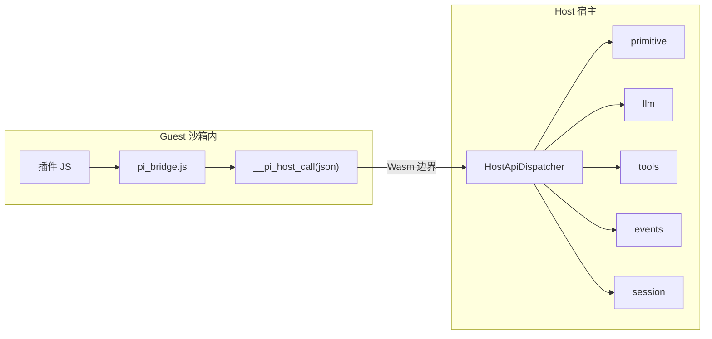
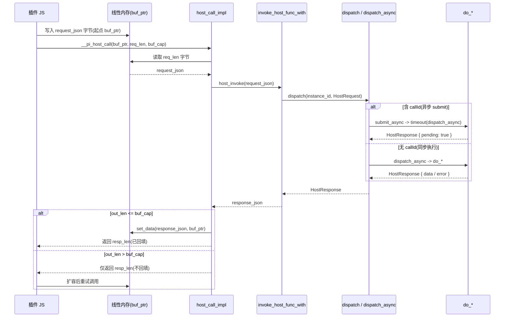
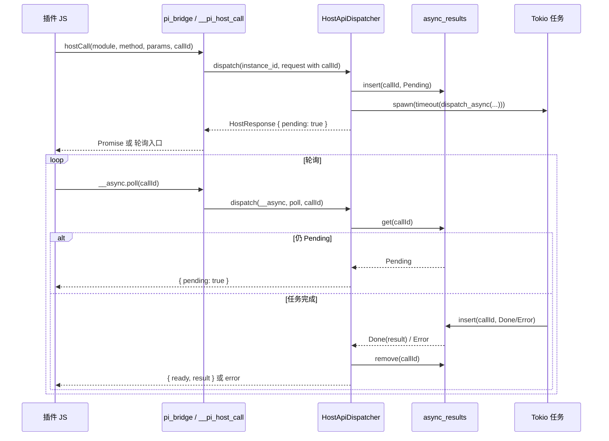

本文为 [Architecture](../Architecture.md) 中「5.5 插件系统全貌」的详细设计，总览见主文档。

## 插件系统全貌

本文说明插件从加载、运行到与宿主通信的完整边界：单入口 Hostcall、异步 submit/poll、事件与工具回路；并说明为何 [Agent Loop 设计](agent-loop.md) 与插件强相关但**不归入插件目录**。建议先看术语表，再按“旧图2张 + 补图2张”的顺序阅读。

### 阅读顺序建议

1. **术语解释表**：扫清 Hostcall、Processor、submit/poll、ExtensionEvent 等词。
2. **抽象图（基础）**：插件侧与宿主侧的边界、单入口多路复用。
3. **具体图（基础）**：一次异步 Hostcall 的 submit/poll 时序。
4. **抽象补图（代码同款）**：`dispatch` 的三路分叉与路由扇出。
5. **具体补图（代码同款）**：`callId` 从 submit 到 poll ready 的完整回流。
6. 按 **建议阅读路径** 进入 protocol → bridge → runtime → async/events → 演进与编排。

---

### 术语解释表

| 术语 | 白话解释 | 在系统中的位置 |
|------|----------|----------------|
| **Hostcall** | 插件向宿主发起的一次请求；所有请求统一走同一个 Wasm 导入函数，通过 JSON 里的 module/method 区分具体 API。 | 宿主 API 层：Wasm 侧调用 `__pi_host_call(request_json)`，宿主侧由 HostApiDispatcher 分发。 |
| **__pi_host_call** | Wasm 里注册的「唯一宿主调用入口」；插件 JS 通过 pi_bridge.js 封装成 `pi.readFile()`、`pi.createChatCompletion()` 等，底层都走这一入口。 | JS 桥接层（pi_bridge.js）调用；WasmEdge 运行时层将该函数注册为 Import。 |
| **HostApiDispatcher** | 宿主侧的单入口路由器：根据 HostRequest 的 module/method 把请求分发给对应的 Processor（fs、llm、tools、events、session 等）。 | 实现位于 `src/ext/dispatcher.rs`；与架构 3.3 统一 Hostcall 协议一致。 |
| **Processor** | 某类 Hostcall 的具体执行者，如 primitive（4 原语）、llm、tools、event_bus、session；由宿主注入到 Dispatcher，未注入时返回明确错误。 | HostApiDispatcher 内部持有各 Processor 的 Option；每个 Processor 对应一组 module/method。 |
| **异步 Hostcall / submit/poll** | 耗时请求不阻塞插件：插件带 callId 提交请求，宿主立即返回 `{ pending: true }`；插件随后用 `__async.poll(callId)` 轮询，拿到结果后再继续。 | HostApiDispatcher：submit_async 写 Pending、spawn Tokio 任务；poll 查 async_results。 |
| **callId** | 某次异步 Hostcall 的唯一标识；用于在 async_results 中挂起/取回结果，以及按 instance 清理。 | 由调用方传入 HostRequest；Dispatcher 用 DashMap&lt;callId, AsyncCallStatus&gt; 存储。 |
| **ExtensionEvent** | 供扩展（插件）订阅的钩子事件，如 tool_call、tool_result、input、session_before_switch；插件通过 `agent.on(event_name, callback)` 注册。 | 事件系统；宿主在 Agent Loop 等关键节点发布，插件监听；详见 [事件系统设计](plugin-system/events.md)。 |
| **AgentEvent** | 供流式/UI 使用的事件，携带完整上下文（如 TurnStart、MessageUpdate、ToolExecutionEnd）；与 ExtensionEvent 命名和用途区分。 | 同一事件总线发布；序列化格式见 [事件系统设计](plugin-system/events.md)。 |
| **pi_bridge.js** | 运行在沙箱内的 JS 桥接脚本，暴露 `globalThis.pi`，把 readFile、createChatCompletion、on/emit 等调用转成对 `__pi_host_call` 的 JSON 请求。 | 随 wasmedge_quickjs 加载进插件实例；与 [JS 桥接层](plugin-system/js-bridge-layer.md)、[JS API 对齐](plugin-system/js-api-alignment.md) 对应。 |
| **HostRequest / HostResponse** | Hostcall 的 JSON 请求/响应格式：请求含 module、method、params、可选 callId；响应含 data 或 pending/error。 | 协议定义见 [Hostcall JSON 协议](plugin-system/host-call-protocol.md)；实现与 host-api-layer 一致。 |

---

### 抽象图：插件与宿主的边界（单入口多路复用）

插件只能通过「显式注册的宿主 API」与外界通信；所有 API 在宿主侧汇聚到一个入口再按 (module, method) 分发。



- **Guest**：插件 JS 经 pi_bridge.js 转成对 `__pi_host_call(request_json)` 的调用。
- **Host**：HostApiDispatcher 解析 request，按 module/method 路由到对应 Processor（4 原语、LLM、工具、事件、会话等）；可选 audit 记录每笔 Hostcall。

---

### 具体图：Wasm 调宿主（内存读写与回填）

这条链路聚焦 `__pi_host_call(buf_ptr, req_len, buf_cap) -> resp_len` 的内存协议：Guest 先写请求到线性内存，Host 读取并分发执行，再按容量回填响应。



- **单入口多路复用**：插件侧无论调文件、LLM、工具还是事件，底层都汇聚到 `__pi_host_call`。
- **容量协商语义**：`(ptr,len,cap)->resp_len` 允许先返回长度，再由 Guest 扩容重试，避免越界写入。
- **分叉点在 Dispatcher**：同步/异步仅改变执行模型，Guest 与 Host 间的内存桥接协议保持不变。

---

### 具体图：异步 Hostcall 的 submit/poll 时序

耗时调用（如 LLM、executeBash）走异步路径：插件提交后立即拿回 pending，再轮询取结果；宿主在后台跑 Tokio 任务并写回 async_results。



- 插件侧可用 Promise 封装：先提交拿 pending，再在事件循环里轮询 `__async.poll(callId)` 直到 ready。
- 宿主侧：submit 时只写 Pending 并 spawn 任务，不阻塞；任务完成后写入 async_results，poll 时取出并 remove，避免泄漏。

---


### ASCII 核心四图

以下四图对齐 `dispatcher.rs` 的阅读方式：先结构示意，再调用流，再时序，最后全链路闭环。

#### 1) 结构示意（Processor 注入 + 异步基础设施）

```text
┌─────────────────────────────────────────────────────────────────────────────┐
│                           HostApiDispatcher                                │
├─────────────────────────────────────────────────────────────────────────────┤
│ 注入的 Processor（Option）                                                   │
│   event_bus ──────► events.on/off/emit/once                                 │
│   primitive ──────► fs.readFile/writeFile/editFile/executeBash              │
│   tools ──────────► tools.register/call/list/getActive/setActive            │
│   llm ────────────► llm.createChatCompletion / stream                       │
│   session ────────► session.getCurrent/getMessages/sendMessage              │
│   audit ──────────► record_hostcall（可选）                                  │
├─────────────────────────────────────────────────────────────────────────────┤
│ 异步基础设施                                                                  │
│   async_results: callId -> Pending/Done/Error                               │
│   instance_calls: instance_id -> [callId]                                   │
│   tokio_handle: block_on / spawn                                            │
│   llm_semaphore: LLM 并发限制                                                │
│   async_timeout: 异步任务超时                                                │
└─────────────────────────────────────────────────────────────────────────────┘
```

- 结构层面核心是“Processor 注入 + 异步任务管理”两大块。
- 同步调用和异步调用共享同一套路由入口，执行模型在分叉处决定。
- `async_results` 与 `instance_calls` 负责异步结果缓存和实例级清理。

#### 2) 调用流（dispatch 分叉 + dispatch_async 路由）

```text
Wasm __pi_host_call(request_json)
          │
          ▼
dispatch(instance_id, request)
    │
    ├─ module == "__async.poll" ? ──是──► do_async_poll(callId)
    │
    └─ 否
        ├─ has callId ? ──是──► submit_async()
        │                      ├─ insert Pending
        │                      ├─ spawn timeout(dispatch_async)
        │                      └─ 立即返回 { pending: true }
        │
        └─ 否 ───────────────► block_on(dispatch_async(instance_id, request))
                                 │
                                 ├─ fs.*
                                 ├─ llm.*
                                 ├─ tools.*
                                 ├─ events.*
                                 ├─ session.*
                                 ├─ context.*
                                 └─ agent.log
                                       │
                                       ▼
                                  HostResponse
```

- 第一个分叉判断是否为 `__async.poll`，这是“取结果”路径。
- 第二个分叉判断 `callId` 是否存在，决定 submit 异步还是同步执行。
- 同步与异步最终都汇聚为 `HostResponse`，上层消费模型不变。

#### 3) 时序（submit / poll 生命周期）

```text
插件(JS)                  dispatch()                async_results          Tokio任务
   │                          │                          │                   │
   │ hostCall(..., callId)    │                          │                   │
   │─────────────────────────►│                          │                   │
   │                          │ submit_async             │                   │
   │                          │─────────────────────────►│ insert(Pending)   │
   │                          │──────────────────────────────────────────────►│
   │                          │          spawn(timeout(dispatch_async))       │
   │ { pending: true }        │                          │                   │
   │◄─────────────────────────│                          │                   │
   │                          │                          │                   │
   │ __async.poll(callId)     │                          │                   │
   │─────────────────────────►│ do_async_poll            │                   │
   │                          │─────────────────────────►│ get(callId)       │
   │                          │                          │◄──────────────────│
   │                          │                    insert(Done/Error)        │
   │ { ready, result }        │                          │                   │
   │◄─────────────────────────│ remove(callId)           │                   │
   │                          │─────────────────────────►│                   │
```

- 先 submit 拿 `pending`，后 poll 拿 `ready`，符合非阻塞执行语义。
- `Done/Error` 由 Tokio 后台任务写入，poll 负责消费和删除。
- `remove(callId)` 后该异步结果生命周期结束，避免重复消费。

#### 4) 具体全链路数据动线（Guest -> Host -> Loop）

```text
Plugin JS / pi_bridge
  │ __pi_host_call(request_json)
  ▼
HostApiDispatcher.dispatch
  │
  ├─ sync: dispatch_async(route by module/method)
  └─ async: submit_async -> Pending -> __async.poll -> Ready
  │
  ▼
HostResponse
  │
  ▼
ToolResult / EventPayload
  │
  ▼
AgentLoop.messages.push(ToolResult)
  │
  ▼
Reasoning Loop 下一轮推理
  │
  ▼
最终回复 / 事件继续传播
```

- 这是插件系统最关键闭环：Guest 调用 -> Host 处理 -> 结果回注入 Loop。
- `AgentLoop.messages.push(ToolResult)` 是“插件子回路并入主编排”的唯一关键动作。
- 只要这条链路成立，新增 module/method 也能按同样模式扩展。

#### 关键逻辑图（必要增强）：事件链路回流

```text
AgentLoop 关键节点
  │ emit(AgentEvent / ExtensionEvent)
  ▼
EventBus
  │
  ├─ UI/流式订阅消费（AgentEvent）
  └─ 插件回调消费（ExtensionEvent, agent.on）
        │
        ├─ 正常回调 -> 可触发 hostCall / emit custom event
        └─ 回调错误 -> ExtensionError（不阻塞主流程）
              │
              ▼
         回到 AgentLoop 主流程（继续推理/执行）
```

- 事件链是插件系统影响主回路的第二通道（除 ToolResult 外）。
- 回调错误隔离保证“插件失败不拖垮主流程”。
- 该图用于解释事件机制如何参与入口-分叉-回流闭环。

---

### 建议阅读路径（插件体系子文档串联）

按下面顺序阅读，可把「边界与协议 → 桥接与运行时 → 异步与事件 → 演进」串成一条线；agent-loop 作为编排主线在需要时从本页外链进入。

| 顺序 | 主题 | 文档 | 说明 |
|------|------|------|------|
| 0 | 来源与加载总览 | [插件来源扫描注册加载技术方案](plugin-system/plugin-source-scan-register-load.md) | 先建立“来源扫描 -> 注册 -> 加载”的全局心智模型，再看边界与协议细节。 |
| 1 | 边界与协议 | [宿主API层](plugin-system/host-api-layer.md)、[Hostcall JSON 协议](plugin-system/host-call-protocol.md) | 插件能调什么、请求/响应长什么样。 |
| 2 | 桥接与运行时 | [JS 桥接层](plugin-system/js-bridge-layer.md)、[Host-Guest 层](plugin-system/host-guest-layer.md)、[WasmEdge 运行时层](plugin-system/wasmedge-runtime-layer.md)、[沙箱执行层](plugin-system/sandbox-layer.md) | 从 JS 调用到 Wasm 边界、实例隔离与沙箱环境。 |
| 3 | 异步与事件 | [异步 Hostcall 与事件循环](plugin-system/async-hostcall-event-loop.md)、[事件系统设计](plugin-system/events.md) | submit/poll 细节、ExtensionEvent/AgentEvent。 |
| 4 | JS API 对齐 | [JS API 与 pi-mono 对齐](plugin-system/js-api-alignment.md) | Promise、缺失 API 补齐，与 pi-mono 行为一致。 |
| 5 | 演进方案 | [Phase 2 长生命周期 VM](plugin-system/phase2-long-lived-vm.md) | 跨事件状态保持、waitForEvent 等。 |
| — | 编排主线（跨层） | [Agent Loop 设计](agent-loop.md) | 工具调用与事件发布时机、与插件的衔接点。 |

子文档末尾会补充「上一节 / 下一节 / 相关」链接，便于连续阅读。

---

### 与主文档的对应关系

- 项目整体分层与一条请求的端到端路径 → [项目全貌](project-overview-panorama.md)。
- 主架构索引与各层编号 → [Architecture](../Architecture.md)。
- 插件体系统一目录入口（含完整子文档分组）→ [Architecture](../Architecture.md) 中 `5.5.1 插件系统子文档目录（完整）`。
