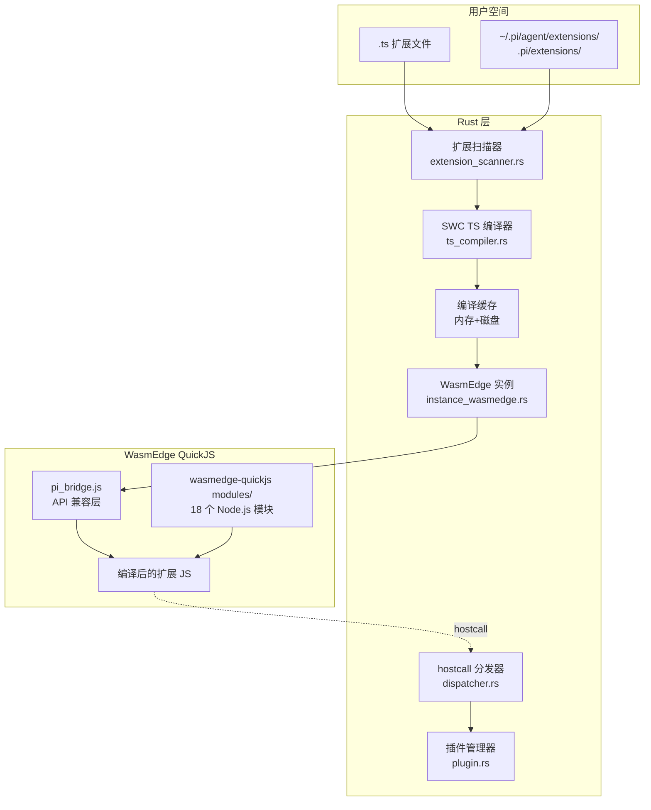
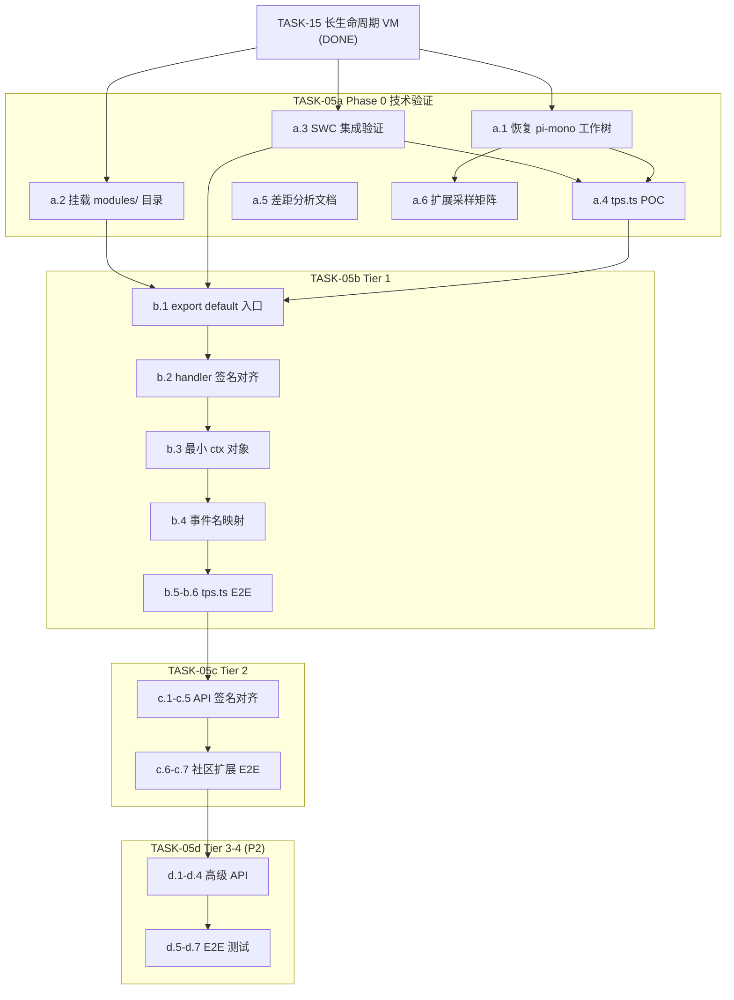
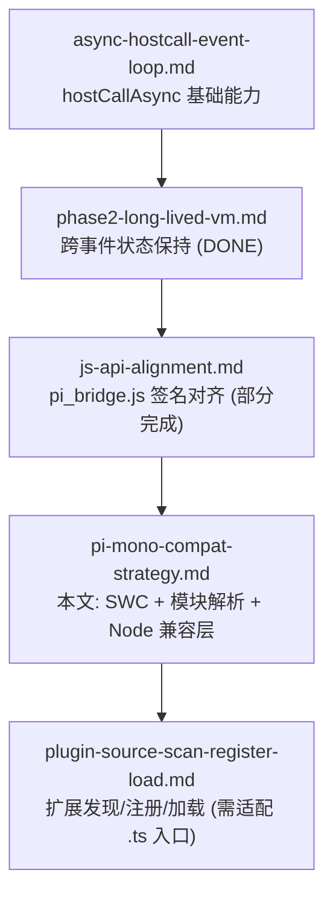

# 13. pi-mono 生态插件兼容策略

本文为 [Architecture](../../Architecture.md) 插件系统的补充设计，承接 [JS API 与 pi-mono 对齐](js-api-alignment.md) 和 [Phase 2 长生命周期 VM](phase2-long-lived-vm.md)，聚焦 **pi-mono 社区扩展在 pi-rust-wasm 上零修改运行** 的技术架构决策。

---

## 13.1 背景与目标

### pi-mono 扩展体系

pi-mono 的「插件」实际上是 **TypeScript Extensions**，核心类型定义 `ExtensionAPI` 约 1341 行（`packages/coding-agent/src/core/extensions/types.ts`），API 表面包括：

- **~30 种事件类型**：agent_start/end、turn_start/end、message_start/update/end、tool_call/result、session_*、model_select 等
- **工具/命令/快捷键/CLI 注册**：registerTool（TypeBox schema）、registerCommand、registerShortcut、registerFlag
- **ctx 上下文对象**：~20 个 UI 方法、sessionManager、modelRegistry、状态查询
- **TUI 组件**：Container、SelectList、Text、DynamicBorder 等自定义渲染组件

### 用户体验目标

pi-mono 用户的扩展开发体验为**零构建**：

1. 写 `.ts` 文件（`export default function(pi: ExtensionAPI) { ... }`）
2. 放到约定目录（`.pi/extensions/` 或 `~/.pi/agent/extensions/`）
3. 启动时自动扫描、加载、运行——无需 tsc、esbuild 或任何构建工具
4. `/reload` 命令热重载

pi-mono 内部通过 **jiti**（unjs/jiti 的 fork `@mariozechner/jiti`）在 Node.js 运行时直接加载 `.ts` 文件，按需转译为 JS。

**pi-rust-wasm 的目标**：实现与 pi-mono 一致的用户体验——用户直接写 `.ts`，放到约定目录，零构建自动加载运行。

---

## 13.2 方案对比与决策

### 核心问题

pi-mono 扩展是 TypeScript 源码，依赖 npm 包（`@mariozechner/pi-coding-agent` 等）。pi-rust-wasm 运行在 WasmEdge QuickJS 上，QuickJS 不能直接执行 TS，也不能解析 npm 包。

### 三种候选方案

| 方案 | 描述 | 用户体验 | 实现复杂度 | 跨平台 |
|------|------|----------|-----------|--------|
| A. esbuild bundle | 构建时将 TS+依赖打包为单文件 JS | 需要额外构建步骤 | 低 | 需安装 Node.js/esbuild |
| B. QuickJS module shim | 在 QuickJS JS 层实现模块加载器 | 零构建 | 高（每个 npm 包需 shim） | 是 |
| **C. SWC + Rust 模块解析** | Rust 层 TS 转译 + 模块解析 | 零构建，与 pi-mono 一致 | 中 | 是（纯 Rust） |

### 决策：方案 C（SWC + Rust 模块解析）

**理由**：

1. **用户体验一致性**：与 pi-mono 完全一致——写 .ts 放目录即可，无需任何构建工具
2. **已有参考实现**：pi_agent_rust 已用此方案实现完整的 pi-mono 兼容（SWC + rquickjs）
3. **跨平台**：SWC 是纯 Rust crate，编译到任何 Rust 支持的 target（macOS/Windows/Linux/Android/iOS）
4. **资源占用可控**：二进制增量约 4-6MB（LTO 后），内存按需解析单文件 AST，开销极小
5. **无外部依赖**：不需要 Node.js/npm/esbuild/jiti，自包含

**方案 A 保留为兜底**：若 SWC 集成遇阻（如 WasmEdge 模块加载机制不兼容），可退回 esbuild 预打包方案。

### SWC 集成方案

```
.ts 文件 → swc_ecma_parser → AST → swc_ecma_transforms_typescript::strip → swc_ecma_codegen → 纯 JS → WasmEdge QuickJS 执行
```

所需 Rust crate（参考 pi_agent_rust）：

| Crate | 版本 | 用途 |
|-------|------|------|
| `swc_common` | 18.x | 公共基础（SourceMap、错误处理） |
| `swc_ecma_ast` | 20.x | AST 节点定义 |
| `swc_ecma_parser` | 34.x | 解析 TS/TSX（~154KB 源码） |
| `swc_ecma_transforms_base` | 37.x | resolver pass |
| `swc_ecma_transforms_typescript` | 41.x | strip 类型注解 |
| `swc_ecma_codegen` | 23.x | 输出纯 JS |
| `swc_ecma_visit` | 20.x | AST visitor 模式 |

**缓存策略**：内存 + 磁盘两级缓存，key 为源文件内容 hash，避免重复编译。

### 架构数据流

从用户 `.ts` 扩展文件到最终在 WasmEdge QuickJS 中执行的完整链路：



**关键路径说明**：

1. **扩展扫描**：启动时自动扫描约定目录，发现 `.ts`/`.js` 文件
2. **SWC 转译**：Rust 层调用 SWC crate 将 TS 编译为纯 JS，结果写入缓存
3. **VM 加载**：编译产物连同 `pi_bridge.js` 一起注入 WasmEdge QuickJS 实例
4. **运行时交互**：扩展 JS 通过 `hostcall` 调用宿主 API，dispatcher 路由到 Rust 层各模块

---

## 13.3 pi_agent_rust 参考实现

pi_agent_rust 已实现完整的 pi-mono 扩展兼容，架构为 SWC + rquickjs（原生 QuickJS），覆盖 12 个方面：

| 方面 | 实现概要 | 关键文件 |
|------|---------|---------|
| 扩展发现与加载 | `~/.pi/agent/extensions/` + `.pi/extensions/`，多格式支持 | `package_manager.rs` |
| TypeScript 编译 | SWC 7 crate，CJS→ESM 转换，两级缓存 | `extensions_js.rs` |
| 模块解析 | PiJsResolver + PiJsLoader，相对路径 + Node 内置映射 | `extensions_js.rs` |
| API 兼容层 | on/once/off、exec、registerTool/Command/Shortcut/Flag/Provider、sendMessage 等 | `extensions_js.rs` |
| ctx 对象 | cwd、hasUI、model、isIdle、abort、ui.notify/select/confirm/input、sessionManager | `extensions_js.rs` |
| 事件系统 | ~20 种事件名与 pi-mono 对齐 | `extensions.rs` |
| Node.js 虚拟模块 | 30+ 个（fs/path/crypto/process/buffer/child_process 等） | `extensions_js.rs` |
| 全局对象 polyfill | console、setTimeout/setInterval、queueMicrotask、structuredClone | `extensions_js.rs` |
| 包管理 | pi install/remove/update/list，支持 npm:/git:/本地 | `package_manager.rs` |
| 配置系统 | settings.json 全局+项目合并 | `config.rs` |
| 自动修复 | DistToSrc、MissingNpmDep stub、MonorepoEscape、ExportShape | `extensions_js.rs` |
| 特殊兼容 | Bun 虚拟模块、JSON→ESM | `extensions_js.rs` |

**pi-rust-wasm 可参考移植的部分**：SWC 编译流程、CJS→ESM 转换、Node.js 虚拟模块的 JS polyfill、API 签名设计。

**pi-rust-wasm 与 pi_agent_rust 的关键差异**：pi-rust-wasm 使用 WasmEdge 运行 QuickJS（`.wasm` 二进制），pi_agent_rust 使用 rquickjs（原生 QuickJS Rust 绑定）。模块加载器的集成方式不同——WasmEdge 通过文件系统 preopen 提供模块，rquickjs 通过 Rust trait 实现自定义 loader。

---

## 13.4 ExtensionAPI 差距分析

### pi_bridge.js 与 ExtensionAPI 对比

| API | pi_bridge.js 现状 | pi-mono ExtensionAPI | 差距 | 兼容 Tier |
|-----|-------------------|---------------------|------|----------|
| `on(event, handler)` | 有（events.subscribe） | 有（~30 种事件） | handler 签名缺 ctx 参数 | Tier 1 |
| `once(event, handler)` | 无 | 有 | 需新增 | Tier 1 |
| `off(listenerId)` | 有（重复定义 bug） | 有 | 需修复 | Tier 1 |
| `exec(cmd, args, opts)` | 有（签名为 `exec(cmd)`） | 有 | 签名不同 | Tier 2 |
| `registerTool(spec)` | 有（简单版） | 有（TypeBox schema） | schema 体系不同 | Tier 2 |
| `registerCommand(name, spec)` | 有 | 有 | handler 签名不同 | Tier 2 |
| `registerShortcut` | 无 | 有 | 完全缺失 | Tier 2 |
| `registerFlag` / `getFlag` | 无 | 有 | 完全缺失 | Tier 2 |
| `sendMessage(msg, opts)` | 有 | 有 | 签名和选项不同 | Tier 2 |
| `readFile` / `writeFile` / `editFile` | 有 | 无（pi-mono 不暴露） | pi-rust-wasm 独有 | — |
| `setModel` / `getThinkingLevel` | 无 | 有 | 完全缺失 | Tier 2 |
| `registerProvider` | 无 | 有 | 完全缺失 | Tier 4 |
| `registerMessageRenderer` | 无 | 有 | 完全缺失 | Tier 4 |
| `events` (EventBus) | 无 | 有 | 完全缺失 | Tier 2 |
| `ctx.hasUI` / `ctx.cwd` | 无 | 有 | 需新增 | Tier 1 |
| `ctx.ui.notify/select/confirm/input` | 部分 | 有 | 需传入 ctx | Tier 1-2 |
| `ctx.ui.custom/setWidget/setFooter/editor` | 无 | 有 | 完全缺失 | Tier 3 |
| `ctx.sessionManager` | 无 | 有 | 完全缺失 | Tier 4 |
| `ctx.model` / `ctx.modelRegistry` | 无 | 有 | 完全缺失 | Tier 4 |
| `ctx.isIdle/abort/shutdown` | 无 | 有 | 完全缺失 | Tier 2 |

### 扩展入口模式差异

- **pi-mono**：`export default function(pi: ExtensionAPI) { ... }`
- **pi-rust-wasm 当前**：脚本顶层执行，`globalThis.pi` 预注入

需改造 pi_bridge.js 以支持 `export default function` 入口模式。

### 入口模式兜底策略

WasmEdge QuickJS 对 ESM `export default` 的支持程度需在 Phase 0 验证。若 ESM 支持不足，采用以下降级方案：

| 优先级 | 方案 | 描述 |
|:---:|------|------|
| 1 | ESM 原生 | SWC 保留 `export default function(pi) {...}`，QuickJS 以 ESM 模式加载 |
| 2 | 全局变量注入 | SWC 编译阶段将 `export default function` 转换为 `globalThis.__pi_ext_init = function`，pi_bridge.js 调用 `__pi_ext_init(pi)` |
| 3 | CJS 包装 | SWC 输出 `module.exports = function(pi) {...}`，pi_bridge.js 提供 `module` 对象并调用 `module.exports(pi)` |

三种方案对扩展开发者**完全透明**——用户始终编写标准的 `export default function(pi)` 入口，转换在 SWC 编译阶段自动完成。

---

## 13.5 Node.js 模块兼容层

### wasmedge-quickjs 已实现的模块（~18 个）

wasmedge-quickjs 的 `modules/` 目录提供了以下 Node.js 兼容模块：

`assert`、`buffer`、`crypto`、`encoding`、`events`、`fs`（含 `fs/promises`）、`http`、`os`、`path`、`process`、`punycode`、`querystring`、`stream`、`string_decoder`、`timers`、`url`、`util`

### 当前问题

**TASK-05a 起已启用**：`assets/modules/` 由 wasmedge-quickjs 同步拷贝，`instance_wasmedge.rs` 在 WASI 中增加 `./modules` → 该目录的 preopen；可选环境变量 `PI_WASM_QUICKJS_MODULES_PATH` 覆盖路径。以下「缺失模块」表仍描述相对完整 Node 的差距。

### 缺失模块及优先级

| 模块 | 扩展使用频率 | 实现策略 |
|------|:---:|------|
| `child_process` | 高 | 通过 hostcall 转发到 Rust 层 exec |
| `https` | 中 | 封装 WasmEdge WASI socket（或复用 http 模块） |
| `module` | 中 | 提供 createRequire stub（仅支持内置模块） |
| `net` / `tls` | 低 | stub（返回 not supported） |
| `readline` | 低 | stub |
| `zlib` | 低 | stub |
| `stream/web` / `stream/promises` | 低 | 基于 stream 扩展 |
| `http2` / `tty` / `constants` | 极低 | stub |
| `perf_hooks` / `vm` / `v8` / `worker_threads` | 极低 | stub |

---

## 13.6 分层兼容策略

### Tier 定义

| Tier | 目标 | 代表扩展 | 所需能力 |
|------|------|---------|---------|
| **Tier 1** | 纯事件监听 + notify | tps.ts | on/once/off + ctx.hasUI + ctx.ui.notify |
| **Tier 2** | 命令 + exec + 基础 UI | 含 registerCommand + exec 的扩展 | exec 签名对齐 + registerTool schema + ctx.ui 四件套 |
| **Tier 3** | TUI 自定义组件 | diff.ts | ctx.ui.custom + Container/SelectList/Text 等 |
| **Tier 4** | 深度会话 API | files.ts | ctx.sessionManager + ctx.modelRegistry + registerProvider |

### 实施顺序

```
Tier 1（MVP 可行性验证）→ Tier 2（主流扩展覆盖）→ Tier 3（高级 UI）→ Tier 4（深度集成）
```

建议 TASK-05 分阶段实施：先达到 Tier 2（覆盖大部分实用扩展），再逐步扩展到 Tier 3-4。

### 实施依赖关系

TASK-05 拆分为 a/b/c/d 四个子任务，子项间的依赖关系与可并行度如下：



**并行窗口**：a.1/a.2/a.3/a.5 四项可并行启动；a.4 和 a.6 需等待前置完成。

---

## 13.7 架构关系



---

## 13.8 风险与开放问题

| 风险 | 影响 | 缓解策略 |
|------|------|---------|
| WasmEdge QuickJS 模块加载机制与 rquickjs 不同 | 无法直接移植 PiJsResolver | WasmEdge 通过文件系统 preopen 提供模块；SWC 转译后的 JS 写入临时文件供 QuickJS 加载 |
| wasmedge-quickjs 的 Node.js polyfill 实现质量 | 部分模块可能不完整 | 运行测试验证，必要时自行补充或替换 |
| WasmEdge 在 iOS/Android 上的支持 | 移动端不可用 | 不属于 TASK-05 范围，但需在 TASK-07（跨平台）中评估 |
| pi-mono ExtensionAPI 持续演进 | 兼容目标是移动靶 | 以当前稳定版 API 为基准，后续按需跟进 |
| 裸 npm 包说明符（`@mariozechner/pi-coding-agent`） | QuickJS 无法解析 | SWC 编译时通过 esbuild alias 或 Rust 层模块解析器拦截替换 |
| SWC 二进制膨胀 | 产物体积增大 | 预估 4-6MB（LTO 后），可接受；可通过 Cargo feature gate 控制是否编译 SWC 模块 |
| Tier 3-4 TUI 组件工作量 | 可能远超预期 | 先做纯文本降级 stub，不阻塞 Tier 1-2 交付；TUI 渲染框架作为独立迭代 |

---

## 13.9 涉及文件清单

### 新建文件

| 文件 | 用途 | 所属阶段 |
|------|------|:---:|
| `src/ext/ts_compiler.rs` | SWC TS->JS 编译模块 | TASK-05a |
| `src/ext/extension_scanner.rs` | 扩展目录扫描器（`.pi/extensions/`、`~/.pi/agent/extensions/`） | TASK-05b+ |
| `assets/modules/` | wasmedge-quickjs Node.js 兼容模块（从 `wasmedge-quickjs/modules/` 拷贝） | TASK-05a |
| `docs/reports/extension_api_gap_analysis.md` | ExtensionAPI 完整差距分析文档 | TASK-05a |
| `docs/reports/extension_compat_matrix.md` | 社区扩展兼容性评估矩阵 | TASK-05a |

### 改造文件

| 文件 | 改动内容 | 所属阶段 |
|------|----------|:---:|
| `Cargo.toml` | 新增 SWC 7 个 crate 依赖 | TASK-05a |
| `src/ext/instance_wasmedge.rs` | `modules/` preopen 挂载 | TASK-05a |
| `src/ext/plugin.rs` | 支持 `.ts` 扩展加载、`export default function` 入口 | TASK-05b |
| `src/ext/dispatcher.rs` | exec args 处理、事件名映射、ctx 数据传递 | TASK-05b/c |
| `assets/js/pi_bridge.js` | 扩展加载 wrapper、handler 签名对齐、ctx 构造 | TASK-05b/c |
| `tests/wasmedge_e2e_tests.rs` | 新增 pi-mono 兼容性 E2E 测试 | TASK-05b/c/d |

### 参考文件（只读）

| 文件 | 参考内容 |
|------|----------|
| `pi_agent_rust/src/extensions_js.rs` | SWC 编译流程、虚拟模块、API 兼容层 |
| `pi_agent_rust/src/extensions.rs` | 扩展协议、事件系统 |
| `pi_agent_rust/Cargo.toml` | SWC crate 版本参考 |

---

## 13.10 工作量估算

| 阶段 | 范围 | 预估工作日 | 最大工作项 |
|------|------|:---:|------|
| TASK-05a | Phase 0 技术验证与差距分析 | 3-5 | a.3 SWC 集成验证 |
| TASK-05b | Tier 1 纯事件监听型扩展 | 3-4 | b.1 入口改造（ESM 兼容风险） |
| TASK-05c | Tier 2 命令+exec+基础 UI | 4-6 | c.3 TypeBox schema 兼容 + c.4 UI 真实实现 |
| TASK-05d | Tier 3-4 TUI+深度会话 API (P2) | 8-12 | d.1 TUI 组件渲染框架 |
| **合计** | Tier 1-2 | **10-15** | — |
| **合计** | 含 Tier 3-4 | **18-27** | — |

Tier 1-2 为核心交付目标，Tier 3-4 为 P2 可延后。

---

**导航**：返回 [插件系统全貌](../plugin-system-overview.md) | 上一节：[Phase 2 长生命周期 VM](phase2-long-lived-vm.md)
