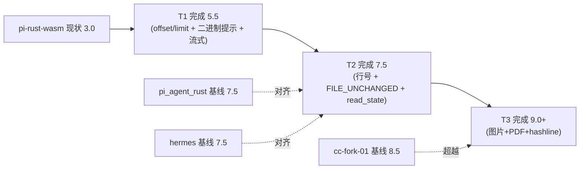
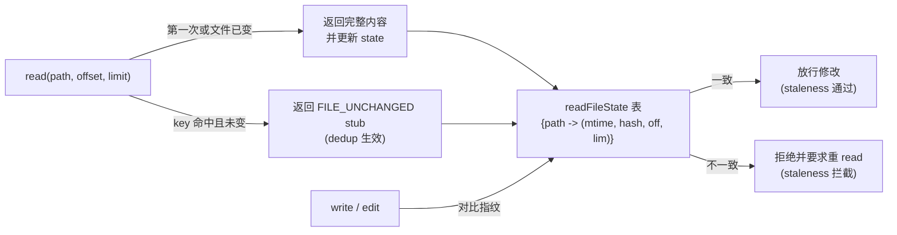
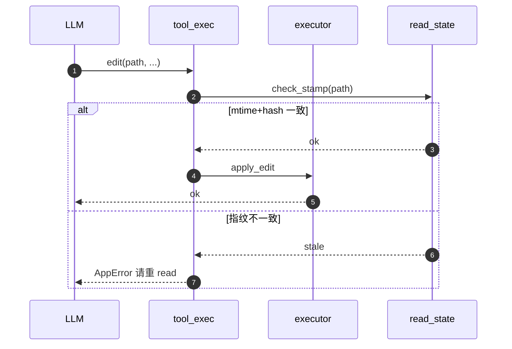

# read 工具技术方案（架构 spec）

本文档承接独立执行计划 [`strengthen-read-tool_92f396c7.plan.md`](../../../../../.cursor/plans/strengthen-read-tool_92f396c7.plan.md) 与 PR-RS 文档治理计划 [`tools-read-spec-migration_cb4d7b57.plan.md`](../../../../../.cursor/plans/tools-read-spec-migration_cb4d7b57.plan.md)。

> **位置说明**：计划文档（plan）记录决策过程与待办清单；本文为冻结后的技术方案摘要（§1–§2 自计划搬运）+ 协议 / One-Glance Map / 调度时序（§3–§5）。

---
## 1. 背景与对比

> **调研 + 选型，无代码改动**。本部分包含 §0 现状速览 + §0.A 五项目横向对比（含 §0.A.1–§0.A.4 共 4 个子节），回答三个问题：
> ① pi-rust-wasm read 工具**当前在哪**（§0 评分基线 3.0）；
> ② 五个对照 agent **各自怎么做**（§0.A.2 横向对照表，列头含语言栈 + file:line 锚点）；
> ③ 我们**应该怎么做**（§0.A.3 单一权威决策表 + 表后「项目级移植说明」 + §0.A.4 评分演进路径）。
>
> 实施期需要的术语手册已下沉到对应实施小节作为「概念前置」：**staleness / dedup → §3.2.1 / §3.2.2**；**hashline → §4.3.1**。

### 0. 现状速览（read 单工具）

| 项 | pi-rust-wasm 现状 | 关键 file:line | 评分（满 10） |
|---|---|---|---|
| 工具名 | `read_file` | [`src/core/tools/catalog.rs`](../../../../src/core/tools/catalog.rs) `BUILTIN_TOOL_CATALOG` 80–95 | — |
| 输入 schema | 仅 `path: string` | [`src/core/tools/catalog.rs`](../../../../src/core/tools/catalog.rs) `read_file_parameters` 257–264 | — |
| 实现 | 一次 `read_file_utf8` 整文件读 | [`src/core/tools/primitive/executor.rs`](../../../../src/core/tools/primitive/executor.rs) `read_file` 965–1000 | — |
| 大小上限 | `MAX_READ_BYTES = 10 MiB` | 同上 95–96 | — |
| **R1 分页/截断** | 无 | — | 1 |
| **R2 多模态** | 仅 UTF-8（图片/PDF/Notebook 均拒） | — | 1 |
| **R3 行号渲染** | 无 | — | 1 |
| **R4 二进制识别** | `String::from_utf8` 失败 → 裸错误 | — | 4 |
| **R5 staleness/dedup** | 无 | — | 1 |
| **R6 性能/上限** | 整文件入内存，10 MiB | — | 5 |
| **加权分** | — | — | **3.0** |

**目标分**（与主计划 §0.6 对齐）：T1 完成 ≈ **5.5**，T2 完成 ≈ **7.5**，T3 完成 **≥ 9.0**（追平 cc-fork-01 8.5、超过 hermes/pi_agent_rust 7.5）。

### 0.A 五项目 read 工具横向对比

#### 0.A.1 维度定义（read 专用）

| 维度 | 定义 | 作用（为什么必须有） | 缺位代价（pi-rust-wasm 现状代价） |
|---|---|---|---|
| **R1 分页/截断** | 是否支持 `offset` / `limit` 入参与默认行/字节上限 | ① **保护上下文窗口**：模型只看需要的几百行，避免一次注入 10 MiB；② **支撑大文件场景**：可分批读 log/dump/数据集；③ **与 edit 配合**：edit 失败后只重读受影响窗口而非整文件 | 单次 read 极易把 ctx 撑爆 → loop 早期就 OOM；遇到 5–10 MiB 文件直接报错或刷屏，模型无法继续推进任务 |
| **R2 多模态** | 图片 / PDF / Notebook 等非纯文本路径的覆盖度 | ① **让 vision 模型看图**：截图、UI 设计稿、错误截屏直接进对话；② **覆盖产品场景**：PDF/Notebook 是业务实际产物；③ **闭合「调试-截屏-反馈」回路**：用户贴图后 agent 能立刻 read 出 base64 喂回 LLM | 任何非 UTF-8 文件直接 Err；用户截屏调试只能让 agent 用 `file`/`base64` 走 bash 拼装，链路冗长易错 |
| **R3 行号渲染** | 是否输出可被 edit 工具直接引用的行号或哈希锚点 | ① **edit 工具的输入桥梁**：edit 需要精确行号定位；② **降低 oldText 歧义**：行号 + 内容双重锚点降低误改概率；③ **支撑 hashline_edit**：N#AB:line 协议要求 read 端先打哈希 | 模型给 edit 的 `old_content` 只能用裸字符串匹配，遇到重复行直接拒；多段 edit 必须人肉数行号，错误率高 |
| **R4 二进制识别** | 非 UTF-8 文件失败时的结构化程度（裸 Err / 引导提示 / 自动转视觉） | ① **可恢复诊断**：返回「这是 PNG，建议用 vision」而不是「invalid utf-8」；② **避免 retry 风暴**：明确告知不可读后模型不会反复重试；③ **配合 R2 落地多模态**：识别后路由到 image/pdf 分支 | 模型拿到裸 utf8 错误，常见错误链：read 失败 → 改 cat → cat 输出二进制乱码 → 占满 ctx → 任务失败 |
| **R5 staleness / dedup** | 与 write/edit 的「先 read」契约 + 重复读阻断策略 | ① **edit/write 安全门**：要求修改前必须 read，且 read 后未被外部改动；② **省 token**：同一 (path,offset,limit) 自上次 read 后未变 → 返回 `FILE_UNCHANGED` stub；③ **防 loop**：同窗口反复 read 直接软阻断，强制模型换策略 | 模型在 loop 中反复 read 同一文件耗 token；外部编辑器改了文件，agent 仍按旧内容 edit → 改坏代码 |
| **R6 性能 / 上限** | 单次 max bytes、是否流式行读、是否做 token 估算 | ① **可预测延迟**：流式行读避免一次性把 100 MB 拉进内存；② **保护进程**：上限阻止恶意/误操作 read 设备节点；③ **token 预算**：预估输出 token 后才能在 ctx 紧张时主动截断 | 现 10 MiB 上限「不大不小」：小到塞不下日常 dump，大到一次塞满 32k ctx；无流式读 → 大文件全量入内存，wasm 环境易爆 |

> 这 6 个维度并非孤立：R1（分页）+ R3（行号）+ R5（staleness）共同支撑 **edit 闭环**；R2（多模态）+ R4（二进制识别）共同覆盖 **非文本调试场景**；R6 是底座，决定前 5 项的成本上限。后续 §0.A.2 评分、§0.A.3 选型决策、§2–§4 的 T1/T2/T3 排期都按这个分组推进。

#### 0.A.2 横向能力对照表

> 列头小字给出每个 agent 的**语言栈 + read 实现的关键 file:line 锚点**（原 §0.A.4 已并入），点击可直接跳转源码核对。

| 维度 | **pi-rust-wasm**（现状）<br><sub>Rust + wasm</sub><br><sub>[`executor.rs` `read_file` 965–1000](../../../../src/core/tools/primitive/executor.rs)</sub> | **pi-mono**<br><sub>TypeScript / Bun</sub><br><sub>[`read.ts` 17–21 / 121–134](../../../../../pi-mono/packages/coding-agent/src/core/tools/read.ts)</sub> | **pi_agent_rust**<br><sub>Rust</sub><br><sub>[`tools.rs` 1368–1447 / 5468–5471](../../../../../pi_agent_rust/src/tools.rs)</sub> | **openclaw**<br><sub>TypeScript</sub><br><sub>[`pi-tools.ts` 42–51 / 306](../../../../../openclaw/src/agents/pi-tools.ts)</sub> | **hermes-agent**<br><sub>Python</sub><br><sub>[`file_tools.py` 1029–1040 / 482–538](../../../../../hermes-agent/tools/file_tools.py)</sub> | **cc-fork-01**<br><sub>TypeScript / Bun</sub><br><sub>[`FileReadTool.ts` 227–243 / 248–331](../../../../../cc-fork-01/src/tools/FileReadTool/FileReadTool.ts)</sub> |
|---|---|---|---|---|---|---|
| **R1 分页/截断** | 无 offset/limit；整文件 ≤ 10 MiB | offset/limit + 截断头部 + 续读提示 | offset/limit + 2000 行 / 1MB 截断 + 续读 `offset=next` | 透传 Pi + 模型 ctx 缩放 | offset/limit ≤ **2000 行** + ~100K 字符硬拒 | offset/limit + `MAX_LINES_TO_READ=2000` + maxTokens=25k |
| **R2 多模态** | 仅 UTF-8 | 图片 base64 + resize | 图片 jpg/png/gif/webp | 经 Pi + 扩展 | 二进制扩展拒绝 → vision 引导 | **图片+PDF+Notebook+Parts** 完整 discriminated union |
| **R3 行号渲染** | 无 | 截断后行号提示 | `NN→` 或 `N#AB:` hashline | 透传 | `LINE_NUM\|CONTENT` 风格 | `cat -n` 行号 + 行宽 6 |
| **R4 二进制识别** | 抛 `非 UTF-8` Err（裸） | 仅图片走特殊分支 | `READ_TOOL_MAX_BYTES=100MB` + 图分支 | — | 设备路径 + 二进制扩展拒绝 | `BLOCKED_DEVICE_PATHS` + binary ext 检测 |
| **R5 staleness/dedup** | 无 | 无 | 无 | — | (path,offset,limit,mtime) **dedup** + 多次 BLOCK | `readFileState` + `FILE_UNCHANGED` stub |
| **R6 性能/上限** | 一次 read 整文件，10 MiB | 整文件入内存再 split | 流式行读，100 MB | — | 100K 字符硬拒 | 256 KB 字节预检 + 25k token cap |
| **加权分**¹ | **3.0** | 6.0 | 7.5 | 5.5 | 7.5 | **8.5** |

¹ 权重：R1×0.20、R2×0.15、R3×0.15、R4×0.10、R5×0.20、R6×0.20。

#### 0.A.3 维度 → 落地点选型决策表

> **本节是整个对比段的「单一权威表」**——合并了早期版本的「按维度收口（拒因）」与「按落地点收口（取自/形态/阶段）」两张表，**以 §0.A.1 的 R1–R6 维度为主键，每个维度可有多个子落地点（用 `↳` 表示同维度续行）**。
>
> 一行回答四个问题：
> ① 这条落地点要补强哪个维度？（**维度** 列）
> ② 抄谁的，怎么落到 pi-rust-wasm？（**落地点 / 取自 / 形态** 列）
> ③ 什么时候做？（**阶段** 列）
> ④ 为什么选这个、为什么不选别家？（**入选理由 / 未入选项 + 拒因** 两列）

| 维度 | 落地点 | 取自 | 形态（实施位置） | 阶段 | 入选理由 | 未入选项 + 拒因 |
|---|---|---|---|---|---|---|
| **R1 分页/截断** | offset/limit + 默认 2000 行 | cc-fork | catalog 字段 + executor 流读 | §2 T1 | cc-fork 默认上限工程上验证最稳，2000 行 ≈ 模型一次能消化的上限 | × `hermes` 100K 字符硬拒：触发后整个任务停摆，阻断大日志/dump 合理需求<br>× `pi_agent_rust` 1 MB 截断：上限太小，2000 行常触上限<br>× `openclaw` 模型 ctx 自适配：耦合 Pi 调用栈，独立项目难复用<br>× `cc-fork` 25k token API 估算：依赖 Anthropic SDK |
| ↳ | 续读 `offset=next, limit=same` 提示 | pi-mono | 截断尾部固定模板字符串 | §2 T1 | pi-mono 模板纯字符串、可直接搬到 Rust，零依赖 | （同上行） |
| **R2 多模态** | discriminated union `Image / Pdf / FileUnchanged` | cc-fork | 输出 schema 改 enum | §4 T3 | ① schema 自描述，下游 agent_loop 易做 image content block 路由<br>② 编译期 enum 强制覆盖所有分支 | × `cc-fork` `Notebook` / `Parts`：Notebook 依赖 Jupyter、Parts 需 PDF 拆页落盘，复杂度收益比差<br>× `hermes` 仅扩展拒绝 + vision 引导：不真正返图，仍要 agent 用 bash 拼 base64<br>× `pi_agent_rust` 仅 image 不带 schema：未来加 PDF 改动大 |
| ↳ | 图像 1568px 长边降采样 | cc-fork | `image` crate + `imageops::resize` | §4 T3 | Anthropic 推荐上限，省 token 且保证 vision 模型可识别 | × `cc-fork` token-aware compress：依赖 SDK，独立项目无对应接口 |
| **R3 行号渲染** | `{:>6}\t{}` cat -n 风格 | cc-fork | `format_with_line_numbers` helper | §3 T2 | cat -n 默认体验最好，与几乎所有 IDE/diff 工具兼容 | × `pi_agent_rust` `NN→` 简单行号：被 cat -n 完全覆盖，无独立价值<br>× `hermes` `LINE_NUM\|CONTENT`：与 cat -n 同质，但 `\|` 易与表格冲突<br>× `openclaw` 透传：等于没渲染 |
| ↳ | 可选 `hashline=true` 输出 `N#AB:` | pi_agent_rust | read schema 加 `hashline?: bool` + executor 分支 | §4 T3 | 给 edit 精细场景兜底，配合 R5 staleness 实现「行级一致性校验」（详见 §4.3.1） | （同上行） |
| **R4 二进制识别** | 失败时返回结构化 hint「This is `<mime>`, try `bash file <path>` or wait for vision」 | hermes（措辞）+ cc-fork（device 检测） | `read_file` 非 UTF-8 分支替换裸 Err | §2 T1 | ① cc-fork 路径黑名单思路防 read `/dev/zero` 卡死<br>② hermes 引导措辞自然，模型按提示能立即转策略 | × `hermes` 完整 device 路径黑名单：与 pi-rust-wasm 已有 audit gate 三层授权重复，避免治理冲突<br>× `pi-mono` 仅图片走特殊分支：忽略其它二进制类型，模型仍会撞错 |
| **R5 staleness / dedup** | `FILE_UNCHANGED` 软 stub + `readFileState` | cc-fork | 新增 [`src/core/tools/read_state.rs`](../../../../src/core/tools/read_state.rs) 公共底座 | §3 T2 | 软 stub 既省 token 又允许合理 retry，比硬阻断鲁棒 | × `hermes` `(path,offset,limit,mtime)` dedup + 多次 BLOCK：太激进，合理 retry 也被拒，需改 prompt 绕开<br>× `pi-mono` 无 staleness：缺这层，edit 易改坏外部修改过的文件 |
| ↳ | hashline 内容指纹（互补） | pi_agent_rust | 复用 R3 的 hashline 输出做二次校验 | §4 T3 | 在「文件变了但 mtime 没变」（如 git checkout 保留时间戳）边角 case 兜底 | （同上行） |
| **R6 性能 / 上限** | tokio `BufReader::lines` 流式行读 | pi_agent_rust | 替换现 `read_file_utf8` 整文件读 | §2 T1 | 流式避免整文件入内存，wasm 环境必备 | × `cc-fork` 256 KB 字节预检：太小，正常源码就被拒<br>× `pi_agent_rust` 100 MB：太大，单文件能塞满 wasm 堆<br>× `cc-fork` 25k token 估算：依赖 Anthropic SDK<br>× `hermes` 100K 字符硬拒：实质同 R1 拒因 |
| ↳ | `MAX_READ_BYTES = 25 MiB` | 自设（介于 cc-fork 256KB 与 pi_agent_rust 100MB 之间） | catalog 常量 + `pi.config.toml [tools.read] max_bytes` 覆盖 | §2 T1 | 兼顾合理 dump 文件 + 防爆 ctx | （同上行） |
| **— (命名)** | 工具短名 `read` | pi-mono | catalog 改名 + 单迭代 alias fallback | §1 命名切换 | 与 pi-mono / cc-fork / pi_agent_rust 短名生态对齐，模型熟悉 | × `cc-fork` 长名 `Read` / `FileReadTool`：与历史 transcript `read_file` 不一致，破坏性更大且无收益 |

**核心选型口诀（与上表 1:1 对齐）**：
- **cc-fork 拿 5 项**：R1 主体（offset/limit）、R2 全套（union + 1568px）、R3 cat -n、R4 device 思路、R5 软 stub —— 业界落地最完整；
- **pi_agent_rust 拿 3 项**：R3 hashline、R5 hashline 互补、R6 流式行读 —— Rust 原生、无 SDK 依赖；
- **pi-mono 拿 2 项**：R1 续读模板、§1 命名 —— 零依赖、最小可移植；
- **hermes 拿 1 项**：R4 措辞 —— 引导句式自然，BLOCK 思路被否；
- **openclaw 不取**：模型 ctx 自适配耦合 Pi 调用栈，read 自身无独立增强。

> **维度覆盖核对**：R1（2 行）、R2（2 行）、R3（2 行）、R4（1 行）、R5（2 行）、R6（2 行）+ 命名（1 行）= **共 12 行落地点，6 个维度全部 ≥ 1 项覆盖**。
> 阶段分布：**§1 命名（1）、§2 T1（5）、§3 T2（2）、§4 T3（4）**，刚好对应 §0.A.4 评分演进 3.0 → 5.5 → 7.5 → 9.0+ 的跃迁节奏。

> **横向只取 cc-fork 不行吗？** 不行。
> ① **R6 性能/上限**：cc-fork 的 256 KB 字节预检 + token 估算依赖 Anthropic SDK，wasm 环境无法直接搬，必须改用 `pi_agent_rust` 的 `BufReader` + 自设 25 MiB；
> ② **R3 行号**：edit 强一致场景需要 hashline 兜底，cc-fork 没有这套协议，要从 `pi_agent_rust` 借；
> ③ **R1 续读 hint**：cc-fork 的截断措辞偏英语长句，pi-mono 的「`offset=<next>, limit=<same>`」更精炼，模型按规则即可继续读。
> 所以最终选型 = **cc-fork 5 + pi_agent_rust 3 + pi-mono 2 + hermes 1** 的复合最优解。

##### 项目级移植说明（解释为什么 §0.A.3 多数行只「取设计」而不「搬代码」）

每条对应表中一个或多个 × 拒因背后的**跨维度根因**：

- **pi-mono** —— TS/Bun 实现，read 主体逻辑无法直搬 Rust；可取**设计形态**（schema 字段 + `offset=<next>` 续读模板字符串），代码需 Rust 重写。
- **pi_agent_rust** —— Rust 同栈最易借鉴，但 hashline 字典需引入 `xxhash-rust` crate；其 `NN→` 简单行号已被 cc-fork `cat -n` 完全覆盖，所以**只取 hashline 部分**而非整个行号实现。
- **openclaw** —— read 行为完全依赖 `pi-coding-agent` 包装、无独立增强逻辑；模型 ctx 自适配耦合于 Pi 调用栈，独立项目无对应抽象——这就是表中**几乎全表「× openclaw」**的根本原因。
- **hermes-agent** —— Python 栈无法直搬 Rust；其 BLOCK 策略过激被否；**只取「失败措辞 / vision 引导」的 prompt 思路**而非任何代码。
- **cc-fork-01** —— TS/Bun 私有 utils 复杂度高 + `token-aware compress` 依赖 Anthropic SDK；wasm 环境无法复用——所以 5 项虽全取 cc-fork，但**仅照搬设计形态**（schema / 行号 / state 表语义），代码层面需 Rust 重写。

#### 0.A.4 评分演进路径




---

## 2. 实施排期（12 项落地点）

> **按 T1 → T2 → T3 三阶段递进**，对应评分跃迁 3.0 → 5.5 → 7.5 → 9.0+（详见 §0.A.4）。
> §1 命名切换是 T1 前的破坏性前置 PR；§2 (T1) / §3 (T2) / §4 (T3) 三阶段独立合入，每阶段都带测试与配置开关，可单独回滚。
>
> **本部分所有子节与 §0.A.3 决策表 1:1 对应**——每个子节标题就是决策表里的一条「落地点」，子节顺序与决策表行顺序完全一致。术语手册（staleness / dedup / hashline）已下沉到对应实施小节内（§3.2 / §4.3）作为「概念前置」。
> **每个实施小节** 都以 `> **概念前置**：...` 开头，配 1 张 ASCII 小图说明机制；其后才是实现细节列表。

#### 全景图（12 项落地点 → 实施小节 → 代码触达）

> 一图看懂第二部分：12 个落地点（① ~ ⑫）+ 1 个横切节（★）按阶段排布；每行末尾标实施小节编号；图下方按文件汇总「这个文件被哪些落地点改动」。

```text
+════════════════════════════════════════════════════════════════════════════+
║  read 工具加强 · 12 项落地点全景图（§0.A.3 决策表 ↔ §1–§4 实施小节）       ║
+════════════════════════════════════════════════════════════════════════════+

  阶段          维度        落地点                                       实施
  ──────       ─────       ─────────────────────────────────────────    ────
  [§1 命名]   （—命名—）   ①  read_file → read（+ 单轮 fallback）       §1

                  ╌╌╌╌╌╌  评分 3.0（基线，命名不动分） ╌╌╌╌╌╌

  [§2 T1]      R1 分页     ②  offset/limit + 默认 2000 行                §2.1
               R1 续读     ③  截断尾注 `offset=next, limit=same`         §2.2
               R4 二进制   ④  结构化非 UTF-8 hint（含 first-byte hex）   §2.3
               R6 性能     ⑤  tokio BufReader 流式行读                   §2.4
               R6 上限     ⑥  MAX_READ_BYTES = 25 MiB                    §2.5
              （横切）     ★  executor schema 校验（offset/limit 兜底）  §2.6

                  ╌╌╌╌╌╌  评分 5.5（read 不再爆 ctx） ╌╌╌╌╌╌

  [§3 T2]      R3 行号     ⑦  cat -n `{:>6}\t{}` 行号                    §3.1
               R5 状态     ⑧  readFileState + FILE_UNCHANGED stub        §3.2

                  ╌╌╌╌╌╌  评分 7.5（write/edit 有 staleness 底座）╌╌╌╌╌╌

  [§4 T3]      R2 多模态   ⑨  ReadResult enum (Text/Image/Pdf/Stub)      §4.1
               R2 多模态   ⑩  image crate + 1568px 长边降采样            §4.2
               R3 锚点     ⑪  hashline=true 输出 `N#AB:line`             §4.3
               R5 兜底     ⑫  hashline 互补 staleness（与 ⑪ 共底座）     §4.4

                  ╌╌╌╌╌╌  评分 9.0+（cc-fork 同档） ╌╌╌╌╌╌


  ┌─────────────────── 代码触达点（按文件聚合，含新建） ───────────────────┐
  │                                                                          │
  │  src/core/llm/system_prompt.rs ──────── ① 描述模板调整                   │
  │                                                                          │
  │  src/core/tools/catalog.rs ──────────── ① 短名      ② ⑥ ⑨ ⑪ schema      │
  │                                                                          │
  │  src/core/agent_loop/tool_exec.rs ───── ★ 入参兜底  ⑩ image content      │
  │                                                       block 序列化        │
  │                                                                          │
  │  src/core/tools/primitive/executor.rs ─ ② ③ ④ ⑤ ⑦ ⑨ ⑪ 主体逻辑           │
  │                                                                          │
  │  src/core/tools/read_state.rs（新建）── ⑧ 公共底座  ⑫ hashline 兜底注释  │
  │                                                                          │
  │  src/api/chat/mod.rs ─────────────────── ⑧ AgentLoopConfig 挂底座        │
  │                                                                          │
  └──────────────────────────────────────────────────────────────────────────┘

  阅读路径建议：
   • 想看「为什么这么排」 → §0.A.3 决策表 + §0.A.4 评分演进
   • 想看「具体怎么做」   → 按 ① → ⑫ 顺序读 §1 → §4
   • 想看「关键概念」     → ⑧ 看 §3.2.1 staleness / §3.2.2 dedup；⑪ 看 §4.3.1 hashline
   • 想看「测试矩阵」     → §2.7 / §3.3 / §4.5（共 18+ 用例）
```

### 1. 命名切换（破坏性，仅一次） — 决策表「— (命名)」行

> ↩ **对应 §0.A.3 决策表 1 项**（共 1 项）：

| 决策表落地点 | 取自 | 形态 | 实施小节 |
|---|---|---|---|
| 工具短名 `read` | pi-mono | catalog 改名 + 单迭代 alias fallback | 本节 |

> **概念前置**：单轮 alias fallback —— 命名切换是破坏性的（旧 transcript / 旧 agent 习惯都会突然失效），fallback 是过渡期的"软着陆"机制：模型仍发旧名时透明转发到新名，并在 audit 留痕，下一个迭代删除。

```text
模型生成调用 ──→ tool_exec match ──┬─→ "read"      → 直接执行
                                   │
                                   ├─→ "read_file" → audit.legacy_name=true
                                   │                 重定向到 "read" 执行
                                   │
                                   └─→ 其它       → ToolNotFound

  本迭代结束后删 fallback：transcript 重放器读到 "read_file" 时仅打 deprecation 一行。
```

- **为什么单独一个 PR-RA**：影响面小但跨多个 catalog/system_prompt/测试断言，必须原子提交以保 transcript 重放兼容。
- **不动分**：仅工具名变化，不增减能力，评分维持基线 3.0。

`SwitchMode` 到 agent 模式后再实施。

- 改 [`src/core/tools/catalog.rs`](../../../../src/core/tools/catalog.rs) `BUILTIN_TOOL_CATALOG` 中 `name: "read_file"` → `"read"`；description 改为 cc-fork 风格短句「Read a file from the local filesystem.」（保留中文段落入口指向 prompt）。
- 改 [`src/core/agent_loop/tool_exec.rs`](../../../../src/core/agent_loop/tool_exec.rs) 55–131 行 `match tc.name.as_str()` 中 `"read_file"` 分支为 `"read"`。
- 改 [`src/core/llm/system_prompt.rs`](../../../../src/core/llm/system_prompt.rs) 与 [`src/core/llm/tests/system_prompt_test.rs`](../../../../src/core/llm/tests/system_prompt_test.rs) 内所有 `read_file` 字面量。
- 同步以下断言：[`src/api/chat/tests/suite_test.rs`](../../../../src/api/chat/tests/suite_test.rs)、[`src/core/agent_loop/tests/submodules_test.rs`](../../../../src/core/agent_loop/tests/submodules_test.rs) `tool_exec_read_file_returns_content`、[`src/ext/dispatcher/tests/dispatch_with_extension_test.rs`](../../../../src/ext/dispatcher/tests/dispatch_with_extension_test.rs) `dispatch_read_file_with_primitive_returns_ok`、[`tests/primitives_tools_tests.rs`](../../../../tests/primitives_tools_tests.rs) 三个 `test_primitive_executor_read_file_*`。
- **兼容期**：在 `tool_exec` 加单轮 fallback：模型仍发 `read_file` 时重定向到 `read`，并在 `audit` 打 `legacy_name=true`。**只针对 read**，本迭代结束删 fallback。

### 2. T1 — 5 项落地点：分页 + 续读 hint + 二进制提示 + 流式行读 + 25 MiB 上限

> ↩ **对应 §0.A.3 决策表 5 项**（R1×2 + R4×1 + R6×2，评分 3.0 → 5.5），下列 5 个子节顺序与决策表行顺序 1:1 对齐：

| # | 决策表落地点 | 取自 | 形态 | 实施小节 |
|---|---|---|---|---|
| 1 | offset/limit + 默认 2000 行 | cc-fork | catalog schema + executor 流读 | §2.1 |
| 2 | 续读 `offset=next, limit=same` 提示 | pi-mono | 截断尾部固定模板字符串 | §2.2 |
| 3 | 二进制结构化 hint「This is `<mime>`...」 | hermes（措辞）+ cc-fork（device 检测） | `read_file` 非 UTF-8 分支替换裸 Err | §2.3 |
| 4 | tokio `BufReader::lines` 流式行读 | pi_agent_rust | 替换 `read_file_utf8` 整文件读 | §2.4 |
| 5 | `MAX_READ_BYTES = 25 MiB` | 自设（介于 cc-fork 256KB 与 pi_agent_rust 100MB 之间） | catalog 常量 + `pi.config.toml [tools.read] max_bytes` 覆盖 | §2.5 |

> 横切节：§2.6 执行端 schema 校验（处理 §2.1 入参越界）；§2.7 测试一览。

#### 2.1 offset/limit + 默认 2000 行（R1 #1，取自 cc-fork）

> **概念前置**：「分页读」契约 = `offset` 跳过前 N 行 + `limit` 取接下来 K 行（皆 1-based 行号）。让大文件可被分窗读取，避免一次塞满 ctx。

```text
file foo.rs (10 000 行):

  line   1 ┐
        ... │── 跳过 offset-1 行（offset=100 → 跳前 99 行）
        99 ┘
       100 ┐
       101 │── 返回 limit 行（默认 2000，最大 10000）
       ...  │
      2099 │
      2100 ┘── 截断点（仍有剩余 → 触发 §2.2 续读尾注）
      2101 ─ 剩余未读
       ...
     10000
```

- **默认值取自 cc-fork**：`DEFAULT_LIMIT = 2000` ≈ 中型源码文件"看一眼足以"。
- **1-based 设计**：与 IDE 跳转 / `cat -n` / hashline tag 保持一致，避免 0/1 转换混乱。
- **越界行为**：`offset > total_lines` → 返回空 + `read_offset_beyond_eof_returns_empty_with_hint` 提示。

- catalog schema 加字段：
  ```json
  {
    "path": "string (absolute or relative)",
    "offset?": "int, 1-based; default 1",
    "limit?": "int, default 2000, max 10000"
  }
  ```
  参考 [`cc-fork-01/.../FileReadTool/FileReadTool.ts`](../../../../../cc-fork-01/src/tools/FileReadTool/FileReadTool.ts) 227–243 行 `inputSchema`。
- 默认行数上限：`DEFAULT_LIMIT = 2000`，与 cc-fork [`prompt.ts`](../../../../../cc-fork-01/src/tools/FileReadTool/prompt.ts) `MAX_LINES_TO_READ` 对齐。
- executor 跳过 `offset-1` 行后取 `limit` 行（流式读细节见 §2.4）。
- 验证测试：`read_offset_limit_returns_window`（10 行文件读 offset=3, limit=2 → 第 3、4 行）、`read_offset_beyond_eof_returns_empty_with_hint`。

#### 2.2 续读 `offset=next, limit=same` 提示（R1 #2，取自 pi-mono）

> **概念前置**：截断尾注是模型与工具之间的"分页协议"——告诉模型下一次怎么调，让多次 read 拼起来等价于一次 full read。

```text
首次:  read(path, offset=1, limit=50)
       ↓
       <内容 50 行>
       ... [N more lines truncated; resume with offset=51, limit=50]
                                              ↑              ↑
                                              next_offset   same limit

续读:  read(path, offset=51, limit=50)        ← 模型按 hint 自动调
       ↓
       <内容 50 行>
       （无尾注 = 已到 EOF；模型推断停止）

  契约: <next> = 上次 offset + limit；<same> = 上次 limit（建议同步以便行号对齐）
```

- **取自 pi-mono 模板**而非 cc-fork 长句：模板纯字符串、零依赖，`<next>` / `<same>` 直接由 executor 算出填充。
- **协议契约**：`offset=next` 等价于上次 `offset+limit`；`limit=same` 不强制保持，但建议同步 → 行号对齐易调试。

- 当截断时附固定尾注：
  ```
  ... [N more lines truncated; resume with offset=<next>, limit=<same>]
  ```
  参考 [`pi-mono/.../tools/read.ts`](../../../../../pi-mono/packages/coding-agent/src/core/tools/read.ts) 217–239 行截断提示。
- 实现位置：`primitive/executor.rs` 流式段结束后，若 `读取行数 >= limit && 仍有剩余` → 拼接尾注；`<next>` = `offset + limit`，`<same>` 保持 `limit` 不变（让模型按规则即可继续读）。
- 选取 pi-mono 模板而非 cc-fork 的英语长句：模板纯字符串、零依赖（§0.A.3 R1 #2 入选理由）。
- 验证测试：`read_limit_truncates_with_resume_hint`（200 行 + limit=50 → 末尾包含 `offset=51`）。

#### 2.3 二进制结构化 hint（R4，取自 hermes 措辞 + cc-fork device 检测）

> **概念前置**：从「裸 Err 让模型困惑」升级到「结构化 hint 给出 3 条出路」——错误信息也是 prompt 的一部分，要为模型留可执行的下一步。

```text
裸 Err（旧 / 劣）:                  结构化 hint（新 / 优）:
┌──────────────────────┐           ┌────────────────────────────────────┐
│ Tool error:          │           │ File is binary or non-UTF-8        │
│  "stream did not     │   vs      │ (detected: 0x89).                  │
│   contain valid      │           │ • try `bash file <path>` to inspect│
│   utf-8"             │           │ • multimodal coming in T3 (see §4) │
└──────────────────────┘           └────────────────────────────────────┘
       ↓                                    ↓
   模型瞎猜：再 read？                  模型有选择：
   read 重试 → 同样失败                 ① 据 hex 推类型（0x89 → PNG）
                                        ② bash file 验证
                                        ③ 等 T3 multimodal
```

- **first-byte hex 暗示文件类型**：`0x89` → PNG，`0x25` → PDF，`0x7F` → ELF，`0xCAFEBABE` → JVM bytecode...
- **3 条出路**：① first-byte hex 帮识别；② `bash file <path>` 备选；③ T3 multimodal 后路。
- **不抄 hermes device 黑名单**：与 pi-rust-wasm audit gate 三层授权机制重复（§0.A.3 R4 拒因）。

- 维持「文件 ≠ UTF-8」分支检测，但替换裸 `String::from_utf8` Err 为结构化 `AppError::Tool` 文案：
  ```
  File is binary or non-UTF-8 (detected: <first-byte hex>). For images use offset/limit not applicable; consider `bash file <path>` to inspect, or wait for read multimodal (T3).
  ```
- 引导句包含三步策略：① 给出 first-byte hex 帮助模型识别文件类型；② 提示 `bash file <path>` 备选；③ 暗示 T3 上线后会有 multimodal（§4.1 union）。
- 思路取自 [`hermes-agent/tools/file_tools.py`](../../../../../hermes-agent/tools/file_tools.py) 二进制扩展拒绝时的 vision 引导措辞，**不复用**其完整 device 路径黑名单（§0.A.3 R4 拒因解释：与 pi-rust-wasm audit gate 三层授权重复）。
- 验证测试：`read_binary_returns_structured_hint`（含 `\x00` 文件 → 错误体含 `File is binary or non-UTF-8`）。

#### 2.4 tokio `BufReader::lines` 流式行读（R6 #1，取自 pi_agent_rust）

> **概念前置**：流式 vs 整文件 —— 旧实现把整个文件 `read_to_string` 入内存，wasm 堆容易爆；新实现按行 yield，堆内存恒定 ≈ 单行 + 缓冲区。

```text
整文件读（旧）:                       流式行读（新）:
┌────────────────┐                   ┌──┐ → next_line().await?
│   整 文 件     │                   ├──┤ → next_line().await?
│   (25 MiB)     │         vs        ├──┤ → next_line().await?
│   入堆内存     │                   ├──┤ → ... (按需逐行)
│   再 String    │                   ├──┤ → next_line().await?
└────────────────┘                   └──┘ → EOF
   堆 ≈ 25 MiB                          堆 ≈ 单行 + BufReader 缓冲（KB 级）
   wasm 易 OOM                          wasm 友好；可与 §2.1 offset/limit 协同
```

- **API**：`tokio::fs::File::open` + `BufReader::new` + `.lines()` async iterator。
- **与 §2.1 协同**：跳过 `offset-1` 行 = `for _ in 0..offset-1 { lines.next_line().await?; }`，再取 `limit` 行。
- **取自 pi_agent_rust** [`ReadTool`](../../../../../pi_agent_rust/src/tools.rs) 1368–1447。

- 替换 [`src/core/tools/primitive/executor.rs`](../../../../src/core/tools/primitive/executor.rs) 965–1000 行 `read_file` 整文件 `read_file_utf8`：
  - 仍走 `gate_check_path` + 目录检测；
  - 流式：`tokio::fs::File::open` + `BufReader::new` + `.lines()` async iterator；
  - 跳过 `offset-1` 行后取 `limit` 行（与 §2.1 协同）。
- 参考 [`pi_agent_rust/src/tools.rs`](../../../../../pi_agent_rust/src/tools.rs) `ReadTool` 1368–1447 行流式实现。
- 流式行读避免整文件入内存，wasm 环境必备（§0.A.3 R6 入选理由）。
- 验证测试：在 §2.7 内集成（无独立测试，与 §2.1 用例共底座）。

#### 2.5 `MAX_READ_BYTES = 25 MiB`（R6 #2，自设）

> **概念前置**：「软上限」=「无 offset/limit 才检查」——大文件可被 offset/limit 抽窗，但裸读时必须显式声明窗口。这样既保护堆内存，又不一刀切地禁掉合理的 dump/log 抽样。

```text
read 入口
   │
   ├─ 有 offset 或 limit ?
   │      ├─ yes ─→ 跳过 size 检查 ─→ 流式抽窗（§2.4 流式 + §2.1 窗口）
   │      │         （窗口本身受 limit ≤ 10000 行约束）
   │      │
   │      └─ no ──↓
   │
   └─ 文件 size > MAX_READ_BYTES (25 MiB) ?
           ├─ yes ─→ 拒绝 + 结构化 hint:
           │         "File exceeds 25 MiB. Add offset/limit to read in chunks."
           │
           └─ no ──→ 整文件流式读 + 默认 2000 行截断 + §2.2 尾注
```

- **取值依据**：cc-fork 256 KB（太小，正常源码就被拒）vs pi_agent_rust 100 MB（太大，wasm 堆易爆）；25 MiB 介于两者，覆盖 99% 合理 dump 文件。
- **可配置**：`pi.config.toml [tools.read] max_bytes` 覆盖。
- **不二刀切**：让模型可用 offset/limit 抽 GB 级日志的「特定窗口」（如 `read offset=999000 limit=200`）。

- 大小预检策略：
  - **有 offset/limit** → 跳过整文件大小拒绝（允许从大文件抽窗）；
  - **无 offset/limit** 且文件 > `MAX_READ_BYTES` → 拒绝并提示模型「请加 offset/limit 重试」。
- 常量定义：`const MAX_READ_BYTES: u64 = 25 * 1024 * 1024;`，可由 `pi.config.toml [tools.read] max_bytes` 覆盖。
- 25 MiB 介于 cc-fork 256 KB（太小，正常源码就被拒）与 pi_agent_rust 100 MB（太大，wasm 堆易爆）之间——兼顾合理 dump 文件 + 防爆 ctx（§0.A.3 R6 入选理由）。
- 验证测试：`read_no_offset_large_file_rejected_with_hint`。

#### 2.6 执行端 schema 校验（横切，处理 §2.1 入参越界）

> **概念前置**：横切节，不属于决策表 12 项落地点；在 executor 入口对 §2.1 入参做边界兜底，避免越界值（`offset=0` / `limit=99999` / `limit=-1`）进入主流程导致 panic 或返回乱七八糟的窗口。

```text
LLM tool_call(read, {offset: 0, limit: 99999})
   │
   ↓
tool_exec.rs read 分支（horizontal gate）：
   • offset >= 1 ?              否 → AppError::Tool("offset must be >= 1")
   • 1 ≤ limit ≤ 10000 ?        否 → AppError::Tool("limit must be in [1, 10000]")
   • 类型解析失败（非整数）?    是 → AppError::Tool("offset/limit must be integers")
   │
   ↓ （全部通过）
（主体）primitive/executor.rs 流式段
```

- **早失败**：在 executor 入口拒绝，避免错误窗口落到磁盘 IO 之后。
- **错误信息可执行**：直接告诉模型边界条件，便于其下一轮自我修正。

- 改 [`src/core/agent_loop/tool_exec.rs`](../../../../src/core/agent_loop/tool_exec.rs) read 分支：解析 `offset`/`limit`，越界给结构化错误：
  - `offset must be >= 1`
  - `limit must be in [1, 10000]`
- 验证测试：`read_offset_limit_invalid_int_returns_tool_error`。

#### 2.7 测试一览

新增到 [`src/core/tools/primitive/tests/suite_test.rs`](../../../../src/core/tools/primitive/tests/suite_test.rs)：

| 落地点 | 测试用例 |
|---|---|
| §2.1 offset/limit | `read_offset_limit_returns_window` · `read_offset_beyond_eof_returns_empty_with_hint` |
| §2.2 续读 hint | `read_limit_truncates_with_resume_hint` |
| §2.3 二进制 hint | `read_binary_returns_structured_hint` |
| §2.4 流式行读 | （集成在 §2.1 用例内） |
| §2.5 25 MiB 上限 | `read_no_offset_large_file_rejected_with_hint` |
| §2.6 schema 校验 | `read_offset_limit_invalid_int_returns_tool_error` |

### 3. T2 — 2 项落地点：cat -n 行号 + readFileState（含 FILE_UNCHANGED stub）

> ↩ **对应 §0.A.3 决策表 2 项**（R3×1 + R5×1，评分 5.5 → 7.5），下列 2 个子节顺序与决策表行顺序 1:1 对齐：

| # | 决策表落地点 | 取自 | 形态 | 实施小节 |
|---|---|---|---|---|
| 1 | `{:>6}\t{}` cat -n 风格行号 | cc-fork | `format_with_line_numbers` helper + `[tools.read] line_numbers` 配置开关 | §3.1 |
| 2 | `FILE_UNCHANGED` 软 stub + `readFileState` | cc-fork | 新增 [`src/core/tools/read_state.rs`](../../../../src/core/tools/read_state.rs) 公共底座，挂 `AgentLoopConfig` | §3.2 |

> 备注：续读 `offset=next` 提示属 §2 T1（决策表 R1 第 2 行），不在本节范围。

#### 3.1 cat -n 行号（R3 #1，取自 cc-fork）

> **概念前置**：行号渲染让 edit 工具能用「第 N 行」做精确定位，把模糊的 `oldText` 模式匹配升级为锚点匹配，避免「多处 `Ok(())` 命中歧义」类问题。

```text
不带行号（旧）:                      带行号（cat -n 风格，新）:
fn handle(req: Req) {                  12      fn handle(req: Req) {
  let r = parse();                     13        let r = parse();
  send(r);                             14        send(r);
}                                      15      }
        ↓                                       ↓
edit oldText="send(r);"          edit anchor=14 + oldText="send(r);"
若文件多处 send(r) → 歧义        行号定位 → 唯一 → 直接命中
拒绝（避免改错位置）             成功
```

- **格式**：`{:>6}\t{}`（6 位右对齐行号 + tab + 内容），与 cc-fork [`addLineNumbers`](../../../../../cc-fork-01/src/utils/file.js) 一字对齐。
- **行号从 `offset` 起算**：分页读时行号仍是文件绝对行号，避免分页错位。
- **为什么 R3 同时入选行号 + hashline**：行号解决「定位」，hashline（§4.3）解决「定位 + 内容一致性」；浏览/调试用行号即可，精细 edit 配 hashline。

- 输出统一加行号前缀：
  - 格式：`{:>6}\t{}`（行宽 6 + tab + 内容），与 cc-fork [`addLineNumbers`](../../../../../cc-fork-01/src/utils/file.js) 一致；行号从 `offset` 起算。
  - 配置开关 `pi.config.toml [tools.read] line_numbers = true`（默认 true，可关）。
- 实现位置：`primitive/executor.rs` 流式段（§2.4）后；新增 helper：
  ```rust
  fn format_with_line_numbers(start: usize, lines: &[String]) -> String
  ```
- 验证测试：`read_returns_line_numbered_output` · `read_line_numbers_start_at_offset` · `read_disable_line_numbers_via_config`。

#### 3.2 `FILE_UNCHANGED` 软 stub + `readFileState`（R5 #1，取自 cc-fork）

> **概念前置（实施前必读）**：本节实现两个底层机制 —— **staleness（陈旧检测）** + **dedup（重复读阻断）**，两者共用同一张 `read_file_state` 表。

##### 3.2.1 staleness（陈旧检测）

- **字面**：`stale = 过期的`。指「**上次 read 拿到的内容已不是当前磁盘的最新内容**」的状态。
- **机制**：每次 read 成功后把 `(mtime_ms, content_hash, offset, limit)` 记入 `ReadFileState`；后续 write/edit 调用前先比对当前文件指纹 vs 快照。
  - **指纹一致** → 放行（模型脑里的内容就是磁盘上的，安全）；
  - **指纹不一致** → 拒绝并要求重 read（文件被外部因素改过：用户手改、git pull、并发 agent…）。
- **典型场景**：
  ```
  T0  agent read foo.rs       → 看到第 42 行是 fn old()
  T1  用户在 IDE 把第 42 行改成 fn new()
  T2  agent edit old="fn old()"  → 文件已经没这行
  ```
  - 无 staleness：edit 报「找不到 oldText」让模型困惑；更糟时模型凭旧上下文猜一段 newText 写回 → 改坏代码。
  - 有 staleness：T2 直接收到「文件已变，请重 read」结构化错误，模型重 read 后基于新内容重新规划。
- **来源参考**：[`cc-fork-01/.../FileReadTool/FileReadTool.ts`](../../../../../cc-fork-01/src/tools/FileReadTool/FileReadTool.ts) `readFileState`（与 `FILE_UNCHANGED_STUB` 共用同一张表）。

##### 3.2.2 dedup（重复读阻断）

- **字面**：`deduplicate = 去重`。指「**同一窗口被反复 read 时，不再返回完整内容，而是返回 stub 占位**」。
- **机制**：key = `(path, offset, limit, mtime, hash)`；同一会话内：
  - 第一次 read → 正常返回内容并入表；
  - 同 key 再读且 mtime+hash 未变 → 返回 `FILE_UNCHANGED` stub「`File unchanged since last read. Refer to the earlier read result.`」，**省去几千 token 的重复内容**。
- **典型场景**：模型 loop 里常见的「read → 没思路 → 又 read」死循环；3 次重复就烧 15k token。
- **激进 vs 温和**：hermes 直接 BLOCK 后续 read（[`hermes-agent/tools/file_tools.py`](../../../../../hermes-agent/tools/file_tools.py) 482–538）；cc-fork 用 stub 软提示。pi-rust-wasm 选 cc-fork 的软策略 —— 既省 token，又不会拒绝合理 retry。
- **与 staleness 的关系**：两者**共用同一张 `read_file_state` 表** —— dedup 在 read 端发挥作用（出文件→省 token），staleness 在 edit/write 端发挥作用（入文件→防误改）。



##### 3.2.3 实现

- 新建 [`src/core/tools/read_state.rs`](../../../../src/core/tools/read_state.rs)：
  ```rust
  pub struct ReadStamp {
      pub mtime_ms: i64,
      pub content_hash: u64,        // xxhash 或 std 的 DefaultHasher 即可
      pub offset: Option<u64>,
      pub limit: Option<u64>,
      pub is_partial_view: bool,
  }
  pub struct ReadFileState { /* RwLock<HashMap<PathBuf, ReadStamp>> */ }
  ```
- 挂在 `AgentLoopConfig` / `SessionState`：见 [`src/api/chat/mod.rs`](../../../../src/api/chat/mod.rs) `AgentLoopConfig` 642 行附近，新增 `read_file_state: Arc<ReadFileState>`。
- 每次 read 成功后：`set(path, mtime, hash, offset, limit, is_partial_view = (offset.is_some() || limit < total))`。
- 命中检查（同会话再次 read 同 path 同 offset/limit）：
  - mtime 不变 + content_hash 不变 → 返回 `FILE_UNCHANGED_STUB`：
    ```
    File unchanged since last read. Refer to the earlier read result.
    ```
  - 与 cc-fork [`FILE_UNCHANGED_STUB`](../../../../../cc-fork-01/src/tools/FileReadTool/prompt.ts) 7–8 行一字对齐英文版本，中文环境保留同一英文短语避免翻译歧义。
- 验证测试：`read_returns_unchanged_stub_on_repeat` · `read_state_invalidates_on_mtime_bump` · `read_state_partial_view_does_not_match_full_read`。

#### 3.3 测试一览

| 落地点 | 测试用例 |
|---|---|
| §3.1 cat -n 行号 | `read_returns_line_numbered_output` · `read_line_numbers_start_at_offset` · `read_disable_line_numbers_via_config` |
| §3.2 readFileState + stub | `read_returns_unchanged_stub_on_repeat` · `read_state_invalidates_on_mtime_bump` · `read_state_partial_view_does_not_match_full_read` |

### 4. T3 — 4 项落地点：discriminated union + 1568px 降采样 + hashline 输出 + hashline 互补

> ↩ **对应 §0.A.3 决策表 4 项**（R2×2 + R3×1 + R5×1，评分 7.5 → 9.0+），下列 4 个子节顺序与决策表行顺序 1:1 对齐：

| # | 决策表落地点 | 取自 | 形态 | 实施小节 |
|---|---|---|---|---|
| 1 | discriminated union `Image / Pdf / FileUnchanged` | cc-fork | 输出 schema 改 enum，按扩展名 + magic bytes 路由（含 PDF 可选实现） | §4.1 |
| 2 | 图像 1568px 长边降采样 | cc-fork | `image` crate + `imageops::resize` | §4.2 |
| 3 | 可选 `hashline=true` 输出 `N#AB:` | pi_agent_rust | read schema 加 `hashline?: bool` + executor 分支 | §4.3 |
| 4 | hashline 内容指纹（互补 R5） | pi_agent_rust | 复用 §4.3 hashline 输出做二次校验 | §4.4 |

#### 4.1 discriminated union `Image / Pdf / FileUnchanged`（R2 #1，取自 cc-fork）

> **概念前置**：判别式联合类型（`enum ReadResult`）让一个工具按文件类型分发到不同 LLM content block，而不是把 `[image bytes]` 字符串化塞进 text 里让模型猜——后者等于喂十六进制乱码。

```text
read("photo.png")
   │
   ├─ 路由：扩展名 + magic bytes 双重检查
   │        .png/.jpg/.gif/.webp           → Image
   │        .pdf                           → Pdf
   │        FILE_UNCHANGED 命中（§3.2）    → FileUnchanged
   │        其余                           → Text
   ↓
enum ReadResult {
    Text         { content, num_lines, start_line, total_lines }
    Image        { base64, mime, original_size, dimensions }     ← §4.2 处理
    Pdf          { base64, original_size, pages }                ← 可选实现
    FileUnchanged{ path }                                         ← §3.2 联动
}
   │
   ↓
agent_loop/tool_exec.rs 序列化为不同 LLM content block:
   • Text          → "type": "text"
   • Image         → "type": "image" / "image_url"     ← §4.2 ⑩ 序列化
   • Pdf           → "type": "text" + base64 hint
   • FileUnchanged → "type": "text" 短句（节省 token）
```

- **不再字符串化 image**：旧设计若把 base64 拼到 text 里，模型只能描述十六进制乱码；enum + content block 让 vision LLM 真正"看到"图。
- **PDF 分支可选**：见原文，按本迭代预算决定（砍掉总分仍 ≈ 8.5）。
- **FileUnchanged 与 §3.2 dedup 联动**：read_state 命中时直接返 `FileUnchanged`，省整个 base64 / 文件内容 token。

- 把单一字符串结果改为 enum：
  ```rust
  enum ReadResult {
      Text { content: String, num_lines: u64, start_line: u64, total_lines: u64 },
      Image { base64: String, mime: String, original_size: u64, dimensions: ImageDims },
      Pdf { base64: String, original_size: u64, pages: u32 },
      FileUnchanged { path: String },
  }
  ```
  对齐 [`cc-fork-01/.../FileReadTool/FileReadTool.ts`](../../../../../cc-fork-01/src/tools/FileReadTool/FileReadTool.ts) `outputSchema` 248–331。
- 通过扩展名 + magic bytes 路由：
  - `.png/.jpg/.jpeg/.gif/.webp` → Image（实现见 §4.2）
  - `.pdf` → Pdf（PDF 实现可选，见下）
  - 其他 → Text
- 保留 `FileUnchanged` 与 §3.2 `FILE_UNCHANGED_STUB` 路径融合（命中即返）。
- **PDF 分支可选实现**（按本迭代预算决定是否落地）：
  - 候选 crate：`pdf-extract`（纯文本抽取）/ `lopdf`（更底层）。
  - 简化方案：先支持「PDF 直接 base64 + 页数提示」，文本抽取留给后续；与 cc-fork「inline below threshold, otherwise extract pages」对齐但不做拆页落盘。
  - 阈值：`PDF_INLINE_THRESHOLD = 4 MiB`；超过返回 `Pdf` + 提示「文件过大，建议下载后用专用工具处理」。
  - 砍单方案：见 §7 风险与回滚（不做 PDF 总分仍 ≈ 8.5）。
- 验证测试：`read_pdf_inline_below_threshold` · `read_pdf_oversize_returns_hint`。

#### 4.2 图像 1568px 长边降采样（R2 #2，取自 cc-fork）

> **概念前置**：1568px 是 Anthropic Vision 推荐的图像长边上限——超过会被服务端二次缩放（既浪费 token 又损失细节）；本地预先按长边缩到 ≤ 1568 既省 token 又保清晰度。

```text
原图 4096×3072（4:3）              缩后 1568×1176
┌──────────────────────────┐       ┌────────────┐
│                          │       │            │
│         原 图            │  →    │   缩 图    │   长边 4096 → 1568（÷ 2.6）
│      （12.6 MP）         │       │ (1.84 MP)  │   短边按比例 3072 → 1176
│                          │       │            │
└──────────────────────────┘       └────────────┘
       原始 token ≈ 1500                token ≈ 600（≈ 减 60%）
       服务端会再次缩放                 已在本地推荐范围内
       浪费 1 次上传 + 模糊             清晰度保留 + token 最优
```

- **算法**：`image::imageops::resize`（默认 Lanczos3 高质量）；只缩长边，按比例算短边，保持纵横比。
- **大小阈值**：`MAX_IMAGE_BYTES = 10 MiB`，超限走「按原始大小直 base64 + 建议下采样」分支（不在 server 端二次拒）。
- **不取 cc-fork token-aware compress**：依赖 Anthropic SDK，wasm 环境无对应接口（§0.A.3 R2 #2 拒因）。

- 用 `image` crate（`cargo add image --features png,jpeg,gif,webp` —— 编译期允许）：
  - 限制 `MAX_IMAGE_BYTES = 10 MiB`，超限 → 走「按原始大小直 base64 但建议下采样」分支；
  - 当宽或高 > 1568px（Anthropic 推荐上限）→ 用 `image::imageops::resize` 缩到长边 1568；
  - 输出 `dimensions { original_w/h, display_w/h }`。
- 在 [`src/core/agent_loop/tool_exec.rs`](../../../../src/core/agent_loop/tool_exec.rs) read 分支：检测到 `ReadResult::Image` 时，把工具结果序列化为 LLM 可识别的图片 content block（OpenAI `image_url` / Anthropic `image` 二选一，按现有 provider 适配）。
- **不取** cc-fork token-aware compress：依赖 Anthropic SDK，wasm 环境无对应接口（§0.A.3 R2 #2 拒因）。
- 验证测试：`read_image_png_returns_base64_and_dims` · `read_image_oversize_resizes_to_long_edge_1568` · `tool_exec_image_result_serialized_as_content_block`（agent_loop 集成）。

#### 4.3 可选 `hashline=true` 输出 `N#AB:`（R3 #2，取自 pi_agent_rust）

> **概念前置（实施前必读）**：hashline 是「行号 + 内容指纹复合锚点」，让 edit 既能精确寻址，又能在文件被外部改动时**主动失败**而非默默改错位置。

##### 4.3.1 hashline 概念释义

- **格式**：每行输出 `{1-based 行号}#{2 字符内容哈希}:{原行内容}`，例：
  ```
   12#KJ:    fn handle_request(req: Request) -> Result<Response> {
  ```
  整段 `12#KJ` 称为 **hashline tag**。
- **哈希算法**（来源 [`pi_agent_rust/src/tools.rs`](../../../../../pi_agent_rust/src/tools.rs) `compute_line_hash` 5451–5466）：
  1. `strip_suffix('\r')` 去 Windows 换行残留；
  2. **去掉所有空白字符**得到 `significant`（缩进改动**不影响 hash**，formatter 友好）；
  3. seed：含字母数字 → 0；纯标点/空行 → 行号（让空行也有唯一 hash）；
  4. `xxh32(significant_bytes, seed) & 0xFF`；
  5. 低字节按 4-bit nibble 拆 → 字典 `b"ZPMQVRWSNKTXJBYH"` 映射成 2 个字符（避开 `O/I/0/1` 等易混字母）。
- **3 种 op**（hashline_edit 端，本计划只负责 read 端输出，但需对齐协议）：

  | op | pos | end | 含义 |
  |---|---|---|---|
  | `replace` | `5#KJ` | `8#WB` | 把第 5–8 行（含端点）换成 `lines` |
  | `prepend` | `5#KJ`（或省 = BOF） | — | 在第 5 行**之前**插入 |
  | `append` | `5#KJ`（或省 = EOF） | — | 在第 5 行**之后**插入 |

- **解析容错**：[`pi_agent_rust/src/tools.rs`](../../../../../pi_agent_rust/src/tools.rs) `HASHLINE_TAG_RE` 5497 允许 `5#KJ` / ` > +  5 # KJ ` 等 diff 风格变体；`strip_hashline_prefix` 5522 自动剥模型误粘的 tag 前缀。
- **vs §3.1 cat -n 行号** —— 这就是为什么 R3 同时入选 cat -n + hashline：

  | 场景 | `cat -n` 行号（§3.1） | `hashline`（本节） |
  |---|---|---|
  | 文件被外部改了 | 仍按 `第 12 行` 改 → **改错位置** | hash 不匹配 → 直接拒绝 |
  | 多个相似行（多个 `Ok(())`） | `oldText="Ok(())"` 命中多处 → 拒 | `12#KJ` 精确锁定 |
  | 缩进刚被 formatter 改过 | 行号不变但 oldText 变 → 失败 | 算 hash 时去空白 → **仍能匹配** |
  | 跨段编辑（多 op） | 每次改完行号偏移，后续编辑全错 | 工具内部按行号重排 + 一次性 apply |

- **何时开启**（read schema `hashline?: bool`，默认 `false`）：
  - **要做精细 edit**（多段、相似行、外部可能改文件）→ 开；
  - **只是浏览/调试** → 关，节省 ~5% 输出 token；
  - **大文件分页读** → 配合 `offset/limit` 一起开，每页都打 hash，定位精准。
- **一句话总结**：hashline = 「行号」+「2 字母内容哈希」，把传统 `第 N 行` 升级为 `第 N 行且当时内容仍是 KJ 这个指纹` —— 它是 §0.A.1 **R3（行号渲染）和 R5（staleness）的合体方案**，一个机制同时解决精确定位 + 修改前一致性两件事（R5 的兜底逻辑见 §4.4）。

##### 4.3.2 实现

- read schema 新增可选字段 `hashline: bool`（default false）：
  - true 时 Text 分支输出格式 `{line_no}#{2-char hash}:{content}`，与 [`pi_agent_rust/src/tools.rs`](../../../../../pi_agent_rust/src/tools.rs) 1786–1789 / 5468–5471 hashline 一致；
  - hash 算法：搬 `pi_agent_rust` `compute_line_hash` 25 行实现（xxh32 + nibble 字典），引入 `xxhash-rust` crate（轻量、无 SDK 依赖）。
- 实现位置：`primitive/executor.rs` 行号渲染段（§3.1）的兄弟分支，根据 `hashline` 入参分发。
- 与 `hashline_edit` 工具配套（hashline_edit 工具本身放主计划 PR-M，本计划只负责 read 端输出格式）。
- 验证测试：`read_hashline_format_matches_pi_agent_rust`。

#### 4.4 hashline 内容指纹互补（R5 #2，取自 pi_agent_rust，与 §4.3 共底座）

> **概念前置**：`mtime + content_hash`（§3.2 staleness）在某些边缘场景会同时失效（保留时间戳的 `git checkout` / `touch -r`）；行级 hashline hash 提供独立的二次校验通道——一个被绕过，另一个仍能拦截。

```text
mtime + hash 共同盲区场景：

T0   agent read foo.rs                      → snapshot: mtime=1700000000, hash=ABCD
                                              （第 12 行 hash = "KJ"）

T1   外部命令: `touch -r foo.rs.bak foo.rs`
        ├─ mtime 保持 = 1700000000           ← §3.2 mtime 检查 PASS（误以为没变）
        └─ 内容已被替换：第 12 行 hash 实际 = "WB"

T2   agent edit foo.rs（基于 T0 旧上下文）
        ├─ §3.2 staleness 漏判（mtime 没变 → 没重算 hash）
        │
        └─ §4.4 hashline 兜底：edit 时按行比对 hashline hash
              ├─ 模型传 anchor "12#KJ"
              ├─ 当前文件第 12 行 hash 实际是 "WB"
              └─ KJ ≠ WB → 拒绝 + "file changed externally, please re-read"
                    → 模型重 read 拿新 hashline → 重新规划 edit
```

- **本节无独立代码** —— 复用 §4.3 启用的 hashline 输出做 R5 二次校验；仅在 [`read_state.rs`](../../../../src/core/tools/read_state.rs) 注释里说明「hashline 启用后可作为 staleness 兜底」。
- **后续 hashline_edit（主计划 PR-M）**调用时实际验证。
- **R5 双层防御**：第一层 `(mtime, content_hash)` 整文件指纹（§3.2，便宜），第二层 hashline 行级 hash（本节，需 §4.3 启用）—— 形成纵深防御。

- 复用 §4.3 启用的 hashline 输出做 R5 staleness 二次校验：
  - 在「文件变了但 mtime 没变」（如 `git checkout` 保留时间戳、touch -r 复制时间戳）边角 case 下，§3.2 的 `(mtime, hash)` 指纹可能漏判；
  - 此时 hashline 的「**行级哈希**」提供二次校验：edit 比对每行 hash，发现错配立即拒绝。
- 实现：本节无独立代码——仅在 [`src/core/tools/read_state.rs`](../../../../src/core/tools/read_state.rs)（§3.2）注释里说明「**hashline 输出在 §4.3 启用后，可作为 staleness 兜底**」；后续 hashline_edit（主计划 PR-M）调用时验证。
- 验证测试：在 §4.5 内 `read_hashline_format_matches_pi_agent_rust` 的扩展用例覆盖（hashline 输出后 mtime 不变但内容变 → edit 拒绝）。

#### 4.5 测试一览

| 落地点 | 测试用例 |
|---|---|
| §4.1 union schema | `read_pdf_inline_below_threshold` · `read_pdf_oversize_returns_hint` |
| §4.2 image 降采样 | `read_image_png_returns_base64_and_dims` · `read_image_oversize_resizes_to_long_edge_1568` · `tool_exec_image_result_serialized_as_content_block`（agent_loop 集成） |
| §4.3 hashline 输出 | `read_hashline_format_matches_pi_agent_rust` |
| §4.4 hashline 互补 | （集成在 §4.3 用例内，验证 hash 错配拒绝路径） |

## 3. 协议（入参 / 出参 / Schema）

> 单一事实源（目标态，随 PR-RA / RB / RF / RJ / RM 合入后锁定）：`src/core/tools/primitive/types.rs` + `src/core/tools/catalog.rs` 中 `read` 工具参数与 `ReadResult`；派生 `docs/tool-catalog.md`。

### 3.1 入参 `ReadArgs`（目标 schema）

| 字段 | JSON 类型 | 必填 | 默认值 | 说明 |
|------|-----------|------|--------|------|
| `path` | string | **是** | — | 绝对或相对路径；经 `PermissionGate` Read。 |
| `offset` | integer ≥ 1 | 否 | 1 | 1-based 行号；与 §2.1 分页窗口一致。 |
| `limit` | integer 1..=10000 | 否 | 2000 | 最大返回行数；与 cc-fork `MAX_LINES_TO_READ` 对齐。 |
| `hashline` | boolean | 否 | false | true 时 Text 分支输出 `N#AB:line`（§2 §4.3）。 |

### 3.2 出参 `ReadResult`（discriminated union）

| 变体 | 字段 | 说明 |
|------|------|------|
| `Text` | `content`, `num_lines`, `start_line`, `total_lines` | 默认文本；可叠 cat-n / hashline。 |
| `Image` | `base64`, `mime`, `original_size`, `dimensions` | 经 magic + 扩展名路由；1568px 长边降采样（§2 §4.2）。 |
| `Pdf` | `base64`, `original_size`, `pages` | 可选；超阈值返回 hint。 |
| `FileUnchanged` | `path` | dedup stub，短句省 token（§2 §3.2）。 |

序列化到 LLM：`tool_exec` 将 `Image` 转为 provider 对应的 image content block（§2 §4.2）。

### 3.3 错误与 Stub 码（逻辑名 → 恢复策略）

| 逻辑名 | 触发条件 | 模型侧恢复策略 |
|--------|----------|------------------|
| `BinaryFile` / 非 UTF-8 | 内容非合法 UTF-8 | 读 §2.3 hint；必要时 `bash file`；等待多模态路径。 |
| `FileTooLarge` | 无 offset/limit 且文件 \> `MAX_READ_BYTES`（25 MiB） | 增加 `offset`/`limit` 分窗重试。 |
| `OffsetOutOfRange` / 非法入参 | schema 校验失败（§2.6） | 按错误文案修正 `offset`/`limit` 再调。 |
| `NeedsOffset` | （保留）大文件策略别名 | 同 `FileTooLarge`。 |
| `FileUnchanged` | dedup 命中（§3.2） | **非错误**：引用前文 read 结果，勿重复刷屏。 |
| `IoError` | 读盘失败 / 权限拒绝 | 检查路径、权限与工作区。 |

### 3.4 配置与环境变量

| 键 | 默认 | 说明 |
|----|------|------|
| `[tools.read] max_bytes` | 25 MiB | 裸读字节上限；有分页窗口时可绕过。 |
| `[tools.read] line_numbers` | true | cat-n 行号开关。 |
| `[tools.read] hashline_default` | false | 可选；若实现默认关 hashline。 |

---

## 4. One-Glance Map（文件职责总览）

```text
┌─────────────────────────────────────────────────────────────────────────────┐
│  LLM / User                                                                  │
└─────────────────────────────────────────────────────────────────────────────┘
        │  tool_definitions（built-in read）
        ▼
┌───────────────────────┐     ┌────────────────────────┐
│ system_prompt.rs      │     │ catalog.rs             │
│ 工具说明与命名规范      │     │ BUILTIN_TOOL_CATALOG    │
│ 落地点 ①               │     │ name/schema ①②⑥⑨⑪     │
└───────────────────────┘     └───────────┬────────────┘
                                          │ build_function_definitions
                                          ▼
┌───────────────────────────────────────────────────────────────────────────────┐
│ agent_loop / tool_exec.rs                                                      │
│ • match `read` / `read_file`(fallback)  ★ schema 校验 offset/limit             │
│ • ReadResult::Image → LLM image content block  ⑩                               │
└───────────────────────────────┬───────────────────────────────────────────────┘
                                │
                                ▼
┌───────────────────────────────────────────────────────────────────────────────┐
│ primitive / executor.rs                                                        │
│ gate · 流式 BufReader · offset/limit · 二进制 hint · cat-n · hashline · union │
│ 落地点 ②③④⑤⑦⑨⑪                                                                │
└───────────────────────────────┬───────────────────────────────────────────────┘
                                │
              ┌─────────────────┴─────────────────┐
              ▼                                   ▼
┌─────────────────────────────┐       ┌─────────────────────────────┐
│ read_state.rs（新建）         │       │ api/chat/mod.rs            │
│ ReadFileState / FILE_UNCHANGED │◀────│ AgentLoopConfig 挂接        │
│ ⑧ ⑫ 注释与 staleness 兜底    │       │ ⑧                          │
└─────────────────────────────┘       └─────────────────────────────┘

图例：① 命名 ②offset/limit ③续读 ④二进制 ⑤流式+上限 ⑥schema ⑦cat-n ⑧state ⑨union ⑩image block ⑪hashline ⑫互补
```

---

## 5. 调度时序（运行时图）

### 5.1 ASCII（首次 read + 分页）

```text
User/LLM        agent_loop           executor              read_state
   │                 │                    │                     │
   │ read(path,o,l)  │                    │                     │
   │────────────────>│ 解析参数 ★          │                     │
   │                 │──────────────────>│ open+BufReader       │
   │                 │                    │ skip o-1, take l    │
   │                 │                    │──┐                  │
   │                 │                    │<─┘ set_stamp       │
   │                 │                    │────────────────────>│ insert
   │                 │<──────────────────│ ReadResult::Text    │
   │<────────────────│ tool_result       │                     │
```

### 5.2 ASCII（重复 read → stub）

```text
User/LLM        agent_loop           executor              read_state
   │                 │                    │                     │
   │ read 同 key      │                    │                     │
   │────────────────>│                    │ lookup              │
   │                 │──────────────────>│────────────────────>│ hit
   │                 │<──────────────────│ FileUnchanged stub  │
   │<────────────────│                    │                     │
```

### 5.3 Mermaid（staleness：edit 前校验）



---

## 6. 关联文档

- 执行计划（read 专项）：[`strengthen-read-tool_92f396c7.plan.md`](../../../../../.cursor/plans/strengthen-read-tool_92f396c7.plan.md)
- 文档治理 / PR-RS：[`tools-read-spec-migration_cb4d7b57.plan.md`](../../../../../.cursor/plans/tools-read-spec-migration_cb4d7b57.plan.md)
- 四工具总计划：[`strengthen-four-core-tools_b51c9eae.plan.md`](../../../../../.cursor/plans/strengthen-four-core-tools_b51c9eae.plan.md)
- 兄弟工具 spec：[`search_files.md`](search_files.md)（同目录）
- 权限子系统：[`../permission-system.md`](../permission-system.md)（§1「目标与不变量」第 1 条「统一入口」）
- 工具目录（派生）：[`../../../../docs/tool-catalog.md`](../../../../docs/tool-catalog.md)
- 跨 Agent 调研：[`../../../../docs/reports/builtin-tool-description-cross-agent-study.md`](../../../../docs/reports/builtin-tool-description-cross-agent-study.md) · [`../../../../docs/reports/cursor-builtin-tools-reference.md`](../../../../docs/reports/cursor-builtin-tools-reference.md)
- 看板：[`../../../../agents/TASK_BOARD_002.md`](../../../../agents/TASK_BOARD_002.md)（`T2-P0-tools-read`）
