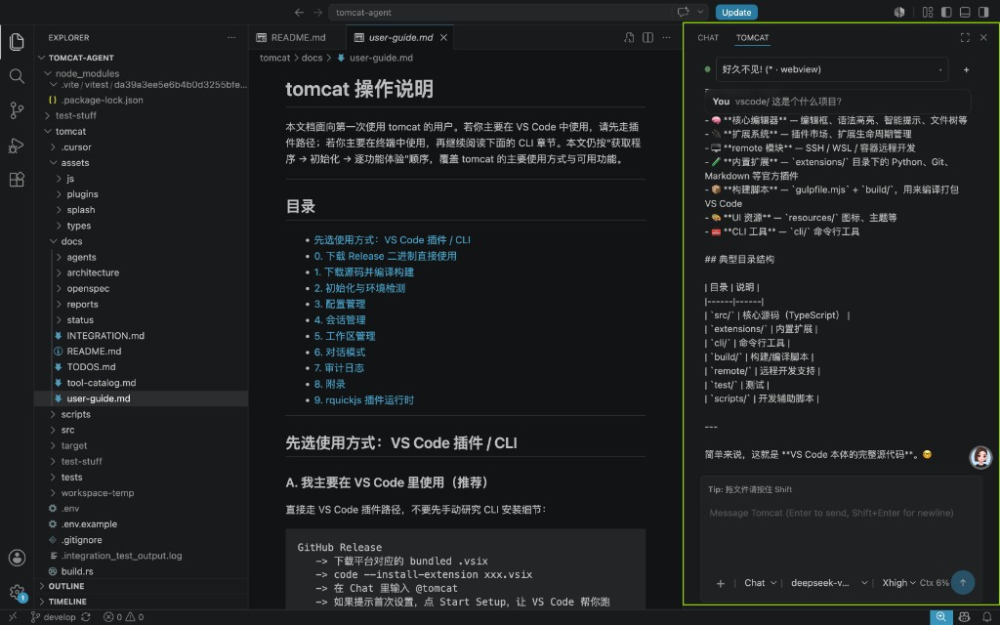

# Tomcat for VS Code

Tomcat Agent Box brings the `tomcat serve --stdio` runtime into a dedicated VS Code sidebar.



This extension is built for **VS Code only**.

## Choose your download

GitHub Release is the primary install channel for this release.

| What you want | Download | Best for |
| --- | --- | --- |
| Fastest, fewest steps | `tomcat-vscode-ext-0.1.2-darwin-arm64.vsix` / `darwin-x64` / `linux-x64` | New users who want Tomcat Agent Box **and** a matching CLI bundled together |
| I already installed the CLI | `tomcat-vscode-ext-0.1.2.vsix` | Existing CLI users who only want the VS Code extension |
| CLI only | `tomcat-cli-v0.1.8-<target>.tar.gz` | Terminal-only usage without the VS Code extension |

If you are unsure, pick the **platform-specific bundled VSIX** for your machine.

## Install in VS Code

1. Download the right `.vsix` file from GitHub Release.
2. Install it:

   ```bash
   code --install-extension /path/to/tomcat-vscode-ext-0.1.2-darwin-arm64.vsix --force
   ```

3. Reload VS Code.

What happens after installation:

```text
Downloads/tomcat-vscode-ext-0.1.2-*.vsix
    -> VS Code installs the extension
    -> VS Code unpacks it into its extensions directory
    -> the bundled CLI lives inside the installed extension
```

The bundled CLI does **not** run from your Downloads folder.

## Open Tomcat Agent Box

1. Press `Cmd/Ctrl+Shift+P`.
2. Run `Tomcat: Focus Agent Box`.
3. VS Code reveals the Secondary Side Bar and focuses Tomcat Agent Box.

You can also open the Secondary Side Bar yourself and click the Tomcat Agent Box icon.

## First-time setup

If this is your first time using Tomcat, the extension will guide you through
setup:

1. Open Tomcat Agent Box.
2. If Tomcat still needs initialization, click `Start Setup`.
3. VS Code opens an integrated terminal and runs `tomcat init` for you.
4. Finish the prompts, then click `I've Finished Setup` if Tomcat does not
   reconnect automatically.

Example first message:

```text
help me understand this repository
```

Tomcat Agent Box restores the active project session by default. Use the
session picker at the top of the panel to switch sessions or create a new one.

## Optional settings

Most users do **not** need to configure anything manually.

You only need these settings when you want to override the default behavior:

```json
{
  "tomcat.path": "/absolute/path/to/tomcat",
  "tomcat.session.defaultCwd": "/absolute/path/to/workspace",
  "tomcat.serve.extraArgs": []
}
```

Resolution order, in plain English:

- `tomcat.path` wins if you explicitly set it.
- Bundled VSIX packages prefer the bundled CLI by default.
- Pure extension installs fall back to `PATH` / shell discovery.

## Commands

The extension contributes these commands:

- `Tomcat: Focus Agent Box`
- `Tomcat: Restart Serve`
- `Tomcat: Start New Session`
- `Tomcat: List Sessions`

## Troubleshooting

If Tomcat Agent Box does not appear:

1. Run `Tomcat: Focus Agent Box` from the Command Palette.
2. If the right-side panel is hidden, show the Secondary Side Bar and try again.
3. Make sure the extension is installed and enabled.
4. Reload the VS Code window.
5. Confirm that your VS Code version is compatible with the extension.

If VS Code says the VSIX is not compatible:

1. Download the platform-specific bundled VSIX that matches your machine.
2. If your platform is not one of the bundled targets, install
   `tomcat-vscode-ext-0.1.2.vsix` and bring your own CLI.

If the extension cannot find Tomcat:

1. Prefer the bundled VSIX for your platform.
2. Otherwise, run `tomcat --version` in a terminal.
3. If that fails, fix your `PATH` or set `tomcat.path`.

If Tomcat was found but still cannot initialize:

1. Click `Start Setup`.
2. Complete `tomcat init` in the integrated terminal.
3. Click `I've Finished Setup` if VS Code does not reconnect on its own.

If Tomcat exits during a conversation:

1. Run `Tomcat: Restart Serve`.
2. Check the `Tomcat` output channel for startup and stderr details.

## Changelog

See [CHANGELOG.md](CHANGELOG.md) for release notes.
