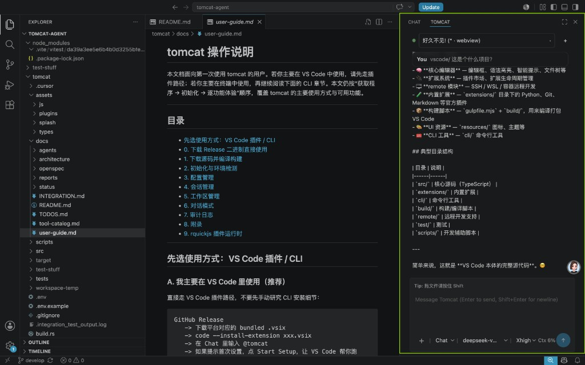

# Tomcat for VS Code

<p align="center">
  <a href="README.md">English</a> |
  <a href="README.zh.md">简体中文</a>
</p>

Tomcat Agent Box brings the `tomcat serve --stdio` runtime into a dedicated VS Code sidebar.



This extension is built for **VS Code only**.

## Choose your download

GitHub Release is the primary install channel for this release.

| What you want | Download | Best for |
| --- | --- | --- |
| Fastest, fewest steps | `tomcat-vscode-ext-0.1.3-darwin-arm64.vsix` / `darwin-x64` / `linux-x64` | New users who want Tomcat Agent Box **and** a matching CLI bundled together |
| I already installed the CLI | `tomcat-vscode-ext-0.1.3.vsix` | Existing CLI users who only want the VS Code extension |
| CLI only | `tomcat-cli-v0.1.8-<target>.tar.gz` | Terminal-only usage without the VS Code extension |

If you are unsure, pick the **platform-specific bundled VSIX** for your machine.

## Install in VS Code

1. Download the right `.vsix` file from GitHub Release.
2. Install it:

   ```bash
   code --install-extension /path/to/tomcat-vscode-ext-0.1.3-darwin-arm64.vsix --force
   ```

3. Reload VS Code.

What happens after installation:

```text
Downloads/tomcat-vscode-ext-0.1.3-*.vsix
    -> VS Code installs the extension
    -> VS Code unpacks it into its extensions directory
    -> the bundled CLI lives inside the installed extension
```

The bundled CLI does **not** run from your Downloads folder.

## Open Tomcat Agent Box

1. Press `Cmd/Ctrl+Shift+P`.
2. Run `Tomcat: Focus Agent Box`.
3. VS Code reveals the Secondary Side Bar and focuses Tomcat Agent Box.

You can also open the Secondary Side Bar yourself and click the Tomcat Agent Box icon.

## First-time setup

If this is your first time using Tomcat, the extension will guide you through
setup:

1. Open Tomcat Agent Box.
2. If Tomcat still needs initialization, click `Start Setup`.
3. VS Code opens an integrated terminal and runs `tomcat init` for you.
4. Finish the prompts, then click `I've Finished Setup` if Tomcat does not
   reconnect automatically.

Example first message:

```text
help me understand this repository
```

Tomcat Agent Box restores the active project session by default. Use the
session picker at the top of the panel to switch sessions or create a new one.
The model picker now also includes an `Add Models...` entry that opens the
dedicated settings center, so you can add custom OpenAI-compatible or
Anthropic-backed models without leaving VS Code.

When Tomcat asks a clarification question:

- it stays in a fixed **Needs your answer** area above the composer and has no timeout;
- unanswered questions in other sessions show a badge in the session picker;
- switching sessions or reloading the webview keeps your unsubmitted selection;
- answering, skipping the whole request, interrupting, or losing the host connection produces a distinct history card. A VS Code window / Extension Host restart is an irrecoverable disconnect, while a webview-only reload keeps the live question pending.

## Files and task progress

The compact **Todos / Files** dock sits above the composer, below any pending question.

- **Files** shows the most recent user turn that actually changed a file. Asking follow-up questions keeps that list; the next turn's first successful file change replaces it rather than accumulating earlier turns.
- Click a file to open one complete VS Code diff: the left side is its first pre-edit backup in that turn (read-only), and the right side is the real, editable file. Multiple edits in the same turn are combined. Existing tool-card diff previews are unchanged.
- Hover or focus a row to reveal **×**. **Undo All** is on the first detail row and restores the restorable subset; confirmation states how many files will be skipped. These actions restore entire files (or delete files newly created in that turn), **overwrite later saved edits, and keep your chat**.
- Unsaved target documents and the current foreground AI/maintenance job block restore. Background Bash and other sessions/worktrees are not stopped or waited for. Git HEAD changes disable restore, not preview.
- Only native write/edit/hashline-edit backups are tracked. Shell/MCP-only changes are not discovered. Backups use the existing retention and historical cleanup rules; older CLIs without the `session_files` capability simply omit Files.

See [session-file-changes](docs/architecture/session-file-changes.md) for scope and implementation details.

## Optional settings

Most users do **not** need to configure anything manually.

You only need these settings when you want to override the default behavior:

```json
{
  "tomcat.path": "/absolute/path/to/tomcat",
  "tomcat.session.defaultCwd": "/absolute/path/to/workspace",
  "tomcat.serve.extraArgs": [],
  "tomcat.layout.controlsInset": 15,
  "tomcat.layout.contentInset": 25
}
```

Sidebar spacing is configured in VS Code Settings: search `tomcat.layout` (User or Workspace settings), then **Developer: Reload Window**. Defaults are Controls Inset **15px** and Content Inset **25px**; explicit User/Workspace values are retained. Values are pixels from the sidebar edge, clamped to 0–40. Controls Inset sets the session bar/input border; Content Inset sets replies/cards/todos/attachments. Keep Content Inset greater than Controls Inset to align input text with replies; otherwise inner padding clamps to zero. The editor grows from one line up to 30% of webview height, then scrolls internally; attachments stay outside it.

Resolution order, in plain English:

- `tomcat.path` wins if you explicitly set it.
- Bundled VSIX packages prefer the bundled CLI by default.
- Pure extension installs fall back to `PATH` / shell discovery.

## Commands

The extension contributes these commands:

- `Tomcat: Focus Agent Box`
- `Tomcat: Open Settings`
- `Tomcat: Restart Serve`
- `Tomcat: Start New Session`
- `Tomcat: List Sessions`

### Resource commands in the composer

```text
Type / → choose a command (inserts text) → send → notice/error reply
```

- `/reload` rescans Skills and plugin tools without restarting the running session. After external CLI or manual resource changes, run it explicitly; it is not a configuration reload or MCP reconnect.
- `/install './path with spaces' agent` and `/uninstall package-name agent` install/uninstall and synchronize automatically. Specify `current-project` (`scope`), `agent`, or `global`; missing arguments return usage.
- Uninstall uses the package name listed by `tomcat packages`, not a tool name. Only ledger-managed packages are uninstalled; manually placed directories must be removed from that layer's `plugins/` / `skills/`, then `/reload`.
- Suggestions open at the start, after whitespace, or on a new line, not inside paths/URLs. Terminal operations are hidden mid-message. Only leading shared operations in text-only drafts execute locally; references/attachments and unknown text remain normal prompts.
- Send, compact, and Build are disabled while a command reply is pending. No fake user turn is added. Servers that do not advertise the command table keep the old composer behavior.

### Project prompt commands, skills and rules

```text
/ menu → Skills / Commands / Terminal
Skills or Commands → yellow invocation chip → send → backend body snapshot
Terminal → ordinary slash text → local operation
```

Project `.cursor/commands/**/*.md` and `.agents/commands/**/*.md` appear in Commands; an optional frontmatter `description` is shown on the second line. Same names from different sources remain distinct. Each group shows three entries plus **Show N more** (four entries are shown directly). Invocation chips have no remove button: select them or place the caret adjacent and use Backspace/Delete. History displays the same chip; retry preserves the originally sent body. Ordinary file/selection references can be inserted repeatedly.

Rules under either directory's `rules/` (`.md` or `.mdc`) only apply with boolean `alwaysApply: true`; they enter **User Custom Instructions**, refresh at the next user turn, and do not activate Cursor globs/intelligent/manual triggers. `/reload` reports counts and skip reasons. Project instruction reads respect Deny but need no tool-path confirmation; agent tools still retain their permission gate. An older CLI shows Terminal only and refuses restored invocation chips without deleting the draft. New draft schema migrates older drafts; an older runtime cannot replay new command/skill history kinds. See [CLI usage and compatibility](../tomcat/docs/user-guide.md#project-commands-and-rules).

## Troubleshooting

If Tomcat Agent Box does not appear:

1. Run `Tomcat: Focus Agent Box` from the Command Palette.
2. If the right-side panel is hidden, show the Secondary Side Bar and try again.
3. Make sure the extension is installed and enabled.
4. Reload the VS Code window.
5. Confirm that your VS Code version is compatible with the extension.

If VS Code says the VSIX is not compatible:

1. Download the platform-specific bundled VSIX that matches your machine.
2. If your platform is not one of the bundled targets, install
   `tomcat-vscode-ext-0.1.3.vsix` and bring your own CLI.

If the extension cannot find Tomcat:

1. Prefer the bundled VSIX for your platform.
2. Otherwise, run `tomcat --version` in a terminal.
3. If that fails, fix your `PATH` or set `tomcat.path`.

If Tomcat was found but still cannot initialize:

1. Click `Start Setup`.
2. Complete `tomcat init` in the integrated terminal.
3. Click `I've Finished Setup` if VS Code does not reconnect on its own.

If Tomcat exits during a conversation:

1. Any pending clarification question is recorded as **Disconnected**; it is not treated as a user skip.
2. Run `Tomcat: Restart Serve`.
3. Check the `Tomcat` output channel for startup and stderr details.

`ask_question.timeout_ms`, `TOMCAT_ASK_QUESTION_TIMEOUT_MS`, and
`TOMCAT__ASK_QUESTION__TIMEOUT_MS` were removed. Old values are ignored with a
migration warning and never create a question deadline.

## Running development checks

Run commands below from `tomcat-vscode-ext` in an independent test shell. Tests keep private HOME/workspace directories and use fixed local model replies; they do not turn off Tomcat's nested-Agent protection. An Agent-hosted shell carrying `TOMCAT_AGENT_ACTIVE=1` is not a normal CLI test environment.

```sh
npm run test:integration -- tests/serve_set_plan_mode.test.ts
npm run test:integration -- tests/serve_set_plan_mode.test.ts tests/serve_get_state_planstate.test.ts
# No positional paths means every tests/**/*.test.ts; an unmatched path fails.
# Standalone packaging smoke prepares its own build.
npm run test:integration -- tests/package_vsix_smoke.test.ts
npm run check:wire
npm run gate:full
```

`package:vsix` and standalone package smoke tests build by default. The smoke setup runs its build asynchronously with bounded process-group cleanup; `gate:full` owns one build and reuses it for sequential packaging. `--skip-build` validates a content-hash record and rejects missing, stale, or corrupt artifacts. Do not run builds/packages that share `out`/`gui/dist` concurrently.

GUI entry points clean known Electron window-mode variables only for the launch and restore them afterward. They retain unique launch logs under the printed artifact directory. Screenshots must show the **test window**, not the user's desktop; keep the matching accessibility and console records. A successful install is not visual acceptance. See [the remediation evidence ledger](../tomcat/docs/reports/acceptance-remediation.md) for this run's successes, failures, and unfinished checks.

## Changelog

See [CHANGELOG.md](CHANGELOG.md) for release notes.
