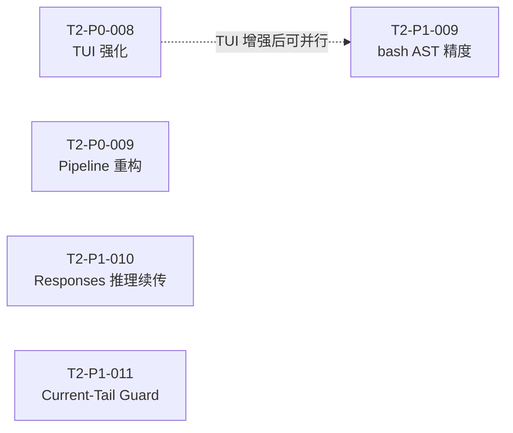

# 任务总看板 — 002-single-agent-complete

> 当前迭代：**单 Agent 完善期**。本看板同时承载迭代立项（目标/不做范围/验收/风险）与**仍开放**任务的执行调度。
>
> **已完成 / 已取消**的 T2 任务卡已从本索引移除，历史见 Git（`agents/TASK_BOARD_002/tasks/` 提交记录）。

---

## 1–2. 迭代立项与当前上下文

立项（§1.1–§1.5）、风险、优先级说明及 **§2 当前迭代上下文** 的完整正文见 **[SCOPE_AND_CONTEXT.md](./SCOPE_AND_CONTEXT.md)**。

---

## 3. 任务状态说明

| 状态 | 含义 |
|------|------|
| **TODO** | 待认领 |
| **DOING** | 开发中（已认领） |
| **PENDING_INTEGRATION** | 等待集成测试与合并：工程师已在功能分支按 [INTEGRATION_MERGE_AND_ACCEPTANCE.md](../INTEGRATION_MERGE_AND_ACCEPTANCE.md) 完成集成与 E2E 全量验收并推送；等待 Nibbles 合并入 develop 并复核通过 |
| **BLOCKED** | 阻塞（需在「阻塞点」中说明原因） |

**典型流转**：`TODO → DOING → PENDING_INTEGRATION → DONE`（完成后自本索引移除，仅留 Git 历史）。仅状态为 `TODO` 且负责人为空的任务可被认领。

---

## 4. 任务索引（开放中）

按 P0 → P1 排序。认领时先读本节，再打开对应 `tasks/T2-*.md`。

**门禁口径**：fmt/clippy、分类集成与全量验收以 [INTEGRATION_TEST_SPEC §7](../../openspec/specs/guides/testing/INTEGRATION_TEST_SPEC.md)（§7.1 / §7.2 / §7.4）为准；E2E 见 [E2E_TEST_SPEC.md](../../openspec/specs/guides/testing/E2E_TEST_SPEC.md)。integration 二进制分组以 [`scripts/test-groups.sh`](../../scripts/test-groups.sh) 为准；交付前更新分组见 [Dispatcher §5](../Dispatcher.md)。

| ID | 名称 | 状态 | 负责人 | 分支 | 文件 |
|------|------|------|--------|------|------|
| **T2-P0-008** | TUI 体验强化（合并 TASK-08） | `TODO` | — | `feature/tui-experience` | [tasks/T2-P0-008.md](./tasks/T2-P0-008.md) |
| **T2-P0-009** | 三套管道重构 | `TODO` | — | `feature/pipeline-unify` | [tasks/T2-P0-009.md](./tasks/T2-P0-009.md) |
| **T2-P1-009** | bash AST `detect_unsupported` 精度与误伤治理 | `TODO` | — | `feature/bash-ast-detect-precision` | [tasks/T2-P1-009.md](./tasks/T2-P1-009.md) |
| **T2-P1-010** | OpenAI / DeepSeek 推理续传 | `DOING` | Jerry | `feature/reasoning-continuity` | [tasks/T2-P1-010.md](./tasks/T2-P1-010.md) |
| **T2-P1-011** | Current-Tail Aggregate Guard（阶段二预防型上下文减负） | `DONE` | Spike | `feature/current-tail-aggregate-guard` | [tasks/T2-P1-011.md](./tasks/T2-P1-011.md) |

## 5. 开放任务依赖（概览）

> **注**：T2-P1-009 依赖 **T2-P0-016** bash AST 骨架（已合入 `develop`）；与 T2-P0-008 / T2-P0-009 无硬阻塞。**T2-P1-010** 与 thinking CLI 折叠/去重独立，可并行认领。**T2-P1-011** 与 T2-P0-009 同属 `agent_loop/context` 热区，但无硬阻塞；认领前先同步最新 `develop` 以减少核心路径冲突。

---
