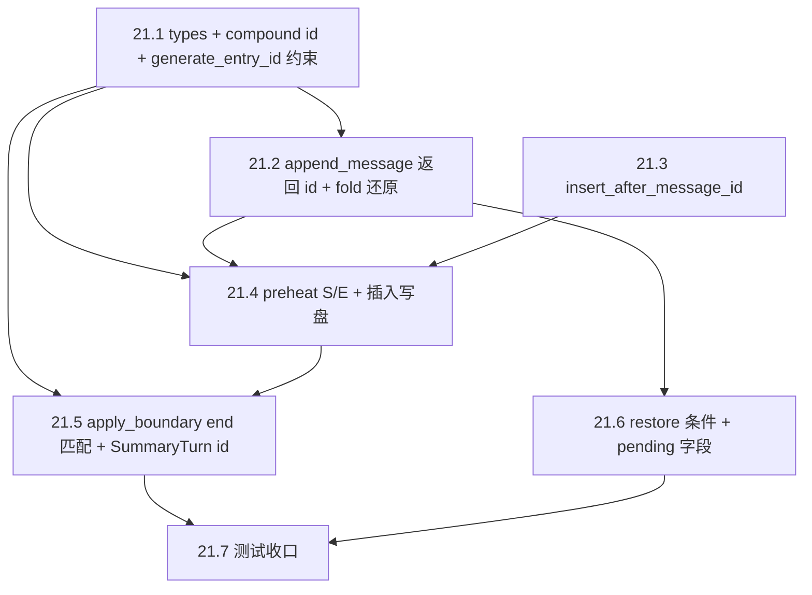

---

name: TASK-21 §5.7 消息级 ID 与 compaction 锚点对齐（历史示例）
overview: 这是一个按当前 5 章规范重排的历史计划案例；核心目标是让 `UserTurn`、`BranchSummaryEntry`、JSONL transcript 与 `apply_boundary` 都按 MessageId / `S::E` / 锚点后插入 的同一套边界语义对齐。
isProject: false
todos:

- id: claim-board-branch
content: 历史流程：认领 TASK-21、确认分支并与 develop 同步
status: pending
- id: context-read
content: 阅读 TASK-21 相关上下文、架构约束与历史任务拆分
status: pending
- id: types-userturn-ids
content: UserTurn 增加 start_id / end_id，并约束 id 为 start_id::end_id
status: pending
- id: append-return-id-pack-fold
content: append_message / try_append_message 返回 MessageId；pack/fold 统一按 MessageId 回填
status: pending
- id: transcript-insert-anchor
content: transcript 支持按 MessageEntry.id == E 之后插入 compaction 行
status: pending
- id: preheat-S-E
content: Preheat 使用 S/E 生成 BranchSummaryEntry.id = S::E，并走锚点插入写盘
status: pending
- id: apply-boundary-end-k
content: apply_boundary 主路径按 UserTurn.end_id == E 定位 splice 边界，并保留旧 turn-id 回退
status: pending
- id: restore-hydrate
content: restore / hydrate 路径改用 end_id 匹配，并兼容旧数据
status: pending
- id: tests-578
content: 补齐 transcript 插入、restore、splice、多 turn 与冲突策略测试
status: pending
- id: dev-gates
content: 按 INTEGRATION_MERGE_AND_ACCEPTANCE 执行全量门禁与集成/E2E 验收
status: pending
- id: status-ship
content: 持续更新 status，完成后标记 PENDING_INTEGRATION 并提交推送
status: pending

---

# 计划范例：TASK-21 §5.7 消息级 ID 与 compaction 锚点对齐

> **⚠️ 过时提示（2026-04）**：本示例基于重构前架构，其中 `UserTurn`、`SummaryTurn`、`TurnEntry`、`user_turns_list`、`fold_entries_to_turns`、`on_new_user_turn`、`compound_turn_id` 等概念已在 `feature/collapse-to-chatmsg` 分支中删除。统一为 `ChatMessage` + `MessageKind`，详见 [collapse-to-chatmsg-guide.md](../../docs/reports/collapse-to-chatmsg-guide.md)。本文仅保留作为计划格式范例参考。
>
> 本文档由 Cursor 计划 `task-21_消息级_id` 迁入仓库，**路径已改为以 `agents/plan/` 为基准的相对链接**。任务已在主线完成；当前版本已按 [PLAN_SPEC.md](./PLAN_SPEC.md) 的 `frontmatter + 5 章主干` 重排，同时保留原计划中的历史流程、Todo 总表与收尾章节，供对照旧案例时取材。

本文展示的是“如何把一份旧版长计划改造成新版 5 章主干，同时不丢历史信息”。
说人话：主干现在按新规范读，老内容还在，只是被收进更清楚的章节里。

## 1. 背景

本章先交代这个历史任务当时要解决什么、涉及哪些子项、当时的执行边界是什么，以及现状和目标差距在哪里。
说人话：先把“这件事为什么值得做、现在到底哪没对齐”讲明白，后面讨论方案和决策才有落点。

### 1.1 历史定位与适用范围

**说人话**：先说明这份历史案例今天还能怎么用，避免把它误当成当前代码架构的现行说明书。


| 项     | 内容                                                                     | 说人话                     |
| ----- | ---------------------------------------------------------------------- | ----------------------- |
| 历史背景  | 本任务对应当时的 `TASK-21 §5.7`，目标是把消息级 id、compaction 锚点、restore/apply 语义统一起来。 | 这是个“把边界语义一次讲清”的历史任务。    |
| 当前用途  | 现保留为**新版计划规范下的历史样例**，不再作为现行架构的实现说明。                                    | 现在看它，重点是学写法，不是照抄旧代码设计。  |
| 架构时效性 | 文中的 `UserTurn`、`SummaryTurn`、`TurnEntry` 等概念已经过时。                      | 代码语义变了，但计划如何组织内容仍有参考价值。 |


### 1.2 认领与分支（历史流程保留）

- 在当时看板（`001-mvp` 期看板已随 `openspec/specs/archive/` 移除，仅能从 **Git 历史** 查看）将 **TASK-21** 负责人改为 **Jerry**、状态改为 **DOING**；**分支**列填写**当前实际 Git 分支名**（例如已在 `feature/context-async-compaction` 上则填该名）。**不**另建看板曾建议的 `feature/context-message-ids`，在本分支完成即可。
- **依赖**：TASK-20 为 `PENDING_INTEGRATION`。实施前将 `**develop`（含 TASK-20 合并结果）** 合并或 rebase 进**当前分支**，避免与主线长期分叉；无需为 TASK-21 单独再开一条功能分支。
- **行为规范**：编码、测试、提交、文档均须遵循 [Constitution.md](../../openspec/specs/Constitution.md) 与 Jerry 引用的各规范链接。

**说人话**：这节保留的是当年开工前的流程约束，重点不是命令细节，而是说明这类长任务在真正编码前要先把分支、依赖和责任人对齐。

### 1.3 研发流程（历史流程保留）

**说人话**：这张表讲的是当时从读上下文到最终交付的老流程，保留它是为了让读者看到“计划不只写代码，还要写过程控制”。


| 阶段           | 动作                                                                                                                                                                                                                                                                                                                            | 说人话                     |
| ------------ | ----------------------------------------------------------------------------------------------------------------------------------------------------------------------------------------------------------------------------------------------------------------------------------------------------------------------------- | ----------------------- |
| **读上下文（§3）** | 除 §5.7 外，对照当时迭代任务拆分与设计说明（原 `openspec/specs/archive/001-mvp/*`，已移除，见 **Git 历史**）中与 TASK-21 相关的原子子任务与边界；扫一眼 Architecture / Constitution 是否有关联约束。对应 todo：`context-read`。                                                                                                                                                         | 先把任务边界和旧设计补齐，不然容易只修表面。  |
| **开发前**      | 工作区非 detached；已在目标分支上；按需与 `develop` 同步；阅读 [编码规范](../../openspec/specs/guides/coding/Codeing&Architecture_Spec.md)。含在 `claim-board-branch` / `context-read`。                                                                                                                                                                   | 开工前先把分支和规范站稳。           |
| **开发中（§5）**  | 编码（必要处注释）→ 单测 → 集成测；**每完成一个 21.x 或一块连贯改动即提交**（禁止囤积多子项一次提交）。                                                                                                                                                                                                                                                                   | 一块一块做，一块一块收口。           |
| **门禁**       | `cargo fmt --all`、`cargo clippy --all-targets -- -D warnings`。**缩小范围**验证（单 crate / 过滤测试名 / `cargo test -j 1 … 某用例 -- --test-threads=1`）可前台短时跑。**§4 全量集成/E2E** 必须严格按 [INTEGRATION_MERGE_AND_ACCEPTANCE.md](../INTEGRATION_MERGE_AND_ACCEPTANCE.md)（见下文 **全量集成/E2E 执行规范**）；质量红线与顺序仍以该文档 §1 前质量红线、§「交付顺序」为准。对应 todo：`dev-gates`。 | 小范围可以快跑，全量一定按流程来，别赌运气。  |
| **提交与进度**    | 按 [commit-guard.mdc](../../.cursor/rules/commit-guard.mdc)；**历时**更新 `docs/status/` 下与**当前 Git 分支**对应的 md（分支名中 `/` 换成 `-`；见 [STATUS_GUIDE.md](../../openspec/specs/guides/workflow/STATUS_GUIDE.md)）。对应 todo：`status-ship`。                                                                                                    | 计划不是写完就算，过程中还要持续报状态。    |
| **完成（§7）**   | 自检通过后在对应 `**TASK_BOARD_002/tasks/T2-*.md`** 标 `PENDING_INTEGRATION`、推送远端；集成合并后由流程标 `DONE`。                                                                                                                                                                                                                                    | 做完不是嘴上说完，要把状态和交付动作一起收口。 |


### 1.4 子项清单与状态（对照看板 21.1～21.7）

**说人话**：先把任务拆成清楚的几块，后面讨论实现时才不会“说的是同一个任务，脑子里却不是同一件事”。


| 子项   | 内容                                                                                                   | 计划状态 | 说人话                         |
| ---- | ---------------------------------------------------------------------------------------------------- | ---- | --------------------------- |
| 21.1 | `UserTurn` 增加 `start_id`/`end_id`，`id` ≡ `start_id::end_id`；`SummaryTurn.id` 与 compaction 行一致        | 待做   | 先把 turn 的边界语义讲清。            |
| 21.2 | pack：`api/chat` 落盘后回填；fold：从 `MessageEntry.id` 还原                                                    | 待做   | 让内存和 transcript 真正用同一套 id。  |
| 21.3 | transcript：按 `MessageEntry.id == E` **之后**插入 compaction；锚点缺失策略                                       | 待做   | 不再只会尾插，要能插到语义正确的位置。         |
| 21.4 | Preheat：`S`/`E` 与 `BranchSummaryEntry.id = S::E`；成功后走 21.3；`transcript_compaction_entry_id` 存整串      | 待做   | summary 自己的 id 也要和覆盖边界对齐。   |
| 21.5 | `apply_boundary`：主路径 `UserTurn.end_id == E`，`splice(0..=k, [SummaryTurn])`；旧 turn-id 回退              | 待做   | apply 侧也要按新语义找边界。           |
| 21.6 | `branch_summary_pending_from_entry` / `restore_completed` / `init_context_state` hydrate 与 §5.7.7 一致 | 待做   | restore 不能还按旧 turn-id 假设工作。 |
| 21.7 | 单测/集成测覆盖 §5.7.8 可表达场景                                                                                | 待做   | 不把场景测通，前面几项都只是口头对齐。         |


### 1.5 目标与验收（含作用/意义）

**要做出什么**：运行时 `user_turns_list`、Layer 1 快照、`BranchSummaryEntry`/`CompactionResult`、JSONL 行序与 Layer 2 splice 全部按 §5.7 的 **MessageId / `S::E` / 锚点后插入** 对齐。

**验收**（与看板 + §5.7.8 一致）：`cargo fmt --all`（或 `cargo fmt --check` 满足 CI）、`cargo clippy --all-targets -- -D warnings`；行为与 ASCII 总览及 5.7.1～5.7.6 条文一致；**标 `PENDING_INTEGRATION` 前**须完成 [INTEGRATION_MERGE_AND_ACCEPTANCE.md](../INTEGRATION_MERGE_AND_ACCEPTANCE.md) 分支侧 **§4 全量测试与验收**（执行方式见下文，**禁止**未确认全量通过即标集成）。

**用户故事/场景与意义**（分步）：

1. **持久化与内存一致**：用户多轮对话后，transcript 中每条 message 的 id 与内存 `UserTurn` 边界一一对应。**作用**：fold 与运行时共用同一套 id。**意义**：避免 restore/apply 因「turn 随机 id」找不到覆盖区间（不做则 §5.7.8 场景 2/3/4 易错）。
2. **Compaction 行插在语义锚点之后**：摘要覆盖段结束后若仍有新消息，compaction 行仍落在正确时间序。**作用**：`fold_entries_to_turns` 与磁盘顺序一致。**意义**：避免 fold 错位（场景 3）。
3. **apply 以 `end_id` 为主定位 `k`**：**作用**：与 L3 删前缀后「仅尾锚命中」规范一致。**意义**：与现有「start 缺失则从 0 splice 到 end」兼容路径合并为明确主路径 + 回退（场景 4）。

**说人话**：这一节真正回答的是“做成以后用户和系统分别得到什么”，不是单纯列要改哪些代码点。

### 1.6 当前基线 / 现状与差距（关键代码）

**说人话**：下面这些不是零散代码观察，而是在说明旧实现哪里和目标语义没有对齐。

- `[TurnEntry::UserTurn](../../src/core/session/manager/types.rs)` 仅有单一 `id`；`[apply_boundary](../../src/core/session/manager/types.rs)` 用 `t.id() == covered_start_id/end_id` 定位区间，且 `SummaryTurn` 使用临时 `summary_*` id，与 §5.7.5/5.7.3 不符。
- `[Preheat::try_start](../../src/core/compaction/preheat.rs)` 中 `first_id`/`last_id` 来自 `t.id()`（将变为复合 id 后**不能**再代表 `S`/`E`）；`BranchSummaryEntry.id` 为随机 `generate_entry_id()`，与 §5.7.3 的 `**S::E`** 不符；`[append_entry](../../src/core/session/transcript.rs)` 仅尾部追加，不满足 §5.7.4「插在 `id == E` 的 message 行之后」。
- `[api/chat/mod.rs](../../src/api/chat/mod.rs)` 先 `on_new_user_turn`（随机 id）再 `append_message`，内存 turn id 与 transcript message id **脱钩**。
- `[fold_entries_to_turns](../../src/core/session/manager/context.rs)` 仅在遇到 user 时用 `current_turn_id`（单值）作为整段 turn id，未区分 **首/末 message id**。
- `[init_context_state](../../src/core/session/manager/context.rs)` 中 `restore_completed` 条件 `t.id() == p.covered_end_id` 在 `covered_end_id` 为 message 级 **E** 后需改为匹配 `**end_id`**（并保留旧数据回退）。

**背景小结（说人话）**：这个任务的核心不是“多一个字段”，而是把内存 turn、磁盘 transcript、compaction summary、restore/apply 的边界语义全部收成一套。只修其中一两处，剩下的路径还是会继续错位。

## 2. 竞品 / 方案对比

原始历史计划没有单独写这一章；这里按新规范把当时隐含的方案取舍补齐。
说人话：不是只有“最终方案”，而是把当时为什么这么选、为什么不走别的路补讲清楚。

### 2.1 数据模型与边界语义方案对比

**说人话**：这张表是把“到底修模型还是补补丁”这件事讲清楚，不然读者只会看到最后拍板，不知道为什么这么拍。


| 方案                            | 核心做法                                                                           | 优点                           | 风险 / 成本                                                   | 结论  | 说人话                       |
| ----------------------------- | ------------------------------------------------------------------------------ | ---------------------------- | --------------------------------------------------------- | --- | ------------------------- |
| 保留旧单一 turn-id                 | `UserTurn` 继续只有随机 `id`，fold/apply/restore 各自做额外映射                              | 改动面最小                        | 内存 turn 边界和 transcript message 边界仍然脱钩；Preheat/apply 只能继续猜 | 不采用 | 看着最省事，但根因没动。              |
| 只修 compaction 路径局部补丁          | 不改 `UserTurn` 模型，只在 preheat / apply_boundary / transcript 上补特殊逻辑               | 局部路径可先跑通                     | pack/fold 仍不共享同一套语义，后续 restore 和 JSONL 行序仍容易再错            | 不采用 | 这里只补一针，别处还是漏。             |
| `start_id/end_id + id = S::E` | `UserTurn` 显式带首尾 message id；summary / transcript / apply 统一按 `S::E` 和 `E` 锚点工作 | 内存、磁盘、restore、apply 共用一套边界语义 | 需要批量调整 pack/fold/preheat/apply/transcript 调用点             | 采用  | 一次把“边界怎么定义”讲清，以后不再每处各猜各的。 |


### 2.2 写盘与 splice 方案对比

**说人话**：这里比较的是 summary 到底写哪、apply 到底按什么边界找，不是另起一套新设计。


| 方案                           | 核心做法                                          | 优点                   | 风险 / 成本                                   | 结论  | 说人话                                                |
| ---------------------------- | --------------------------------------------- | -------------------- | ----------------------------------------- | --- | -------------------------------------------------- |
| compaction 行继续尾插             | 所有 summary 统一追加到 transcript 末尾                | 实现最简单                | JSONL 时间序与真实覆盖区间脱钩，fold 顺序可能错             | 不采用 | 写起来省事，读回来就乱。                                       |
| 按 `MessageEntry.id == E` 后插入 | 找到覆盖段最后一条 message 的 id，在其后插入 compaction 行     | transcript 行序与覆盖语义一致 | 需要新增插入 API，并考虑锚点缺失策略                      | 采用  | 真正的语义锚点在哪，就插在哪。                                    |
| apply 仍按旧 `id()` 命中          | `ContextState::apply_boundary` 沿用旧 turn-id 查找 | 迁移成本低                | 新 summary 的 `covered_end_id = E` 后会和旧逻辑错位 | 不采用 | summary 说的是 message 边界，apply 却还按旧 turn-id 找，迟早对不上。 |


**本章小结（说人话）**：这份历史计划真正拍板的不是“多几个字段”，而是“以后所有路径都按 message 级边界说话”。一旦这个主线定了，append 返回 id、锚点插入、`end_id` 定位这些后续动作才顺起来。

## 3. 评审 QA

本章把这份历史计划里最容易在评审时被追问的点，用当前规范要求的 `专业描述 / 结论 / 说人话` 形式补齐。
说人话：下面这些问题，当时如果不提前讲透，代码做到一半一定会被问回来。

### Q1. 为什么 `UserTurn` 必须从“单一随机 id”改成 `start_id/end_id`？

**专业描述**
旧模型下，`UserTurn.id` 只是一个 turn 级随机值，无法直接表示 transcript 中首条 / 末条 message 的真实边界；而 preheat、restore、apply_boundary、JSONL transcript 又都在不同位置需要知道覆盖段的真实起止。

**结论**
`UserTurn` 必须显式携带 `start_id`、`end_id`，并约束 `id = start_id::end_id`，让 turn 自身就成为 message 边界的派生表示。

**说人话**
turn 如果自己都不知道“我是从哪条 message 到哪条 message”，那后面所有摘要、恢复、splice 都只能靠猜。

### Q2. 为什么 `append_message` / `try_append_message` 要返回新写入的 MessageId？

**专业描述**
pack 路径需要在 transcript 真正落盘后，用最后一条 message 的 id 回填 `UserTurn.start_id/end_id`。如果 API 不返回新写入 id，就只能二次扫描 transcript 或继续沿用旧随机 id。

**结论**
`SessionManager::{append_message, try_append_message}` 应改为返回 `Result<String, AppError>`，把新分配的 `MessageEntry.id` 直接交给调用方。

**说人话**
既然刚写进去了，就顺手把 id 带回来；别让调用方再回头翻账本。

### Q3. 为什么 compaction 行必须插在 `MessageEntry.id == E` 之后，而不是继续尾插？

**专业描述**
summary 覆盖的是 `[S, E]` 这段消息区间。若 compaction 行只会尾插，transcript 的磁盘时间序就不再等于语义时间序，fold 时会出现“summary 看起来比它覆盖的消息更晚出现”的错位。

**结论**
新增 `insert_entry_after_message_id(path, E, entry)`，并让 preheat 成功路径统一走锚点插入。

**说人话**
摘要是替代前面那段消息的，就该插在那段消息后面，而不是永远堆到文件尾巴。

### Q4. 为什么 `apply_boundary` 主路径要改成按 `UserTurn.end_id == E` 定位？

**专业描述**
新的 `covered_end_id` 表示 message 级别的 `E`，而不再是旧的 turn-id。若 `apply_boundary` 继续用 `t.id()` 直接比对，就无法稳定找到 splice 的结束边界。

**结论**
主路径改为寻找最小 `k` 使 `UserTurn.end_id == covered_end_id`；旧数据缺少独立 `end_id` 时，再按旧 `id()` 的右半段回退。

**说人话**
summary 既然说“我覆盖到这条 message 为止”，apply 就该按这条 message 找，不该继续拿旧 turn-id 硬套。

### Q5. 为什么这份计划坚持保留旧数据回退？

**专业描述**
TASK-20 以及更早写入的 transcript / snapshot 数据并不一定包含新的 `start_id/end_id` 语义。如果迁移时只支持新格式，restore/fold/apply 会直接在历史数据上失效。

**结论**
fold、apply、restore 相关路径都要同时保留旧数据回退：缺 `MessageEntry.id` 时继续 `generate_entry_id`，缺独立 `end_id` 时允许从旧复合值或旧 `id()` 还原。

**说人话**
新语义要立住，但老数据不能直接判死刑。

### Q6. 为什么 `MessageId` 还要额外约束不能含 `::`？

**专业描述**
`UserTurn.id` 现在要用 `start_id::end_id` 作为复合表达。如果底层 message id 自己就可能含 `::`，复合 id 的解析和回退都会变得不可靠。

**结论**
在 `generate_entry_id` 或写入前加入对 `::` 的约束 / 断言，保证复合 id 的可逆性。

**说人话**
分隔符既然拿来拼 id，就别让原始 id 自己也带这个分隔符。

## 4. 决策表

本章把这份历史计划真正拍板的内容收成决策表，再把原有实施细节完整挂到 `实施点 + 小结` 下。
说人话：先看这张表知道“到底怎么定”，再往下看每个实施点的细节和历史补充。


| 议题                   | 主要参考                                  | 决策                                                                          | 落地方式                                                                             | 说人话                        |
| -------------------- | ------------------------------------- | --------------------------------------------------------------------------- | -------------------------------------------------------------------------------- | -------------------------- |
| `UserTurn` 边界语义      | §5.7.1、`types.rs`                     | 采用 `start_id/end_id`，并约束 `id = start_id::end_id`                            | 改 `TurnEntry::UserTurn` 字段与构造逻辑；补 `compound_turn_id`                             | turn 自己就要知道自己的 message 边界。 |
| pack / fold 统一 id 来源 | §5.7.2、`session_impl.rs`、`context.rs` | `append_message` / `try_append_message` 返回 MessageId；fold 用首末 message id 还原 | 改返回签名；chat / dispatcher 等调用点同步消费                                                 | 内存和 transcript 以后都认同一套 id。 |
| transcript 锚点插入      | §5.7.4、`transcript.rs`                | 新增 `insert_entry_after_message_id`，在 `E` 后插入 compaction 行                   | preheat 成功路径走锚点插入；保留 `append_entry` 作回退                                          | summary 应该出现在它真正覆盖段的后面。    |
| preheat 的 summary id | §5.7.3、`preheat.rs`                   | `BranchSummaryEntry.id = S::E`                                              | 从 snapshot 首末 turn 取 `S` / `E`，写入 `covered_`* 和 `transcript_compaction_entry_id` | summary 自己的 id 也要和覆盖边界一致。  |
| apply_boundary 主路径   | §5.7.5、`types.rs`                     | 主路径按 `UserTurn.end_id == E`；旧 turn-id 作回退                                   | `splice(0..=k, [SummaryTurn])`，`SummaryTurn.id` 取 `S::E` 或等价值                    | apply 侧也要按 message 级边界找位置。 |
| restore / hydrate 兼容 | §5.7.7、`context.rs`                   | 新语义生效，同时兼容旧数据                                                               | `restore_completed` 支持 `end_id` 与旧 `id()` 双路匹配                                   | 新计划落地不能把旧数据读坏。             |
| 测试收口                 | §5.7.8、`tests/`                       | 单测、集成测、全量门禁一起覆盖                                                             | transcript / restore / splice / 冲突策略 / 全量 E2E                                    | 不把场景测出来，这套语义就是纸上方案。        |


### 4.1 实施点 + 小结

本小结按当前 [PLAN_SPEC.md](./PLAN_SPEC.md) 的要求重排，并保留原计划中的实现细节。以下内容继续覆盖：

- 涉及的文件与模块
- 实现思路
- 依赖的现有接口或需新建的接口
- 预期的测试要点

规格单一来源与补充文档保持原计划口径：

- §5.7 正文（历史任务卡与设计说明）
- `[INTEGRATION_MERGE_AND_ACCEPTANCE.md](../INTEGRATION_MERGE_AND_ACCEPTANCE.md)`
- `[INTEGRATION_TEST_SPEC.md](../../openspec/specs/guides/testing/INTEGRATION_TEST_SPEC.md)`

说人话：下面开始进入“真要落代码时从哪下手”的部分，老计划里的实现细节都还在，只是现在更容易顺着读。

#### 4.1.0 One-Glance Map（按当前规范补齐）

```text
┌────────────────────────────────────────────────────────────┐
│ src/api/chat/mod.rs                                       │
│ • append user / assistant / tool                          │
│ • 回填 start_id / end_id 后再 pack UserTurn                │
└────────────────────────────┬───────────────────────────────┘
                             ▼
┌────────────────────────────────────────────────────────────┐
│ src/core/session/manager/session_impl.rs                  │
│ • append_message / try_append_message 返回 MessageId      │
│ • generate_entry_id 约束 `::`                            │
└────────────────────────────┬───────────────────────────────┘
                             ▼
┌────────────────────────────────────────────────────────────┐
│ src/core/session/manager/types.rs                         │
│ • UserTurn { id, start_id, end_id }                       │
│ • apply_boundary 主路径按 end_id == E                      │
└───────────────┬─────────────────────────────┬──────────────┘
                ▼                             ▼
┌────────────────────────────────┐   ┌──────────────────────────────┐
│ src/core/session/manager/      │   │ src/core/compaction/preheat.rs│
│ context.rs                     │   │ • snapshot 取 S / E          │
│ • fold_entries_to_turns        │   │ • BranchSummaryEntry.id=S::E │
│ • init_context_state / restore │   │ • transcript 写盘走锚点插入   │
└────────────────┬───────────────┘   └──────────────┬───────────────┘
                 ▼                                  ▼
       ┌──────────────────────────────────────────────────────┐
       │ src/core/session/transcript.rs                      │
       │ • insert_entry_after_message_id                     │
       │ • write_file_atomic                                 │
       └────────────────────────────┬─────────────────────────┘
                                    ▼
       ┌──────────────────────────────────────────────────────┐
       │ tests/context_management_tests.rs / 相关单测         │
       │ • transcript 插入 / restore / splice / 冲突策略      │
       └──────────────────────────────────────────────────────┘
```

**阅读顺序（说人话）**：先看 `chat/mod.rs` 和 `session_impl.rs`，搞清楚 MessageId 从哪来；再看 `preheat.rs` 和 `transcript.rs`，理解 summary 怎么以 `S::E` 和锚点插入落盘；最后看 `types.rs`、`context.rs` 和测试，确认 restore / apply / splice 都按同一套边界语义工作。

#### 4.1.1 子项与 API 一览（历史保留）

**说人话**：这张表是把每个子项到底动哪些已有接口、又要补什么新能力先摊开，避免实现时边做边猜。


| 子项   | 主要已有接口                                                                                             | 计划新建或变更                                                                                                           | 说人话                                  |
| ---- | -------------------------------------------------------------------------------------------------- | ----------------------------------------------------------------------------------------------------------------- | ------------------------------------ |
| 21.1 | `TurnEntry`、`generate_entry_id`                                                                    | `compound_turn_id`（或等价）；`UserTurn` 字段；MessageId 与 `::` 的校验策略                                                      | 先把类型层的边界语义立住，后面几项才有共同语言。             |
| 21.2 | `SessionManager::append_message` / `try_append_message`、`on_new_user_turn`、`fold_entries_to_turns` | 两者返回 `MessageEntry` 新 id；chat 与 **dispatcher**（[session_ops.rs](../../src/ext/dispatcher/session_ops.rs)）等所有调用点同步 | 先把写入时拿到的 message id 带出来，fold 才能准确还原。 |
| 21.3 | `append_entry`、`write_file_atomic`                                                                 | `insert_entry_after_message_id`                                                                                   | 写盘位置一旦错，后面 fold 再聪明也还是会读错顺序。         |
| 21.4 | `Preheat::try_start`、`BranchSummaryEntry` / `CompactionResult`                                     | 快照 S/E 来源、`id = S::E`、写盘走插入 API                                                                                   | summary 自己的 id 和覆盖区间要用同一套语义。         |
| 21.5 | `ContextState::apply_boundary`、`set_branch_summary_entry_is_boundary_true`                         | 匹配与 splice 语义；`SummaryTurn.id` 来源                                                                                 | apply 侧必须能按新的 `E` 找到真正的 splice 终点。   |
| 21.6 | `branch_summary_pending_from_entry`、`init_context_state`、`restore_completed`                       | restore 条件（`end_id` + 旧数据回退）                                                                                      | restore 不能只支持新数据，还得把旧盘上的东西接住。        |


#### 4.1.2 实施点 21.1：类型与内存（todo: `types-userturn-ids`）

- **文件**：[types.rs](../../src/core/session/manager/types.rs)、（可选）manager `mod` 导出辅助函数。
- **思路**：为 `UserTurn` 增加 `start_id: String`、`end_id: String`；`id` 字段保留但**约束**为 `format!("{start_id}::{end_id}")`（与文档 `::` 一致）。新增小函数如 `fn compound_turn_id(start: &str, end: &str) -> String`；在构造处统一调用。§5.7.1 要求 MessageId 不含子串 `::`：在 `[generate_entry_id](../../src/core/session/manager/session_impl.rs)` 或写入前加断言/校验（与现有 id 格式核对）。
- **接口**：扩展 `TurnEntry::UserTurn { id, start_id, end_id, ... }`；`id()` 仍返回 `&str`（即复合 id）。所有构造 `UserTurn` 的站点（chat、fold、单测 `make_user_turn` 等）补齐字段。
- **测试要点**：复合 id 解析辅助函数；非法 `::` 入参（若做校验）应失败或拒绝拼接。

**说人话**：这一点是整份计划的地基，类型边界不改清楚，后面的写盘、restore、splice 都只能继续打补丁。

#### 4.1.3 实施点 21.2：pack / fold（todo: `append-return-id-pack-fold`）

- **文件**：[session_impl.rs](../../src/core/session/manager/session_impl.rs)（`append_message` / `try_append_message`）、[api/chat/mod.rs](../../src/api/chat/mod.rs)、[context.rs](../../src/core/session/manager/context.rs)、[session_ops.rs](../../src/ext/dispatcher/session_ops.rs) 等一切调用 `append_message` / `try_append_message` 的路径。
- **思路（pack）**：**pack** 指回合收尾时构造 `TurnEntry::UserTurn` 并调用 `on_new_user_turn`（非单独函数名）。当前用户句在 L343–344 已 `append_message`；回合结束后再写 assistant/tool。需**拿到每条落盘 message 的 id**：将 `append_message` / `try_append_message` 改为返回 `Result<String, AppError>`（新分配的 `MessageEntry.id`）。在 chat 中：记录 **user 行 id** 为 `start_id`；对 `convert_to_llm_format(&result.new_messages)` 的每次 append 记录 **最后一条 id** 为 `end_id`；然后构造 `UserTurn` 并 `on_new_user_turn`（顺序改为：**先写满 transcript，再 pack 内存**，与「回填」一致）。若 `new_messages` 不含 user，仍以已写的 user 行为 `start_id`，避免双写 user。**dispatcher / 插件**路径仅追加单条消息时，若本任务不要求为其构造 `UserTurn`，仍须适配新返回类型并在将来多消息回合与 id 语义一致。
- **思路（fold）**：在 `fold_entries_to_turns` 扫描 `Message` 时维护 `Option<String>`：`turn_first_msg_id`（该 turn 首条 user 对应行 id）、`turn_last_msg_id`（每条非 skip 的 message 更新为当前行 id）。闭合 `UserTurn` 时写入 `start_id`/`end_id`/`id = compound_turn_id(...)`。
- **接口**：`SessionManager::{append_message, try_append_message} -> Result<String, AppError>`；所有调用处用 `let _ = ...?` 或消费返回 id。
- **测试要点**：仅 user、无 assistant；多 tool 轮次；旧 JSONL 无 id 时仍走 `generate_entry_id` 回退（与现有 fold 行为兼容）。

**说人话**：这里做的是把“写进去的 id”真正带回内存世界，不然 pack 和 fold 永远都在各记各的账。

#### 4.1.4 实施点 21.3：Transcript 锚点插入（todo: `transcript-insert-anchor`）

- **文件**：[transcript.rs](../../src/core/session/transcript.rs)（新函数 + 单测）、必要时 [transcript/tests.rs](../../src/core/session/transcript/tests.rs)。
- **思路**：实现 `insert_entry_after_message_id(path: &Path, anchor_message_id: &str, entry: &TranscriptEntry) -> Result<(), AppError>`：跳过 header，逐行解析；找到第一条 `Message` 且 `id == Some(anchor)` 的行，在其后插入序列化后的新行；其余行保持原字节或统一用 serde 再序列化（与 `set_branch_summary_entry_is_boundary_true` 一致：**整文件原子写** `write_file_atomic`）。**找不到锚点**：warn + 回退 `append_entry` 或返回 Err（在计划中**写死一种**并在 preheat 调用处统一处理）；与 [session_impl 并发 TODO](../../src/core/session/manager/session_impl.rs) 一致保持单线程假设。
- **接口**：新增 `insert_entry_after_message_id`；保留 `append_entry` 供无锚点/测试简路径。
- **测试要点**：多行 JSONL；锚点在中间；锚点缺失；compaction 行 `id` 为 `S::E`。

**说人话**：这一点解决的是“summary 到底插哪”，位置一旦错，整个 transcript 的时间顺序就会跟语义顺序分家。

#### 4.1.5 实施点 21.4：Preheat（todo: `preheat-S-E`）

- **文件**：[preheat.rs](../../src/core/compaction/preheat.rs)。
- **思路**：从 `snapshot` 首末 `**UserTurn`** 取 `start_id` / `end_id`（若无新字段则回退旧 `id()` 以兼容测试数据）。`S = first.start_id`，`E = last.end_id`，`batch_id = compound_turn_id(&S, &E)`。构造 `BranchSummaryEntry`：`id = Some(batch_id.clone())`，`covered_start_id/covered_end_id = Some(S/E)`，`preheat_compaction_id` 与 `id` 对齐（与 §5.7.3 一致）。写盘：有路径且 `E` 非空时调 `**insert_entry_after_message_id(path, &E, ...)**`；失败时与现逻辑一致打 warn 且 `transcript_compaction_entry_id` 置 `None` / `append_ok = false`。`CompactionResult.transcript_compaction_entry_id = Some(batch_id)`。
- **依赖接口**：21.1、21.3；`generate_summary` 仍消费 `TurnEntry` 快照（仅 id 语义变严）。
- **测试要点**：多 turn 快照时 `BranchSummaryEntry.id` ≠ 任一单条 `UserTurn.id`；单 turn 时可能相等。

**说人话**：这一步是把 summary 自己也拉进同一套 `S::E` 语义里，不让它继续当一个“看起来像有关、其实另算一套”的特殊对象。

#### 4.1.6 实施点 21.5：apply_boundary（todo: `apply-boundary-end-k`）

- **文件**：[types.rs](../../src/core/session/manager/types.rs)、[apply.rs](../../src/core/compaction/apply.rs)（`write_boundary_transcript` 已用整串 id，保持）。
- **思路**：求最小 `k` 使 `UserTurn.end_id == result.covered_end_id`；若无独立 `end_id`（旧数据）：用 `UserTurn.id` 按 `::` **拆右段**与 `covered_end_id` 比对（§5.7.5）。可选：`k` 命中后 `debug_assert`/`warn` 校验 `user_turns_list[k].start_id == covered_start_id`。`splice(0..=k, [summary_turn])`，其中 `SummaryTurn.id = result.transcript_compaction_entry_id.clone().unwrap_or_else(|| compound(S,E))`。保留 `(None, Some(e))` 的 **0..=e** 回退（L3）。
- **接口**：仅内部算法变更；`CompactionResult` 字段不变。
- **测试要点**：更新 [compaction/tests.rs](../../src/core/compaction/tests.rs) 中 `UserTurn` 构造；覆盖主路径 end 匹配、旧双 turn-id、缺失 start 的 0..=end；场景 5：`SummaryTurn`/boundary 与 `S::E` 碰撞时拒绝或明确错误（按你实现的策略写断言）。

**说人话**：这里是在把 apply 也拉到同一套 message 级边界上，不然前面都改对了，真正 splice 时还是会按旧口径找错位置。

#### 4.1.7 实施点 21.6：restore / hydrate（todo: `restore-hydrate`）

- **文件**：[context.rs](../../src/core/session/manager/context.rs)（`branch_summary_pending_from_entry`、`init_context_state`）、[preheat.rs](../../src/core/compaction/preheat.rs)（`restore_completed` 消费字段已齐）。
- **思路**：`branch_summary_pending_from_entry` 继续从 `ce.id` / `covered_*` 填 `CompactionResult`；确认 `covered_end_id` 为 **E**。`init_context_state` 中 `restore_completed` 条件改为：存在 `UserTurn` 满足 `end_id == p.covered_end_id` **或** 旧 `t.id() == p.covered_end_id`（兼容 TASK-20 已写磁盘）。
- **测试要点**：与 [context_management_tests.rs](../../tests/context_management_tests.rs) 中 restore 用例对齐并增量扩展。

**说人话**：这一步讲的是“新设计立住以后，老数据还能不能被好好接回来”，否则历史盘上的会话会先被你自己搞坏。

#### 4.1.8 实施点 21.7：测试（todo: `tests-578`）

- **单测**：`transcript` 插入行序；`apply_boundary` 多 turn；`fold_entries_to_turns` 还原 `start_id`/`end_id`；id 冲突策略（场景 5）。
- **集成测**：在 `tests/context_management_tests.rs` 构造「旧消息 + 新消息 + 中间插入 compaction」的 JSONL，验证 fold 顺序与 `restore_completed`（场景 3/2）；必要时补充「仅 end 匹配」片段（场景 4）。
- **E2E / 场景库 / §4 全量**：与下文 **「集成与 E2E 交付」** 一致：场景库 **无变更则不改**；若 INTEGRATION 文档要求全量 `cli_tests` / E2E，在 `**dev-gates`** 按 **§4 全量**（`.integration_test_output.log` + 后台 + 轮询 + 超时）补跑并修复，不得弱化断言。

**说人话**：测试这一步的目标不是凑数量，而是证明前面那套边界语义真的能在单测、集成和交付门禁里一起站住。

#### 4.1.9 实施顺序与依赖（历史保留）




**说人话**：先把类型和返回 id 这些地基打稳，再接 preheat / apply / restore，最后统一测试收口，这样改起来最不容易返工。

#### 4.1.10 风险与备选（历史保留）

**说人话**：风险表不是走形式，而是提前把那些“实现时大概率会卡一下”的点先摊开，免得做到一半才发现。


| 风险                               | 备选/降级                                                                                         | 说人话                        |
| -------------------------------- | --------------------------------------------------------------------------------------------- | -------------------------- |
| `append_message` 改返回类型触及大量调用点    | 先加 `append_message_with_id`，逐步迁移；或一次性改签名并批量修复编译错误（推荐一次到位避免双 API）。                             | 看似只是改返回值，实际会把一串调用点都拖进来。    |
| 大文件上「插入行」重写全文件 O(n)              | 与 §5.7.4 及现有 `set_branch_summary_entry_is_boundary_true` 一致；后续优化为稀疏索引（超出 TASK-21）。            | 性能代价先接受，因为语义正确比局部快一点更重要。   |
| 旧 transcript 无 `MessageEntry.id` | fold 继续 `generate_entry_id` 回退；`end_id` 匹配失败时走 §5.7.5 旧双 id 回退。                               | 老数据不能直接扔，必须给它一条回退路。        |
| TASK-20 尚未合并                     | 将 `develop` merge/rebase 进**当前分支**；冲突集中在 `preheat`/`context_management_tests` 时以 §5.7 正文为准解决。 | 这不是设计问题，而是分支节奏问题，早点说清能少踩坑。 |


### 4.2 实施小结

- 这份历史计划的核心实施顺序是：**先统一 `UserTurn` 边界语义，再让 pack/fold/preheat/transcript/apply/restore 全部改说同一套 MessageId 语言**。
- 其中最容易低估的点有两个：一是 `append_message` 返回 id 牵动调用链很广，二是 transcript 行序如果不按锚点插入，fold/restore 再怎么补也还是会错。

说人话：先把“边界是什么”定死，再让所有消费方统一改口。要是边界语义还在飘，后面所有补丁都会越来越绕。

## 5. 测试方案与验收

本章把原计划里的测试、集成/E2E、全量门禁、自检与收尾动作按当前规范收拢。
说人话：不是只写“要补测试”，而是把怎么测、测什么、怎么收尾一起讲完。

### 5.1 测试层次与覆盖矩阵

**说人话**：先把不同层级测试各管什么分清，才不会所有问题都往一个测试里硬塞。


| 层级        | 目标                                 | 主要用例                                                                                           | 说人话                    |
| --------- | ---------------------------------- | ---------------------------------------------------------------------------------------------- | ---------------------- |
| 单测        | 校验局部语义正确                           | `transcript` 插入行序；`apply_boundary` 多 turn；`fold_entries_to_turns` 还原 `start_id/end_id`；id 冲突策略 | 先把每个局部零件测准。            |
| 集成测       | 校验 transcript / restore / fold 串起来 | `tests/context_management_tests.rs` 覆盖锚点插入、重启 restore、仅 end 匹配场景                               | 零件拼起来之后还得能按同一套语义工作。    |
| E2E / 场景库 | 处理用户面变化时的对外验证                      | 无新增 CLI 子命令时可不改；若文档要求，则补场景库并跑全量 `cli_tests` / E2E                                              | 有用户面影响时，不能只靠内部测试自证。    |
| 全量门禁      | 交付前分支侧收口                           | 按 `INTEGRATION_MERGE_AND_ACCEPTANCE` 执行后台日志、轮询、超时处理                                            | 真交付前要跑一遍完整收口，不是只靠局部绿灯。 |


### 5.2 验收标准（历史口径保留）

**说人话**：这张表写的是“怎样才算真交付”，不是“作者觉得差不多”的主观判断。


| 验收项     | 通过标准                                                                        | 说人话               |
| ------- | --------------------------------------------------------------------------- | ----------------- |
| 格式与静态检查 | `cargo fmt --all`、`cargo clippy --all-targets -- -D warnings`               | 先把最基本的质量线过掉。      |
| 行为一致性   | 行为与 ASCII 总览及 5.7.1～5.7.6 条文一致                                              | 不是只编过，而是真按设计语义落地。 |
| 分支侧全量验收 | 标 `PENDING_INTEGRATION` 前完成 `INTEGRATION_MERGE_AND_ACCEPTANCE` 的 §4 全量测试与验收 | 没确认全量通过，就不算能交。    |


**原计划验收原文保留**：`cargo fmt --all`（或 `cargo fmt --check` 满足 CI）、`cargo clippy --all-targets -- -D warnings`；行为与 ASCII 总览及 5.7.1～5.7.6 条文一致；**标 `PENDING_INTEGRATION` 前**须完成 [INTEGRATION_MERGE_AND_ACCEPTANCE.md](../INTEGRATION_MERGE_AND_ACCEPTANCE.md) 分支侧 **§4 全量测试与验收**（执行方式见下文，**禁止**未确认全量通过即标集成）。

### 5.3 集成与 E2E 交付（历史内容重排）

- **集成测试**：扩展 [tests/context_management_tests.rs](../../tests/context_management_tests.rs) 覆盖锚点插入与重启 restore（§5.7.8 场景 2–4 的可自动化部分）；实现与断言须符合 [INTEGRATION_TEST_SPEC.md](../../openspec/specs/guides/testing/INTEGRATION_TEST_SPEC.md)。
- **E2E / 场景库**：本任务核心是 **transcript 与内存一致性**，无新增用户可见 CLI 子命令时，**E2E 场景库可按「无变更则不改」**处理；若 [INTEGRATION_MERGE_AND_ACCEPTANCE.md](../INTEGRATION_MERGE_AND_ACCEPTANCE.md) §1 核对后需补 [E2E_SCENARIO_LIBRARY.md](../../openspec/specs/guides/testing/E2E_SCENARIO_LIBRARY.md)，按该文档 **交付顺序**在 §4 前完成。若对本分支仍要求全量 `cli_tests` / E2E 门槛，则在 `**dev-gates`** 中按下文 **§4 全量**流程补跑并修复，不得弱化断言。

**说人话**：这节讲的是“除了单测和集成测，还要不要补用户面验证，以及补到什么程度”。

### 5.4 全量集成 / E2E 执行规范（历史保留）

**说人话**：这里不是在说测什么，而是在说全量测试应该怎么跑，才不会被 IDE/Agent 的超时和假卡死坑到。

与文档 **「测试执行策略：子 Agent 跑测试 + 主 Agent 监控」** 及 **「常见错误（须避免）」「日志要求」「禁止行为」**（约 L41–L79）一致，**禁止**以下做法作为 §4 全量验收：

- 在 **前台**直接跑**全量** `cargo test`（尤其 Agent/IDE **短 block 超时**），以免编译 + 多 crate 长时间无输出被 **Abort**、误判卡死。
- 使用 `**cargo test … 2>&1 | tail`** 等管道试探全量（结束前下游读不到流、看不到当前用例名）。
- 把全量当成「应立刻失败」的探测；**快速失败**仅适用于**缩小范围**后的命令。

**§4 全量门禁（正确习惯）**：

1. 在仓库 `**tomcat/`** 目录下，将全量测试 **重定向** 到已 gitignore 的 `**[.integration_test_output.log](../../.integration_test_output.log)`**，**后台**运行（`&`），记录 `TEST_PID=$!`。
2. 推荐命令骨架与文档一致（可按项目最终清单调整 crate/flags），例如：

```bash
cd tomcat
RUST_LOG=tomcat=debug,info cargo test -j 1 -- --nocapture --test-threads=1 \
  > .integration_test_output.log 2>&1 &
TEST_PID=$!
wait $TEST_PID
echo "EXIT_CODE=$?" >> .integration_test_output.log
```

（若主 Agent 不阻塞：后台启动后周期性读日志；收尾可由子 shell 或 `wait` 在子 Agent 内完成，**须**把 `EXIT_CODE` 追加进同一日志文件。）

1. **主 Agent 监控**：**不得**对全量进程无限阻塞等待；应周期性读取 `.integration_test_output.log`（如 `tail -80`），轮询间隔 **指数退避**（5s → 10s → 20s → 30s，上限 30s），必要时 `tail -f` 观察。
2. **超时与介入**（与文档一致）：
  - 单用例约 **120 秒**无新输出且未完成 → 判定卡住；
  - 全量约 **10 分钟**仍未结束 → 整体超时；
  - 达到阈值 → `**kill`** 对应 PID → 保留/追加完整日志 → **分析**卡住的用例与最后输出 → **修复**（禁止无根因 `#[ignore]`/删断言）→ **按同样模式重跑**直至通过或确认为环境限制。
3. **日志与状态**：每次执行（含超时中止）保留完整日志；卡住时诊断结论写入 `**docs/status/`** 下当前分支对应 md 或提交说明（**卡在哪里、为什么、如何修复**）。
4. **禁止行为（与文档 L72–L77 一致）**：禁止未确认测试全部通过即标 `**PENDING_INTEGRATION`**；禁止为通过而弱化断言或糊弄 `#[ignore]`。

**与 `dev-gates` todo 的分工**：日常开发可用 **缩小范围** `cargo test` 前台快速验证；**交付前**必须按本节完成 **§4 全量**流程并确认日志末尾 `**EXIT_CODE=0`**（或文档规定的等价判定）。

### 5.5 当前规范下的自检

- 已使用 `frontmatter + 5 章主干` 重排本历史计划
- `背景` 已覆盖历史定位、子项状态、目标验收、现状与差距
- 已补齐 `竞品 / 方案对比` 与 `评审 QA`
- `决策表`、`实施点 + 小结`、`One-Glance Map` 已形成完整主干
- 测试方案、全量门禁、自检与历史收尾动作均已收进第 5 章
- 额外历史信息放在附加章节中，未替代主干 5 章

**说人话**：这份清单是在确认“这份旧计划虽然是历史案例，但现在已经能按新规范读了”。

### 5.6 历史自检清单（原文保留）

- 子项 21.1～21.7 全部列出并标「待做」
- 总体目标与验收标准已写
- 用户故事/作用/意义已按步骤说明
- 每子项含文件、思路、接口、测试要点（接口维度见上文 **子项与 API 一览** 表）
- 实施顺序与依赖图已给出
- 风险与备选已写
- 集成与 E2E：已说明集成测、场景库条件、以及与 [INTEGRATION_MERGE_AND_ACCEPTANCE.md](../INTEGRATION_MERGE_AND_ACCEPTANCE.md) **§4 全量**执行方式（后台日志、轮询、超时、禁止项）的衔接

**说人话**：这份清单保留的是当年交付时自己的验收口径，方便和现在的规范口径对照着看。

### 5.7 完成后的 Dispatcher 动作（历史保留）

**说人话**：代码写完不代表流程结束，这里保留的是当时最后怎么把状态、文档和交付动作一起收口。

与 todo `status-ship` 一致：**开发过程中**持续更新 `docs/status/` 下当前分支对应的 status 文件；全子项与门禁通过后，将 TASK-21 → `PENDING_INTEGRATION`；按 [commit-guard.mdc](../../.cursor/rules/commit-guard.mdc) 提交并推送。若 `append_message` / transcript 行为对外部集成方可见，按 [DOCUMENTATION_GUIDE.md](../../openspec/specs/guides/workflow/DOCUMENTATION_GUIDE.md) 更新 `docs/` 或 [core/README.md](../../src/core/README.md) 等现有说明，**不**新建用户未要求的独立长篇文档。

**验收小结（说人话）**：这份历史示例真正强调的是“语义对齐 + 测试收口 + 交付动作”三件事一起闭环。代码能编过只是第一步，能被 restore / apply / transcript / 集成验收一起证明，才算真收口。

## 6. 历史补充：Todo 总表

这一章是按当前规范允许追加的**附加章节**保留的历史内容。
说人话：主干 5 章已经够用了，但老计划里本来就有一张 Todo 总表，这里继续保留，方便对照旧写法。


| id                           | 类型  | 对应正文                       | 说人话                         |
| ---------------------------- | --- | -------------------------- | --------------------------- |
| `claim-board-branch`         | 流程  | **1.2 认领与分支**              | 这是流程起点，先把人、分支、依赖对齐。         |
| `context-read`               | 流程  | **1.3 研发流程** · 读上下文        | 动手前先把旧任务边界和规范读明白。           |
| `types-userturn-ids`         | 实施  | **4.1.2 实施点 21.1**         | 先把边界语义落到类型里。                |
| `append-return-id-pack-fold` | 实施  | **4.1.3 实施点 21.2**         | 再让写盘 id 能真正回到内存和 fold。      |
| `transcript-insert-anchor`   | 实施  | **4.1.4 实施点 21.3**         | transcript 的插入位置要和语义边界对齐。   |
| `preheat-S-E`                | 实施  | **4.1.5 实施点 21.4**         | summary 自己也要说同一套 `S::E` 语言。 |
| `apply-boundary-end-k`       | 实施  | **4.1.6 实施点 21.5**         | apply 侧改成按 `E` 找 splice 终点。 |
| `restore-hydrate`            | 实施  | **4.1.7 实施点 21.6**         | 新语义落地后，还得把旧数据接住。            |
| `tests-578`                  | 实施  | **4.1.8 实施点 21.7**         | 最后用测试把整套语义压实。               |
| `dev-gates`                  | 流程  | **5.3** / **5.4**          | 交付前的全量门禁别省。                 |
| `status-ship`                | 流程  | **5.7 完成后的 Dispatcher 动作** | 技术收口之外，流程和状态也要一起收口。         |


**写后复核（说人话）**：frontmatter 中的 todos、上表与正文实施点现在可以双向对照；这是把旧计划重排进新规范后最值得保留的部分之一。