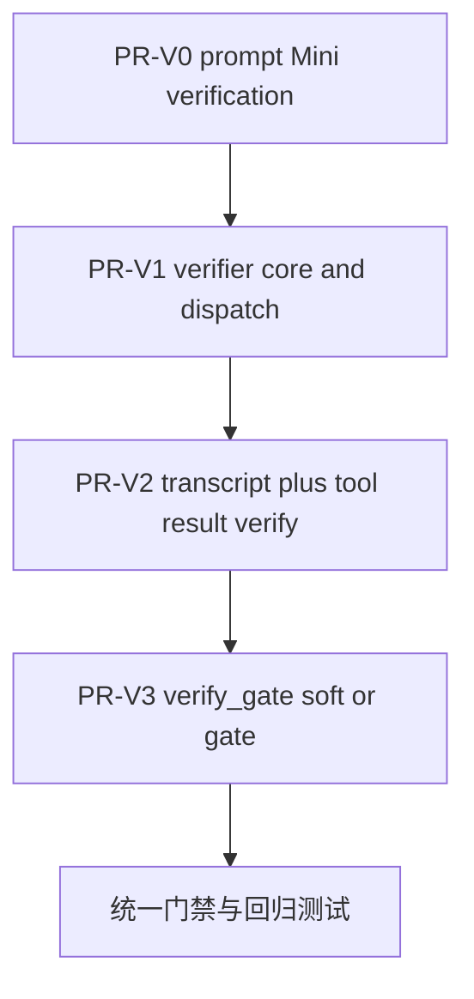

# T2-P1-002 verifier 开发计划（PR-V0～V3）

## 认领与分支（Dispatcher）

- 认领卡：[T2-P1-002.md](../TASK_BOARD_002/tasks/T2-P1-002.md)；当前已改为 **Tom / `DOING` / `feature/plan-mode-enhance`**。
- 本计划只覆盖 **PR-V0～V3 verifier 子项**；不重开分支、不改其他任务卡。
- **单一事实来源**：以 [plan-exec-code-verification.md](../../docs/architecture/plan-exec-code-verification.md) 当前正文为准；任务卡与 status 仅做派生同步。
- 已拍板边界：
  - **frontmatter 零改造**：不新增 `verify` / `verify_checks` / `verify_task_type`
  - **唯一配置项**：`[plan].verify_gate = "soft" | "gate"`，默认 `"soft"`
  - **不加** `/plan verify` CLI
  - **保留双通道**：`transcript.plan.verify` + `update_plan` tool result `verify`

## 研发流程（对照 Dispatcher）

| 阶段 | 动作 | 说人话 |
|------|------|--------|
| 读上下文 | 以 [plan-exec-code-verification.md](../../docs/architecture/plan-exec-code-verification.md)、[T2-P1-002.md](../TASK_BOARD_002/tasks/T2-P1-002.md)、[Dispatcher.md](../Dispatcher.md)、[PLAN_SPEC.md](./PLAN_SPEC.md) 为准；补读 `src/api/chat/mod.rs`、`plan_runtime/mod.rs`、`update_plan.rs`、`tool_exec.rs`、`infra/config/types.rs`、`infra/events/mod.rs`、reviewer 落地代码。对应 todo：`context-read`。 | 先把 verifier 要挂到哪几层摸清楚。 |
| 开发前 | 保持在 `feature/plan-mode-enhance`；不回滚当前分支已有改动；按 [Codeing&Architecture_Spec.md](../../openspec/specs/guides/coding/Codeing&Architecture_Spec.md) 与 [COMMENT_SPEC.md](../../openspec/specs/guides/coding/COMMENT_SPEC.md) 写实现。 | 在现分支续作，不再拆支。 |
| 开发中 | 按 PR-V0 → PR-V1 → PR-V2 → PR-V3 串行；每一块完成即补对应单测/集成测；Mini prompt 与 runtime/gate 分离交付。 | 先补提示词，再补内联 verifier，再补回传，再补严模式。 |
| 门禁 | 先跑缩小范围测试；收尾跑 `cargo fmt --all`、`cargo clippy --all-targets -- -D warnings`、`cargo test --lib`、`cargo test --test plan_runtime_integration`（如该测试二进制存在）；如需更大全量，按 [INTEGRATION_MERGE_AND_ACCEPTANCE.md](../INTEGRATION_MERGE_AND_ACCEPTANCE.md) 后台日志+轮询执行。对应 todo：`dev-gates`。 | 先小步快跑，最后统一收口。 |
| 提交与进度 | 持续更新 [feature-plan-mode-enhance.md](../../docs/status/feature-plan-mode-enhance.md)；本轮收口后按 [commit-guard.mdc](../../.cursor/rules/commit-guard.mdc) 一次提交，不推远端。对应 todo：`status-ship`。 | status 跟着走，提交只收这轮文档/计划。 |
| 完成 | 这轮只做到 verifier 方案勘误 + `PLAN_verifier.md` 起草；真正 PR-V0～V3 实施仍等用户确认后再开。 | 先把施工图写清楚，再进代码。 |

## 子项清单与状态（对照看板 PR-V0～V3）

| 看板子项 | 内容 | 当前状态 | 本计划状态 | 说人话 |
|------|------|----------|------------|--------|
| **PR-V0** | `executor.txt` / `planner.txt` 追加 Mini 验证 + P0～P6 命令发现 | 待做 | 待做 | 先让主 Agent 每步别裸勾 completed。 |
| **PR-V1** | `SubagentType::Verifier`、`verify.rs`、`dispatch_verifier`、`VERIFIER_MAX_TURNS = 64`、工具白名单 | 待做 | 待做 | 把完工验货员真正接进 runtime。 |
| **PR-V2** | `plan.verify` transcript 事件 + `update_plan` tool result `verify` 字段 | 待做 | 待做 | 结果既要落盘，也要让主 Agent 当轮看见。 |
| **PR-V3** | `[plan].verify_gate = "soft" | "gate"`；FAIL + gate 时阻止 `set_mode_completed` | 待做 | 待做 | 默认软验货，改成 gate 才真拦收工。 |

---

## 目标与验收（含作用/意义）

**要做出什么**：在 Tomcat 现有 PLAN/EXEC 状态机上补齐「全部 todo 完成后」的 **internal verifier**，默认软验货、可选 gate、结果双通道回传，并把落地步骤拆成 PR-V0～V3 四个可独立验收的阶段。

**验收**：

- 文档与任务卡已经与最终裁剪口径一致：**frontmatter 零改造**、**不加 `/plan verify`**、**不分 `verify_task_type`**、**唯一配置项 `[plan].verify_gate`**
- `PLAN_verifier.md` 覆盖 [PLAN_SPEC.md](./PLAN_SPEC.md) 要求的 7 个维度，并列清 PR-V0～V3 的文件、接口、时序与测试
- 计划中的文件/测试名均能在仓库中对照到现有模块或明确的新建点

**用户故事 / 场景与意义**：

1. **EXEC 最后一项勾完后自动验货**：用户不需要额外提醒模型“去跑测试”，runtime 自己派发 verifier。**作用**：减少 verification avoidance。**意义**：避免“todo 都完成了，但代码根本没跑过”。
2. **软验货默认不打断会话**：`[plan].verify_gate="soft"` 时，即便 FAIL，也只写 transcript 和 tool result。**作用**：与 reviewer 的顾问哲学一致。**意义**：避免把 flaky 环境、权限拒绝、缺依赖等基础设施问题误当作“任务没完成”。
3. **严模式真正拦收工**：`[plan].verify_gate="gate"` 且 verdict=`fail` 时，`mode` 留在 `Executing`，主 Agent 必须自行退回 todo 或追加修复 todo。**作用**：给需要强门禁的用户一个开关。**意义**：用户想要“没验绿不许收工”时有确定性路径。
4. **结果既能审计也能驱动下一轮**：`plan.verify` 事件进 transcript，`update_plan` tool result 也带 `verify`。**作用**：跨 session 可追，当前轮也能读到。**意义**：不用翻子 Agent 对话，主 Agent 就知道接下来该退哪个 todo 修。

---

## 现状与差距（关键代码）

- [`src/api/chat/plan_runtime/tools/update_plan.rs`](../../src/api/chat/plan_runtime/tools/update_plan.rs) 当前在约 `101–114` 行直接 `all_completed -> PlanFile.mode = Completed -> write_plan -> set_mode_completed()`，**没有** verifier 钩子，而且 **先写 completed 再收工**。PR-V1/V3 必须重排这里的时序。
- [`src/core/agent_loop/types.rs`](../../src/core/agent_loop/types.rs) 约 `55–74` 行的 `SubagentType` 目前只有 `User` / `Reviewer`，还没有 `Verifier`。
- [`src/core/agent_loop/tool_exec.rs`](../../src/core/agent_loop/tool_exec.rs) 约 `227–282` 行只有 reviewer 专属白名单和 write-path guard；verifier 还没有“只准 `read/search_files/list_dir/bash`”的双保险。
- [`src/api/chat/plan_runtime/mod.rs`](../../src/api/chat/plan_runtime/mod.rs) 已有通用 transcript appender（约 `224–231` 行）和 reviewer 派发模板（约 `573–639` 行），说明 verifier **应复用同一注入/落盘模式**，而不是把 llm/primitive/registry 直接塞进 `update_plan.rs`。
- [`src/api/chat/mod.rs`](../../src/api/chat/mod.rs) 约 `322–395` 行是 `PlanRuntime` + `AgentRegistry` + `ProdReviewerDispatcher` 的装配根；verifier 也需要在这里接线。
- [`src/infra/events/mod.rs`](../../src/infra/events/mod.rs) 约 `127–140` 行已经有 `plan.review` / `plan.review.warning` 等常量，但**没有** `plan.verify`。
- [`src/infra/config/types.rs`](../../src/infra/config/types.rs) 约 `665–693` 行的 `PlanConfig` 只有 `lock_timeout_ms` / `auto_checkpoint_on_build` / `max_review_rounds`，还没有 `verify_gate`。
- [`src/api/chat/plan_runtime/prompts/executor.txt`](../../src/api/chat/plan_runtime/prompts/executor.txt) 当前只强调“用 `update_plan` 推进 todo，runtime 负责其余事情”，尚未要求 **Mini verification** 或 **P0～P6** 命令发现。

**说人话**：现在 reviewer 这条链已经打通了，但 verifier 还是空的；更关键的是 `update_plan` 目前是“先宣布完成，再回 CHAT”，没有机会在中间插验货。

---

## 子项与 API 一览

| 子项 | 主要已有接口/代码 | 计划新建或变更 | 说人话 |
|------|-------------------|----------------|--------|
| **PR-V0** | `prompts/executor.txt`、`prompts/planner.txt` | 追加 Mini verification 与 P0～P6 命令发现段；补锚点测试 | 先靠提示词把“边做边测”立起来。 |
| **PR-V1** | `spawn_subagent_internal()`、`ProdReviewerDispatcher`、`SubagentType::Reviewer`、`PlanRuntime::write_transcript_custom()` | 新建 `verify.rs`（`VerifySummary` / parser / dispatcher / prompt / const）；`SubagentType::Verifier`；`PlanRuntime::dispatch_verifier()`；`tool_exec` verifier 白名单 | 复用 reviewer 路径接一个只读验货员。 |
| **PR-V2** | `update_plan` tool result 现仅回 `items`/`warnings`；reviewer 已会写 `plan.review` transcript | 新增 `WIRE_PLAN_VERIFY`；`update_plan` JSON 增 `verify`；补 transcript / tool result 测试 | 结果既要落盘，也要当轮返回主 Agent。 |
| **PR-V3** | `PlanConfig`、`set_mode_completed()`、`PlanMode::{Executing,Completed}` | `[plan].verify_gate: String` 默认 `"soft"`；FAIL + gate 分支不调用 `set_mode_completed()` | 同一套 verifier，配置改成 gate 才会卡收工。 |

---

## 各子项：文件、思路、接口、测试

### V0 Prompt：Mini verification + P0～P6 发现

- **文件**：
  - [`src/api/chat/plan_runtime/prompts/executor.txt`](../../src/api/chat/plan_runtime/prompts/executor.txt)
  - [`src/api/chat/plan_runtime/prompts/planner.txt`](../../src/api/chat/plan_runtime/prompts/planner.txt)
  - （若当前已有 prompt 快照/锚点测试文件，则同步补测试；否则在 `plan_runtime` 测试目录新增 prompt 断言）
- **思路**：
  - `executor.txt` 追加“在把任一 todo 标为 completed 前，先对**本步**做 1 次 Mini verification”的固定段落。
  - 命令发现只允许走 **P0～P6**：plan body / 用户消息 → system 已注入上下文 → 最近 manifest → README / CONTRIBUTING → `AGENTS.md` / `CLAUDE.md` → 最小 inferred smoke。
  - 明确禁止“不读 manifest/文档就默认 `npm test` / `cargo test`（全 workspace）/ `pytest`（全仓）”。
  - `planner.txt` 只负责让 plan body 写出可执行的 Test plan 或 “EXEC 时从 manifest 发现命令”，**不**引入 frontmatter 字段。
- **接口**：无 runtime API 变化；只改提示词常量源文件。
- **测试要点**：
  - `executor_prompt_contains_mini_verification_section`
  - `planner_prompt_contains_test_plan_hint`
  - `prompt_forbids_default_npm_or_full_workspace_test`
- **说人话**：V0 不改 Rust 逻辑，先让主 Agent 每步别裸勾完成。

### V1 Verifier 核心：internal subagent + 结构化结果

- **文件**：
  - 新建 [`src/api/chat/plan_runtime/verify.rs`](../../src/api/chat/plan_runtime/verify.rs)
  - [`src/api/chat/plan_runtime/mod.rs`](../../src/api/chat/plan_runtime/mod.rs)
  - [`src/api/chat/mod.rs`](../../src/api/chat/mod.rs)
  - [`src/core/agent_loop/types.rs`](../../src/core/agent_loop/types.rs)
  - [`src/core/agent_loop/tool_exec.rs`](../../src/core/agent_loop/tool_exec.rs)
  - [`src/core/agent_registry/mod.rs`](../../src/core/agent_registry/mod.rs)（主要复用，不一定改）
  - [`src/api/chat/plan_runtime/tools/update_plan.rs`](../../src/api/chat/plan_runtime/tools/update_plan.rs)
  - 参考实现：[prod_reviewer.rs](../../src/api/chat/plan_runtime/prod_reviewer.rs)
- **思路**：
  - 在 `verify.rs` 定义：
    - `const VERIFIER_MAX_TURNS: u32 = 64`
    - `VerifySummary` / `VerifyCheck`
    - `<verify>` block 解析器（如 `parse_verify_block()`）
    - verifier dispatcher trait + mock
    - 生产实现（可与 reviewer 同文件，或必要时再拆 `prod_verifier.rs`）
  - `api/chat/mod.rs` 参照 reviewer 装配逻辑（约 `343–395` 行），把 `agent_registry` / `llm` / `primitive` / `event_bus` / `checkpoint_store` / `context_config` / `read_file_state` / `openai_files_runtime` / `agent_workspace_dir` / `plan_runtime` 注入 verifier dispatcher。
  - `SubagentType` 增 `Verifier`；`as_str()` 和默认 shape 测试同步扩展。
  - `tool_exec.rs` 参照 reviewer 的双保险白名单，新增 verifier 只允许 `{read, search_files, list_dir, bash}`；显式拒绝 `create_plan` / `update_plan` / `todos` / `ask_question` / `write` / `edit` / `delete` / `dispatch_agent`。
  - `PlanRuntime` 新增 `attach_verifier()` / `dispatch_verifier()`，实现风格对齐 `dispatch_reviewer()`：
    - 调用前必须确保 plan 文件 advisory lock 已释放
    - dispatcher 未注入时返回 placeholder/aborted，不炸主流程
    - verifier 完成后统一回 `VerifySummary`
- **接口**：
  - 新增 `SubagentType::Verifier`
  - 新增 `PlanRuntime::attach_verifier(...)`
  - 新增 `PlanRuntime::dispatch_verifier(plan_id, plan_text_or_snapshot)`
  - 新增 `VerifySummary::to_json()`（供 transcript / tool result 共用）
- **测试要点**：
  - `verifier_spawned_on_all_completed`
  - `verifier_blocked_write_tools`
  - `verifier_max_turns_default_is_64`
  - `subagent_type_root_and_as_str_are_correct` 扩展 `Verifier`
- **异步 / 写盘约束**：
  - verifier **不能**在 plan 文件 lock 持有期间启动，否则会和 `write_plan` 或 verifier 读 plan 路径互相卡住。
  - `update_plan.rs` 不能再沿用“先把 frontmatter.mode 写成 completed”的当前顺序；否则 gate fail 时会出现 **磁盘已 completed、内存又回 Executing** 的短暂不一致。
- **建议落地顺序**：
  1. `update_plan` 先在内存中完成 todo 变更与 `Todos Board` 重写；
  2. **第一写**：将 todos 落盘，但 mode 仍保持 `Executing`；
  3. 释放锁后 `dispatch_verifier()`；
  4. 若 verdict 允许完成，再**第二写**把 mode 提升为 `Completed` 并 `runtime.set_mode_completed()`；若 gate fail，则保持 `Executing` 不再升档。
- **说人话**：V1 真正的难点不是 spawn 子 Agent，而是别把 plan 先写成 completed 再后悔。

### V2 Transcript + tool result：双通道回传

- **文件**：
  - [`src/infra/events/mod.rs`](../../src/infra/events/mod.rs)
  - [`src/api/chat/plan_runtime/mod.rs`](../../src/api/chat/plan_runtime/mod.rs)
  - [`src/api/chat/plan_runtime/tools/update_plan.rs`](../../src/api/chat/plan_runtime/tools/update_plan.rs)
  - [`src/api/chat/plan_runtime/tools/tests.rs`](../../src/api/chat/plan_runtime/tools/tests.rs)
- **思路**：
  - 在 `infra::wire` 新增 `WIRE_PLAN_VERIFY = "plan.verify"`。
  - 复用 `PlanRuntime::write_transcript_custom()`，按 reviewer 的 `plan.review` 路径写 `plan.verify`：
    - `event`
    - `plan_id`
    - `verdict`
    - `checks`
    - `summary`
    - `child_session_id`
    - `verifier_turns_used / limit / stop_reason`（若实现时保留这些字段）
  - `update_plan` 当前返回 JSON 只有 `plan_id/path/applied/replace/.../warnings/items`；这里新增 `verify: VerifySummary | null`，让主 Agent 当轮就能读到 verdict。
- **接口**：
  - `VerifySummary::to_json()` 同时服务于 transcript 与 tool result
  - `update_plan` 返回结构新增顶层 `verify`
- **测试要点**：
  - 参照 reviewer 现有 transcript 测试风格，在 [`tools/tests.rs`](../../src/api/chat/plan_runtime/tools/tests.rs) 捕获 `transcript_appender`
  - `verify_event_in_transcript`
  - `update_plan_tool_result_has_verify_field`
  - `verify_summary_round_trips_to_json`
- **说人话**：V2 的目标是“别只把结果埋到 transcript 里”，主 Agent 下一轮必须立即知道验货结论。

### V3 Gate 配置：soft / gate 单一旋钮

- **文件**：
  - [`src/infra/config/types.rs`](../../src/infra/config/types.rs)
  - [`src/infra/config/mod.rs`](../../src/infra/config/mod.rs)（若仅 re-export，通常不用改）
  - [`src/api/chat/mod.rs`](../../src/api/chat/mod.rs)
  - [`src/api/chat/plan_runtime/mod.rs`](../../src/api/chat/plan_runtime/mod.rs)
  - [`src/api/chat/plan_runtime/tools/update_plan.rs`](../../src/api/chat/plan_runtime/tools/update_plan.rs)
  - 相关测试：[`src/core/agent_loop/tests/defaults_test.rs`](../../src/core/agent_loop/tests/defaults_test.rs)、[`src/api/chat/plan_runtime/tools/tests.rs`](../../src/api/chat/plan_runtime/tools/tests.rs)
- **思路**：
  - 给 `PlanConfig` 新增 `verify_gate: String`，默认 `"soft"`；不新增 env，不再拆 `[plan].default_verify`。
  - `api/chat/mod.rs` 在构造 `PlanRuntime` 时把该配置注入 verifier/plan runtime。
  - `update_plan` 里统一判断：
    - `verify_gate == "soft"`：无论 pass/fail/partial/aborted，都会走完成路径（但 `verify` 结果保留）
    - `verify_gate == "gate"` 且 verdict=`fail`：不调用 `set_mode_completed()`，磁盘/内存都保持 `Executing`
    - `partial` / `aborted`：即便 gate 模式也不拦（与方案正文一致）
  - gate fail 后，不让 verifier 自动改 todo；主 Agent 在收到 tool result.verify 后自行 `update_plan` 把目标 todo 退回 `in_progress` 或追加修复 todo。
- **接口**：
  - `PlanConfig.verify_gate: String`
  - 若需要，可在 `PlanRuntime` 中暴露 `verify_gate_mode()` helper，避免在 `update_plan.rs` 散落字符串比较
- **测试要点**：
  - `verify_gate_soft_does_not_block`
  - `verify_gate_blocks_completed_on_fail`
  - `gate_fail_keeps_mode_executing_but_returns_verify`
  - `main_agent_can_reopen_todo_after_gate_fail`
- **说人话**：V3 只有一个总开关，默认软；改成 gate 后，真 FAIL 才拦你收工。

---

## 文件职责总览（One-Glance Map）

```text
┌──────────────────────────────────────────────────────────────┐
│ src/api/chat/mod.rs ── 运行时装配                           │
│ • PlanRuntime::new_with_session_id(...)                     │
│ • attach_reviewer(...)                                      │
│ • [NEW] attach_verifier(...)                                │
│ ★ 把 agent_registry / llm / primitive / transcript appender │
│   注入 verifier 派发器                                      │
│ [tests] 走 chat/plan_runtime 集成路径                       │
└──────────────────────────────────────────────────────────────┘
                           │
                           ▼
┌──────────────────────────────────────────────────────────────┐
│ src/api/chat/plan_runtime/verify.rs ── verifier 核心        │
│ • const VERIFIER_MAX_TURNS = 64                             │
│ • struct VerifySummary / VerifyCheck                        │
│ • parse_verify_block()                                      │
│ • trait VerifierDispatcher / ProdVerifierDispatcher         │
│ ★ 只读 prompt + spawn_subagent_internal + 结构化结果        │
│ [tests] verify parser / turns / dispatcher mock             │
└──────────────────────────────────────────────────────────────┘
                           │
                           ▼
┌──────────────────────────────────────────────────────────────┐
│ src/api/chat/plan_runtime/tools/update_plan.rs ── 完成闸门   │
│ • ops::all_completed()                                      │
│ • rewrite_todos_board()                                     │
│ • [NEW] dispatch_verifier()                                 │
│ • [NEW] verify -> tool result                               │
│ ★ mode=Completed 的写盘/升档时序改造                        │
│ [tests] transcript/tool result/gate 分支                    │
└──────────────────────────────────────────────────────────────┘
               │                           │
               ▼                           ▼
┌──────────────────────────────────┐   ┌──────────────────────────────────┐
│ src/core/agent_loop/types.rs     │   │ src/core/agent_loop/tool_exec.rs │
│ • enum SubagentType              │   │ • reviewer whitelist             │
│ • [NEW] Verifier                 │   │ • [NEW] verifier whitelist       │
│ ★ 子 Agent 身份标签             │   │ ★ 双保险拦写/拦 plan 工具        │
│ [tests/defaults_test.rs]         │   │ [tests] 走 tool_exec 现有框架    │
└──────────────────────────────────┘   └──────────────────────────────────┘
               │                           │
               └──────────────┬────────────┘
                              ▼
┌──────────────────────────────────────────────────────────────┐
│ src/api/chat/plan_runtime/mod.rs + src/infra/events/mod.rs  │
│ • write_transcript_custom()                                 │
│ • dispatch_reviewer()（参考）                               │
│ • [NEW] dispatch_verifier() / WIRE_PLAN_VERIFY              │
│ ★ transcript 自定义事件统一从这里落盘                      │
│ [tests] tools/tests.rs 捕获 appender                        │
└──────────────────────────────────────────────────────────────┘
                              │
                              ▼
┌──────────────────────────────────────────────────────────────┐
│ src/infra/config/types.rs ── 全局配置                        │
│ • struct PlanConfig                                          │
│ • [NEW] verify_gate: "soft" | "gate"                        │
│ ★ 单一配置旋钮                                               │
│ [tests] config round-trip / default                          │
└──────────────────────────────────────────────────────────────┘
```

**阅读顺序（说人话）**：先看 `update_plan.rs` 当前怎么在 `all_completed` 时直接收工，再看 `verify.rs` 怎么把只读 verifier 接进来，最后看 `tool_exec.rs` / `config/types.rs` 如何把权限与 gate 收口。`api/chat/mod.rs` 是总装配点，确保 reviewer/verifier 两条链都从同一入口注入。

---

## 实施顺序与依赖



- **串行主路径**：V0 → V1 → V2 → V3
- **关键依赖**：V1 依赖本分支已存在的 reviewer 基础设施（`spawn_subagent_internal`、PlanRuntime transcript appender、composition root）
- **实现顺序建议**：
  1. 先交付 V0，尽快把 Mini verification 口径固化
  2. V1 先打通 verifier 结构和白名单，再改 `update_plan` 时序
  3. V2 在 verifier 能返回结构化结果后补 transcript / tool result
  4. V3 最后接单一 gate 配置，避免一开始就把完成路径卡死

---

## 风险与备选

| 风险 | 备选 / 降级 | 说人话 |
|------|-------------|--------|
| `update_plan` 现有“先写 completed”流程改动大 | 采用“两次写盘”方案：先写 `Executing + todos completed`，verifier 后再决定是否第二写 `Completed`；不要走“先写 Completed 再回滚” | 这是实现里最容易踩坑的地方。 |
| verifier 依赖装配面过广，直接把 llm/primitive/registry 塞给 `PlanRuntime` 会破坏现有 shape | 镜像 reviewer：`PlanRuntime` 只持 trait object，真正依赖装在 `verify.rs` 的生产 dispatcher 里，由 `api/chat/mod.rs` 注入 | 保持 PlanRuntime 还是“编排器”，别变成大杂烩。 |
| whitelist 漏拦工具，verifier 意外具备写能力 | 在 `tool_exec.rs` 做 catalog 过滤 + dispatch 前二次拦截双保险，测试覆盖 `write/edit/update_plan/todos` 均拒绝 | 权限一定要硬拦，不靠 prompt 自觉。 |
| `verify_gate` 用字符串比较，拼写漂移风险 | 增默认值/round-trip 测试；若实现中字符串比较过散，再局部提 helper，不急着上 enum | 先保范围小，再靠测试兜住。 |
| transcript 事件和 tool result 字段不一致 | 统一走 `VerifySummary::to_json()`；transcript 与 tool result 只做外层包裹，不各写一套序列化 | 一份数据源，别写出两套口径。 |

---

## 集成与 E2E（条件触发）

- **集成测试**：本批次优先在 [`src/api/chat/plan_runtime/tools/tests.rs`](../../src/api/chat/plan_runtime/tools/tests.rs) 与 `plan_runtime` 现有测试里补 verifier 相关覆盖，因为核心变化在 tool result、transcript、自定义事件与 mode 迁移，不必先上真 LLM E2E。
- **E2E / 场景库**：本批次**不新增** `/plan` 子命令，也不新增 panel；用户面变化主要是最后一个 todo 完成时的 verifier/soft-gate 行为。若 PR-V3 改动后需要补“gate fail 停留 EXEC”的场景，再在后续实施阶段追加场景库条目或 CLI E2E。
- **全量门禁**：若本轮实现触及 `tests/` 下 integration 二进制命名或分组，按 [INTEGRATION_TEST_SPEC.md](../../openspec/specs/guides/testing/INTEGRATION_TEST_SPEC.md) §7.2 更新 `scripts/test-groups.sh`；若只是扩充现有 `plan_runtime`/unit/integration 测试，则不新建额外二进制。
- **交付前执行**：按 [INTEGRATION_MERGE_AND_ACCEPTANCE.md](../INTEGRATION_MERGE_AND_ACCEPTANCE.md) 的后台日志 + 轮询方式执行较重测试，避免前台长时间 block 误判挂死。

**说人话**：这轮先把单测/集成测补齐；真要补新的 CLI E2E，放到 verifier 代码实施时再看 gate 路径是否足够用户可见。

---

## 计划输出前自检

- [x] 已列出 PR-V0～V3 全部子项与状态
- [x] 已写清总体目标、验收与单一事实来源
- [x] 每个子项都写了文件、思路、接口、测试要点
- [x] 已给出涉及多个 `*.rs` 文件的 One-Glance Map
- [x] 已写实施顺序与依赖
- [x] 已写风险点与备选
- [x] 已说明集成与 E2E 交付策略
- [x] 已有 Todo 总表，且与正文章节双向可查

---

## 完成后的 Dispatcher 动作（实现阶段）

- PR-V0～V3 实施过程中持续更新 [feature-plan-mode-enhance.md](../../docs/status/feature-plan-mode-enhance.md)
- 每完成一个连贯阶段即补相应测试，不囤到最后一起修
- verifier 代码阶段完成且门禁通过后，再把 [T2-P1-002.md](../TASK_BOARD_002/tasks/T2-P1-002.md) 对应子项勾掉，并视本卡整体状态决定是否回到 `PENDING_INTEGRATION`
- 不额外新建架构长文；若实现与当前方案文不一致，回写 [plan-exec-code-verification.md](../../docs/architecture/plan-exec-code-verification.md)

---

## 七、Todo 总表（与正文对照）

| id | 类型 | 对应正文 | 说人话 |
| :--- | :--- | :--- | :--- |
| `claim-board-branch` | 流程 | 认领与分支 | 已在本轮完成：任务卡改 `DOING`、同分支续作。 |
| `context-read` | 流程 | 研发流程 / 现状与差距 | 已完成：关键代码与方案已对齐。 |
| `impl-v0` | 实施 | **V0 Prompt** | 先补 Mini verification 提示词。 |
| `impl-v1` | 实施 | **V1 Verifier 核心** | 接入 internal verifier 与白名单。 |
| `impl-v2` | 实施 | **V2 Transcript + tool result** | 结果双通道回传。 |
| `impl-v3` | 实施 | **V3 Gate 配置** | 单一 `verify_gate` 旋钮。 |
| `dev-gates` | 流程 | 集成与 E2E | 收尾统一跑 fmt/clippy/test。 |
| `status-ship` | 流程 | 完成后的 Dispatcher 动作 | 更新 status、提交、不推远端。 |

**写后复核**：

- Todo → 正文：每个 `impl-v*` 与对应小节一一对应
- 正文 → Todo：没有“只写在正文但总表里没有”的交付点
- 顺序：先流程，再 V0～V3，再门禁与状态/提交
