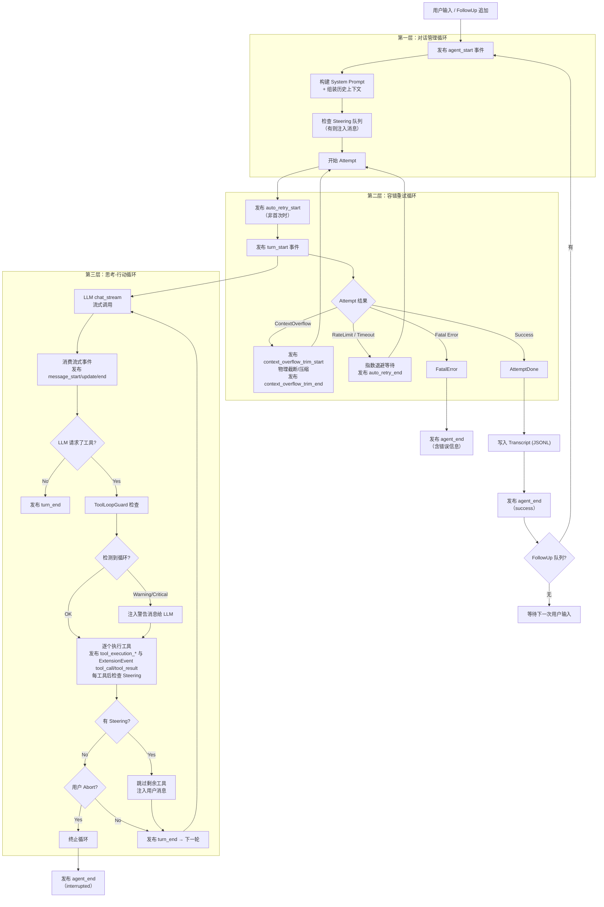

# Agent Loop 设计

本文为 [Architecture](../openspec/specs/Architecture.md) 中「9. Agent Loop 设计」的详细设计，总览见主文档。

## 2026-05 PlanRuntime 启动挂接补充

agent/chat 进入主循环前，启动顺序新增一条 plan 恢复挂接：

1. 先调用 `init_context_state(...)` 组装上下文；
2. 从返回的 `ContextState.latest_plan_event` 读取最近的 `plan.create/build/update`；
3. 调用 `PlanRuntime::attach_from_event(...)` 回盘派生运行时状态。

当前实现约束：

- `attach_from_event(None)` 保持 `Chat`；
- `plan.create` 只恢复 `active_planning_plan_id`；
- `plan.build` / `plan.update` 会恢复 `active_plan_path`，并且仅在盘 state 为 `pending / executing` 时显式恢复 `PlanState`；
- 盘 state 为 `planning / completed` 时，agent loop 仍以 `Chat` 装配 prompt 和 catalog；
- `Completed` 是瞬时态，不作为稳定 prompt/cursor label 出现在用户面前。

说人话：agent loop 现在在装历史上下文时，顺便把 active plan 的恢复线索也带进来了；后面装 prompt 前再把 runtime 对齐一次。

---

## 13.1 概述与设计目标

Agent Loop 是 Agent 的核心运行循环，编排 LLM 调用、工具执行、用户中断（Steering/FollowUp/Abort）、容错重试（Compaction/Backoff）的完整生命周期。本设计与 pi-mono、openclaw 对齐，采用三层嵌套循环，并明确与插件事件系统的发布时机对应关系。

### 设计目标

1. **生命周期清晰**：对话管理 → 容错重试 → 思考-行动，三层职责分离、边界明确。
2. **pi-mono 生态兼容**：事件名、Steering/FollowUp 语义、消息类型边界与 pi-mono 一致。
3. **可观测**：所有关键节点向事件总线发布 AgentEvent/ExtensionEvent，便于 UI 与插件订阅。
4. **可恢复**：Context Overflow、Rate Limit、网络超时等可重试错误由第二层统一处理。
5. **可扩展**：插件通过 Hook 点参与 Prompt 构建、工具调用前后等环节。

---

## 13.2 术语表

| 术语 | 说明 |
|------|------|
| **Agent Loop** | 智能体循环：接收用户输入 → 调用 LLM → 执行工具 → 结果回注 → 再调用 LLM → … → 最终回答。 |
| **Turn** | 轮次：一次 LLM 调用 + 可能的若干工具执行。无工具请求时 Turn 结束即 Loop 结束。 |
| **Tool Call** | 工具调用：LLM 通过结构化请求委托宿主执行 read_file、write_file、edit_file、execute_bash、list_dir 等。 |
| **Steering** | 转向/中断注入：用户于 Agent 工作中插话；当前工具执行完后跳过剩余工具，注入新消息并重新调用 LLM。 |
| **FollowUp** | 追加消息：Agent 刚结束时用户追加消息，在同一会话上下文中继续处理，不重新初始化。 |
| **Abort** | 中止：用户完全取消执行（如 Ctrl+C）；当前工具完成后终止循环，发布 agent_end(interrupted)。 |
| **Context Overflow** | 上下文溢出：对话历史超过 LLM 的 context window 限制。 |
| **Compaction** | 上下文压缩：保留 System Prompt + 最近 N 条，对中间历史做摘要或截断，腾出空间。 |
| **Attempt** | 尝试：一次完整的「思考-行动循环」执行；失败时由第二层重试（Compaction/Backoff）。 |
| **Tool Loop Detection** | 工具循环检测：防止同一工具+同参数或 A↔B 交替无进展地重复调用。 |

---

## 13.3 整体结构：三层嵌套循环

从外到内职责递进：

```
用户发送消息（或 FollowUp 追加）
│
▼
┌─────────────────────────────────────────────────────────┐
│  第一层：对话管理循环（Conversation Loop）                │
│  职责：用户输入、FollowUp 追加、Transcript 持久化         │
│  ┌─────────────────────────────────────────────────────┐ │
│  │  第二层：容错重试循环（Attempt Loop）                 │ │
│  │  职责：Context Overflow→Compaction；Rate Limit→退避  │ │
│  │  ┌─────────────────────────────────────────────────┐ │ │
│  │  │  第三层：思考-行动循环（Reasoning Loop）          │ │ │
│  │  │  职责：LLM 流式调用 + 工具执行 + Steering 检查   │ │ │
│  │  │  退出：无工具请求 / Steering 中断 / Abort       │ │ │
│  │  └─────────────────────────────────────────────────┘ │ │
│  └─────────────────────────────────────────────────────┘ │
└─────────────────────────────────────────────────────────┘
│
▼
等待下一次用户输入
```

### 13.3.1 流程图（Flowchart）



### 13.3.2 控制流伪代码

```
fn agent_run(session, user_message):
    emit(AgentStart { session_id })
    messages = session.build_context(context_cap)
    messages.append(user_message)

    # === 第一层：对话管理循环 ===
    loop:
        inject_steering_messages(messages)

        # === 第二层：容错重试循环 ===
        attempt_count = 0
        loop:
            attempt_count += 1
            if attempt_count > MAX_ATTEMPTS:
                emit(AgentEnd { error: "max attempts exceeded" })
                return
            if attempt_count > 1:
                emit(AutoRetryStart { attempt: attempt_count })

            result = run_reasoning_loop(session, messages)

            match result:
                Ok(response):
                    emit(AutoRetryEnd { success: true })
                    break
                Err(ContextOverflow):
                    emit(ContextOverflowTrimStart { reason: "context_overflow" })
                    messages = compact(messages)
                    emit(ContextOverflowTrimEnd { ... })
                    continue
                Err(RateLimit { retry_after }):
                    sleep(exponential_backoff(attempt_count, retry_after))
                    emit(AutoRetryEnd { success: false })
                    continue
                Err(Fatal(e)):
                    emit(AgentEnd { error: e })
                    return

        session.append_message(user_message)
        session.append_message(response)
        emit(AgentEnd { success })

        if reasoning_turn_budget_exhausted or follow_up_queue.is_empty():
            break
        else:
            messages.append(follow_up_queue.drain())
            emit(AgentStart { session_id })
            continue

fn run_reasoning_loop(session, messages) -> Result:
    tool_loop_guard = ToolLoopGuard::new()
    turn_index = 0
    loop:
        # reasoning loop 仍受 max_tool_rounds 硬上限约束；
        # 若因预算触顶退出，必须把该事实回传给外层 conversation loop，
        # 禁止外层再 drain follow_up_queue 开一个新的 attempt。
        if turn_index >= MAX_TOOL_ROUNDS:
            reasoning_turn_budget_exhausted = true
            return Ok(last_response)
        emit(TurnStart { turn_index })
        turn_index += 1

        llm_messages = convert_to_llm_format(messages)
        tools = build_tool_definitions()
        system_prompt = build_system_prompt(session)
        emit(MessageStart { role: assistant })
        stream = llm.chat_stream(system_prompt, llm_messages, tools)

        text_buf = ""; tool_calls = []
        for event in stream:
            match event:
                ContentDelta(delta): text_buf += delta; emit(MessageUpdate { delta })
                ToolCallDelta(...): accumulate_tool_call(tool_calls, ...)
                FinishReason(reason): break
                Error(e): return Err(classify_error(e))

        emit(MessageEnd { text_buf, tool_calls })
        messages.append(AssistantMessage { text_buf, tool_calls })

        if tool_calls.is_empty():
            emit(TurnEnd { turn_index })
            return Ok(text_buf)

        guard_result = tool_loop_guard.check(tool_calls)
        if guard_result == Critical:
            messages.append(SystemMessage("检测到工具调用循环，请换一种方式"))
            continue

        for tc in tool_calls:
            if cancel_token.is_cancelled():
                emit(TurnEnd { turn_index })
                return Err(Aborted { partial_text, partial_messages: messages[start_idx..] })
            emit(ToolExecutionStart { ... })
            # 工具执行 await 被 tokio::select! 包裹，cancel 触发后立即返回
            result = select {
                r = execute_tool(session, tc) => r,
                _ = cancel_token.cancelled() => {
                    emit(ToolExecutionEnd { tc.id, result: "[interrupted]", ok: false })
                    return Err(Aborted { partial_text, partial_messages: messages[start_idx..] })
                }
            }
            emit(ToolExecutionEnd { ... })
            messages.append(ToolResultMessage { tc.id, result })
            if tool_returns_follow_up_parts:
                messages.append(ChatMessage::user_with_parts(parts))
            if steering_queue.has_pending():
                inject_steering_messages(messages)
                break
        emit(TurnEnd { turn_index })
        maybe_reduce_before_next_llm(messages)
        continue
```

> **Aborted 语义**（见 [interrupt-and-cancellation.md](interrupt-and-cancellation.md)）：
> - `LoopError::Aborted { partial_text, partial_messages }` 由 `make_aborted` 构造，`partial_messages = messages[start_idx..]`，天然包含本轮已完成的 `tool_result` 与（若存在）已作为 partial push 的 assistant 消息。
> - `AgentLoop::run` 外层把 `Err(Aborted)` 转成 `AgentRunOutcome::Interrupted(AgentRunResult { new_messages, .. })`，与 `Completed` **共享同一持久化路径**；这是 T-003/T-004/T-017 的实现锚点。
> - 事件层：新增 `AgentEvent::Interrupted { session_id, partial_text_len, tool_results_count }`（wire：`agent_interrupted`），同时保留 `AgentEnd { error: "interrupted" }` 兼容旧订阅者。

---

## 13.4 消息类型设计

> **[已重构]** 原 `AgentMessage` 中间层已删除（见 `feature/collapse-to-chatmsg`），统一使用 `ChatMessage`（OpenAI wire format）。不同语义通过 `MessageKind` 字段区分，无需转换层。

```
ChatMessage（统一表示，直接发给 LLM）
┌──────────────────────────────────────────┐
│ role: user      + kind: Normal           │  普通用户消息
│ role: assistant                          │  助手回复
│ role: tool                               │  工具结果
│ role: system                             │  系统提示
│ role: user      + kind: Steering         │  内部 Steering 指令
│ role: user      + kind: CompactionSummary│  压缩摘要（替换旧消息）
└──────────────────────────────────────────┘
附加 #[serde(skip)] 字段: msg_id, kind, timestamp（不影响 wire format）
```

- **Steering**（`kind: MessageKind::Steering`）：标记内部指令，role 为 user 但不计入 turn 边界。
- **CompactionSummary**（`kind: MessageKind::CompactionSummary`）：压缩后的历史摘要，替换被压缩的消息段。
- **`ChatMessage::user_with_parts(parts)`**：仍然是普通 `role=user, kind=Normal`，只是 `content` 不是纯文本而是 `Parts` 数组。当前主要用于 `read` 命中图片 / PDF 后，把真正的 `InputImage` / `InputFile` 作为**紧跟 tool_result 的下一条 user 消息**注入；它不是 `follow_up_queue`，也不是 `steering_queue`。
- 由于内存表示与 wire format 统一，更换 LLM Provider 无需修改转换逻辑。

---

## 13.5 System Prompt 构建流水线

每次 LLM 调用前，System Prompt 按以下顺序拼装：

1. **基础身份**（固定）：如「你是一个 AI 编程助手，运行在 tomcat 环境中…」
2. **可用工具描述**（动态）：从工具注册中心生成，如 read_file、write_file、edit_file、execute_bash、list_dir 等。
3. **插件注入**：通过 `before_prompt_build` 等 Hook，插件注入额外 system 指令或上下文。
4. **会话级配置**：模型、温度、会话自定义 system prompt 追加。

---

## 13.6 事件发布时序

Agent Loop 与 [事件系统](events.md) 的对应关系：每个 AgentEvent 在 Loop 中的**精确发布时机**如下。

```
agent_start              ← 第一层开始，用户消息进入
│
├─ [auto_retry_start]    ← 第二层非首次 Attempt 开始时
│
├─ turn_start            ← 第三层每轮开始
│  ├─ message_start      ← LLM 流式响应开始
│  ├─ message_update x N ← 每收到 ContentDelta / ToolCallDelta
│  ├─ message_end        ← LLM 流式响应结束
│  ├─ tool_execution_start（JSON `type`；Rust `ToolExecutionStart`）← 每个工具执行前（观察）
│  ├─ tool_call（ExtensionEvent；钩子，执行前）← 与上不同名
│  ├─ [tool_execution_update] ← 工具执行中（可选，如 bash 流式）
│  ├─ tool_result（ExtensionEvent；钩子，执行后）
│  ├─ tool_execution_end（JSON `type`；Rust `ToolExecutionEnd`）← 每个工具执行后（观察）
│  └─ turn_end           ← 本轮结束
│     … 如有更多工具请求，重复 turn_start → turn_end …
│
├─ [context_overflow_trim_start]  ← Context Overflow 路径（Rust `ContextOverflowTrimStart`）
├─ [context_overflow_trim_end]    ← Overflow 截断/压缩完成（Rust `ContextOverflowTrimEnd`）
├─ [auto_retry_end]         ← 重试结束
│
└─ agent_end             ← 整个 Agent 处理结束
   status: success | error | interrupted
```

方括号 `[]` 表示条件性发布（仅在对应场景触发）。

---

## 13.7 Steering、FollowUp 与 Abort

### 13.7.1 先看总图

```text
真实用户输入
  │
  ├─► ChatMessage::user("...")
  │    └─► 作为 initial_messages 进入 AgentLoop::run()
  │
  ├─► AgentLoop::follow_up("...")
  │    └─► follow_up_queue.push(ChatMessage::user(...))
  │         └─► turn 入口 / reasoning batch boundary 会 drain
  │              └─► 作为下一次 LLM 请求前的补充 user 消息
  │
  ├─► AgentLoop::steer("...")
  │    └─► steering_queue.push(ChatMessage::steering(...))
  │         ├─► run() 开头先用 inject_steering_messages(...) 注一次
  │         └─► 每个单独 tool 执行完后再检查一次
  │              └─► 若非空：记账 + append/persist + push，然后 break
  │                   跳过本轮剩余 tool_calls，直接进入下一轮 LLM
  │
  └─► read 图片 / PDF
       └─► tool_exec 返回 follow_up_parts
            └─► tool_dispatcher 先 push tool_result
                 再立刻 push ChatMessage::user_with_parts(parts)
                 （同一轮、同一条工具结果后面，不走 follow_up_queue）
```

**说人话**：这里其实有三条完全不同的“加消息”路径。`follow_up_queue` 是**回合与回合之间**加一条普通 user 消息；`steering_queue` 是**本轮工具列表中途插话并打断剩余工具**；`user_with_parts` 则是某些工具（现在主要是 `read` 图片 / PDF）为了把“真正的附件内容”补回对话，在**tool_result 后面立刻补一条普通 user 多模态消息**。

### 13.7.2 三类入口对照

| 入口 | 触发时机 | 写入载体 | 谁消费 | 会不会打断当前 tool list | 典型来源 |
|------|----------|----------|--------|---------------------------|----------|
| `steer(msg)` | Agent 工作中 | `steering_queue.push(ChatMessage::steering(msg))` | `inject_steering_messages(...)` | **会**。当前单个 tool 做完后就 break，剩余 tool_calls 不再执行 | 用户中途改方向、宿主主动插话 |
| `follow_up(msg)` | 一个 attempt/turn 收口后，或宿主补进新事实时 | `follow_up_queue.push(ChatMessage::user(msg))` | turn 入口 / reasoning batch boundary drain | **不会直接打断当前单个 tool**。它只影响“下一次发给 LLM 的消息集”，不回头改已执行完的 tool_calls | 用户追加一句话、后台任务完成的 synthetic 通知 |
| `user_with_parts(parts)` | 单个 tool_result 已生成之后 | 直接 `push_message(..., ChatMessage::user_with_parts(parts))` | 同一轮 `messages` | **不会单独打断**；但它必须出现在 tool_result 之后、steering break 之前 | `read` 命中图片 / PDF 后的 `follow_up_parts` |
| `abort()` / Ctrl+C | 任何 await 点 | `cancel_token.cancel()` | stream / tool await 的 `tokio::select!` | 相当于整个 turn 终止，不只是跳过剩余工具 | 用户中止 |

### 13.7.3 `user_with_parts` / `follow_up_parts` 是什么

- `ChatMessage::user_with_parts(parts)` 是一个构造函数：生成 **`role=user, kind=Normal`** 的多模态 user 消息，`content` 不是纯文本，而是 `Parts` 数组。
- `follow_up_parts` 不是队列，它只是工具执行返回值里带出来的一组 `ChatMessageContentPart`。当前主要由 `read` 工具在读到图片 / PDF 时产出：
  - 图片：生成 `InputImage`（可能是 file_id，也可能是 inline base64）。
  - PDF：生成 `InputFile`（可能是 file_id，也可能是 inline base64）。
- `tool_dispatcher` 的时序是固定的：**先 tool_result，占位说明先入消息；再 user_with_parts，把真正的图片 / PDF 实物补进去；最后才检查 steering_queue**。这样即使这次 tool round 被 steering 提前打断，下一轮 LLM 也仍能看到完整的“tool 占位句 + 实物附件”。

```text
execute_tool(read image/pdf)
  │
  ├─► ToolResultMessage("已读取附件，详见后续 parts")
  ├─► ChatMessage::user_with_parts([InputImage/InputFile ...])
  └─► steering_queue?
       ├─ yes -> inject steering + break
       └─ no  -> 继续执行剩余工具
```

### 13.7.4 队列与信号的当前实现口径

- `steering_queue`：`Arc<Mutex<Vec<ChatMessage>>>`。入口是 `AgentLoop::steer(&self, msg)`；消费口径统一走 `inject_steering_messages(...)`，也就是**先做 `ctx_state.on_message_appended(...)` 记账，再走 `push_message(...)` 分配 / 持久化 `msg_id`**，不再直接 `extend(q.drain(..))`。
- `follow_up_queue`：同样是 `Arc<Mutex<Vec<ChatMessage>>>`。`AgentLoop` 自带一份局部队列；`ChatContext` 还能通过 `with_shared_follow_up_queue(...)` 注入一份 session 级共享队列，用于后台 shell 完成通知等 auto-feed 场景。当前有两个消费点：**between-turns drain**，以及**非 steered 的 tool batch 收口后、下一次发起 LLM 请求前**的 reasoning batch-boundary drain。它仍不会打断正在执行的单个 tool，也不会回头改写已写入历史的 tool_result。
- `cancel_token`：`tokio_util::sync::CancellationToken`。每个 user turn 都会重建，避免上一轮的 cancel 污染下一轮。

### 13.7.5 真实输入优先于 queued follow-up

`follow_up_queue` 里的消息常常是 runtime 自己补进来的“后来发生的新事实”，典型例子就是后台 shell 完成通知。它们应该被模型看到，但**不应该压过用户刚刚真正输入的新 prompt**。

chat host 在同一轮里可能同时拿到两样东西：

- `readline()` 刚读到的真实用户输入
- 前面排队但还没消费的 synthetic follow-up

这时组装下一次请求的顺序必须是：**先 drain queued follow-up，再把真实用户输入放最后**。

```text
错误顺序
[real user input, queued follow-up]
                    │
                    └─ LLM 看到“最后一条 user 消息”成了后台通知
                       容易把“任务刚跑完”误当成当前主问题

正确顺序
[queued follow-up, real user input]
                  │
                  └─ LLM 先知道后台发生了什么，
                     但最后落点仍是用户刚刚真正想问的话
```

**说人话**：后台通知只是补充上下文，不是抢方向盘。它可以插进下一次请求里，但不能盖过用户刚刚敲下来的那句话。

### 13.7.6 `max_tool_rounds` 不能被 follow-up 绕过

一个很隐蔽的边界是：`max_tool_rounds` 限的是**单次 reasoning loop 内部**还能再做几轮 LLM/tool 往返，而 `follow_up_queue` 的消费点在**外层 conversation loop**。如果不把“这次是因为预算触顶才结束”的原因显式传出去，外层会把一次“预算耗尽返回”误判成“正常收尾”，随后又因为队列非空而再开一个 attempt。

```text
错误路径
reasoning loop 达到 max_tool_rounds
        │
        └─ return Ok(...)
             │
             └─ conversation loop 看到 follow_up_queue 非空
                  └─ 再开一个 attempt
                       -> 预算名义上结束，实际上继续跑

修正后
reasoning loop 达到 max_tool_rounds
        │
        └─ 标记 reasoning_turn_budget_exhausted = true
             │
             └─ conversation loop 先检查这个标记
                  ├─ true  -> 直接 Completed，不 drain follow_up_queue
                  └─ false -> 按正常 follow-up 逻辑续跑
```

**说人话**：`follow_up_queue` 只能帮 agent 接上“同一次预算里还没来得及看的新事实”，不能当成“再送一条免费命”的后门。否则 reviewer/verifier 这类本来该停下来的流程，会因为一条 follow-up 又偷偷多跑一轮。

### 13.7.7 与 current-tail guard 的关系

Steering / FollowUp / `user_with_parts` 都会改变第三层里“下一次发给 LLM 的 messages”。阶段二 current-tail guard 的观察点正好就在这里：

```text
单个 tool 执行完成
  -> push tool_result
  -> (可选) push user_with_parts
  -> (可选) inject steering 并 break
  -> emit TurnEnd
  -> maybe_reduce_before_next_llm(...)
  -> 下一次 llm.chat_stream(...)
```

也就是说，guard 看到的是**已经把 tool_result、附件 follow-up、steering 注入结果都算进去之后**的真实工作集。

---

## 13.8 工具循环检测（ToolLoopGuard）

防止 Agent 陷入无效重复调用的三道防线：

**第一道：Generic Repeat（通用重复）**

- 维护最近 HISTORY_SIZE（如 30）条工具调用的滑动窗口。
- 同一工具名 + 同参数 hash 重复超过 WARNING_THRESHOLD（如 10）→ 向 LLM 注入警告。
- 超过 CRITICAL_THRESHOLD（如 20）→ 强制终止当前 Attempt。

**第二道：Ping Pong（乒乓检测）**

- 检测 A → B → A → B → … 的交替模式。
- 两工具交替超过一定次数且结果无实质变化 → 注入警告。

**第三道：Global Circuit Breaker（全局熔断）**

- 单次 Attempt 内工具调用总次数超过 GLOBAL_BREAKER（如 30）→ 强制终止。

处理策略：

- **Warning**：向 messages 注入 system 提醒，不中断执行。
- **Critical**：跳过工具执行，向 messages 注入错误说明，让 LLM 换方式。

---

## 13.9 上下文压缩（Compaction）

详见 [上下文管理技术方案](context-management.md)。以下为与 Agent Loop 交互的概要：

上下文管理采用四层防护（L0 tool_result 清理 → L1 异步预热 → L2 检查与应用 → L3 物理截断），由 ratio 水位线驱动。除既有三处交互外，阶段二还新增了一条 **mid-turn current-tail guard** 钩子，位置固定在 `tool_dispatcher` 返回、`TurnEnd` 发完、下一次 `llm.chat_stream(...)` 之前：

- **本轮 tool round 刚结束时（阶段二新增）**：`current_tail_guard::maybe_reduce_before_next_llm(...)`。顺序是 **precheck → apply 已完成历史 → history recompact → tail reduction waves → 必要时 single branch_summary collapse**；collapse 后会记录 `afterCollapse` 诊断，但**不会**在这里二次 fail-closed。详见 [`current-tail-aggregate-guard.md`](./current-tail-aggregate-guard.md)。

既有三处交互时机保持不变：

- **⑤ LLM 回复后**（user turn 完成，绝不阻塞 UI），顺序为：`run_layer0_cleanup` → `preheat.try_restart_if_pending(...)`（ExhaustedPending → Running）→ `check_after_reply`（ratio >= 0.85，非阻塞 poll + apply boundary）→ `preheat.try_start()`（Idle → Running，条件满足时）→ `emit_context_metrics`
- **② 发起下一次 LLM 请求前**（下一个 user turn 进入时）：`preheat.try_restart_if_pending(...)` → `check_before_request`：`L2` 检查 CompactionSummary → 完成则 Boundary 切换（ratio >= 0.98 时可化异步为同步等待）→ `messages` 从更新后的 `userTurnsList` 重建
- **③ reasoning loop 内 API 返回 Context Overflow**：L3 物理截断 + 重试（第二层 Attempt Loop）；该路径发布 `ContextOverflowTrimStart` / `ContextOverflowTrimEnd`（JSON wire：`context_overflow_trim_start` / `context_overflow_trim_end`），不再使用 `AutoCompactionStart` / `AutoCompactionEnd`

**context_metrics_update 发射节奏**（单次第三层 `run_reasoning_loop`）：

- 至多 **两次**：(1) **首次**向 LLM 发起 `chat_stream` **之前**（`turn_index == 1`）；(2) **该次 run 正常收尾**——assistant **无** `tool_calls` 时与 timing ⑤ 末尾的 `emit_context_metrics` 同路径；若因 **`max_tool_rounds`** 耗尽退出且最后一轮仍有 `tool_calls`，在该轮 `TurnEnd` **之后**、`return` **之前**再发射一次。
- **中间**各 tool round（执行完工具、尚未发起下一轮 LLM）**不**发射 `context_metrics_update`，避免 CLI/扩展与「每轮工具后一条」刷屏。

> 步骤编号（②③⑤）对应 [context-management.md §5.6](context-management.md) 的完整链路图。

---

## 13.10 错误分类与处理策略

| 类别 | 处理方 | 示例 | 行为 |
|------|--------|------|------|
| **可重试** | 第二层 Attempt Loop | ContextOverflow（含结构化 `http_status=400 + context_length_exceeded` 等，由 `is_context_overflow(&AppError)` 统一判定）、RateLimit、NetworkTimeout、ServerError(5xx) | L3 物理截断（若有 ContextState）/ 指数退避后重试 |
| **致命** | 直接终止 | 401、非上下文类 400（如 invalid model）、ModelNotFound、MaxAttemptsExceeded | 发布 agent_end { error } |
| **工具错误** | 不终止 Loop | 文件不存在、权限拒绝、命令失败 | 作为 ToolResult 返回 LLM，由 LLM 调整策略 |

- **单一事实来源**：LLM 错误分类不再靠散落的裸字符串 `contains("503")` / `contains("timeout")` 猜测；统一由 `infra/error/llm.rs` 基于 `LlmErrorStage + http_status` 提供 `is_retryable_llm_error`、`llm_connect_or_network`、`is_context_overflow` 三个判定入口。
- **provider 重试边界**：`openai` / `openai-responses` 的 provider 层仅在**首个 delta 产出前**对流式建连故障做自动重试；一旦已经开始消费正文，后续 `BodyRead` / `Parse` 等错误必须原样上抛给 Attempt Loop，避免重复出字。
- **Attempt Loop 退避口径**：顶层重试由 `[llm].agent_max_attempts`（默认 `4`）和 `[llm].agent_retry_base_delay_ms`（默认 `500ms`）驱动；实际等待为指数退避再叠加 `±20%` jitter，并封顶 `8s`。

---

## 13.11 插件 Hook 点

Loop 在以下位置发布 ExtensionEvent，插件通过 `agent.on(event_name, callback)` 订阅：

- **before_prompt_build**：System Prompt 构建前，可注入 system 指令或上下文。
- **tool_execution_start** / **tool_execution_end**（见 [events.md](events.md)）：Agent 观察向，流式/UI。
- **tool_call** / **tool_result**（ExtensionEvent，见 [events.md](events.md)）：扩展钩子，执行前/后；与观察向事件名不同。
- **input**（见 [events.md](events.md)）：用户输入进入 Loop 前，可预处理。

约束（与 events.md 一致）：按注册顺序执行；单次回调错误不影响其他回调与主流程；Hook 可有超时，超时则跳过；异常通过 ExtensionError 记录。

---

## 13.12 与现有架构模块的关系

| Architecture 章节 | 与 Agent Loop 的关系 |
|------------------|----------------------|
| 2. 宿主核心能力层 | Loop 调用 Session、LLM、4 原语、工具注册中心 |
| 2.1 会话管理 | Loop 读写 Transcript，组装上下文 |
| 2.2 LLM 接入 | Loop 调用 chat_stream() |
| 2.3 4 原语 / 2.4 工具注册中心 | Loop 通过工具注册中心执行工具 |
| 8. 事件系统 | Loop 是 AgentEvent/ExtensionEvent 的主要发布者，发布时机见 13.6、13.11 |
| 9. 会话存储 | Loop 在 agent_end 时写入 Transcript |
| 11. 异步 Hostcall | 插件通过 Hostcall 调用 LLM/exec 时，底层走异步 submit/poll |
| 12. JS API 对齐 | 插件注册的自定义工具经工具注册中心进入 Loop 的 tool_definitions |

代码映射建议：

- **src/core/agent_loop.rs**（新增）：AgentLoop 结构体，三层循环逻辑。
- **src/core/tool_loop_guard.rs**（新增）：工具循环检测。
- **src/core/compaction.rs**（新增）：上下文压缩策略。
- **src/infra/events.rs**（已有）：事件枚举已定义，无需改枚举。
- **src/api/chat.rs**（重构）：由直接实现循环改为调用 AgentLoop::run()。
