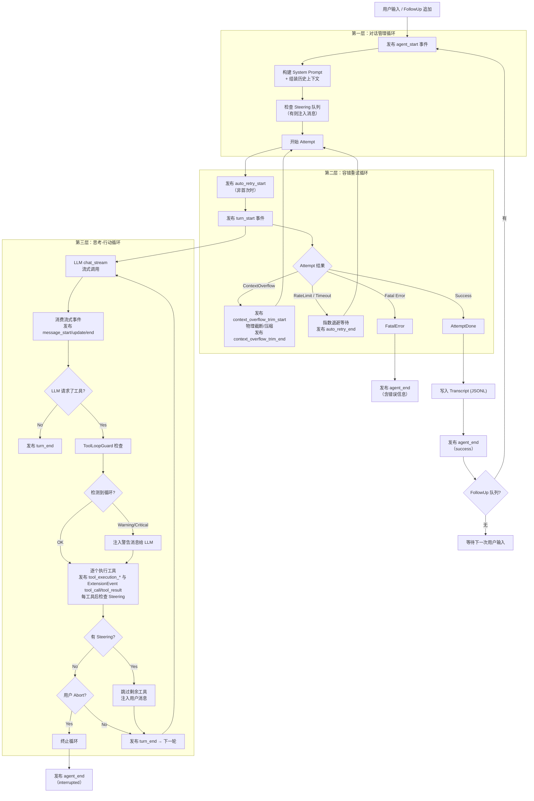

# 13. Agent Loop 设计

本文为 [Architecture](../Architecture.md) 中第 13 节的详细设计，总览见主文档。

---

## 13.1 概述与设计目标

Agent Loop 是 Agent 的核心运行循环，编排 LLM 调用、工具执行、用户中断（Steering/FollowUp/Abort）、容错重试（Compaction/Backoff）的完整生命周期。本设计与 pi-mono、openclaw 对齐，采用三层嵌套循环，并明确与事件系统（第 8 节）的发布时机对应关系。

### 设计目标

1. **生命周期清晰**：对话管理 → 容错重试 → 思考-行动，三层职责分离、边界明确。
2. **pi-mono 生态兼容**：事件名、Steering/FollowUp 语义、消息类型边界与 pi-mono 一致。
3. **可观测**：所有关键节点向事件总线发布 AgentEvent/ExtensionEvent，便于 UI 与插件订阅。
4. **可恢复**：Context Overflow、Rate Limit、网络超时等可重试错误由第二层统一处理。
5. **可扩展**：插件通过 Hook 点参与 Prompt 构建、工具调用前后等环节。

---

## 13.2 术语表

| 术语 | 说明 |
|------|------|
| **Agent Loop** | 智能体循环：接收用户输入 → 调用 LLM → 执行工具 → 结果回注 → 再调用 LLM → … → 最终回答。 |
| **Turn** | 轮次：一次 LLM 调用 + 可能的若干工具执行。无工具请求时 Turn 结束即 Loop 结束。 |
| **Tool Call** | 工具调用：LLM 通过结构化请求委托宿主执行 read_file、write_file、edit_file、execute_bash、list_dir 等。 |
| **Steering** | 转向/中断注入：用户于 Agent 工作中插话；当前工具执行完后跳过剩余工具，注入新消息并重新调用 LLM。 |
| **FollowUp** | 追加消息：Agent 刚结束时用户追加消息，在同一会话上下文中继续处理，不重新初始化。 |
| **Abort** | 中止：用户完全取消执行（如 Ctrl+C）；当前工具完成后终止循环，发布 agent_end(interrupted)。 |
| **Context Overflow** | 上下文溢出：对话历史超过 LLM 的 context window 限制。 |
| **Compaction** | 上下文压缩：保留 System Prompt + 最近 N 条，对中间历史做摘要或截断，腾出空间。 |
| **Attempt** | 尝试：一次完整的「思考-行动循环」执行；失败时由第二层重试（Compaction/Backoff）。 |
| **Tool Loop Detection** | 工具循环检测：防止同一工具+同参数或 A↔B 交替无进展地重复调用。 |

---

## 13.3 整体结构：三层嵌套循环

从外到内职责递进：

```
用户发送消息（或 FollowUp 追加）
│
▼
┌─────────────────────────────────────────────────────────┐
│  第一层：对话管理循环（Conversation Loop）                │
│  职责：用户输入、FollowUp 追加、Transcript 持久化         │
│  ┌─────────────────────────────────────────────────────┐ │
│  │  第二层：容错重试循环（Attempt Loop）                 │ │
│  │  职责：Context Overflow→Compaction；Rate Limit→退避  │ │
│  │  ┌─────────────────────────────────────────────────┐ │ │
│  │  │  第三层：思考-行动循环（Reasoning Loop）          │ │ │
│  │  │  职责：LLM 流式调用 + 工具执行 + Steering 检查   │ │ │
│  │  │  退出：无工具请求 / Steering 中断 / Abort       │ │ │
│  │  └─────────────────────────────────────────────────┘ │ │
│  └─────────────────────────────────────────────────────┘ │
└─────────────────────────────────────────────────────────┘
│
▼
等待下一次用户输入
```

### 13.3.1 流程图（Flowchart）



### 13.3.2 控制流伪代码

```
fn agent_run(session, user_message):
    emit(AgentStart { session_id })
    messages = session.build_context(context_cap)
    messages.append(user_message)

    # === 第一层：对话管理循环 ===
    loop:
        while steering_queue.has_pending():
            messages.append(steering_queue.drain())

        # === 第二层：容错重试循环 ===
        attempt_count = 0
        loop:
            attempt_count += 1
            if attempt_count > MAX_ATTEMPTS:
                emit(AgentEnd { error: "max attempts exceeded" })
                return
            if attempt_count > 1:
                emit(AutoRetryStart { attempt: attempt_count })

            result = run_reasoning_loop(session, messages)

            match result:
                Ok(response):
                    emit(AutoRetryEnd { success: true })
                    break
                Err(ContextOverflow):
                    emit(ContextOverflowTrimStart { reason: "context_overflow" })
                    messages = compact(messages)
                    emit(ContextOverflowTrimEnd { ... })
                    continue
                Err(RateLimit { retry_after }):
                    sleep(exponential_backoff(attempt_count, retry_after))
                    emit(AutoRetryEnd { success: false })
                    continue
                Err(Fatal(e)):
                    emit(AgentEnd { error: e })
                    return

        session.append_message(user_message)
        session.append_message(response)
        emit(AgentEnd { success })

        if follow_up_queue.is_empty():
            break
        else:
            messages.append(follow_up_queue.drain())
            emit(AgentStart { session_id })
            continue

fn run_reasoning_loop(session, messages) -> Result:
    tool_loop_guard = ToolLoopGuard::new()
    turn_index = 0
    loop:
        # MAX_TOOL_ROUNDS 已设为 usize::MAX（不限制）；
        # 工具轮次由上下文预算自然约束，详见 context-management.md §6.7。
        if turn_index >= MAX_TOOL_ROUNDS:
            return Ok(last_response)
        emit(TurnStart { turn_index })
        turn_index += 1

        llm_messages = convert_to_llm_format(messages)
        tools = build_tool_definitions()
        system_prompt = build_system_prompt(session)
        emit(MessageStart { role: assistant })
        stream = llm.chat_stream(system_prompt, llm_messages, tools)

        text_buf = ""; tool_calls = []
        for event in stream:
            match event:
                ContentDelta(delta): text_buf += delta; emit(MessageUpdate { delta })
                ToolCallDelta(...): accumulate_tool_call(tool_calls, ...)
                FinishReason(reason): break
                Error(e): return Err(classify_error(e))

        emit(MessageEnd { text_buf, tool_calls })
        messages.append(AssistantMessage { text_buf, tool_calls })

        if tool_calls.is_empty():
            emit(TurnEnd { turn_index })
            return Ok(text_buf)

        guard_result = tool_loop_guard.check(tool_calls)
        if guard_result == Critical:
            messages.append(SystemMessage("检测到工具调用循环，请换一种方式"))
            continue

        for tc in tool_calls:
            if cancel_token.is_cancelled():
                emit(TurnEnd { turn_index })
                return Err(Aborted { partial_text, partial_messages: messages[start_idx..] })
            emit(ToolExecutionStart { ... })
            # 工具执行 await 被 tokio::select! 包裹，cancel 触发后立即返回
            result = select {
                r = execute_tool(session, tc) => r,
                _ = cancel_token.cancelled() => {
                    emit(ToolExecutionEnd { tc.id, result: "[interrupted]", ok: false })
                    return Err(Aborted { partial_text, partial_messages: messages[start_idx..] })
                }
            }
            emit(ToolExecutionEnd { ... })
            messages.append(ToolResultMessage { tc.id, result })
            if steering_queue.has_pending():
                messages.append(steering_queue.drain())
                break
        emit(TurnEnd { turn_index })
        continue
```

> **Aborted 语义**（见 [interrupt-and-cancellation.md](interrupt-and-cancellation.md)）：
> - `LoopError::Aborted { partial_text, partial_messages }` 由 `make_aborted` 构造，`partial_messages = messages[start_idx..]`，天然包含本轮已完成的 `tool_result` 与（若存在）已作为 partial push 的 assistant 消息。
> - `AgentLoop::run` 外层把 `Err(Aborted)` 转成 `AgentRunOutcome::Interrupted(AgentRunResult { new_messages, .. })`，与 `Completed` **共享同一持久化路径**；这是 T-003/T-004/T-017 的实现锚点。
> - 事件层：新增 `AgentEvent::Interrupted { session_id, partial_text_len, tool_results_count }`（wire：`agent_interrupted`），同时保留 `AgentEnd { error: "interrupted" }` 兼容旧订阅者。

---

## 13.4 消息类型设计

> **[已重构]** 原 `AgentMessage` 中间层已删除（见 `feature/collapse-to-chatmsg`），统一使用 `ChatMessage`（OpenAI wire format）。不同语义通过 `MessageKind` 字段区分，无需转换层。

```
ChatMessage（统一表示，直接发给 LLM）
┌──────────────────────────────────────────┐
│ role: user      + kind: Normal           │  普通用户消息
│ role: assistant                          │  助手回复
│ role: tool                               │  工具结果
│ role: system                             │  系统提示
│ role: user      + kind: Steering         │  内部 Steering 指令
│ role: user      + kind: CompactionSummary│  压缩摘要（替换旧消息）
└──────────────────────────────────────────┘
附加 #[serde(skip)] 字段: msg_id, kind, timestamp（不影响 wire format）
```

- **Steering**（`kind: MessageKind::Steering`）：标记内部指令，role 为 user 但不计入 turn 边界。
- **CompactionSummary**（`kind: MessageKind::CompactionSummary`）：压缩后的历史摘要，替换被压缩的消息段。
- 由于内存表示与 wire format 统一，更换 LLM Provider 无需修改转换逻辑。

---

## 13.5 System Prompt 构建流水线

每次 LLM 调用前，System Prompt 按以下顺序拼装：

1. **基础身份**（固定）：如「你是一个 AI 编程助手，运行在 tomcat 环境中…」
2. **可用工具描述**（动态）：从工具注册中心生成，如 read_file、write_file、edit_file、execute_bash、list_dir 等。
3. **插件注入**：通过 `before_prompt_build` 等 Hook，插件注入额外 system 指令或上下文。
4. **会话级配置**：模型、温度、会话自定义 system prompt 追加。

---

## 13.6 事件发布时序

Agent Loop 与 [事件系统](events.md) 的对应关系：每个 AgentEvent 在 Loop 中的**精确发布时机**如下。

```
agent_start              ← 第一层开始，用户消息进入
│
├─ [auto_retry_start]    ← 第二层非首次 Attempt 开始时
│
├─ turn_start            ← 第三层每轮开始
│  ├─ message_start      ← LLM 流式响应开始
│  ├─ message_update x N ← 每收到 ContentDelta / ToolCallDelta
│  ├─ message_end        ← LLM 流式响应结束
│  ├─ tool_execution_start（JSON `type`；Rust `ToolExecutionStart`）← 每个工具执行前（观察）
│  ├─ tool_call（ExtensionEvent；钩子，执行前）← 与上不同名
│  ├─ [tool_execution_update] ← 工具执行中（可选，如 bash 流式）
│  ├─ tool_result（ExtensionEvent；钩子，执行后）
│  ├─ tool_execution_end（JSON `type`；Rust `ToolExecutionEnd`）← 每个工具执行后（观察）
│  └─ turn_end           ← 本轮结束
│     … 如有更多工具请求，重复 turn_start → turn_end …
│
├─ [context_overflow_trim_start]  ← Context Overflow 路径（Rust `ContextOverflowTrimStart`）
├─ [context_overflow_trim_end]    ← Overflow 截断/压缩完成（Rust `ContextOverflowTrimEnd`）
├─ [auto_retry_end]         ← 重试结束
│
└─ agent_end             ← 整个 Agent 处理结束
   status: success | error | interrupted
```

方括号 `[]` 表示条件性发布（仅在对应场景触发）。

---

## 13.7 Steering、FollowUp 与 Abort

|          | Steering（转向） | FollowUp（追加） | Abort（中止） |
|----------|------------------|------------------|----------------|
| 触发时机 | Agent 工作中     | Agent 刚结束     | 任何时候       |
| 用户意图 | 改方向           | 加任务           | 全停           |
| 系统行为 | 完成当前工具，跳过剩余工具，注入新消息，重新调用 LLM | 不重新初始化，在现有上下文中继续 | 所有 stream/tool await 立即 cancel，返回 `AgentRunOutcome::Interrupted`（含 partial） |
| 触发方式 | steer(msg)       | follow_up(msg)   | `CancellationToken::cancel()`（Ctrl+C 软中断）|
| 对应事件 | （无独立事件）   | 新 agent_start   | `AgentEvent::Interrupted` + `AgentEnd { error: "interrupted" }` |
| 实现方式 | 线程安全队列，每工具完成后检查 | 线程安全队列，第一层循环尾部检查 | `tokio_util::sync::CancellationToken` + `tokio::select!` 竞速 await |

队列与信号设计建议：

- `steering_queue`：`Arc<Mutex<Vec<AgentMessage>>>`，UI 写、Loop 读。
- `follow_up_queue`：同上。**P1（bash background monitor）补充**：单 turn AgentLoop 私有的 `follow_up_queue` 仍保留旧语义；`ChatContext` 额外持有一份 **session 级共享 follow_up_queue**，通过 `AgentLoop::with_shared_follow_up_queue(...)` builder 注入。后台 shell 自然完成时由 `chat_loop` 中 spawn 的 lifecycle subscriber 守护 task 推入一条 `<background-task-finished ...>tail</background-task-finished>` synthetic notification（`ChatMessage::user`）。`run_chat_turn` 在装配 messages 后会 drain 一次该 queue（让首轮 reasoning 之前就能看到 synthetic）；AgentLoop 一层 conv loop 仍按旧契约在 attempt 成功后 drain（覆盖"turn 内新到达"的 synthetic）。auto-feed 与 dispatcher `task_output(block=true)` 路径之间的去重由 session 级 `completion_routes` 状态机（`ToolWillDeliver | Delivered`）保证，详见 [`tools/bash.md`](tools/bash.md#claim-on-entry-状态机)。chat_loop 主循环在每个真实用户输入之间最多连续触发 `AUTO_TURN_BUDGET=K=8` 次 auto-turn，超过后强制回 readline，避免 synthetic 风暴。
- `cancel_token`：`tokio_util::sync::CancellationToken`，可克隆、可 await、支持广播；每个 user turn 在 `readline` 读到非空输入后**重建一个全新 token**（避免上一轮残留 cancel 污染新轮），见 [interrupt-and-cancellation.md](interrupt-and-cancellation.md) §3、§4。
- Ctrl+C 双击语义：2 秒内两次 SIGINT 触发 `exit(130)`（hard interrupt，进程退出）；首击仅 cancel 当前 turn（soft interrupt，保留 partial）。

注入模式（与 pi-mono 对齐）：

- **one-at-a-time**（默认）：每轮只注入一条 steering 消息。
- **all**：一次性注入当前排队的所有 steering 消息。

---

## 13.8 工具循环检测（ToolLoopGuard）

防止 Agent 陷入无效重复调用的三道防线：

**第一道：Generic Repeat（通用重复）**

- 维护最近 HISTORY_SIZE（如 30）条工具调用的滑动窗口。
- 同一工具名 + 同参数 hash 重复超过 WARNING_THRESHOLD（如 10）→ 向 LLM 注入警告。
- 超过 CRITICAL_THRESHOLD（如 20）→ 强制终止当前 Attempt。

**第二道：Ping Pong（乒乓检测）**

- 检测 A → B → A → B → … 的交替模式。
- 两工具交替超过一定次数且结果无实质变化 → 注入警告。

**第三道：Global Circuit Breaker（全局熔断）**

- 单次 Attempt 内工具调用总次数超过 GLOBAL_BREAKER（如 30）→ 强制终止。

处理策略：

- **Warning**：向 messages 注入 system 提醒，不中断执行。
- **Critical**：跳过工具执行，向 messages 注入错误说明，让 LLM 换方式。

---

## 13.9 上下文压缩（Compaction）

详见 [上下文管理技术方案](context-management.md)。以下为与 Agent Loop 交互的概要：

上下文管理采用四层防护（L0 tool_result 清理 → L1 异步预热 → L2 检查与应用 → L3 物理截断），由 ratio 水位线驱动。与 Agent Loop 的三个交互时机：

- **⑤ LLM 回复后**（user turn 完成，绝不阻塞 UI），顺序为：`run_layer0_cleanup` → `preheat.try_restart_if_pending(...)`（ExhaustedPending → Running）→ `check_after_reply`（ratio >= 0.85，非阻塞 poll + apply boundary）→ `preheat.try_start()`（Idle → Running，条件满足时）→ `emit_context_metrics`
- **② 发起下一次 LLM 请求前**（下一个 user turn 进入时）：`preheat.try_restart_if_pending(...)` → `check_before_request`：`L2` 检查 CompactionSummary → 完成则 Boundary 切换（ratio >= 0.98 时可化异步为同步等待）→ `messages` 从更新后的 `userTurnsList` 重建
- **③ reasoning loop 内 API 返回 Context Overflow**：L3 物理截断 + 重试（第二层 Attempt Loop）；该路径发布 `ContextOverflowTrimStart` / `ContextOverflowTrimEnd`（JSON wire：`context_overflow_trim_start` / `context_overflow_trim_end`），不再使用 `AutoCompactionStart` / `AutoCompactionEnd`

**context_metrics_update 发射节奏**（单次第三层 `run_reasoning_loop`）：

- 至多 **两次**：(1) **首次**向 LLM 发起 `chat_stream` **之前**（`turn_index == 1`）；(2) **该次 run 正常收尾**——assistant **无** `tool_calls` 时与 timing ⑤ 末尾的 `emit_context_metrics` 同路径；若因 **`max_tool_rounds`** 耗尽退出且最后一轮仍有 `tool_calls`，在该轮 `TurnEnd` **之后**、`return` **之前**再发射一次。
- **中间**各 tool round（执行完工具、尚未发起下一轮 LLM）**不**发射 `context_metrics_update`，避免 CLI/扩展与「每轮工具后一条」刷屏。

> 步骤编号（②③⑤）对应 [context-management.md §5.6](context-management.md) 的完整链路图。

---

## 13.10 错误分类与处理策略

| 类别 | 处理方 | 示例 | 行为 |
|------|--------|------|------|
| **可重试** | 第二层 Attempt Loop | ContextOverflow（含 API 400 `context_length_exceeded` 等，见 `is_context_overflow_error`）、RateLimit、NetworkTimeout、ServerError(5xx) | L3 物理截断（若有 ContextState）/ 指数退避后重试 |
| **致命** | 直接终止 | 401、非上下文类 400（如 invalid model）、ModelNotFound、MaxAttemptsExceeded | 发布 agent_end { error } |
| **工具错误** | 不终止 Loop | 文件不存在、权限拒绝、命令失败 | 作为 ToolResult 返回 LLM，由 LLM 调整策略 |

---

## 13.11 插件 Hook 点

Loop 在以下位置发布 ExtensionEvent，插件通过 `agent.on(event_name, callback)` 订阅：

- **before_prompt_build**：System Prompt 构建前，可注入 system 指令或上下文。
- **tool_execution_start** / **tool_execution_end**（见 [events.md](events.md)）：Agent 观察向，流式/UI。
- **tool_call** / **tool_result**（ExtensionEvent，见 [events.md](events.md)）：扩展钩子，执行前/后；与观察向事件名不同。
- **input**（见 [events.md](events.md)）：用户输入进入 Loop 前，可预处理。

约束（与 events.md 一致）：按注册顺序执行；单次回调错误不影响其他回调与主流程；Hook 可有超时，超时则跳过；异常通过 ExtensionError 记录。

---

## 13.12 与现有架构模块的关系

| Architecture 章节 | 与 Agent Loop 的关系 |
|------------------|----------------------|
| 2. 宿主核心能力层 | Loop 调用 Session、LLM、4 原语、工具注册中心 |
| 2.1 会话管理 | Loop 读写 Transcript，组装上下文 |
| 2.2 LLM 接入 | Loop 调用 chat_stream() |
| 2.3 4 原语 / 2.4 工具注册中心 | Loop 通过工具注册中心执行工具 |
| 8. 事件系统 | Loop 是 AgentEvent/ExtensionEvent 的主要发布者，发布时机见 13.6、13.11 |
| 9. 会话存储 | Loop 在 agent_end 时写入 Transcript |
| 11. 异步 Hostcall | 插件通过 Hostcall 调用 LLM/exec 时，底层走异步 submit/poll |
| 12. JS API 对齐 | 插件注册的自定义工具经工具注册中心进入 Loop 的 tool_definitions |

代码映射建议：

- **src/core/agent_loop.rs**（新增）：AgentLoop 结构体，三层循环逻辑。
- **src/core/tool_loop_guard.rs**（新增）：工具循环检测。
- **src/core/compaction.rs**（新增）：上下文压缩策略。
- **src/infra/events.rs**（已有）：事件枚举已定义，无需改枚举。
- **src/api/chat.rs**（重构）：由直接实现循环改为调用 AgentLoop::run()。
