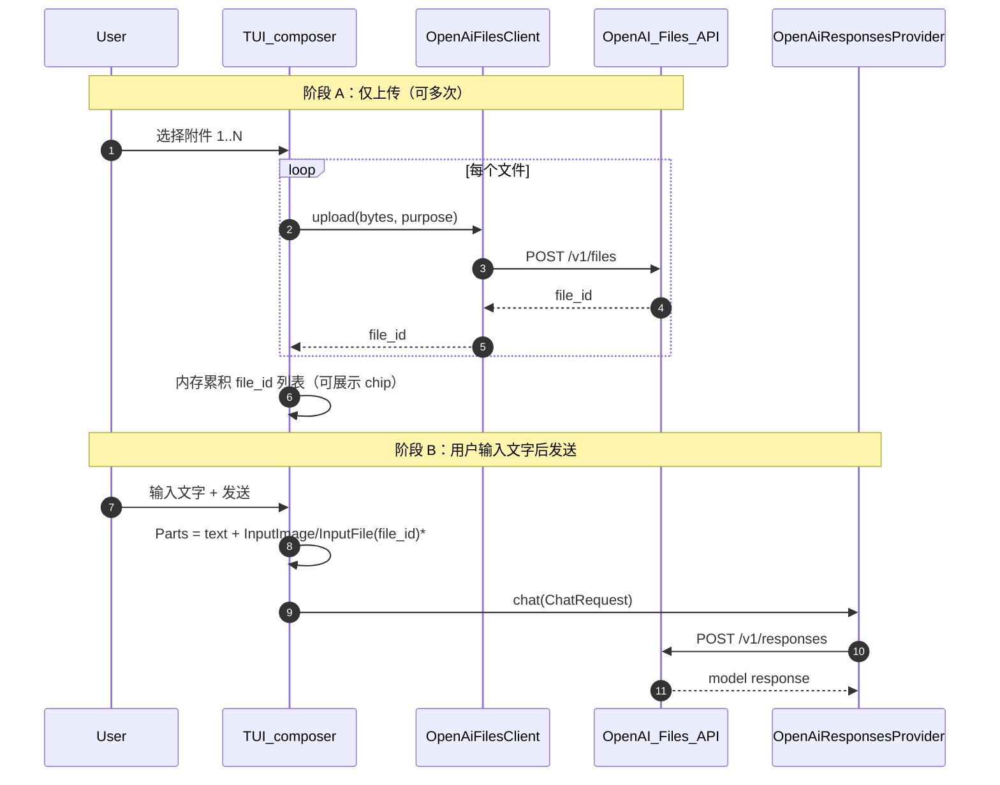

# OpenAI Files 上传管理（`POST /v1/files`）

本文档是 **[T2-P0-015](../../agents/TASK_BOARD_002/tasks/T2-P0-015.md) | llm-files-upload-manager** 的冻结版技术方案（OpenSpec **A 类**：`docs/architecture/` 根下跨模块方案），与任务卡 **双向锚定**：任务卡列子项与验收，本文列决策、协议与测试指针；**实现以仓库代码为准**；未定稿的占位以「计划」标明。承接 **[T2-P0-012](../../agents/TASK_BOARD_002/tasks/T2-P0-012.md)** 已落地的 **inline base64（A 通道）** 与 **已知 `file_id`（B 通道）** wire，补齐 **multipart 上传 → `file_id` → Responses 引用** 的闭环与生命周期治理。

**节号与 [`ARCHITECTURE_SPEC.md`](../../openspec/specs/guides/workflow/ARCHITECTURE_SPEC.md) 对应**：本文 `## 1`–`## 13` 分别映射规范 **§1 术语** … **§13 历史决策**（与 [`tools/read.md`](tools/read.md) 文首脚注同构）。标杆写法：**§2 仅调研**；**§4** 含 **§4.1 七列决策表**（`决策` + `说人话`）+ **§4.2 五列实施表** + **§4.2.x** 技术要点。

**关联**：[多 LLM / OpenAI 对接](llm-multiprovider-integration.md) **§6.5.3–§6.5.4**；[`read` 工具多模态边界](tools/read.md) **§4.2.4**；**任务卡** [`T2-P0-015.md`](../../agents/TASK_BOARD_002/tasks/T2-P0-015.md)（元数据表内「技术方案」列回链本文）。

<a id="openai-official-files-api-reference"></a>

**OpenAI 官方 API 参考（HTTP 契约以文档为准；与 §5 互链）**：

| 主题 | URL |
|------|-----|
| **Files 资源**（`GET/POST https://api.openai.com/v1/files`、`GET/DELETE …/v1/files/{file_id}`、`GET …/content`） | https://developers.openai.com/api/docs/api-reference/files |
| **Upload file**（`POST /v1/files`，multipart：`file` + `purpose`） | https://developers.openai.com/api/reference/resources/files/methods/create |
| **File inputs**（文件与各 API 的配合说明） | https://developers.openai.com/api/docs/guides/file-inputs |

> 说明：OpenAI 文档域名正在从 `platform.openai.com` 向 `developers.openai.com` 迁移；若本地书签仍指向旧站，可与上表 URL 对照。**实现与验收**以官方参考中的路径、字段及 `curl` 示例为准。

---

## 目录

- [OpenAI 官方 API 参考（文首）](#openai-official-files-api-reference)
- [1. 术语统一](#1-术语统一)
- [2. 竞品 / 选型对比（调研）](#2-竞品--选型对比调研)
- [3. 目标与设计原则](#3-目标与设计原则)
- [3.4 产品形态：CLI 与 TUI：上传与聊天时序](#34-产品形态cli-与tui上传与聊天时序)
- [4. 落地选型与实施（已定稿）](#4-落地选型与实施已定稿)
- [5. 协议（REST / Rust API，含官方参考链接）](#5-协议rest--rust-api)
- [6. One-Glance Map（文件职责总览）](#6-one-glance-map文件职责总览)
- [7. 调度时序](#7-调度时序)
- [7.1 TUI 两阶段](#71-tui-两阶段)
- [8. 状态机](#8-状态机)
- [9. 配置与环境变量](#9-配置与环境变量)
- [10. 错误模型](#10-错误模型)
- [11. 测试矩阵（验收）](#11-测试矩阵验收)
- [12. 风险与应对](#12-风险与应对)
- [13. 历史决策 / 跨文档修订](#13-历史决策--跨文档修订)

---

## 1. 术语统一

| 术语 | 语义（大白话） | 数据载体 | 行为约束 | 说人话 |
|------|----------------|----------|----------|--------|
| **A 通道（inline）** | 字节 base64 塞进请求 JSON，不经 OpenAI Files | [`ChatMessageContentPart::InputImage` / `InputFile`](../../src/core/llm/types.rs) 的 `image_b64` / `file_b64` 字段 | 受 `IMAGE_MAX_BYTES` / `FILE_MAX_BYTES` 约束；[`part_to_responses_value`](../../src/core/llm/openai_responses/payload.rs) 拼 `data:` URL | 小图小 PDF 直接塞包里发走。 |
| **B 通道（file_id）** | 引用已在 OpenAI 账户里的文件 | 同上变体的 `file_id: Option<String>` | **非空 `file_id` 优先于 inline**（payload 翻译顺序）；不做本地字节大小校验 | 先上传拿 id，再只传 id，省带宽。 |
| **`OpenAiFilesClient`** | 专打 `POST/GET/DELETE {base}/v1/files` 的薄客户端 | 计划：`src/core/llm/openai_files.rs`（或子目录）+ 共享 `reqwest::Client` / `LlmConfig` 派生的 base/key | 与 Responses 适配器 **解耦**：只负责 Files REST，不组 `ChatRequest` | 上传归上传，对话归对话。 |
| **`purpose`** | OpenAI 侧文件用途（影响可用场景） | 计划：`enum FilePurpose` 映射到 REST `purpose` 字符串（如 `vision`、`user_data`） | 以官方当前文档为准；图片与通用文件可能分 purpose | 告诉 OpenAI 这文件是给看图还是给当附件。 |
| **Reuse cache（双索引）** | 同一字节内容不重复 `POST /v1/files`，且**同路径文件改动后不命中旧 file_id** | 计划：进程内 `DashMap` 等价；**两张表**——① `path → CacheEntry { mtime_ms, size, sha256, file_id, expires_at }`；② `sha256 → file_id`（跨路径去重） | **一致性检查顺序**：(a) 路径表查 `(mtime, size)` 一致 → 直接复用 `file_id`；(b) `(mtime, size)` 变 → 重算 `sha256`；(c) `sha256` 一致 → 仍复用并刷新 stamp；(d) `sha256` 不一致 → 视为**新文件**，上传得 `file_id'`，旧 `file_id` 入 DELETE 队列；(e) 命中 entry 已 `expires_at <= now` → 视为失效，重传。**借鉴** [`read_state.rs::ReadStamp`](../../src/core/tools/pipeline/read_state.rs) 的「mtime+size 快路径，hash 兜底」 | 同一份 PDF 连发五轮别上传五次；改了再传就别还用旧 id。 |
| **`expires_after`**（服务端 TTL） | 上传时声明文件几秒后由 OpenAI 自动删除 | wire：`expires_after[anchor]=created_at` + `expires_after[seconds]=N` ([官方 Upload file](https://developers.openai.com/api/reference/resources/files/methods/create)) | 取值范围 **3600 ~ 2592000s**；**默认 86400s（24h）**，进程崩溃 / CI 异常退出也不会泄漏 | 让 OpenAI 自己到点收尸，不全靠我们 DELETE。 |
| **`cleanup_on_exit`**（客户端 DELETE） | 会话 / 进程退出时是否**主动**删远端 file（**手刹**） | **实现内默认**（无 TOML）；**与 `expires_after` 是兜底关系**，不互相替代 | 编排层在会话收尾对本会话登记的 `file_id` **尽力 DELETE**（幂等 404）；策略常量（如是否 `older_than`）若需产品化再开新任务，**本任务不暴露配置项** | 不等 24 小时，主动删；崩溃也有 expire 兜底。 |
| **「下一轮 Responses 请求发出前」** | 指 **`OpenAiResponsesProvider::chat` / `chat_stream` 已拿到含 `file_id` 的 `ChatMessage`、即将 `POST /v1/responses` 之前** | — | 与上传重试、cleanup 时序讨论绑在此边界 | 上传必须在打 Responses 之前结束（同轮或上一轮末缓存）。 |

---

## 2. 竞品 / 选型对比（调研）

本节为**调研材料**（关切、横向、维度词典）；**已定稿的维度取舍与代码落点**见 **[§4](#4-落地选型与实施已定稿)**。

### 2.1 典型关切

```text
┌────────────────────────────────────────────────────────────────────────────┐
│  OpenAI Files + Responses 组合通常要同时解决的问题                          │
├────────────────────┬─────────────────────────────────────────────────────┤
│  体积与膨胀        │  inline base64 放大 ~33%；大 PDF 易触请求体上限       │
│  多轮复用          │  同一附件每轮重传 → 费带宽与延迟                     │
│  账户侧垃圾        │  上传后默认长期留存；测试与异常路径易泄漏 file        │
│  权限与密钥        │  Key/Project 未启用 Files / 组织限制 → 4xx；需结构化降级 │
│  与对话 wire 正交  │  Files API 与 `/v1/responses` 是两条 HTTP，勿揉进 Provider 核心循环 │
└────────────────────┴─────────────────────────────────────────────────────┘
```

### 2.2 常见实现横向对比

| 来源 / 形态 | 是否走 OpenAI `POST /v1/files` 作为对话输入主路径 | 多模态 / 附件如何进模型 | 备注 |
|-------------|---------------------------------------------------|-------------------------|------|
| **pi_agent_rust**（本工作区检索） | **未发现** `v1/files` 与 chat/responses 输入主链路的 Rust 命中 | Responses / Completions 走各自 Provider | 与 [T2-P0-015 说明](../../agents/TASK_BOARD_002/tasks/T2-P0-015.md) 五仓调研一致 |
| **hermes-agent** | **否** | **native 模式**：用户附图 → OpenAI Chat 形 `image_url`（常为 `data:…;base64,…`）；走 **Codex/Responses 时**由适配器译为 `input_image` + **`image_url` 字符串**（仍为 data URL，非 `file_id`）。见 **§2.3** | 像素在 JSON 里，不经 Files API |
| **openclaw** | **否** | [`openai-transport-stream.ts`](../../../../openclaw/src/agents/openai-transport-stream.ts)：`user` 与 **`function_call_output`** 中的图块均拼为 `{ type: "input_image", image_url: \`data:${mime};base64,${data}\` }` | 与 hermes/codex 同思路：inline data URL |
| **codex** | **否** | [`view_image.rs`](../../../../codex/codex-rs/core/src/tools/handlers/view_image.rs)：`view_image` 读盘 → `into_data_url()` → 工具输出里 **`InputImage { image_url }`** 进 Responses 输入流 | 本地看图工具直接塞 data URL |
| **GenericAgent** | **否**（非 OpenAI Files；本地宿主逻辑） | [`GenericAgent/frontends/qtapp.py`](../../../../GenericAgent/frontends/qtapp.py) `_build_prompt_with_uploads`、`_pending_files`：bytes 拼入用户提示侧 | 对照组：**附件进会话 ≠ OpenAI multipart Files** |
| **cc-fork-01** | **否**（OpenAI 0 命中） | 接的是 **Anthropic Files API**（同名 path `/v1/files`，但 host 为 `api.anthropic.com`，beta header `files-api-2025-04-14`）；用途是 **session 启动下载附件 + 会话上传**，**不** 直接驱动 chat 输入 | [`cc-fork-01/src/services/api/filesApi.ts`](../../../../cc-fork-01/src/services/api/filesApi.ts) `uploadFile`（multipart `purpose=user_data`）、`listFilesCreatedAfter`（`after_id` 分页）、`downloadFile`（`/v1/files/{id}/content`）、`retryWithBackoff` + 500 MiB 上限 — **multipart / 分页 / 重试 / 错误归一**值得借鉴 |
| **tomcat（现状）** | **否**（B 通道仅占位，无上传实现） | A/B 双通道 wire 已通：[`types.rs`](../../src/core/llm/types.rs) + [`openai_responses/payload.rs`](../../src/core/llm/openai_responses/payload.rs) | 本文档定稿 **上传子系统** |

**检索方法（证据链）**：2026-05-10 在工作区根 `/Users/yankeben/workspace/Tomcat/` 对 8 仓（cc-fork-01 / codex / GenericAgent / hermes-agent / openclaw / pi_agent_rust / pi-mono / QevosAgent）执行：

```bash
grep -rE 'api\.openai\.com/v1/files|/v1/files[^A-Za-z0-9_/]|openai\.files|client\.files\.(create|delete|retrieve|list)|FilePurpose|"purpose":"(vision|user_data|assistants)"' \
  --include='*.rs' --include='*.ts' --include='*.tsx' --include='*.js' --include='*.py' --include='*.go' \
  --exclude-dir=node_modules --exclude-dir=.git --exclude-dir=target --exclude-dir=dist --exclude-dir=build
```

- **OpenAI** Files API（host = `api.openai.com`）：**8 家 0 命中**。
- 同形 **Anthropic** Files API：**cc-fork-01** 完整实现（见上表），**形态同构**于 OpenAI（multipart `purpose+file` → JSON `id`，`GET /v1/files` 分页，`/v1/files/{id}` DELETE），可作为工程模板。
- **附件进模型** 的实际做法（见 §2.3）：codex / openclaw / hermes-agent 均走 **inline `image_url=data:...;base64,...`**（与我们 A 通道一致）；GenericAgent 把字节拼进用户 prompt。
- **结论**：「**先 `POST /v1/files` 取 `file_id` 再传 OpenAI Responses**」这一跳 **8 家 0 实现**，属 **tomcat T2-P0-015 自研增量**；上传管道工程参考 cc-fork-01。

### 2.3 三仓「附件进模型」代码锚点（精读结论）

下列路径相对本 monorepo 根 `Tomcat/`；实现方式均为 **inline 多模态**，**不**调用 `POST /v1/files` 取 `file_id`。

| 仓库 | 机制（说人话） | 代码锚点 |
|------|----------------|----------|
| **hermes-agent** | 用户贴图：`native` 时在 user 消息里塞 **`type: image_url`**；若主链路走 Responses/Codex，**`codex_responses_adapter._chat_content_to_responses_parts`** 把 `image_url` / `input_image` 转成 **`{"type":"input_image","image_url": "<url>"}`**（url 多为 data URL）。另有 **`vision_tools`**：按 URL 下载图再 base64 喂 **辅助 vision** API，仍非 OpenAI Files。 | [`agent/image_routing.py`](../../../../hermes-agent/agent/image_routing.py)（`image_url` + data URL 注释）；[`agent/codex_responses_adapter.py`](../../../../hermes-agent/agent/codex_responses_adapter.py) `_chat_content_to_responses_parts` L81–94；[`tools/vision_tools.py`](../../../../hermes-agent/tools/vision_tools.py) 模块头注释 |
| **openclaw** | 把 transport 里 user 消息的图块、以及 **带图的 tool result**，一律映射为 Responses 的 **`input_image`**，**`image_url`** 固定拼成 **`data:${mimeType};base64,${data}`**。 | [`src/agents/openai-transport-stream.ts`](../../../../openclaw/src/agents/openai-transport-stream.ts) 约 L268–276（user）、L340–351（`function_call_output` 内嵌图） |
| **codex（codex-rs）** | **`view_image`** 工具：沙箱读图片字节 → **`load_for_prompt_bytes`** → **`into_data_url()`** → 作为 **`FunctionCallOutputContentItem::InputImage { image_url, detail }`** 写回模型上下文（仍是 data URL）。 | [`codex-rs/core/src/tools/handlers/view_image.rs`](../../../../codex/codex-rs/core/src/tools/handlers/view_image.rs) 约 L160–232 |

**阅读顺序（说人话）**：三家的共同点是把 **字节变成 `data:…;base64,…`**（或等价的 `image_url` 字段）**直接写进对话/工具输出的 JSON**，由 **同一轮 `POST /v1/responses`（或 Chat Completions）** 带走；**没有**「先 `POST /v1/files` → 再只传 `file_id`」这一跳。tomcat 的 **T2-P0-015** 正是要补这一跳。

### 2.4 维度词典（U1–U12）

> 维度编号与 **§4.1 决策表** 一一对应；表内只放扫读用关切，落地证据与拒因看 §4.1。

| 维度 | 关切 | 说人话 |
|------|------|--------|
| U1 与对话解耦 | Files HTTP 是否污染 `OpenAiResponsesProvider` 主文件 | 上传单独模块，Provider 仍只翻译 `ChatRequest`。 |
| U2 重试语义 | 429/5xx 是否与 Responses 一致 | 字符串启发式对齐 [`OpenAiResponsesProvider::is_retriable`](../../src/core/llm/openai_responses/mod.rs)。 |
| U3 账户卫生 | 测试与异常是否泄漏 `file-*` | 集成测 Drop guard + `list` 断言；DELETE 幂等。 |
| U4 类型层 | 是否新 serde 变体 | 不加新 variant，只加 async helper。 |
| U5 缓存一致性（双索引） | 同路径改动 + 跨路径同内容 | `path → mtime+size+sha256+file_id` 与 `sha256 → file_id` 两张表协同。 |
| U6 Session GC | 钩子在哪 | 编排层注入，不脏 `SessionManager` 核心。 |
| U7 404 DELETE 幂等 | 删两次别炸 | 404 当成功，写 debug 日志。 |
| U8 CLI·TUI 编排 | 上传与发话的先后顺序 | 先 Files 拿 `file_id`，再与文字并组 `ChatRequest`；TUI 两阶段、CLI 单轮串行。 |
| U9 服务端 TTL vs 客户端 GC | 谁主谁备 | `expires_after`（默认 24h）兜底 + `cleanup_on_exit` 主动加速。 |
| U10 实例化与生命周期 | `OpenAiFilesClient` 谁持有 | 跟随 `LlmConfig` lazy 构造，**不进** `LlmProvider` 注册表。 |
| U11 Provider 能力门闸 | 谁允许走 `/v1/files` | **仅**当前选中的 `LlmProvider` 实现声明支持 OpenAI Files 兼容 API 时才走上传链路；否则 helper 直接失败并提示 inline。 |
| U12 配置面 | TOML 是否膨胀 | **`[llm.files]` 仅一项**：`expires_after_seconds`；其余（enabled / base / cache / cleanup）**不进配置**。 |

---

## 3. 目标与设计原则

**一句话**：在大附件与多轮复用场景用 **`file_id` 引用** 替代每轮 inline 重传，并用 **可配置生命周期 + 缓存** 控制 OpenAI 账户侧文件堆积与成本。

### 3.1 观察指标表（与 §11 验收一一对应）

| 目标 | 观察指标（落地后可核对） | 说人话 |
|------|--------------------------|--------|
| G1 真上传 roundtrip | **1KB / 100KB / 5MB / 20MB** 四档：`POST /v1/files` → 拿 `id` → Responses `input_*` 引用 `file_id` → 模型有意义回复 → `DELETE` 成功；其中 5MB / 20MB 命中 §3.3「必须 upload」分支 | 小到大都跑得通，inline → upload 自动降级也覆盖。 |
| G2 缓存命中（同字节） | 同一 `(sha256, mime, purpose)` 连续 5 次请求仅 **1** 次真实 `POST /v1/files`，其余走缓存 | 别重复交同一份作业。 |
| **G6 缓存一致性** | 同**路径**文件 `mtime + size` 未变 → 跳过 sha256 计算并复用旧 `file_id`；改文件后 sha256 变 → 重新上传新 `file_id`，旧 `file_id` 入 DELETE 队列 | 改文件后再问别拿旧答案。 |
| G3 上传被 4xx 拒绝 | `POST /v1/files` 返回 4xx（Project 未启用 Files / 组织限制 / Key 无效 / 不支持的 `purpose`）→ 结构化 `AppError::Llm`，文案指向 inline 回退 (`image_b64` / `file_b64`)；**不**虚构 OpenAI 不存在的 "files scope" 概念 | Files 这条道走不通就告诉人改走 inline。 |
| **G7 服务端 TTL 兜底** | 上传请求 body 默认带 `expires_after.anchor=created_at` + `expires_after.seconds=86400`；`list` 返回的 `expires_at` 与上传时 + 24h 误差 < 60s | 崩了也不会留垃圾，OpenAI 自己 24h 后清。 |
| G4 退出清理（主动） | 会话退出路径对本会话登记 `file_id` **默认尽力 DELETE**（实现常量策略，无 TOML）并 **tracing 审计**；记录字段 `file_id / bytes / created_at / reason` | 走人时默认扫地，并留审计。 |
| G5 零泄漏 | 集成测试结束后 `list`（带测试 prefix 过滤）**0 条**残留 | CI 不把垃圾留在 OpenAI 账户。 |
| **G8 取消传播** | upload future 在编排层 token 取消（Ctrl+C 等）后立即 drop，reqwest 自带 cancel-on-drop 释放 socket；最长 100ms 内退出 | 用户按停就别再传了。 |

### 3.2 非目标

| 非目标 | 推给 | 说人话 |
|--------|------|--------|
| TUI 拖拽、附件 chip、具体控件像素 | **T2-P0-012** 余子项 | **UI 皮肤**归 012；**本文 §3.4** 只钉 **「先 Files 拿 `file_id`，再与文字一并组 `ChatRequest`」** 的编排契约，供 CLI / 未来 TUI 共用。 |
| `read` 工具二进制分流 / UTF-8 误读修复 | **T2-P0-012** + [`read.md`](tools/read.md) | read 语义不归本文。 |
| Anthropic / 非 OpenAI Files | 未来 Provider 任务 | 本文只钉 OpenAI REST。 |
| 服务端图片缩放 | [`read.md` §3.2](tools/read.md) 非目标 | 不引入 `image` crate 做缩放。 |

### 3.3 inline vs upload 决策树（产品阈值）

与任务卡及 [§6.5.4](llm-multiprovider-integration.md#654-files-上传管理) 对齐的**默认策略**（实现可调，但文档先钉死可观察分叉）：

| 条件 | 选用通道 | 与 `IMAGE_MAX_BYTES` / `FILE_MAX_BYTES` 关系 | 说人话 |
|------|----------|---------------------------------------------|--------|
| 图片解码后 **< 1 MiB** 且可走 A | **inline** `image_b64` | 远低于 `IMAGE_MAX_BYTES` (4.5 MiB) | 小图直接 inline。 |
| **1–10 MiB**（或需跨多轮复用同一附件） | **upload** → B 通道 | 可超过 inline 图片上限但仍受 **OpenAI 官方文件大小上限**约束；实现须在 upload 前做 metadata 预检 | 中等体积用上传省重复流量。 |
| **> 10 MiB** 或 inline 会超 `FILE_MAX_BYTES` | **必须 upload**（若仍超官方上限则结构化拒绝） | inline 路径在 types helper 已拒；upload 走 Files 上限由 OpenAI 文档约束 | 大文件别硬塞 JSON。 |

### 3.4 产品形态：CLI 与 TUI：上传与聊天时序

**已定稿取舍**：与 **§4.1** 决策表 **U8** 行同一决策点（表内写拒因，本节写时序）。

**设计意图（说人话）**：`OpenAiFilesClient` 是一条 **独立 HTTP 链路**（`POST /v1/files`），只负责 **把本地字节变成 OpenAI 侧的 `file_id`**；**chat** 仍只认内存里的 [`ChatRequest`](../../src/core/llm/types.rs) / `ChatMessageContentPart`（B 通道 `image_file_id` / `file_file_id`）。编排层（CLI 入口、未来 TUI compositor）决定 **何时** 调 Files、**何时** 把得到的 `file_id` 塞进即将发往 `OpenAiResponsesProvider` 的那条 user 消息。

#### 3.4.1 CLI 模式（单轮内自动降级）

当用户指定附件路径且 **超过当前 inline helper 上限**（[`IMAGE_MAX_BYTES`](../../src/core/llm/types.rs) / [`FILE_MAX_BYTES`](../../src/core/llm/types.rs)）或命中 §3.3「必须 upload」分支时：

```text
  CLI 解析路径 + metadata
         │
         ├─ 未超限 ──► image_b64 / file_b64（A 通道）──┐
         │                                            │
         └─ 超限 / 策略要求 upload                     │
                 │                                    │
                 ▼                                    │
         OpenAiFilesClient::upload                    │
                 │                                    │
                 ▼                                    ▼
            file_id                          ChatMessageContentPart
                 │                         （inline 或 file_id）
                 └──────────────────────► 组 Vec<Part> ──► POST /v1/responses
```

**约束**：同一轮用户输入里，**先**完成 Files（或 cache 命中）**再**发 Responses；失败则 **不** 发半条带空 `file_id` 的请求（结构化错误回 CLI）。

#### 3.4.2 TUI 模式（两阶段：先附件、后文字）

未来 TUI 下，交互拆成 **显式两阶段**（与 CLI「单轮内自动」不同，但 **底层契约相同**）：

1. **阶段 A — 仅上传**：用户选择 1 个或多个本地文件 → UI 每条独立调用 **`OpenAiFilesClient::upload`（或 `image_upload`/`file_upload` helper）** → 得到 **`file_id` 列表**（可展示 chip、可复用 cache）；此阶段 **不** 调用 `POST /v1/responses`。
2. **阶段 B — 发消息**：用户输入文字并点击发送 → UI 将 **文字 `InputText` + 阶段 A 累积的多个 `InputImage`/`InputFile`（`file_id`）** 组装为 **单条**（或按产品拆多条）**`user` 消息的 `Parts`** → `ChatRequest` → `OpenAiResponsesProvider::chat` / `chat_stream`。

```text
  阶段 A（可重复）                阶段 B（一次发送）
 ┌──────────────────┐           ┌─────────────────────────────┐
 │ 选文件 → Upload   │           │ 输入文字 + 点发送           │
 │ → file_id_1..N   │──────────►│ Parts = [text, id…, id…]   │
 │ （仅 Files HTTP） │  内存持有  │ → ChatRequest → Responses   │
 └──────────────────┘           └─────────────────────────────┘
```

**与 CLI 的共性**：Responses 请求体里 **不出现**「未上传成功的裸路径」；**只出现** 已解析好的 `file_id` 或已读盘的 inline。  
**与 CLI 的差异**：TUI 把阶段 A、B **在 UX 上拆开**；CLI 可在一次命令提交内 **自动串行** 两阶段。

**阅读顺序（说人话）**：Files 管「货进仓库拿单号」；chat 管「把单号写进信里寄给模型」；TUI 让用户分两步点，CLI 可以一步帮你做完。

---

## 4. 落地选型与实施（已定稿）

### 4.1 落地选型决策表（维度取舍）

**`决策`** 列钉本行裁决结论（**SHOULD**），与 [`ARCHITECTURE_SPEC.md`](../../openspec/specs/guides/workflow/ARCHITECTURE_SPEC.md) **§4.1 / §14.1** 同向。

| 维度 | 关切 | 决策 | 取自 | 入选理由 | 未入选 + 拒因 | 说人话 |
| --- | --- | --- | --- | --- | --- | --- |
| U1 模块边界 | Files HTTP 放哪 | **采用** 独立 `OpenAiFilesClient`。 | **tomcat** [`openai_responses/mod.rs`](../../src/core/llm/openai_responses/mod.rs)（Responses 已独立）+ 计划 `openai_files.rs` | **设计**：独立 `OpenAiFilesClient`；**理由**：multipart、生命周期与 `part_to_responses_value` 正交，Reviewer 可分开审 | 全塞进 `OpenAiResponsesProvider` → 单文件职责爆炸 | 上传单独拎一块。 |
| U2 重试 | 与 Responses 是否一致 | **采用** Files 客户端复用 Responses 同等判定 helper，并对齐 cc-fork 经验阈值（3 次 + 指数退避）。 | **tomcat** `OpenAiResponsesProvider::is_retriable` + **cc-fork-01** [`filesApi.ts:97–131 retryWithBackoff`](../../../../cc-fork-01/src/services/api/filesApi.ts)（指数退避、`MAX_RETRIES=3`、`BASE_DELAY_MS=500`） | **设计**：Files 客户端复用 Responses 同等判定 helper，并对齐 cc-fork 经验阈值（3 次 + 指数退避）；**理由**：运维行为统一 | 另一套重试表 → 行为分叉难排障 | 跟对话同一个脾气。 |
| U3 reqwest | multipart 从哪来 | **采用** 加 `multipart` feature。 | **tomcat** [`Cargo.toml`](../../Cargo.toml) `reqwest = { features = ["json", "stream"] }` + **cc-fork-01** [`filesApi.ts:425–469`](../../../../cc-fork-01/src/services/api/filesApi.ts)（手拼 boundary + axios post，可佐证 `purpose+file` 双 part 形态） | **设计**：加 `multipart` feature；**理由**：官方推荐 multipart 上传文件体；cc-fork 同形 Anthropic Files API 验证过 `purpose=user_data` + filename multipart 正常工作 | `curl` 子进程上传 → 部署与 wasm 路径复杂；手拼 boundary 字符串 → reqwest multipart 已封装更安全 | 用库内 multipart。 |
| U4 类型层 | 是否新 serde 变体 | **采用** 仅加 **async helper** `image_upload` / `file_upload` 返回已有 enum。 | **tomcat** [`types.rs`](../../src/core/llm/types.rs) `InputImage`/`InputFile` | **设计**：仅加 **async helper** `image_upload` / `file_upload` 返回已有 enum；**理由**：T2-P0-012 wire 已冻结 | 新第四态 `Uploaded…` → 破坏已有 JSON 契约 | 不加新类型，只加 helper。 |
| **U5 cache 一致性（双索引）** | 同字节去重 + 同路径**改了别拿旧答案** | **采用** 双索引 `path→CacheEntry` + `sha256→file_id`；首版仅内存。 | 本方案 + read_state.rs 模式复用 | **设计**：进程内**两张表**——① `path → CacheEntry { mtime_ms, size, sha256, file_id, expires_at }`；② `sha256 → file_id`（跨路径去重）。**查表顺序**：(a) 路径表 `(mtime, size)` 命中 → 直接复用；(b) `(mtime, size)` 变 → 重算 `sha256`，命中 ② 表则复用并刷新 stamp；(c) `sha256` 不一致 → 视为新文件，**新 file_id 入 ② 表，旧 file_id 入 DELETE 队列**；(d) entry `expires_at <= now` 视为失效 → 重传。**首版仅内存**，SQLite 落盘列入 PR-FU-7（可选二阶段） | ① 仅 `sha256 → file_id` 单表 → 同路径文件改了仍命中旧 id（**G6 失败**）；② 每次都算 sha256 → 大文件 IO 浪费；③ 首版直接上 SQLite → 锁与迁移复杂度爆首 PR | mtime+size 没动就别算 hash；hash 变了就别留旧单号。 |
| U6 Session GC | 钩子在哪 | **采用** 在 **会话结束 API / CLI 路径**（与插件 `end_session` 同级思想）注入可选 `cleanup_openai_files`。 | **tomcat** [`session_impl.rs`](../../src/core/session/manager/session_impl.rs) | **设计**：在 **会话结束 API / CLI 路径**（与插件 `end_session` 同级思想）注入可选 `cleanup_openai_files`；**理由**：不在 `SessionManager` 内硬塞 HTTP，避免核心会话层依赖 LLM | 在 `SessionManager` 内直连 OpenAI → 分层污染 | 在「会话收尾」入口挂钩子，不脏 Session 核心。 |
| U7 404 DELETE | 删除幂等 | **采用** DELETE 返回 404 视为成功。 | OpenAI 行为调研 + 任务卡「404 当成功」 | **设计**：DELETE 返回 404 视为成功；**理由**：重复清理 / 并发删 / 命中 `expires_after` 已被 OpenAI 收走的兜底 | 404 当致命错误 → 退出清理易失败；与 `expires_after` 冲突 | 删两次别炸；OpenAI 自己删了也算我们删成功。 |
| **U8 CLI·TUI 编排** | Files 与 chat 的**时序与入口**是否统一 | **采用** 先上传得 `file_id` 再写 user `Parts`；CLI 单轮串行、TUI 两阶段。 | **本文** **§3.4** + **tomcat** [`types.rs`](../../src/core/llm/types.rs)（B 通道）/ [`payload.rs`](../../src/core/llm/openai_responses/payload.rs)（`file_id` 优先） | **设计**：`OpenAiFilesClient` **仅**负责 `POST /v1/files` → `file_id`；编排层（CLI、未来 TUI）负责 **先**完成上传（或 cache 命中）**再**把 `file_id` 写入即将发送的 `user` **`Parts`**。**CLI**：单轮内超限（§3.3）自动串行 Files→`ChatRequest`→Responses。**TUI**：显式两阶段——阶段 A 仅上传累积 `file_id` 列表，阶段 B 用户输入文字后一次发送；**禁止**未上传成功的裸路径进入 Responses。**理由**：同一 B 通道契约，CLI/TUI 复用；避免半条请求与竞态 | **未入选**：① CLI/TUI 各写一套无顺序保证的「边打字边上载」→ 半条 `ChatRequest` / 空 `file_id`；② 强制 TUI 也单轮隐藏上传 → 失去「先上架再发话」产品语义；③ 把本地路径字符串直接塞进 `POST /v1/responses` 而不经 Files → 与 OpenAI 协议不符 | 先拿号再写信；CLI 帮你连做，TUI 分两步点。 |
| **U9 服务端 TTL vs 客户端 GC** | `expires_after` 与 `cleanup_on_exit` 谁主谁备 | **采用** 上传请求**默认带** `expires_after.anchor=created_at` + `expires_after.seconds=86400`（24h，可配 3600~2592000）作为**服务端兜底**。 | 官方文档 + 调研负向结论 | **设计**：上传请求**默认带** `expires_after.anchor=created_at` + `expires_after.seconds=86400`（24h，可配 3600~2592000）作为**服务端兜底**；`cleanup_on_exit` 作为**主动加速**手段（隐私 / CI / 配额 / cache 失效）。**两者并存非互斥**：进程崩溃时 `expires_after` 兜底，正常退出时 `cleanup_on_exit` 立刻回收 | ① 只用 `cleanup_on_exit` → 进程崩溃 / kill -9 时残留；② 只用 `expires_after` → 隐私场景与 CI 等不到 24h；③ 默认 `seconds=2592000` (30d) → 与 `cleanup_on_exit` 强相关，对崩溃更不利 | 24 小时自动收尸 + 主动手刹，两条腿走路。 |
| **U10 实例化与生命周期** | `OpenAiFilesClient` 谁持有 / 何时构造 | **采用** `OpenAiFilesClient` **不**进 `LlmProvider` trait / 注册表。 | **tomcat** [`core/llm/mod.rs`](../../src/core/llm/mod.rs)（任务卡：「不在 lib.rs 顶层 re-export」） | **设计**：`OpenAiFilesClient` **不**进 `LlmProvider` trait / 注册表；**仅当**当前 Provider 满足 **U11**（`supports_openai_files_api` 为真）时，才按 `LlmConfig` lazy 构造（`OnceCell` / `Arc<…>`），与对应 OpenAI 系 Provider **共享同一 `reqwest::Client` + `base_url`**；否则 helper 不构造 Files 客户端、直接 `Err` 提示 inline | ① 注册成新 Provider → 污染聊天 trait；② 每次 helper 调用都 `Client::builder()` → 连接池重建、TLS 握手成本翻倍 | 上传客户端跟着「会聊天的那家」走，不挤进聊天家族。 |
| **U11 Provider 能力与 Files 入口** | 谁允许走 `/v1/files`、base 从哪来 | **采用** Provider 能力位驱动 Files；无独立 `enabled`/`api_base`；与 Chat 同源。 | **`LlmProvider` trait 或等价能力查询**（计划：`fn supports_openai_files_api(&self) -> bool` 或绑定到具体 `OpenAiResponsesProvider` 路径）+ 现有 `resolve_llm` | **设计**：**无 TOML `enabled` / 无独立 `api_base`**。仅当**当前选中的 Provider 实现**声明支持 OpenAI Files（且与 Chat 共用同一 `base_url` / `api_key` 派生的 `OpenAiFilesClient`）时，`image_upload` / `file_upload` 才发起 `POST /v1/files`；否则返回 **`Err(AppError::Llm)`**，中文文案指向 inline。**Files HTTP 根与 Responses 同源**，不在配置层再拆一套 URL | ① TOML 开关与 Provider 真实能力脱节 → 用户以为能传其实 404；② 独立 `api_base` → 与 Chat 分叉难排障；③ 仅靠 host 启发式无 Provider 背书 → Azure / 代理场景误判 | 厂商在代码里说了算，配置只调 TTL。 |
| **U12 配置面最小化** | TOML 是否爆炸 | **采用** TOML 仅 `expires_after_seconds`；cache/cleanup 为模块常量。 | **本文 §9** | **设计**：`LlmFilesConfig` **仅含** `expires_after_seconds`（缺省 = 86400；显式 **`0`** = 不传 `expires_after` 字段）。**cache 上限、mtime 重检、cleanup 策略** 一律为 **模块内常量**（或后续独立任务再产品化），**不进** `tomcat.config.toml` | ① 多键 Files 子表 → 运维心智负担；② `enabled` 与 Provider 双源真相 → 行为分叉 | 能少配就少配，只留过期秒数。 |

> **U8** 与 **§3.4** 为同一条产品决策：本表写 **取舍与拒因**，§3.4 写 **时序、ASCII 与 §7.1 Mermaid**。

### 4.2 实施点（已闭环 / 计划中）

> **状态说明**：除「文档 RS」外，下列实施点在 **代码合入前** 验收列状态为 **PENDING**；合入后改为 **✅ 日期** 并填真实测试名。

| 实施点 | 交付范围（含交付物） | 主要代码落点（含落地点） | 验收锚点（示例） | 说人话 |
|--------|----------------------|--------------------------|------------------|--------|
| **PR-FU-0** | **§4.1 U8 / §3.4** 编排：CLI 超限单轮内 **Files→`file_id`→`ChatRequest`**；TUI **阶段 A 累积 `file_id`、阶段 B 与文字并组 `Parts`**；禁止裸路径进 Responses | CLI `chat`（或等价入口）、未来 TUI compositor（**UI 控件**随 **T2-P0-012**）；**不**改 `OpenAiResponsesProvider` 核心 | 计划：`cli_attachment_oversize_uses_files_then_responses`、`tui_two_phase_attachment_order`（命名随实现） | 谁先上传谁先有条理。 |
| **PR-FU-1** | `reqwest` `multipart`；`OpenAiFilesClient::{upload,get,delete,list}`；`FilePurpose` | [`Cargo.toml`](../../Cargo.toml)；**新建** `src/core/llm/openai_files.rs`；[`core/llm/mod.rs`](../../src/core/llm/mod.rs) 仅 `mod` 不 re-export 顶层（任务卡） | 计划：`openai_files::tests::*` mock HTTP | 先把 Files HTTP 打穿。 |
| **PR-FU-2** | `ChatMessageContentPart::{image_upload, file_upload}` async | [`types.rs`](../../src/core/llm/types.rs) `impl` 块 + 依赖 `OpenAiFilesClient` | 计划：`types_test.rs` 或 `openai_files` 模块测 | helper 一键上传变 part。 |
| **PR-FU-3** | **双索引 reuse cache**（`path` 表 + `sha256` 表）+ 一致性检查 + 并发单飞 + 旧 file_id 转 DELETE 队列 | `openai_files.rs` 内 `FileIdCache { by_path: DashMap<PathBuf, CacheEntry>, by_hash: DashMap<[u8;32], String> }`；与 `read_state.rs` 同一「mtime+size 快路径」语义 | 计划：`cache_hit_only_one_post`、`cache_path_mtime_unchanged_skip_hash`、`cache_path_changed_uploads_new_id`、`cache_evicts_expired_entry` | 五连上传只打一次网；改文件别拿旧单号。 |
| **PR-FU-4** | 会话退出 **默认尽力 DELETE** + 审计日志（**主动手刹**，无 TOML） | CLI/API 会话结束编排层；策略为**实现常量**（若需 `older_than` 等产品化另开任务） | 计划：`session_end_deletes_registered_file_ids`、`cleanup_audit_log_fields` | 走人时默认扫地。 |
| **PR-FU-5** | mock 集成测 + 真 API 集成测 | **新建** `tests/openai_files_integration_tests.rs`（名称可调整）；对齐 [`openai_responses_integration_tests.rs`](../../tests/openai_responses_integration_tests.rs) 风格 | 计划：`test_openai_files_upload_then_responses_file_id_roundtrip`；`Drop` guard | 真网测完账户要干净。 |
| **PR-FU-6** | 上传请求默认带 `expires_after`（**服务端兜底**）；`list` 返回的 `expires_at` 写回 cache `entry.expires_at` | `openai_files.rs::upload` multipart form 增加 `expires_after[anchor]` / `expires_after[seconds]` 字段 | 计划：`upload_carries_expires_after_field`、`expired_entry_evicted_then_reuploaded` | 崩溃也不留垃圾，24h 自动收尸。 |
| **PR-FU-7（可选 / 二阶段）** | cache **跨进程**持久化（SQLite 或 sled），用于长会话恢复 | 与 [`memory_store`](../../src/core/memory)（若适用）/ 独立 `~/.tomcat/files.db` | 计划：`persisted_cache_survives_restart` | 关掉 tomcat 再开还能省一次上传（可选）。 |
| **PR-RS** | 本文 + multiprovider §6.5.4 + `README` / `tomcat.config.toml.example` **仅** `[llm.files] expires_after_seconds` 注释 | [`llm-files-upload-manager.md`](llm-files-upload-manager.md)；[`llm-multiprovider-integration.md`](llm-multiprovider-integration.md) | 文档交叉引用 grep | 字跟门禁对齐。 |

#### 4.2.0 PR-FU-0：CLI / TUI 编排（对齐 **U8**）

- **技术要点**：编排层在调用 `OpenAiResponsesProvider::chat` **之前** 已持有合法 `file_id` 或走 A 通道 inline；TUI 阶段 A **不**发 Responses；失败路径 **不** 组装半条带空 `file_id` 的 `ChatRequest`。
- **与 PR-FU-2 边界**：`image_upload` / `file_upload` 提供「一次调用 = 上传 + 构造 part」；PR-FU-0 决定 **何时** 调它们、**如何把多个 part 与用户文字** 合成发送轮次。

#### 4.2.1 PR-FU-1：`OpenAiFilesClient`

- **技术要点**：`POST {base}/v1/files`，`multipart` 字段 `purpose` + `file`（filename + bytes）；解析 JSON `id`；`Authorization: Bearer` 与 `OpenAiResponsesProvider::auth_header` 同形。
- **ASCII**：

```text
  bytes + mime + purpose
         │
         ▼
  OpenAiFilesClient::upload ──► POST …/v1/files
         │
         ▼
     file_id (String)
```

#### 4.2.2 PR-FU-2：异步 helper

- **技术要点**：`image_upload(client, mime, bytes, filename)` 内部 `purpose=vision`（若官方要求）；`file_upload` 走 `user_data`（示例，以 OpenAI 文档为准）；成功后 `ChatMessageContentPart::image_file_id` / `file_file_id`。
- **与 wire 关系**：[`part_to_responses_value`](../../src/core/llm/openai_responses/payload.rs) **已**优先 `file_id`，helper 不改 payload。

#### 4.2.3 PR-FU-3：双索引 reuse cache（一致性检查）

- **数据结构（计划，签名以代码为准）**：

```rust
struct CacheEntry {
    path: PathBuf,          // 索引 ① 主键
    mtime_ms: i64,          // read_state.rs 风格快指纹
    size: u64,              // 同上
    sha256: [u8; 32],       // 内容唯一标识；mtime+size 变才重算
    file_id: String,        // OpenAI 返回的 id（B 通道复用对象）
    purpose: FilePurpose,   // (sha256, mime, purpose) 严格相等才能复用
    mime: String,
    uploaded_at: SystemTime,
    expires_at: Option<SystemTime>, // 上传响应 `expires_at` 或 `uploaded_at + expires_after_seconds`
}

struct FileIdCache {
    by_path: DashMap<PathBuf, CacheEntry>,                 // 索引 ① 路径表
    by_hash: DashMap<([u8; 32], String, FilePurpose), String>, // 索引 ② 跨路径去重（key 含 mime + purpose）
    inflight: DashMap<([u8; 32], String, FilePurpose), Arc<Notify>>, // 单飞防 thundering herd
}
```

- **查表流程（与 §1 术语「Reuse cache（双索引）」一致）**：

```text
  query(path, mime, purpose)
        │
        ▼
  fs::metadata(path) → (mtime, size)
        │
        ├─ by_path 命中 & (mtime,size) 一致 & expires_at>now ──► 直接返回 file_id
        │
        ├─ by_path 命中 & (mtime,size) 变 ──► 重算 sha256
        │       │
        │       ├─ sha256 与 entry 一致 ──► 仅刷新 stamp，复用 file_id
        │       │
        │       └─ sha256 不一致 ──► (1) 旧 file_id 入 DELETE 队列
        │                            (2) 走「未命中」分支
        │
        └─ by_path 未命中 / entry 失效 ──► 算 sha256
                │
                ├─ by_hash[(sha256,mime,purpose)] 命中 ──► 仅 by_path 写入 stamp，复用 file_id
                │
                └─ inflight 已有 ──► await Notify
                        │
                        └─ 都没有 ──► inflight insert + POST /v1/files → 双表 insert + Notify
```

- **并发安全**：`inflight` 表保证同 `(sha256, mime, purpose)` 的多个 future 仅触发一次真实 POST；其余 `Notify::notified()` 醒后直接读 `by_hash`。
- **失效与回收**：`expires_at` 命中即剔除 entry；剔除时若 `file_id` 距上次引用 < 阈值（例如 5 分钟）则同步入 DELETE 队列，避免活动会话误删。

#### 4.2.4 PR-FU-4：cleanup 注入点（主动手刹，无 TOML）

- **技术要点**：**不**在 `SessionManager` 结构体硬编码 OpenAI；在 **已知会话生命周期结束** 的编排层（例如 CLI `chat` 退出、API `end_session`）调用清理函数，传入本会话登记的 `file_id` 列表；**与 `expires_after` 是「主动+兜底」组合**（U9）。**不提供** `cleanup_on_exit` / `older_than` 等配置键——首版策略写死在实现里（例如「会话结束删本会话登记的全部 id」）。
- **审计日志字段**：`file_id` / `bytes` / `created_at` / `reason`（`session_end` / `cache_evicted` / `manual`）。

#### 4.2.5 PR-FU-5：测试与防泄漏

- **技术要点**：集成测注册统一 `tomcat-test-` prefix；`Drop` impl 尝试 `DELETE`；最终 `list` 过滤断言 **0**。

#### 4.2.6 PR-FU-6：服务端 TTL 兜底（`expires_after`）

- **wire 形态（multipart 字段名严格按 [Upload file 官方参考](https://developers.openai.com/api/reference/resources/files/methods/create)）**：

```text
multipart/form-data
  purpose=user_data
  file=@<filename>
  expires_after[anchor]=created_at
  expires_after[seconds]=86400
```

- **默认值**：`86400`（24h），可配 `[llm.files] expires_after_seconds = 3600..2592000`；显式设 `0` 表示**不传**该字段（回退到 OpenAI 默认行为）。
- **响应字段写回 cache**：`get` / `list` 返回的 `expires_at` 直接覆盖 `CacheEntry.expires_at`，避免本机时钟漂移误判。

---

## 5. 协议（REST / Rust API）

**官方参考**：见文首 [OpenAI 官方 API 参考表](#openai-official-files-api-reference)；REST 基路径为 **`https://api.openai.com/v1/files`**（与 **当前 OpenAI 系 Provider** 用于 Chat 的 **`base_url`** 同源拼接，去掉重复 `/v1`，对齐 `OpenAiResponsesProvider`；**无**独立 Files `api_base` 配置项，见 **U11**）。

### 5.1 OpenAI Files REST（单一事实源：[官方 Files 参考](https://developers.openai.com/api/docs/api-reference/files) + [Upload file](https://developers.openai.com/api/reference/resources/files/methods/create) + 本仓实现）

| 字段 / 元素 | 类型 | 必填 | 说明 | 说人话 |
|-------------|------|------|------|--------|
| `purpose` | string | 是 | `vision` / `user_data` 等（**完整枚举以官方为准**，见 [FileObject / upload](https://developers.openai.com/api/docs/api-reference/files)） | 告诉接口干啥用。 |
| `file` | multipart file | 是 | 原始字节 + filename | 真正的文件体。 |
| `expires_after[anchor]` | string | 否（**默认带**） | 取 `created_at`；锚点为「文件创建时刻」 | 从上传那一刻开始倒计时。 |
| `expires_after[seconds]` | int | 否（**默认带**） | 取值范围 **3600 ~ 2592000**；本仓默认 **86400（24h）** | 24 小时后由 OpenAI 自动删。 |
| 响应 `id` | string | 成功必有 | 即 B 通道 `file_id` | 拿这个去 Responses。 |
| 响应 `expires_at` | int (epoch s) | 命中 `expires_after` 时返回 | 服务端权威过期时刻；**写回 `CacheEntry.expires_at`** 避免本机时钟漂移 | 以 OpenAI 的钟为准。 |
| 响应 `bytes` / `created_at` / `filename` / `purpose` | 多 | 成功必有 | 见 [FileObject](https://developers.openai.com/api/docs/api-reference/files) | 审计日志要用。 |

**Rust 侧（计划签名，实现以代码为准）**：

```rust
// 示意：非最终 API
impl OpenAiFilesClient {
    pub async fn upload(&self, purpose: FilePurpose, filename: &str, bytes: &[u8]) -> Result<String, AppError>;
    pub async fn delete(&self, file_id: &str) -> Result<(), AppError>;
    pub async fn list(&self, /* prefix / pagination TBD */) -> Result<Vec<FileMeta>, AppError>;
}
```

**`ChatMessageContentPart` JSON 形状**：仍以 [`types.rs`](../../src/core/llm/types.rs) 为 **唯一 serde 真源**；上传 helper 只构造已有 variant。

### 5.2 调用样例（jsonc 语义）

```jsonc
// Responses 请求体片段（由现有 payload 翻译产生）
{
  "input": [
    {
      "role": "user",
      "content": [
        { "type": "input_image", "file_id": "file-abc123" }
      ]
    }
  ]
}
```

**与官方文档对齐**：`file_id` 在 Responses `input` 中的用法以 OpenAI 当前 **Responses / File inputs** 说明为准，见 [File inputs 指南](https://developers.openai.com/api/docs/guides/file-inputs)；上传得到的 `id` 语义见 [Files 参考](https://developers.openai.com/api/docs/api-reference/files)。

---

## 6. One-Glance Map（文件职责总览）

```text
                    ┌─────────────────────────┐
                    │  tomcat/Cargo.toml      │
                    │  reqwest + multipart    │
                    └───────────┬─────────────┘
                                │
                    ┌───────────▼─────────────┐
                    │  openai_files.rs 【新】  │
                    │  OpenAiFilesClient       │
                    │  upload/delete/list      │
                    │  + FileIdCache (双索引)  │
                    │  + expires_after 兜底    │
                    └───────────┬─────────────┘
                                │
         ┌──────────────────────┼──────────────────────┐
         │                      │                      │
         ▼                      ▼                      ▼
┌─────────────────┐   ┌─────────────────────┐   ┌─────────────────────────┐
│ types.rs        │   │ openai_responses/   │   │ infra/config/types.rs   │
│ image_upload    │   │ payload.rs          │   │ LlmFilesConfig 仅       │
│ file_upload     │──►│ part_to_responses_  │   │ expires_after_seconds   │
│ → file_id part  │   │ value(file_id 优先) │   └─────────────────────────┘
└─────────────────┘   └──────────┬──────────┘
                                 │
                                 ▼
                    ┌─────────────────────────┐
                    │ openai_responses/mod.rs │
                    │ POST …/v1/responses     │
                    └─────────────────────────┘
                                 ▲
                    ┌────────────┴────────────┐
                    │ tests/openai_files_     │
                    │ integration_tests.rs    │
                    │ 【新】+ mock 单测目录    │
                    └─────────────────────────┘
```

**阅读顺序（说人话）**：先改 **`Cargo.toml`** 打开 multipart；实现 **`openai_files`** 打 REST；**`types`** 里 async helper 调上传再组 part；**`payload`** 不用改优先级逻辑；**`LlmProvider` 声明 Files 能力** + **配置**只加 `expires_after_seconds`；**集成测**保证删干净。

---

## 7. 调度时序

**与产品形态对照**：CLI「单轮内自动串行」见前文 **§3.4.1**；TUI「先上传、后发话」见 **§3.4.2** 与本节 **§7.1**。

```mermaid
sequenceDiagram
  autonumber
  participant Caller
  participant Helper as ChatMessageContentPart_upload
  participant Files as OpenAiFilesClient
  participant OAI as OpenAI_API
  participant Resp as OpenAiResponsesProvider

  Caller->>Helper: path + mime + purpose
  Helper->>Helper: fs::metadata → mtime + size
  alt by_path hit & (mtime,size) unchanged & not expired
    Helper->>Helper: reuse file_id, skip sha256
  else by_path hit & (mtime,size) changed
    Helper->>Helper: recompute sha256
    alt sha256 unchanged
      Helper->>Helper: refresh stamp, reuse file_id
    else sha256 changed
      Helper->>Helper: enqueue old file_id for DELETE
      Helper->>Files: upload(purpose, bytes, expires_after)
      Files->>OAI: POST /v1/files
      OAI-->>Files: file_id + expires_at
      Files-->>Helper: file_id
      Helper->>Helper: dual-index insert
    end
  else by_path miss
    Helper->>Helper: compute sha256, query by_hash
    alt by_hash hit
      Helper->>Helper: insert by_path stamp, reuse file_id
    else by_hash miss
      Helper->>Files: upload(purpose, bytes, expires_after)
      Files->>OAI: POST /v1/files
      OAI-->>Files: file_id + expires_at
      Files-->>Helper: file_id
      Helper->>Helper: dual-index insert
    end
  end
  Helper-->>Caller: Part with file_id
  Caller->>Resp: chat(ChatRequest with Part)
  Resp->>OAI: POST /v1/responses
  OAI-->>Resp: model response
  Note over Caller,OAI: on session end default DELETE registered ids; expires_after as fallback
```

### 7.1 TUI 两阶段



**说人话**：先一条条把文件「上架」拿单号，再写一句话把单号一起寄出去；两阶段中间用户改主意只影响本地列表，不必打 Responses。

---

## 8. 状态机

```text
                                                            ┌──────────────┐
                                                            │ cache_stale  │ ◄── path entry 命中但 sha256 变
                                                            │ (旧 id 待删) │
                                                            └──────┬───────┘
                                                                   │ enqueue DELETE
                                                                   ▼
┌──────────┐  POST /v1/files 200   ┌──────────┐  referenced in   ┌──────────┐
│ (local)  │────────────────────►│ uploaded │───Responses────►│ in_use   │
│  bytes   │                     │ on OpenAI│                  │ (logical)│
└──────────┘                     └────┬─────┘                  └────┬─────┘
                                     │ DELETE success                │
                                     │ or 404                        │
                                     ▼                               ▼
                               ┌──────────┐ ◄── server expires_after ┘ cleanup
                               │ deleted  │     (≤ now → 自动迁移)
                               └──────────┘
```

| 当前状态 | 事件 | 目标状态 | 副作用 | 说人话 |
|----------|------|----------|--------|--------|
| uploaded | 首次 Responses 引用 | in_use（逻辑） | 无远端状态迁移，仅本机记账可选 | 模型开始用这份文件。 |
| in_use | 会话退出默认清理 / 测试 Drop | deleted | `DELETE /v1/files/{id}` | 用完就删。 |
| any | DELETE 404 | deleted | 日志 debug | 删过了也算成功。 |
| **uploaded / in_use** | **OpenAI 服务端到达 `expires_at`** | **deleted（被动）** | 本机 `list` 时 entry 不再返回 → cache evict；下次引用旧 `file_id` 会 404 → cache miss → 重传 | **24h 兜底自动收尸。** |
| **in_use** | **同路径文件 sha256 变** | **cache_stale** | 旧 `file_id` 入 DELETE 队列；新 entry 走 uploaded 流程 | **改了文件别拿旧单号。** |

---

## 9. 配置与环境变量

总则：**env > config > 默认**（与 [`read.md` §9](tools/read.md) 同向）。**Files 相关 TOML 仅一项**：`[llm.files] expires_after_seconds`（U12）。**是否允许走 `/v1/files`** 不由配置开关决定，而由 **当前 `LlmProvider` 实现是否声明支持 OpenAI Files API**（U11）决定——不支持则 `image_upload` / `file_upload` 直接返回 `Err(AppError::Llm)` 并提示 inline。

| 变量 / 键 | 取值 | 默认 | 含义 | 优先级 | 说人话 |
|-----------|------|------|------|--------|--------|
| `OPENAI_API_KEY` | string | — | 与当前 OpenAI 系 Provider 的 Chat 请求共享；**Project / 组织未启用 Files 时上传会被 4xx 拒绝**（非 Key "scope" 概念） | env | 上不了就提示走 inline。 |
| `[llm.files] expires_after_seconds` | `u64` / **省略整表** | **`86400`**（24h）；若显式写 **`0`** 表示上传请求**不传** `expires_after` 字段（回退 OpenAI 默认保留策略） | 仅控制 multipart 里的 `expires_after[seconds]`（U9 / PR-FU-6） | 只配这一件事：多久后服务端自动删。 |
| `TOMCAT_LLM_FILES_EXPIRES_AFTER_SECONDS` | 同上一列语义 | — | 覆盖 `[llm.files] expires_after_seconds`（实现 PR 命名可对齐现有 env 前缀习惯） | env | CI 里临时改成 3600 不必改 toml。 |

**非配置项（实现常量，本节不列 TOML）**：`FileIdCache` 容量、mtime 重检开关、会话退出 DELETE 策略等——见 **§4.2.3 / §4.2.4** 与 **PR-FU-3 / PR-FU-4**。

**任务卡交付**：`tomcat.config.toml.example` **仅**增加 `[llm.files]` 段内 **`expires_after_seconds` 一行注释**（实现 PR 合入），并明确「**`OPENAI_API_KEY` 不存在 `files` scope 概念**；**是否走 Files 由 Provider 能力决定**，上传被拒由 Project / 组织限制 / Key 无效 / 不支持的 `purpose` 触发」。

---

## 10. 错误模型

```text
参数非法（空 file、超大官方上限、unsupported purpose）   ──► Err(AppError::Llm) 不可重试
POST 429 / 5xx / 网络超时（与 Responses is_retriable 同源） ──► 重试路径（指数退避 + 抖动，最多 3 次）
4xx 拒绝（401 invalid_key / 403 project_disabled / 403 org_restricted / 400 unsupported_purpose / 413 too_large）
                                                            ──► Err(AppError::Llm) 结构化文案 + 指向 inline 回退
DELETE 404                                                  ──► Ok（幂等成功；与 expires_after 自动收尸路径共用）
GET /v1/files/{id} 404                                      ──► cache evict + 视为 miss（旧 id 已被 OpenAI / 他端清理）
Provider 不支持 OpenAI Files（U11） / 用户未选 OpenAI 系 Provider ──► Err(AppError::Llm) 不可重试，文案指向 inline
`expires_after_seconds` 越界（非 0 且 ∉ [3600, 2592000]）   ──► Err(AppError::Config) 配置非法
```

| 归一化结局 | 条件 | 文案要点 | 说人话 |
|------------|------|----------|--------|
| `Err(AppError::Llm)` | 校验失败、非重试 HTTP、4xx 拒绝、**当前 Provider 不支持 OpenAI Files（U11）** | **不**虚构 "files scope"；4xx 按子类给中文文案 + 指向 `image_b64` / `file_b64`；不支持 Files 时说明「请换支持该 API 的 Provider 或走 inline」 | 直接失败给用户看。 |
| 重试 | `is_retriable` 为真且未耗尽 `retry_count`（默认 3） | tracing 记 attempt / delay | 429 等一下再打。 |
| 成功无 body | DELETE 404 / GET 404 → cache evict | debug 级日志，不抛错 | 当删干净了。 |
| `Err(AppError::Config)` | `expires_after_seconds` 非法（非 0 且不在官方允许区间） | 文案指向合法区间与 `0` 语义 | 配错秒数先拦住。 |

**4xx 拒绝细分（与官方错误体对齐，文案严格不造概念）**：

| HTTP / `error.type` | 触发条件 | 中文文案要点 |
|---------------------|----------|--------------|
| `401 invalid_api_key` | Key 无效 / 已撤销 | 「OpenAI API Key 无效，无法上传文件；请检查 `OPENAI_API_KEY`，或改走 inline 通道（`image_b64` / `file_b64`）」 |
| `403 project_*` / `organization_restricted` | Project 未启用 Files 资源 / 组织策略禁止 | 「OpenAI Project / 组织未启用 Files API；请在 Project Settings 启用，或改走 inline 通道」 |
| `400 unsupported_purpose` | `purpose` 当前模型 / 端点不支持 | 「OpenAI 不接受 `purpose=<x>`；请检查 `FilePurpose` 映射，或改走 inline 通道」 |
| `413 / 400 file_too_large` | 超官方文件上限 | 「文件超过 OpenAI 上限（参见官方文档）；请压缩 / 拆分后重试」 |

---

## 11. 测试矩阵（验收）

| 维度 | 用例 / 编号 | 状态 | 说人话 |
|------|-------------|------|--------|
| 单元 | 计划：`openai_files::tests::upload_maps_json_id` | PENDING | mock server 断言 multipart。 |
| 单元 | 计划：`openai_files::tests::upload_carries_expires_after_field` | PENDING | multipart form 带 `expires_after[anchor]=created_at` + `seconds=86400`。 |
| 单元 | 计划：`openai_files::tests::delete_404_ok` | PENDING | 幂等删除（含被 `expires_after` 自动收走场景）。 |
| 单元 | 计划：`openai_files::tests::reuse_cache_five_calls_one_post` | PENDING | 同字节缓存只打一次网。 |
| 单元 | 计划：`openai_files::tests::cache_path_mtime_unchanged_skip_hash` | PENDING | 同路径 mtime+size 未变 → 不重算 sha256，直接复用。 |
| 单元 | 计划：`openai_files::tests::cache_path_changed_uploads_new_id_and_enqueues_delete` | PENDING | 同路径 sha256 变 → 新 id + 旧 id 入 DELETE 队列。 |
| 单元 | 计划：`openai_files::tests::cache_evicts_expired_entry_then_reuploads` | PENDING | `expires_at <= now` 视为失效。 |
| 单元 | 计划：`openai_files::tests::concurrent_same_hash_single_flight` | PENDING | inflight 单飞，多 future 仅 1 次 POST。 |
| 单元 | 计划：`openai_files::tests::reject_4xx_falls_back_to_inline_message` | PENDING | 401 / 403 / 400 unsupported_purpose 各产生指向 inline 的中文文案；**不**含 "files scope"。 |
| 单元 | 计划：`openai_files::tests::upload_rejected_when_provider_no_files_capability` | PENDING | mock `LlmProvider` 不支持 Files 时 helper 返回 `AppError::Llm` + inline 提示。 |
| 集成 | 计划：`tests/openai_files_integration_tests.rs::upload_then_responses_roundtrip`（1KB / 100KB / 5MB / 20MB 四档） | PENDING | 对齐现有 [`openai_responses_integration_tests.rs`](../../tests/openai_responses_integration_tests.rs)（dotenv、60s、`resolve_llm`）。 |
| 集成 | 计划：`tests/openai_files_integration_tests.rs::expires_at_within_60s_of_uploaded_plus_24h` | PENDING | 服务端 TTL 字段写回与时钟漂移容忍。 |
| 集成 | 现有：`openai_responses_integration_tests.rs` 多模态用例 | ✅ 已合入 | inline 路径回归不因本文档破坏。 |
| 观察指标 | G1 / G2 / G3 / G4 / G5 / **G6** / **G7** / **G8** | PENDING | §3 指标由上行用例锁死。 |
| 文档 | 本文 + §6.5.4 交叉引用 | ✅ 2026-05-09 | 架构字先于代码合入时可标日期。 |

---

## 12. 风险与应对

| 风险 | 影响 | 应对（具体动作） | 说人话 |
|------|------|------------------|--------|
| OpenAI 调 Files/PDF 上限或字段变更 | 高 | helper 内集中校验；版本注释指向官方 doc；契约单测 | 跟官方文档别跟丢。 |
| 并发上传同 hash | 中 | `inflight` 表单飞 + Notify | 别并发上传十次同文件。 |
| **cache 假命中（mtime 保留改写）** | **中** | mtime+size 是快路径**不是**最终判定；下游若发现 `file_id` 与本地内容不符可手动 evict；与 `read_state.rs` 同款由 hashline / G6 集成测兜底 | `touch -r` / `git checkout` 这种边角不背锅。 |
| **cache 与 OpenAI 状态不一致**（远端被他端 / `expires_after` 删了） | **中** | 引用旧 `file_id` 的 Responses 返回 4xx → cache evict + 透明重传一次（PR-FU-3 ② 表 LRU + 引用计数） | 别让用户看到一条「文件不存在」就懵。 |
| **第三方 / 非 OpenAI Provider 选为主链路** | **中** | **U11**：`supports_openai_files_api == false` → 不走上传、helper 直接 `AppError::Llm`；**无** TOML 假装能传 | OpenRouter 用户别被配置骗去上传。 |
| 集成测泄漏 file | 高 | `Drop` guard + teardown `list` 断言；`expires_after` 兜底 | CI 不给人账户塞垃圾。 |
| **配置面漂移** | 低 | TOML **仅** `expires_after_seconds`；其它行为改代码常量 + PR 说明 | 配置别成大杂烩。 |
| **`expires_after` 误伤长会话**（24h 后会话还活着但 file 没了） | **低-中** | 长会话设 `expires_after_seconds = 0`（不传字段，依赖 OpenAI 默认 + 本会话 DELETE）；引用失败时 PR-FU-3 透明重传 | 跑通宵可关服务端 TTL。 |
| wasm 目标是否支持 multipart | 低 | 若未来 wasm 宿主需上传，feature-gate `openai_files` 或降级仅 inline |  wasm 先不管或编译裁掉。 |

---

## 13. 历史决策 / 跨文档修订

- **从 T2-P0-012 拆出**：wire（`types` + `payload` + 单测）先合入；**上传管理**独立为 **T2-P0-015**（编号 **非** T2-P0-013：013 已用于 `drag-deny-cwd-remediation`，见 [`T2-P0-015.md`](../../agents/TASK_BOARD_002/tasks/T2-P0-015.md) 说明）。
- **任务号勘误**：历史文稿曾写 **T2-P0-013 | llm-files-upload-manager**；看板 **013** 已用于 `drag-deny-cwd-remediation`，上传管理任务号为 **T2-P0-015**（见 [`T2-P0-015.md`](../../agents/TASK_BOARD_002/tasks/T2-P0-015.md)）。已同步：[`types.rs`](../../src/core/llm/types.rs)、[`llm-multiprovider-integration.md`](llm-multiprovider-integration.md)、[`read.rs` 超限英文提示](../../src/core/tools/primitive/executor/read.rs)。
- **跨文档**：[`llm-multiprovider-integration.md`](llm-multiprovider-integration.md) **§6.5.4** 为本方案的**索引入口**；实现完成后更新 [`src/core/llm/README.md`](../../src/core/llm/README.md) 示例。
- **§2 调研勘误（2026-05-10）**：
  - 早稿写「cc-fork-01 本工作区未检出可引用 Rust 树」**错** —— cc-fork-01 是 **TypeScript** 工程，且 [`src/services/api/filesApi.ts`](../../../../cc-fork-01/src/services/api/filesApi.ts) 完整实现了 **Anthropic Files API**（同名 `/v1/files`，host 为 anthropic.com）。OpenAI Files API 仍 0 命中，但 multipart / 分页 / 重试设计形态同构、可借鉴；§2.2、§4.1 U2/U3 已据此修订。
  - 早稿对 codex 的「未发现 `/v1/files`」**结论本身正确**，但**遗漏**了正面证据：codex 多模态 100% 走 **inline `image_url=data:...;base64,...`**（[`codex-rs/core/tests/common/responses.rs:395`](../../../../codex/codex-rs/core/tests/common/responses.rs)、[`view_image.rs`](../../../../codex/codex-rs/core/src/tools/handlers/view_image.rs)），与我们的 A 通道完全一致——这本身印证「OpenAI 系常态是 inline data URL，不走 Files」。
- **§4.1 / §10 / §11 概念勘误（2026-05-10，Opus review 第二轮）**：
  - 删除全文「`files` scope」提法 —— OpenAI **不存在** Key scope 概念，上传被拒由 **Project 未启用 Files / 组织策略限制 / Key 无效 / 不支持的 `purpose`** 触发 4xx。同步勘误任务卡 [`T2-P0-015.md`](../../agents/TASK_BOARD_002/tasks/T2-P0-015.md) 第 33 行附近原文。
  - 新增 **U9（服务端 TTL `expires_after` vs 客户端 `cleanup_on_exit`）**：调研八仓 **0 用例**；本仓默认 `seconds=86400` (24h)，与主动 DELETE 是「兜底 + 手刹」组合，**两者非互斥**。
  - 新增 **U10（实例化生命周期）/ U11（Provider 能力门闸）/ U12（配置最小化：`expires_after_seconds` 唯一 TOML）**。
  - **2026-05-10 配置收敛**：删除 `[llm.files] enabled` / `api_base` / `cleanup_on_exit` / `cache_*` 等 TOML 设计；**是否走 Files** 改由 **`LlmProvider`（或等价）实现声明 `supports_openai_files_api`**；会话 DELETE 与 cache 常量见 **PR-FU-3 / PR-FU-4**。
  - **重写 U5 cache** 为「**`path → mtime+size+sha256+file_id` ＋ `sha256 → file_id` 双索引 + inflight 单飞**」，借鉴 [`read_state.rs`](../../src/core/tools/pipeline/read_state.rs) 「mtime+size 快路径，hash 兜底」模式；新增 **G6 / G7 / G8** 三条观察指标与对应单测 / 集成测；§5.1 字段表新增 `expires_after[anchor|seconds]` / `expires_at` 等响应字段；§7 主时序图与 §8 状态机同步加入「cache_stale → DELETE 队列」与「服务端 expires 自动收尸」两条迁移；§12 风险增补 cache 假命中、与 OpenAI 状态不一致、非 Files 能力 Provider、配置面漂移、`expires_after` 误伤长会话等项。

---

## 一句话总结

**先独立 `OpenAiFilesClient` + reqwest multipart，再用 async helper 把上传结果塞进已存在的 `file_id` B 通道；仅当 `LlmProvider` 声明支持 OpenAI Files 时才走上传；TOML 只配 `expires_after_seconds`；双索引 cache 保一致性；`expires_after` 服务端兜底 + 会话退出实现内默认 DELETE 保账户卫生。**
