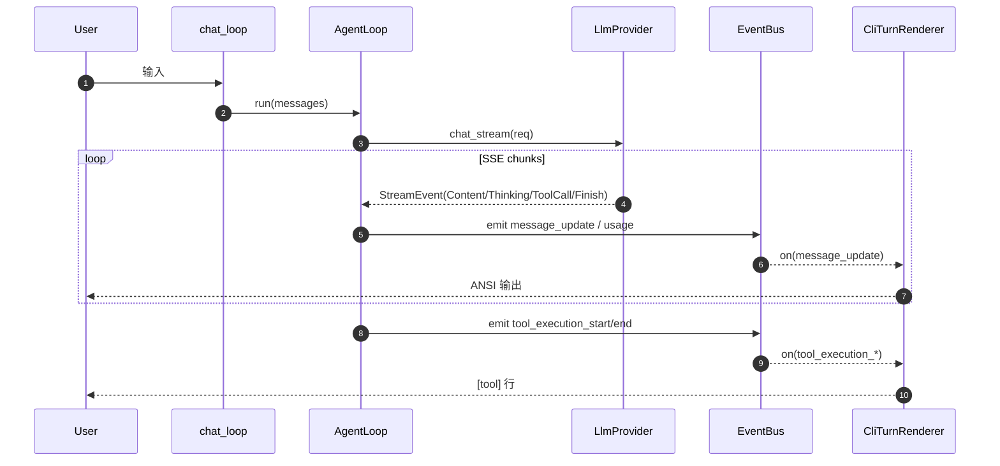

# LLM StreamEvent → CLI/TUI 展示与 Thinking/Reasoning 协议方案

> 适用范围：`tomcat` 的 `chat` 交互链路（当前 CLI，后续 TUI 复用）。
> 关联任务：[T2-P0-006.md](../../agents/TASK_BOARD_002/tasks/T2-P0-006.md)。
> 关联调研：[llm-tool-rounds-cli-display-thinking-protocol.md](../reports/llm-tool-rounds-cli-display-thinking-protocol.md)（下文简称「报告」）。
>
> 本文回答五件事：
> 1) 报告 §2.2 目标终端效果（`[thinking]` + `[tool]` + 正文交错）在 **纯 CLI** 下怎么实现；
> 2) 其他 agent（pi-mono / openclaw / pi_agent_rust / cc-fork / hermes）各自怎么做、有没有更好的显示；
> 3) **Thinking/Reasoning 协议接入**（请求侧 + 响应侧 + 多轮重发策略）在决策表与实施点里定稿；
> 4) **`ThinkingLevel`（及等价 `reasoning_effort`）** 的决策与映射；
> 5) 把报告里其余「已调研、值得直接采纳」的技术决策一并收口到本方案（token 估算、终端 ANSI、持久化、工具截断、`max_tool_rounds` 等）。

---

## 目录

- [1. 术语统一](#1-术语统一)
- [2. 竞品 / 选型对比（调研）](#2-竞品--选型对比调研)
- [3. 目标与设计原则](#3-目标与设计原则)
- [4. 落地选型与实施（已定稿）](#4-落地选型与实施已定稿)
  - 原独立章 **§6 CLI 显示（报告 §2.2）**、**§7 Thinking 折叠（报告 §2.7）** 已并入 **§4.2.3 / §4.2.4**。
- [5. 协议（入参 / 出参 / Schema）](#5-协议入参--出参--schema)
  - [5.3 Thinking 端到端与 Responses 字段解析（ASCII）](#53-thinking-端到端与-responses-字段解析ascii)
- [6. One-Glance Map（文件职责总览）](#6-one-glance-map文件职责总览)
- [7. 调度时序（运行时图）](#7-调度时序运行时图)
- [8. 状态机](#8-状态机)
- [9. 配置与环境变量](#9-配置与环境变量)
- [10. 错误模型 / 截断 / 警告](#10-错误模型--截断--警告)
- [11. 测试矩阵（验收）](#11-测试矩阵验收)
- [12. 风险与应对](#12-风险与应对)
- [13. 历史决策 / 跨文档修订](#13-历史决策--跨文档修订)
- [附录 A：报告调研决策清单（本方案采纳项）](#附录-a报告调研决策清单本方案采纳项)

---

## 1. 术语统一

| 术语 | 语义 | 数据载体 | 行为约束 | 说人话 |
|------|------|----------|----------|--------|
| `ContentDelta` | assistant 正文增量 | `StreamEvent::ContentDelta { delta }` | 只进 Markdown 渲染链 | 模型正式回答。 |
| `ToolCallDelta` | 工具调用增量（拼 JSON） | `StreamEvent::ToolCallDelta { ... }` | **不直接打印**；只累积 | 工具调用的半成品。 |
| `Thinking` / `ThinkingDelta` | 思考/推理流增量 | `StreamEvent::Thinking { delta, source, signature }`（定稿命名） | 与正文分通道；可折叠；默认不落 transcript | 脑内草稿。 |
| `FinishReason` | 流结束原因 | `StreamEvent::FinishReason { reason }` | 控制收口，不当正文 | 告诉循环何时停。 |
| `ThinkingLevel` | 用户期望的推理强度档位 | 配置 `llm.thinking.level` + 模型能力元数据 | 映射为各厂商请求字段 | 「要多想一点」的旋钮。 |
| `thinking_format` | 厂商参数形态分派键 | 配置 `llm.thinking.format` 或自动探测 | 决定发 `reasoning_effort` / `thinking` / `enable_thinking` 等 | 各家 API 长得不一样时的翻译表。 |
| 渲染主通道 | UI 可观测事件 | `EventBus`：`message_update` / `tool_execution_*` | start/end 必须配平 | 终端/TUI/审计都能订阅。 |
| `CliTurnRenderer` | 纯 CLI 排版器（本方案新增） | `src/api/chat/cli_turn_renderer.rs`（建议路径） | 只做 ANSI + 行缓冲，不做全屏 TUI | 把事件流变成「像报告那样」的文本块。 |

说人话：模型 wire 差异关在 Provider；终端长什么样关在 `CliTurnRenderer`；中间用 EventBus 串起来。

---

## 2. 竞品 / 选型对比（调研）

### 2.1 横向对比（显示 + 协议）

| 来源 | 显示形态 | Thinking | Tool 显示 | 协议/事件要点 | 我们借鉴 | 说人话 |
|------|----------|----------|-----------|---------------|----------|--------|
| **pi-mono** | Ink TUI 组件 | `AssistantMessageComponent`：`thinking` 块 Markdown + italic；`hideThinkingBlock` 时只显示一行 `Thinking...` | `ToolExecutionComponent`：内置工具有专用 `renderCall/renderResult`，pending 黄底、完成绿/红底 | `AssistantMessageEvent`：`thinking_* / text_* / toolcall_*` + `tool_execution_*` | 折叠语义、工具专用摘要、事件分层 | 组件化是终极目标，CLI 先抄「语义」不抄「框架」。 |
| **openclaw** | Ink TUI | `TuiStreamAssembler`：`composeThinkingAndContent`；`showThinking` + Ctrl+T | `verboseLevel`：off/normal/full；tool 分 start/update/result | Gateway SSE：`chat.delta/final` + `agent.tool` 相位 | 流式边界丢字修复思路、verbosity 分级 | 证明「thinking 与正文」要可独立开关。 |
| **pi_agent_rust** | rich TUI / 事件 | `reasoning_content` → `ThinkingStart/Delta/End` 事件；有无损分段测试 | 完整工具生命周期事件 | OpenAI delta 三路兼容 + 单测锁行为 | Rust 侧「thinking 一等公民 + 测试」范式 | 直接照抄事件级测试策略。 |
| **cc-fork-01** | CLI + `stream-json` | `ThinkingConfig`（报告引用） | hook / tool 权限与流事件统一排队 | `StructuredIO.outbound: Stream<StdoutMessage>` 单 writer drain | **单写者 + 顺序队列** 防交错 | 避免 stdout 多线程 printf 互咬。 |
| **hermes-agent** | prompt_toolkit CLI + `--tui` | README：reasoning 存 `assistant_msg["reasoning"]` | README：streaming tool output | `--tui`：Ink ↔ Python JSON-RPC 分层 | 「宿主 UI / 后端协议」硬分界 | 我们现在 CLI 层薄、核心厚，是同构的。 |

### 2.2 维度词典（R1–R10）

| 维度 | 关切 | 说人话 |
|------|------|--------|
| R1 事件分层 | Provider vs AgentLoop vs CLI | 别在 openai.rs 里 println。 |
| R2 单写者 | 多监听器同时写 stdout | 同一回合只允许一个 renderer 写屏。 |
| R3 顺序 | thinking / tool / text 交错 | 必须按时间线输出，禁止乱序 flush。 |
| R4 折叠 | 长 thinking 刷屏 | 折叠是产品需求，不是「以后再说」。 |
| R5 终端兼容 | italic vs dim | dim 更稳（报告 §风险）。 |
| R6 多轮 replay | DeepSeek 400 / Anthropic signature | 重发策略要配置化。 |
| R7 token 估算 | 中文低估 | 先保守 + 可演进 tiktoken。 |
| R8 工具摘要 | read/bash/edit 不同 | 专用 formatter，别打印整段 JSON。 |
| R9 持久化 | transcript 合规 | 默认不落 thinking。 |
| R10 硬上限 | `max_tool_rounds` vs token | 两道闸都要（报告结论）。 |

---

## 3. 目标与设计原则

### 3.1 观察指标表（与 §11 测试一一对应）

| 目标 | 观察指标 | 说人话 |
|------|----------|--------|
| G1 目标视觉效果 | 单轮输出中可出现 `[thinking]`、`[tool]`、正文三段，且颜色与报告示意一致（灰/绿/红） | 看起来像 Cursor/豆包示例。 |
| G2 折叠 | `show_thinking=false` 时折叠 raw、仍流式显示 `[thinking]` summary；`true` 时 summary + raw 流式展开 | 报告方案 D。 |
| G3 协议闭环 | Completions `reasoning_content` + Responses `reasoning_*` 事件均能映射到 `StreamEvent::Thinking` | 不能只有一半。 |
| G4 ThinkingLevel | 改配置后下一请求 wire 体携带正确字段 | 旋钮真生效。 |
| G5 默认策略 | `ThinkingConfig::default()` 为 `enabled=true`、`show=false`（CLI 默认折叠 raw，但仍显示 summary） | 这是破变更，需在 changelog / G5 明示。 |
| G6 多消费者 | TUI/审计可订阅同一 EventBus payload | 不为 CLI 私有造第二协议。 |
| G7 三条管线解耦 | 展示（EventBus→CLI）≠ 持久化（persist）≠ 上行（messages） | 关显示不应影响上行，落盘也不应污染正文。 |

### 3.2 非目标

| 非目标 | 推给 | 说人话 |
|--------|------|--------|
| 全屏 TUI 组件化（Ink） | T2-P0-008 | 本文只定义 CLI 渲染与事件契约。 |
| 一次接完所有厂商 thinking | 后续 provider 任务 | 先 OpenAI 两路径 + Anthropic 占位。 |
| 在 CLI 内实现 bash 实时滚动输出面板 | `ToolExecutionUpdate` 远期 | 先 start/end + 结果摘要。 |

---

## 4. 落地选型与实施（已定稿）

### 4.1 落地选型决策表（维度取舍）

**`决策`** 列钉本行裁决结论（**SHOULD**），与 [`ARCHITECTURE_SPEC.md`](../../openspec/specs/guides/workflow/ARCHITECTURE_SPEC.md) **§4.1 / §14.1** 同向。

| 维度 | 关切 | 决策 | 取自 | 入选理由 | 未入选 + 拒因 | 说人话 |
| --- | --- | --- | --- | --- | --- | --- |
| R1 通道 | EventBus vs 回调 | **采用** EventBus 为唯一跨模块契约 + 单 `CliTurnRenderer` 订阅者。 | `tomcat/src/api/chat/mod.rs`；`pi-mono/packages/agent/src/agent-loop.ts`；`openclaw/src/tui/tui-event-handlers.ts` | 设计：EventBus 作为唯一跨模块契约，CLI 只保留一个 `CliTurnRenderer` 订阅者；理由：同一事件可复用到 CLI/TUI/审计，且单写者可避免并发写屏与顺序错乱。 | 未入选：`tomcat/src/api/chat/mod.rs` 里继续扩展多回调直连（`on_stream_delta` 风格）方案；拒因：thinking/tool 事件增多后接线扇出，消费者重复实现保序逻辑。 | 总线一条，终端一条订阅者。 |
| R2 Thinking 事件 | 是否与正文同 payload | **采用** `assistantMessageEvent` 增加 `kind` 区分 `content_delta` / `thinking_delta`。 | `pi-mono/packages/ai/src/types.ts`；`pi-mono/packages/coding-agent/src/modes/interactive/components/assistant-message.ts`；`openclaw/src/tui/tui-formatters.ts` | 设计：`assistantMessageEvent` 增加 `kind` 区分 `content_delta` / `thinking_delta`；理由：折叠、过滤、持久化策略都依赖显式类型，避免把 thinking 当正文污染渲染/存储链路。 | 未入选：openclaw `openclaw/src/tui/tui-formatters.ts` 的 `composeThinkingAndContent` 先拼后渲染思路；拒因：CLI 侧难以独立控制折叠与落盘策略。 | 给事件贴「类型标签」。 |
| R3 协议接入路径 | Completions vs Responses | **采用** Completions 与 Responses 双路径同时接入 thinking。 | `tomcat/src/core/llm/openai.rs`；`tomcat/src/core/llm/openai_responses/stream.rs`；`pi-mono/packages/ai/src/providers/openai-completions.ts`；`pi-mono/packages/ai/src/providers/openai-responses.ts` | 设计：Completions 与 Responses 双路径同时接入 thinking；理由：两条 API 在模型覆盖与能力形态上互补，只做单路径会导致部分模型/部署场景无法显示 thinking。 | 未入选：仅保留 `tomcat/src/core/llm/openai.rs`（Completions-only）或仅保留 `openai_responses/stream.rs`（Responses-only）单路径；拒因：能力覆盖断层，迁移成本与运维复杂度上升。 | 两条路都得通。 |
| R4 ThinkingLevel | 如何映射到 wire | **采用** `ThinkingLevel` + `thinking_format` 分派表并入 `LlmConfig`。 | `pi-mono/packages/ai/src/types.ts`；`pi-mono/packages/ai/src/providers/openai-completions.ts`；`tomcat/src/infra/config.rs` | 设计：引入 `ThinkingLevel` 与 `thinking_format` 分派表并并入 `LlmConfig`；理由：把“推理强度”从模型特例提升为统一策略，兼顾成本可控与跨厂商可移植。 | 未入选：`openclaw/src/agents/pi-embedded-runner/moonshot-stream-wrappers.ts` 的厂商专用字段直写思路；拒因：扩展新 provider 时重复改代码，缺统一档位抽象。 | 档位要能配，也要能关。 |
| R5 折叠交互 | CLI 无 Ctrl+T | **采用** `/thinking on/off/toggle` + `PI_CHAT_SHOW_THINKING`。 | `pi-mono/packages/coding-agent/src/modes/interactive/components/assistant-message.ts`；`openclaw/src/tui/tui-event-handlers.ts` | 设计：CLI 用 `/thinking on|off|toggle` + `PI_CHAT_SHOW_THINKING`；理由：兼容 `rustyline` 键位生态，且可脚本化，不依赖全屏 TUI 热键。 | 未入选：直接复用 openclaw 的 TUI 键位入口（`openclaw/src/tui/tui-event-handlers.ts`，Ctrl+T）方案；拒因：纯 CLI 下键位冲突与可发现性差。 | 纯文本先走命令，别抢键位。 |
| R6 工具行样式 | 与报告示例对齐 | **采用** `CliTurnRenderer` 内置工具 start/end 一行摘要 + 状态色。 | `pi-mono/packages/coding-agent/src/modes/interactive/components/tool-execution.ts`；`openclaw/src/tui/components/tool-execution.ts`；`tomcat/src/core/tool_dispatcher.rs` | 设计：`CliTurnRenderer` 为内置工具输出一行摘要（start/end 配对 + 状态色）；理由：用户一眼可读，且显著降低超长 JSON 对会话可读性的破坏。 | 未入选：沿用通用「完整参数/结果 JSON 直出」样式（参考 openclaw 组件里 full 模式可展开细节）；拒因：CLI 默认视图噪声高，关键状态反而不突出。 | 用户只看一眼能懂。 |
| R7 ANSI 策略 | italic 兼容性 | **采用** thinking 主样式 `dim + gray`，italic 仅可选。 | `pi-mono/packages/coding-agent/src/modes/interactive/components/assistant-message.ts`；`tomcat/docs/reports/llm-tool-rounds-cli-display-thinking-protocol.md`（终端兼容性结论） | 设计：thinking 主样式用 `dim + gray`，italic 仅可选；理由：dim 在主流终端兼容更稳，避免「有颜色没字形」导致可读性退化。 | 未入选：pi-mono `assistant-message.ts` 的「主要依赖 italic 区分」样式；拒因：跨终端一致性不足。 | 少作妖，兼容性优先。 |
| R8 持久化 | transcript 是否含 thinking | **采用** 默认 `persist=false`；开启时写结构化字段（非正文拼接）。 | `tomcat/src/core/session/manager.rs`；`tomcat/src/infra/config.rs`；`pi-mono/packages/ai/src/types.ts` | 设计：默认 `persist=false`，若开启则写结构化字段（非正文拼接）；理由：兼顾隐私/合规与回放可控，避免把思考草稿永久混入 assistant 正文。 | 未入选：把 thinking 直接拼进 assistant 正文后持久化（参考 openclaw `src/tui/tui-formatters.ts` 的拼接展示思路外推到存储）；拒因：后续无法按类型裁剪或做权限隔离。 | 默认别把隐私草稿写进历史。 |
| R9 多轮 replay | DeepSeek / Anthropic 差异 | **采用** 重发剥留由 provider / 出站层按 API 规则决定（用户 toml 不暴露 `strip_on_resend`）。 | `openclaw/src/agents/pi-embedded-runner/moonshot-stream-wrappers.ts`；`tomcat/src/core/session/manager.rs`；`tomcat/docs/reports/llm-tool-rounds-cli-display-thinking-protocol.md`（DeepSeek 风险） | 设计：重发剥留由 provider / 出站层按 API 规则决定（用户 toml 不暴露 `strip_on_resend`）；理由：避免用户开关与厂商协议错配。 | 未入选：统一“原样全量重放历史”方案（当前 `tomcat/src/core/session/manager.rs` 默认路径）；拒因：在 DeepSeek 等模型上触发 400，且白白消耗上下文窗口。 | 重发要听厂商的话。 |
| R10 硬上限 | token vs rounds | **采用** `max_tool_rounds` 硬上限 + token 预算主防线双闸门。 | `pi-mono/packages/coding-agent/src/core/compaction/compaction.ts`；`openclaw/src/agents/tool-loop-detection.ts`；`tomcat/src/core/agent_loop.rs` | 设计：保留 `max_tool_rounds`（建议 20-30）作为硬上限，同时以 token 预算作主防线；理由：双闸门能同时覆盖“工具循环”与“超长上下文”两类失控场景。 | 未入选：仅依赖 token 压缩/预算、不设轮次硬阈值（参考 `pi-mono/.../compaction.ts` 路线）；拒因：循环类异常在 token 未超限前仍可长时间消耗成本。 | 钱包要管，循环也要管。 |

### 4.2 实施点（已闭环定义）

| 实施点 | 交付范围（含交付物） | 主要代码落点（含落地点） | 验收锚点（示例） | 说人话 |
|--------|----------------------|--------------------------|------------------|--------|
| **P0** | `CliTurnRenderer`：把 `message_update` + `tool_execution_*` 变成报告式输出 + ANSI | `src/api/chat/cli_turn_renderer.rs`（新）+ `src/api/chat/mod.rs` | `cli_turn_renderer_formats_tool_lines` | 先把「长得像报告」做出来。 |
| **P1** | `StreamEvent::Thinking { delta, source, signature }` + serde 兼容 | `src/core/llm/types.rs` | `stream_event_thinking_serde` | 内部统一思考事件。 |
| **P2a** | Completions：`OpenAiStreamDelta.reasoning_content` + `OpenAiRequestBody` 增加 `reasoning_effort` / `thinking`（按 `thinking_format` 二选一） | `src/core/llm/openai.rs` | `openai_chunk_maps_reasoning_to_thinking` | Chat Completions 线打通。 |
| **P2b** | Responses：`responses_chunk_to_events` 解析 `response.reasoning_*`（以 OpenAI 官方事件名为准）→ `StreamEvent::Thinking` | `src/core/llm/openai_responses/stream.rs` | `responses_stream_emits_thinking` | 别再 `// 其它 event 暂忽略`。 |
| **P3** | `stream_handler`：`Thinking` 分支 → `MessageUpdate` payload `kind=thinking_delta` | `src/core/agent_loop/stream_handler.rs` + `src/infra/events/mod.rs`（序列化字段） | `stream_handler_emits_thinking_message_update` | Agent 层透出思考。 |
| **P4** | 折叠：`show_thinking` 运行时状态 + `/thinking on|off|toggle` | `src/api/chat/commands/*` + `ChatContext` 或 renderer 状态 | `chat_command_toggles_thinking_fold` | CLI 版方案 D。 |
| **P5** | `ThinkingLevel` + `thinking_format` + `map_reasoning_effort` | `src/infra/config.rs` + `src/core/llm/thinking_policy.rs`（新） | `thinking_level_maps_to_openai_request` | 旋钮不是摆设。 |
| **P6** | 多轮：provider / 出站剥留策略表（DeepSeek strip、Anthropic signature 保留策略占位） | `src/core/session/...` 或 `agent_loop` 组装请求前钩子 | `deepseek_rerun_strips_reasoning`（mock） | 别让用户多轮就 400。 |
| **P7** | 持久化：`llm.thinking.persist` + audit 钩子 | transcript writer + audit | `thinking_not_in_transcript_by_default` | 合规默认值。 |

**实施小节索引（避免与 §4.1 重复堆叠）**：协议与请求/响应映射见 **§4.2.1**；`ThinkingLevel` 映射见 **§4.2.2**；报告 **§2.2** 的 CLI 排版与 `CliTurnRenderer` 算法见 **§4.2.3**；报告 **§2.7 方案 D** 的折叠与 `/thinking` 见 **§4.2.4**。

#### 4.2.1 Thinking/Reasoning 协议接入（实施小节）

**目标**：把报告第三章的「类型 A/B/C」收敛为 **Rust 内两张表**：

1. **请求表（Outbound）**：`(provider, thinking_format, thinking_level) -> JSON 片段`  
   - OpenAI Completions：`reasoning_effort`（OpenAI 系）  
   - 豆包/Moonshot：`thinking: { type: "enabled" }`  
   - Anthropic：`thinking: { type, budget_tokens }`（占位：本期只保留字段形状 + feature gate）  
   - Qwen：`enable_thinking` / `chat_template_kwargs`（占位）

2. **响应表（Inbound）**：`(provider, stream_chunk_shape) -> Vec<StreamEvent>`  
   - Chat Completions：`delta.reasoning_content` / `delta.reasoning` / `delta.reasoning_text`（报告 §3.5：三路检测）  
  - Responses：`response.output_text.delta`（正文）+ `response.reasoning_summary_text.delta`（**以实际 SSE 事件名为准：实现时以官方文档 + 线上抓包锁定**，当前 `stream.rs` 的 `_ => ignore` 必须替换为显式映射 + 未知事件 debug 日志）  
   - Anthropic：`thinking_delta` + `signature`（后续）

**依赖顺序（对齐报告「跨章节依赖」）**：

```text
P1 StreamEvent::Thinking
   │
   ├─► P2a OpenAiProvider（Completions 请求+响应）
   │
   ├─► P2b OpenAiResponsesProvider（Responses 响应；请求侧若缺 reasoning 参数则补）
   │
   └─► P3 stream_handler 透传
         │
         └─► P0 CliTurnRenderer（终端效果）
```

#### 4.2.2 ThinkingLevel 决策（实施小节）

**定义（与 pi-mono 对齐）**：`ThinkingLevel = off | minimal | low | medium | high | xhigh`

**总规则**：

1. `off`：**不发送**任何 thinking/reasoning 相关请求字段；解析端忽略 thinking 流。
2. `minimal..xhigh`：必须同时满足：
   - 模型能力位支持（来自模型 registry / 静态表；不支持则降级为 `off` 并在 stderr 打一条 **一次性** warn）
   - `llm.thinking.enabled=true`

**映射策略（定稿）**：

| ThinkingLevel | OpenAI `reasoning_effort`（Completions） | OpenAI Responses `reasoning`（若有该字段） | 豆包/Moonshot `thinking.type` | 说人话 |
|---------------|----------------------------------------|-------------------------------------------|------------------------------|--------|
| `off` | 省略 | 省略 | 省略 | 完全关思考。 |
| `minimal` | `low` | `minimal`（若 API 支持；否则映射 `low`） | `enabled` + 低 `max_tokens` | 省钱的想一想。 |
| `low` | `low` | `low` | `enabled` | 轻度。 |
| `medium` | `medium` | `medium` | `enabled` | 默认推荐。 |
| `high` | `high` | `high` | `enabled` | 深度推理。 |
| `xhigh` | `xhigh`（仅当模型白名单支持，否则退回 `high`） | 同左 | `enabled` | 顶配，但要防不支持。 |

> `thinking_format`（openai/openrouter/deepseek/zai/qwen/...）决定**具体 JSON 键名**，上表是「逻辑档位 → 厂商枚举值」；二者组合出最终请求体。

#### 4.2.3 CLI 显示效果（报告 §2.2）实现规格

**映射**：实施点 **P0**；决策行 **R1 / R6 / R7**；观察指标 **G1**。

##### 目标排版（冻结）

报告示意（逻辑冻结，文案可本地化）：

```text
[thinking] ……dim 灰字；show=false 时只显示 summary……

[tool] read  path=src/main.rs
[tool] read  ✓ 238 lines (0.3s)

……Markdown 正文……

[tool] edit  path=src/main.rs
[tool] edit  ✓ replaced lines 15-42 (0.1s)

[tool] bash  command=cargo build
[tool] bash  ✗ failed (2.1s)
       error[E0308]: …摘要…

……Markdown 正文……
```

##### 实现算法（`CliTurnRenderer`）

**输入事件（按时间顺序）**：

1. `message_update.kind=thinking_delta` → 追加到 `thinking_buf`；若 `show_thinking`：
   - 首次进入 thinking：打印前缀行 `\n\x1b[2m\x1b[90m[thinking]\x1b[0m`
   - 后续只打印 delta（仍包在 dim 区，或每行前缀 `│ ` 二选一）
2. `message_update.kind=content_delta` → `MarkdownRenderer.push(delta)`（沿用现逻辑）
3. `tool_execution_start` → 打印 `[tool] {name} {one_line_summary(args)}`（灰）
4. `tool_execution_end` → 打印 `[tool] {name} ✓/✗ {summary} ({elapsed})`（绿/红）+ 失败时追加 **最多 N 行** stderr/错误摘要

**`one_line_summary` 规则（内置工具优先）**：

| 工具名 | 摘要 |
|--------|------|
| `read` | `path=<posix>` + `offset/limit`（若有） |
| `write` / `edit` | `path=` + 关键操作词 |
| `bash` | `command=<trim 单行>` |
| 其他 | `JSON.stringify` 截断到 T 字符 |

##### 与 `rustyline` 的并发写屏

- **原则**：仍在 `agent_loop.run` 同步路径内 emit → 监听器回调应极快；重格式化在 renderer 内做。
- **readline 阻塞时**：沿用 `ExternalPrinter` 机制（`stderr.rs` 已有范式）把 `[tool]` 行插到 prompt 上方；**thinking 默认走 stdout**，若发现与 prompt 打架，再提供 `llm.thinking.print_to_stderr=true` 作为逃生阀。

##### 「更好显示效果」可选演进（非本期必做）

| 方向 | 优点 | 代价 | 建议 |
|------|------|------|------|
| **全屏 TUI**（ratatui / pi-tui） | 真·折叠、滚动、面板、键位 | 依赖大、实现长 | 交给 T2-P0-008。 |
| **OSC8 超链接** | path 可点击打开 | 终端支持参差 | 可作为 P+。 |
| **工具 diff 高亮** | 编辑可视化强 | 需要引入 diff 库/算法 | 远期对齐 pi-mono `ToolExecutionComponent`。 |
| **indeterminate spinner** | 「正在思考」态更明显 | 需要独立线程 tick | CLI 默认不必。 |

**定稿**：本期以 **ANSI + 单写者 + 工具摘要** 达到报告效果的 80%；高亮 diff / 全屏折叠交给 TUI。

#### 4.2.4 Thinking 折叠 / 展开（报告 §2.7 方案 D）

**映射**：实施点 **P4**；决策行 **R5**；观察指标 **G2**。

##### 行为表

| `show_thinking` | 流式阶段 | 结束阶段 | 说人话 |
|-----------------|----------|----------|--------|
| `true` | 打印 summary + raw thinking delta（dim） | 保留完整缓冲区 | 像报告展开态。 |
| `false` | **打印 `source=summary`，丢弃 `source=raw`**；`[thinking]` 前缀只出现一次，summary 同行流式增长 | 不额外补打 placeholder | 折叠 raw，但仍给用户摘要。 |

##### CLI 交互（无 Ctrl+T 的等价物）

| 触发 | 动作 | 说人话 |
|------|------|--------|
| `/thinking on` | `show_thinking=true` | 打开。 |
| `/thinking off` | `show_thinking=false` | 关掉。 |
| `/thinking toggle` | 翻转 | 一键切换。 |
| `PI_CHAT_SHOW_THINKING=0/1` | 进程级默认 | 脚本友好。 |

> TUI 阶段再把同一布尔量绑到 **Ctrl+T**（对齐 openclaw）。

---

## 5. 协议（入参 / 出参 / Schema）

### 5.1 `StreamEvent`（内部模型流协议）

| 字段 / 变体 | 必填 | 说明 | 说人话 |
|-------------|------|------|--------|
| `ContentDelta { delta }` | 是 | 正文增量 | 回答正文。 |
| `ToolCallDelta { ... }` | 否 | 工具增量 | 只拼装，不展示。 |
| `Thinking { delta, source, signature }` | 否 | 思考增量；`source` 区分 `summary/raw`，`signature` 仅 Anthropic | 思考草稿。 |
| `FinishReason { reason }` | 否 | 结束原因 | 循环控制。 |
| `Usage { ... }` | 否 | token 统计 | 计费/压缩。 |

> 单一事实源：`src/core/llm/types.rs`。

### 5.2 `AgentEvent::MessageUpdate` 载荷（EventBus）

在 `AssistantMessageEvent` JSON 内新增：

| 字段 | 类型 | 必填 | 说明 | 说人话 |
|------|------|------|------|--------|
| `kind` | string | 是 | `content_delta` / `thinking_delta` | 区分正文与思考。 |
| `delta` | string | 条件 | `kind=*_delta` 时必填 | 兼容老字段名。 |
| `source` | string | `kind=thinking_delta` 时是 | `summary` / `raw` | 区分摘要与原始推理。 |
| `signature` | string? | 否 | Anthropic 思考签名 | Claude 专供。 |
| `finishReason` | string? | 否 | 若要在 UI 展示 stop/tool/length | 一般可不填。 |

### 5.3 Thinking 端到端与 Responses 字段解析（ASCII）

下面两张图把「从配置到终端」和「OpenAI Responses 一条 SSE 进来后字段怎么抠」串在一起；实现入口分别是 `openai_responses/mod.rs`（请求）、`openai_responses/stream.rs`（响应解析）、`agent_loop/stream_handler.rs`（统一发射）、`api/chat/mod.rs` + `cli_turn_renderer.rs`（展示与可选 persist）。

#### 5.3.1 端到端：请求 → 流事件 → 总线 → CLI（含 persist 旁路）

```text
  [用户 / tomcat.config.toml / 环境变量]
           |
           v
  +---------------------------+
  | LlmConfig.thinking        |  enabled / level / show / persist / print_to_stderr
  | + tool_cli_verbosity      |  （与 show_thinking 解耦，只管 [tool] 行档位）
  +-------------+-------------+
                |
                v
  +---------------------------+     POST /v1/responses
  | OpenAiResponsesProvider   | --> reasoning.effort（档位）
| build_request_body()      |     reasoning.summary="auto"（thinking.enabled 即请求）
  +-------------+-------------+
                |
                v   SSE chunks（每条 JSON 带 "type": "..."）
  +---------------------------+
  | stream.rs                 |
| responses_chunk_to_events | --> StreamEvent::Thinking { delta, source, signature }
  |                           | --> StreamEvent::ContentDelta { delta }
  +-------------+-------------+
                |
                v
  +---------------------------+
  | stream_handler.rs         |  message_update.assistantMessageEvent:
| AgentLoop                 |    kind=thinking_delta + source | content_delta + delta
  +-------------+-------------+
                |
                v
  +---------------------------+
  | EventBus                  |
  +--+-----------+------------+
     |           |
     |           +--------------------------+
     |                                      v
     v                          +---------------------------+
+---------------------------+   | persist 监听器（可选）   |
| CliTurnRenderer           |   | WIRE_MESSAGE_UPDATE/END  |
| show_thinking 折叠/展开   |   | -> TranscriptEntry       |
| [thinking] dim 区         |   |    ThinkingTrace         |
| Markdown 正文 stdout      |   +---------------------------+
| [tool] stderr             |
+---------------------------+
                |
                v
           用户终端
```

**说人话**：配置决定「要不要向模型要推理摘要」；`stream.rs` 把各家 SSE 形状收成同一种 `Thinking`；`stream_handler` 贴上 `kind` 给 UI；`CliTurnRenderer` 只负责长得好看；`persist` 是另一条旁路写审计，不进 hydrate 上行。

#### 5.3.2 Responses：一条 SSE `type` 进来后的解析（字段作用）

同一条流里，**正文**和**思考**可能来自不同 `type`；解析器先按 **事件名字符串** 分流，再在 **JSON 树** 上按固定 key 顺序抠字符串（`extract_reasoning_delta` → `extract_text`，空白不随意 trim，避免词粘连）。

```text
                    SSE JSON（顶层）
                           |
                           v
              +------------------------+
              | match event["type"]    |
              +-----------+------------+
                          |
     +--------------------+--------------------+-------------------------+
     |                    |                    |                         |
     v                    v                    v                         v
 reasoning_*        reasoning_summary    output_item.done          其它 type
 .delta /            _part.added /        且 item.type               （多数忽略或
 _text.delta 等      .done 等             含 "reasoning"）            debug 一行）
     |                    |                    |
     +--------+-----------+--------------------+
              |
              v
   +------------------------------+
   | extract_reasoning_delta()    |  依次尝试顶层 key：
   |                                |    delta, summary, text,
   |                                |    summary_text, content
   |                                |  再尝试嵌套：
   |                                |    part, item
   +---------------+----------------+
                   |
                   v
   +------------------------------+
   | extract_text(Value)          |  String -> 原样（仅空串跳过）
   |                              |  Array  -> 子项拼接（空格 join）
   |                              |  Object -> 子 key: text, delta,
   |                              |            summary, summary_text, content
   +---------------+----------------+
                   |
                   v
       Some(非空字符串) --> StreamEvent::Thinking { delta, source, signature: None }
        None         --> 不发 Thinking；debug 记录「无可抽取文本」
```

**字段作用速查（Responses 侧）**：

| 常见位置 | 作用（人话） |
|----------|--------------|
| `type` | 告诉解析器走哪条分支（delta 流 / summary 分片 / item 收口）。 |
| `delta` | 最常见的「增量一段字」，直接进 thinking。 |
| `summary` | 经常是数组（多段 summary_text）；要拆成可读串再 emit。 |
| `part` | `reasoning_summary_part.*` 里携带当前分片；`text` 可能在里层。 |
| `item` | `output_item.done` 里整包 reasoning；`item.type` 用来门禁，避免误把 message 当 thinking。 |

以下为 **`responses_chunk_to_events` 入口所见的「单条事件」JSON 形态**（真实流里还会夹杂 `response.created`、`response.in_progress`、`response.output_text.delta` 等，此处只列与 Thinking 抽取相关的完整样例）。字段名以 OpenAI Responses SSE 常见形态为准，网关若多包一层需先剥壳再喂解析器。

**示例 A：`reasoning_text` 字符串增量（最常见）**

```json
{
  "type": "response.reasoning_text.delta",
  "delta": "先估算 387×249"
}
```

→ 顶层 `delta` 命中 → 发出一条 `StreamEvent::Thinking { source: raw }`，`delta` 与 JSON 中字符串一致（含首尾空白时原样保留）。

**示例 B：`reasoning_summary_text` 字符串增量**

```json
{
  "type": "response.reasoning_summary_text.delta",
  "delta": "用分配律拆分乘法"
}
```

→ 与 A 相同分支，走 `push_reasoning_delta_event`，并标记 `source=summary`。

**示例 C：`reasoning_summary.delta` 顶层为 `summary` 数组（多段 `summary_text`）**

```json
{
  "type": "response.reasoning_summary.delta",
  "summary": [
    { "type": "summary_text", "text": "第一步：分解因数。" },
    { "type": "summary_text", "text": "第二步：合并结果。" }
  ]
}
```

→ 顶层 key `summary` → `extract_text` 对数组逐项取 `text` → 用空格拼成一条字符串 → 一条 `Thinking { source: summary }`。

**示例 D：`reasoning_summary_part.done`，文本在嵌套 `part` 里**

```json
{
  "type": "response.reasoning_summary_part.done",
  "item_id": "rs_…",
  "output_index": 0,
  "summary_index": 0,
  "part": {
    "type": "summary_text",
    "text": "最终摘要：96363。"
  }
}
```

→ 顶层 `delta/summary/...` 无有效串后命中 `part` → 从 `part` 对象中取 `text` → 一条 `Thinking`。

**示例 E：`output_item.done` 且 `item.type` 为 `reasoning`（整包收口；`summary` 可为空数组）**

```json
{
  "type": "response.output_item.done",
  "output_index": 0,
  "sequence_number": 3,
  "item": {
    "id": "rs_…",
    "type": "reasoning",
    "summary": [
      { "type": "summary_text", "text": "口算校验：249×400=99600，再扣减…" }
    ]
  }
}
```

→ 先过 `is_reasoning_output_item`（`item.type` 含 `reasoning`）→ 再 `extract_reasoning_delta` 扫到嵌套 `item` → 从 `item.summary` 数组抽出 `text` 拼接 → 一条 `Thinking`。若 `summary` 为 `[]` 且其它字段也无文本，则**不 emit** `Thinking`，仅 debug「无可抽取文本」（真机里偶发）。

**示例 F：对照 — `output_item.done` 但为普通 `message`（不得当 Thinking）**

```json
{
  "type": "response.output_item.done",
  "output_index": 1,
  "item": {
    "id": "msg_…",
    "type": "message",
    "content": [
      { "type": "output_text", "text": "最终答案是 96363。" }
    ]
  }
}
```

→ `item.type` 不含 `reasoning` → **不**走 `push_reasoning_delta_event`；正文由其它分支（如 `response.output_text.delta` / 对应 content 事件）处理。

> 与 openclaw 等「先 `output_item.added` 建块再 delta/done 填」的状态机不同，本仓 **以「每条 SSE 尽量独立抽出 delta」为主**；多条 `Thinking` 事件在 UI 侧顺序拼接即完整思考区。

---

## 6. One-Glance Map（文件职责总览）

```text
┌──────────────────────────────┐
│ src/core/llm/types.rs       │
│ StreamEvent + ThinkingLevel │
└──────────────┬──────────────┘
               │
       ┌───────┴────────┐
       ▼                ▼
┌──────────────┐ ┌─────────────────────────────┐
│ openai.rs    │ │ openai_responses/stream.rs  │
│ SSE→事件     │ │ SSE/NDJSON→事件（补 reasoning）│
└──────┬───────┘ └──────────────┬──────────────┘
       │                        │
       └──────────┬─────────────┘
                  ▼
┌──────────────────────────────────────┐
│ agent_loop/stream_handler.rs        │
│ 统一消费 StreamEvent → AgentEvent     │
└──────────────────┬───────────────────┘
                   │ EventBus
                   ▼
┌──────────────────────────────────────┐
│ api/chat/cli_turn_renderer.rs（新） │
│ 报告式 [thinking]/[tool] 排版        │
└──────────────────┬───────────────────┘
                   │ print
                   ▼
              用户终端 stdout/stderr
```

阅读顺序（说人话）：Provider 只负责「读懂模型」，AgentLoop 负责「发出标准事件」，CLI  renderer 负责「长得像报告」。

---

## 7. 调度时序（运行时图）



---

## 8. 状态机

```text
idle ──run──► streaming ──finish+tools──► dispatch_tools ──done──► streaming/idle
  ^                 │
  └──── cancel ─────┴──► interrupted
```

| 迁移 | 触发 | 副作用 | 说人话 |
|------|------|--------|--------|
| → `streaming` | 建连成功 | `MessageStart` | 开始吐字。 |
| → `dispatch_tools` | `tool_calls_buf` 非空 | 走 `tool_dispatcher` | 要跑工具了。 |
| → `interrupted` | cancel | **已发 Start 必补 End** | 中断也要把 UI 收口。 |

---

## 9. 配置与环境变量

| 键 | 类型 | 默认 | 含义 | 说人话 |
|----|------|------|------|--------|
| `llm.thinking.enabled` | bool | `true` | 是否启用思考协议总开关 | 方案 B：开箱默认开。 |
| `llm.thinking.level` | enum | `high` | `ThinkingLevel` | 默认深度推理档位。 |
| `llm.thinking.format` | string? | auto | `thinking_format` | 告诉翻译表用哪套键。 |
| `llm.thinking.max_tokens` | u32? | model default | 仅豆包 / Moonshot `thinking` 对象路径生效 | OpenAI/Responses 走 `reasoning.effort`。 |
| `llm.thinking.show` | bool | `false` | CLI 是否展开 raw thinking；`false` 时仍显示 summary | 默认折叠 raw。 |
| `llm.thinking.persist` | bool | `false` | 是否写入 transcript | 默认别存草稿。 |
| `llm.thinking.print_to_stderr` | bool | `false` | 与 prompt 冲突时逃生 | 调试用。 |
| `llm.tool_cli_verbosity` | enum(`off/brief/full`) | `full` | 工具执行行输出档位 | 与 `show_thinking` 解耦。 |
| `agent.max_tool_rounds` | usize | `20~30`（建议） | 硬上限防死循环 | 最后一道闸。 |

`show_thinking` 初值优先级：`PI_CHAT_SHOW_THINKING`（已设置）> `llm.thinking.show` > 代码默认。  
`strip_on_resend`：用户侧不再提供 toml 配置项，重放剥留由 provider / 出站层按 API 规则决定。
`provider=openai-responses` 时：只要 `thinking.enabled=true`，请求体就自动附加 `reasoning.summary="auto"`；`show` 只控制 CLI 是否展开 raw，不再 gate summary 请求。
语言策略：已回退 Prompt 层“强制跟随用户语言”的硬规则；当前以模型默认行为为主，后续是否进入 `Accept-Language` 头方案取决于语言行为观测结果。

---

## 10. 错误模型 / 截断 / 警告

```text
未知 `response.reasoning*` SSE 事件或非预期 payload 形态
  -> debug 日志一行（含 event type）
  -> 不中断主链路

thinking 解析成功且 show=false
  -> `source=summary` 仍写屏；`source=raw` 仅缓冲/可选 persist，不写屏

reasoning delta 分片包含空白
  -> 原样透传（不 trim），避免单词粘连

tool 结果超长
  -> 只展示前 N 行 + "...(truncated)"

tool 失败结果为纯字符串
  -> 直接展示原始错误文本（不退化为 "failed"）
```

| 结局 | 抛错？ | 用户可见 | 说人话 |
|------|--------|----------|--------|
| Provider JSON 坏 | 是 | 错误提示 | 真坏了。 |
| 模型不支持 thinking | 否 | 降级无 thinking | 能聊就行。 |
| 工具执行失败 | 否 | 红 `[tool] ✗` | 工具错不等于全局崩。 |

---

## 11. 测试矩阵（验收）

| 维度 | 用例 / 编号 | 状态 | 说人话 |
|------|-------------|------|--------|
| 单元 | `openai_stream_test`：reasoning_content → Thinking | ✅ | Completions 线已锁定。 |
| 单元 | `openai_responses_test`：reasoning SSE → Thinking | ✅ | Responses 线已锁定。 |
| 集成 | `openai_responses_integration_tests::test_openai_responses_chat_stream_reasoning_emits_thinking` | ✅ | 真实 `/v1/responses` 回归，防止“有流无 thinking”漏测。 |
| 集成 | `openai_responses_integration_tests::...latest_user_language_behavior..._opt_in` | opt-in | 语言行为观测开关：`TOMCAT_E2E_LANGUAGE_BEHAVIOR=1`（兼容旧开关）。 |
| 单元 | `events_order_test` / `stream_handler`：thinking + content 交错顺序 | ✅ | 顺序不能乱。 |
| 单元 | `cli_turn_renderer/tests`：折叠模式只一行 + tool 样式 | ✅ | 方案 D 与工具行样式已覆盖。 |
| 单元 | `cli_turn_renderer/tests::tool_end_failure_with_string_result_shows_real_error_message` | ✅ | 工具失败时展示真实错误，不再只显示 `failed`。 |
| 单元 | `primitive/tests/suite_test::read_file_missing_path_returns_not_found_error` | ✅ | `read` 不存在路径语义有明确断言。 |
| 集成 | `cli_tests::test_user_sees_read_failure_reason_in_tool_line` | ✅ | 用户侧可见真实 `read` 失败原因。 |
| 单元 | `show_thinking_resolve_test`：env > config 覆盖 | ✅ | 初值来源优先级已覆盖。 |
| 单元 | `thinking_persist_test` + `hydrate_test`：persist 写独立字段且 hydrate 不混正文 | ✅ | 三条管线解耦已覆盖最小闭环。 |
| 属性 | `thinking_policy/tests::level_to_effort_table_is_stable` | ✅ | 档位映射快照化防回归。 |
| 文档 | 本文与报告交叉链接一致 | ✅ 2026-05-07 | 字跟得上代码。 |

---

## 12. 风险与应对

| 风险 | 影响 | 应对 | 说人话 |
|------|------|------|--------|
| stdout/stderr 交错导致 prompt 乱 | 高 | 默认 thinking 走 stdout + 轻量缓冲；提供 stderr 逃生阀 | 乱屏就给开关。 |
| Responses reasoning 事件名漂移 | 高 | 单测锁真实样本 + runtime unknown 计数 | 线上变了能发现。 |
| 折叠模式丢失信息 | 中 | transcript 仍可选 persist 全量 | 要审计就给落盘。 |
| Token 估算低估中文 | 中 | 采用报告建议：保守 `reserve_tokens` + 后续 tiktoken 可选 | 先别省钱省到爆。 |

---

## 13. 历史决策 / 跨文档修订

- ~~把 thinking 混进 `ContentDelta`~~ → **否**：无法折叠/审计。
- ~~只实现回调（报告 §2.5 方案 A 原文）~~ → **否**：与本仓 EventBus 主链重复；改为 **EventBus + CliTurnRenderer**。
- ~~删除 `max_tool_rounds`~~ → **否**：保留为最后防线（报告）。

---

## 附录 A：报告调研决策清单（本方案采纳项）

下列条目来自 `docs/reports/llm-tool-rounds-cli-display-thinking-protocol.md`，在本方案中 **明确采纳**（实现分散在 **§4.2.x、§5–§13**，此处为索引）：

1. **终端 ANSI**：thinking 优先 **dim** 而非依赖 italic（报告「流式渲染终端兼容性」）。
2. **事件模型**：thinking / text / toolcall **分通道**（报告 §2.3 pi-mono 事件链）。
3. **工具展示**：`ToolCallDelta` 累积 + `tool_execution_*` 展示；结果不单独「漂一条」破坏配对（报告 §2.3 表）。
4. **verbosity 思想**：openclaw `verboseLevel` → 本方案 `llm.tool_cli_verbosity`（已落地 `off/brief/full` 三档）。
5. **协议类型**：OpenAI `reasoning_content`、豆包 `thinking` 对象、Anthropic `thinking_delta + signature`（报告 §3.1）——映射进统一 `StreamEvent::Thinking`。
6. **三路检测**：`reasoning_content` / `reasoning` / `reasoning_text`（报告 §3.5）。
7. **双端点策略**：Completions（广覆盖）+ Responses（强推理/跨轮）长期并存（报告 §3.7 方案 B）。
8. **持久化三案**：禁止纯拼接；推荐结构化字段；独立变体复杂（报告 §3.8）——本方案默认 **不落盘**，若落盘走 **独立字段**。
9. **多轮策略表**：DeepSeek 必须 strip、Anthropic signature、Responses 自动保留等（报告「Thinking 内容的上下文占用」）——落实为 provider / 出站策略表（用户侧不暴露 `strip_on_resend`）。
10. **Token 估算**：`chars/4` 起步 + 中文偏差补偿策略 + 未来 tiktoken（报告「Token 估算精度」）。
11. **`max_tool_rounds`**：保留并提高到 20–30（报告 §风险）。
12. **实施顺序指针**：先协议层 `StreamEvent::Thinking`，再展示层，再 token/动态阈值（报告「跨章节依赖」）——反映在 **§4.2.1**（协议）与 **§4.2.3**（CLI 展示）。

---

**一句话总结**：用 **`StreamEvent::Thinking` + EventBus 扩展载荷** 把思考流从正文里拆出来，再用 **`CliTurnRenderer` 单模块** 把事件流渲染成报告里的 `[thinking]/[tool]` 样式；**ThinkingLevel + thinking_format** 负责请求侧正确发参；**`/thinking` 命令** 在纯 CLI 下复刻方案 D 的折叠体验，全屏 TUI 再接管 Ctrl+T 与更强可视化。
