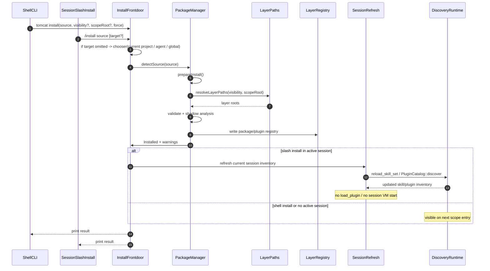

# PackageManager：统一包安装与三层可见范围管理

本文是 **Tomcat PackageManager** 的技术方案（OpenSpec 架构子系统类：`docs/architecture/`）。它同时改动 `api/cli`、新增 `core/package`、复用 `core/skill` 与 `ext/plugin` 的既有发现链路，并引入新的 CLI 契约、分层注册表与安装生命周期，满足 [`ARCHITECTURE_SPEC.md`](../openspec/specs/guides/workflow/ARCHITECTURE_SPEC.md) 中“跨 ≥2 个一级子目录 + 新接口契约 + 新状态机”的开文条件。

## 摘要

当前 Tomcat 在“发现”层已经有三层根：

- plugin：`scope（实现里对应 Project） > agent > global`，见 `src/ext/plugin/source_scan.rs::plugin_roots`
- skill：`scope（实现里对应 Project） > agent > global`，见 `src/core/skill/discovery.rs::skill_roots`

但“安装/管理”层并不对齐：

- `tomcat plugin load` 只处理本地路径，并只写 **global** 的 `plugins/registry.json`，见 `src/api/cli/plugin_cmd.rs`
- `tomcat skill` 只有 `list/reload`，没有安装入口
- 因而 runtime 虽支持三层可见范围，CLI 却还停留在“全局插件 + 手工放 skill 目录”的阶段

本文把安装层补齐为一个统一的 `PackageManager`：

1. 提供两个安装前门：外层 shell CLI `tomcat install` / `tomcat uninstall` / `tomcat packages`，以及 code/claw 会话内的 `/install`。
2. 一个 package 可同时携带 plugin 与 skill，但 **package 只是安装/分发单元**；runtime 内存中仍然分开走 plugin 与 skill 两条链路。
3. 安装目标是三层可见范围：`global` / `agent` / `scope`。若用户未显式传目标层，**交互式入口弹出三选一**（`当前project` / `agent` / `global`）；仅在非交互 shell 下才 fallback 到 `当前project(scope)`。
4. 安装只做**静态校验 + 文件落位 + 分层登记**，不在安装期执行插件代码。
5. `packages/` 是新引入的**安装账本命名空间**，只存 package registry，不参与 runtime 资源扫描或内存加载。
6. runtime 继续复用既有 `plugin_roots` / `skill_roots`，首次进入 scope 时自动发现。

**说人话**：现在 Tomcat 已经知道“该去三层目录里找东西”，但还没有一套像样的“把东西装进这三层目录里”的统一入口。`PackageManager` 要补的不是新的运行时，而是新的**安装管理面**：用户既可以在外层 shell 里装，也可以在会话里直接 `/install`；装进去以后，磁盘上仍然是 `plugins/` 和 `skills/` 两类目录，内存里也仍然是 plugin/skill 两套子系统，`packages/` 只是新增的一本总账。

---

## 先看总图：文首导读

### 阅读顺序建议

1. **抽象 ASCII 总图（A.1）**：先看“统一 package 入口 + 三层可见范围 + 既有发现链路复用”这三件事如何串起来。
2. **具体 ASCII 总图（A.2）**：再把同一条链路落到真实对象：`package_cmd`、`PackageManager`、`LayerPaths`、分层 registry、`plugin_roots`、`skill_roots`。
3. **核心四图（B）**：结构示意 → 安装调用流 → 卸载/回滚时序 → 从安装到 runtime 可见的闭环。
4. **mermaid 时序（C）**：在 IDE 里直接看 `install` 如何穿过 CLI、PackageManager、LayerRegistry 与既有发现系统。
5. **状态机（D）**：看 package 从“识别到 source”到“对 runtime 可见”的生命周期与失败回滚。
6. **再下钻正文**：想看为什么这样选跳 §2 / §4；想看协议跳 §5；想看测试与风险跳 §9 / §10。

### A.1 抽象 ASCII 总图

```text
输入：shell 的 `tomcat install SOURCE [--visibility ...] [--scope-root PATH]`
      或 code/claw 会话里的 `/install SOURCE`
   │   契约：SOURCE 本期仅支持本地；若未显式指定目标层，
   │        交互式入口弹出「当前project / agent / global」三选一，
   │        非交互 shell 才 fallback 到当前project(scope)
   │
   │  ① 识别 source：统一入口，三种归一
   ▼
PackageResolver
   ├─ package 目录（package.json 顶层 tomcat 块）
   ├─ bare plugin（plugin.json）
   └─ bare skill（SKILL.md）
   │
   │  ② 预检：静态校验 + 冲突/遮蔽分析
   ▼
PreparedInstall（package 元数据 + plugin/skill 清单 + target visibility）
   │
   │  ③ 解析目标层：global / agent / scope
   ▼
LayerPaths
   ├─ global ─► resources={work_dir(默认 ~/.tomcat)}/{plugins,skills}
   │            registry ={work_dir}/packages/registry.json
   ├─ agent  ─► resources={agent_trail_dir}/{plugins,skills}
   │            registry ={agent_trail_dir}/packages/registry.json
   └─ scope  ─► resources={scope_root}/.tomcat/{plugins,skills}
                registry ={scope_root}/.tomcat/packages/registry.json
   │
   │  ④ 安装事务：复制文件 + 写分层注册表
   ▼
LayerRegistry
   ├─ packages/registry.json      （统一安装账本；不参与 runtime 加载）
   └─ plugins/registry.json       （plugin 管理账本；按层存）
   │
   │  ⑤ runtime 继续走现有发现链路
   ▼
plugin_roots / skill_roots = scope > agent > global
   │
   ▼
终局：文件可见、CLI 可管、runtime 首次进入 scope 时自动发现
```

这张抽象图只讲**职责、事实源与关键分叉**。它钉死四件事：一是统一的是**安装入口**，不是删掉 plugin/skill 两类资源目录；二是“可见范围”是安装层的显式参数，缺省时优先用交互式选择，而不是偷偷写死到全局；三是 `packages/registry.json` 是安装账本，不是新的 runtime 资源类型；四是 runtime 不新增第四套发现逻辑，只复用现在的三层 roots。

**说人话**：PackageManager 不负责“发明新的加载方式”，它只负责把东西放到正确那一层，然后让现有发现系统去自然看见它。这里统一的是“安装命令”和“安装账本”，不是说以后只剩 `package/` 目录、不再有 `plugins/` 和 `skills/`；后两者还在，而且 runtime 还是分开加载。

### A.2 具体 ASCII 总图

```text
┌─ 用户入口 ──────────────────────────────────────────────────────────────────────┐
│ shell：src/api/cli/mod.rs【改】                                                │
│ • Commands::{Install, Uninstall, Packages}                                     │
│ • `tomcat install SOURCE [--visibility ...] [--scope-root ...]`                │
│ 会话：src/api/chat/commands/parse.rs + cmd_install.rs【新增】                  │
│ • `/install SOURCE [global|agent|current-project]`                             │
│ • 未传目标层时弹三选一：当前project（默认高亮）/ agent / global                │
└──────────────────────────────┬──────────────────────────────────────────────────┘
                               ▼
┌─ 入口适配层 ────────────────────────────────────────────────────────────────────┐
│ shell adapter：src/api/cli/package_cmd.rs【新增】                              │
│ chat  adapter：src/api/chat/commands/cmd_install.rs【新增】                    │
│ • 归一 source / visibility / current scope root                                │
│ • 统一打印 warning / rollback / shadow 信息                                    │
└──────────────────────────────┬──────────────────────────────────────────────────┘
                               ▼
┌─ Package 核心层 ────────────────────────────────────────────────────────────────┐
│ src/core/package/model.rs【新增】                                              │
│ • PackageManifest / PackageVisibility / PackageRecord                          │
│ src/core/package/paths.rs【新增】                                              │
│ • resolve_layer_paths(cfg, visibility, scope_root)                             │
│ src/core/package/manager.rs【新增】                                            │
│ • detect_source / prepare_install / install / uninstall / list                 │
│ • 静态校验、冲突分析、复制、回滚、写 registry                                   │
└───────────────┬───────────────────────────────┬────────────────────────────────┘
                │                               │
                │ 复用已有根                     │ 更新已有 plugin 管理账本
                ▼                               ▼
┌─ 发现层（复用） ────────────────────┐   ┌─ 管理账本层（扩展） ───────────────────┐
│ src/ext/plugin/source_scan.rs       │   │ src/api/cli/plugin_cmd.rs【改】        │
│ • plugin_roots(scope>agent>global)  │   │ • 读写 layered plugins/registry.json   │
│ src/core/skill/discovery.rs         │   │ • list/enable/disable/unload 按层解析  │
│ • skill_roots(scope>agent>global)   │   └───────────────────────────────────────┘
└───────────────┬─────────────────────┘
                ▼
┌─ runtime 作用域层（既有） ───────────────────────────────────────────────────────┐
│ src/api/chat/context.rs                                                       │
│ • scope_runtime_for()：把“当前项目目录”当作一个 scope 身份；同项目复用、不同项目隔离 │
│ • build_plugin_runtime() / reload_skill_set()：进入这个项目时，把 scope/agent/global 三层资源拼成当前可见集 │
└─────────────────────────────────────────────────────────────────────────────────┘
```

这张具体图把抽象链路落到真实模块。最关键的边界是：**安装逻辑放进新的 `core/package`，不要把所有事务细节继续塞进 `api/cli`**；同时 `plugin_cmd.rs` 要从“只读 global registry”扩展成“理解分层 registry 的管理面”。

**说人话**：外层 shell 和会话内 `/install` 是两个前门，但后面接的是同一个安装内核。复杂的事，比如“这是个啥 source”“没传目标层时该怎么问用户”“写失败怎么回滚”，都收敛到同一个 PackageManager 模块里。

### B. ASCII 核心四图

在 A.1 / A.2 两张总图之后，把关键结构、调用流、生命周期和闭环继续摊开。

#### B.1 结构示意（层级与单一事实源）

```text
┌──────────────────────────────────────────────────────────────────────────────┐
│ Package source（本地）                                                        │
│ • package.json 顶层 tomcat 块（package 标准清单）                             │
│ • 或 bare plugin（plugin.json）/ bare skill（SKILL.md）                       │
└──────────────────────────────┬───────────────────────────────────────────────┘
                               ▼
┌──────────────────────────────────────────────────────────────────────────────┐
│ PackageManager（单一安装事实源）                                              │
│ • source 识别                                                                  │
│ • visibility → LayerPaths                                                      │
│ • prepare / install / uninstall / list                                         │
│ • warnings / rollback                                                          │
└───────────────┬───────────────────────────┬───────────────────────────────────┘
                │                           │
                ▼                           ▼
       packages/registry.json      plugins/registry.json（按层）
       （安装账本，不进内存）       （plugin 管理账本）
                │                           │
                └──────────────┬────────────┘
                               ▼
                三层文件根：scope > agent > global
                               │
                               ▼
                plugin_roots / skill_roots（既有发现事实源）
                               │
                               ▼
                ChatContext / scope_runtime_for（既有 runtime scope）
```

#### B.2 安装调用流（识别、预检、落位）

```text
shell CLI 或会话内 `/install SOURCE`
   │
   ▼ shell/chat adapter
解析 source / 可选目标层
   ├─ 未传目标层且交互式 ─► chooser(当前project | agent | global)
   └─ 未传目标层且非交互 ─► fallback 当前project(scope)
   │
   ▼ PackageManager.detect_source()
   ├─ package manifest ─► 读 package.json 顶层 tomcat 块
   ├─ bare plugin      ─► parse_manifest() + main 存在性校验
   └─ bare skill       ─► frontmatter / UTF-8 校验
   │
   ▼ PackageManager.prepare_install()
   ├─ resolve_layer_paths()
   ├─ 同层同名冲突？ ─► no & !force → Err
   ├─ 跨层同名遮蔽？ ─► warning（允许继续）
   └─ 生成 PreparedInstall
   │
   ▼ PackageManager.install()
   ├─ 先复制 skills/<name>
   ├─ 再复制 plugins/<id>
   ├─ 写 packages/registry.json
   └─ 写 plugins/registry.json（仅 plugin）
   │
   ▼ 打印 Installed + warnings
```

#### B.3 卸载 / 回滚时序

```text
CLI              PackageManager           Layer FS            Layer Registry
 │                    │                      │                     │
 │ uninstall pkg      │                      │                     │
 │───────────────────▶│ load package record  │                     │
 │                    │───────────────────────────────────────────▶│
 │                    │◀──────────────────── record ───────────────│
 │                    │ delete skill dirs     │                     │
 │                    │──────────────────────▶│                     │
 │                    │ delete plugin dirs    │                     │
 │                    │──────────────────────▶│                     │
 │                    │ remove plugin entries │────────────────────▶│
 │                    │ remove package record │────────────────────▶│
 │◀───────────────────│ ok / warning          │                     │

安装失败回滚：
 detect/plan ok ─► copy 部分成功 ─► write registry fail
                      │
                      └─► rollback copied dirs + rollback registry mutations
                             ├─ rollback 成功 ─► Err（无脏状态）
                             └─ rollback 失败 ─► Err + dirty_state warning
```

#### B.4 从安装到 runtime 可见的闭环

```text
PackageManager.install()
   │
   ├─ 把 plugin 放入目标层 plugins/<id>
   ├─ 把 skill  放入目标层 skills/<name>
   └─ 写 layer registries
   │
   ▼
可见性收口
   │
   ├─ shell `tomcat install`
   │    └─ 后续进入某个 scope
   │         ├─ plugin: build_plugin_runtime() → PluginCatalog::discover() → scope 命中 roots
   │         └─ skill : reload_skill_set()/spawn_discovery_task() → discover() → scope 命中 roots
   │
   └─ code/claw 会话内 `/install`
        ├─ skill : 当前 session 直接 `reload_skill_set()`
        ├─ plugin: 当前 session refresh catalog stub + static tools
        └─ 边界：不调用 `load_plugin()` / 不启动 session VM / 不热替换已加载实例
   │
   ▼
LLM / 用户只看到当前 scope 有效视图
   ├─ scope 层覆盖 agent/global
   ├─ agent 层覆盖 global
   └─ global 兜底
```

### C. Mermaid 时序图（安装到可见）



### D. 状态机（package 安装生命周期）

```text
┌──────────┐ detect ok + target resolved ┌──────────┐ prepare ok ┌──────────┐ copy ok   ┌────────────┐
│ detected │────────────────────────────▶│ prepared │────────────▶│ staging  │──────────▶│ registered │
└────┬─────┘            └────┬─────┘           └────┬─────┘           └─────┬──────┘
     │ detect fail            │ prepare fail         │ copy/write fail          │ discover / live_refresh
     ▼                        ▼                      ▼                          ▼
┌──────────┐            ┌──────────┐         ┌──────────────┐           ┌─────────┐
│ rejected │            │ rejected │         │ rollbacking  │──────────▶│ visible  │
└──────────┘            └──────────┘         └──────┬───────┘           └─────────┘
                                                    │ rollback fail
                                                    ▼
                                             ┌────────────┐
                                             │ dirtyState │
                                             └────────────┘
```

| 当前状态 | 事件 | 目标状态 | 副作用 | 说人话 |
|----------|------|----------|--------|--------|
| `detected` | source 被识别且目标层已显式给出或已选定 | `prepared` | 归一成 package / bare plugin / bare skill；必要时弹出目标层 chooser | 先搞清楚你给我的是什么，再确定这次装到哪层。 |
| `prepared` | 路径与冲突预检通过 | `staging` | 解析层路径、准备复制清单 | 目标层和要拷哪些文件都算清楚了。 |
| `staging` | 文件复制与写 registry 成功 | `registered` | 更新 `packages/registry.json` 与 `plugins/registry.json` | 文件已经放好，也记到账本里了。 |
| `registered` | 当前 session live refresh 或 runtime 后续扫描命中 | `visible` | code/claw 会话内刷新当前缓存；其他入口在后续 scope 进入时进入 plugin/skill 发现视图 | 会话里能立刻看见，外层 shell 则等下次进入 scope。 |
| `staging` | 任一步写入失败 | `rollbacking` | 删除已复制目录、回滚 registry 修改 | 装一半失败就尽量恢复现场。 |
| `rollbacking` | 回滚也失败 | `dirtyState` | 返回错误并附带 dirty warning | 最坏情况是失败了且现场没完全收干净。 |

## 1. 术语统一

| 术语 | 语义 | 数据载体 | 行为约束 | 说人话 |
|------|------|----------|----------|--------|
| `Package` | 用户面向的安装单元，可同时携带多个 plugin 与多个 skill；**不是**新的 runtime 内存类型 | `PackageManifest` / `PackageRecord` | 一个 package 安装到一个 visibility；同层同名默认不允许重复；运行时仍拆成 plugin/skill 两条链路 | 安装命令对着的对象是“包”，但系统跑起来时还是分开看 plugin 和 skill。 |
| `PackageManifest` | package 层安装清单 | `package.json` 顶层 `tomcat` 块 | 只描述 package 名字、版本、包含的 plugin/skill 相对路径；**不重复** plugin runtime 字段 | 这是 package 的装箱单。 |
| `PluginManifest` | 单 plugin 的运行时清单 | `plugin.json` | 由插件运行时解析；描述 `main`、`tools`、`requiredPermissions`、`activation` 等 | 这是插件自己的说明书。 |
| `Visibility` | 安装后资源对哪一层视图可见 | `PackageVisibility::{Global,Agent,Scope}` | 只影响写入目标层，不改 runtime 的 `scope > agent > global` 优先级；用户界面里 `current-project` 映射到内部 `scope` | 这是“装给谁看”，不是权限大小。 |
| `WorkDir` | Tomcat 的工作根目录 | `get_work_dir(cfg)` | 默认 `~/.tomcat`；可由 `[storage].work_dir` 与 `TOMCAT__STORAGE__WORK_DIR` 覆盖 | `{work_dir}` 就是 Tomcat 自己那棵根目录，默认是 `~/.tomcat`。 |
| `Global` | 全局共享层 | `get_work_dir(cfg)/{plugins,skills,packages}` | 所有 scope 都能把它当兜底层看到 | 像 `~/.tomcat` 那层，所有项目都能继承。 |
| `Agent` | 当前 agent 私有层 | `resolve_agent_trail_dir(cfg)/{plugins,skills,packages}` | 只对当前 agent 及其所有 scope 可见，优先级高于 global | 比全局窄一层，但又不是只给单个项目。 |
| `Scope` | 当前 project scope 层；对应现代码里的 `Project` source | `{scope_root}/.tomcat/{plugins,skills,packages}` | `scope_root` 取 canonical path；优先级最高 | 只装给当前项目/工作区看。 |
| `ScopeRoot` | scope 层的根目录 | CLI `--scope-root` 或 `current_dir()`；chat runtime 中的 `agent_workspace_dir` | 必须可 canonicalize；`scope_runtime_for()` 以它做 scope key | scope 到底是谁，看的是这个根路径。 |
| `PackageRegistry` | 记录该层装过哪些 package 的账本 | `<layer>/packages/registry.json` | 每层一份；供 uninstall/list/provenance/repair 使用；**不参与 runtime 扫描** | package 的总账本按层分开记，但不会被直接加载进内存。 |
| `PluginRegistry` | 记录该层 plugin 管理元数据的账本 | `<layer>/plugins/registry.json` | 复用现有 `PluginRegistryEntry` 形状；需扩展到三层 | plugin 这边原本只有全局账本，以后也要分层。 |
| `Packages Namespace` | 每层新增的 `packages/` 目录，只存安装账本 | `<layer>/packages/` | 不存 runtime 资源正文；plugin/skill 正文仍分别落在 `<layer>/plugins` 与 `<layer>/skills` | `packages/` 是总账柜，不是新的资源仓。 |
| `BarePlugin` | 不带 package manifest、直接指向一个 plugin 根目录的 source | `detect_source()` 归一结果 | 安装前只做 manifest/main 静态校验 | 只给了我一个插件目录，也能当单插件包处理。 |
| `BareSkill` | 不带 package manifest、直接指向一个 skill 根目录的 source | `detect_source()` 归一结果 | 安装前要验证 `SKILL.md` 与 frontmatter | 只给了我一条 skill，也能直接装。 |
| `Shadow` | 同名资源在更高优先级层已存在，低层记录被覆盖 | install warning / discover warning | 跨层同名允许存在，但要显式 warning；同层冲突才默认报错 | 不是装失败了，而是“装上了但这层现在不一定看得见”。 |

## 2. 竞品 / 选型对比（调研）

本节不是最终结论表，而是说明“我们看过什么、眼下缺什么、能借什么”。Tomcat 当前已经有三层发现根，但安装层没有与之对齐；`pi_agent_rust` 已有统一 package 命令与 package-based resource discovery，但它只有 `user/project` 两层，没有 Tomcat 的中间 `agent` 层。

**说人话**：我们不是从零拍脑袋造一个包管理器，而是站在两个现成事实之上做拼装：Tomcat 已经会三层发现，Pi 已经会统一安装。缺的只是把这两者接起来，并把 agent 这一层补进去。

| 竞品 / 基线 | 形态 | 关键设计 | 我们借鉴的点 | 说人话 |
|-------------|------|----------|--------------|--------|
| 当前 Tomcat plugin CLI | 分裂式 resource 管理 | `plugin load/unload/list`；`registry.json` 仅在 global `plugins/` 下 | 保留 `PluginRegistryEntry`、保留 `load_plugin` 的本地校验逻辑作为参考，但不再让安装层只会全局 | 现有 plugin 管理并不废，只是还不够“分层”。 |
| 当前 Tomcat skill 发现 | 无安装、仅扫描 | `skill_roots()` 按 `Project > Agent > Managed` 扫描 `SKILL.md` | 直接复用三层 roots，不再为 skill 另造安装协议 | skill 这边最宝贵的是“发现顺序”，不是当前 CLI。 |
| `pi_agent_rust` PackageManager | 统一 package 命令 | `install/remove/update/list`，`PackageScope::{User,Project,Temporary}`，package-based resource discovery | 借它的“统一 install 入口”和“包可携带多类资源”的思路 | Pi 的优点是安装入口统一，值得学。 |
| `pi_agent_rust` resource loader | package + settings + 目录扫描合并 | `resources.rs` 里把 package 内容归并到 skills/extensions/prompts/themes 视图 | 借它的“安装层和发现层解耦”，Tomcat 里复用为“安装只落文件，runtime 自行发现” | 安装时不要把 runtime 逻辑和文件复制搅成一锅。 |
| 手工把资源放进目录 | 零 CLI、零账本 | 用户自己拷贝到 `.tomcat/skills` / `.tomcat/plugins` | 保留为最低层逃生舱，但不是主路径 | 手工放文件永远能救急，但不该成为正式主流程。 |

### 为什么选这一条，不选另外几条

1. **借 `pi_agent_rust` 的统一 package 入口，但不照搬其两层 scope。** Tomcat 当前 code 已有 `scope（实现里对应 Project） > agent > global` 的 runtime 视图，若 CLI 只提供 `global/project` 两层，会把 agent 层变成“运行时存在、安装时不可达”的半残状态。
2. **保留 Tomcat 现有三层发现顺序，但不让安装命令直接参与 runtime 装载。** 安装层只放文件、记账本，发现层继续由 `PluginCatalog::discover()` 与 `discover()` 接管，边界更清晰。
3. **统一 package 入口优于 `plugin install + skill install` 两套入口。** 一个 source 可能同时带 plugin 与 skill；若拆两套命令，就会把 source 识别、冲突检测、回滚、layer 账本都做两遍。
4. **本期只做本地 source。** 远程 `git/http` 虽然在 Pi 里已存在，但 Tomcat 当前没有成熟的 clone / artifact fetch / trust model；先把三层可见范围与本地事务做扎实，风险更可控。

## 3. 目标与设计原则

| 目标 | 观察指标（落地后用户可感知） | 说人话 |
|------|------------------------------|--------|
| G1 统一安装入口 | 用户只需记住两个前门：shell 的 `tomcat install/uninstall/packages` 与会话内的 `/install`；一个 source 仍可同时安装 plugin 与 skill | 别再让用户猜“这次该用 plugin 命令、skill 命令，还是会话里另开一条路”。 |
| G2 可见范围显式 | 最终落盘层必须落到 `scope|agent|global` 之一，随后 runtime 的有效视图与该层一致 | 这次是装给当前项目、当前 agent，还是全局，必须一眼说清。 |
| G3 安装与发现一致 | 安装后不新增特例发现路径；plugin/skill 都继续通过既有三层 roots 被发现 | 装进去后系统自然就看见，而不是再走一条旁门。 |
| G4 安装可回滚 | 任一步写失败后，PackageManager 会删除已复制目录并回滚 registry；只有 rollback 失败才留下 dirty warning | 装一半炸了，尽量别把现场弄脏。 |
| G5 安装不执行插件代码 | 安装成功不依赖 VM 起机；只要求静态 manifest/frontmatter 校验与文件存在性通过 | “装上去”不等于“当场运行一遍”。 |
| G6 交互式少参数 | 未显式指定目标层时，交互式前门弹 chooser；非交互 shell 才 fallback 到当前project(scope) | 平时少打参数，脚本场景也有明确保底。 |

| 非目标 | 推给 | 说人话 |
|--------|------|--------|
| 远程 source（git/http/npm） | 后续增量任务 | 先把本地包和三层安装模型打稳，再谈远程拉包。 |
| 自动依赖解析与版本求解 | 后续增量任务 | 本期不做“这个包依赖另一个包”的包生态。 |
| 混合 visibility（同一包里 skill 装 scope、plugin 装 global） | 后续增量任务 | 一个包这次装到哪层，先整体一致。 |
| 文件系统 watcher 热重载 | 后续增量任务 | 先靠 scope 重新进入或 `reload` 看见新资源，不做后台盯盘。 |
| 安装期执行插件主脚本 | 明确拒绝 | 这会把安装变成“执行第三方代码”，风险太大。 |

### 设计原则

1. **先定 visibility，再定目标路径。** 路径只是 visibility 的物理落点，不能反过来靠路径猜语义。
2. **安装层与发现层解耦。** 安装只负责文件与账本，发现仍以 `plugin_roots` / `skill_roots` 为唯一事实源。
3. **同层冲突报错，跨层遮蔽预警。** 同层重复最危险，直接拒绝；跨层覆盖是框架能力，允许但必须显式提示。
4. **交互式优先少参数。** 在 shell TTY 和会话内 `/install` 里，缺省优先弹 chooser，而不是逼用户记 flag。
5. **scope 用 canonical path 做身份。** 防止同一目录因软链/相对路径差异产生两个 scope 账本。

## 4. 落地选型与实施（已定稿）

### 4.1 落地选型决策表

| 维度 | 关切 | 决策 | 取自 | 入选理由 | 未入选 + 拒因 | 说人话 |
| --- | --- | --- | --- | --- | --- | --- |
| R1 命令面 | package 入口是统一顶层，还是 plugin/skill 各自安装？ | 采用**双前门、单核心**：shell 走 `tomcat install` / `tomcat uninstall` / `tomcat packages`，会话内走 `/install`；两者都汇入同一个 PackageManager。拒绝把安装入口拆成 `plugin install` 与 `skill install` 两条主路径。 | `Tomcat/src/api/cli/plugin_cmd.rs`、`Tomcat/src/api/cli/skill_cmd.rs`、`Tomcat/src/api/chat/commands/parse.rs`、`Tomcat/src/api/chat/commands/cmd_skill.rs`；`pi_agent_rust/src/cli.rs::Commands`、`pi_agent_rust/src/main.rs::handle_package_install_blocking` | 设计：source 识别、visibility 解析、冲突检测、回滚与 registry 写入全部收敛到一个 PackageManager；shell CLI 与会话内命令只做前门适配。理由：一个 source 可能同时携带 plugin 与 skill，而且用户既有 shell 场景，也有“我就在当前会话里装”的场景。 | 现状 `plugin_cmd.rs` + `skill_cmd.rs` 分裂式入口未入选；拒因：同一 source 若同时携带 plugin 与 skill，会把安装逻辑拆成两套并造成部分成功/部分失败。只保留外层 CLI、不给 `/install` 也未入选；拒因：交互式会话里体验太绕。 | 前门可以有两个，但后厨只该有一套。 |
| R2 可见范围模型 | 安装该默认写全局，还是显式支持三层？ | 采用三层 `scope|agent|global`。当目标层未显式给出时，**交互式前门弹 chooser**（当前project / agent / global）；仅非交互 shell fallback 到当前project(scope)。 | `Tomcat/src/ext/plugin/source_scan.rs::plugin_roots`、`Tomcat/src/core/skill/discovery.rs::skill_roots`、`Tomcat/src/api/chat/context.rs::scope_runtime_for`；`pi_agent_rust/src/package_manager.rs::PackageScope`、`pi_agent_rust/src/main.rs::scope_from_flag` | 设计：把安装目标层与 runtime 的三层发现模型对齐，并将 `scope` 定义为 canonical `scope_root/.tomcat`；理由：Tomcat 现有 runtime 已有三层 roots，若安装层只给 global/project 两档，就会让 agent 层成为不可操作的暗角；而交互式 chooser 可以减少参数心智负担。 | 仅 global 或 `--local` 二元模型未入选；拒因：Tomcat 比 Pi 多一层 agent 可见范围，二元模型表达不完整。无论是否交互都静态默认 global 也未入选；拒因：副作用太大。无论是否交互都静态默认 scope 也未入选；拒因：体验上仍然在逼用户记 flag。 | 先问你想装给谁看，再落盘；问不了时才走保底默认。 |
| R3 分层账本 | package 与 plugin 的 registry 只放全局，还是按层分开？ | 采用**每层一份** `packages/registry.json`，并把 `plugins/registry.json` 也泛化成 per-layer 账本；其中 `packages/` 只存安装账本，不承载 runtime 资源正文。 | `Tomcat/src/api/cli/plugin_cmd.rs::registry_path`；`pi_agent_rust/src/package_manager.rs::PackageLockfile`、`pi_agent_rust/src/resources.rs::PackageResources` | 设计：`global` 放在 `{work_dir}`，`agent` 放在 `{agent_trail_dir}`，`scope` 放在 `{scope_root}/.tomcat`；理由：账本跟资源同层，卸载、迁移与排障都更直观，也避免用一个全局总表去遥控多个 scope 的本地文件。与此同时，把 `packages/` 限定为账本命名空间，可以避免它被误解成第三类 runtime 资源目录。 | 单一全局 `packages.json` 未入选；拒因：scope/agent 安装会把“本地层事实”塞进全局账本，既不便于迁移，也会让卸载与冲突解析变脆。把 package 也当成 runtime 可扫描目录未入选；拒因：会把安装管理面和运行态类型搅在一起。 | 谁那层装的包，就把账本也记在那层；账本只是账本，不是新资源类型。 |
| R4 安装期校验 | 安装时要不要直接运行插件代码做“强校验”？ | 安装期只做静态校验：manifest/frontmatter、入口文件存在性、UTF-8/JSON 结构；拒绝在安装期执行插件代码。 | `Tomcat/src/api/cli/plugin_cmd.rs::run_plugin`、`Tomcat/src/ext/plugin/manager.rs::load_plugin`；`pi_agent_rust/src/package_manager.rs`、`pi_agent_rust/src/resources.rs` | 设计：PackageManager 只验证 package 结构与资源静态合法性；理由：安装层是文件管理与账本事务，不应变成“执行第三方代码”的入口。真正的 runtime 加载仍留给现有 PluginManager。 | 复用 `PluginManager::load_plugin` 作为安装主路径未入选；拒因：它会把安装耦合到 VM 起机与 runtime 依赖，且 skill 没有对应机制。安装期跑主脚本也会扩大风险面。 | “装上去”先是文件系统动作，不是先把别人代码跑一遍。 |
| R5 source 支持范围 | 第一版要不要一口气支持 git/http/npm？ | 第一版只支持**本地 source**：package 目录、bare plugin、bare skill；远程 source 明确后置。 | `Tomcat/Cargo.toml`（当前无专用 git clone / artifact fetch 基建）、`Tomcat/src/api/cli/plugin_cmd.rs`；`pi_agent_rust/src/package_manager.rs` | 设计：先把 visibility、layer registry、回滚事务做完整；理由：Tomcat 当前没有成熟的远程获取与 trust model，而本期的主要复杂度已经来自三层安装语义，先缩变量更稳。 | 直接照搬 `pi_agent_rust` 的 `npm/git/local` 全量模型未入选；拒因：Tomcat 还没有对应的下载、校验、索引与信任基础设施。 | 先把“本地怎么装对”做扎实，再谈“远程怎么拉过来”。 |
| R6 manifest 职责边界 | package manifest 要不要取代 plugin manifest？plugin 清单文件名保留几个？ | 保留**两层清单**：package manifest 只描述 package 元数据与包含的 plugin/skill 相对路径；plugin 运行时元数据继续由 **`plugin.json`** 描述，并由 `parse_manifest()` 解析。安装器不把 plugin 的 runtime 字段摊平进 package manifest，也不保留 `pi-plugin.json` 这个历史别名。 | `Tomcat/src/ext/plugin/types.rs::PluginManifest`、`Tomcat/src/ext/plugin/types.rs::parse_manifest`、`Tomcat/src/core/skill/discovery.rs` | 设计：把“安装/分发清单”和“运行时清单”解耦，同时把 plugin 清单文件名收敛到一个。理由：两者关注点不同，若把 `main`、`tools`、`requiredPermissions`、`activation` 等字段搬进 package manifest，会造成重复声明与漂移；而如果 plugin 清单继续保留两个文件名，则 source 识别、文档、示例与迁移脚本都会多一套分支。 | 用一个大 manifest 同时替代 package 与 plugin 清单未入选；拒因：会把安装层和 runtime schema 强耦合。要求 package manifest 完整内联每个 plugin 的 runtime 字段也未入选；拒因：重复数据过多，维护成本高。继续支持 `pi-plugin.json` / `plugin.json` 双文件名也未入选；拒因：同一协议没必要维护两套名字。 | 装箱单和插件说明书是两张纸；说明书本身也只留一个名字：`plugin.json`。 |
| R7 package 清单承载位 | package 清单标准放哪儿，`package.json` 之外还要不要别名文件？ | 采用**一套字段、一个文件名**：package 清单唯一文件名是 **`package.json`**，唯一承载位是其顶层 `tomcat` 块。检测只认 `package.json[tomcat]`；plain `package.json` 若无顶层 `tomcat` 块，不算 Tomcat package；`tomcat.name` 缺失时可回退继承外层 `package.json.name`；版本统一只认外层 `package.json.version` 且必填，`tomcat.version` 不再参与解析。不支持 `tomcat-package.json`，也不支持 `pi-package.json`。 | npm 生态中 `package.json` 顶层命名空间字段惯例（如 `eslint` / `jest` / `prettier` / `pnpm`）；本方案 `§5.2` 的 `PackageManifest` / source 归一规则 | 设计：把 package 清单文件名也收敛到一个，和“未来以 npm 包分发”的方向完全对齐。理由：若再保留 `tomcat-package.json` 这种别名，纯资源包、脚手架、校验器、示例仓库和 CI 模板都要同时记两个名字；统一只认 `package.json` 后，所有 package 无论是不是纯资源包，都只需要带一个最小 `package.json`。 | 继续支持 `package.json[tomcat]` + `tomcat-package.json` 双文件名未入选；拒因：同一协议不值得保留两套文件名。只认 `tomcat-package.json` 未入选；拒因：与未来 npm 分发方向相悖。`pi-package.json` 历史兼容写法未入选；拒因：与“放弃 pi-mono 硬兼容”冲突。 | 包清单也只留一个名字：`package.json`；哪怕是纯资源包，也老老实实带一个最小 `package.json`。 |
| R8 runtime 集成方式 | 安装后要不要再加一套新的发现/索引流程？ | 安装后继续复用 `plugin_roots` / `skill_roots`，不新增第四套发现协议；`PackageRegistry` 也**不直接进内存**，它只服务安装管理面。 | `Tomcat/src/ext/plugin/source_scan.rs`、`Tomcat/src/core/skill/discovery.rs`、`Tomcat/src/api/chat/context.rs::build_plugin_runtime`；`pi_agent_rust/src/resources.rs` | 设计：PackageManager 只负责写三层文件根与分层 registry，runtime 下一次 scope 进入/skill reload 时自然命中。内存里仍然是 `PluginCatalog/PluginManager` 与 `SkillSet` 两套对象。理由：发现事实源已经存在且稳定，没必要再平行造一张“安装专用可见表”。 | 额外引入 package-only discovery index 未入选；拒因：会让“磁盘真实内容”和“安装索引”出现双真相。把 package 直接 materialize 成第三套 runtime 对象也未入选；拒因：会把概念面越搞越厚。 | 装包时可以统一，跑起来时还是 plugin 和 skill 各走各的。 |
| R9 列表与卸载语义 | `packages` / `plugin list` 是只看全局，还是理解 layered precedence？ | `packages` 按层分组展示；`plugin list/enable/disable/unload` 改为能读 layered plugin registry，并在需要时提示 shadow 信息。 | `Tomcat/src/api/cli/plugin_cmd.rs::run_plugin`；`pi_agent_rust/src/main.rs::handle_package_list_blocking`、`pi_agent_rust/src/package_manager.rs::ResolvedPaths` | 设计：包列表强调“装在哪层”，插件列表强调“这一层装了什么 + 当前可见结果”；理由：package 的关切是管理账本，plugin 的关切是最终运行可见集，二者应各自说清楚。 | 只保留现有“仅全局”的 `plugin list` 未入选；拒因：scope/agent 安装的 plugin 会在管理面上“失踪”。`packages` 只做 merged visible view 也未入选；拒因：会把“装在哪层”这个排障关键信息折叠掉。 | 列表不能只告诉你“看得见什么”，还要告诉你“它装在哪层”。 |
| R10 当前会话可见性 | code/claw 内 `/install` 成功后，要不要立刻刷新当前会话的 skill/plugin 清单？ | 会话内 `/install` 成功后，**只刷新当前 session 的 skill / plugin 静态清单**；shell `tomcat install` 仍保持 disk-only。刷新复用 `reload_skill_set()` 与 `PluginCatalog::discover()` 语义；明确**不**在刷新路径调用 `load_plugin()`、不启动 session VM、不热替换已加载实例。 | `Tomcat/src/api/chat/context.rs::reload_skill_set`、`Tomcat/src/api/chat/context.rs::build_plugin_runtime`、`Tomcat/src/ext/plugin/catalog.rs::PluginCatalog::discover`、`Tomcat/src/core/tools/contract/registry.rs::unregister_plugin_tools` | 设计：当前 `code/claw` scope runtime 会缓存 `SkillSet` / `PluginManager` / `ToolRegistry`；若只写磁盘不刷新，用户会遇到“装好了但当前会话看不见”。把 refresh 限制在清单层，既补体验闭环，又不把 install 扩成执行第三方代码。 | 完全不 refresh 未入选；拒因：交互式会话体验断裂，用户必须猜测去 `/skill reload` 或重开会话。安装成功即 `load_plugin()` / 热起 session VM 未入选；拒因：违背 R4，把文件事务变成运行时执行路径，也会让失败边界和回滚语义复杂化。 | 装完要马上看得见，但“看得见”只等于当前清单刷新，不等于热执行插件。 |

### 4.2 实施点（定稿拆分）

> 本节的“实施点”是本方案进入编码时的主线拆分。虽然代码尚未合入，但每一行都对应明确的交付物、落地点与验收锚点，避免实现时再次散成临时决定。

| 实施点 | 交付范围（含交付物） | 主要代码落点（含落地点） | 验收锚点（示例） | 说人话 |
|--------|----------------------|--------------------------|------------------|--------|
| P1 PackageCore | 新增 package 模型、visibility 枚举、layer path 解析、per-layer registry schema | `src/core/package/model.rs`、`src/core/package/paths.rs`、`src/core/package/mod.rs` | 见 §9：`resolve_visibility_roots_global_agent_scope`、`detect_bare_plugin_and_bare_skill`、`detect_package_manifest_requires_package_json_tomcat_block` | 先把“包是什么、三层路径怎么算、账本长什么样”定义清楚。 |
| P2 InstallTxn | 完整 install/uninstall/list 事务：source 识别、预检、复制、回滚、warning 输出 | `src/core/package/manager.rs` | 见 §9：`install_scope_package_writes_layer_registries`、`install_failure_rolls_back_copied_dirs` | 真正干活的安装引擎在这一层。 |
| P3 FrontdoorsAndPluginRegistry | 顶层 CLI 接线 + 会话内 `/install` 接线；`plugin_cmd.rs` 改为 layered registry 管理；code/claw 当前 session live refresh；`packages` 命令可按层列出 | `src/api/cli/mod.rs`、`src/api/cli/package_cmd.rs`、`src/api/chat/commands/parse.rs`、`src/api/chat/commands/cmd_install.rs`、`src/api/chat/context.rs`、`src/api/cli/plugin_cmd.rs` | 见 §9：`cli_parse_install_visibility_scope_root`、`install_command_prompts_visibility_when_omitted`、`install_command_refreshes_current_session_inventory`、`install_live_refresh_does_not_execute_plugin`、`plugin_list_merges_layered_registries`、`test_packages_lists_all_layers` | 让用户既能在 shell 里装，也能在当前会话里装，而且装完不用靠猜去手动 reload。 |
| P4 TestsAndDocs | 单元/CLI/E2E 覆盖；同步相邻架构文档与 user guide | `src/api/cli/tests/package_cmd_test.rs`、`src/api/cli/tests/parse_cli_test.rs`、`tests/cli_tests.rs`、相邻 docs | 见 §9：文档与测试行 | 最后把行为钉死，别让 spec 和代码走散。 |

#### 4.2.1 P1 PackageCore

专业：这一阶段新增一个独立的 `core/package`，把“source 识别、visibility 与 registry schema”从 CLI 层抽离。`PackageVisibility`、`PackageManifest`、`PackageRecord` 是后续所有行为的单一事实源。

**说人话**：先把名词和账本模型定住，不然后面 install/uninstall 会一边写代码一边发明协议，越写越乱。

技术要点：

- `scope` 在术语上沿用用户视角；实现上明确映射到当前代码里的 `Project` source。
- `scope_root` 一律先 canonicalize，再参与路径与 registry 解析。
- `detect_source()` 的顺序固定为：先看 `package.json` 顶层 `tomcat` 块，再看 bare plugin 的 `plugin.json`，最后才落到 bare skill。
- package manifest 与 bare source 都要在这一层被归一成 `PreparedInstall`。
- `PackageManifest` 只保存 package 级字段与资源相对路径，不重复 `PluginManifest` 的 runtime 字段。
- 历史别名文件名（`tomcat-package.json`、`pi-plugin.json`）不再进入新的 source 识别规则。

#### 4.2.2 P2 InstallTxn

专业：这一阶段实现真正的安装事务。核心不是“复制目录”本身，而是把**预检、复制、registry 写入、失败回滚**串成一个有顺序、有脏状态边界的生命周期。

**说人话**：安装最怕“复制了一半，账本也写了一半”。这一层就是专门负责把这种半成品收拾干净。

技术要点：

- 同层冲突在 `prepare_install()` 阶段就报错，避免进入复制期。
- 跨层 shadow 只记 warning，不阻断安装。
- 复制完成前不落最终 registry；只有文件写完才写账本。
- rollback 顺序与 install 逆序对称：先删后写的资源，先回滚后写的账本。

#### 4.2.3 P3 CLIAndPluginRegistry

专业：这一阶段把新 PackageManager 同时接到外层 CLI 与会话内 slash command，同时把现有 `plugin_cmd.rs` 从“仅全局 registry”推广到 layered registry 读取与更新。

**说人话**：如果 package 能装到 scope/agent，但 `plugin list` 还只看全局，或者会话里不能直接 `/install`，或者 `/install` 完成后当前 session 还看不见新资源，用户都会觉得“系统明明支持三层，为什么用起来像半成品”。这一层就是把前门、管理面和当前会话可见性一起补齐。

技术要点：

- `install/uninstall/packages` 放在顶层，与 `pi_agent_rust` 的命令面相似，但增加 `--visibility` 与 `--scope-root`。
- 会话内新增 `/install`，沿用 `parse.rs -> cmd_xxx.rs -> ChatContext` 现有 slash-command 组织方式。
- `/install` 成功后，当前 code/claw session 立即 refresh skill set 与 plugin catalog-backed static tool inventory。
- refresh 只更新内存清单，不调用 `load_plugin()`、不启动 `session VM`、不热替换已加载实例。
- `plugin list` 输出应区分“当前可见集”和“分层安装位置”，避免把 shadow 关系吞掉。
- `plugin unload` 与 `uninstall` 的职责分离：前者是运行态/注册态清理，后者是文件与 package 账本清理。

#### 4.2.4 P4 TestsAndDocs

专业：这一阶段补全 parse / unit / integration / E2E 验收，并同步修订相邻架构文档中与路径、registry、安装入口有关的描述。

**说人话**：最后一步不是“再补点测试”这么简单，而是把周边文档里旧的“只会全局装 plugin、skill 靠手工目录”叙述一起收口。

技术要点：

- `work-dir-and-data-layout.md` 需要补 `packages/registry.json` 的三层位置。
- `skill-system.md` 与 `plugin-system-overview_new.md` 需要回链 package install 入口，并说明 package 不是新的 runtime 类型。
- CLI 与 runtime 的三层名词要统一为“scope / agent / global（实现里对应 Project / Agent / Managed）”。

## 5. 协议（入参 / 出参 / Schema）

本节描述 PackageManager 的外部契约与落盘 schema。单一事实源建议收敛在 `src/core/package/model.rs`；CLI 参数定义仍在 `src/api/cli/mod.rs`，但 JSON 结构、字段约束与默认值以 `model.rs` 为准。

### 5.1 安装入口：shell CLI 与会话内 `/install`

专业：安装前门有两个，但协议语义一致。外层 shell CLI 负责脚本化/独立运维场景；会话内 `/install` 负责“我现在就在当前 project 里，顺手装一下”的交互式场景。两者都把 `source`、目标层与当前 scope 根归一后交给同一个 PackageManager。

**说人话**：一个是 terminal 外面的正式命令，一个是聊天里的便捷命令；用法长得可以不同，但后面干活的是同一个安装内核。

#### 5.1.1 外层 CLI：`tomcat install`

| 字段 | JSON 类型 / 形态 | 必填 | 默认值 | 适用场景 | 说明 | 说人话 |
|------|------------------|------|--------|----------|------|--------|
| `source` | CLI 位置参数 / `String` | 是 | 无 | install | 本地 package 目录、bare plugin 根目录或 bare skill 根目录 | 先给我一个本地路径。 |
| `--visibility` | enum(`scope`,`agent`,`global`) | 否 | 交互式 shell 未传时弹 chooser；非交互 shell fallback `scope` | install / uninstall / packages | 决定写入哪一层 | 能问就问，问不了才走默认。 |
| `--scope-root` | path | 否 | `current_dir()` | 目标层为 `scope` 时 | 显式指定 scope 根；会先 canonicalize | 你不想把当前目录当 project scope，就自己点名。 |
| `--force` | bool | 否 | `false` | install | 同层同名资源已存在时，允许先删旧再装新 | 明知会覆盖，也要你明确同意。 |

#### 调用样例

```bash
tomcat install ./packages/acme-dev
tomcat install ./packages/shared-kit --visibility global
tomcat install ./skills/release-checklist --scope-root /repo/app
```

#### 5.1.2 会话内：`/install`

| 字段 | 形态 | 必填 | 默认值 | 适用场景 | 说明 | 说人话 |
|------|------|------|--------|----------|------|--------|
| `source` | `/install <source>` | 是 | 无 | code/claw 会话 | 本地 package 目录、bare plugin 根目录或 bare skill 根目录 | 在当前会话里顺手装一个东西。 |
| `target` | `global` / `agent` / `current-project` | 否 | 未传时弹 chooser | code/claw 会话 | 用户面标签 `current-project` 映射内部 `scope` | 会话里更适合说“当前项目”，而不是 `scope`。 |

会话内样例：

```text
/install ./packages/acme-dev
/install ./plugins/acme.translate current-project
/install ./packages/shared-kit global
```

约束：

- `/install` 不单独暴露 `--scope-root`；当前会话的 `agent_workspace_dir` 就是默认 `current-project` 根。
- 若用户想装到**另一个** project scope，可走外层 shell CLI 并显式传 `--scope-root`。
- 若 chooser 被用户取消，则本次 `/install` 直接结束，不写任何磁盘状态。
- `/install` 成功后，当前 code/claw session 会立即刷新 skill inventory 与 plugin 静态清单；若这一步刷新失败，安装结果仍保留，但必须显式打印 warning，提示“已安装，当前会话刷新失败，下次进入 scope 或手动 reload 后可见”。

### 5.2 两种 manifest：package manifest 与 plugin manifest

这一节先回答一个最容易混的问题：**package manifest 和 plugin manifest 不是一回事，是两层东西。**

| 维度 | plugin manifest | package manifest |
|------|-----------------|------------------|
| 文件名 | `plugin.json` | `package.json` 的顶层 `tomcat` 块 |
| 格式 | JSON | JSON |
| 描述对象 | **一个插件**：入口脚本、工具、权限、激活方式 | **一个安装包**：里面打包了哪些 plugin、哪些 skill |
| 谁解析 | 插件运行时（`parse_manifest()` → `PluginManifest`） | 安装器（`PackageManager`） |
| 关系 | 被 package 引用 | 引用一组 plugin manifest + skill 目录 |

一句话：**package 是“外包装/装箱单”，plugin manifest 是“箱子里某个插件自己的说明书”。** 安装器只负责按装箱单把每个 plugin/skill 目录搬到对应分层目录；plugin manifest 的字段（入口、工具、权限）由插件运行时去读，安装器不解释它的内部内容。

一个 package 在磁盘上的典型结构：

```text
acme-dev-kit/                      # package 根目录
├─ package.json                   # ← package manifest（装箱单，顶层 tomcat 块）
├─ plugins/
│  ├─ acme.translate/
│  │  ├─ plugin.json              # ← plugin manifest（插件说明书）
│  │  └─ index.js                 # 插件入口（manifest.main 指向它）
│  └─ acme.review/
│     ├─ plugin.json
│     └─ index.js
└─ skills/
   ├─ release-checklist/
   │  └─ SKILL.md                 # skill 没有 JSON manifest，用 SKILL.md
   └─ triage-oncall/
      └─ SKILL.md
```

#### plugin manifest 示例（`plugin.json`）

字段与 `tomcat/src/ext/plugin/types.rs` 的 `PluginManifest` 对齐，JSON 用 camelCase：

```jsonc
{
  "id": "acme.translate",
  "name": "Acme Translate",
  "version": "1.2.0",
  "description": "Translate text via the internal Acme service.",
  "author": "acme-platform",
  "main": "index.js",
  "requiredApiVersion": "1.x",
  "requiredPermissions": ["net:fetch"],
  "requiredSecrets": ["ACME_TRANSLATE_API_KEY"],
  "allowedHosts": ["translate.acme.internal"],
  "tags": ["i18n", "text"],
  "activation": "lazy",
  "tools": [
    {
      "name": "translate",
      "description": "Translate text to a target language.",
      "parameters": {
        "type": "object",
        "properties": {
          "text": { "type": "string" },
          "target": { "type": "string" }
        },
        "required": ["text", "target"]
      }
    }
  ],
  "events": []
}
```

如果插件声明了 `requiredPermissions: ["net:fetch"]`，运行时还要满足两条额外约束：

- `allowedHosts` 不能为空。它是宿主侧出网白名单，插件只能访问这里报备过的 host。
- `requiredSecrets` 只声明“允许宿主注入哪些密钥名”，不等于把密钥明文发给插件。插件仍然只能在请求 `headers/body` 里通过 `{{secret:NAME}}` 占位符让宿主注入，`url/query` 不允许放 secret。

**说人话**：plugin manifest 现在不只是在描述“我有哪些 tool / function”，也在描述“我最多能连到哪、最多能拿哪些密钥”。这样宿主才能在 `pi.fetch` 这种高风险能力上做运行期闸门。

#### package manifest 示例

**唯一写法 = 一组字段（`schema` / `name` / `description` / `plugins` / `skills`），唯一文件名 = `package.json`。** 这组字段标准放在 `package.json` 的顶层 `tomcat` 块里；版本统一使用外层 `package.json.version`。`tomcat` 块只做一件事：列出这个包里有哪些 plugin 目录、哪些 skill 目录（相对 package 根的路径）。它**不重复** plugin manifest 的内容。

标准形态 —— `package.json` 顶层 `tomcat` 块（推荐，未来可直接以 npm 包形态分发）：

```jsonc
{
  "name": "@acme/dev-kit",
  "version": "0.3.2",
  "private": true,
  "scripts": { "build": "tsup src/index.ts" },
  "devDependencies": { "typescript": "^5.7.2" },

  "tomcat": {
    "schema": "tomcat.package.v1",
    "name": "acme-dev-kit",
    "description": "Shared plugins and skills for the acme team.",
    "plugins": ["plugins/acme.translate", "plugins/acme.review"],
    "skills": ["skills/release-checklist", "skills/triage-oncall"]
  }
}
```

- 安装器以顶层 `tomcat` 块为主，同时会读取外层 `package.json.name` / `package.json.version` 作为 package 身份字段；`scripts` / `dependencies` / `devDependencies` 等普通 npm 字段仍是旁路信息，继续留给 npm / pnpm / yarn。
- 必须是**最外层**的 `tomcat` 键（与 `name`、`version` 同级），不是 `scripts.tomcat`、`config.tomcat` 这种深层位置。
- 若 `tomcat.name` 缺失，可回退继承外层 `package.json.name`。
- `package.json.version` 是 **唯一版本来源且必填**；`tomcat.version` 不再参与解析，写了也视为非法输入。
- 即便是纯 skill 包或纯 plugin 包，也统一带一个最小 `package.json`；本方案不再保留 `tomcat-package.json` 这种第二文件名。

字段定义（放在 `package.json` 的 `tomcat` 块里）：

| 字段 | JSON 类型 | 必填 | 默认值 | 说明 | 说人话 |
|------|-----------|------|--------|------|--------|
| `schema` | string | 否 | `tomcat.package.v1` | schema 版本；仅用于识别与后续升级 | 先留一个协议版本位，别以后升级没地方放。 |
| `name` | string | 是* | 无 | package 身份名；同层同名默认冲突（*可回退继承外层 `package.json.name`） | 这是“这包叫什么”。 |
| `description` | string | 否 | `""` | 展示信息 | 方便列表和排障时看懂用途。 |
| `plugins` | `string[]` | 否 | 自动扫描 `plugins/*` | 相对 package 根的 plugin 子目录列表 | 不写时就按约定目录自己找。 |
| `skills` | `string[]` | 否 | 自动扫描 `skills/*` | 相对 package 根的 skill 子目录列表 | skill 同理。 |

外层 `package.json` 仍有两个关键字段：

| 字段 | 位置 | 必填 | 说明 | 说人话 |
|------|------|------|------|--------|
| `name` | `package.json.name` | 否 | 当 `tomcat.name` 缺失时，作为 package 名回退来源 | 没在 `tomcat` 块单独起名时，就借外层包名。 |
| `version` | `package.json.version` | 是 | PackageManager 唯一版本来源 | 想对齐 npm，就别再搞两套 version。 |

#### 为什么 package 只保留 `package.json`

只保留一种写法（一套字段）和一个文件名（`package.json`），理由：

- **为 npm 分发铺路**：未来包要以 npm 包形态分发时，包本来就必须有合法 `package.json`。把 package 元数据放进它的 `tomcat` 块，**一个文件同时服务 npm 与 Tomcat**。
- **命名空间式写法是成熟惯例，不是“不专业”**：在 `package.json` 顶层开一个工具自己的键（`eslint`、`jest`、`prettier`、`pnpm` 都这么做）正是 npm 生态约定俗成的隔离方式，既不污染标准字段，也不会把任意 JS 工程误判成 Tomcat 包（没有 `tomcat` 块就不是）。
- **文件名也要尽量少**：如果再保留 `tomcat-package.json` 这个别名，文档、脚手架、校验器、CI 模板和迁移脚本都要同时记两套文件名；而纯资源包写一个最小 `package.json` 的成本并不高。

> 注意区分：这里说的是 **package** 清单。单个插件目录也同步收敛为 `plugin.json`，不再保留 `pi-plugin.json` 这个历史别名。

#### source 归一规则

检测优先级：先看 `package.json` 的顶层 `tomcat` 块，再看 bare plugin 的 `plugin.json`，最后才落到 bare skill。

| 输入 source 形态 | 归一结果 | 静态校验 | 说人话 |
|------------------|----------|----------|--------|
| 含 `package.json` 且有顶层 `tomcat` 块的目录 | `PackageManifest` | `tomcat` 块字段合法 + resources 相对路径存在 | 标准多资源包写法（npm 友好）。 |
| 含 `plugin.json` 的目录 | 单 plugin package | `parse_manifest()` + `main` 存在 | 只给一个插件目录，也能装。 |
| 含 `SKILL.md` 的目录 | 单 skill package | UTF-8 + frontmatter 可读 | 只给一个 skill 目录，也能装。 |

### 5.3 分层 package registry：`packages/registry.json`

```jsonc
{
  "schema": "tomcat.package.registry.v1",
  "packages": [
    {
      "name": "acme-dev-kit",
      "version": "0.1.0",
      "description": "Shared plugins and skills for the acme team.",
      "source_kind": "local",
      "source": "/abs/path/to/acme-dev-kit",
      "visibility": "scope",
      "scope_root": "/repo/app",
      "installed_at": "2026-06-14T17:00:00Z",
      "plugins": [
        { "id": "acme.translate", "relative_dir": "plugins/acme.translate" }
      ],
      "skills": [
        { "name": "release-checklist", "relative_dir": "skills/release-checklist" }
      ]
    }
  ]
}
```

| 字段 | JSON 类型 | 必填 | 默认值 | 适用场景 | 说明 | 说人话 |
|------|-----------|------|--------|----------|------|--------|
| `schema` | string | 是 | 无 | registry | 固定为 `tomcat.package.registry.v1` | 这是账本版本号。 |
| `packages[]` | array | 是 | `[]` | registry | 当前层安装的 package 列表 | 一层一个账本，里面是一堆包。 |
| `name` | string | 是 | 无 | package record | package 身份名 | 卸载和列表都靠它。 |
| `version` | string | 是 | 无 | package record | 版本展示与排障信息 | 既然 package.json.version 必填，账本里也始终有版本。 |
| `description` | string / null | 否 | `null` | package record | package 展示信息 | 看列表和排障时更容易知道这包是干嘛的。 |
| `source_kind` | enum(`local`) | 是 | `local` | package record | 第一版只支持本地 source | 现在只承认本地。 |
| `source` | string | 是 | 无 | package record | 用户原始或归一后的本地路径 | 回头查“这包从哪来的”靠它。 |
| `visibility` | enum | 是 | 无 | package record | 写入层语义 | 帮列表和排障直接看懂层级。 |
| `scope_root` | string / null | 否 | `null` | `visibility=scope` | scope 根的 canonical path | scope 包要记清楚它属于哪个项目。 |
| `installed_at` | string | 是 | 无 | package record | 安装时间 | 排障与审计都要看时间。 |
| `plugins[]` | array | 否 | `[]` | package record | 本包安装出的 plugin 清单 | 卸载时要按它删。 |
| `skills[]` | array | 否 | `[]` | package record | 本包安装出的 skill 清单 | skill 同理。 |

### 5.4 分层 plugin registry

本方案不重新发明 plugin registry schema，而是**沿用**现有 `PluginRegistryEntry { id, path, enabled, loaded_at }` 形状，只把它从“仅全局”推广到每层 `plugins/registry.json`。其中 `path` 一律写该层下 plugin 根目录的 canonical path。

**说人话**：plugin 账本不用推倒重来，关键是别再只记全局那一份。

### 5.5 账本用途：它能干嘛、不能干嘛

专业：`packages/registry.json` 解决的是**安装管理真相**，不是 runtime 可见真相。它记录“这一层装过什么、从哪来、装出过哪些 plugin/skill 子资源”，供 uninstall/list/provenance/repair 使用；真正的 runtime 可见性仍以三层文件根扫描结果为准。

**说人话**：它就是一本总账。它帮你删包、列包、查来源、查残留，但不会被直接加载进内存当成第三套资源类型。

| 用途 | 是否依赖 `PackageRegistry` | 说明 | 说人话 |
|------|----------------------------|------|--------|
| `uninstall` | 是 | 按 package record 找到本包装出的 plugin/skill 并删除 | 不记账就没法精准卸载。 |
| `packages` 列表 | 是 | 展示每层装了哪些包、从哪来、包含哪些资源 | 这是“装过什么”的事实来源。 |
| 来源追踪 / 审计 | 是 | 记录 source、visibility、scope_root、installed_at | 出问题时能回头看“这玩意儿是谁装的、装到哪了”。 |
| 后续 update / migrate / repair | 是 | 为未来增量操作保留定位锚点 | 以后要升级/迁移时，不用重新猜磁盘。 |
| runtime 发现 | 否 | runtime 仍扫描 `plugins/` 与 `skills/` | 账本不是扫描入口。 |
| 内存加载 | 否 | 不会 materialize 成第三套 runtime 对象 | 系统跑起来时不会“加载一个 package”。 |

### 5.6 Package 与 runtime 的关系

| 层面 | Package | Plugin | Skill | 说人话 |
|------|---------|--------|-------|--------|
| 安装面 | 统一安装/卸载/列包单位 | package 中的一类资源 | package 中的一类资源 | package 负责打包和管理。 |
| 磁盘正文 | 不直接存正文；只存 `packages/registry.json` | `<layer>/plugins/<id>/...` | `<layer>/skills/<name>/SKILL.md` | 真正的内容还是分别落在 plugins/ 和 skills/。 |
| runtime 扫描 | 不扫描 `packages/` | `plugin_roots()` 扫描 | `skill_roots()` 扫描 | 运行时只认 plugin/skill 自己那两类目录。 |
| 内存对象 | 无独立 runtime 对象 | `PluginCatalog` / `PluginManager` / `ToolRegistry` 相关对象 | `SkillSet` 相关对象 | 内存里没有“PackageManager 把包整体加载起来”这回事。 |

### 5.7 `web_search.backend` 用例

`web_search.backend` 是一个典型的 **host-facing function** 插件用例。它的包落盘方式和普通插件一样，仍然写进目标层的 `plugins/<id>/` 目录；差别只在 manifest 里声明的是 `functions[]`，不是给 LLM 的 `tools[]`。当前官方插件 `tomcat.web-search-backends` 还会额外声明 `net:fetch`、`requiredSecrets`、`allowedHosts`，因为它内部已经托管了 `tavily` / `brave` / `serper` 这些真实 REST 后端。

```json
{
  "id": "tomcat.web-search-backends",
  "requiredPermissions": ["net:fetch"],
  "requiredSecrets": [
    "TAVILY_API_KEY",
    "BRAVE_API_KEY",
    "SERPER_API_KEY"
  ],
  "allowedHosts": [
    "api.tavily.com",
    "api.search.brave.com",
    "google.serper.dev"
  ],
  "functions": [
    {
      "point": "web_search.backend",
      "function": "webSearchBackend"
    }
  ],
  "tools": []
}
```

运行时发现后：

- `FunctionRegistry` 会把它登记到扩展点 `web_search.backend`
- `ToolRegistry` **不会**出现 `webSearchBackend`
- `WebSearchRuntime` 通过宿主调用链触发 `PluginFunctionInvoker.execute(..., session_id)`
- 插件若调用 `pi.fetch`，宿主会在运行期再次校验 `requiredPermissions` / `requiredSecrets` / `allowedHosts`

**说人话**：安装面它就是个普通插件目录；运行面它不是给模型看的工具，而是给宿主自己调的后端扩展点。`web_search` 现在默认把 Tavily / Brave / Serper 这些后端也交给这个插件拥有，宿主自己只保留调度、缓存、过滤和安全闸门。

## 6. 文件职责总览（One-Glance Map）

```text
docs/architecture/package-manager.md【新增】
  - 统一 package 安装、三层 visibility、registry 与 runtime 关系的单一方案文档
      │
      ▼
src/api/cli/mod.rs【改】
  - Commands::{Install, Uninstall, Packages}
  - shell 前门；解析 --visibility / --scope-root / --force
      │
      ▼
src/api/chat/commands/parse.rs【改】
  - 注册 `/install`
      │
      ▼
src/api/chat/commands/cmd_install.rs【新增】
  - 会话内 `/install` 前门
  - 未传目标层时弹 chooser(current-project / agent / global)
      │
      ▼
src/api/cli/package_cmd.rs【新增】
  - shell CLI adapter：参数归一、stdout/stderr、warning 打印
  - 调用 core/package，不承载事务细节
      │
      ▼
src/core/package/model.rs【新增】
  - PackageManifest / PackageVisibility / PackageRecord / PackageResource
  - JSON schema 单一事实源
      │
      ▼
src/core/package/paths.rs【新增】
  - resolve_layer_paths(cfg, visibility, scope_root)
  - global / agent / scope 的物理目录映射
      │
      ▼
src/core/package/manager.rs【新增】
  - detect_source / prepare_install / install / uninstall / list
  - 静态校验、冲突/遮蔽分析、复制、回滚、写 registry
      ├──────────────────────────────┬───────────────────────────────────┐
      ▼                              ▼                                   ▼
src/ext/plugin/source_scan.rs【未改，复用】   src/core/skill/discovery.rs【未改，复用】   src/api/cli/plugin_cmd.rs【改】
  - plugin_roots(scope>agent>global)      - skill_roots(scope>agent>global)      - layered plugin registry merge/read/write
  - runtime 继续按三层发现                 - runtime 继续按三层发现                 - list/enable/disable/unload 理解分层
      │                              │                                   │
      └───────────────┬──────────────┴───────────────────────────────────┘
                      ▼
src/api/chat/context.rs【改】
  - scope_runtime_for()：把“当前项目目录”当成 scope 身份；同项目复用、不同项目隔离
  - reload_skill_set()：`/install` 成功后刷新当前 session 的 SkillSet
  - refresh plugin inventory：重跑 catalog stub/static tools，但不执行 plugin 代码

[tests]
  - src/api/cli/tests/parse_cli_test.rs【改】
  - src/api/cli/tests/package_cmd_test.rs【新增】
  - src/api/cli/tests/plugin_cmd_test.rs【改】
  - src/api/chat/commands/tests/cmd_install_test.rs【新增】
  - tests/cli_tests.rs【改】
```

阅读顺序：先看 `core/package/model.rs` 与 `paths.rs`，因为它们定义“包是什么、三层路径怎么算”；再看 `manager.rs`，因为 install/uninstall 的事务边界都在那里；然后看 `api/chat/context.rs`，因为会话内 `/install` 的立即可见性在这里收口；最后再看两个前门适配层 `api/cli/package_cmd.rs` 与 `api/chat/commands/cmd_install.rs`，以及分层管理面 `plugin_cmd.rs`。

**说人话**：真正的新东西在 `core/package`；shell CLI 和会话内 `/install` 只是两块门牌，但 code/claw 当前会话还要补一层“轻量 refresh 当前清单”的收口。即便如此，runtime 依然复用现有发现事实源，没有再造第四套协议。

## 7. 配置与环境变量

本期不新增专用环境变量；PackageManager 只复用现有工作目录配置与新增 CLI / slash command 协议。shell 侧优先级一律写明为 **CLI flag > config > 默认**。

| 变量 | 取值 | 含义 | 优先级 | 说人话 |
|------|------|------|--------|--------|
| `--visibility` | `scope` / `agent` / `global` | 指定 shell 入口的安装或卸载目标层；缺省时交互式 shell 弹 chooser，非交互 fallback `scope` | CLI（最高） | 能问就问，问不了才用默认。 |
| `--scope-root` | path | 当 `visibility=scope` 时覆盖当前目录，作为 scope 根 | CLI（高于 `current_dir()`） | 你想把某个别的目录当项目根，就显式说。 |
| `[storage] work_dir` | path | 决定 global 层与 agent 层的基座 | config；可被 env 覆盖 | 改了 work_dir，全局和 agent 那两层一起搬家。 |
| `TOMCAT__STORAGE__WORK_DIR` | path | 覆盖 `storage.work_dir` | env（高于 config） | 环境变量一设，work_dir 立刻改。 |
| `current_dir()` | path | `visibility=scope` 且未传 `--scope-root` 时的默认 scope 根 | 默认 | 不指定的话，就把当前目录当项目 scope。 |

## 8. 错误模型 / 截断 / 警告

```text
正常安装         → Ok + "Installed" + 可选 warnings(shadowed_by, canonicalized_scope_root)
会话内 refresh 失败 → Ok + "Installed" + warning(current_session_refresh_failed)
交互式 chooser 取消 → Handled / aborted（不写磁盘）
同层同名冲突     → Err（提示 --force）
跨层同名遮蔽     → Ok + warnings（不抛 Err）
manifest/frontmatter 非法
或入口文件缺失   → Err（静态校验失败）
复制 / 写 registry 失败
且 rollback 成功 → Err（无脏状态）
复制 / 写 registry 失败
且 rollback 失败 → Err + dirty_state warning
uninstall 找不到包 → Err
packages list 无结果 → Ok + 空列表 / 友好提示
```

| 结局 | 触发 | 行为 | 说人话 |
|------|------|------|--------|
| 正常成功 | source 合法、复制成功、registry 成功 | 返回 `Ok`，打印安装结果 | 一切正常就直接装好。 |
| `warning(current_session_refresh_failed)` | 会话内 `/install` 已成功落盘，但当前 session 刷新 skill/plugin 清单失败 | 仍返回成功安装结果，但显式提示当前会话未刷新；下次进入 scope 或手动 reload 后可见 | 装已经装好了，只是当前会话没来得及看见。 |
| `Handled(cancelled_by_user)` | 交互式 chooser 被取消 | 直接结束，不写文件、不写账本 | 用户说算了，那就真的什么都别动。 |
| `Err(conflict_same_layer)` | 同层已有同名 package 或同名资源且未 `--force` | 拒绝进入复制阶段 | 同层重名最危险，先别动。 |
| `warning(shadowed_by_higher_layer)` | 更高优先级层已有同名 plugin/skill | 允许继续安装，但显式提示 | 能装，但当前 scope 不一定马上看见。 |
| `Err(invalid_source)` | source 不是本地合法 package / plugin / skill | 不创建任何目录 | 给错路径或格式不对，就别继续。 |
| `Err(transaction_failed)` | 复制或写 registry 失败，且回滚成功 | 返回错误，不留脏账本 | 安装失败，但现场已经尽量收干净。 |
| `Err(transaction_failed_dirty)` | 复制或写 registry 失败，且回滚失败 | 返回错误并提示 dirty 状态 | 最坏情况是装失败了，还得人工清理一点残留。 |
| `Err(package_not_found)` | uninstall 时在目标层找不到 package 记录 | 返回错误 | 卸载只能卸账本里真装过的包。 |

## 9. 测试矩阵（验收）

> 当前分支已实现以下行为，状态改为按实现同步维护。

| 维度 | 用例 / 编号 | 状态 | 说人话 |
|------|-------------|------|--------|
| 单元 | `core::package::tests::resolve_visibility_roots_global_agent_scope` | PASSING | 三层路径别算错，这是后面所有行为的地基。 |
| 单元 | `core::package::tests::detect_bare_plugin_and_bare_skill` | PASSING | bare plugin 只认 `plugin.json`，bare skill 只认 `SKILL.md`。 |
| 单元 | `core::package::tests::detect_package_manifest_requires_package_json_tomcat_block` | PASSING | 只认 `package.json[tomcat]`，别把普通 `package.json` 误判成包。 |
| 单元 | `core::package::tests::detect_package_manifest_requires_outer_package_json_version` | PASSING | 版本现在只认外层 `package.json.version`，缺失直接报错。 |
| 单元 | `core::package::tests::detect_package_manifest_rejects_tomcat_version_override` | PASSING | `tomcat.version` 已废弃，继续写会被明确拒绝。 |
| 单元 | `core::package::tests::detect_package_manifest_auto_scans_default_resource_dirs` | PASSING | `plugins/*` / `skills/*` 留空时，会按约定目录自动发现。 |
| 单元 | `core::package::tests::install_scope_package_writes_layer_registries` | PASSING | scope 安装要同时写 package 与 plugin 账本。 |
| 单元 | `core::package::tests::install_failure_rolls_back_copied_dirs` | PASSING | 回滚是安装事务最容易漏的地方。 |
| 单元 | `api::cli::tests::package_cmd_test::run_install_scope_package_writes_layer_registries` | PASSING | shell CLI 前门要把同一套账本写对。 |
| 单元 | `api::cli::tests::plugin_cmd_test::plugin_list_renders_visible_and_shadowed_layered_entries` | PASSING | plugin CLI 不能再只认识全局那层，还得把 shadow 关系讲清楚。 |
| 解析 | `api::cli::tests::parse_cli_test::cli_parse_install_visibility_scope_root` | PASSING | 顶层命令与新 flag 的 clap 语义要锁死。 |
| 解析 | `api::chat::commands::tests::parse_test::install_command_parses_explicit_target_and_default_prompt_mode` | PASSING | `/install` 的 slash 语法与目标层参数要能稳定解析。 |
| 单元 | `api::chat::commands::tests::cmd_install_test::run_install_cancelled_has_no_side_effects` | PASSING | chooser 被取消时，必须真的什么都不写。 |
| 单元 | `api::chat::commands::tests::cmd_install_test::run_install_refreshes_current_session_inventory` | PASSING | `/install` 成功后当前会话不该还看旧 skill/plugin 清单。 |
| 单元 | `api::chat::commands::tests::cmd_install_test::install_live_refresh_does_not_execute_plugin` | PASSING | 立即可见不能变成“顺手热执行插件”。 |
| 集成 | `tests/cli_tests.rs::test_user_installs_scope_package_and_lists_layered_packages` | PASSING | 从真实二进制看，scope 层至少要能装、能列。 |
| 集成 | `tests/cli_tests.rs::test_user_installs_agent_package_survives_scope_switch` | PASSING | agent 层不能因为换了项目目录就消失。 |
| 集成 | `tests/cli_tests.rs::test_user_uninstalls_scope_package_and_cleans_scope_layer` | PASSING | 卸载要删目录，也要删账本。 |
| 观察指标 | `G1-G6` 对应上述单元/集成用例 | PASSING | §3 里吹的牛，最终都得靠这些测试来兜底。 |
| 文档 | 本文 + `work-dir-and-data-layout.md` + `user-guide.md` 等同步修订 | PASSING | 代码改了，周边文档也要一起更新。 |

## 10. 风险与应对

| 风险 | 影响 | 应对（具体动作） | 说人话 |
|------|------|--------------------|--------|
| `scope` / `project` / `cwd` 名词混淆 | 高 | 统一术语：实现里仍叫 `scope`，但交互式 UI 标签一律用“当前project”；`--scope-root` 一律 canonicalize 后使用 | 不把“项目”“工作目录”“scope”混着叫，否则越用越乱。 |
| 现有 `plugin_cmd.rs` 只读全局 registry | 高 | 在 P3 中把 registry helper 抽成 layered 读写与 merge；`plugin list` 输出分层来源 | 不把 plugin 管理面补齐，scope/agent 安装就会像没装一样。 |
| 安装事务部分失败留下半成品 | 高 | 采用 `prepare → copy → registry` 顺序；失败时逆序回滚；对 rollback 失败显式 `dirty_state` warning | 最怕装一半，必须把“怎么收拾残局”写进设计。 |
| 跨层同名导致用户误判“安装没生效” | 中 | install 成功时打印 shadow warning；`packages` 分层展示；`plugin list` 标明来源层 | 不是没装，而是被更高一层盖住了，要把这件事讲清楚。 |
| 当前 session live refresh 误把 install 升级成 runtime 执行 | 高 | refresh 只重跑 `discover()` / `PluginCatalog::discover()` 与静态工具注册；禁止 `load_plugin()`、`start_session_vm()` 与已加载实例热替换，并用专门测试锁死边界 | 马上可见可以做，但不能把安装偷偷变成执行第三方代码。 |
| 静态校验弱于 runtime 校验 | 中 | 静态校验至少覆盖 manifest/frontmatter、入口文件存在性、UTF-8/JSON；必要时后续再加显式 runtime validate 命令 | 第一版别为了“强校验”把安装变成执行器。 |
| 文档与现有路径约定不一致 | 中 | 实施时同步更新 `work-dir-and-data-layout.md` 中 `packages/registry.json` 与三层目录说明 | 这类文档一旦不同步，用户会被旧说明带偏。 |
| 交互式 chooser 与非交互 fallback 行为不清 | 中 | CLI help、`/help`、user guide 都明确“交互式先弹 chooser，非交互 shell fallback current-project(scope)”；安装成功时打印目标层路径 | 最怕用户不知道系统到底是自动选的，还是在问他选。 |

## 11. 历史决策 / 跨文档修订

### 11.1 已淘汰方案

- ~~仅把 package 安装到 global Managed 层~~ → **否**：Tomcat runtime 已经是 `scope > agent > global` 三层发现；只支持全局安装会把另外两层变成“只能手工放、不能正规管理”的暗角。
- ~~继续沿用单一全局 `packages.json` / `plugins/registry.json`~~ → **否**：scope/agent 安装若仍靠全局账本管理，会让账本与物理资源脱层，卸载与迁移都不可靠。
- ~~安装期直接复用 `PluginManager::load_plugin()` 跑一遍插件代码~~ → **否**：安装层不该变成执行第三方代码的入口；静态校验与 runtime 加载应解耦。
- ~~顶层只做 `plugin install`，skill 继续靠手工目录~~ → **否**：统一 package 才能自然承载“同一 source 同时携带 plugin 与 skill”。
- ~~`packages/` 也当成 runtime 扫描目录~~ → **否**：`packages/` 只存安装账本；runtime 仍只扫描 `plugins/` 与 `skills/`。
- ~~package 清单同时支持 `package.json[tomcat]` 与 `tomcat-package.json` 双文件名~~ → **否**：为了保持心智和工具链简单，package 清单只保留 **`package.json`** 这一个文件名；纯资源包也统一带最小 `package.json`。`tomcat-package.json` 不再保留。
- ~~plugin 清单同时支持 `pi-plugin.json` / `plugin.json` 双文件名~~ → **否**：同一协议不值得维护两套文件名；plugin 清单统一只保留 **`plugin.json`**。
- ~~`pi-package.json` 历史兼容写法~~ → **否**：与“放弃 pi-mono 硬兼容”自相矛盾，不再支持。
- **最终决定**：package 清单只有**一套字段**，唯一文件名是 `package.json`，唯一承载位是其顶层 `tomcat` 块；plugin 清单唯一文件名是 `plugin.json`。`tomcat-package.json`、`pi-plugin.json`、`pi-package.json` 都不再支持。

### 11.2 跨文档修订

当本方案落地时，下列文档需要同步回链或修订：

1. `docs/architecture/work-dir-and-data-layout.md`：补三层 `packages/registry.json` 与 layer root 的说明。
2. `docs/architecture/skill-system.md`：补“skill 既可手工放目录，也可经 `tomcat install` 安装到三层根”的入口说明。
3. `docs/architecture/plugin-system-overview_new.md`：补“plugin 发现三层根对应 PackageManager 安装层”的说明，并说明 `plugin_cmd.rs` 的 layered registry 变化。
4. `docs/user-guide.md`：补 `install/uninstall/packages`、会话内 `/install` 与交互式 chooser 用法。

一句话总结：`PackageManager` 的核心不是“多了一个 install 命令”，而是把 **统一 package 入口**、**三层可见范围**、**分层账本** 和 **既有 runtime 发现模型** 四件事钉成一条闭环，让 Tomcat 终于既会三层发现，也会三层安装与管理。
