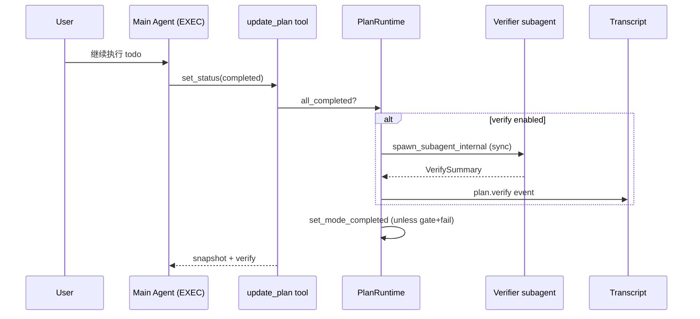

# Plan / Todo 执行完成后的代码验证（Verifier）技术方案

本文档是 **T2-P1-002 | plan-mode-enhance** 的横向调研 + 落地选型方案，承接 [`plan-runtime.md`](./plan-runtime.md)、[`tools/reviewer.md`](./tools/reviewer.md)、[`tools/read.md`](./tools/read.md) 与 [`openspec/specs/guides/workflow/ARCHITECTURE_SPEC.md`](../openspec/specs/guides/workflow/ARCHITECTURE_SPEC.md)。**实现以仓库代码为准**；文中 **PENDING** 验收项表示尚未合入。

§4.1 **「决策」**列（裁决结论）；其他表末列 **「说人话」** 与 ARCHITECTURE_SPEC **§14.1** 对齐。

**说人话**：竞品在「计划/todo 做完之后」普遍还有一层**代码验证**（跑测试、对抗性找茬、强模型二审），和 Tomcat 现有的 **plan 前 reviewer（顾问）** 不是一回事。本文把两者拆开，给出 Tomcat 该补哪一层、怎么补。

> **编号对照**：本文 `## 1`–`## 14` 对应 ARCHITECTURE_SPEC 推荐骨架（术语 → 竞品 → 目标 → §4 选型 → 协议 → …）。

---

## 目录

- [1. 术语统一](#1-术语统一)
- [2. 竞品 / 选型对比（调研）](#2-竞品--选型对比调研)
- [3. 目标与设计原则](#3-目标与设计原则)
- [4. 落地选型与实施（已定稿）](#4-落地选型与实施已定稿)
- [5. 协议（入参 / 出参 / Schema）](#5-协议入参--出参--schema)
- [6. One-Glance Map](#6-one-glance-map)
- [7. 调度时序](#7-调度时序)
- [8. 状态机](#8-状态机)
- [9. 配置与环境变量](#9-配置与环境变量)
- [10. 错误模型 / 警告](#10-错误模型--警告)
- [11. 测试矩阵（验收）](#11-测试矩阵验收)
- [12. 风险与应对](#12-风险与应对)
- [13. 历史决策](#13-历史决策)
- [14. 关联文档](#14-关联文档)

---

## 1. 术语统一

| 术语 | 语义（人话） | 数据载体 | 行为约束 | 说人话 |
|------|--------------|----------|----------|--------|
| **Reviewer（审稿）** | `create_plan` 后读计划/仓库，给**顾问摘要** | `ReviewSummary` + `transcript.plan.review` | **不进** EXEC gate；可改 plan（`allow_review_edit`） | 开工前的挑刺员，不当法官。 |
| **Verifier（验证）** | 实现/todo **声称完成**后，用**可复现命令**证明交付物可用 | 本文拟定 `VerifySummary` + `transcript.plan.verify` | 默认**只读项目** + `bash` 跑检查；输出含 **Command run / Output observed** | 完工后的验货员，专找「最后 20%」。 |
| **Mini 验证** | 执行单步后的快速自检 | 主 Agent prompt / SOP（无独立子 Agent） | 如 `file_read` 非空、`exit code == 0` | 每步顺手看一眼，不另开子进程。 |
| **Inline 验证** | 执行过程中穿插跑测试/构建 | 主 Agent `bash` + executor reminder | 不阻塞 `mode=completed` 除非配置 gate | 边干边测，Codex execute 模板风格。 |
| **CI / 脚本验证** | 人/流水线触发的确定性检查 | `pi_agent_rust/verify` → `scripts/e2e/run_all.sh` 等 | **非** LLM 子 Agent | 机器跑全套测试，和对话解耦。 |
| **Verdict gate** | 验证结果阻塞「任务完成」叙事 | `VERDICT: PASS\|FAIL`（GenericAgent）/ Stop hook `preventContinuation`（cc-fork） | Tomcat **默认不做** gate（对齐 reviewer 顾问原则） | 验不过就不让喊完工。 |
| **`mode=completed` 派生** | EXEC 下全部 plan todo `completed` 后 runtime 自动收口 | `PlanRuntime::on_update_plan_success` → `set_mode_completed` | **当前无** verifier 钩子 | 勾全了就回 CHAT，不管测试绿不绿。 |

**时间点钉死**：

- **Reviewer 触发点**：`create_plan` 落盘成功后（PLAN 阶段，**早于** `/plan build`）。
- **Verifier 触发点（拟定）**：最后一次 `update_plan` 使全部 todo `completed` **之后**、`mode=completed` **之前或之后**（见 §4.1 V3），与 reviewer **正交**。

---

## 2. 竞品 / 选型对比（调研）

### 2.1 验证在 agent 流水线中的典型位置

```text
┌────────────────────────────────────────────────────────────────────────────┐
│  Plan/Todo 生命周期里，「验证」常出现在三个位置                              │
├────────────────────┬───────────────────────────────────────────────────────┤
│  A. 规划后 / 开工前 │  Tomcat reviewer、codex delegate review、Advisor「开工前」│
│  B. 执行中每步      │  GenericAgent Mini验证、Codex「along the way verify」   │
│  C. 全部 todo 完成后 │  cc-fork Verification Agent、GenericAgent [VERIFY]    │
└────────────────────┴───────────────────────────────────────────────────────┘
```

**说人话**：审稿多半在 A；真正验代码多在 B+C。Tomcat 已有 A，缺 C（可选 B 靠 prompt）。

### 2.2 七仓库精读摘要（证据路径级）

| 竞品 | 验证形态 | 触发时机 | Verifier 设计要点 | Gate? | 说人话 |
|------|----------|----------|-------------------|-------|--------|
| **cc-fork-01** | 内置 **Verification Agent** + **Advisor** + **Stop Hooks** | Todo/Task 标完成时 nudge spawn；Advisor 在「声称完成前」 | `cc-fork-01/docs/QUALITY_MECHANISMS.md` §5–§7；源码引用 `tools/AgentTool/built-in/verificationAgent.ts`（仓库内为文档摘录）：对抗性 prompt、**禁改项目**、`disallowedTools` 去 edit/write、每项检查必须 **Command run + 输出粘贴**；`background: true` | Verification 偏 **gate**；Advisor 非 gate | 专门找茬的子 Agent + 强模型二审 + 停不住就继续循环。 |
| **codex** | `codex_delegate` 内部线程 + collaboration **execute** 模板 + 大量 `review` 分支 | 执行中 + 独立 review 线程（分支名 `daniel/review-*` 等，主仓 checkout 未必含 `session/review.rs`） | 对标：[`tools/reviewer.md`](./tools/reviewer.md) §2.2 **internal Rust 派发**；execute 模式强调分步、沿途验证（模板路径随版本变化，以 `collaboration-mode-templates/` 为准） | 视调用方；plan build 由用户拍 | 内部派 review；完工验证靠 prompt + 可选 review 线程。 |
| **GenericAgent** | `plan_sop.md` **[VERIFY]** 步 + `verify_context.json` + `verify_sop.md` | 执行态 **全部 `[✓]` 后强制** | `GenericAgent/memory/plan_sop.md` §「验证检查点」「四、验证态」：独立 subagent、**VERDICT: PASS/FAIL/PARTIAL**、无工具输出则判 FAIL、3 轮内每轮≥1 工具调用 | **是**（未跑 verifier 不得 `[✓]` VERIFY 步） | 计划里写死验货步，独立 subagent 出判决。 |
| **hermes-agent** | `delegate_task(role=…)` + **curator** 等 | 多由 LLM 决定 delegate 时机 | `hermes-agent/agent/curator.py` 等维护记忆/质量；`delegate_task` 在文档对标 [`reviewer.md`](./tools/reviewer.md) §2.2：**toolsets 由 LLM 入参**，边界软 | 通常非硬 gate | 一个工具多种角色，验证靠 role + prompt。 |
| **openclaw** | **`sessions_spawn`** 子会话 | LLM 自调 | `openclaw` 文档/对标：异步 spawn、权限随入参（见 [`reviewer.md`](./tools/reviewer.md)） | 否（摘要） | 模型自己叫子 agent，灵活但易滥用。 |
| **pi-mono** | **subagent 扩展**：worker → reviewer → worker 链 | 用户/模板触发 chain | `pi-mono/packages/coding-agent/examples/extensions/subagent/prompts/implement-and-review.md`：`chain` 传 `{previous}`；**无**内置 plan 完成 verifier | 否 | 实现-审稿-改稿三段链，偏工作流模板。 |
| **pi_agent_rust** | **`./verify` shell** | 人/CI | `pi_agent_rust/verify` → `scripts/e2e/run_all.sh`（lint + test + E2E）；**非** plan todo 绑定的 LLM verifier | N/A（脚本 exit code） | 工程验证脚本，不进 agent 状态机。 |
| **QevosAgent** | **ADVISOR** 战略指导 | 执行中鼓励继续 | `QevosAgent/ADVISOR.md`：独立审视、**非** 代码验货 | 否 | 指导员防跑偏，不跑测试。 |

### 2.3 维度词典（V1–V8）

| 维度 | 关切 | 说人话 |
|------|------|--------|
| **V1 与 reviewer 关系** | 是否同一子 Agent | **分拆**：reviewer=计划质量；verifier=交付物可运行。 |
| **V2 触发** | 自动 / 用户 / plan frontmatter | 默认 **todo 全 completed 时** runtime 派发（可关）。 |
| **V3 Gate** | 是否阻塞 `mode=completed` | **默认否**；可选 `verify_gate=true` 延迟 completed。 |
| **V4 证据** | 叙述 vs 命令输出 | **必须** Command + Output（抄 cc-fork / GenericAgent）。 |
| **V5 工具集** | 只读 vs 可改仓库 | 默认 `{read, search_files, list_dir, bash}`；**禁** write/edit/plan 工具。 |
| **V6 派发入口** | catalog vs internal | **internal subagent**（同 reviewer / codex delegate）。 |
| **V7 与 bash 权限** | 测试命令谁批 | 走现有 **permission + bash_parser**；verifier 上下文可收紧 allowlist。 |
| **V8 失败后续** | 自动回 EXEC vs 仅报告 | 默认 **报告 + 建议 todo**；不自动 reopen（用户 `/plan build` 续跑）。 |

### 2.4 Tomcat 现状（代码证据）

| 能力 | 现状 | 证据 |
|------|------|------|
| Plan 前审稿 | 已有 `reviewer`，顾问非 gate | `src/api/chat/plan_runtime/review.rs`、`tools/reviewer.md` |
| EXEC 完成条件 | 全部 todo `completed` → `mode=completed` | `src/api/chat/plan_runtime/tools/update_plan.rs`、`prompts/executor.txt` |
| 执行中验证 prompt | **弱**：executor 只强调 `update_plan`，**未**要求 build/test | `prompts/executor.txt` |
| 完成后 LLM verifier | **无** | — |
| Read 工具陈旧检测 | 有（edit 前指纹） | [`tools/read.md`](./tools/read.md) §1 `staleness` |

---

## 3. 目标与设计原则

### 3.1 观察指标表

| 目标 | 观察指标（落地后可核对） | 说人话 |
|------|--------------------------|--------|
| **G1 语义分拆** | 文档与代码中 reviewer ≠ verifier；各自独立 prompt / `SubagentType` | 审稿和验货两套词不混。 |
| **G2 可复现证据** | `VerifySummary.checks[]` 每条含 `command` + `output_excerpt`；无 command 的 PASS 标为 `skipped` | 没跑命令不算过。 |
| **G3 默认不 gate 完工** | `verify_gate=false` 时 `mode=completed` 与 today 一致；verify 失败只写 transcript | 验挂了也能收工，但留痕。 |
| **G4 可选硬 gate** | `verify_gate=true` 时 FAIL 阻止 `set_mode_completed`，session 保持 EXEC | 要严模式用户自己开。 |
| **G5 工具边界** | verifier 调不到 `create_plan` / `update_plan` / `write` / `edit` | 验货员不能改计划或源码（除非未来单独立项）。 |
| **G6 与 permission 一致** | verifier 的 `bash` 仍走 gate；危险命令被拒时写入 `VerifySummary` | 该问用户还得问。 |

### 3.2 非目标

| 非目标 | 推给 | 说人话 |
|--------|------|--------|
| 替代 CI / `cargo test` 全量流水线 | 仓库 CI、用户脚本 | 不在 agent 里重造 GitHub Actions。 |
| 合并 reviewer 与 verifier 为一个子 Agent | — | 时机和工具集不同，硬合并更难维护。 |
| LLM 自调 `dispatch_agent(role=verifier)` 进 catalog | — | 和 reviewer 一样走 internal dispatch。 |
| 浏览器 E2E 一等内置 | 未来插件 / MCP | 本期最多 bash 调 playwright CLI。 |

---

## 4. 落地选型与实施（已定稿）

### 4.1 落地选型决策表

**`决策`** 列钉本行裁决结论（**SHOULD**），与 ARCHITECTURE_SPEC **§4.1 / §14.1** 同向。

| 维度 | 关切 | 决策 | 取自 | 入选设计 + 入选理由 | 未入选 + 拒因 | 说人话 |
| --- | --- | --- | --- | --- | --- | --- |
| **V1 角色分拆** | reviewer 是否兼 verifier | **采用** 新增 `SubagentType::Verifier` 独立子 Agent；**拒绝** reviewer 兼 verifier。 | `review.rs`；`cc-fork-01/docs/QUALITY_MECHANISMS.md` §5 vs §6 | **设计**：新增 `SubagentType::Verifier`，独立 system prompt。**理由**：规划期挑刺与完工验货输入/工具不同，合并 prompt 会稀释「找茬」强度。 | **未入选**：扩展现有 reviewer 在 EXEC 末再跑一轮。**拒因**：reviewer 可改 plan（`update_plan`/`edit`），与 verifier 只读+跑命令冲突。 | 两个子 Agent，各干各的。 |
| **V2 触发点** | 何时 spawn verifier | **采用** `all_completed` 时 `PlanRuntime::dispatch_verifier` 同步 await。 | `GenericAgent/memory/plan_sop.md` §四；`QUALITY_MECHANISMS.md` §5 触发 | **设计**：`update_plan` 检测到 `all_completed` 且 `plan.meta.verify != "off"` 时 **`PlanRuntime::dispatch_verifier` 同步 await**。**理由**：与「完工」同一事务边界，避免主 Agent 已回 CHAT 才验。 | **未入选**：主 Agent prompt 自觉验。**拒因**：确认偏误与 verification avoidance（cc-fork L500-511）已证伪。 | 勾完 todo 由 runtime 拉验货员。 |
| **V3 Gate** | 是否阻塞 completed | **采用** 默认 `verify_gate=false`；严模式可配置阻塞 completed。 | `update_plan.rs`；`plan_sop.md` VERDICT | **设计**：默认 **`verify_gate=false`**，verify 结果仅 transcript；`verify_gate=true` 时 FAIL **不**调用 `set_mode_completed`。**理由**：对齐 [`reviewer.md`](./tools/reviewer.md) 顾问哲学，降低误杀；严模式可配置。 | **未入选**：一律 VERDICT gate。**拒因**： flaky test / 环境缺依赖会卡死会话；与 G3 冲突。 | 默认只记账，要严再开闸。 |
| **V4 输出契约** | 结构化 vs 自由文本 | **采用** `<verify>` → `VerifySummary` 结构化契约。 | `verificationAgent.ts` 文档 L604-629；`plan_sop.md` L206-217 | **设计**：`<verify>` block → `VerifySummary { checks[], verdict, summary }`；`verdict ∈ {pass, fail, partial, aborted}`。**理由**：可机器解析、可挂 UI、可测。 | **未入选**：纯 markdown 摘要。**拒因**：难以区分「真跑了 curl」与叙述。 | 结构化验货单。 |
| **V5 工具集** | 能否改代码 | **采用** verifier 工具集 `{read, search_files, list_dir, bash}`；**拒绝** `edit`。 | `QUALITY_MECHANISMS.md` L516-541 | **设计**：`{read, search_files, list_dir, bash}`；duration/token 上限。**理由**：验证=观测+执行检查，不是第二实施者。 | **未入选**：给 verifier `edit` 自动修。**拒因**：与 executor 职责重叠，难审计。 | 验货员只读+跑命令。 |
| **V6 派发** | 入口形态 | **采用** `spawn_subagent_internal`；**拒绝** 进 catalog / `dispatch_agent`。 | [`reviewer.md`](./tools/reviewer.md) §2.1 | **设计**：`AgentRegistry::spawn_subagent_internal`，**不进 catalog**。**理由**：与 reviewer 同路径，复用 cascade abort / depth。 | **未入选**：`dispatch_agent` LLM 工具。**拒因**：模型可能跳过或滥用。 | 内部拉子 Agent，模型看不见。 |
| **V7 执行中验证** | 是否只靠完工 verifier | **采用** PR-V0：executor/planner prompt 补 Mini验证 + 完工 verifier。 | collaboration 模板（概念）；`executor.txt` 现状 | **设计**：**PR-V0** 增强 `executor.txt` + planner reminder：每步 `completed` 前应 Mini验证（build/test/smoke 之一）。**理由**：低成本补 B 层，不阻塞架构。**理由2**：与 C 层 verifier 互补。 | **未入选**：仅完工验证。**拒因**：错误堆到最后代价大。 | 边做边测 + 完工再验一遍。 |
| **V8 失败处理** | FAIL 后谁修 | **采用** FAIL 仅写 `VerifySummary`/transcript；**拒绝** verifier 直接 `update_plan` 回滚。 | `plan_sop.md` §步骤10 FAIL 分支 | **设计**：FAIL 时 `VerifySummary` 建议追加 todos 文案进 tool result / transcript；**不**自动把 plan todos 打回 `pending`（除非未来 `verify_reopen=true`）。**理由**：避免 verifier 与主 Agent 抢 `update_plan`。 | **未入选**：verifier 直接 `update_plan` 回滚状态。**拒因**：破坏「进度只由 executor 推」不变量。 | 验挂了给清单，人/主 Agent 决定改。 |

### 4.2 实施点（分期）

| 实施点 | 交付范围（含交付物） | 主要代码落点 | 验收锚点（示例） | 说人话 |
|--------|----------------------|--------------|------------------|--------|
| **PR-V0 prompt** | `executor.txt` / `planner.txt` 增补 Mini验证与推荐检查项；文档同步 | `src/api/chat/plan_runtime/prompts/*.txt` | 人工：EXEC 计划含 test/build todo 时模型应先 bash 再 `completed` | 先靠提示词补沿途验证。 |
| **PR-V1 verifier 核心** | `SubagentType::Verifier`、`VERIFY_SYSTEM_PROMPT`、`VerifySummary` 解析、`dispatch_verifier` | `plan_runtime/verify.rs`（新）、`agent_registry.rs`、`plan_runtime/mod.rs`、`plan_runtime/tools/update_plan.rs` | `verifier_spawned_on_all_completed`、`verifier_blocked_write_tools`（PENDING） | 勾完 todo 拉验货子 Agent。 |
| **PR-V2 transcript + CLI** | `transcript.plan.verify` 事件；`/plan verify <id>` 手动重跑；`create_plan` frontmatter 支持 `verify: off\|soft\|gate` | `session-storage.md` 对齐、`cmd_plan.rs` | `verify_event_in_transcript`、`plan_verify_slash_manual`（PENDING） | 事件可回放，能手动再验。 |
| **PR-V3 gate 与策略** | `verify_gate` 配置；FAIL 阻塞 `set_mode_completed`；plan 元数据 `verify_checks[]` 模板 | `infra/config/mod.rs`、`update_plan.rs` | `verify_gate_blocks_completed_on_fail`（PENDING） | 严模式才卡完工。 |

### 4.2.1 PR-V1 调度要点（ASCII）

```text
update_plan (last todo → completed)
        │
        ▼
  all_completed(plan.todos)?
        │ no ──▶ 常规返回 snapshot
        │ yes
        ▼
  plan.meta.verify == "off"? ──yes──▶ set_mode_completed (today)
        │ no
        ▼
  PlanRuntime::dispatch_verifier(plan)  ── sync await ──▶ VerifySummary
        │
        ├─ verify_gate && verdict==fail ──▶ 保持 EXEC，不写 completed mode
        └─ else ──▶ set_mode_completed + attach verify to tool result
```

---

## 5. 协议（入参 / 出参 / Schema）

### 5.1 PlanFile frontmatter（扩展，拟定）

| 字段 | 类型 | 必填 | 默认 | 说明 | 说人话 |
|------|------|------|------|------|--------|
| `verify` | string | 否 | `soft` | `off` \| `soft` \| `gate`：是否派发 verifier / 是否 gate completed | 验货开关。 |
| `verify_checks` | string[] | 否 | `[]` | 建议命令模板（如 `cargo test`、`npm run build`） | 计划里写好跑啥。 |
| `verify_task_type` | string | 否 | `code` | `code` \| `cli` \| `web` \| `infra`（抄 cc-fork 策略表） | 告诉验货员侧重哪类检查。 |

### 5.2 `VerifySummary`（单一事实源：拟定 `plan_runtime/verify.rs`）

```yaml
# 子 Agent 最终消息内 <verify> block（yaml 子集）
checks:
  - name: "unit tests"
    command: "cargo test -p tomcat --lib"
    output_excerpt: "test result: ok. 42 passed"
    result: pass   # pass | fail | skip
verdict: pass      # pass | fail | partial | aborted
summary: "≤600 chars"
```

| 字段 | 约束 | 说人话 |
|------|------|--------|
| `checks[].command` | PASS 必填；缺则 runtime 降为 `skip` 或整体 `partial` | 没命令别说过。 |
| `verdict` | `aborted`：parse 失败 / max_turns / parent abort | 验货中断。 |
| Tool result 挂载 | `update_plan` 成功 JSON 增加 `verify: VerifySummary \| null` | 主 Agent 一眼看见验货结果。 |

### 5.3 Verifier system prompt（设计要点，节选）

对标 `cc-fork-01` verificationAgent（`QUALITY_MECHANISMS.md` §5）：

1. 职责：**不是**确认实现正确，而是**试图推翻**「已完成」声称。
2. 禁止：改项目文件、改 plan、`create_plan`。
3. 每个 check：**Command run** + **Output observed**（粘贴终端输出）。
4. 反合理化：禁止「看起来对」式 PASS（与 cc-fork L563-582 同构）。
5. 按 `verify_task_type` 选用策略（web→curl/headless CLI；code→build/test；等）。

---

## 6. One-Glance Map

```text
┌─────────────────────────────────────────────────────────────────────────┐
│ ChatContext.plan_runtime: PlanRuntime                                     │
│   on_update_plan_success()                                              │
│     ├─ ops::all_completed()                                             │
│     ├─ [NEW] dispatch_verifier() → AgentRegistry::spawn_subagent_internal │
│     │         └─ plan_runtime/verify.rs (prompt, parse, build_brief)    │
│     └─ set_mode_completed()  (gated by verify_gate + verdict)           │
├─────────────────────────────────────────────────────────────────────────┤
│ AgentRegistry                                                           │
│   SubagentType::Reviewer  ← create_plan (已有 review.rs)                │
│   SubagentType::Verifier  ← update_plan all completed (新)              │
├─────────────────────────────────────────────────────────────────────────┤
│ tool_exec + permission                                                  │
│   verifier context: bash allowlist / url_like / gate                    │
├─────────────────────────────────────────────────────────────────────────┤
│ transcript                                                                │
│   plan.review (已有)  plan.verify (新)                                    │
└─────────────────────────────────────────────────────────────────────────┘
```

---

## 7. 调度时序



---

## 8. 状态机

| 状态 | 进入条件 | verifier 行为 | 说人话 |
|------|----------|---------------|--------|
| EXEC | `/plan build` | 不自动跑（除非手动 `/plan verify`） | 干活中。 |
| EXEC + verifying | `all_completed` 且 `verify!=off` | 同步子 Agent 运行中 | 短暫「验货中」。 |
| COMPLETED | `set_mode_completed` | 可选保留 `plan_id` 供 `/plan verify` 重跑 | 回 CHAT。 |
| EXEC（gate 失败） | `verify=gate` 且 verdict=fail | **停留** EXEC；todos 仍全 completed | 完工被拦下。 |

---

## 9. 配置与环境变量

| 键 / env | 默认 | 说明 | 说人话 |
|----------|------|------|--------|
| `[plan].default_verify` | `soft` | 新 plan 的 `verify` 默认值 | 默认软验货。 |
| `[plan].verify_gate` | `false` | 全局 gate（可被 plan frontmatter `verify: gate` 覆盖） | 全局严模式。 |
| `TOMCAT_VERIFIER_SYSTEM_PROMPT_OVERRIDE_PATH` | 空 | 覆盖 verifier prompt（对齐 reviewer override 字段，**待接线**） | 自己写验货 prompt。 |
| `[plan].verifier_max_turns` | TBD | 子 Agent 轮次上限 | 别验太久。 |

---

## 10. 错误模型 / 警告

| 情况 | 结局 | 说人话 |
|------|------|--------|
| Verifier spawn 失败 | `verdict=aborted`；**不**阻塞 completed（除非 gate） | 验货员没起来也先收工。 |
| Parse `<verify>` 失败 | 同 aborted；tool result `verify.aborted=true` | 格式乱了当没验。 |
| Bash 被 permission 拒 | check `result=fail` 或 `skip` + note | 命令没跑成记下来。 |
| 无 `verify_checks` 且 task_type=code | verifier prompt 要求从 plan body / 仓库推断最小检查（build 或 test） | 没写命令就猜一个最小的。 |

---

## 11. 测试矩阵（验收）

| ID | 场景 | 期望 | 状态 |
|----|------|------|------|
| T-V1 | 最后一个 todo completed + `verify=soft` | spawn verifier；transcript 有 `plan.verify`；mode 仍 → completed | PENDING |
| T-V2 | verifier 调用 `write` | tool_exec 拒绝；summary 含失败 | PENDING |
| T-V3 | check 无 command 标 PASS | runtime 标 `partial` 或 downgrade | PENDING |
| T-V4 | `verify=gate` + verdict fail | `mode` 保持 executing；CHAT 未恢复 | PENDING |
| T-V5 | `verify=off` | 不 spawn；与当前 `update_plan` 行为一致 | PENDING |
| T-V6 | reviewer 与 verifier 同 plan | create_plan 只触发 reviewer；completed 只触发 verifier | PENDING |

---

## 12. 风险与应对

| 风险 | 应对 | 说人话 |
|------|------|--------|
| 验证命令破坏环境 | bash gate + 沙箱策略；verifier 禁 write | 验货别乱删库。 |
| 耗时过长 | `verifier_max_turns` + 单命令 timeout；可 `background` 二期 | 别验一小时。 |
| 与 reviewer 重复读盘 | 独立上下文；brief 只传 plan 路径 + deliverables | 各用各的上下文。 |
| 模型 verification avoidance | prompt 反合理化 + 输出 schema 强制 command 字段 | 专防「嘴上说过了」。 |

---

## 13. 历史决策

| 决策 | 原因 |
|------|------|
| reviewer **不做** EXEC 完工 gate | 已在 [`reviewer.md`](./tools/reviewer.md) / [`plan-runtime.md`](./plan-runtime.md) G4 拍板 |
| 本期 **不** 把 verifier 暴露为 LLM 工具 | 与 reviewer 同：防滥用、边界硬编码 |
| `pi_agent_rust/verify` **不** 内嵌为子 Agent | 它是 CI 脚本，不是对话 verifier |

---

## 14. 关联文档

- 运行时总览：[plan-runtime.md](./plan-runtime.md)
- 审稿（规划后）：[tools/reviewer.md](./tools/reviewer.md)
- 读工具与陈旧检测：[tools/read.md](./tools/read.md)
- 子 Agent 基础设施：[multi-agent.md](./multi-agent.md)
- 文档规范：[ARCHITECTURE_SPEC.md](../openspec/specs/guides/workflow/ARCHITECTURE_SPEC.md)
- 任务卡：[T2-P1-002.md](../../agents/TASK_BOARD_002/tasks/T2-P1-002.md)
- 竞品质量机制原文：`cc-fork-01/docs/QUALITY_MECHANISMS.md`
- GenericAgent 验证 SOP：`GenericAgent/memory/plan_sop.md` §四

**说人话**：开工看 reviewer，收工看 verifier（本文）；中间靠 executor prompt 做 Mini验证；机器全量测试仍走 CI / `./verify` 脚本。
