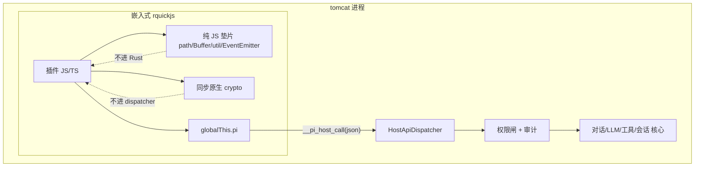

本文为 [Architecture](../Architecture.md) 中「5.5 插件系统全貌」的**新版**详细设计，描述**剥离 WasmEdge、迁移到进程内嵌入式 rquickjs**后的插件体系。旧版（WasmEdge + `wasmedge_quickjs.wasm`）见 [plugin-system-overview.md](plugin-system-overview.md)，本文取代其运行时与兼容性章节。

> 配套计划：`.cursor/plans/wasmedge_可选与插件_sdk_对比_be3167e3.plan.md`（剥离 WasmEdge 迁移 rquickjs）。

## 摘要

旧版插件运行在 **WasmEdge + 定制 `wasmedge_quickjs.wasm`** 沙箱里，并维护一整套 Node.js 兼容层以兼容 pi-mono / npm 生态；代价是**强制外部 C 运行时依赖**、定制 wasm 构建链、以及与 WasmEdge 深度耦合。

新版做三件事：

1. **运行时**：用进程内嵌入式 `**rquickjs`** 取代 WasmEdge，用户无需安装任何外部运行时。
2. **兼容性**：**放弃 pi-mono 插件硬兼容**，沿用并裁剪现有 `pi.`* hostcall（自有 manifest + 精简 API 子集）。
3. **能力边界**：敏感能力（fs/net/exec/会话）一律走 `pi.`* hostcall + 权限闸；**不做 Node 兼容层**，只从 pi_agent_rust 移植少量纯工具垫片（crypto/buffer/path/events/util）。

**说人话**：以前是「带一份 JS wasm 剧本 + 租 WasmEdge 放映机 + 背一整套 npm 道具库」。新版把 **QuickJS 焊进 tomcat 自己肚子里**，插件直接在里面跑；要读盘/上网就敲 `pi.`* 小窗口（宿主记账、可拒绝）；只随身带几样最常用的小工具，不再背 pi-mono 和 npm 那一大箱道具。

> **安装入口补充（T2-P1-017 PackageManager）**：plugin 的 runtime 发现链路仍是 `project(.tomcat/plugins) > agent(agents/<id>/plugins) > global(work_dir/plugins)`，但安装/卸载/列包已经统一收口到 `PackageManager`：shell 走 `tomcat install` / `tomcat uninstall` / `tomcat packages`，会话内走 `/install`。安装成功后只会写三层 `plugins/` 正文目录与 per-layer `plugins/registry.json` / `packages/registry.json`；当前 code/claw 会话若通过 `/install` 安装，则只刷新 plugin catalog stub 与静态 `manifest.tools` 可见集，**不会**在 install 路径调用 `load_plugin()`、不会启动 session VM，也不会热替换已加载实例。**但本版新增的 host-facing `functions[]` / `FunctionRegistry` 宿主函数来源不复用这条三层发现 / 安装链，统一只认宿主根 `~/.tomcat/{plugins,packages}`。**

---

## 文首导读：方案导图集

### 本版关键设计点（先读这段，了解来龙去脉）

> **背景**：tomcat 不是「一次只跑一个会话」的工具——它的架构允许**多个 session 同时并发执行**。这意味着插件系统天生要面对「多个插件同时在干活」「同一个插件被好几个会话同时用」的局面。本版在「剥离 WasmEdge、迁到进程内 rquickjs」这条主线之外，又把下面几个**容易踩坑、且和并发强相关**的设计点显式钉死（详见 §4.1 决策表与 §4.3）。这里用人话先讲清楚每个点「为什么要管、怎么解」。

1. **运行时换芯（主线）**：把插件从「外部 WasmEdge + wasm 文件」搬进「编译进 tomcat 自己进程的 rquickjs」。好处是用户装完即用、无外部依赖；代价是丢了 Wasm 的内存硬墙，隔离要靠软手段（见下一条）。→ §3、§4.1 运行时行。
2. **崩溃/作恶隔离**：同进程跑别人的代码，最怕「一个插件崩了/死循环了，把整个 tomcat 带塌」。解法是四层兜底——**每个运行中的插件实例（即每个 `(session_id, plugin_id)` 活体）单独开一条专属线程**、Rust 层 `catch_unwind` 接住 panic、单次执行超时+中断预算掐死循环、出事就把那个插件标成 `Error` 关掉。**底层 C 级崩溃（段错误）兜不住**，这是相对旧版的明确弱化，已写进风险。→ §4.3.1、§10。
3. **多实例并发模型**（本轮重点）：同一个插件被会话 A 和会话 B 同时用，**各发一份独立的「活体」**（独立 JS 内存 + 独立事件信箱），互不串状态——这就是「面向对象多实例」，且**现状代码已经是这么做的**（`RuntimeManager` 按 `会话+插件` 双键索引）。注意区分**三阶段**和**两类 VM**：阶段一只编目（静态 `tools[]` 不跑码即可知，待 scope 首次激活零跑码 materialize 才对该 scope 的 LLM 可见）；阶段二是**条件子步骤**，**仅对没有静态 `tools[]` 的 legacy 插件**，在会话进入 / scope 首次激活时用一个「短命校验 VM」跑一遍初始化、把工具登记到 **project scope 共享表**（有静态 `tools[]` 的插件完全跳过阶段二）；阶段三才是「长命事件循环 VM」按会话多实例真正干活。现状代码里 `load_plugin` 的 `run_script` 是短命校验证据，生产长跑走 `start_session_vm`。→ §4.3.4、§4.1 并发/实例模型行。
4. **事件的 sessionId 流转**（本轮重点）：事件投递已经按 `会话/插件` 信箱隔离（不会投错）；但插件读「当前会话」时，现状代码读的是一个**全局变量**，多会话并发会**读串**——本版改成「看信箱上写的是哪个会话号，就取哪个会话的数据」。→ §4.3.2、§10。
5. **插件 = 能力容器，不是工具本身**（本轮重点）：插件是「装好后会注册东西的程序」，但本版把它贡献的能力**显式分成两条注册面**：① 给 LLM 用的 **tools**，进共享 `ToolRegistry`，和内置工具同一条 tool-calling 通道；② 给宿主用的 **functions**，进共享的**宿主扩展点注册表**（下文有时沿用 `FunctionRegistry` 这个简称，但对 `web_search.backend` 这类点可以落成专用候选函数表），由宿主按契约调用，**不进 LLM 工具列表**。`web_search` backend 插件走的是第二条路。它仍可挂事件钩子、注册命令。也就是说：**和 skill 那套「把目录塞进提示词、模型挑了再读正文」是不同通道；和 host-facing function 也不是一回事。** **注意：本版 host-facing function 宿主函数来源的发现 / 安装路径不继承 skill 三层磁盘根，而是统一只认宿主根 `~/.tomcat/{plugins,packages}`。** → §4.3.3、§4.1 插件 vs 工具 / 宿主函数 / 能力注入 LLM / 加载路径行。
6. **作用域 = 分账，不混同**（本轮重点，含一处设计修正）：`ToolRegistry`/`plugins` 管理态与运行期 VM 仍然需要区分 session / scope / 进程级职责，但**不要把“project scope 共享”与“磁盘发现分层”混成一件事**。对 LLM 工具面，project scope 仍然是重要可见性单位；**对本版新增的 host-facing `functions[]` / `FunctionRegistry`，宿主函数来源固定为宿主根 `~/.tomcat/plugins`，不做 `project > agent > managed` overlay，也不从 workspace `.tomcat/plugins` 派生优先级。** 针对「插件很多别一开机全量加载」：开机只读 manifest 建轻量 Catalog，能力信息优先用 manifest **静态 `tools[]` / `functions[]`**（不跑码即可见），运行 `VmActor` **首次用到才建、闲了回收**。竞品里 openclaw 在“manifest 声明工具 + 按需子集加载”上最成熟，pi-mono/pi_agent_rust 对启用集仍 eager 全量（反面）。→ §4.3.5、§4.3.6、§4.1 注册面作用域 / 加载策略行。

> 一句话串起来：**换引擎（rquickjs）→ 同进程所以要软隔离 + 崩溃隔离 → 多会话并发所以要多实例 + sessionId 不串台 → 插件既可贡献给 LLM 的 tools，也可贡献给宿主的 functions，其中 `web_search` backend 走 function 面；且本版宿主函数来源只从宿主根 `~/.tomcat/plugins` 发现、通过 `~/.tomcat/packages` 安装管理 → 运行实例按会话懒加载，插件再多也只读名册、用到才加载。**


### A.0 Mermaid 时序图（插件注册：从磁盘到共享注册面）

> 专业：此图画的是**三阶段**，但**注意不是线性必经**：**阶段一 编目**（启动/发现期，只读 manifest、不跑插件代码；先形成 `PluginCatalog` 底座，等某个 scope 视图 materialize 时再把静态 `tools[]` 零跑码写入 `ToolRegistry`，把静态 `functions[]` 交给各自的**宿主扩展点注册表**）。**这里再钉一条例外口径：host-facing `functions[]` / `FunctionRegistry` 宿主函数来源的发现 / 安装根固定为宿主根 `~/.tomcat/{plugins,packages}`，不走 `project > agent > managed` overlay。** **阶段二 激活/注册**是个**条件子步骤**，**仅对没有静态 `tools[]` 的 legacy 工具插件**才发生，触发点在**会话进入 / scope 首次激活**（用短命校验 VM 跑一遍命令式补登工具，使其对 LLM 可见——不能拖到 `tool_call`，否则 LLM 根本看不见）。host-facing `functions[]` 本版要求**静态在 manifest 声明**，但它表达的是**宿主可见的最小契约**，不是插件内部配置；例如 `web_search.backend` 只声明“这个插件提供 `webSearchBackend(params)` 入口”，插件内部有哪些后端、什么顺序、默认参数是什么，都留在 JS。**阶段三 运行**里再分两条：LLM 真发 `tool_call` 走工具面；宿主（如 `WebSearchRuntime`）按扩展点契约调用 function 走宿主面，二者都按会话多实例起/复用 VM 干活。它要回答四个问题：① `ToolRegistry`/宿主扩展点注册表/`plugins` 表的作用域（工具面仍可按 scope 组织，但宿主函数来源是宿主根单源）；② 插件很多时为什么不一上来全量加载；③ `PluginManifest`、Catalog、短命 `PluginVmInstance`、长命 `VmActor`、两类注册面、`PluginInstance` 分别何时出现、存什么；④ 为什么 host-facing function 不会污染 LLM 工具表。
> 说人话：LLM 工具面和宿主函数面别混着看。工具那边可以继续按项目视图组织；但宿主函数来源这边，本版只认宿主根 `~/.tomcat/plugins` 这一处，不会去扫 workspace 或 agent 目录。只有当某插件**真的被用到**，才把它的代码拉起来跑；LLM 叫工具是一条路，宿主按扩展点契约调 function 是另一条路。注意：编目阶段**不跑代码**。

```mermaid
sequenceDiagram
    participant Disk as 磁盘(三层根:项目>agent>全局)
    participant LLM as LLM
    participant Host as 宿主调用者(WebSearchRuntime)
    participant Sess as 会话入口(SessionRuntime)
    participant AL as AgentLoop(execute_tool 总闸)
    participant PM as PluginManager(PluginToolExecutor)
    participant Cat as PluginCatalog(进程级发现+静态元信息,不可变)
    participant VM as 短命PluginVmInstance(懒,首次激活)
    participant RM as RuntimeManager
    participant LVM as 长命VmActor(session期)
    participant Disp as HostApiDispatcher
    participant Reg as ToolRegistry(scope 共享)
    participant FnReg as 宿主扩展点注册表(scope 共享,宿主专用)
    participant Map as plugins表(per-scope 管理态,可变)

    rect rgb(235,245,255)
    Note over Disk,Reg: 阶段一 编目/预填(触发分两拍: 进程启动先扫 global/agent；进入某 project scope 时再补扫该 project overlay；全程只读 manifest 不跑码)
    Disk->>PM: 进程启动先扫 global/agent roots + 同名 first-wins
    PM->>PM: 读 plugin.json -> PluginManifest{id,name,version,main,permissions, tools[], functions[], events[]/activation}
    PM->>Cat: pre-seed PluginCatalog 条目(immutable: id/version/root/manifest + declared tools[]/functions[]/events[])
    Note over Cat: 这就是「扫盘即填满」的那张表(不可变元信息层); ≠内置 BUILTIN_TOOL_CATALOG(那是编译期 const, 内置工具规格单一事实源)
    alt manifest 静态声明 tools[](目标态,首选)
        PM->>Cat: 记下 declared tool meta(待某 scope 命中时零跑码 materialize 到该 scope 的 ToolRegistry)
        Note over Cat: 冷启动最省; events[] 也可静态读到, 但它只是事件名声明, 不决定是否 session 入口预启动
    else 无静态 tools[](legacy)
        Note over Cat: 标记 needs_activation; 工具留到 scope 激活期跑码补登
    end
    opt manifest 静态声明 functions[](本版新增; 宿主专用)
        PM->>Cat: 记下 declared host-function contract(待某 scope 命中时按 point 分发到宿主扩展点注册表)
        Note over Cat: functions[] 只声明宿主可见契约; 不进 LLM, 不保存插件内部后端顺序/默认参数
    end
    end

    rect rgb(245,240,255)
    Note over Sess,Map: 会话进入 / scope 首次激活(从 Catalog 命中集 seed per-scope 管理态; 「阶段二」与事件预启动也在此; 但 seed 表行≠跑码)
    Sess->>PM: 首次进入该 project scope 时补扫 project_root/.tomcat/plugins overlay(只读 manifest, 不跑码)
    Sess->>Cat: 合并出该 project scope 命中插件集(global/agent 共享 + project overlay)
    Sess->>Map: seed per-scope plugins表条目(轻量: 当前直接记为 Enabled catalog stub, 引用 Catalog 元信息, 账本字段空; 不读 main 不跑码)
    Note over Map: plugins表=per-scope「管理态层」, 记本 scope 的 status/config/registered_tools/registered_functions/event_listener_ids/VM句柄; 其中 registered_tools 镜像 manifest.tools[]（给 LLM 的契约面）, registered_functions 镜像 manifest.functions[]（给宿主的最小契约面）。Catalog(底座) + 本表(overlay) = 该 scope 下插件完整视图
    Note over Sess,LVM: 下面是两条【正交】决策(非三选一): A=工具可见性(看有无静态 tools[]); B=VM 生命周期(看 activation)。activation 与 tools[] 互不蕴含, 同一插件各走 A、B 一次
    alt A 有静态 tools[](目标态首选)
        Sess->>Reg: 零跑码 materialize manifest.tools[] -> 对该 scope 的 LLM 可见
    else A 无静态 tools[](legacy)
        opt 且 activation=lazy(不会被 B 预启动, 否则没人跑码登记工具)
            Sess->>VM: 「阶段二」短命 create_instance + run_script(manifest.main)
            VM->>Disp: hostCall('tools','registerTool', {name,...})
            Disp->>Reg: register_tool(跑码后才可见; execute 留 JS)
            VM-->>Sess: run_script ok(短命校验完即弃)
        end
        Note over Reg: 若 activation=session, 工具登记交给 B 预启动的长 VM 顺带完成, 不另起短命 VM
    end
    opt manifest 静态声明 functions[](宿主面, 本版新增)
        Sess->>FnReg: 零跑码按 point 分发 manifest.functions[] -> 对宿主可按扩展点契约调用(不进 LLM)
    end
    alt B activation="session"(生命周期型: 要接 session_start/定时器/订阅事件)
        Sess->>PM: 预启动 start_session_vm(session_id, plugin_id) (长跑 VM)
        PM->>RM: 建 actor + Init -> LVM 进 waitForEvent
        Sess->>Disp: deliver_event(session_start)
        Disp-->>LVM: waitForEvent() 取到 session_start
        PM->>Map: 置 status=Enabled(无静态 tools[] 时, 长 VM 启动代码里的 registerTool 在此一并登记; event_listener_ids 待运行期挂 on/once 再回填)
        Note over LVM: 必须此刻在场; 否则永久错过 session_start(不能拖到 tool_call)
    else B activation=lazy(默认: 纯按需)
        Note over RM: 不预启动长 VM; 等 LLM 首次 tool_call 进阶段三
    end
    end

    rect rgb(235,255,240)
    Note over LLM,LVM: 阶段三 运行(这里懒的是“长跑 VM 起机”; 触发=LLM 真发 tool_call。前提:该工具已对 LLM 可见——要么阶段一静态 tools[]，要么会话进入时已补跑过阶段二)
    Note over LLM,Reg: 进入本块前, ToolRegistry 中已必须有该工具(来源=阶段一静态 tools[] 或会话进入期补跑的阶段二); LLM 看不见的工具不可能被 tool_call
    LLM-->>AL: 返回 tool_calls(toolName, args)
    Note over AL: execute_tool 总闸统一分发: 内置工具→PrimitiveExecutor; 插件工具→走下面这条插件分支(PluginToolExecutor)
    AL->>Reg: call_tool(toolName, params)
    Reg->>Reg: get_tool(toolName) -> Tool{plugin_id}（按名反查归属插件）
    Reg->>PM: PluginToolExecutor.execute(tool{plugin_id}, params, session_id)
    PM->>RM: ensure/start_session_vm(session_id, plugin_id)
    RM->>RM: get(key=session_id/plugin_id)? 命中复用; 未命中才新建
    RM->>LVM: spawn actor + send Init (actor 内部再 init_vm + 注入 bridge/shim + _start)
    LVM-->>RM: ready(已进入 waitForEvent loop；目标态建议显式握手)
    RM-->>PM: vm ready / handle
    alt 工具调用(执行 LLM 选中的那个插件工具)
        PM->>LVM: invoke __pi_execute_tool({toolName, params})
        Note over LVM: VM 内按裸 toolName 查 __pi_tools[toolName] 执行(单插件内不会撞名)
        LVM->>Disp: hostCall(...)
        Disp-->>LVM: tool result
        LVM-->>PM: tool result
        PM-->>Reg: result
        Reg-->>AL: 封装为 {content, details}
        AL-->>LLM: tool result 回传(进入下一轮)
    else 宿主函数调用(非 LLM; 例: web_search backend)
        Host->>FnReg: dispatch point="web_search.backend" + {backend,query,...}
        FnReg->>PM: PluginFunctionInvoker.execute(targetFn{plugin_id,function="webSearchBackend"}, params, session_id)
        PM->>LVM: invoke __pi_execute_function({functionName, params})
        Note over LVM: VM 内按 functionName 查 __pi_functions[functionName] 执行(不会进 ToolRegistry)
        LVM->>Disp: hostCall(...)
        Disp-->>LVM: function result
        LVM-->>PM: function result
        PM-->>FnReg: result / unsupported_backend
        FnReg-->>Host: {hits,warnings,backend_used} 或继续尝试下一个候选函数
    else 事件投递(非 LLM tool_call 路径)
        PM->>Disp: deliver_event(instance_id, envelope)
        Disp-->>LVM: waitForEvent() 取到 event payload
    end
    Note over RM,LVM: session_end 或 idle TTL 时回收; 同 key 重复使用直接复用
    Note over PM,Map: unload_plugin(id) 时: 删该 scope 的 plugins表条 + 据 registered_tools / registered_functions 清理 ToolRegistry / 宿主扩展点注册表；事件监听现状主要按 plugin_id 批量 remove_plugin_listeners；RM.evict VM
    end
```

> **三个“加载点”（按是否跑码区分，直接回答“阶段二到底什么时候触发”）。** 只有 1 个不跑码入口 + 真正跑码的入口落在会话相关时点：
> - **① 程序启动（阶段一编目/预填，不跑码）**：先只读 manifest。对工具面，可继续沿 generic plugin catalog 预填共享底座；**对本版 host-facing `functions[]` / `FunctionRegistry`，宿主函数来源只从宿主根 `~/.tomcat/plugins` 发现、通过 `~/.tomcat/packages` 安装管理，不走 `global/agent/project` overlay。** 启动期**不跑任何插件代码**。注意 `PluginCatalog` 与内置工具的编译期 `BUILTIN_TOOL_CATALOG` 是两张不同的表，最终只有 `tools[]` 汇进某个具体 scope 的 `ToolRegistry` 给 LLM；`functions[]` 则按 `point` 分发到宿主扩展点注册表给宿主。
> - **② 会话进入 / scope 首次激活**：先**补扫该 project scope 的 project overlay**、合并 scope 视图，然后走**两条正交决策（不是三选一，回答你的 Q3）**：
>   - **A 工具可见性（看有无静态 `tools[]`）**：有静态 `tools[]` → 由 `base ⊕ overlay` **零跑码 materialize** 到该 scope 的 `ToolRegistry`，立即可见；无静态 `tools[]`（legacy）→ 只有当它**同时是 `activation=lazy`** 时，才需在此补跑「阶段二」短命 VM 调 `registerTool` 让工具可见。
>   - **B VM 生命周期（看 `activation`）**：`activation:"session"` → **预启动长跑 VM** 并投 `session_start`（否则永久错过）；默认 `activation:"lazy"` → 不预启动，等首次 `tool_call`。
>   - 两轴独立组合出 4 种行为，其中只有 **(lazy ∧ 无静态 `tools[]`)** 这一格才单独起阶段二短命 VM；**(session ∧ 无静态 `tools[]`)** 的工具登记由 B 预启动的长 VM 启动代码顺带完成，不另起短命 VM。
> - **③ 首次 `tool_call`（执行期跑码）**：工具已可见后，LLM 真点名调用时才**起/复用长跑 VM** 执行（对 `activation=lazy` 的插件而言，这是它长跑 VM 的首次起机）。
>
> **所以“阶段二”不是线性中间阶段，而是个条件子步骤。** 它**只对没有静态 `tools[]` 的 legacy 插件**存在，触发时点是**会话进入 / scope 首次激活**——既不是“程序启动时跑码”（启动只编目），也**不能拖到 `tool_call`**（鸡生蛋：没注册→LLM 看不见→不会调用）。**有静态 `tools[]` 的插件根本不经过阶段二**：在该 scope 进入时由 manifest `tools[]` 零跑码 materialize 到 `ToolRegistry`，随后 LLM 首次 `tool_call` 直接进阶段三。目标态里，对 LLM 暴露的工具面以 manifest `tools[]` 为准；若仍有 `registerTool`，也只视为 legacy 兼容/实现自报，不再额外长出第二套可调用工具清单。

> **谁发起 / 谁串联（对应你的两个疑问）。** 阶段三现在有**两条并行但正交的调用面**：  
> - **LLM 工具面**：发起者是 **LLM**。它在回合里返回 `tool_calls(toolName, args)`，由 **Agent Loop 的 `execute_tool` 总闸** 统一接住——这是内置工具与插件工具共用的**同一个入口**（保证中断/引导/审计/结果封装一致）。总闸判断该工具属于插件后，转入**插件分支**：经 `ToolRegistry.call_tool(toolName, params)` 用 `toolName` 反查出 `Tool{plugin_id}`，再交给注入的 **`PluginToolExecutor.execute(tool, params, session_id)`**。  
> - **宿主函数面**：发起者是 **宿主子系统**（例如 `WebSearchRuntime`），它按**扩展点契约**找到候选函数；对 `web_search.backend` 这类点，宿主只认一个稳定入口 `webSearchBackend(params)`，并把显式 `backend` 或 `"auto"` 作为参数传进去；某个候选函数若返回 `unsupported_backend`，宿主可继续试下一个候选函数。  
> **两条链都复用同一套“ensure VM → ready → 回 VM 执行 → hostcall → 收结果”的底层机制，但入口不同：tool 面进 Agent Loop，总是给 LLM；function 面不进 ToolRegistry，也不暴露给 LLM。** 详见 §4.1 决策表「宿主函数面」「工具调用执行路径」两行。
>
> **这几步是串行依赖，不是并列并发。** 无论是 `PluginToolExecutor.execute` 还是 `PluginFunctionInvoker.execute`，顺序都应是：① 先 `ensure/start_session_vm(session_id, plugin_id)`，保证这个 `(session, plugin)` 的长跑 VM 已存在；② 若是首次使用，就建 actor、发 `Init`、等 VM 进入事件循环；③ **拿到 ready / handle 后**，才真正调 `__pi_execute_tool({toolName, params})` 或 `__pi_execute_function({functionName, params})` 执行。两条分叉里，**事件投递**可通过已注册的 channel 入队，再由 `waitForEvent()` 取走；**工具/函数调用**则直接回到该 VM 执行。现状代码里 `start_session_vm()` 只 `await handle.dispatch(VmCommand::Init)`，还没有显式 `ready` 握手；因此文档这里按**目标态**把“ready 屏障”写明，避免误解成“发完 Init 马上就一定能安全执行能力”。
>
> **一个插件里既有多个 tool、又有多个 function，怎么指定调哪个？** `ensure/start_session_vm` 本身**不注册能力**，它只保证一个 `(session_id, plugin_id)` 的 VM 就绪；能力注册发生在静态 manifest（`tools[]` / `functions[]`）与运行时绑定（`pi.registerTool` / `pi.registerFunction`）。  
> - **对 tool**：定位链路仍是 `toolName → ToolRegistry.get_tool → Tool.plugin_id →（当前回合 session_id + plugin_id）→ RuntimeManager 取/起 VM → __pi_execute_tool({toolName, params})`；进入 VM 后再按**裸 `toolName`** 查 `__pi_tools[toolName]`。  
> - **对 function**：定位链路是 `point/contract → 候选函数表 →（plugin_id + functionName）→（当前回合 session_id + plugin_id）→ RuntimeManager 取/起 VM → __pi_execute_function({functionName, params})`；进入 VM 后按**裸 `functionName`** 查 `__pi_functions[functionName]`。  
> 前提是**暴露给 LLM 的 tool 名**在 scope 内全局唯一；而 host-facing **function 名**代表的是宿主稳定契约（例如 `webSearchBackend`），插件内部真正支持哪些后端和顺序则不再由宿主登记。详见 §4.1 决策表「宿主函数面」「宿主函数调用路径 / 命名」两行。


下面这段**专门讲 tool 面**（给 LLM 的工具）；host-facing function 的运行时绑定逻辑与之平行，只是它走的是 `manifest.functions[]` + `pi.registerFunction(name, handler)` + `__pi_functions[name]`，**不会**进 `ToolRegistry`。

`toolDef` **到底哪来的？**

- 来自 `**plugin_code` 自己执行**。也就是 manifest 里的 `main` 指向的入口文件（再加自动注入的 bridge/shim）跑起来后，JS 引擎在**运行时**创建了这个对象。
- 这个对象可能是**内联对象字面量**，也可能是**先 `const toolDef = ...` 再传进去**，还可能是**调用某个函数 `buildToolDef()` 动态算出来**。
- **不是**宿主去读 `plugin_code` 字符串、做正则/AST，把工具定义“解析”出来。宿主完全不知道源码里怎么写；它只知道：插件代码跑起来后，真的调用了一次 `pi.registerTool(...)`，于是桥接层收到了一个 JS 对象。

最常见的两种写法：

```ts
// 写法 A：直接内联传对象
pi.registerTool({
  name: "translate",
  label: "Translate",
  description: "Translate input text",
  parameters: {
    type: "object",
    properties: {
      text: { type: "string" }
    },
    required: ["text"]
  },
  execute(toolCallId, params) {
    return { content: [{ type: "text", text: "..." }] };
  }
})

// 写法 B：先在插件代码里构造对象，再传进去
const toolDef = {
  name: "translate",
  label: "Translate",
  description: "Translate input text",
  parameters: { /* ... */ },
  execute(toolCallId, params) {
    return { content: [{ type: "text", text: "..." }] };
  }
}
pi.registerTool(toolDef)
```

拆开看就不绕了：

- `name / label / description / parameters`：这是**工具元信息**，注册时会通过 hostcall 发给宿主，进入 `ToolRegistry`，供 LLM 看见和选择。
- `execute(...)`：这是**工具真正干活的 JS 函数**。它**不会**在注册时发给宿主，而是留在插件 VM 里的 `__pi_tools[name]` 里。
- 所以注册阶段的本质是：**“把工具说明书报给宿主，把工具实现留在插件自己体内。”**

再说白一点：

- `plugin_code` 里如果**没有**调用 `pi.registerTool(...)`，那宿主就**不会知道**这个插件提供任何工具。
- `plugin_code` 里如果调用了 **两次** `pi.registerTool(...)`，那宿主就会看到这个插件**贡献了两个工具**。
- 所以“有哪些工具”是**运行插件代码的结果**，不是 manifest 的静态内容。

补一句“以后谁去跑 `execute(...)`”：

- 当 LLM 以后真的调用这个工具时，宿主会先按 `toolName` 在 `ToolRegistry` 里找到这把工具的 **meta**，然后**回到插件 VM** 调 `globalThis.__pi_execute_tool(toolCallJson)`；桥接层再从 `__pi_tools[toolName]` 里取出之前留着的 `execute(...)` 真正执行。也就是说：**注册时留实现，调用时再回 VM 跑实现。**

这里真正跑的**不是某个固定内置 JS 文件**，而是：

1. 先取 manifest 里的 `main`，也就是插件目录中**作者指定的入口文件**（`main.ts` / `main.js`）；
2. 如果是 `ts/tsx`，先转译成 JS；
3. 运行时再把 `pi_bridge.js` 和一些 shim **自动注入到前面**；
4. 最后执行的是这份“**桥接代码 + 用户入口文件**”拼起来的合成脚本。

也就是说：**固定的是 bridge/shim，业务逻辑取的是插件自己目录里 `manifest.main` 指向的那个入口文件。**

> **关键区别**：上图阶段二里的 `run_script` 是**激活/注册期短命校验 VM**，作用是“跑一遍初始化 + 登记工具 + 验脚本能否加载”；真正进 session 后，才会走 `start_session_vm(session_id, plugin_id)` 打开**长生命周期 VM**，在 `VmActor` 里长期 `waitForEvent` 干活。现状代码证据在 `load_plugin`，但目标态会把这一步推迟到需要时再跑。也就是说：**注册期跑一下，不等于运行期长跑。**

> **为什么不能只读 manifest？（以及怎么变成「能只读 manifest」）** 现状插件**不是**“声明式工具清单”设计：manifest 里只有 `id/name/version/main/permissions`，**没有 `tools[]` 字段**；工具是插件代码运行时通过 `pi.registerTool({... execute ...})` 命令式报上来的，所以现状下宿主必须先把代码跑一遍才知道它注册了什么。**本版的优化结论**（见 §4.3.6）正是：给 manifest 加上**静态 `tools[]` 声明**，并把它视为**对 LLM 暴露工具面的唯一契约**——这样阶段一编目即可「不跑码就看见工具」（对齐 openclaw `contracts.tools`），把 `run_script` 推迟到「插件首次被用到」时才跑（懒加载）。`registerTool` 在目标态不再承担“发现第二套工具清单”的职责，而是 legacy 兼容/实现期自报；原则上它与 manifest `tools[]` 应完全一致，后续可再补一致性校验。详见 §4.3.3、§4.3.4、§4.3.5、§4.3.6。

### A.1 抽象 ASCII 总图（职责 / 事实源 / 分叉）

> 专业：钉死「插件 JS 与宿主之间只有三条执行通路」与「两条静态注册面」的事实源；运行时由外部 WasmEdge 改为进程内 JS 引擎，但 hostcall 协议与 Processor 路由不变。新增：`functions[]` / `pi.registerFunction` 属**宿主调用面**，与 `tools[]` / `pi.registerTool` 的 **LLM 工具面**正交。
> 说人话：先看这事本质——插件的能力有两层：**静态登记给谁看**（给 LLM 的工具，还是给宿主的函数），以及**执行时走哪条通路**。只有「敏感那类」才会真正穿过宿主的安检口；引擎换了，但安检口和分流逻辑没换。

```text
                         ┌──────────────────────── tomcat 进程（单进程） ────────────────────────┐
   插件作者              │                                                                        │
   plugin.json     ──加载─┼─► [发现/加载] ──► [JS 运行时(嵌入式)] ── 插件 JS/TS 在此执行           │
   main.ts               │                          │                                            │
                         │    ┌────────────── 静态注册面（不跑码即可知） ──────────────┐          │
                         │    │ manifest.tools[]   ─► ToolRegistry     （给 LLM）      │          │
                        │    │ manifest.functions[]─► 宿主扩展点注册表（给宿主）      │          │
                         │    └─────────────────────────────────────────────────────────┘          │
                         │        ┌─────────────────┼──────────────────┐                         │
                         │        │ ①纯计算          │ ②同步原生         │ ③异步+需权限            │
                         │        ▼                  ▼                   ▼                         │
                         │   纯 JS 垫片         同步原生全局函数      单入口 hostcall              │
                         │  path/util/events    crypto(hash/random)   __pi_host_call(json)        │
                         │   （不进 Rust）       （不进 dispatcher）        │                      │
                         │                                                  ▼                      │
                         │                                      [HostApiDispatcher] (单入口路由)   │
                         │                                                  │ (module, method)     │
                         │                                                  ▼                      │
                         │                                          [权限闸 + 审计]                │
                         │                                                  │                      │
                         │            ┌──────────┬──────────┬──────────┬────┴─────┬──────────┐    │
                         │            ▼          ▼          ▼          ▼          ▼          ▼    │
                         │          fs(4原语)    llm        tools      events     session   ...   │
                         │            │          │          │          │          │              │
                         │            └──────────┴────► 结果回注 Agent Loop / 宿主调用者 ─────────┘
                         └────────────────────────────────────────────────────────────────────────┘

  单一事实源：
   - hostcall 协议 = HostRequest/HostResponse（src/ext/host_binding.rs）
   - 路由扇出     = HostApiDispatcher.dispatch（src/ext/dispatcher/dispatch.rs）
   - 关键分叉     = ① 纯计算不进 Rust / ② 同步原生不进 dispatcher / ③ 异步进 submit/poll
  - 注册面分层   = `tools[]` 给 LLM；`functions[]` 给宿主；二者都静态可见，但只前者进 ToolRegistry；后者按 `point` 分发到宿主扩展点注册表
```

### A.2 具体 ASCII 总图（落到真实对象）

> 专业：把 A.1 的三类通路与两条注册面落到 `src/ext` 真实对象。运行时层 `PluginEngine`/`PluginVmInstance`（替换 `engine_wasmedge`/`instance_wasmedge`）通过 `rquickjs` 实例化；`VmActor` 在专属线程跑插件事件循环；新增宿主扩展点注册表（文中有时简称 `FunctionRegistry`，但允许 point-specific registry）/ `PluginFunctionInvoker` 作为宿主调用面；`HostApiDispatcher` 与 `RuntimeManager` 保持不变。
> 说人话：这张图告诉你「代码里到底谁是谁」——换掉的只有引擎实例那两块，新增的是“给宿主用的函数注册表/调用器”；只是 `web_search.backend` 这种点不一定是扁平 name→plugin 表，也可以是候选函数列表；外圈的 actor、分发器、运行时管理器大体复用。

```text
  磁盘 plugin/                       tomcat 进程内
  ├─ plugin.json      load_plugin()  ┌───────────────────────────────────────────────┐
  └─ main.ts ──transpile_ts──────────► PluginManager (src/ext/plugin/manager.rs)      │
                                      │   set_plugin_engine / set_host_dispatcher / ...│
                                      │   static surfaces: tools[] / functions[]       │
                                      │           │ create_instance(id)                │
                                      │           ▼                                    │
                                  ★ PluginEngine (engine_rquickjs.rs)  ──► ★ PluginVmInstance (instance_rquickjs.rs)
                                      │           │ register_host_binding(invoke_fn)   │
                                      │           │ run_script / 事件循环 / destroy     │
                                      │           ▼                                    │
                                      │   VmActor (vm_actor.rs)  ── spawn_blocking ──┐ │
                                      │     VmCommand::{Init,DispatchEvent,Shutdown} │ │
                                      │           │                                  │ │
                                      │  RuntimeManager (runtime_manager.rs)         │ │
                                      │     key = session_id + plugin_id             │ │
                                      │           │                                  │ │
                                      │  globalThis.pi ──__pi_host_call(json)──┐     │ │
                                      │  __pi_tools / __pi_functions            │     │ │
                                      │                                        ▼     │ │
                                      │   HostApiDispatcher (dispatcher/dispatch.rs) │ │
                                      │     Processors: primitive/llm/tools/         │ │
                                      │                 event_bus/session/audit      │ │
                                      │     async_results / instance_calls           │ │
                                      │
                                      │   ToolRegistry (给 LLM)     宿主扩展点注册表 (给宿主)
                                      │      │ ToolExecutor            │ PluginFunctionInvoker
                                      │      │ __pi_execute_tool       │ __pi_execute_function
                                      └───────────────────────────────────────────────┘
   ★ = 本次新增/替换（其余复用）。垫片：crypto_shim/buffer_shim/path/events/util 由 PluginVmInstance 初始化时注入。
  注：PluginVmInstance 的 run_script 走两种生命周期——激活/注册期短命校验 VM（目标态；现状代码证据在 load 期）vs session 期长命事件循环 VM（VmActor 内长跑）。详见 §4.3.4。
```

> 图后阅读顺序：A.1 先建立「两条注册面 + 三类执行边界 + 单入口路由」心智，A.2 告诉你这些边界在 `src/ext` 的真实落点；本次改动集中在 `★` 两块（引擎/实例）外加宿主函数面，分发与 actor 大体复用。下面 B 组四图把异步 hostcall 的生命周期摊开。

### B. ASCII 核心四图

#### B.1 结构示意（运行时栈 + 注入组件）

```text
┌──────────────────────────── 嵌入式 JS 运行时（rquickjs）────────────────────────────┐
│ prelude 注入: console / timers / TextEncoder / TextDecoder / path / util / events / Buffer │
│ node alias + fail-closed: __node_{path,util,events,buffer,crypto} + fs/cp/os 拒绝桩        │
│ 轻量工具 shim: __pi_typebox / __pi_ms                                                     │
│ 同步原生函数: __pi_crypto_*_native + crypto shim（hash/hmac/random/aes-gcm/ed25519）      │
│ globalThis.pi: readFile/writeFile/editFile/executeBash/createChatCompletion/on/emit/registerFunction │
│ 本地实现表: __pi_tools / __pi_functions                                                     │
│        │ 仅敏感/异步类经此                                                                  │
│        ▼                                                                                    │
│  __pi_host_call(request_json)  ── invoke_host_func_with(dispatcher, instance_id, …)        │
└────────────────────────────────────────────────────────────────────────────────────────────┘
                              │
                              ▼
┌──────────────────────────── HostApiDispatcher ────────────────────────────┐
│ Processor(Option):  primitive · llm · tools · event_bus · session · audit  │
│ 异步基础设施:  async_results<callId,Status> · instance_calls<id,[callId]>   │
│                tokio_handle(block_on/spawn) · llm_semaphore · async_timeout │
└────────────────────────────────────────────────────────────────────────────┘
```

> 这里的 **baseline** 指新 `rquickjs` 方案里**宿主要保证的最小运行时能力**，不是说现代码今天已经无条件自带全部对象。`TextEncoder` / `TextDecoder`、`console`、`timers`、`path`、`util.format`、`EventEmitter`、`Buffer` 当前都由 `assets/js/pi_runtime_prelude.js` 注入/补齐；`node:*` import 别名与 fail-closed 拒绝桩由 `assets/js/pi_node_shim.js` 提供。文档不应再把这些写成 “rquickjs 天然自带” 或来自旧 `assets/modules/encoding.js`。

#### B.2 调用流（四类分叉）

```text
插件 JS 调用
   │
   ├─ path.join / 本地 EventEmitter.emit .......► 纯 JS 垫片，沙箱内返回（不进 Rust）
   │
   ├─ crypto.createHash(...).digest() ..........► __pi_crypto_hash_native（同步原生 Func，不进 dispatcher）
   │
   ├─ pi.registerFunction(name, handler) .......► __pi_functions[name]=handler（仅宿主调用面，不进 Rust）
   │
   ├─ pi.emit / pi.on / pi.off .................► __pi_host_call(json)
   │                                              │
   │                                         dispatch(instance_id, request)
   │                                              └─ do_events / event_bus / session 路由
   │
   └─ pi.readFile / pi.createChatCompletion ....► __pi_host_call(json)
                                                     │
                                                dispatch(instance_id, request)
                                                     ├─ module=="__async" && method=="poll" ─► do_async_poll(callId)
                                                     ├─ has callId ─► submit_async（Pending + spawn timeout）
                                                     └─ 无 callId ─► block_on(dispatch_async → do_*)
```

> **别把两个 `emit` 混了**：`EventEmitter.emit()` 只是**本地 JS 事件发射器**，只会触发沙箱内自己挂的监听器，**不会**把事件发给宿主；真正要把事件发到宿主 / event bus / 其它订阅者，走的是 `pi.emit()`，它会经 `__pi_host_call` 进入 Rust 的 `events.emit` 路由。

#### B.3 时序（异步 hostcall 的 submit/poll，引擎无关）

```text
插件(JS)              dispatch()            async_results        Tokio任务
   │ pi.xxx(...,callId)   │                      │                  │
   │────────────────────►│ submit_async         │                  │
   │                     │─────────────────────►│ insert(Pending)  │
   │                     │──────────────────────────────────────►  │ spawn(timeout(dispatch_async))
   │ {pending:true}      │                      │                  │
   │◄────────────────────│                      │                  │
   │ __async.poll(callId)│                      │                  │
   │────────────────────►│ do_async_poll        │                  │
   │                     │─────────────────────►│ get(callId)      │
   │                     │                      │◄─────────────────│ insert(Done/Error)
   │ {ready,result}      │ remove(callId)       │                  │
   │◄────────────────────│─────────────────────►│                  │
```

> 说人话：B.3 与旧版**完全一致**——异步「先拿 pending、再轮询拿 ready」的协议是引擎无关的，换 rquickjs 不影响它。变的只是「谁在跑 JS、内存怎么传」（旧版是 Wasm 线性内存回填，新版是 rquickjs 直接传 Rust 值）。

#### B.4 全链路闭环（结果回注主回路）

```text
插件 JS / globalThis.pi
   │ __pi_host_call(json)         （或 同步原生 / 纯垫片直接返回）
   ▼
HostApiDispatcher.dispatch  ── 权限闸/审计 ── do_*（fs/llm/tools/events/session）
   ▼
HostResponse → ToolResult / EventPayload
   ▼
AgentLoop.messages.push(ToolResult)        ← 插件子回路并入主编排的唯一关键动作
   ▼
Reasoning Loop 下一轮推理 / 事件继续传播
```

### C. mermaid（IDE 渲染）




### D. 状态机

#### D.1 插件生命周期（PluginManager）

```text
┌────────┐ load_plugin ┌────────┐ enable ┌─────────┐ start_session_vm ┌────────┐
│ 磁盘   │────────────►│ Loaded │───────►│ Enabled │─────────────────►│ Active │
└────────┘             └────────┘        └─────────┘                  └───┬────┘
                                              ▲ end_session                │
                                              └────────────────────────────┘
   disable_plugin: Enabled/Active → Disabled ; unload_plugin: 任意 → 移除 + 全副作用清理
```

#### D.2 VM actor 状态（vm_actor.rs，不变）


> 这张表是**状态转移表**：左列是“当前状态”；第二列是“在该状态下收到的命令，或运行中发生的结果”；满足后会转到第三列状态，并执行第四列动作。注意：`_start` **不是发给 actor 的命令**，而是 VM 启动后一直在跑的那个入口函数；它一旦返回，就表示这次长跑结束了。

| 当前状态    | 在该状态下收到/发生                          | 转到状态    | 执行动作                            | 说人话                               |
| ------- | ----------------------------------- | ------- | --------------------------------- | --------------------------------- |
| Created | 收到 `VmCommand::Init`                  | Running | `set_state(Running)`；随后构建 JS 实例并进入长跑 `_start` | 收到启动信号后，先标记 Running，再真正建引擎、进事件循环。 |
| Created | `Shutdown`/通道关闭                       | Stopped | `set_state(Stopped)`；直接收尾          | 还没启动就被叫停，干净退出。                    |
| Running | 长跑中的 `_start` 正常返回（如事件循环自然退出） | Stopped | `set_state(Stopped)`              | 不是“收到一个 `_start`”，而是前面一直在跑的 `_start` 已经结束，所以正常停机。 |
| Running | 长跑中的 `_start` 出错，或 actor 线程 panic | Error   | `set_state(Error)`；记录错误           | 插件长跑崩了，标记错误但不拖垮主进程。             |


---

## 1. 术语统一


| 术语                          | 语义                             | 数据载体 / 位置                                                                                         | 行为约束                                                                            | 说人话                            |
| --------------------------- | ------------------------------ | ------------------------------------------------------------------------------------------------- | ------------------------------------------------------------------------------- | ------------------------------ |
| **嵌入式 JS 运行时**              | 编译进 tomcat 的进程内 JS 引擎          | `rquickjs::{AsyncRuntime, AsyncContext}`；新建 `src/ext/engine_rquickjs.rs` / `instance_rquickjs.rs` | 进程内、无外部依赖；取代 WasmEdge                                                           | 把 QuickJS 焊进自己进程，不再租外部放映机。     |
| **PluginEngine / PluginVmInstance**   | 运行时引擎与单运行实例                    | 替换 `WasmEngine`/`WasmInstance`（`engine_wasmedge`/`instance_wasmedge`）                             | 接口保持 `create_instance/register_host_binding/run_script/destroy`                 | 引擎换芯，外部调用签名尽量不变。               |
| **Hostcall**                | 插件向宿主发起的一次请求                   | `globalThis.pi.*` → `__pi_host_call(json)`                                                        | 仅「敏感/异步」类经此；纯计算与同步 crypto 不经此                                                   | 插件敲宿主的「单一安检窗口」。                |
| **HostApiDispatcher**       | 单入口路由器                         | `src/ext/dispatcher/dispatch.rs`；`HostRequest.{module,method}`                                    | 按 (module,method) 路由到 Processor；未注入返回明确错误                                       | 安检窗口后面的「分流台」。                  |
| **Processor**               | 某类 hostcall 的执行者               | `primitive/llm/tools/event_bus/session/audit`                                                     | 宿主注入；未注入时报错                                                                     | 每条业务线的实际办事员。                   |
| **同步原生函数**                  | 直接挂在 JS 全局的同步 Rust 函数          | `rquickjs` `Func::from`；如 `__pi_crypto_hash_native`                                               | 纯计算 + 需原生能力（速度/熵）；**不进 dispatcher**                                             | 太琐碎、纯算的活，直接在柜台办，不走分流台。         |
| **纯 JS 垫片**                 | 沙箱内纯 JS 实现的小工具                 | `path/util.format/EventEmitter/Buffer`                                                            | 完全不出沙箱、不进 Rust                                                                  | 随身小工具，自己就能用完。                  |
| **VmActor**                 | 单运行实例（通常对应一个 `(session,plugin)`）的专属线程封装 | `src/ext/vm_actor.rs`；`spawn_blocking`                                                            | `VmCommand::{Init,DispatchEvent,Shutdown}`                                      | 每个运行中的插件实例一间专属放映厅，外面发命令进去。    |
| **RuntimeManager**          | 按 `session_id+plugin_id` 管理 VM | `src/ext/runtime_manager.rs`；`VmRuntimeKey`                                                       | 多会话隔离、lazy init、session 级批量清理                                                   | 哪个会话哪个插件用哪个放映厅的登记册。            |
| **软隔离**                     | 同进程内靠超时/中断/重建做的隔离              | interrupt budget + 单次超时 + fail-open + 运行时重建                                                       | 无 Wasm 线性内存硬墙                                                                   | 没有物理隔墙，靠「超时就掐、崩了就重建」兜底。        |
| **崩溃隔离**                    | 插件 panic/抛错不拖垮宿主的机制            | `spawn_blocking` 专属线程 + `catch_unwind`（`vm_actor.rs:129,165`）→ `VmActorState::Error`              | 只兜 Rust panic，**不兜 C 级段错误/UB**（见 §10）                                           | 一插件崩了标红关掉，不连累隔壁和主程序。           |
| **插件（能力容器）**                | 注册若干工具/宿主函数/事件/命令的 JS/TS 模块     | `PluginManager`；`pi.registerTool`/`pi.registerFunction`/`pi.on`/`registerCommand`                 | **插件 ≠ 工具 / Function**；插件在激活/注册时可同时贡献两条注册面                                  | 插件是「能力包」，进去能摆工具、留内线函数、挂事件和命令。 |
| **工具注入 LLM**                | 插件注册的工具如何被 LLM 使用              | 进共享 `ToolRegistry` → tool spec → LLM 工具列表（同内置工具）                                                  | 与内置工具同 tool-calling 通道；**不**走 skill 渐进披露；manifest 不进 LLM                        | 插件工具跟内置工具混在工具架上，LLM 直接调。       |
| **Function（宿主函数）**         | 插件暴露给宿主按契约调用的能力               | `manifest.functions[]` + `pi.registerFunction(name, handler)` + `__pi_functions[name]`            | **不进 LLM 工具列表**；由宿主（如 `WebSearchRuntime`）按扩展点契约调用；和 `tools[]` 正交                 | 这是给“系统自己人”用的接口，不是摆给模型看的工具。 |
| **FunctionRegistry / 宿主扩展点注册表**            | 宿主函数的静态契约面 / 候选函数归属表              | 与 `ToolRegistry` 分离；当前宿主函数来源只认宿主根 `~/.tomcat/plugins`，安装元数据只认 `~/.tomcat/packages`；表结构可为扁平 `functionName -> plugin/functionMeta`，也可为按 `point` 分组的候选函数列表（如 `web_search.backend`）                                   | 不复用 `project > agent > managed` overlay；避免 host-facing function 污染 LLM 工具清单                                 | 工具架给模型，函数表给宿主；而且这张函数表当前只认宿主根这一处来源。           |
| **instance_id / sessionId** | VM 与事件通道的隔离键 = 会话+插件           | `instance_id = session_id/plugin_id`（`VmRuntimeKey`）                                              | 事件按 instance_id 隔离；session 类 hostcall 须按 session_id 取数（本期修正）                    | 信箱号 = 会话号/插件号，多会话不串台。          |
| **激活/注册路径**                 | 短命校验 VM：目标态在需要时跑一遍初始化 + 登记工具 | 现状代码证据在 `load_plugin`→`run_script`（`manager.rs:228`，短生命周期；`instance_wasmedge.rs:104` 标注「仅用于加载校验」）；目标态将其推迟到首次激活 | 跑完即弃；把 `registerTool` 声明登记进 project scope 级共享的 `ToolRegistry`；若 manifest 静态 `tools[]` 已齐，则无需先跑这步才可见工具；`functions[]` 则以 manifest 静态声明为唯一契约，不靠短命 VM 补发现 | 不是“启动全量跑”，而是需要时补登记 + 验脚本。      |
| **运行路径（生产）**                | 长命事件循环 VM：按会话多实例真正干活           | `start_session_vm`→`VmActor`+`PluginVmInstance`（`manager.rs:451`/`vm_actor.rs:207`，长生命周期）               | 每 `(session,plugin)` 一实例，`_start` 阻塞在 `waitForEvent`；这才是生产长跑                    | 真正干活的长跑，每会话一份。                 |
| **多实例（面向对象）**               | 同插件被多会话用 = 多个独立活体              | `RuntimeManager: DashMap<VmRuntimeKey, VmActorHandle>`                                            | 每 `(session,plugin)` 一实例；命中复用、未命中新建；`end_session` 批量回收                          | 一个插件被几个会话用，就发几份独立的它。           |
| **PluginCatalog（进程级发现层）** | 三层根扫描出的轻量插件目录（只元信息，不跑码）        | `plugin-source-scan-register-load.md`(`GlobalCatalog`，待实现)；现状目录直载                                 | 进程启动先扫 global/agent，共享；进入 scope 时再补扫 project overlay，合并成该 scope 视图                                    | 一张「全进程共享底座 + 项目 overlay」的轻名册，不含代码。 |
| **运行实例懒加载**                 | `VmActor` 首次使用才建、闲置回收          | `RuntimeManager`(命中复用/未命中新建)；`end_session` 批量回收 + idle TTL 回收                                     | 常驻 = 轻量 Catalog + 在用 VM，不随插件总数线性增长                                              | 用到谁才开谁，闲了就关，内存只为在用的买单。         |
| **pi-mono 兼容（已放弃）**         | 让 pi-mono/npm 插件零修改运行          | 旧版 `assets/modules/` + `js-api-alignment.md`                                                      | 新版**不再追求**；自有 manifest + 精简 `pi.*`                                              | 不再硬背别人家的插件生态。                  |


---

## 2. 竞品 / 选型对比（调研）

> 专业：对比各 agent 的「扩展运行时形态、宿主能力暴露方式、隔离模型、JS/Node 生态依赖」，作为 §4 选型证据链。
> 说人话：先看看别人家插件是怎么跑、怎么管权限的，再决定我们抄谁、不抄谁。


| 竞品                | 扩展形态                                    | 运行时 / 隔离                                                                           | 宿主能力暴露                                                                                       | JS/Node 生态                                                                | 我们借鉴的点                                 | 说人话                                           |
| ----------------- | --------------------------------------- | ---------------------------------------------------------------------------------- | -------------------------------------------------------------------------------------------- | ------------------------------------------------------------------------- | -------------------------------------- | --------------------------------------------- |
| **pi_agent_rust** | JS/TS 扩展                                | **进程内 `rquickjs`**，软隔离（`src/extensions_js.rs`）                                     | 单入口 hostcall（`Func` 注入 + `pi.*`），crypto 走同步原生（`src/crypto_shim.rs`）                          | 维护 ~105 个虚拟模块（38 Node + 67 npm，`extensions_js.rs` 30k 行）                  | **运行时方案直接借鉴**；crypto/buffer 垫片移植；软隔离手段 | 跟我们目标最近：嵌入式 QJS。它兼容生态，我们不要那部分。                |
| **pi-mono**       | JS/TS 扩展                                | Node.js / 浏览器宿主                                                                    | `ExtensionAPI`（全量事件 + UI 渲染）                                                                 | 原生 Node + npm                                                             | 仅 API 命名习惯（裁剪沿用 `pi.*`）                | 原始出处，但太重、要 Node 全家桶，不硬兼容。                     |
| **openclaw**      | JS/TS 插件                                | Node 宿主                                                                            | `OpenClawPluginApi`（更宽：channel/gateway/memory）                                               | 原生 Node + npm                                                             | 注册面分类思路                                | 能力面更宽，但同样依赖 Node，不照搬。                         |
| **codex**         | ① Rust 内置 Extension ② 声明式 Plugin bundle | ①进程内 trait 直调；②skills/hooks/MCP **子进程**（`codex-rs/core-plugins/src/loader.rs:556`） | **Rust trait 注入**（`codex-rs/ext/extension-api/src/contributors.rs:123`），非 hostcall；外部工具走 MCP | 无 Node 插件 API；V8 仅 code-mode（`codex-rs/code-mode/src/runtime/mod.rs:256`） | 「敏感能力走子进程 + OS 沙箱 + approval」的权限分层     | 它根本不让插件写 JS 跑在宿主里，靠 MCP/子进程 + OS 沙箱，安全但开发体验重。 |
| **hermes-agent**  | Python 进程内插件 + MCP                      | **进程内 Python importlib**，无代码沙箱（`hermes_cli/plugins.py:1474`）                       | `PluginContext` 直接 Python 调用（`hermes_cli/plugins.py:316`），非 hostcall                         | 无嵌入式 JS；npm 仅经 MCP `npx` 子进程                                              | opt-in 白名单 + hook 拦截的治理模型              | 同进程无沙箱，靠「默认不启用 + 钩子拦截」治理，可借鉴治理思路。             |


**为什么选 rquickjs（嵌入式 JS）而不是其他路线（3–5 条）**：

1. **要保留 JS/TS 插件 + 进程内体验** → 排除 codex 的「Rust 内置 trait」（插件不能用 JS 写）与「纯 MCP 子进程」（开发/分发太重）。
2. **要去掉外部运行时依赖** → 排除 WasmEdge（强制 C 库 + 定制 wasm 构建）；rquickjs 静态编入二进制。
3. **不要 Node 全家桶** → 排除 pi-mono/openclaw 的 Node 宿主；rquickjs 是裸 QuickJS，按需注入。
4. **已有最近参照** → pi_agent_rust 已用 rquickjs 跑通同款架构（hostcall + 软隔离 + crypto 原生），迁移风险最低。
5. **安全治理可借鉴而非照抄** → 吸收 codex 的「敏感能力收口」与 hermes 的「opt-in + hook 拦截」，落到 `pi.*` hostcall + 权限闸。

---

## 3. 目标与设计原则


| 目标                       | 观察指标（落地后可感知）                                                                                                 | 说人话                              |
| ------------------------ | ------------------------------------------------------------------------------------------------------------ | -------------------------------- |
| G1 零外部运行时                | `tomcat doctor` 不再检查/要求 WasmEdge；裸机 `tomcat` 即可加载并运行插件                                                       | 装完就能跑插件，不用再装 WasmEdge。           |
| G2 hostcall 协议不变         | `HostRequest/HostResponse` 字段与 submit/poll 时序保持；现有 dispatcher 测试绿                                            | 换引擎不换协议，分发层测试照样过。                |
| G3 三类边界清晰                | 纯计算不进 Rust；crypto 同步原生不进 dispatcher；敏感能力必过权限闸                                                                | 该在沙箱算的别打扰宿主，该安检的一个都不漏。           |
| G4 工具垫片可用                | 插件内 `path.join`/`Buffer`/`crypto.createHash`/`EventEmitter` 可用且有 e2e 覆盖                                      | 常用小工具开箱即用。                       |
| G5 软隔离兜底                 | 单运行实例死循环触发 interrupt budget/超时，主进程不挂；崩溃后可重建运行时                                                             | 某个插件实例跑飞了能掐掉，不连累主程序。              |
| G6 崩溃隔离                  | 单运行实例 panic/抛错 → 仅该 `VmActor` 进 `Error` 态，其它插件实例与 Agent Loop 继续；有 e2e 覆盖                                     | 一个插件实例崩了，别的照跑、主程序不挂。              |
| G7 多 session 不串台         | 两会话并发跑同插件，事件各投各的；`getCurrentSession/getMessages` 各读各的会话                                                      | 多个会话同时跑，互相不读串、不投错。               |
| G8 多实例并发隔离               | 同插件被两会话用 = 两个独立 `VmActor` 实例，JS 全局状态互不可见；多插件可并发；同会话同插件复用单实例                                                  | 一个插件被几个会话用各跑各的，状态不串。             |
| G9 注册面分账共享 | `ToolRegistry`/`plugins` 仍可按 project scope 组织；但 host-facing `FunctionRegistry` 当前只认宿主根 `~/.tomcat/plugins` / `~/.tomcat/packages` 的宿主函数来源，不走 `project > agent > managed` overlay；运行实例才 per-session | 工具表可以按项目看；宿主函数来源当前只认宿主根这一处来源。 |
| G10 编目省内存（不全量加载）         | 启动只读 manifest 建轻量 Catalog；运行 `VmActor` 首次使用才建、闲置回收；装 N 插件内存不随 N 线性涨                                          | 插件再多，开机也只读名册，用到才加载。              |


| 非目标                           | 推给 / 说明                            | 说人话            |
| ----------------------------- | ---------------------------------- | -------------- |
| pi-mono / npm 插件零修改运行         | 本期放弃；插件按裁剪 `pi.*` + 自有 manifest 重写 | 不再硬兼容别人家的插件。   |
| Node 兼容层（fs/http/stream/tls…） | 敏感类走 hostcall；其余不提供                | 不再背 Node 全家桶。  |
| 每插件独立进程 / OS 沙箱               | 预留扩展点，本期用软隔离                       | 物理隔墙以后再说，先用软的。 |
| TS 类型检查                       | 仅转译（SWC），不做类型检查                    | 只翻译不挑类型错。      |


设计原则：**单入口 hostcall 不变**、**能力默认收口（敏感全走权限闸）**、**纯计算就地解决**、**引擎可替换（trait 化，保留未来 Wasm 后端可能）**。

---

## 4. 落地选型与实施（已定稿）

> 文档内 `## 4` 对应 ARCHITECTURE_SPEC §4：§4.1 七列决策表 + §4.2 五列实施点表。

### 4.1 落地选型决策表


| 维度                     | 关切                                              | 决策                                                                                                                                                                                              | 取自                                                                                                                                                                                                                                                                                                                                                                                           | 入选理由                                                                                                                                                                                                                                                                 | 未入选 + 拒因                                                                                                                     | 说人话                                                                                                                                          |
| ---------------------- | ----------------------------------------------- | ----------------------------------------------------------------------------------------------------------------------------------------------------------------------------------------------- | -------------------------------------------------------------------------------------------------------------------------------------------------------------------------------------------------------------------------------------------------------------------------------------------------------------------------------------------------------------------------------------------- | -------------------------------------------------------------------------------------------------------------------------------------------------------------------------------------------------------------------------------------------------------------------- | ---------------------------------------------------------------------------------------------------------------------------- | -------------------------------------------------------------------------------------------------------------------------------------------- |
| 运行时                    | 进程内 JS 引擎选谁                                     | **采用 rquickjs；拒绝 WasmEdge / Wasmtime**                                                                                                                                                          | tomcat `src/ext/engine_wasmedge.rs`（现状）；`pi_agent_rust/Cargo.toml`(`rquickjs`)、`src/extensions_js.rs`                                                                                                                                                                                                                                                                                        | 设计：静态编入二进制的嵌入式 QJS；理由：去外部依赖、有 pi_agent_rust 同款先例、迁移风险最低                                                                                                                                                                                                              | WasmEdge：强制 C 库 + 定制 wasm 构建，与运行时深耦（`docs/reports/wasm_runtime_migration_analysis.md`）；Wasmtime：`wasmedge_quickjs.wasm` 不可移植 | 换成焊进肚子里的 QJS，不再依赖外部放映机。                                                                                                                      |
| 隔离（防作恶/跑飞）             | 同进程怎么防插件作恶/死循环                                  | **采用软隔离（超时+中断预算+重建）；拒绝强制硬隔离**（崩溃隔离见下一行）                                                                                                                                                         | tomcat `src/ext/vm_actor.rs`(panic catch)；`pi_agent_rust/src/extensions_js.rs`(interrupt budget)                                                                                                                                                                                                                                                                                             | 设计：interrupt budget+单次超时+fail-open+运行时重建；理由：QJS 无 Wasm 内存墙，软隔离成本低且够用                                                                                                                                                                                                 | 每插件独立进程 / OS 沙箱：IPC 与启动成本高，本期过重（预留扩展点）                                                                                       | 没物理墙，靠超时和重建兜底。                                                                                                                               |
| 崩溃隔离                   | 插件崩了/panic 了怎么不拖垮宿主                             | **采用 每个运行中插件实例专属线程 + `catch_unwind` + 错误态降级；拒绝 让插件错误冒泡到主线程**                                                                                                                                        | tomcat `src/ext/vm_actor.rs:129,165,195`(spawn_blocking 专属线程 + catch_unwind→`VmActorState::Error`)；codex `codex-rs/hooks/src/engine/command_runner.rs`(子进程隔离 hook)                                                                                                                                                                                                                           | 设计：每个运行中插件实例单 `VmActor` 跑在专属 `spawn_blocking` 线程，`run_vm` 用 `catch_unwind` 兜 panic 进 `Error` 态，channel 断开→`__shutdown`，不影响其它插件实例与 Agent Loop；理由：rquickjs 同进程必须靠「线程+panic 捕获+超时」三层兜                                                                                           | codex 全程 OS 沙箱/子进程：IPC 与开发体验重，本期插件量级不需要；裸进程内无 catch：一个 panic 拖垮整进程                                                           | 每个运行中的插件实例单独开间房跑，崩了就标红关掉，不连累隔壁和主程序。                                                                                                      |
| 并发 / 实例模型              | 支持多插件同时跑吗？同插件被多 session 用怎么办                    | **采用 面向对象多实例：运行期 VM 按 `(session_id, plugin_id)` 一键一实例；工具面 / 命令面仍可按 project scope 组织；host-facing function 宿主函数来源则统一从宿主根发现并登记到独立 `FunctionRegistry`；拒绝 全局单 VM 跑所有插件/所有会话**                         | tomcat `src/ext/runtime_manager.rs`(`VmRuntimeKey{session_id,plugin_id}`→`VmActorHandle`，`DashMap`)、`plugin/manager.rs:451`(`start_session_vm` 命中复用/未命中新建)、`:140`(`load_plugin` 现状证据)、`:536`(`end_session` 批量清理)；`src/core/session/scope.rs:49`(Code 模式已有 project scope key)；pi_agent_rust `src/extensions.rs`(per-extension 实例)                                                 | 设计：① 同插件被 N 个会话用 = N 个独立 `VmActor` 实例（JS 堆/状态/事件信箱互隔离）；② 多个不同插件各自独立实例并发；③ LLM 工具面继续按 scope 组织；④ **host-facing function 宿主函数来源不复用 `project > agent > managed` 分层，而是统一从宿主根 `~/.tomcat/plugins` 进入独立 `FunctionRegistry`**。理由：既保留多会话并发，又不把宿主级函数来源做成随工作区漂移的视图 | 全局单 VM 跑所有会话/插件：状态互染、并发串台、一崩全崩；per-session 各存一份 Registry：重复注册、内存翻倍、列表漂移                                                  | 同一个插件被几个会话用，就给每个会话发一份「独立的它」；但宿主函数来源当前不是 workspace 三层视图，而是宿主根一份共享名册。                                                                             |
| 多 session 事件路由         | 多会话同时跑，事件/会话调用怎么不串台                             | **采用 `instance_id = session_id/plugin_id` 作 VM 与事件通道键，并把 session_id 透传到 session 类 hostcall；拒绝 全局 current session**                                                                              | tomcat `src/ext/runtime_manager.rs`(`VmRuntimeKey{session_id,plugin_id}`)、`dispatcher/dispatch.rs:197,294`(按 instance_id 注册/投递事件)、`dispatcher/session_ops.rs:16`(`current_session_key()` — 现状缺陷)；pi_agent_rust `src/extensions.rs`(per-extension 隔离)                                                                                                                                         | 设计：VM 与事件通道已按 `session_id+plugin_id` 双键隔离；新增从 `instance_id` 解析 `session_id` 注入 `session_ops`，按会话取数；理由：架构本就多 session 并发，事件已隔离但会话读写仍走全局 current，必须修正                                                                                                                   | 全局单 current session：多 session 并发会读串/写错会话（现状 `session_ops` 缺陷）；每 session 独立 dispatcher：重复基础设施、浪费                              | 每个会话+插件有独立放映厅和事件信箱；但「读当前会话」现在用全局变量，并发会读串，得改成按信箱上的会话号取。                                                                                       |
| 插件 vs 工具               | 插件本身就是一个工具吗                                     | **采用 插件=能力容器（可同时贡献 tools/functions/events/commands）；拒绝 插件=单个工具或单个 function**                                                                                                                             | tomcat `docs/architecture/plugin-system/plugin-source-scan-register-load.md:343-347`（插件注册表与工具系统分层）、`src/ext/dispatcher/ops.rs:164`(`do_register_tool`)、现有架构里 tools 与事件/命令已分层；本版在其上新增 host-facing function 面                                                                                                                                                | 设计：插件加载后既可通过 `pi.registerTool` 贡献 0..N 个工具，也可通过 `pi.registerFunction` 暴露 0..N 个宿主函数，并继续挂事件/命令；理由：一个插件天然可能同时有“给 LLM 的能力”和“给宿主的内线接口”                                                                                           | 「一插件=一工具/一函数」：无法表达多工具、多函数、事件钩子、命令，且会把不同受众（LLM/宿主）混成一类                                                                   | 插件是个「能力包」，进去能摆工具、留内线函数、挂事件和命令，不是某一个具体能力。                                                                                                           |
| 能力注入 LLM               | 插件清单怎么给 LLM、LLM 怎么用，跟工具一样吗                      | **采用 只有插件注册的 tools 走共享 `ToolRegistry`，与内置工具同一 tool-calling 通道注入 LLM；functions 不进 LLM；拒绝 像 skill 那样把插件清单做渐进式披露，也拒绝把 host-facing function 暴露成 tool**                                                                                      | tomcat `src/ext/dispatcher/ops.rs:174`(`tools.register_tool`)、`src/api/chat/context.rs:286`(`DefaultToolRegistry`)、`docs/architecture/skill-system.md`(skill 走 `<available_skills>` 渐进披露 — 对比)；`registerTool` 若复用来承载宿主函数，会误进 `ToolRegistry` 形成污染                                                                                                                           | 设计：插件 manifest 本身不进 LLM；其注册的工具以 tool spec 形式进 LLM 工具列表，LLM 按需 function-call，与内置工具完全同路；host-facing function 则留给宿主内部调用。理由：复用既有 tool-calling，同时避免把系统内线接口暴露给模型                                                                 | 把 manifest name+desc 注入系统提示（skill 路线）：插件能力是「可执行工具」而非「惰性指令正文」；把 function 伪装成 tool：运行期会进 ToolRegistry 污染 LLM 工具面 | 给模型看的只有工具；系统自己用的函数绝不摆上工具架。 |
| 宿主函数面（本版新增）          | 不给 LLM、只给宿主自己调用的能力怎么建模                           | **采用 `manifest.functions[]` + `pi.registerFunction(name, handler)`；manifest 只承载宿主可见的最小契约，启动时按 `point` 分发到各自的宿主扩展点注册表；且宿主函数来源的发现 / 安装路径统一只认宿主根 `~/.tomcat/{plugins,packages}`；拒绝 复用 `tools[]` / `pi.registerTool` / 每种能力各开一个顶层 manifest 字段 / 复用 `project > agent > managed` overlay**                                                                                                      | tomcat 现状 `ToolRegistry` 只服务 LLM tool-calling（`context.rs`、`ops.rs`）；`registerTool` 运行期会进 `ToolRegistry`，若复用将污染 LLM 工具面；本版新增 host-facing function 面与 point-dispatch 机制                                                                                                                                     | 设计：宿主函数与 LLM 工具是两类受众，必须分账；`functions[]` 只让宿主在编目期静态知道“这插件提供了哪类 host-facing capability、入口函数叫什么”，`pi.registerFunction` 让运行期把实现绑定进 VM。插件自己的后端列表、内部顺序、默认参数不再上浮到宿主；而宿主函数来源只认宿主根，避免 workspace / agent overlay 把宿主级能力搞出多层优先级                                                                                                      | 复用 `registerTool`：运行期会把 host-facing 能力错误暴露给 LLM；按能力种类新增 `webSearchBackends[]`/`rerankers[]` 顶层字段：扩展一多 manifest 会碎裂；复用 `project > agent > managed`：会把宿主级函数来源变成 workspace/agent 层的可漂移视图                                               | 给模型看的叫工具；给系统自己用的叫函数，而且这些函数插件当前只从宿主根这一处来。 |
| 工具调用事件 / 生命周期观察      | 第三阶段插件工具调用要发哪些事件？只复用 start/end 够不够？                    | **采用 复用现有两套事件语义，不新造 `tool_call_start` / `tool_call_end` 字面量；阶段三最小完整集为 `tool_execution_start`(AgentEvent, UI/观察) → `tool_call`(ExtensionEvent, 执行前钩子) → `[可选] tool_execution_update`(长耗时/分段进度) → `tool_result`(ExtensionEvent, 执行后结果，含 `isError`) → `tool_execution_end`(AgentEvent, 生命周期收口，含 `isError`)；`tool_call_streaming` 仅作 LLM 参数流式到齐前的预告，非阶段三必需；拒绝 只发 start/end 两个事件 或 另造 `tool_call_error` / `tool_call_cancelled` / `tool_call_start` / `tool_call_end` 并行命名体系** | tomcat `docs/architecture/plugin-system/events.md:120-147`（观察向 `tool_execution_*` 与钩子向 `tool_call` / `tool_result` 分离、顺序明示）、`src/infra/events/mod.rs:85-95`(`WIRE_TOOL_EXECUTION_START/END/UPDATE`、`WIRE_TOOL_CALL`、`WIRE_TOOL_RESULT`、`WIRE_TOOL_CALL_STREAMING`)、`src/core/agent_loop/tool_dispatcher.rs:40-54,170-180,217-229,238-255`（现状事件时序与 cancel 时至少发 `tool_execution_end` 配平 UI） | 设计：阶段三插件工具调用与内置工具调用应共享同一套事件口径，便于 UI/日志/审计/插件 hook 一起复用；`tool_execution_start/end` 负责**观察**生命周期，`tool_call`/`tool_result` 负责**业务钩子**语义，长任务再按需补 `tool_execution_update`；失败不另起事件，用 `tool_result.isError` 与 `tool_execution_end.isError` 表达；中断场景至少保证 `tool_execution_end` 收口配对，必要时结果文本写 `[interrupted]` | 只发 start/end：看得到开闭但拿不到前置钩子和结果 payload；另造 `tool_call_start/end`：与现有 `tool_execution_*` / `tool_call` / `tool_result` 语义重复，割裂消费者；再拆 `tool_call_error` / `tool_call_cancelled`：状态面膨胀、与现有 `isError` / interrupted 收口重复 | 要发，但别另造一套方言。沿用系统现成的五步语义就行：开始、开跑前通知、过程更新（可选）、结果、结束。失败塞进 `isError`，中断至少补一个 `end` 把 UI 和日志配平。 |
| 工具调用执行路径               | LLM 返回 tool_call 后插件工具怎么执行？要不要单独 `execute_plugin_tool`，阶段三步骤是否都串在一个函数里 | **采用 统一 tool-calling 入口（Agent Loop `execute_tool` 单点分发）+ 插件分支专属 `PluginToolExecutor`（即 `ToolExecutor` 的插件实现）；插件工具的「ensure VM → `__pi_execute_tool` → hostcall → 封装结果」全链路收敛在 `PluginToolExecutor.execute` 一处；拒绝 让插件工具旁路 Agent Loop 自起并行执行通道 / 把阶段三步骤散在 `PluginManager` 各处** | tomcat `src/core/tools/contract/registry.rs:24-34,43-48,127-160`(`ToolExecutor::execute` / `ToolRegistry::call_tool` 注入式执行)、`src/core/agent_loop/`(`execute_tool` 统一入口)、`src/ext/runtime_manager.rs`(`get_or_start` VM)、`assets/.../pi_bridge.js`(`__pi_execute_tool`)；pi_agent_rust `src/extensions.rs`(per-extension execute) | 设计：LLM 的 tool_call 一律先进 Agent Loop `execute_tool` 总闸；内置工具→`PrimitiveExecutor`，插件工具→经 `ToolRegistry.call_tool` 落到注入的 `PluginToolExecutor.execute`，阶段三 VM 生命周期全在这一处串联；理由：统一入口才能让内置/插件工具共享同一套中断(abort)、引导(steering)、审计、展示与结果封装，插件特有的 VM 编排对 Agent Loop 透明 | 旁路 Agent Loop 自起执行通道：丢失统一中断/审计/展示，且要重复实现工具结果协议；把阶段三步骤散在 `PluginManager` 各处串：职责漂移、难测 | LLM 喊工具名，统一从 Agent Loop 那个「执行工具」总闸进；是插件工具就转给「插件执行器」一把梭——确保 VM 在 → 调 `__pi_execute_tool` → 收结果，全在这一个函数里串完，不另开野路子。 |
| 宿主函数调用路径 / 命名           | 宿主自己要调用插件能力时，走哪条路、名字怎么定                         | **采用 与 tool 平行的一条宿主函数调用链：point-dispatch / 候选函数列表 → `PluginFunctionInvoker.execute` → `__pi_execute_function({functionName, params})`；函数名用宿主稳定契约名（如 `webSearchBackend`），拒绝 `webSearchBackend.mimo` 这种按厂商拆成多个函数**                                                                                               | `ToolRegistry`/`PluginToolExecutor` 现有工具链可复用其 VM 生命周期与等待结果机制；`web_search` backend 需求要求宿主“只知道这是 web search 后端能力”，不应感知厂商枚举；多个候选函数插件可并存时也不能依赖“函数名唯一定位”                                                                                                                                          | 设计：function 面的消费者是宿主而不是 LLM，所以函数名应代表**宿主契约**而不是 vendor；宿主把 `backend="mimo"|..."auto"` 作为参数传入，插件内部自己路由显式后端并维护 auto/fallback 策略。对 `web_search.backend` 这类点，启动时把**宿主根 `~/.tomcat/plugins` 发现到的** `functions[]` 分发成候选函数列表；运行期谁返回 `unsupported_backend` 就继续试下一个候选函数，这样未来扩展候选函数而不改宿主契约                                                                 | 每 vendor 一个函数名：宿主必须知道所有厂商、注册面膨胀、auto 排序难以下沉到插件；继续借用 `ToolRegistry`：函数会暴露给 LLM；把候选函数也硬塞进 `FunctionRegistry` 的 name→plugin 唯一映射：多候选函数并存时不自然 | 宿主只会说“给我做 web search backend 这件事”，不需要知道里头到底是 MiMo 还是以后别的厂商；它只认宿主根那份候选函数名册。 |
| 工具→插件路由 / 命名           | 一个插件可注册多个工具、多插件可能重名，调用时怎么定位到「某 plugin 的某 tool」并落到对的 VM | **采用 注册期工具名在 scope 内全局唯一（撞名即拒/告警）；调用期路由链 `toolName → ToolRegistry.get_tool → Tool.plugin_id →（当前回合 session_id + plugin_id）→ RuntimeManager 取/起 VM → __pi_execute_tool({toolName, params})`；VM 内部按裸 `toolName` 查 `__pi_tools`（单插件内不撞）；拒绝 让 LLM 直面 `plugin_id::tool` 复合名 / 靠 `get_tool` 取首个匹配蒙** | tomcat `src/core/tools/contract/registry.rs:13-22`(`Tool.plugin_id`)、`:52-54`(`plugin_id::name` 键)、`:84-88`(`get_tool` 现状按裸名取首个=撞名隐患)、`:110-114,127-160`(`get_tool`/`call_tool`)、`src/ext/runtime_manager.rs`(`VmRuntimeKey{session_id,plugin_id}`)、`assets/.../pi_bridge.js`(`__pi_execute_tool` 用 `__pi_tools[toolName]`) | 设计：`Tool` 自带 `plugin_id` 且按 `plugin_id::name` 存储，天然可由 `toolName` 反查归属插件；只要暴露给 LLM 的名字在 scope 内唯一，host 即可用 name→plugin_id 精确定位，再以当前回合 `session_id` 合成 `VmRuntimeKey` 投到正确会话的 VM；`ensure/start_session_vm` 只保证 VM 就绪、**不**注册工具（注册在阶段二） | 让 LLM 面对 `plugin::tool` 复合名：污染 tool spec、对模型不友好；`get_tool` 现状「按裸名取首个启用项」：跨插件重名会静默路由到错误插件（须改为唯一性约束） | 一个插件能注册好几个工具；调用时靠「工具名」反查它属于哪个插件，再用「会话号+插件号」找到对应那间放映厅，把工具名递进去执行。前提是同项目里工具名别重，真撞了注册时就报错，而不是闷头调第一个。 |
| 插件加载路径                 | 是否参考 skill 三层加载                                 | **通用插件发现层可参考 skill 三层磁盘根（P0 project > P1 agent > P2 managed）+ `PluginCatalog`/ScopeRegistry 分层；但本版 host-facing `functions[]` 宿主函数来源明确例外：只认宿主根 `~/.tomcat/{plugins,packages}`；拒绝 把宿主函数来源也纳入三层 overlay**                                                                                                  | tomcat `docs/architecture/skill-system.md`(P0→P2 三层 first-wins)、`plugin-source-scan-register-load.md:237-263`(GlobalCatalog+AgentRegistry+SessionContext 推荐，待实现)、`src/ext/plugin/manager.rs:140`(现状目录直载)；openclaw 同文档:47(bundled/workspace/global/config 多源)                                                                                                                                 | 设计：tool/event 等通用插件发现层仍可复用三层磁盘根；但宿主函数来源是宿主级基础设施，本版统一走宿主根单源，避免 workspace / agent / project 三层把函数来源视图做漂移。                                                                                  | 方案 A 目录直载（现状）：缺 catalog/策略层，多项目 scope 隔离弱；把宿主函数来源也放进三层 overlay：宿主级能力优先级难解释、不同工作区下视图漂移                                                          | 不是所有插件来源都强行一刀切。通用发现层可以三层找；但给宿主自己用的函数来源，这版只认宿主根。                                                                               |
| 注册面作用域 / 多 session 可见性 | ToolRegistry、宿主扩展点注册表 和 plugins 表是每个 session 各看各的，还是共享一份；Catalog 呢；能不能预算一份 base Registry | **采用 分账作用域：`ToolRegistry` / `plugins表` 仍可按 project scope 组织；但本版 host-facing `FunctionRegistry` 的宿主函数来源是宿主根 `~/.tomcat/plugins` 单源，安装元数据是 `~/.tomcat/packages` 单源，不叠 `project > agent > managed` overlay。运行实例 `VmActor` 才 per-`(session,plugin)` 隔离。**拒绝 把宿主函数来源也做成 workspace/agent/project 三层可见集 / 拿 workspace overlay 影响宿主函数来源优先级** | `src/core/session/scope.rs:49`(Code 模式已有 project scope key)、`src/api/chat/session_runtime.rs:64`(`SessionRuntimeRegistry` 已有 registry 形态占位)、`src/api/chat/context.rs:286`(现状 `ToolRegistry` 由 chat 侧持有)                                                                                         | 设计：tool 面和 function 面的受众不同，发现 / 可见性也不必强行同构。LLM 工具面仍可按 project scope 组织；但宿主函数来源是**宿主级基础设施**，本版统一从宿主根发现，避免 workspace / agent / project 三层把宿主能力搞成会漂移的视图。运行期实例继续按 `session_id + plugin_id` 隔离，互不串状态。                                                                                                            | per-session 各存一份 Registry：重复注册、内存翻倍、列表会话间漂移；把宿主函数来源也做 project/agent/managed 三层 overlay：宿主级能力随工作区漂移、优先级难以解释                                                          | 不是所有注册面都得一模一样。工具那边可以按项目看；函数这边当前只认宿主根这一处来源，别再叠 workspace / agent / project 三层。                                                                             |
| 四张表分层 / plugins表 写入时机          | `plugins表` 是干嘛的？跟 Catalog/ToolRegistry/宿主扩展点注册表/RuntimeManager 啥区别？什么时候写？manifest 静态声明后能不能扫盘就填满？ | **采用 分层四表，但把 tool 面与 function 面分账：① 通用 `PluginCatalog` 仍可承载插件静态元信息；② `plugins表` 继续承担管理态；③ `ToolRegistry` 负责 LLM 可见的工具面；④ `FunctionRegistry` 负责宿主函数来源。对本版 host-facing function 宿主函数来源，发现 / 安装根固定为宿主根 `~/.tomcat/{plugins,packages}`，不把 workspace / agent / project overlay 混进函数来源视图。**拒绝 把 `events[]` 与 `event_listener_ids` 混为一谈 / 把 `registered_tools`、`registered_functions` 再拆双账 / 用三层 overlay 推导宿主函数来源优先级** | tomcat `src/ext/plugin/manager.rs:90`(`plugins: RwLock<HashMap<String,PluginInstance>>` 现状单层全局——待拆 Catalog/per-scope)、`:246-258`(`load_plugin` 现状即造实例+`register_plugin`)、`:358-366`、`:380-408`(`enable`/`disable` 翻 status)、`:595-597`(`unload` 现状按 plugin_id 批量 `remove_plugin_listeners` + `unregister_plugin_tools`)、`types.rs:37-49`(`PluginInstance` 字段)、`infra/event_bus/mod.rs:297-332,397-416`(`add_listener` 返回 `EventListenerId`; `remove_plugin_listeners(plugin_id)` 批量清)、`src/core/tools/contract/catalog.rs:91`(内置 `BUILTIN_TOOL_CATALOG`=编译期 const, 与本表无关) | 设计：把「不可变(manifest 派生, 可共享, 扫盘即知)」与「可变(状态/配置/清理账本)」分层后，`tools[]` 和 `functions[]` 虽然都能静态声明，但**发现根不必相同**：工具面仍可按既有插件发现层组织；宿主函数来源则统一从宿主根收敛，避免 workspace / agent / project 三层把宿主级能力搞成漂移视图。`event_listener_ids` 只在插件运行期真挂上宿主 EventBus 时才有值；现状卸载主要靠 `plugin_id` 批量 remove，不靠逐个 ID 清理 | 单层全局 plugins表(现状)：职责混杂；把 `events[]` 当成 `event_listener_ids`：把“声明想吃什么事件”与“运行时真正挂上的监听句柄”混成一层；把宿主函数来源也做成三层 overlay：宿主级能力优先级难解释、不同工作区下视图漂移 | 要分表，也要分账。工具那边和函数那边都能静态声明，但宿主函数来源这版只认宿主根，不跟 workspace / agent / project 三层一起玩。 |
| 加载策略 / 资源占用（插件很多）      | 插件很多时启动就全量加载进内存是否太重、怎么省                         | **采用 三段式「发现编目(只读 manifest,不跑码) → 工具元信息(manifest 静态 `tools[]` 直接作为 LLM 契约面) → 运行实例懒加载(VmActor 首次使用才建)+idle 回收」；legacy `registerTool` 仅作兼容迁移/实现自报，不再作为第二套工具来源；拒绝 启动对所有插件 eager 跑 `run_script` 全量加载**                                | openclaw `src/plugins/discovery.ts`+`manifest-registry.ts`(只读 manifest 建 catalog)、`loader.ts:1348`(`loadModules:false`)、`tools.ts:671`(optional tool 首次调用懒加载单插件)；pi_agent_rust `src/resources.rs:348`(发现只收路径)；pi-mono `resource-loader.ts:348`(启用集 eager 全量——反例)；tomcat `plugin-source-scan-register-load.md:237-263`(GlobalCatalog 已规划)、`runtime_manager.rs`(VmActor 已按需建/`end_session` 回收) | 设计：① 编目只读 JSON 建轻量 Catalog（不 import、不跑 JS）；② 工具元信息以 manifest 静态声明为准（不跑码即可见，对齐 openclaw `contracts.tools`）；③ 运行实例（VmActor）维持「首次使用才建、命中复用、`end_session` 回收」懒加载并加 idle TTL。常驻内存只有轻量 Catalog + 少数在用 VM，不随插件总数线性膨胀；legacy `registerTool` 只是迁移兜底，不再和 manifest 并列成两套真相                               | 启动 eager 全量跑 `run_script`（pi-mono/pi_agent_rust 启用集做法）：插件多时启动慢、内存高                                                           | 别一开机就把所有插件代码都拉起来跑。开机只读每个插件「身份证(manifest)」建一张轻量目录；工具信息就以 manifest 里静态报的那份为准（不跑码就知道有啥）；真正的「活体 VM」等到某会话用到才开、闲了就回收。这样装一百个插件，内存里也只有目录 + 正在用的那几个。 |
| 加载/激活的触发时机（启动 vs 会话进入 vs 首次使用） | 插件到底什么时候加载？「阶段二」到底什么时候触发？ | **采用 三个加载点（仅 1 个不跑码 + 2 个跑码），但把 tool 面与 function 面分开描述：① 程序启动＝阶段一编目，只读 manifest。对 host-facing `functions[]` / `FunctionRegistry`，宿主函数来源只从宿主根 `~/.tomcat/plugins` 发现、通过 `~/.tomcat/packages` 管理；② 工具面在会话进入 / scope 首次激活时 materialize 到 `ToolRegistry`；host-facing function 则在初始化时按 `point` 分发到宿主扩展点注册表；③ 首次 `tool_call` / 宿主 function call＝执行期，已可见的能力被点名时起/复用长跑 VM 执行。host-facing `functions[]` 本版要求静态声明，不靠阶段二补发现；拒绝 把宿主函数来源也拖进 `project > agent > managed` overlay** | tomcat `src/ext/plugin/manager.rs:140`(现状 load 即 `run_script`——待改懒激活)、`:451`(`start_session_vm` 命中复用/未命中新建)、`:509`(`dispatch_session_event`→`deliver_event`)、`src/ext/plugin/types.rs:11-21`(manifest 现状无 `tools[]`/`functions[]`/`events[]`/`activation`，待加)、`vm_actor.rs:138-204`(`_start`→`waitForEvent` 长阻塞)、`docs/architecture/plugin-system/phase2-long-lived-vm.md`(session_start lazy create / session_end shutdown)、`infra/event_bus/mod.rs:297-332,397-416`(`EventListenerId` 运行时分配；按 plugin_id 批量 remove)、openclaw `contracts.tools`(静态声明工具不跑码即可见)、`src/core/session/scope.rs:49`(scope key) | 设计：把"加载点"按是否跑码拆清后，tool 面与 function 面的差异也顺手钉死：工具可见性仍可按 scope materialize；但宿主函数来源是宿主级基础设施，本版统一从宿主根收敛，不让 workspace / agent / project 三层影响函数来源视图。静态 `tools[]` 的插件**完全不经过阶段二**；host-facing function 则天然靠 `functions[]` 静态可见；生命周期型插件是否预启动只看 `activation:"session"`，无论 `events[]` 列了几个事件名，都不改变这个开关 | 把阶段二画成"一→二→三"必经线性阶段：误导；把宿主函数来源也塞进 project overlay：宿主级能力随工作区漂移、优先级难解释；把阶段二拖到 `tool_call`：鸡生蛋，时序不成立 | 工具和函数别混着讲：工具那边仍有会话进入时的可见性物化；函数这边这版只认宿主根那份静态名册，宿主初始化后就该看得见。 |
| 插件“类型”判别 / `activation` 与 `tools[]` 正交 | `activation:"session"` 也可能没有静态 `tools[]`，纯工具型 vs 生命周期型怎么区分？要不要加一个“类型”标识？ | **采用 不引入 plugin `type` 单一枚举；用两个**正交** manifest 字段判别：`tools[]`(有无→工具可见性 + 是否要跑阶段二) 与 `activation`(`"session"` vs 默认 `"lazy"`→长跑 VM 是否在 scope 进入时预启动)。`functions[]` 只是另一条**静态宿主契约面**，不参与这个判别。二者互不蕴含，组合出 4 种行为；其中只有 `(activation=lazy ∧ 无静态 tools[])` 需单独起「阶段二」短命 VM，`(activation=session ∧ 无静态 tools[])` 的工具登记由预启动的长 VM 顺带完成。`events[]` 只是“订阅哪些事件名”的声明，不参与这两个判别；拒绝 用 `{tool｜lifecycle}` 单一类型枚举（会和“既给工具又订阅事件”的插件冲突）/ 拒绝 用 `events[]` 是否非空当预启动开关** | tomcat `src/ext/plugin/types.rs:11-21`(manifest 待加 `tools[]`/`functions[]`/`activation`)、`src/ext/plugin/manager.rs:451`(`start_session_vm` 预启动)、`docs/architecture/plugin-system/phase2-long-lived-vm.md`(session_start lazy create)、`infra/event_bus/mod.rs:81-83`(`EventListenerId`)、openclaw `contracts.tools`/`activation` | 设计：插件本就可能**同时**贡献工具、宿主函数与订阅生命周期事件，单一类型枚举无法表达这种叠加；改用两条独立开关后，4 种组合(static×{session,lazy} / legacy×{session,lazy})都自洽，且把“阶段二短命 VM”精确收敛到唯一一格(lazy∧legacy)。`activation` 是“何时必须让常驻 VM 在场”的权威开关，`tools[]` 是“对 LLM 暴露面”的权威契约，`functions[]` 是“对宿主暴露面”的静态契约，三者互不替代 | 单一 `type:{tool,lifecycle}` 枚举：无法表达“既给工具又听事件”，且与 `tools[]`/`activation` 语义重叠；用 `events[]` 非空当预启动开关：把“想吃什么事件”误当“何时起 VM”，且无法表达“只想首个 tool_call 才起、但运行期也会 on 事件”的插件 | 别给插件贴“它是工具还是生命周期”这种单一标签——一个插件完全可能既给工具、又留宿主函数、又要听事件。改用独立开关：`tools[]` 管 LLM 可见性，`functions[]` 管宿主可见性，`activation` 管何时预启动常驻 VM。 |
| 能力暴露                   | 敏感能力怎么给插件                                       | **采用 `pi.*` 单入口 hostcall + 权限闸；加载期 `requiredPermissions` 当前默认放行，但保留 `confirm_permissions` 扩展点；拒绝 ambient Node 模块与本期交互式授权弹窗**                                                                                                                         | tomcat `src/ext/dispatcher/dispatch.rs`、`host_binding.rs`、`src/ext/plugin/manager.rs`、`src/api/chat/context.rs`、`src/api/cli/plugin_cmd.rs`；codex `codex-rs/core/src/mcp_tool_call.rs:702`(sandbox 收口)                                                                                                                                                              | 设计：真正敏感的 fs/net/exec/会话能力仍统一经 dispatcher 过闸审计；加载期先不加一层额外弹窗，避免当前插件系统在 CLI/chat 两条路径行为分叉；后续若建设更细的插件权限系统，直接复用 `confirm_permissions` 注入链                                                                                                                                              | 直接给 `node:fs`/`node:http`：ambient 授权破坏沙箱；加载期立即强制交互弹窗：当前体验重且与 chat 运行时不一致                                                                 | 敏感活还是只能敲安检窗口；清单上的权限声明本期先记账、默认放行，后面再把真正的插件授权系统接上。                                                                                      |
| 工具垫片                   | 纯计算工具放哪                                         | **采用 `pi_runtime_prelude.js` 内联纯 JS 基线 + `pi_node_shim.js` fail-closed alias + 少量工具 shim（`@sinclair/typebox` / `ms`）+ crypto 同步原生（不进 dispatcher）**                                                                                                                  | tomcat `assets/js/pi_runtime_prelude.js`、`assets/js/pi_node_shim.js`、`assets/js/pi_typebox_shim.js`、`assets/js/pi_ms_shim.js`、`src/ext/crypto_native.rs`                                                                                                                                                                                                 | 设计：path/util/events/Buffer/编码/console/timers 全在 prelude；`node:*` import 只做 alias 或 fail-closed 拒绝；`typebox`/`ms` 仅保留为轻量工具级兼容；crypto 用 `Func::from` 同步原生。理由：纯算/轻工具不该为每次调用绕 dispatcher 一圈                                                                                                                                 | 全部走异步 hostcall：拼字符串也要往返 Rust；继续无条件注入 pi-mono UI/AI/sandbox 大 shim：维护成本高且无运行时证据支持                                                                      | 小算盘自己打，别每次都跑去柜台；但也别再把整套 pi-mono 道具箱跟着塞进 VM。                                                                                                      |
| 运行时全局能力分层注入          | B.1 那批"宿主注入函数"（console/timers/TextEncoder/Buffer…）算哪一类、由谁保证、写进决策了吗 | **采用 五层注入分类，运行实例初始化时一次性装好：① `pi_runtime_prelude.js` 保证 `console` / `timers` / `TextEncoder` / `TextDecoder` / `path` / `util` / `events` / `Buffer`；② `pi_node_shim.js` 提供 `node:*` alias 与 fail-closed `fs`/`child_process`/`os`；③ 轻量工具 shim：`__pi_typebox` / `__pi_ms`；④ 同步原生函数（`Func::from` 挂全局、**不进 dispatcher**）：`__pi_crypto_*_native`(hash/hmac/random/aes-gcm/ed25519)；⑤ 敏感/异步能力（`globalThis.pi.*`→`__pi_host_call` 过权限闸）。拒绝 把①②写成"rquickjs 天然自带" / 让 crypto 走 dispatcher / 把敏感能力做成 ambient 全局** | tomcat 本文 B.1(291-307)、§4.2 P2/P4、`assets/js/pi_runtime_prelude.js`、`assets/js/pi_node_shim.js`、`assets/js/pi_crypto_shim.js`、`src/ext/crypto_native.rs` | 设计：把"宿主注入函数"按"谁来保证 + 走不走 dispatcher"分五档——prelude 基线、node alias、轻工具 shim、crypto 同步原生、敏感能力 hostcall。理由：与「工具垫片」「能力暴露」两行的开销/安全分流对齐，并消除“以为 rquickjs 裸运行时天然就有 console/编码 API”的隐性依赖                                                                                                                                   | 把 console/TextEncoder 当 QJS 天然自带：裸运行时不提供；crypto 走 dispatcher：纯算往返浪费；敏感能力做 ambient：破坏沙箱                                                                        | 插件里能直接用的全局不是一坨黑箱，而是分层注入：prelude/alias/小工具/同步原生/hostcall 各有各的边界。                                                                                          |
| Node 兼容                | 要不要兼容层                                          | **采用 Tier-A 轻量能力 + fail-closed `node:*` alias（`path`/`util`/`events`/`buffer`/`crypto` 映射到宿主注入对象，`fs`/`child_process`/`os` 明确拒绝）+ 少量工具 shim（`typebox`/`ms`）；拒绝整套 Node 兼容层**                                                                                     | tomcat `assets/js/pi_runtime_prelude.js`、`assets/js/pi_node_shim.js`；`pi_agent_rust/src/extensions_js.rs`(105 模块，反例)                                                                                                                                                                                                                                                                  | 设计：保留最常见的轻能力与 import 习惯，但对真正敏感的 Node 模块 fail-closed。理由：既照顾零构建 TS 插件的基础 ergonomics，又不回到旧 `assets/modules/` 那套整箱兼容层                                                                                                                                                           | 搬整套 105 模块：与「放弃 pi-mono」自相矛盾、维护重                                                                                             | 给常用小工具留门，把危险大模块堵死，不再背整箱 Node 道具。                                                                                                              |
| pi-mono 对齐             | 是否硬兼容其插件                                        | **拒绝硬兼容；自有 manifest + 裁剪 `pi.*`，仅保留少量与当前运行时直接相关的轻工具 shim；`@mariozechner/pi-tui` / `pi-ai` / `pi-coding-agent` / `@anthropic-ai/sandbox-runtime` 不再做运行时注入**                                                                                               | tomcat `src/ext/instance_rquickjs.rs`、`src/ext/ts_compiler.rs`、`docs/architecture/plugin-system/js-api-alignment.md`、`pi-mono-compat-strategy.md`                                                                                                                                                                                                                                  | 设计：保留 `pi.*` 命名习惯但裁剪子集；纯 pi-mono UI/AI/agent/sandbox 兼容层既无仓内运行时测试，也与当前用户文档宣称的“只保留少量轻能力”不一致，因此直接退出默认运行时注入面                                                                                                                                                             | 全量对齐 `ExtensionAPI`：30+ 事件 + UI 渲染面，超出 tomcat 需要                                                                             | 借个顺手的名字，但不再承诺把人家整套插件生态原样搬进来。                                                                                                                |


### 4.2 实施点（已闭环）


| 实施点                            | 交付范围（含交付物）                                                                                                                                                                             | 主要代码落点（含落地点）                                                                                                                                                                                                                                                              | 验收锚点（示例）                                                                                                                                                                                                                                           | 说人话                                         |
| ------------------------------ | -------------------------------------------------------------------------------------------------------------------------------------------------------------------------------------- | ------------------------------------------------------------------------------------------------------------------------------------------------------------------------------------------------------------------------------------------------------------------------- | -------------------------------------------------------------------------------------------------------------------------------------------------------------------------------------------------------------------------------------------------- | ------------------------------------------- |
| P1 引入 rquickjs / 隔离 wasmedge   | `rquickjs` 依赖入 `Cargo.toml`；`wasmedge-sdk`/`standalone` feature gate 掉；项目可编译                                                                                                           | `tomcat/Cargo.toml`；`src/ext/mod.rs`(feature 切换)                                                                                                                                                                                                                          | `cargo build` 默认 feature 通过；见 §9                                                                                                                                                                                                                   | 先把新引擎装上、把旧的隔离掉，保证能编译。                       |
| P2 运行时实例                       | `PluginEngine`/`PluginVmInstance`：`run_script`/`register_host_binding`/事件循环/`destroy`；运行时最小基线 + 宿主注入能力                                                                                      | 新建 `src/ext/engine_rquickjs.rs`、`instance_rquickjs.rs`；改 `src/ext/mod.rs` 导出                                                                                                                                                                                              | `quickjs_e2e_tests::run_script_console`                                                                                                                                                                                                            | 用 rquickjs 把「能跑一段 JS + console + 定时器」打通。    |
| P3 hostcall 桥接                 | 注入 `globalThis.pi`，复用 dispatcher 真实项，裁剪桩项                                                                                                                                              | `instance_rquickjs.rs`(注入)；`src/ext/dispatcher/dispatch.rs`(裁剪)                                                                                                                                                                                                           | `quickjs_e2e_tests::pi_readfile_llm`                                                                                                                                                                                                               | 把 `pi.*` 接到老分发器上，删掉没用的桩。                    |
| P4 垫片 + crypto                 | 以内联 prelude + node alias + 少量工具 shim 提供 path/util/events/Buffer/编码/轻工具，并补齐 crypto 同步原生函数（含 `aes-gcm` / `ed25519`）                                                                                                                             | `assets/js/pi_runtime_prelude.js`、`assets/js/pi_node_shim.js`、`assets/js/pi_typebox_shim.js`、`assets/js/pi_ms_shim.js`、`assets/js/pi_crypto_shim.js`、`src/ext/crypto_native.rs`                                                                                                                                            | `quickjs_e2e_tests::shims_and_crypto_work_in_session_vm`、`instance_rquickjs_shim_test::quickjs_runtime_exposes_tier_a_shims_and_crypto`、`crypto_native::tests::*`                                                                                           | 把常用轻工具与同步 crypto 一次性塞进 VM，但不再承诺 pi-mono 整套兼容层。              |
| P5 删除 wasmedge 资产              | 移除 wasm 文件 / `assets/modules/` / 定制构建脚本 / 相关 build.rs 逻辑                                                                                                                               | `tomcat/assets/wasm/`、`tomcat/assets/modules/`、`scripts/build-custom-quickjs.sh`、`scripts/install-wasmedge.sh`、`build.rs`                                                                                                                                                 | `cargo build` 无缺资产报错；见 §9                                                                                                                                                                                                                          | 把旧放映机和整箱道具清出去。                              |
| P6 init/doctor/文档/测试           | doctor 去 WasmEdge 项；改写 overview/Architecture；重写 e2e；删减兼容文档                                                                                                                             | `src/api/cli/init.rs`、`docs/user-guide.md`、本文件、`tests/`、`docs/.../INTEGRATION_TEST_SPEC.md`                                                                                                                                                                               | `cli_tests::doctor_*`；见 §9                                                                                                                                                                                                                         | 文档、体检、测试一起对齐到新世界。                           |
| P7 sessionId 透传修正              | 把 `session_id` 从 `instance_id` 解析后注入 session 类 hostcall，按会话取数（不再用全局 current）                                                                                                           | `src/ext/dispatcher/dispatch.rs`(透传 session_id)、`session_ops.rs`(`do_get_current_session`/`do_get_messages` 改按 session_id)                                                                                                                                                | `dispatcher::tests::session_scoped_hostcall_isolation`                                                                                                                                                                                             | 修掉多会话并发读串当前会话的坑。                            |
| P8 插件来源扫描/编目（继承 skill 三层）      | 三层磁盘根发现（global+agent+project，加 project 层 `project_root/.tomcat/plugins`）+ scope 级 Catalog 懒加载激活 + manifest 可选静态 `tools[]` / `functions[]`                                                  | 新 `src/ext/plugin/{source_scan,catalog,scope_registry}.rs`；改 `manager.rs`(从目录直载→编目+懒激活)、`types.rs`(manifest 加 `tools[]` / `functions[]`)                                                                                                                                  | `plugin::tests::discover_three_tier_first_wins`、`manifest_static_tools_visible_without_vm`、`manifest_static_functions_visible_without_vm`                                                                                                                                                         | 插件像 skill 一样三层找、按项目 scope 建目录；工具/函数先看清单、用到再激活。 |
| P9 project scope 容器 / chat 侧绑定 | 以 `project_root` 为单位建立 **ScopeRegistry**；`scope_key -> {Catalog, ToolRegistry, host_point_registries, plugins表, skill_set, PluginManager ...}`；session 入场先解析/绑定 scope，同 scope 复用、跨 scope 隔离，支持一进程并发多项目 scopes | `src/api/chat/context.rs`(resolve current session → bind scope)、`src/api/chat/session_runtime.rs`(将现有 `SessionRuntimeRegistry` 落成真正的 scope 容器注册表)、`src/core/session/scope.rs`(复用 `project_root/scope_key`)、`src/api/chat/run_loop/`*(从 scope 容器取 tool_registry/host_point_registries/skill_set) | `chat::tests::sessions_in_same_project_share_scope_container`、`chat::tests::different_projects_get_distinct_scope_containers`、`plugin::tests::registry_shared_across_sessions_same_scope`、`plugin::tests::registry_isolated_across_project_scopes` | 项目才是作用域单位，不是单个会话；同项目会话共用一套插件表/工具表/函数表。          |
| P10 软隔离 / 崩溃隔离 / 空闲回收          | interrupt budget + `call_timeout_ms` + `catch_unwind` + `VmActorState::Error` + **idle TTL 回收**；把“跑飞掐掉、panic 隔离、闲久关厅”落成明确机制                                                            | `src/ext/vm_actor.rs`(panic 捕获/状态机)、`src/ext/dispatcher/dispatch.rs`(async timeout)、`src/ext/runtime_manager.rs`(last_used/idle TTL/reap)、`src/ext/plugin/manager.rs`(scope/plugin cleanup)                                                                               | `tests/quickjs_e2e_tests.rs::runaway_plugin_interrupted`、`tests/quickjs_e2e_tests.rs::panicking_plugin_isolated`、`runtime_manager::tests::idle_vm_reclaimed_after_ttl`                                                                             | 插件跑飞就掐、崩了就隔离、长时间闲着就回收，不让内存一直涨。              |
| P11 宿主函数注册面（本版新增）           | manifest 增 `functions[]` 静态契约；运行时增 `pi.registerFunction` / `__pi_functions` / `__pi_execute_function`；新增按 `point` 分发的宿主扩展点注册表与 `PluginFunctionInvoker`，并保证 host-facing function **不进入 `ToolRegistry`** | `src/ext/plugin/types.rs`(`functions[]`)、`src/ext/plugin/catalog.rs`(`discover_host_root`)、`assets/js/pi_bridge.js`(`registerFunction` / `__pi_functions` / `__pi_execute_function_async`)、`assets/js/pi_main_loop.js`(`kind:"function"`)、`src/ext/plugin/function_registry.rs`、`src/ext/plugin_function_invoker.rs`、`src/api/chat/context.rs`(启动/refresh 时按宿主根 catalog 物化到共享 `FunctionRegistry`) | `plugin::tests::function_registry_groups_functions_by_point`、`chat::tests::materialize_functions_into_function_registry_only`、`chat::tests::manifest_js_name_mismatch_surfaces_clear_error`、`quickjs_e2e_tests::e2e_real_function_plugin_roundtrip` | 给宿主用的能力单开一条函数面：静态可发现、运行时可执行、永远不污染 LLM 工具表。 |
| P12 web_search backend 插件（Phase 1） | 官方插件 `web-search-backends`：manifest 静态声明 `functions[] = [{ point: "web_search.backend", function: "webSearchBackend" }]`；运行期 `pi.registerFunction("webSearchBackend", handler)`；插件内部自己维护支持的 backend 列表、默认配置与 auto/fallback 顺序；MiMo 首发；宿主 `web_search` 只通过 `backend`/`auto` 参数统一调入；`tomcat init` 幂等搬运到 `~/.tomcat/plugins` | `assets/plugins/web-search-backends/{plugin.json,main.js}`、`src/api/cli/init.rs`(`ensure_builtin_plugins`)、`src/core/tools/web_search/*`(把插件当成一条后端扩展槽位调用)、`src/core/llm/*`(MiMo 经 `createChatCompletion` 透传 `tools`/`annotations`) | `web_search_tool_tests::plugin_backend_explicit_mimo_roundtrip`、`web_search_tool_tests::plugin_backend_auto_slot_degrades_cleanly`、`cli_tests::init_installs_builtin_web_search_backends_plugin` | 先让 MiMo 以插件 function 方式接进来，把“宿主调插件后端”这条新路打通；后续同一插件再塞 Tavily / Brave / Serper 时，宿主侧不用改协议。 |


---

### 4.3 关键设计补充

> 本节展开三个易被忽略的设计点（与 §4.1 新增三类决策行对应）：崩溃隔离、多 session 事件的 sessionId 流转、插件即能力容器与对 LLM 的注入。

#### 4.3.1 崩溃隔离：插件崩了也不能拖垮宿主

> 专业：rquickjs 与宿主同进程，没有 Wasm 的线性内存硬墙，因此「崩溃隔离」必须靠运行时结构而非内存墙——每插件专属线程 + Rust panic 捕获 + 单次执行超时/中断预算 + 错误态降级，四层兜底。
> 说人话：同一个进程里跑别人的代码，最怕它把整栋楼带塌。我们的办法是「一插件一间房 + 出事就地按住 + 跑太久就掐 + 标红关掉」，绝不让它的错冒泡到主线程。

四层兜底（前三层现状已具备，复用）：

```text
① 专属线程隔离   VmActor::spawn → tokio spawn_blocking 独立线程跑 _start（vm_actor.rs:129）
                 → 一个插件阻塞/重活不占 Tokio worker，也不阻塞其它插件
② panic 捕获     run_vm 外包 catch_unwind（vm_actor.rs:165）
                 → Rust 层 panic 不冒泡，转 VmActorState::Error；其它插件与 Agent Loop 不受影响
③ 超时 + 中断预算 单次 hostcall async_timeout（dispatch.rs:139）；JS 死循环用 rquickjs interrupt handler + budget
                 → 死循环/长任务被中断，fail-open 返回
④ 错误态降级     状态进 Error/Stopped；channel 断开→投递 __shutdown（dispatch.rs:162）
                 → 坏插件停摆，宿主与其余插件继续；必要时 cold rebuild 运行时
```

**残余风险（必须在 §10 标注）**：`catch_unwind` 只能兜 **Rust panic**，**兜不住 rquickjs 底层 C（`rquickjs-sys`）的段错误 / UB**。对策：依赖 rquickjs 的安全封装 + 单实例堆上限（`js_heap_mb`）+ 不向插件暴露 unsafe FFI；高危场景预留「可选 Wasm/子进程后端」扩展点（本期不做）。这是相对旧版 WasmEdge 硬隔离的**明确弱化**，需在威胁模型中写清。

#### 4.3.2 多 session 并发：sessionId 怎么流转

> 专业：tomcat 架构允许多 session 并发执行，插件的 VM 与事件通道已按 `instance_id = session_id/plugin_id` 双键隔离（`RuntimeManager`/`register_event_channel`/`deliver_event`），但 `session_ops` 的会话读写仍走全局 `current_session_key()`，并发下会读错会话——本期修正为「从 instance_id 解析 session_id 后按会话取数」。
> 说人话：每个「会话+插件」本来就有独立的放映厅（VM）和事件信箱（channel），事件不会投错。但插件调 `getCurrentSession/getMessages` 时，宿主现在读的是「全局当前会话」这个变量——两个会话同时跑就会读串。要改成「看信箱上写的是哪个会话号，就取哪个会话」。

sessionId 流转（修正后）：

```text
                       session_id 是事实源，全程随 instance_id 流转
  start_session_vm(session_id, plugin_id)
        │  instance_id = VmRuntimeKey{session_id,plugin_id}.to_string()  = "S1/pluginA"
        ▼
  register_event_channel(instance_id)        ── 事件通道按 instance_id 建（已隔离）✔
  VmActor.spawn(...)                          ── 专属线程持 instance_id（已隔离）✔
        │
  插件运行期 __pi_host_call(json)             ── 宿主侧 dispatch(instance_id, request)
        │
        ├─ 事件类  deliver_event(instance_id, …) / waitForEvent(instance_id)   ── 按 instance_id ✔
        │
        └─ 会话类  do_get_current_session(...)  ✘ 现状：用全局 current_session_key()
                   ─────────► 修正：parse session_id from instance_id → session.get_session(session_id)
```

并发示意（两会话同插件）：

```text
  S1/pluginA ─┐ 独立 VmActor + 独立 event channel ┌─► 事件互不串台（✔ 现状已隔离）
  S2/pluginA ─┘                                    └─► getCurrentSession 必须各读各的（✘→✔ 本期修）
```

#### 4.3.3 插件 = 能力容器；区分给 LLM 的 Tools 与给宿主的 Functions

> 专业：插件不是「一个工具」，而是一个 JS/TS 模块。本版明确把它能贡献的能力拆成两条注册面：  
> 1. **Tools（给 LLM）**：通过 manifest `tools[]`（静态契约）+ `pi.registerTool`（legacy/实现自报）进入**共享 `ToolRegistry`**，随后以 tool spec 形式进入 LLM 工具列表，与内置工具**走同一 tool-calling 通道**。  
> 2. **Functions（给宿主）**：通过 manifest `functions[]`（静态契约）+ `pi.registerFunction`（把实现绑定进 VM）进入**共享的宿主扩展点注册表**（文中有时简称 `FunctionRegistry`）；宿主按扩展点契约调用，**不进入 LLM 工具列表**。  
> 插件 manifest 本身**不**注入 LLM；skill 的「name+desc 渐进式披露 + `load_skill` 装载正文」仍是另一条通道。
>
> 说人话：插件像个「能力包」，但里面的能力要分清是**摆给模型看的工具**，还是**留给系统自己调的函数**。前者上工具架，后者进系统内线；两者都来自同一个插件，但不能混在一张表里。

**「插件贡献工具 / 宿主函数」到底是什么意思？**（这是最容易被误读的一句）

- **不是**「插件本身就是一个工具」。插件是一段会注册东西的程序，它在激活/注册时执行顶层代码，调用 `pi.registerTool({name, description, parameters, execute})`，把**一个或多个工具定义**「登记/添加」进系统**共享的工具注册表 `ToolRegistry`**。这个「登记/添加」的动作就是「贡献（contribute）」。
- 同理，插件也可以通过 `pi.registerFunction(name, handler)` 把**一个或多个宿主函数实现**绑定进 VM 本地的 `__pi_functions` 表；而宿主侧的**静态契约**来自 manifest `functions[]`，会进入**宿主扩展点注册表**。这条面是给宿主自己用的，LLM 看不见。
- 一个插件可以贡献 **0 个、1 个或多个**工具，**0 个、1 个或多个**宿主函数，外加事件钩子（`pi.on`）和命令（`registerCommand`）——所以叫它「能力容器」。
- 登记完之后，工具会和内置工具（`readFile`/`executeBash`/…）**混在同一张工具表里**给 LLM 用；而宿主函数只会进**宿主扩展点注册表**，给宿主按契约调用。
- **类比**：插件像手机里装的一个 App；App 装好后既可以往系统里注册几个「快捷指令」（工具），也可以暴露几个「系统内部 API」（函数）。系统和用户看到的入口不一样，但都来自同一个 App。

```text
插件 main.ts（顶层）
  // 给 LLM 的工具
  pi.registerTool({ name:"translate", description:"翻译文本", parameters:{...}, execute(params){...} })
  pi.registerTool({ name:"summarize", ... })   ← 一个插件贡献了 2 个工具
  // 给宿主的函数
  pi.registerFunction("webSearchBackend", async (params) => { ... })
  // 其它能力
  pi.on("session_start", ...)
        │
        ├─ ToolRegistry:     [ readFile, executeBash, …(内置), translate, summarize ]
        │                      └─ LLM 看到并 function-call
       └─ web_search.backend 候选函数: [ pluginA/webSearchBackend, pluginB/webSearchBackend, ... ]
                               └─ 宿主按扩展点契约调度，每个候选函数都可内部再做 vendor 路由
```

三条通道对比（关键区别）：


| 维度 | Tools（给 LLM） | Functions（给宿主） | skill（对比） |
| --- | --- | --- | --- |
| 谁消费 | LLM | 宿主子系统（如 `WebSearchRuntime`） | LLM |
| 静态契约 | manifest `tools[]` | manifest `functions[]` | `<available_skills>` name+desc |
| 运行时绑定 | `pi.registerTool`（legacy/实现自报） | `pi.registerFunction`（实现绑定进 VM） | `load_skill(name)` |
| 宿主侧载体 | `ToolRegistry` | 按 `point` 分发到宿主扩展点注册表（`web_search.backend` 可是专用候选函数列表） | `SkillSet` / `AvailableSkillsSection` |
| 是否进 LLM 工具列表 | **是** | **否** | 否（进系统提示） |


两条链路（一个给 LLM，一个给宿主）：

```text
[给 LLM 的 Tool]
manifest.tools[] / pi.registerTool(spec)
   → ToolRegistry.register_tool(tool, plugin_id)
   → Agent Loop 收集 ToolRegistry 工具
   → 注入 LLM 工具列表
   → LLM function-call
   → __pi_execute_tool(...)

[给宿主的 Function]
manifest.functions[] / pi.registerFunction("webSearchBackend", handler)
   → 按 point 分发到宿主扩展点注册表
   → 宿主 dispatch point="web_search.backend" + params
   → __pi_execute_function(...)
```

**`web_search` backend 插件为什么走 function 面？**

- 因为它的消费者不是 LLM，而是宿主自己的 `WebSearchRuntime`。
- 宿主并不需要知道“你内部是不是 MiMo / Tavily / Brave / Serper”，它只需要调用一个稳定函数名：`webSearchBackend(params)`。
- `params.backend` 可取显式 backend（如 `"mimo"`）或 `"auto"`；插件内部自行决定路由与 fallback。这样后续把 auto 排序逐步下沉到插件时，宿主契约不用改。

**老架构能继承吗？能。** `PluginManager.set_tool_registry` + `dispatcher.tools.`* 这条工具面原样继承；本版新增的是与之平行的 host-facing function 面：`functions[]` / point-dispatch registry / `PluginFunctionInvoker` / `pi.registerFunction`。它并不推翻原有 `ToolRegistry`。运行时仍换成 rquickjs、加载层仍落实三层发现。

**其他 agent 怎么做**（佐证「插件贡献工具」是主流）：

- **pi-mono / openclaw / pi_agent_rust**：扩展加载时 `registerTool`/`RegisterPayload.tools`，工具进模型工具列表（`plugin-source-scan-register-load.md:131-136`；`pi_agent_rust/src/extensions.rs`）。
- **codex**：Rust `ToolContributor::tools()` 贡献工具（`codex-rs/ext/extension-api/src/contributors.rs:123`），外部工具走 MCP；插件不能用 JS 写。
- **hermes-agent**：`PluginContext.register_tool()` 注册进全局 `ToolRegistry`（`hermes_cli/plugins.py:316`）。

#### 4.3.4 并发与多实例模型：多插件、同插件多会话怎么跑

> 专业：tomcat 是多 session 并发架构，必然出现「多个插件同时工作」与「同一个插件被多个 session 同时使用」。设计采用**面向对象多实例**，并把插件实例分成两条**生命周期不同**的路径：
>
> - **激活/注册路径（project scope 级一次；目标态为懒激活）**：当插件第一次被真实用到、且 manifest 静态 `tools[]` 不足以覆盖其工具声明时，创建一个**短生命周期** VM，`run_script` 跑一遍插件初始化——执行顶层代码、把 `registerTool`/`registerCommand` 声明登记进**该 project scope 共享**的 `ToolRegistry`，并顺带**校验脚本能正常加载**；跑完即弃（VM 不长期持有）。**注意**：host-facing `functions[]` 不走这条“补发现”路径；它们的静态可见性来自 manifest `functions[]`，运行时只是把实现通过 `pi.registerFunction` 绑定进 VM。**现状代码证据**在 `load_plugin -> run_script`（`manager.rs:228`；`instance_wasmedge.rs:104-105` 注释写明「仅用于加载校验」），但**目标态**会把这一步从 load 时推迟到首次激活时。
> - **运行路径（长命事件循环 VM，按会话多实例）**：`start_session_vm(session_id, plugin_id)` 对每个 `(session_id, plugin_id)` 建**独立长生命周期** `VmActor`+`PluginVmInstance`（专属线程、独立 JS 堆、独立事件信箱），`init_vm` 建持久 Vm 后 `_start` **阻塞在 `waitForEvent` 事件循环**（`vm_actor.rs:207`）；由 `RuntimeManager` 用 `VmRuntimeKey` 索引、命中复用、未命中新建；`end_session` 按会话批量回收。**这才是生产运行路径。**
>
> 说人话：插件有两种「跑」。第一种是**短命补注册**：需要时跑一下，把「我有哪些工具」补登记到**该项目 scope 的共享工具表**里，再顺便验脚本没坏；如果 manifest 已经静态写了 `tools[]`，这一步甚至可以推迟到第一次真正执行时再补。**给宿主的 functions 不靠这条路补发现**，它们在 manifest `functions[]` 里静态可见，只在运行期把实现挂进 VM。第二种才是**真正干活的长跑**：某个会话用到这插件时，给它单独开一个长生命周期 VM，在专属线程里一直 `waitForEvent` 等事件、处理事件——每个会话各开一个，互不串。现状代码里这条短命路径挂在 `load_plugin:228`，但本版目标态不是“启动就全量跑”，而是“需要时才补跑”。

```text
                         ┌─ 激活/注册路径（短命校验 VM；目标态首次用到且需补注册时） ─┐
  first_use(P)     ─────►│ 短生命周期 VM: run_script 跑一遍初始化                    │
 (现状证据在 load_plugin)│   pi.registerTool / registerCommand → 校验后即弃          │
                         │        └─► 共享 ToolRegistry（同 scope 会话共享）         │
                         │   作用：补登记动态工具 + 校验脚本可加载                    │
                         └─────────────────────────────────────────────────────────┘

                         ┌─ 运行路径（长命事件循环 VM，按会话多实例）── 生产路径 ──┐
  start_session_vm(S1,P)─► VmActor 实例#1  key=S1/P   _start→waitForEvent 长阻塞   │
  start_session_vm(S2,P)─► VmActor 实例#2  key=S2/P   独立 JS 堆 + 独立事件信箱    │ ← 同插件 P 被两会话用 = 两个独立活体
  start_session_vm(S1,Q)─► VmActor 实例#3  key=S1/Q   ← 另一个插件 Q，并发跑       │
                         │  RuntimeManager: DashMap<VmRuntimeKey, VmActorHandle>   │
                         │   - get(key) 命中复用；未命中才 create_instance+spawn   │
                         │   - end_session(S1) → remove_session 批量清 S1/* 实例   │
                         └─────────────────────────────────────────────────────────┘
```

> **新架构（rquickjs）设计权衡（结论已定）**：上面「短命校验 VM」在 rquickjs 下是否保留、何时跑？  
>
> - 方案①（沿用现状）：每个插件 load 时都跑一次 `run_script` 收集工具注册——好处是无 session 也能列工具、能校验脚本；**代价是插件多时启动 eager 全量跑码、内存高**（见 §4.3.6）。  
> - 方案②（load 只静态校验，注册推迟到首个 session VM）：更省一次 VM 启动，但「无 session 时工具不可见」需另解。  
> - **方案③（本版结论，推荐）**：给 manifest 加**静态 `tools[]`**，并把它视为**对 LLM 暴露工具面的唯一契约**——编目期不跑码即可见工具（解决方案②的可见性缺口），把 `run_script` 推迟到**插件首次被用到**才跑（懒加载）；`registerTool` 仅保留 legacy 兼容/实现自报职责，原则上必须与 manifest 一致。这样既保留方案①的可见性，又拿到方案②的省启动。详见 §4.3.6。  
> 无论选哪种，都建议把「短命校验/注册」与「长跑运行」在代码里显式区分命名（如 `validate_and_register` vs `start_session_vm`），避免再被误读为测试路径。详见 §4.2 P2/P3/P8 实施点。
>
> **会不会浪费资源？** 结论：**这样设计是合适的**，但前提是配套**懒加载 + 同 key 复用 + 空闲 TTL 回收**。不建议为了省一个 `rquickjs` 实例，就把多个 `(session, plugin)` 塞进同一 VM；那样省下的是一点堆和启动成本，丢掉的却是**状态隔离、session 不串台、异常/死循环不连坐**。所以本版的省资源手段不是“多插件共用一个 VM”，而是**只在首次使用时创建、用完闲置后回收**；资源增长跟“当前活跃的 `(session, plugin)` 数”相关，不跟“装了多少插件”线性绑定。

要点对照：


| 问题                       | 答案                                                          | 落点                                                |
| ------------------------ | ----------------------------------------------------------- | ------------------------------------------------- |
| 支持多插件同时运行吗               | 支持。不同 `plugin_id` = 不同实例，各跑各的（异步 + 每实例专属线程）                 | `runtime_manager.rs`、`vm_actor.rs`                |
| 同插件被多个 session 用呢        | 多实例：每个 `(session, plugin)` 一份独立实例，状态/事件隔离                   | `manager.rs:451` `start_session_vm`               |
| 同会话重复用同插件                | 复用同一实例（`rm.get(key)` 命中即返回，不重复开）                            | `manager.rs:462`                                  |
| 工具是不是也每会话一份              | 否。工具/命令按 project scope 共享；若 manifest 无静态 `tools[]`，则在激活/注册期由短命校验 VM 补注册一次 | `manager.rs:228`(现状短命校验证据)、`dispatcher` `tools.*` |
| load 期那个 run_script 是干嘛的 | 短命校验 VM：跑一遍初始化登记工具 + 验脚本可加载，**不是长跑**（长跑见上一行）                | `instance_wasmedge.rs:104`(注释)、`manager.rs:228`   |
| 会话结束怎么回收                 | `end_session(session_id)` 批量关闭该会话所有实例 + 清 dispatcher 通道     | `manager.rs:536`、`dispatch.rs` `cleanup_instance` |


> **一句话**：实例是「每会话一个对象」；工具登记是「每个 project scope 一次」。两者分开，才能既并发隔离、又不重复注册。

#### 4.3.5 注册面作用域：tool 面按 scope，宿主函数来源按宿主根单源

> 专业：这里必须把 **tool 面** 和 **host-facing function 来源面** 分开说。`ToolRegistry` / `plugins` 管理态仍可按 **per-project scope** 组织：一个 project = 一个 scope，同一 scope 内 sessions 共享工具可见集与插件管理态；运行实例 `VmActor` 继续按 `(session, plugin)` 隔离。**但本版新增的 `functions[]` / `FunctionRegistry` 宿主函数来源不走 `project > agent > managed` 发现链，也不把 workspace `.tomcat/plugins` / agent 目录叠进可见集；它们统一只从宿主根 `~/.tomcat/{plugins,packages}` 发现 / 安装。** 代码侧已有两个可复用锚点：① Code 模式已有按 `project_root(cwd)` 计算的 scope key（`src/core/session/scope.rs:49`）；② `SessionRuntimeRegistry` 已留 registry 形态占位（`session_runtime.rs:64`）。本期设计应把 tool 面的 scope 容器与 host-facing function 宿主函数来源的宿主根单源口径显式区分，避免把“项目 scope 共享”和“磁盘发现分层”误认为是一回事。**我们明确不做“每个 session 各看各的 tools/functions”，也不做“宿主函数来源跟着 workspace/agent/project 三层漂移”。**
> 说人话：项目 scope 这件事，主要是给工具面和运行态用的；而宿主函数来源这版更像“主机级内线电话簿”，统一从 `~/.tomcat/plugins` 这一处读，不会因为你切到另一个 workspace 就变一套来源。

**为何 `functions[]` 只从宿主根 `~/.tomcat/{plugins,packages}` 发现 / 安装？**

> 专业：`tools[]` 与 `functions[]` 受众不同，发现根也不必同构。`tools[]` 回答「这个项目给 LLM 什么能力」，可沿 `project > agent > managed` 三层 overlay；`functions[]` 回答「这台宿主给内部子系统什么能力」，是宿主级基础设施，必须单一稳定来源。若函数来源也走三层，切换 workspace 会改变候选函数视图，overlay 遮蔽规则会污染 `point → 候选列表` 的尝试顺序，且与 `PackageManager` 的宿主级安装语义（`~/.tomcat/packages`）脱节。
> 说人话：工具是「这个项目给模型用的」，可以跟着 workspace 变；函数是「这台机器给系统自己用的内线」，要像主机电话簿一样固定。所以函数插件只从 `~/.tomcat/plugins` 扫描，只通过 `~/.tomcat/packages` 安装，不让 workspace / agent 目录掺进来。

归纳四条：

1. **受众分账**：LLM 工具面可按 project scope；宿主 function 面服务 `WebSearchRuntime` 等子系统，与 cwd 无关。
2. **来源稳定**：宿主函数来源不随 workspace / agent 切换漂移；`web_search.backend` 这类扩展点的候选列表全局一致。
3. **顺序可预期**：同一 `point` 下候选函数顺序只需在宿主根 catalog 一处定义，不叠加三层优先级规则。
4. **安装语义对齐**：正式 host function 插件走 `tomcat install` / `~/.tomcat/packages` 宿主级包管理，而非会话内 `/install` 的 project overlay。

对 **tool 面**，发现根的**三层**仍可与 skill 对齐（`src/core/skill/discovery.rs:21`）；但 **宿主函数来源不适用这套分层**：


| 层                    | 根目录                                        | 作用域          | 随项目变？ |
| -------------------- | ------------------------------------------ | ------------ | ----- |
| **global / managed** | `work_dir/skills`（插件对应 `work_dir/plugins`） | 全局共享         | 否     |
| **agent**            | `work_dir/agents/{id}/...`                 | 按 agent      | 否     |
| **project**          | `agent_workspace_dir/.tomcat/...`          | **按项目（cwd）** | **是** |


所以对 **tool 面** 有效集合仍可写成 `global + agent + project(该 scope 的 project_root)`；**对 host-facing function 宿主函数来源，本版有效集合就是宿主根 `~/.tomcat/plugins` 单源。**

再把「声明」和「执行」分两层看：


| 层       | 是什么                     | 作用域                                                 | 载体                                          | 为什么这样                                       |
| ------- | ----------------------- | --------------------------------------------------- | ------------------------------------------- | ------------------------------------------- |
| 发现/编目   | tool 面能找到哪些插件；宿主函数来源从哪来 | tool 面 = 三层根（global+agent 在 work_dir；project 随 project_root）；宿主函数来源 = **宿主根 `~/.tomcat/plugins` 单源** | `Catalog`（待实现）/ 宿主根函数来源视图                      | tool 面可跟工作区走；宿主函数来源不跟 workspace/agent/project 漂移                           |
| 注册面（声明） | 有哪些插件、有哪些工具/函数         | tool 面可 **per-project scope 共享**；宿主函数来源固定为宿主根单源    | `plugins` 表 + `ToolRegistry` + 宿主扩展点注册表 | 工具声明可按项目共享；宿主函数来源则应保持宿主级稳定来源 |
| 运行面（执行） | 插件正在哪个会话里活着             | **per-`(session,plugin)`** 隔离                       | `RuntimeManager` 的 `VmActor` 多实例            | 执行才有会话上下文、需并发隔离                             |


**需不需要改设计？答案是：要改，而且本期就做，但要显式分账：tool 面仍可 per-project scope，共享给同项目会话；host-facing function 宿主函数来源则只认宿主根单源，不做到“跟着 workspace/agent/project 三层漂移”。**

- **本期要做到**：在 chat 侧补一个真正的 **ScopeRegistry**，按 `scope_key(project_root)` 管 `Catalog + ToolRegistry + host_point_registries + plugins表 + skills`；session 绑定 scope，而不是自己单独带一份工具表/函数表。这样同一进程可以并发多个 projects/scopes，同 scope 会话共享，跨 scope 隔离。→ §4.2 P8 / P11。
- **本期不做**：单个 session 有自己独立的 tools/plugins 视图。也就是，不做“同一 scope 下 A 会话看得到插件 X，B 会话看不到”的粒度。
- **实现上最小改动路径**：复用现有 `project_root`/`scope_key` 概念，把当前偏单实例的 `ChatContext/ScopeServices` 抬成“**scope 容器**”；`PluginManager` 不再只挂一份，而是挂到对应的 scope 容器上。

> **一句话**：作用域 = 「一个 project 一个 scope」；同 scope 会话共享，跨 scope 隔离；本期就做到“一进程并发多项目 scopes”，但不做“单个 session 各看各的 tools/functions”。 

#### 4.3.6 加载与内存策略：插件很多时怎么不全量加载

> 专业：现状 `load_plugin` 对每个插件 eager 跑 `run_script`（短命 VM）以发现工具；插件规模变大时，这会带来「启动期全量跑码 + 常驻内存随插件数线性增长」的开销。本版结论是三段式：**发现编目（只读 manifest、不跑码）→ 静态能力元信息（manifest `tools[]` 作为 LLM 契约面、`functions[]` 作为宿主契约面）→ 运行实例懒加载（`VmActor` 首次使用才建、`end_session` 或后续插件活动顺手触发 idle 回收）**。常驻内存只剩「轻量 Catalog + 少数在用 VM」，不随插件总数膨胀；legacy `registerTool` 仅作迁移兼容，不再与 manifest 并列成第二套工具真相。
> 说人话：别一开机就把一百个插件的代码全拉起来跑。先只读「身份证(manifest)」建轻目录；工具/函数信息优先让插件在 manifest 里静态报一份（不跑码就知道有啥）；真正的「活体 VM」等到某会话用到它才开，TTL 到了也不是后台立刻扫，而是在下次插件活动或会话结束时顺手回收。

三段式策略：

```text
① 发现编目(启动, 不跑码)   扫三层根(global/agent/project) → 读 plugin.json → 建轻量 Catalog
   （只读 JSON, 零 VM）      每个 project scope 只读本 scope 下可见的 manifest
② 工具元信息(唯一契约面)    ├─ manifest 静态 tools[]: 不跑码即填 ToolRegistry(对齐 openclaw contracts.tools)
                            └─ pi.registerTool(兼容): legacy 迁移/实现自报, 原则上应与 manifest.tools[] 一致
③ 运行实例(懒加载)          start_session_vm 首次用到才建 VmActor; 命中复用; end_session 批量回收 + 机会式 idle TTL 回收
   （现状已是 lazy create）  → 常驻 = 轻量 Catalog + 正在用的少数 VM, 不随插件总数线性增长
```

**懒加载到底懒在哪**（两个层次，别混）：

1. **发现层懒**：不预读全部插件代码，只读 manifest 建内存目录；用到某插件再读它的代码。
2. **实例层懒**：`VmActor` 只在 `(session, plugin)` 首次被用到时创建（现状 `RuntimeManager` 已是「命中复用、未命中新建」），`end_session` 明确回收；若只是不再访问，则由后续插件活动触发 **机会式 idle TTL** 顺手关闭长期空闲实例（非后台 sweeper）。

竞品对照（三家都「发现轻、但运行重」，openclaw 最成熟）：


| 维度              | openclaw（最成熟）                                                                     | pi_agent_rust                               | pi-mono                              | tomcat（本版结论）                         |
| --------------- | --------------------------------------------------------------------------------- | ------------------------------------------- | ------------------------------------ | ------------------------------------ |
| 发现期跑码           | 否，只读 `package.json`+`openclaw.plugin.json`                                        | 否，只读 manifest/路径                            | 否，只读路径/`pi.extensions`               | 否，只读 manifest 建内存 Catalog            |
| manifest 静态声明工具 | **是**（`contracts.tools`/`toolMetadata`，不跑码可知）                                     | 否（compat 静态扫描仅推断名字，`callable:false`）        | 否                                    | **目标态：是**（可选 `tools[]`）              |
| 运行期加载粒度         | 按需子集（`onlyPluginIds`/`loadModules:false`/setup-only），optional tool **首次调用懒加载单插件** | 会话启动对**启用集 eager 全量** `load_all_extensions` | 启动对**启用集 eager 全量** import+factory   | 运行实例 `VmActor` **首次使用懒建**、命中复用、回收    |
| 实例模型            | 进程内、按需                                                                            | 单运行时共享、有内存上限                                | 同进程、无隔离、无卸载                          | per-`(session,plugin)` 多实例 + idle 回收 |
| 减量手段            | 配置裁剪 + 多模式 loader + 静态 manifest                                                   | settings 排除 / `-e` / `--no-extensions`      | settings 禁用 / `--no-extensions`（仅治标） | 编目 + 静态声明 + 懒加载                      |


> **结论**：openclaw 给出的范式是「**Catalog 可以全量但轻量，runtime 内存里的实例是按需子集**」。tomcat 取其精华：发现编目只读 manifest、工具元信息优先 manifest 静态声明、运行实例维持懒加载并加 idle 回收。pi-mono/pi_agent_rust 对「启用集」仍是 eager 全量，是我们要避开的反面。
>
> **一句话**：装一百个插件，开机也只读一百张「身份证」建目录；谁被用到才把谁拉起来跑，闲了就回收——内存只为「正在用的」买单。

---

## 5. 协议

> 单一事实源：`src/ext/host_binding.rs`（`HostRequest`/`HostResponse`）。hostcall 协议**与旧版一致**，迁移引擎不改 wire。

### 5.1 HostRequest（插件 → 宿主，`__pi_host_call` 入参 JSON）


| 字段       | JSON 类型 | 必填  | 默认值   | 说明                                                             | 说人话       |
| -------- | ------- | --- | ----- | -------------------------------------------------------------- | --------- |
| `module` | string  | 是   | —     | 模块标识：`fs`/`llm`/`tools`/`events`/`session`/`context`/`__async` | 找哪条业务线。   |
| `method` | string  | 是   | —     | 方法名：`readFile`/`createChatCompletion`/`poll`…                  | 这条线上做哪件事。 |
| `params` | object  | 否   | `{}`  | 方法参数（camelCase）                                                | 具体参数。     |
| `callId` | string  | 否   | 缺省=同步 | 异步关联 ID；传则走 submit/poll                                        | 异步活的取件号。  |


### 5.2 HostResponse（宿主 → 插件）


| 字段       | JSON 类型 | 必填  | 默认值 | 说明                                   | 说人话     |
| -------- | ------- | --- | --- | ------------------------------------ | ------- |
| `ok`     | bool    | 是   | —   | 是否成功                                 | 成没成。    |
| `data`   | any     | 否   | 缺省  | 成功结果（异步 pending 时为 `{pending:true}`） | 结果在这。   |
| `error`  | string  | 否   | 缺省  | 失败信息                                 | 出错说明。   |
| `callId` | string  | 否   | 缺省  | 异步回传关联                               | 对应的取件号。 |


调用样例（jsonc）：

```jsonc
// 异步 submit：读文件
// → __pi_host_call('{"module":"fs","method":"readFile","params":{"path":"a.txt"},"callId":"c1"}')
// ← { "ok": true, "data": { "pending": true }, "callId": "c1" }
// 轮询：
// → __pi_host_call('{"module":"__async","method":"poll","params":{"callId":"c1"}}')
// ← { "ok": true, "data": { "ready": true, "result": "file contents" }, "callId": "c1" }
```

### 5.3 同步原生 crypto（不经 dispatcher，直接挂全局）


| 全局函数                              | 入参                                  | 出参         | 说明                      | 说人话        |
| --------------------------------- | ----------------------------------- | ---------- | ----------------------- | ---------- |
| `__pi_crypto_hash_native`         | `(algo, data:Uint8Array, encoding)` | string     | sha256/384/512/sha1/md5 | 算哈希，原生速度。  |
| `__pi_crypto_random_uuid_native`  | `()`                                | string     | v4 UUID（OS 熵源）          | 发个随机 UUID。 |
| `__pi_crypto_random_bytes_native` | `(size)`                            | hex string | 随机字节（≤10MB）             | 来 n 个随机字节。 |


> 这些由 `Func::from` 直接绑在 JS 全局上，JS 侧 `crypto` 垫片薄包装成 `createHash`/`randomUUID` 等。照搬 `pi_agent_rust/src/crypto_shim.rs` 模式。

### 5.4 插件清单 manifest（自有，裁剪）

清单文件名 `plugin.json`，由 `src/ext/plugin/types.rs::parse_manifest` 解析。最小字段：`id`、`name`、`version`、`main`（入口 ts/js）、`permissions`（敏感能力声明，供权限闸）。**不要求** pi-mono 的 `pi.extensions` 结构。

**可选静态 `tools[]` 声明（本版新增，省内存关键，见 §4.3.6）**：manifest 可选带 `tools[]`（每项 `{name, description, parameters}`，**不含 `execute`**）。声明后，**编目期不跑码即可把工具元信息填入 `ToolRegistry`**（对齐 openclaw `contracts.tools`），从而把 `run_script` 推迟到「插件首次被用到」时才跑（懒加载）。两条来源并存：

- **manifest 静态 `tools[]`**：冷启动不跑码即可见，首选。
- `**pi.registerTool` 兼容**：legacy 迁移/实现自报；原则上不应偏离 manifest `tools[]` 这份对 LLM 的契约面。

> 说人话：manifest 是插件的「身份证 + 申报单」——叫啥、入口在哪、想用哪些敏感能力。**现状**它不列工具，工具全靠加载后跑码 `pi.registerTool` 报上来；**本版**允许在 manifest 里**可选地静态报一份工具清单**，这样开机不跑码就知道有哪些工具（省得为「看一眼工具」就把每个插件都拉起来跑）。注意：即便声明了 `tools[]`，里面也**只有说明书没有实现**——`execute` 永远留在插件代码里，调用时才回 VM 跑。manifest 本身仍**不喂给 LLM**（喂给 LLM 的是它声明/注册出来的工具 spec）。

**可选静态 `functions[]` 声明（本版新增，宿主函数面）**：manifest 还可选带 `functions[]`。它和 `tools[]` 平行，但语义不同：`tools[]` 是给 LLM 的工具清单；`functions[]` 是给宿主看的**最小 host-visible contract**。对 `web_search.backend` 这类点，本期建议每项至少声明 `{ point, function }`，例如 `{ point: "web_search.backend", function: "webSearchBackend" }`；真正的实现、支持哪些 vendor、默认配置、auto/fallback 顺序，都留在插件代码里而不是塞进 manifest。

- **manifest 静态 `functions[]`**：编目期不跑码即可按 `point` 分发到宿主扩展点注册表，宿主知道“这个插件提供了哪类 host-facing capability、入口函数叫什么”。
- `**pi.registerFunction(name, handler)`**：运行期仅把实现绑定进 VM 本地 `__pi_functions[name]`，**不会**像 `registerTool` 一样进入 `ToolRegistry`。

> 说人话：`functions[]` 像“内部接口申报单”，但只报**最少必要信息**。它告诉宿主：这个插件准备好一个只能系统自己调的入口，例如 `webSearchBackend`，而不是把插件内部到底有哪些后端、顺序怎么排、默认参数是什么都交给宿主保管。真正的代码实现仍在 `main.ts` 里，调用时才回 VM 跑；它也**永远不会**出现在 LLM 的工具列表里。

---

## 6. 文件职责总览（One-Glance Map）

> ★=新增/替换；☆=裁剪；其余复用。配套测试见各节点下 `[…/tests/]`。

```text
tomcat/Cargo.toml ☆
  │  + rquickjs / aes-gcm / ed25519-dalek；- wasmedge-sdk / standalone
  ▼
src/ext/mod.rs ☆
  │  导出 PluginEngine / PluginVmInstance / PluginRuntimeManager / PluginEngineConfig
  ├─────────────────────────────────────────────────────────────┐
  ▼                                                               ▼
src/ext/engine_config.rs ★                             src/ext/engine_rquickjs.rs ★
  │  PluginEngineConfig + DEFAULT_*                        │  PluginEngine::global / create_instance
  │  js_heap_mb / call_timeout / interrupt_budget / ttl    │  按实例创建 Runtime/Context
  ▼                                                               ▼
src/ext/instance_rquickjs.rs ★                         assets/js/*.js ☆
  │  build_combined_script / install_host_globals          │  pi_runtime_prelude / pi_crypto_shim / pi_bridge /
  │  注入: prelude / crypto / bridge / node /             │  pi_node_shim / pi_typebox_shim / pi_ms_shim /
  │        typebox / ms / [session] main_loop             │  [session] pi_main_loop（含 __pi_execute_function）
  ▼                                                               ▼
src/ext/crypto_native.rs ★                             src/ext/vm_actor.rs  (复用)
  │  register_crypto_globals(hash/hmac/random/              │  VmActor::spawn → spawn_blocking → run_vm()
  │  aes-gcm/ed25519)                                      │  [src/ext/tests/vm_actor_test.rs]
  ▼
src/ext/runtime_manager.rs  (复用)
  │  PluginRuntimeKey{session_id,plugin_id} → VmActorHandle；reap_configured_idle 机会式回收
  │  [src/ext/tests/runtime_manager_test.rs]
  ▼
src/ext/plugin/function_registry.rs ★
  │  宿主扩展点注册表：manifest.functions[] 的静态契约面；scope 共享；按 point / contract 给宿主查
  │  [src/ext/plugin/tests/function_registry_test.rs]
  ▼
src/ext/plugin_function_invoker.rs ★
  │  Host caller → ensure/start_session_vm → __pi_execute_function
  │  与 PluginToolExecutor 平行，或在其上做泛化
  ▼
src/api/chat/session_runtime.rs ☆
  │  ScopeRegistry / ScopeServices：scope_key → {Catalog, ToolRegistry, host_point_registries, SkillSet, PluginManager ...}
  │  一进程并发多项目 scope 的承载点
  ▼
src/api/chat/context.rs ☆
  │  resolve current session / project_root → bind scope；同 scope 复用、跨 scope 隔离
  │  chat 对话期从 scope 容器暴露 tool_registry / function_registry / skill_set / plugin manager
  ▼
src/ext/plugin/manager.rs ☆
  │  load_plugin/enable/disable/unload/start_session_vm/end_session
  │  6 注入: tools/audit/plugin_engine/host_dispatcher/confirm_permissions/runtime_manager
  │  confirm_permissions = 默认放行 + 后续权限系统扩展点
  │  [src/ext/plugin/tests/suite_test.rs]
  ▼
src/ext/host_binding.rs  (复用，协议不变)
  │  HostRequest/HostResponse；invoke_host_func_with(dispatcher,instance_id,json)
  │  [src/ext/tests/host_binding_test.rs]
  ▼
src/ext/dispatcher/dispatch.rs ☆
  │  dispatch → sync block_on / async submit_async / __async.poll
  │  Processor: primitive/llm/tools/event_bus/session/audit
  │  ☆ 删桩: tools.registerFlag/registerShortcut、context.ui*、llm.setThinkingLevel 等
  │  [src/ext/dispatcher/tests/*]
  ▼
src/ext/ts_compiler.rs  (复用)
  │  transpile_pi_plugin_for_quickjs（SWC 转译，无类型检查）
  │  [src/ext/tests/ts_compiler_*_test.rs]

src/api/cli/init.rs ☆           tests/quickjs_e2e_tests.rs ★
  │  run_doctor_checks 仅保留 rquickjs 检查            │  run_script / pi.* / 事件 / 垫片 / crypto e2e

[删除] engine_wasmedge.rs / instance_wasmedge.rs / assets/wasm / assets/modules / install-wasmedge.sh / build-custom-quickjs.sh ☆
```

> 阅读顺序：自顶向下即一次插件加载链路——Cargo 装引擎 → mod 导出 → `PluginEngine` 造实例并注入 prelude/bridge/crypto/alias → `VmActor` 起线程跑 → 插件经 host_binding/dispatcher 调宿主 → tool/function 两条注册面分别落到 `ToolRegistry` / 宿主扩展点注册表 → 结果回注 Loop。**说人话**：改动集中在「引擎实例 + 注入脚本 + 宿主函数注册面 + 删旧资产」，中间的 actor/runtime/dispatcher/host_binding 大体复用。

---

## 7. 配置与环境变量

总则：**env > config > 默认**。

| 项 | 默认值 | 优先级 | 代码生效点 | `0` 值语义 | 说明 |
| --- | --- | --- | --- | --- | --- |
| `[plugin] js_heap_mb` | `16` | config | `PluginEngineConfig.quickjs_heap_mb` → `PluginVmInstance::execute_script()` 的 `set_memory_limit` | `0` = 不设置 QuickJS 堆上限 | 单实例 JS 堆预算。 |
| `[plugin] call_timeout_ms` | `30000` | config | `PluginEngineConfig.call_timeout_ms` → `ExecutionGuardState.timeout` | `0` = 禁用单次执行软超时 | 单段 JS 执行超过预算即中断。 |
| `[plugin] interrupt_budget` | `5000000` | config | `PluginEngineConfig.interrupt_budget` → `ExecutionGuardState.budget` | `0` = 禁用 budget 中断 | 用 instruction-like 计数兜死循环。 |
| `[plugin] event_channel_capacity` | `64` | config | `PluginManager.set_event_channel_capacity()` → `HostApiDispatcher.register_event_channel(instance_id, capacity)` | `0` = `sync_channel(0)`，无缓冲、同步交接 | 宿主向长生命周期 VM 投递事件时的队列深度。 |
| `[plugin] idle_ttl_ms` | `300000` | config | `PluginRuntimeManager::with_idle_ttl()` + `start_session_vm()` 内 `reap_configured_idle()` | `0` = 禁用 idle TTL 回收，仅 `end_session()` 清理 | **机会式回收**阈值，不启动后台 sweeper。 |
| `PI_PLUGIN_DISABLE` | 未设置 / false | env（最高） | `build_plugin_runtime()` 入口短路 | `1` / `true` / `yes` / `on` = 彻底跳过插件运行时初始化 | 用于全局禁用插件系统。 |

> 机会式回收说明：本期**没有** `idle_reap_interval_ms`，也不跑后台巡检线程。`idle_ttl_ms` 只在新的插件活动触发 `start_session_vm()` 时顺手检查，或在 `end_session()` 时被明确清理；因此 **TTL 到了不代表立刻回收**。

> 已删除：所有 WasmEdge / `wasmedge_quickjs.wasm` 路径相关 env 与 config（如 `PI_WASMEDGE`_*、自定义 wasm 路径）。

---

## 8. 错误模型 / 隔离结局

```text
manifest 解析失败 / main 越界 → Err(AppError::Plugin | Permission)（加载即失败，写审计）
加载期权限确认扩展点拒绝 → Err(AppError::Permission)（仅宿主显式注入 confirm_permissions 且返回 false；默认 chat/CLI 放行）
JS 运行时构建失败     → Err(AppError::Plugin)（create_instance 失败）
插件初始化脚本抛错    → Err + instance.destroy()（不留半初始化实例）
_start 运行期 panic   → catch_unwind → VmActorState::Error（主进程不挂）
单次执行超时/中断预算耗尽 → 中断该次执行 + fail-open（必要时 cold rebuild 运行时）
hostcall 参数/权限错误 → HostResponse{ok:false,error}（不抛 Err，回插件）
异步任务超时          → async_results 写 Error，poll 取出后 remove
```

> 说人话：发现/激活期错误「直接拒绝并记账」；运行期错误「就地兜住，标记 Error，绝不拖垮主进程」；hostcall 业务错误「以 `ok:false` 回插件，让插件自己处理」。本期真正收口敏感能力的仍是 `pi.*` hostcall/primitive gate；manifest 里的权限声明先默认放行，后续权限系统再接 `confirm_permissions`。

---

## 9. 测试矩阵（验收）


| 维度 | 用例 / 编号 | 状态 | 说人话 |
| --- | --- | --- | --- |
| 单元 | `engine_rquickjs::tests::global_uses_custom_config` | ✅ 已覆盖 | 引擎配置接线（heap/timeout/budget）可验证。 |
| 单元 | `instance_rquickjs_shim_test::quickjs_runtime_exposes_tier_a_shims_and_crypto` | ✅ 已覆盖 | prelude / node alias / crypto shim 在裸 VM 可用。 |
| 单元 | `crypto_native::tests::{sha256_known_answer_matches,hmac_sha256_known_answer_matches,aes_gcm_known_answer_matches,ed25519_rfc8032_vector_matches}` | ✅ 已覆盖 | hash/hmac/random/aes-gcm/ed25519 的 KAT。 |
| 集成 | `src/ext/dispatcher/tests/*`（async_calls/events/dispatch_with_extension） | ✅ 复用 | hostcall 协议与 submit/poll 分发继续锁住。 |
| 集成 | `plugin::tests::suite_test::{load_plugin_user_deny_returns_permission_err,load_enable_unload_cleans_registered_side_effects,registered_tool_surfaces_to_tool_registry,start_session_vm_opportunistically_reaps_expired_runtime}` | ✅ 已覆盖 | 权限扩展点、生命周期清理、工具注册、**机会式 idle 回收触发路径**。 |
| 集成 | `runtime_manager::tests::{same_plugin_two_sessions_isolated_instances,idle_vm_reclaimed_after_ttl}` | ✅ 已覆盖 | `(session,plugin)` 隔离与 TTL 过期判定。 |
| 集成 | `runtime_split_test::{plugin_runtime_can_be_disabled_via_env,plugin_runtime_uses_plugin_config_values,sessions_in_same_project_share_scope_container,different_projects_get_distinct_scope_containers,registry_shared_across_sessions_same_scope,registry_isolated_across_project_scopes,manifest_static_tools_visible_without_vm,scope_conflicts_and_activation_quadrants_route_correctly}` | ✅ 已覆盖 | `PI_PLUGIN_DISABLE`、配置接线、scope 容器与静态 tools[]。 |
| 集成 | `plugin::tests::{host_function_is_not_visible_to_llm_tool_registry,registered_function_can_be_invoked_by_host}` | 规划中 | `functions[]` / `registerFunction` 这条宿主面不污染 LLM 工具表。 |
| 集成 | `web_search_tool_tests::{plugin_backend_explicit_mimo_roundtrip,plugin_backend_auto_slot_degrades_cleanly}` | 规划中 | `webSearchBackend(params)` 这条 host-facing function 路打通。 |
| E2E | `quickjs_e2e_tests::{run_script_console,pi_readfile_llm,shims_and_crypto_work_in_session_vm,runaway_plugin_interrupted,panicking_plugin_isolated}` | ✅ 已覆盖 | JS 执行、`pi.*` hostcall、Tier-A 垫片、软隔离、panic 隔离。 |
| CLI | `cli_tests::doctor_*`、`plugin_cmd_test::run_plugin_load_defaults_to_allow_permissions` | ✅ 已覆盖 | doctor 不再要求 WasmEdge；CLI 加载期默认放行。 |
| 文档 | 本文 + `user-guide.md` + `src/ext/README.md` + 测试/架构配套文档同步（§11） | 进行中 | 字和代码别两张皮。 |


---

## 10. 风险与应对


| 风险                                                    | 影响  | 应对（具体动作）                                                                                                      | 说人话                                       |
| ----------------------------------------------------- | --- | ------------------------------------------------------------------------------------------------------------- | ----------------------------------------- |
| 软隔离弱于 Wasm 硬墙                                         | 高   | 落实 interrupt budget + 单次 `call_timeout_ms` 超时 + panic `catch_unwind` + cold rebuild；威胁模型写入文档                  | 没物理墙，靠超时/中断/重建兜住。                         |
| **C 级崩溃兜不住**（rquickjs-sys 段错误/UB）                     | 高   | `catch_unwind` 只兜 Rust panic；靠 rquickjs 安全封装 + 单实例 `js_heap_mb` 上限 + 不暴露 unsafe FFI；高危场景预留可选 Wasm/子进程后端（本期不做） | QJS 底层 C 崩了 Rust 抓不住，靠堆上限和安全封装压住，极端情况留后门。 |
| **manifest 权限声明本期默认放行**                               | 中   | 明确写清“当前只保留 `confirm_permissions` 扩展点，默认 chat/CLI 注入 allow-all”；真正敏感能力仍统一走 `pi.*` hostcall + primitive gate；后续权限系统直接复用该扩展点 | 清单先记账，不额外弹窗；真正危险动作还是过安检窗口。 |
| **`functions[]` 与 `pi.registerFunction` 不一致**（清单说有，运行期没绑定实现） | 中 | 约定 `functions[]` 是宿主可见契约面，`pi.registerFunction` 是运行期实现绑定；调用前若 `__pi_functions[name]` 缺失，返回明确 `function_not_registered` 并写测试锁住 | 宿主先看清单，真正执行还得插件把函数实现挂好；两边名字不一致就要报清楚。 |
| **多 session 读串当前会话**（现状 `session_ops` 用全局 current）    | 高   | P7：从 `instance_id` 解析 `session_id` 注入 session 类 hostcall，按会话取数；加 `session_scoped_hostcall_isolation` 测试       | 并发会话别读错；按信箱上的会话号取数并加测试锁住。                 |
| `rquickjs-sys` 跨平台编译                                  | 中   | 参考 pi_agent_rust 平台 gate（FreeBSD/Android 用 `bindgen`）；CI 加目标平台构建                                              | 各平台编译先在 CI 锁住。                            |
| 生态断裂（旧 pi-mono/npm 插件失效）                              | 中   | 在 user-guide/迁移说明显式标注「不兼容」；提供裁剪 `pi.`* 迁移指南                                                                   | 老插件不能跑，文档讲清怎么改写。                          |
| 旧 Wasm / WasmEdge 文档残留导致误操作                           | 中   | 本期统一删改 `user-guide` / `src/ext/README` / testing spec / architecture 子文档，并用关键词回扫 `WasmEdge` / `assets/wasm` / `install-wasmedge` | 代码已经换芯，文档也得一起换，不然用户会按旧手册走错路。 |
| **大规模插件发现/加载开销**（现状 load 期对每个插件 eager 跑 `run_script`） | 中   | §4.3.6：发现编目只读 manifest（不跑码）+ manifest 静态 `tools[]` + 运行实例懒加载/idle 回收；避免启动全量跑码                                 | 插件多别一开机全跑起来；先读名册、用到才加载。                   |
| 事件循环/Promise 语义差异                                     | 中   | e2e 覆盖 setTimeout/Promise/microtask + submit/poll；对齐 pi_agent_rust 事件循环                                       | 异步行为用 e2e 钉死。                             |
| crypto 熵源不可用                                          | 低   | `getrandom` 失败按 pi_agent_rust 抛 JS 错误，不静默返回弱随机                                                                | 没熵就报错，绝不发假随机。                             |


---

## 11. 历史决策 / 跨文档修订

- ~~WasmEdge + 定制 `wasmedge_quickjs.wasm` 作为插件沙箱~~ → 否：强制外部 C 库 + 定制 wasm 构建 + 深度耦合，运行时不可移植（见 `docs/reports/wasm_runtime_migration_analysis.md`）。改为进程内 rquickjs。
- ~~维护 Node 兼容层（`assets/modules/`）以兼容 pi-mono/npm 插件~~ → 否：放弃 pi-mono 硬兼容后兼容层失去主要价值，30k 行维护负担。改为只移植 5 块纯工具垫片。
- ~~`WasmEngine`/`WasmInstance` 命名与 `set_wasm_engine` 注入~~ → 改：重命名 `PluginEngine`/`PluginVmInstance`/`set_plugin_engine`（不留兼容 shim）。

**跨文档修订（需同步）**：

- [plugin-system-overview.md](plugin-system-overview.md)：旧版总览，标历史或归档；运行时现状以本文为准。
- [Architecture.md](../Architecture.md) §5.5：从「WasmEdge 沙箱 + 每插件 Wasm 实例」改为「rquickjs 嵌入式 + 软隔离 + hostcall 权限闸」。
- 若后续把 `web_search` backend 插件方案落地：同步补 `functions[]` / `pi.registerFunction` / 宿主扩展点注册表 的说明，避免各文档只讲 `ToolRegistry`。
- [plugin-system/wasmedge-runtime-layer.md](plugin-system/wasmedge-runtime-layer.md)、[plugin-system/js-bridge-layer.md](plugin-system/js-bridge-layer.md)、[plugin-system/phase2-long-lived-vm.md](plugin-system/phase2-long-lived-vm.md)：纯旧流程文档，删除或归档。
- [plugin-system/host-api-layer.md](plugin-system/host-api-layer.md)、[plugin-system/host-guest-layer.md](plugin-system/host-guest-layer.md)、[plugin-system/async-hostcall-event-loop.md](plugin-system/async-hostcall-event-loop.md)、[plugin-system/host-call-protocol.md](plugin-system/host-call-protocol.md)：保留协议/分层价值，但实现路径改为 rquickjs。
- [plugin-system/js-api-alignment.md](plugin-system/js-api-alignment.md)、[plugin-system/pi-mono-compat-strategy.md](plugin-system/pi-mono-compat-strategy.md)：删掉「对齐 pi-mono」现状承诺，只保留迁移/历史说明。
- [docs/user-guide.md](../user-guide.md)、[`src/ext/README.md`](../../src/ext/README.md)、testing spec：删除 WasmEdge 安装/检查/旧测试入口，更新为 rquickjs 现状。

---

## 一句话总结

把插件运行时从「外部 WasmEdge + 定制 wasm + Node 兼容层」换成「进程内 rquickjs + 单入口 `pi.`* hostcall + 少量纯工具垫片」：**引擎换芯、协议不变、能力收口、生态减负**——纯计算就地算、crypto 走同步原生、敏感能力一律过权限闸，放弃 pi-mono 硬兼容以换取零外部依赖与更小的攻击面。

因为是**多 session 并发**架构，再补五件事：①**崩溃隔离**——每插件专属线程 + `catch_unwind` + 超时中断，崩了只标红关掉、不拖垮宿主（底层 C 级崩溃兜不住，已列风险）；②**多实例模型**——同插件被多会话用就发多份独立活体（`(session,plugin)` 一实例）；工具面仍可按 project scope 组织，但 **host-facing function 宿主函数来源当前只从宿主根 `~/.tomcat/{plugins,packages}` 来**；③**sessionId 流转**——事件按信箱隔离已对，会话读写要从全局 current 改成按会话号取（修现状缺陷）；④**两条注册面**——给 LLM 的 tools 进共享 `ToolRegistry`，给宿主的 functions 进共享宿主扩展点注册表，二者正交，host-facing function 不污染 LLM 工具表；⑤**插件即能力容器**——`web_search` backend 这类能力以后可以作为 `webSearchBackend(params)` 这类宿主函数挂进插件，而不必伪装成 LLM 工具，且插件内部自己管理 vendor 列表与 auto/fallback 顺序；**本版宿主函数来源不继承 skill 三层加载路径。**