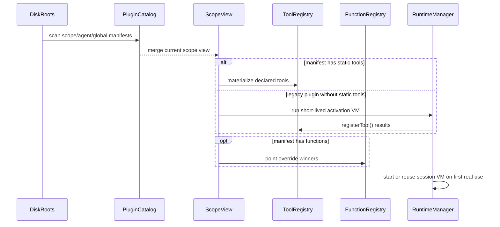

# 插件发现、作用域与加载

本文为 [Architecture](../../openspec/specs/Architecture.md) 中「4. 插件系统（统一入口）」的专题页，补充 [`../plugin-system-overview.md`](../plugin-system-overview.md) 的磁盘发现、scope 视图、激活时机与 layered registry 规则。

## 这份文档回答什么

- 插件从哪里被发现
- `scope / agent / global` 三层根怎么组合成“当前可见集”
- `install`、catalog、registry、session VM 分别在什么阶段出现
- 为什么安装成功不等于插件代码已经运行
- 为什么 `tools[]` 与 `functions[]` 虽然都静态可见，却不应该混成一张表

## 文首导读：先别把三件事混在一起

这份文档最容易读混的地方有三个：

1. **发现 / 编目**：系统只是“知道有这个插件”，还没运行它。
2. **scope 视图物化**：系统把当前项目能看见的插件能力整理出来，决定谁进入 `ToolRegistry`、谁进入 `FunctionRegistry`。
3. **运行时激活**：某个 `(session_id, plugin_id)` 的活体 VM 真正启动，并开始执行 JS。

> 说人话：先建目录，再摆上说明书，最后真的开机放片。安装、可见、运行是三件不同的事。

## A.0 从磁盘到共享注册面的时序图



## 三层根与优先级

当前发现与安装都遵循同一套三层模型：

| 可见层 | 目录根 | 用途 | 说人话 |
|------|--------|------|--------|
| `scope` | `<scope_root>/.tomcat/plugins/` | 当前项目私有插件，优先级最高 | 这个项目自己带的插件，应该最能覆盖本地需要。 |
| `agent` | `~/.tomcat/agents/<agentId>/plugins/` | 当前 agent 私有插件 | 只服务这个 agent，不影响别的 agent。 |
| `global` | `~/.tomcat/plugins/` | 全局兜底插件 | 装一份，大家都能看见，但优先级最低。 |

覆盖规则：

- **同名插件**：高层覆盖低层。
- **宿主函数 provider**：进入 `FunctionRegistry` 前按 `point` 做高层优先收口。
- **安装账本**：每层分别维护自己的 `plugins/registry.json` 与 `packages/registry.json`。

## 三个加载点

### 1. 发现 / 编目

这个阶段只做：

- 扫描三层根
- 读取 `plugin.json`
- 建立 `PluginCatalog` / layered registry / 诊断结果

这个阶段**不做**：

- 运行插件 JS
- 启动 session VM
- 热替换当前会话里已经跑起来的实例

### 2. 会话进入 / scope 首次激活

这个阶段负责把“当前 scope 看得见什么”物化出来：

- 解决同名 shadow / override
- 建立当前 scope 的 `plugins` 管理视图
- 把 manifest 中静态可见的 `tools[]` / `functions[]` 物化到当前 scope 的注册面

这里的关键点是：

- `tools[]` 面向 LLM，可进入 `ToolRegistry`
- `functions[]` 面向宿主，可进入 `FunctionRegistry`
- 两者都属于**能力可见性**，不等于“用户代码已经执行”

### 3. 首次真实使用

真正执行插件代码发生在运行态：

- 会话进入时需要预热的插件
- `session_start` 等生命周期事件触发的插件
- 首次 `tool_call`
- 宿主按扩展点调用 `functions[]`

这一步才会：

- `ensure/start_session_vm(session_id, plugin_id)`
- 命中复用已有 `(session_id, plugin_id)` 实例，或新建 `VmActor`
- 执行插件 JS，并把 JS 实现绑定到当前 VM

## 两条正交判断：`tools[]` 与 `activation`

不要给插件贴“它是工具型还是生命周期型”这种单一标签。当前更准确的判断方式是两条独立开关：

| 维度 | 决策 | 说人话 |
|------|------|--------|
| `tools[]` | 决定工具面是否能零跑码进入 `ToolRegistry` | 这是“LLM 先能不能看见它”的开关。 |
| `activation` | 决定是否要在会话进入时预启动长生命周期 VM | 这是“这个插件是不是必须提前在场”的开关。 |
| `functions[]` | 决定宿主面是否静态可见 | 这是“系统内部能不能按扩展点找到它”的开关。 |

于是会形成 4 种主要组合：

1. **有静态 `tools[]` + `activation=lazy`**：工具面零跑码可见；首次真实使用时再起长 VM。
2. **有静态 `tools[]` + `activation=session`**：工具面零跑码可见；会话进入时直接预启动长 VM。
3. **无静态 `tools[]` + `activation=lazy`**：需要在 scope 首次激活时跑一次短命校验 VM，补登记工具。
4. **无静态 `tools[]` + `activation=session`**：会话进入时预启动长 VM，并由它顺带完成工具登记。

> 说人话：`tools[]` 回答“先不跑代码能不能看见能力”，`activation` 回答“要不要提前让活体 VM 在场”。两件事不能混写成一个枚举。

## install 与 runtime 的关系

`tomcat install` / `/install` 的职责是**安装管理**，不是**运行时加载**。

安装时会发生：

- 写插件正文到目标层目录
- 更新该层 `plugins/registry.json`
- 更新该层 `packages/registry.json`
- 刷新当前进程的 catalog / 可见集

安装时不会发生：

- 调用 `load_plugin()`
- 启动 session VM
- 热替换当前会话里已经运行的插件实例

这个边界是当前文档和 [`../package-manager.md`](../package-manager.md) 的共同约束。

## 四张表分层：别把它们当一张

```text
磁盘 plugin.json
   │
   ▼
PluginCatalog
   │
   ▼
当前 scope 可见视图
   │
   ├─ ToolRegistry       （给 LLM）
   ├─ FunctionRegistry   （给宿主）
   └─ plugins 管理态
   │
   ▼
Running instance
   └─ (session_id, plugin_id) -> VmActor / PluginVmInstance
```

它们分别回答的是四种不同问题：

| 层 | 回答什么问题 | 说人话 |
|----|--------------|--------|
| `PluginCatalog` | 系统“知道有哪些插件” | 这是片单底座。 |
| scope 可见视图 | 当前项目 / agent “看得见哪些插件能力” | 这是当前项目真正能选的片。 |
| `ToolRegistry` / `FunctionRegistry` | 当前 scope 下分别给 LLM 和宿主暴露了什么能力 | 一个给模型看，一个给系统自己看。 |
| Running instance | 当前会话里“哪些插件代码真的跑起来了” | 这才是已经开机放映的活体。 |

## 关键决策速查

| 主题 | 决策 | 说人话 |
|------|------|--------|
| 发现路径 | **通用插件发现层复用 `scope > agent > global` 三层磁盘根** | 和 skill / package 的三层安装语义对齐，别再单独造第四套路径规则。 |
| 工具面来源 | **优先使用 manifest 静态 `tools[]`；legacy `registerTool` 只作兼容** | 不要为了“看一眼有哪些工具”就把所有插件代码拉起来跑。 |
| 函数面来源 | **manifest `functions[]` 静态可见，进入 `FunctionRegistry` 前按 `point` 选赢家** | 给宿主用的扩展点也走三层发现，但同一点位不应该把多层 provider 全都暴露出来。 |
| install vs run | **安装只改磁盘与账本，不自动起 VM** | 安装成功不等于插件代码已经执行。 |
| 活体实例 | **运行期按 `(session_id, plugin_id)` 隔离** | 当前项目共享“看见什么”，具体会话隔离“谁真的在跑”。 |

## 为什么这样分层

这么拆的核心收益是：

1. 安装、发现、可见性、执行时机互不混淆。
2. 多层覆盖规则统一，`install` 与 `chat` 看到的是同一套层级语义。
3. LLM 工具面与宿主函数面都能做静态可见性收口，不必把“看见能力”误解成“已经起 VM”。
4. 多 session 并发时，只在真正需要时创建 `(session_id, plugin_id)` 运行实例。

## 与其他文档的关系

- 总入口与全局结论：[`../plugin-system-overview.md`](../plugin-system-overview.md)
- 安装命令、账本与三层路径：[`../package-manager.md`](../package-manager.md)
- JS bridge / host API 边界：[`js-bridge-and-host-api.md`](./js-bridge-and-host-api.md)
- Hostcall / manifest / `tools[]` / `functions[]`：[`host-call-protocol.md`](./host-call-protocol.md)
- 运行时物化与 `VmActor` 生命周期：[`runtime-and-sandbox.md`](./runtime-and-sandbox.md)
