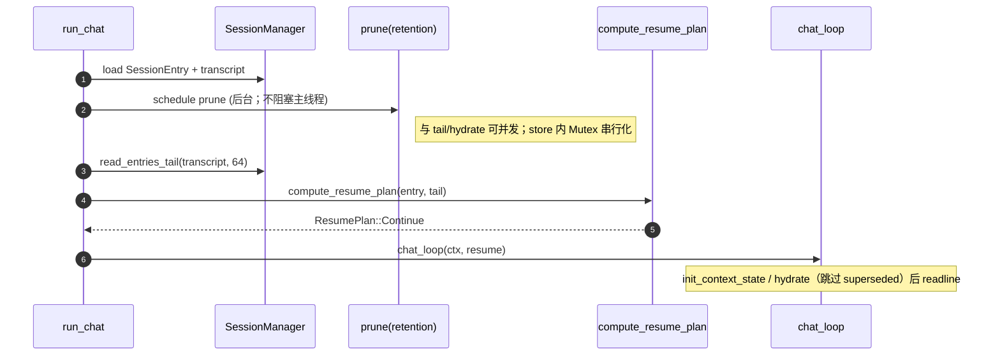

# `checkpoint-resume`：Checkpoint 快照、回滚命令与断点续跑

本文档是 **T2-P1-001 | checkpoint-resume** 的冻结版技术方案（OpenSpec **B 类**：`docs/architecture/tools/`）。落地依赖 **T2-P0-007**「中断/恢复 + transcript 完整性」（见 [`interrupt-and-cancellation.md`](../interrupt-and-cancellation.md) **§14.1**「T-007 最小版 vs 完整版」），并被 **T2-P1-002**「PLAN 模式增强」消费（提供 `CheckpointStore`，见 [README §4](../../../agents/TASK_BOARD_002/README.md)）。**实现以仓库代码为准**；本节只保留**已定稿的契约与行为**。

> 章节顺序对齐 [`ARCHITECTURE_SPEC.md`](../../../openspec/specs/guides/workflow/ARCHITECTURE_SPEC.md) **§1→§13** 骨架（术语 → 竞品调研 → 目标 → 已定稿选型与实施 → 协议 → One-Glance → …）。本方案承接调研报告 [`plan-mode-and-checkpoint-survey.md`](../reports/plan-mode-and-checkpoint-survey.md)（**§3 / §4 / §8**）的「**Plan 与 Checkpoint 模块边界清晰、按里程碑分阶段交付**」结论。

**说人话**：本文按架构规范把「词怎么叫、别人怎么做的、我们定啥、协议长啥样、文件谁管谁、咋测、有啥坑」一次写全；Plan 面板与 `todo` / `/plan` / `/goal` 的上层编排另见 [`plan-runtime.md`](../plan-runtime.md)，不在这里糊成一团。

---

## 目录

- [1. 术语统一](#1-术语统一)
- [2. 竞品 / 选型对比（调研）](#2-竞品--选型对比调研)
  - [2.1 Agent 端 checkpoint 的典型关切](#21-agent-端-checkpoint-的典型关切)
  - [2.2 常见实现横向对比](#22-常见实现横向对比)
  - [2.2.1 维度词典（C1–C6、C9–C12）](#221-维度词典c1c6c9c12)
  - [2.2.2 Chat 入口 git 预检与后台安装（拟定）](#222-chat-入口-git-预检与后台安装拟定)
  - [2.2.3 演进 TODO：IDE 产品形态（窄快照 / 时间线）](#223-演进-todoide-产品形态窄快照--时间线)
- [3. 目标与设计原则](#3-目标与设计原则)
  - [3.0 断点续跑、错位与启动策略（拍板）](#30-断点续跑错位与启动策略拍板)
  - [3.1 观察指标表（与 §11 验收一一对应）](#31-观察指标表与-11-验收一一对应)
  - [3.2 非目标](#32-非目标)
- [4. 落地选型与实施（已定稿）](#4-落地选型与实施已定稿)
  - [4.1 落地选型决策表（维度取舍）](#41-落地选型决策表维度取舍)
  - [4.2 实施点（按 PR 拆分）](#42-实施点按-pr-拆分)
  - [4.2.1 PR-CKA：CheckpointStore + 影子 Git 后端](#421-pr-ckacheckpointstore--影子-git-后端)
  - [4.2.2 PR-CKB：写入时机与钩子（TurnEnd / Interrupt）](#422-pr-ckb写入时机与钩子turnend--interrupt)
  - [4.2.3 PR-CKC：`/restore` 命令面（仅 chat 斜杠）](#423-pr-ckcrestore-命令面仅-chat-斜杠)
  - [4.2.4 PR-CKD：断点续跑（transcript hydrate；启动恒 Continue）](#424-pr-ckd断点续跑transcript-hydrate启动恒-continue)
  - [4.2.5 PR-CKE：文档与门禁](#425-pr-cke文档与门禁)
  - [4.2.6 PR-CKF：git 预检与后台安装（拟定）](#426-pr-ckfgit-预检与后台安装拟定)
- [5. 协议（接口 / 命令 / Schema）](#5-协议接口--命令--schema)
  - [5.0 FAQ（易混点）](#50-faq易混点)
- [6. One-Glance Map（文件职责总览）](#6-one-glance-map文件职责总览)
- [7. 调度时序](#7-调度时序)
- [8. 状态机](#8-状态机)
- [9. 配置与环境变量（极简）](#9-配置与环境变量极简)
- [10. 错误模型 / 截断 / 警告](#10-错误模型--截断--警告)
- [11. 测试矩阵（验收）](#11-测试矩阵验收)
- [12. 风险与应对](#12-风险与应对)
- [13. 历史决策（已被本方案取代）](#13-历史决策已被本方案取代)
- [14. 关联文档](#14-关联文档)

---

## 1. 术语统一

> 调研材料把市面上四种"checkpoint"语义并置成 A/B/C/D（见 [`plan-mode-and-checkpoint-survey.md §1`](../reports/plan-mode-and-checkpoint-survey.md)）。**本方案明确只承担 A 与 D 的子集**——**工作区快照 + 会话恢复点**——B（compaction 摘要）与 C（工作记忆）由其它模块负责，**禁止混名**。**本版已从规格中移除 `ToolPre`、Compaction 类 checkpoint 与 `ToolPost`**：自动写入仅 **`TurnEnd`**（回合 **Completed** 且持久化后）与 **`Interrupt`**（partial 落盘后）；用户 **`/restore`** 还原磁盘（hermes 同形 **`git checkout <commit> -- <path>`**）。**Resume**：启动策略 **恒 `Continue`**（无 `Fresh` / `RewindTo`）；**不**在开机自动对齐 transcript 与工作区；错位由后续对话与 **显式** `/restore` 处理。

**「整工作区影子 Git」**（四字短语）：**整工作区** = 快照对象是 `agent_workspace_dir` 下**整棵目录树**（一次提交通常 `git add -A` 钉住当时整树状态）；**影子 Git** = 对象库与历史在 **`GIT_DIR`（用户项目外）**，工作树仍用 **`GIT_WORK_TREE`（即上述工作区根）**。与「只备份本轮改过的若干文件」（如 [§2.2](#22-常见实现横向对比) Cursor `modified files`）相对。下表拆成两行：**影子 Git 仓库**（机制）与 **整工作区影子 Git**（粒度）。

| 术语 | 语义（人话） | 数据载体 | 行为约束 | 说人话 |
|------|--------------|----------|----------|--------|
| **Checkpoint（本方案）** | 一次"已可回到的状态点"：把会话指针 + 工作区文件树 + 关键运行态 一起钉在一个不可变的 `CheckpointId` 上 | `CheckpointStore` 中的一行元数据 + 影子 Git 仓库的一次 commit | 只追加；不可原地改写；删除走 prune | 一次「能回去」的快照点。 |
| **CheckpointId** | 短码 + 会话作用域唯一 ID | `ck_<unix_ms>_<6 hex>`（display 端可截短到前 8 位，类似 `git rev-parse --short`） | 仅在所属 session 范围内有效；跨 session 引用直接拒绝 | 选哪个点用短 ID。 |
| **CheckpointKind** | 一次 checkpoint 是被谁触发的 | `enum { TurnEnd, Interrupt, Manual, Milestone }`（**无** `ToolPre` / **无** `ToolPost` / **无** Compaction 类 kind） | `kind` 决定 **`/restore` 是否打 `superseded`**（仅 **TurnEnd / Interrupt**，见 §5.4）及 **TurnEnd 专属 pre-rollback**（见 §4.2.3） | 标记「为啥这时候拍」。 |
| **CheckpointStore** | 提供读 / 写 / 列举 / 回滚 / GC 五件事的存储抽象 | `Arc<dyn CheckpointStore>` 注入 `AgentLoopConfig`；默认实现 `ShadowGitStore`；无 `git` 时 **`NoopStore`**（无配置开关，见 §9） | 写入幂等；**同 `(session_id, turn_id, kind)` 整轮去重**（与 hermes 同形：每会话每 turn 每 kind 至多一次 commit）；同元组重入直接返回首发 id（**无**独立时间窗配置） | 存快照、列清单、回滚、清垃圾都走它；同一轮内同一类只拍一次。 |
| **影子 Git 仓库** | 一套 **Git 对象库 + 提交历史** 放在用户项目**外面**；**工作树**仍指向当前 `agent_workspace_dir`（Agent 实际改文件的那棵目录树） | `GIT_DIR` = `~/.tomcat/agents/<id>/checkpoints/<sha256(workdir)[:16]>/`（或等价路径）；`GIT_WORK_TREE` = `agent_workspace_dir` | 通过环境变量把 `GIT_DIR` 与 `GIT_WORK_TREE` 拆开；**不在**用户仓库根创建第二份 `.git` | 真 `.git` 藏用户目录外，树还是你那棵工作区。 |
| **整工作区影子 Git** | **「整工作区」** = 快照粒度：一次 checkpoint 对应 **整棵 `GIT_WORK_TREE` 目录树** 在当时的可还原状态（通常通过 `git add -A` + `commit` 把树下**当前可见**的文件内容钉进影子仓库），而不是只备份「本轮模型点名的几个文件」或 IDE 里枚举的 `modified files` 子集 | 与上格同一套 `GIT_DIR` / `GIT_WORK_TREE`；每个 `CheckpointId` 在影子仓库里对应（或映射到）**一个 tree/commit** | **`/restore`**：无 `--path` ⇒ `git checkout <commit> -- .`；有 `--path` ⇒ `git checkout <commit> -- <path>`（hermes 同形，**其它路径保持磁盘现状**）；大仓库跳过策略见 [§12](#12-风险与应对) | 底层仍是整树 commit；还原时可只 checkout 部分路径。 |
| **transcript 续跑锚点** | 进程重启后用于「列表 / 显式 restore」的索引点 | `SessionEntry.last_checkpoint_id`（新增字段）+ transcript 尾 `Message` id | **写入时机仅一处**：**`/restore` 成功** **且目标 ckpt `kind ∈ {TurnEnd, Interrupt}`** 时，将 `last_checkpoint_id` 指向目标 `ck_id`（与「打 `superseded` 的 restore」同口径，见 §5.4）；其余 kind（Manual / Milestone）restore 与普通 `record(...)` **均不**更新该字段。**不参与启动决策**（启动恒 `Continue`）。缺失 ⇒ `/ckpt list` / `/restore` 仍可列出全部 ckpt | 会话元数据里只记「上次整轮/中断级 restore 到了哪条」。 |
| **Resume Plan（启动）** | 启动期占位推算（**本版无分支**） | **`Continue` 单态**（实现可为 `()`、`const Continue`、或 `compute_resume_plan` 恒返回同一值） | **不**根据 tail / `last_checkpoint_id` / 盘状态分支到 `Fresh` / `RewindTo`；可选读 tail 仅用于 **日志 / 遥测** | 开机策略上 **永远接着 hydrate**；错位不在启动决策里修。 |
| **「单次 user turn 结束」** | 指 `chat_loop` 在 **`AgentRunOutcome::Completed`** 路径完成 `append_message` + `persist_context_observability` 之后、`readline` 下一轮之前 | — | **`TurnEnd`** checkpoint 写入时序约束在此边界（**`Interrupted` 是否也记 TurnEnd** 由实现 PR 定稿） | 一轮对话在磁盘与 transcript 上收口后再拍「整轮锚点」。 |
| **「中断时」** | 指 [`interrupt-and-cancellation.md §6.1`](../interrupt-and-cancellation.md) Soft Interrupt 时序图第 11 步 `append_message(partial_messages)` 完成、`renderer.flush()` 之后、回到 `u>` 提示符之前 | — | 这是 `Interrupt` kind 唯一允许的写入点；**不**在 Hard Interrupt（exit 130）路径上写入 | partial 已安全写进 JSONL 再拍中断点。 |
| **运行中关终端 / 关 CLI** | 本轮 **`AgentLoop::run` 尚未返回** 时，stdin 挂断、SIGHUP、用户关窗口等 | — | **等价** `cancel_token.cancel()`，收口 **`Interrupted`** 与 T-004/T-017 同路径 partial 落盘后再退出；**阻塞在 `readline` 时空闲 Ctrl+D** 是否仍「再见即走」与上条分离，见 [§5.0](#50-faq易混点) | 生成跑一半关窗，当作软中断，别静默丢尾。 |

**影子 Git 仓库 — 原理（说人话）**

1. **平常 Git**：项目根下有个 `.git`，「工作区」就是旁边那棵树；提交历史跟这棵树绑在一起。  
2. **影子 Git**：把这两件事**拆开**——**对象库 + 提交历史**放到 `GIT_DIR`（Tomcat 放在 `~/.tomcat/.../checkpoints/...` 里）；**你真正改文件的那棵树**仍用 `GIT_WORK_TREE` 指向 `agent_workspace_dir`。对 Git 来说这就是「工作树在 A、仓库在 B」，合法且常见。  
3. **拍快照**：在 B 里执行 `git add`（通常 `-A`）+ `commit`，把 A 里当时那版文件内容**存进 B 的 commit 链**；**不动**你项目自己根目录下的 `.git`（若有），也不强迫你把 checkpoint 混进主仓库历史。  
4. **回滚**：用「某个 commit 当时那棵树」去 **checkout 覆盖** `GIT_WORK_TREE` 里的文件（典型 `git checkout <commit> -- .`）；等于从历史里捡一版盖回工作区，但历史躺在「影子」仓里。  
5. **为啥叫影子**：你日常 `git status` 看的是主仓库；这套仓**躲在别处**，专门给 Agent 回滚用，像影子跟着你走。

---

## 2. 竞品 / 选型对比（调研）

> 调研报告 [`plan-mode-and-checkpoint-survey.md`](../reports/plan-mode-and-checkpoint-survey.md) **§3** 把市面上的 checkpoint 实现归成 A/B/C/D；本节是承上启下的**调研材料**。**已定稿的维度取舍（§4.1）与代码落点（§4.2）**见 **[§4](#4-落地选型与实施已定稿)**，此处不再重复堆叠最终结论。

### 2.1 Agent 端 checkpoint 的典型关切

```text
┌─────────────────────────────────────────────────────────────────────────────┐
│  本地 agent 要做 "可回滚 + 断点续跑" 至少同时回答四个问题                       │
├──────────────────────┬──────────────────────────────────────────────────────┤
│  快照粒度            │  整工作区树 vs. 单文件 vs. 仅指针                       │
│  写入时机            │  turn 结束（TurnEnd）？中断（Interrupt）？（**无** ToolPre）        │
│  与对话状态的耦合    │  是否要把 transcript / context_state 一起钉死           │
│  恢复路径            │  --resume 自动 vs. 显式 rollback；崩溃后的探活策略      │
└──────────────────────┴──────────────────────────────────────────────────────┘
```

**说人话**：上面四格就是「拍多大」「啥时候拍」「跟对话怎么对齐」「崩了/断了怎么接」。本方案用影子 Git 管磁盘、用 **TurnEnd + Interrupt** 自动拍照、用 **`/restore`（可 `--path`）** 改盘、用 `last_checkpoint_id` 拴会话；**启动不做 `Fresh`/`RewindTo` 分支**，hydrate 时跳过 `superseded`。

本方案分别用 **影子 Git 仓库（机制）**、**写入策略钩子（时机）**、**`SessionEntry.last_checkpoint_id`（耦合）**、**恒 `Continue` 的启动路径（恢复）** 收口。

### 2.2 常见实现横向对比

| 来源 / 形态 | 快照粒度 | 写入时机 | 恢复 / 回滚 | LLM 可见性 | 备注（取自） | 说人话 |
|-------------|----------|----------|-------------|------------|--------------|--------|
| **hermes-agent** | **整工作区**（影子 Git，`GIT_DIR + GIT_WORK_TREE`） | `write_file` / `patch` / 破坏性 bash 之前（≈ ToolPre；**Tomcat 不采用**） | 列表 + **`git checkout <hash> -- <path>`** + diff；restore 前 **整树** pre-rollback | **不可见** | `hermes-agent/tools/checkpoint_manager.py:117-622` | 路径级 restore + 影子 Git 范本。 |
| **Cursor IDE（产品形态）** | 「**Agent 本轮修改的文件集合**」快照（`modified files`，非整树） | **Agent 即将做重大修改之前**自动生成（≈ 仅 ToolPre 一档；用户手动编辑**不**捕获） | **聊天时间线**点击 / 消息悬停 `+` / `Restore Checkpoint` 按钮：先**预览**再整体还原；**对话历史保留** | **不可见**（产品 UI 而非工具） | [Cursor Docs · Agent → Checkpoints](https://cursor.com/docs/agent/chat/checkpoints)；本仓 [`cursor-builtin-tools-reference.md §8.1`](../reports/cursor-builtin-tools-reference.md) | 产品级范本：UI 时间线 + 预览 + 仅 Agent 改动；与 hermes 一起证明「整体还原 + 保留对话」是稳态。 |
| **pi-mono（示例扩展）** | `git stash create` 引用，按 `entryId` 索引 | `turn_start` 事件 | `session_before_fork` 钩子提示 `git stash apply` | 不可见 | `pi-mono/packages/coding-agent/examples/extensions/git-checkpoint.ts:19-52` | 思路可参考，不能当生产默认。 |
| **pi_agent_rust** | **会话存储文件本身**（不是工作区） | `appends_since_checkpoint >= compaction_checkpoint_interval` 时强制全量重写 | 没有用户态回滚；目的是抗碎片化 / 防部分写崩溃 | 不可见 | `pi_agent_rust/src/session.rs:601-2083`、`9654-10214` | 这是「存盘 checkpoint」，不是「回代码」。 |
| **codex（rollout-trace）** | 会话压缩诊断节点 | inference / compaction 阶段 | 无回滚——只做可观测重放 | 不可见 | `codex/codex-rs/rollout-trace/`（trace 节点） | 排障用，别当用户回滚。 |
| **GenericAgent** | **工作锚点字符串**（`working['key_info']`） | `do_update_working_checkpoint` 由 SOP 触发 | 无文件级回滚；下一 turn `<key_info>` 注入 | **可见**（注入提示） | `GenericAgent/ga.py`（`enter_plan_mode` / `do_update_working_checkpoint`） | 给模型看的锚点，不是磁盘快照。 |
| **cc-fork-01** | 不存在工作区快照；只有 plan **权限模式** | `EnterPlanMode` / `ExitPlanMode` 工具 | 无 | 可见（工具） | `cc-fork-01/src/tools/EnterPlanModeTool/EnterPlanModeTool.ts` | Plan 管权限，不管「改坏了怎么撤」。 |
| **openclaw** | 只有 `update_plan` 进度表 | 工具调用 | 无 | 可见 | `openclaw/src/agents/tools/update-plan-tool.ts` | 进度条，不是回滚。 |
| **本方案（Tomcat）** | **整工作区**（影子 Git） + **会话指针**（transcript 末尾 id） | **TurnEnd** + **Interrupt**（+ Manual / Milestone API）；**无 ToolPre** | **`/ckpt` + `/restore [--path …]`**；**TurnEnd** restore 前 **pre-rollback**（整树）；**superseded** 仅 **TurnEnd / Interrupt** 目标 | **不可见** | 见 §4.2 | 少钩子 + 路径 restore + 条件性对话作废。 |

**为什么不用别的：**

1. **不要 pi-mono 的"git stash 单文件"路径**：示例扩展，缺并发 / 跨进程 / GC，无法承载 PR 看板里"被 PlanRuntime 消费"的契约。
2. **不要 pi_agent_rust 的"会话文件 checkpoint"语义**：那是抗存储碎片化，与"任务回滚"完全是两件事；混名会污染本方案的 `kind`。
3. **不要 GenericAgent 的"工作记忆 checkpoint"**：本方案只钉**磁盘可观察状态**；模型工作记忆继续靠 prompt 与上下文管理（compaction 仍可能存在，但 **不**产生本方案的 `CheckpointKind`）。
4. **不重新发明分布式 KV 索引**：`SessionEntry.last_checkpoint_id` 单字段足够 MVP；hermes 的 `~/.hermes/checkpoints/` 单进程 Mutex 一致性也是这么做的。
5. **不抄 Cursor 的「modified files 集合」粒度作为底层快照单位**：Cursor 是 IDE 产品形态，可借助编辑器内 file system watcher 精准识别「Agent 本轮动过哪些文件」；CLI / 跨 shell 命令场景下 **bash 工具的副作用** 难以静态枚举（典型如 `make` / `pnpm install` 改 `node_modules`），整工作区快照是更稳的下界。**借鉴 Cursor 的两点**——「**预览** + 整体还原 + 保留对话」与「**模型不可见**」——已经吸收进 §5.3 `--dry-run` 与 §3 「基础设施隐式」原则。
6. **阶段 1 只做 Git 整树方案**：默认 `ShadowGitStore`；无 `git` 时 `NoopStore`，不挡聊天。**IDE 形态（modified-files + 时间线）**见 [§2.2.3](#223-演进-todoide-产品形态窄快照--时间线)—— roadmap，与本期实现解耦。
7. **Chat 入口 git 预检（拟定）**：进入 `tomcat chat` 时探测 `git`，缺失则**后台 detached 安装**（与 rg/fd 预检同构），**不阻塞** `readline` 主循环；**GC 同向**：**启动期默认触发 `prune(retention)`**，**后台执行、不阻塞主线程**（与 readline / hydrate 可并发；见 §9 / G7）。详见 [§2.2.2](#222-chat-入口-git-预检与后台安装拟定)。

### 2.2.1 维度词典（C1–C6、C9–C12）

> **已定稿代码落点与交付**以 **[§4.2](#42-实施点按-pr-拆分)** 实施表为准；**§4.1** 只写维度取舍与拒因。**本版不展开 C7「多进程同工作区」与 C8「终端副作用」为必选架构行**：前者列为 **已知限制 / 非本期目标**（单进程假设）；后者保留在 [§3.2 非目标](#32-非目标) 与 [§12](#12-风险与应对)。

| 维度 | 关切 | 说人话 |
|------|------|--------|
| C1 快照粒度 | 整工作区 vs 仅 `modified files`（**Cursor 走法**）vs 单文件 vs 仅指针 | 选**整工作区影子 Git**，省得每次手动列要钉哪些文件；CLI 场景下 bash 副作用难以像 IDE 那样精准 watch。**演进**：IDE 窄快照见 [§2.2.3](#223-演进-todoide-产品形态窄快照--时间线)。 |
| C2 写入时机 | turn 结束 / 中断 / 手动 | **TurnEnd** + **Interrupt** + Manual / Milestone；**无 ToolPre**、**无 ToolPost**、**无** Compaction 类钩子。 |
| C3 与 transcript 耦合 | 是否把 `MessageId` 钉到 ckpt | 钉；与 Cursor「**对话历史保留**」一致；**启动不**用 `ResumePlan` 分支推销回滚（恒 `Continue`）。 |
| C4 LLM 可见性 | 工具列表里露不露 | **不露**；checkpoint 是基础设施，不增加模型上下文（与 hermes / Cursor 同向）。 |
| C5 restore 指令面 | chat 斜杠 vs TUI | **`/ckpt list|show|diff`** + **`/restore <ck> [--path …] [--dry-run]`**；**无** `/ckpt prune`；**不**增加 `tomcat session …` ckpt/restore CLI。 |
| C6 GC 与磁盘 | 长会话堆积 | **仅** `tomcat chat` **启动期**按 `retention_max` / `retention_days` **默认调度一次** `prune`（**后台执行、不阻塞主线程 / readline**）+ orphan workdir 清理；与 Cursor「短期、易逝、自动清理」同向。 |
| C9 wasm / 无 git | 工具链缺位时的兜底 | 启动探测 + `NoopStore` + **拟定** `start_git_preflight`；transcript 续跑不依赖 git。 |
| C10 Resume 推算位置 | 启动期 vs 第一条 user 输入时 | **`readline` 之前**：可选 `read_tail` + **`compute_resume_plan`（恒 `Continue`，可无操作）** + **`init_context_state` / hydrate（跳过 `superseded`）**；**`prune` 与上述并行启动、不占主线程**（见 [§4.2.4](#424-pr-ckd断点续跑transcript-hydrate启动恒-continue) / G7）。 |
| C11 预览 / 试运行 | 「先看再回」 | `/restore <id> --dry-run` + `/ckpt diff <id>`；与 Cursor 预览同向。 |
| C12 终端副作用 | DB / `pnpm install` 等 | 与 [§3.2](#32-非目标) / [§12](#12-风险与应对) 同口径：rollback **仅**文件树。 |

**rg 线 checklist（与 `search_files` §7 对称，PR-CKF 验收用）**

| 检查项 | 要求 |
|--------|------|
| 线程模型 | 与 `start_search_tools_preflight` 同构：`std::thread` 探测 + Unix detached 安装，**不**在 `readline` 热路径 `wait` 包管理器。 |
| 启动 GC | **`CheckpointStore::prune(retention)`** **默认在启动时调度一次**（**后台线程 / 不阻塞**主线程与 `readline`）；**无**斜杠 `/ckpt prune` 等其它入口（见 §9 / G7）。 |
| 事件负载 | `WIRE_GIT_PREFLIGHT` 字段集**完整镜像** `WIRE_SEARCH_TOOLS_PREFLIGHT`：`ready` / `start` / `progress` / `success` / `failed` / `detached` / `already_installing`（与 [`search_files.md` §7 / §8](./search_files.md#7-启动预检tomcat-chat) 一一对齐；Unix detached 路径主要发 `start` / `detached` / `already_installing` / `failed`，Windows 阻塞路径走 `start` / `progress` / `success` / `failed` —— **状态字符串集合两边统一**，便于 stderr 渲染共用代码路径）。 |
| stderr | [`events/stderr.rs`](../../../src/api/chat/events/stderr.rs) 注册方式与 rg 预检 **同一套**灰字 + `tail -f` 提示文案结构。 |
| 配置 | checkpoint 对外**仅** `[checkpoint] retention_*`（§9）；git 后台安装**仅** `[preflight] auto_install_git`（**无**独立 `PI_SKIP_*` env；关安装 = `auto_install_git=false`）。 |
| 文档交叉 | 本方案 §2.2.2 与 [`search_files.md` §7](./search_files.md#7-启动预检tomcat-chat) 互相引用，避免两处漂移。 |

### 2.2.2 Chat 入口 git 预检与后台安装（拟定）

> **状态**：行为与键名以落地 PR 为准；本节把**意图**钉死：**与现有 `search_files` Tier1 预检同构**（[`search_files.md` §7](./search_files.md#7-启动预检tomcat-chat) · [`src/api/chat/preflight.rs`](../../../src/api/chat/preflight.rs) · `chat_loop` 内 [`start_search_tools_preflight`](../../../src/api/chat/mod.rs) 旁路启动）。

**说人话**：一进 chat 先看有没有 `git`；没有就**后台悄悄装**，**不卡**你打字聊天；装完再慢慢从「空拍照」切到「真 git 拍照」。

| 点 | 说明 |
|----|------|
| **入口** | `tomcat chat`：`chat_loop` 在注册 stderr 监听后，与 `preflight::start_search_tools_preflight(cfg, bus)` **并列**再调 `preflight::start_git_preflight(cfg, bus)`（**拟定符号名**；亦可合并为单一 `start_chat_preflight` 分发两类任务）。**硬约束**：`readline` **永不**等待包管理器结束；**`prune(retention)` 亦不得阻塞主线程**（默认启动即 **spawn** 后台执行，见 §4.2.4 / §9）。 |
| **探测** | `find_binary(&["git"])` 或等价 `git --version`；即时读 `PATH`（与 rg 预检一致）。 |
| **安装（Unix）** | 复用 `preflight.rs` 已验证路径：`spawn_unix_detached_install` + `nohup … >> ~/.tomcat/agents/main/logs/preflight-git-log-<ts>.log 2>&1 &`，经 `/bin/sh -c` **`spawn`**；**不** `wait` brew/apt。 |
| **平台矩阵（拟定）** | 与 rg 分支同形：`brew install git`（macOS + `HOMEBREW_NO_BUILD_FROM_SOURCE=1` 前缀）、`apt-get install -y git` / `dnf` / `pacman`、`pkg install -y git`（Termux）；**Android 非 Termux** → 不自动装，仅事件 `failed`。**Windows v1**：与 rg 一致可仍为阻塞 `winget` 或单独 TODO（[`preflight.rs:419`](../../../src/api/chat/preflight.rs) 已有 Windows detached 注释）。 |
| **并发** | Homebrew 等：复用「进程表窄匹配 / `already_installing`」思路，避免叠两套 nohup（与 rg 预检 §7 一致）。 |
| **运行期行为** | 探测失败或安装未完成：`CheckpointStore` 仍为 **`NoopStore`**（与现行 §4.2.1 一致）。`git` 首次可用后 **惰性切换** 为 `ShadowGitStore`（**拟定**：`RwLock` 持 store、`record` 前 `try_upgrade`、或 `ArcSwap` 原子替换；PR 定稿）。**禁止**：在 `git` 未就绪时阻塞 tool 执行去等安装。 |
| **事件 / stderr** | **拟定** `WIRE_GIT_PREFLIGHT`（**完整镜像** `WIRE_SEARCH_TOOLS_PREFLIGHT`：`ready` / `start` / `progress` / `success` / `failed` / `detached` / `already_installing`；Unix detached 路径主要走 `start` / `detached` / `already_installing` / `failed`，Windows 阻塞路径走 `start` / `progress` / `success` / `failed`）；[`events/stderr.rs`](../../../src/api/chat/events/stderr.rs) 对称挂监听，灰字 + `tail -f` 提示。 |
| **安装开关** | **仅** `[preflight] auto_install_git`（bool；默认以落地 PR 为准）。`false` 时不 spawn 后台安装（仍可探测 `git --version`）；CI / 沙箱无 sudo 时置 `false` 即可，**无**单独 env 跳过开关。 |

### 2.2.3 演进 TODO：IDE 产品形态（窄快照 / 时间线）

**动机**：未来 Tomcat **IDE / 宿主**具备 FS watcher 或工具层「本轮 modified files」可靠列表时，可采用 **Cursor 粒度** 的快照实现，降低大仓 `git add -A` 成本。

**TODO（不进本期 PR-CKA–E 交付范围）**：

1. **`CheckpointStore` 第二实现**：例如 `ScopedGitStore` / `WatchedPathsStore`，仅 `git add` Agent 声明路径子集；与 `ShadowGitStore` **配置切换**（`[checkpoint] backend = "shadow_git" | "scoped_git"` **拟定**）。
2. **UI**：聊天 / 侧栏 **checkpoint 时间线 + 预览 + Restore**（与 [§3.2](#32-非目标)「TUI / Cursor 形态」对齐；依赖 T2-P0-008 或独立 IDE 里程碑）。
3. **CLI 与 IDE 并存**：CLI 默认整树；IDE 宿主注入 watcher 后自动或手动切窄后端。

**说人话**：先把 **Git 整树 + 影子仓库** 跑稳；等有 IDE 了再加「只拍改过的那几文件」和「点时间线回滚」。

---

## 3. 目标与设计原则

**一句话**：让 Tomcat 在**中断或回合结束**时有可还原的磁盘锚点（**`/restore`**，可 **按路径**）；并在重启 `tomcat chat` 时 **hydrate 已持久化 transcript** 接着聊——**启动策略恒 `Continue`**。

### 3.0 断点续跑、错位与启动策略（拍板）

**第一性原理**：崩溃后只有 **已 fsync 的 transcript 行**、**已完成的影子 git commit**、**磁盘上已落盘的文件字节** 各自可信；三者可能 **不一致**。本版 **不**在启动自动对齐；**交由后续对话与用户显式 `/restore` 处理**。

```text
  [运行时] AgentLoop 单轮
        │
        ├─► primitives 改磁盘 + transcript append（无 ToolPre ckpt）
        │
        ├─► Completed → record(TurnEnd)
        │
        └─► Soft Interrupt → partial 落盘 → record(Interrupt)

  [下次启动]
        │
        ├─► load sessions.json + transcript（磁盘）
        │
        ├─► spawn prune(retention)（**默认**；**后台**；**唯一** GC 入口；**不阻塞**主线程）
        │
        ├─► compute_resume_plan（可选）──► 恒 Continue（无 Fresh / RewindTo）
        │
        ├─► init_context_state / hydrate（**跳过 `superseded`**）
        │
        └─► readline；**不**自动改盘、**不**在开机推销回滚
```

**运行中关终端 / 关 CLI**：当 **`AgentLoop::run` 尚未返回** 时，挂断或关窗口 **等价** `cancel_token.cancel()`，走 **`Interrupted`** 与 T-004/T-017 同路径 partial 落盘（与 [§5.0](#50-faq易混点) 区分 **空闲 `readline` 时 Ctrl+D**）。

| 原则（可观察） | 说明 | 说人话 |
|----------------|------|--------|
| **基础设施隐式** | `CheckpointStore` 不进入 system prompt、不进入 catalog；LLM 不能 `read_checkpoint` / `rollback`，避免污染推理。 | 模型别碰快照，省 token 也少幻觉。 |
| **写入时机收敛** | 自动写入仅 **TurnEnd / Interrupt**；**Manual / Milestone** 为 API 预留；**无 ToolPre**；新增触发点必须改 enum。 | 少钩子；路径还原靠 `/restore --path`。 |
| **存储与会话分离** | 影子 Git 在 `~/.tomcat/agents/<id>/checkpoints/<sha16>/`，**不**写到用户的 `agent_workspace_dir/.git`。 | 用户仓库里不出现第二套 git。 |
| **transcript 是 source of truth** | **不删行**；**仅当** `/restore` 目标 ckpt 的 **`kind` 为 `TurnEnd` 或 `Interrupt`** 时，对锚点 **`message_anchor` 之后**打 **`superseded`**（见 [§5.4](#54-restore-语义transcript-与按路径还原)）。**Manual**（含 pre-rollback）、**Milestone** 或带 `--path` 的 restore **若目标 kind 非 TurnEnd/Interrupt** ⇒ **不打** `superseded`。hydrate **必须跳过** `superseded`。 | 整轮回撤才作废对话；单文件 restore 不动 transcript 游标。 |
| **崩溃可恢复** | `ShadowGitStore` 的提交是 git 原子操作；元数据写入走 `write_file_atomic`（见 [`session-storage.md`](../session-storage.md)）。 | 半路崩了也别把元数据写半截。 |
| **续跑无需用户介入** | `tomcat chat`（`--resume` 语义保持兼容）启动后 **恒** hydrate 已持久化上下文；**不**依赖 `RewindTo`/`Fresh` 分支；`last_checkpoint_id` 仅作列表/回滚锚点，**不**驱动开机策略。 | 能接着聊就静默接；**不**在开机弹「请回滚」。 |
| **wasm / 无 git 友好** | 探测 `git --version` 失败 ⇒ **`NoopStore`**（零 snapshot）+ 一次性 `warn`；transcript 续跑**不**依赖 Git。`[preflight] auto_install_git=false` 时不尝试后台安装（见 §9）。**拟定**：`auto_install_git=true` 时 `tomcat chat` 入口并行 **后台装 git**（[§2.2.2](#222-chat-入口-git-预检与后台安装拟定)），装成后惰性切 `ShadowGitStore`。 | 没 git 不挡聊；不想后台装包就关 `auto_install_git`。 |

### 3.1 观察指标表（与 §11 验收一一对应）

| 目标 | 观察指标（落地后可核对） | 说人话 |
|------|--------------------------|--------|
| G1 TurnEnd 钩子 | 每轮 `AgentLoop::run` **Completed** 且持久化完成后 `kind=TurnEnd` ckpt | 一轮聊完钉锚点；restore 前可 pre-rollback。 |
| G2 Interrupt 钩子 | Soft Interrupt 落 partial 之后 `kind=Interrupt` ckpt | 中断后能回到那一刻。 |
| G3 `/restore` + 按路径 | `ShadowGitStore::restore`：`--path` 空 ⇒ `checkout <commit> -- .`；有 `--path` ⇒ `checkout <commit> -- <path>`（hermes 同形）；路径校验防穿越 | 整树或单文件还原。 |
| G4 restore 与 transcript | `/restore` 成功；目标 **TurnEnd / Interrupt** ⇒ `superseded` + `Custom{checkpoint.restore}`；**其它 kind**（含 pre-rollback **Manual**）⇒ **仅改盘、不打 superseded**；TurnEnd restore 前 **pre-rollback**（整树 `Manual`） | 对话作废与磁盘还原解耦。 |
| G5 自动续跑 | 启动 **恒 `Continue`**；hydrate 跳过 `superseded`；partial 仍在（T-004/T-017） | 重开终端不丢上下文。 |
| G6 启动期幂等 | `compute_resume_plan` 恒 **Continue** | 重启策略不变。 |
| G7 GC | 启动期默认后台 `prune`（不阻塞 readline）；**无**其它 prune 入口 | 别撑爆磁盘。 |
| G8 wasm/无 git 降级 | `NoopStore` + 可选 `start_git_preflight` | 没 git 不挡聊。 |
| G9 运行中挂断 | `AgentLoop::run` 未返回时挂断/SIGHUP/关窗 ⇒ `cancel_token` → partial 落盘 → **`kind=Interrupt` ckpt**（§4.1 **C15**）；验收见 §11「集成（C15 / G9）」 | 关窗不当静默丢尾。 |

### 3.2 非目标

| 非目标 | 推给 / 理由 | 说人话 |
|--------|-------------|--------|
| **跨 session 检查点（"把 A 会话的 ckpt 应用到 B 会话"）** | 需要重写 transcript 重放语义，本期不开 | A 不能借 B 的衣服。 |
| **PLAN 模式 / `agents/plan/<timestamp>.md` 文件锁与执行面板** | T2-P1-002 | 那是 PlanRuntime 的活儿。 |
| **里程碑自动命名 ckpt 的 PlanRuntime 策略** | 实现 hook 留好（`Manual{label}`、`Milestone{m_id}`），但**何时调**由 T2-P1-002 决定 | 钩子先拉好，挂什么由计划侧决定。 |
| **TUI `/restore` 子菜单 + 时间线 UI**（**Cursor 形态**：聊天面板里点时间线 ckpt 直接预览 / Restore） | T2-P0-008 TUI 强化；当期 CLI 用 `--dry-run` + `ckpt diff` 充当「预览」 | 终端可视化交给 TUI；Cursor 那种聊天里点时间线本期不做。 |
| **撤销终端 / 进程副作用**（**Cursor 同款边界**：DB 迁移、`pnpm install`、`docker run` 等不可撤） | 物理不可逆；rollback 仅还原 `agent_workspace_dir` 文件树 | 能回文件，回不了外部世界。 |
| **跟踪用户手动编辑**（**Cursor 同款**：仅捕获 Agent 改动） | 与 [`session-storage.md`](../session-storage.md) append-only 原则一致；手动编辑由 Git 兜底 | 用户手改由 Git 管，ckpt 只盯 Agent 动过的状态。 |
| **替代版本控制**（**Cursor 同款定位**：短期、易逝、与 Git 分离） | 长期审计、跨机器同步仍走真 Git；ckpt 是会话内安全网 | 别拿 ckpt 当 Git 用。 |
| **加密 / 签名 ckpt** | 与 [`audit-log.md §1`](../audit-log.md) 「明文存储；加密为后续 TODO」对齐 | 现在不加密。 |
| **多 Agent 协同回滚（一次回滚同时影响 N 个 sub-agent 的工作区）** | 多 Agent 编排成熟后再说；本方案只覆盖 `agent_workspace_dir` 一棵树 | 一次回一棵树。 |

---

## 4. 落地选型与实施（已定稿）

### 4.1 落地选型决策表（维度取舍）

**核对**：每个可辩驳分叉独占一行；读者能回答「若不采纳本行**入选理由**，代价是什么」。**落地点、交付物、阶段**见 **[§4.2](#42-实施点按-pr-拆分)**（[`ARCHITECTURE_SPEC.md`](../../../openspec/specs/guides/workflow/ARCHITECTURE_SPEC.md) **§4.1 / §4.2** 分工）。

| 维度 | 关切 | 现状/对标 | 取自 | 入选理由 | 未入选 + 拒因 | 说人话 |
|------|------|-----------|------|----------|---------------|--------|
| C1 快照粒度 | 整工作区 vs 仅 modified files vs 单文件 vs 指针 | hermes 整工作区影子 Git；**Cursor** 仅 Agent 本轮 `modified files`；pi-mono 示例 git stash；pi_agent_rust 会话文件 | `hermes-agent/tools/checkpoint_manager.py`、[Cursor Docs · Checkpoints](https://cursor.com/docs/agent/chat/checkpoints)、`pi-mono/packages/coding-agent/examples/extensions/git-checkpoint.ts`、`pi_agent_rust/src/session.rs:1850-2083` | **设计**：整工作区影子 Git（`GIT_DIR + GIT_WORK_TREE`）+ ckpt 元数据双轨。**理由**：与 hermes 同形，复用 git 的内容寻址 + diff 工具链；用户工作区无 `.git` 污染；wasm / 无 git 时可降级 `NoopStore` | ① pi-mono `git stash` 单文件 / 单 ref：缺并发 / GC / 跨进程，且 stash 是工作树级单链，不能按 ckpt id 寻址；② pi_agent_rust 会话文件 checkpoint：解决的是抗碎片化，**回滚语义不通**；③ 仅指针（不快照工作区）：写文件场景下完全无法"回到那一刻"；④ **Cursor 风格的「modified files 集合」**：依赖 IDE 内 watcher 才能精准枚举本轮改动文件，CLI / 跨 shell 场景下 bash 副作用（`make` / `pnpm install` 改 `node_modules`）难以静态识别 → 整树是更稳的下界 | 整棵树拍照，跟 hermes 一个套路；Cursor 那种「只跟踪 modified files」是产品形态，CLI 场景吃不准。 |
| C2 写入时机 | 哪些点要触发 | hermes 写前（ToolPre）；**Cursor** 写前档；pi-mono turn_start | 同上 | **设计**：**仅 TurnEnd + Interrupt**（+ Manual / Milestone API）；**移除 ToolPre**——轮内按路径还原靠 **`/restore --path`** 指向已有 commit，无需每文件写前拍照。**已移除**：ToolPost、Compaction 类 kind | ① 保留 ToolPre：commit 膨胀且与按路径 restore 重复；② 仅 TurnEnd/Interrupt：轮内细粒度靠路径 | turn 末 + 中断；路径靠 restore。 |
| C3 dedup 键 | 同一 turn 同一 kind 抖动写多份 | hermes 按 `working_dir` 每轮去重一次 | `hermes-agent/tools/checkpoint_manager.py:294-343`（`_checkpointed_dirs`） | **设计**：`(session_id, turn_id, kind)` **整轮去重**（每会话每 turn 每 kind ≤ 1 张 commit）；同元组重入直接返回首发 id，**无**独立 `DEDUP_WINDOW_MS` 配置 | ① 不去重：连续 N 个 tool 调用 → N 个空 commit 撑垮 `git log`；② 时间窗滑动去重：锚点漂移 | 一轮一类一张照。 |
| C4 LLM 可见性 | 是否注册成工具 | cc-fork `EnterPlanMode` 进入注册表；hermes checkpoint 不进；**Cursor** 走聊天 UI 而非工具调用 | `cc-fork-01/src/tools/EnterPlanModeTool/EnterPlanModeTool.ts:36-67`、`hermes-agent/tools/checkpoint_manager.py:6-9`、[Cursor Docs · Checkpoints](https://cursor.com/docs/agent/chat/checkpoints) | **设计**：**不**进 catalog；模型不可调；与 [`tool-catalog.md`](../../tool-catalog.md) 解耦 | 进 catalog（让 LLM `take_checkpoint`）：诱导模型把 ckpt 当 todo 用，徒增 token | 模型看不到 ckpt，省心；与 hermes / Cursor 同向。 |
| C5 transcript 耦合 | restore 是否动对话 | hermes 不动 transcript；**Cursor** 保留历史 | 同上 | **设计**：`message_anchor` 在元数据；**`superseded` 仅当 restore 目标 `kind ∈ {TurnEnd, Interrupt}`**（见 §5.4）；`last_checkpoint_id` **仅** 同口径更新（TurnEnd/Interrupt restore 成功）。**启动**：恒 `Continue` | 按路径 restore Manual ckpt：只改文件；整轮 TurnEnd/Interrupt restore：才作废对话 | 对话作废跟 ckpt 种类挂钩。 |
| C6 restore 指令面 | chat 斜杠 | hermes `/rollback` + 单文件；Cursor UI | 同上 | **设计**：**`/restore <ck> [--path <rel>…] [--dry-run]`**（hermes：`git checkout <hash> -- <path>`）；**无** `/ckpt prune` | 双 CLI 入口分叉 | 单入口 `/restore`。 |
| C7 GC 策略 | 防止磁盘炸 | hermes 默认 50 条、按 mtime 清；pi_agent_rust 不 GC | `hermes-agent/.../checkpoint_manager.py:711-853` | **设计**：**仅** `tomcat chat` **启动期**按 `[checkpoint] retention_max` + `retention_days` **默认调度** `CheckpointStore::prune`（**后台**、**不阻塞**主线程）；orphan workdir 同路径清理；**无**其它 prune 触发入口 | 不 GC：1k+ 仓库 / 12 GB 是 hermes 实测过的真实规模 | 启动扫一次、交互不卡。 |
| C9 wasm / 无 git | 工具链缺位时的兜底 | hermes lazy probe `shutil.which("git")`；Tomcat **拟定** chat 入口后台装 git（§2.2.2） | `hermes-agent/.../checkpoint_manager.py:319-324`；[`preflight.rs`](../../../src/api/chat/preflight.rs) | **设计**：进程启动探测 `git --version`；缺位 ⇒ `NoopStore` + 一次性 `warn`；**`[preflight] auto_install_git=true`** 时并行 `start_git_preflight`（rg 同构 detached）尝试补齐；`auto_install_git=false` 则**仅**探测、不安装；transcript 续跑不依赖 git | 强依赖 git 且无降级：wasm / 无包管理器环境直接挂 | 没 git 先降级；允许装就后台装。 |
| C10 Resume 推算位置 | 启动期 vs 第一条 user 输入时 | T2-P0-007 当前 `--resume` 在 `chat_loop` 启动早段 | `tomcat/src/api/chat/mod.rs`、`tomcat/src/api/cli/chat_cmd.rs` | **设计**：在 **第一次 `readline` 之前** 完成 `load session →（可选）read_tail → compute_resume_plan（恒 `Continue`，可无操作）→ init_context_state / hydrate`；**不**在首条 user 输入之后再 hydrate | 拖到首条 user 后：与 `AgentLoop::run` 抢顺序、单测难固定 | 先 hydrate 再等人打字。 |
| C11 预览 / 试运行 | 是否提供「先看再回」 | **Cursor** 预览面板 | [Cursor Docs · Checkpoints](https://cursor.com/docs/agent/chat/checkpoints) | **设计**：`/restore <ck> --dry-run` + `/ckpt diff <ck>` | 不做预览：成本陡增 | 与 Cursor 同思路。 |
| C14 pre-rollback | 后悔药 | hermes：**每次** restore 前整树 `_take` | `checkpoint_manager.py:766-767` | **设计**：**仅** restore 目标 **`kind == TurnEnd`** 前 `record(Manual{label:"pre-rollback …"})`（**整树**，hermes 同形）；**Interrupt / Manual / Milestone** restore **不** pre-rollback；失败 ⇒ **fatal**、不继续 restore（§10） | hermes 全 kind 都 pre-rollback：Tomcat 收窄到整轮锚点 | 只给「撤整轮」留后悔药。 |
| C15 运行期挂断 | **`AgentLoop::run` 未返回**时关终端 / 关 CLI / stdin 挂断 / SIGHUP 等，是否走软中断并拍 **Interrupt** ckpt | T-007 Soft Interrupt（`cancel_token` + partial 落盘）；POSIX 关终端常伴 SIGHUP；**空闲 `readline` 时 Ctrl+D** 另议（§5.0） | [`interrupt-and-cancellation.md §6.1`](../interrupt-and-cancellation.md)、`tomcat/src/api/chat/mod.rs`、`tomcat/src/core/agent_loop/run.rs`（`terminate_interrupted`） | **设计**：运行中挂断 **等价** `cancel_token.cancel()` → **`Interrupted`** → partial **先**落盘（T-004/T-017）→ **`record(Interrupt)`**（PR-CKB，与 C2 同路径）。**信号注册 / 挂断检测**归 **T2-P0-007**；ckpt 只消费已完成的软中断收尾。**理由**：关窗不当静默丢尾；与 G9 一致。**与空闲 Ctrl+D 分离**（后者可不 cancel、直接退出，见 §5.0） | ① 静默 `exit`：partial 与 **Interrupt** ckpt 皆无，重启对不上盘；② 等同 **Hard Interrupt（exit 130）** 且不写 ckpt：双击/强杀场景丢锚（§12）；③ 运行中挂断也走 **空闲 Ctrl+D** 路径：语义混乱、无法保证 partial + ckpt | 跑一半关窗 = 软中断，落盘后再拍中断照；闲着按 Ctrl+D 另算。 |
| C12 终端副作用 | DB 迁移、`pnpm install` 之类 | **Cursor 显式声明无法撤销**；hermes 同样无法 | [Cursor Docs · Checkpoints](https://cursor.com/docs/agent/chat/checkpoints) | **设计**：明确列入 [§3.2 非目标](#32-非目标)、[§12 风险](#12-风险与应对)；rollback 仅还原 `agent_workspace_dir` 文件树，不重放 / 反向跑 bash 命令 | 假装能撤：会让用户误以为 `npm install` 也能回退 → 灾难性误用 | 跟 Cursor 同款边界：能回文件，回不了外部世界。 |
| C13 与 Git 的关系 | 是否替代版本控制 | hermes：本地、与 Git 分离；**Cursor**：本地隐藏目录、与 Git 历史分离，建议「commit before / restore between / commit after」 | hermes 文档；[Cursor Docs · Checkpoints](https://cursor.com/docs/agent/chat/checkpoints) | **设计**：影子 Git **物理上**就是 git 仓库，但 `GIT_DIR` 在 `~/.tomcat/...` 下，**与用户工作区 `.git` 完全分离**；文档里同样建议「重要节点用 Git commit，过程态用 ckpt」 | 复用用户 `.git`：污染历史、推送时把 ckpt commit 推上 origin → 灾难 | 影子 git 藏在用户目录外，长期版本控制还是用真 Git。 |

### 4.2 实施点（按 PR 拆分）

> 顺序与看板 [`T2-P1-001.md`](../../../agents/TASK_BOARD_002/tasks/T2-P1-001.md)「**Checkpoint 数据模型 → 写入时机 → `/restore` CLI → 续跑**」一一对应。**T2-P1-002 PlanRuntime 只能消费 §4.2 给出的稳定 API**（[`plan-mode-and-checkpoint-survey.md §8.3`](../reports/plan-mode-and-checkpoint-survey.md)）。

| 实施点 | 交付范围（含交付物） | 主要代码落点（含落地点） | 验收锚点（示例） | 说人话 |
|--------|----------------------|--------------------------|------------------|--------|
| **PR-CKA** | `CheckpointStore` trait + `ShadowGitStore` / `NoopStore`；`CheckpointId` / `CheckpointKind` / `CheckpointMeta`；`Arc<dyn CheckpointStore>` 注入 `AgentLoopConfig`；**配置**仅 `retention_max` / `retention_days`（见 §9） | 新增 `src/core/checkpoint/{mod.rs,types.rs,shadow_git.rs,noop.rs,store.rs}`；`src/core/agent_loop/types.rs`；`src/infra/config/types.rs`（`CheckpointConfig` 极简） | `core::checkpoint::tests::shadow_git::*`、`infra/config/tests/checkpoint_cfg_test.rs`（仅 retention 键） | 先把"存"做出来。 |
| **PR-CKB** | **`TurnEnd` + `Interrupt`**（+ Manual / Milestone API）；**dedup** `(session_id, turn_id, kind)`；**无 ToolPre**；消费 **C15** 软中断收尾后的 `record(Interrupt)` | `src/api/chat/mod.rs`（TurnEnd）、`src/core/agent_loop/run.rs`（Interrupt）、`src/core/checkpoint/store.rs` | `turn_end_writes_checkpoint`、`interrupt_writes_checkpoint_after_partial_persist`；**C15/G9**：`hangup_during_agent_run_writes_interrupt_ckpt_after_partial`（**拟定**；信号/mock cancel 归 T-007） | 只钉回合末与中断；跑一半关窗走同一条 Interrupt 拍照链。 |
| **PR-CKC** | **`/restore [--path …]`** + `/ckpt …`；`restore` 实现 pathspec checkout；**TurnEnd** pre-rollback；**条件 superseded**（§5.4）；**无** `/ckpt prune` | `parse.rs`、`dispatch.rs`、`shadow_git.rs` | `restore_path_checkout_*`、`restore_turn_end_supersedes_transcript`、`restore_manual_ckpt_no_superseded`、`pre_rollback_only_for_turn_end` | restore 主入口。 |
| **PR-CKD** | `compute_resume_plan`（**恒 `Continue`**）+ **启动期默认 `prune`**（**后台、不阻塞主线程**，见 §9）+ `init_context_state` / hydrate（**跳过 `superseded`**）；`SessionEntry.last_checkpoint_id`；与 `--resume` 合流 | `src/api/chat/mod.rs`、`src/core/session/store.rs`、`src/core/checkpoint/resume.rs`（**拟定**） | `resume_plan_always_continue`、`startup_prune_scheduled_without_blocking_readline`、`hydrate_skips_superseded_messages` | 重启接上次；清盘只在启动。 |
| **PR-CKE** | 本文件冻结合入；与 [README §4](../../../agents/TASK_BOARD_002/README.md)、[`tool-catalog.md`](../../tool-catalog.md)（说明 ckpt 不入 catalog）、[`work-dir-and-data-layout.md §2`](../work-dir-and-data-layout.md)（新增 `checkpoints/` 子目录）、[`audit-log.md`](../audit-log.md)（rollback 写一条 hostcall 审计）、[`interrupt-and-cancellation.md §14.1`](../interrupt-and-cancellation.md) 交叉引用；**门禁**：分组测试登记 | `docs/architecture/tools/checkpoint-resume.md`、`docs/architecture/work-dir-and-data-layout.md`、`docs/tool-catalog.md`、`scripts/test-groups.sh` | 不计代码 PR；门禁组登记 | 字和门禁对齐。 |
| **PR-CKF（拟定）** | **`start_git_preflight`**：与 `start_search_tools_preflight` 并列；Unix detached 安装 git；`WIRE_GIT_PREFLIGHT` + stderr；**仅** `[preflight] auto_install_git`；`NoopStore → ShadowGitStore` 惰性切换 | `src/api/chat/preflight.rs`、`src/api/chat/mod.rs`、`src/api/chat/events/stderr.rs`、`src/infra/config/types.rs`、`AgentLoopConfig` 装配 | `preflight_test.rs` 扩展、`tests/chat_git_preflight_tests.rs`（**拟定**） | 没 git 后台补，不挡聊天。 |

集成与并发组登记见 `tests/checkpoint_resume_tests.rs`、`scripts/test-groups.sh`。下文按实施点展开**技术要点 + ASCII**；**交付边界与代码落点仍以表为准**，避免与表冲突。

#### 4.2.1 PR-CKA：CheckpointStore + 影子 Git 后端

- **`trait CheckpointStore`**：`record / list / show / diff / restore / prune` 六件事；所有方法 `&self + Send + Sync`，便于 `Arc<dyn CheckpointStore>` 跨 await 共享。
- **`restore(id, opts)`**（**拍板**）：`RestoreOptions { paths: Vec<PathBuf>, dry_run: bool }`——`paths` 为空 ⇒ `git checkout <git_commit> -- .`；非空 ⇒ 对每个相对路径 `git checkout <git_commit> -- <path>`（hermes `checkpoint_manager.py:741-777` 同形）；restore 前 `_validate_file_path` 拒绝绝对路径与 `..` 逃出 `agent_workspace_dir`。
- **`ShadowGitStore`** 借鉴 `hermes-agent/tools/checkpoint_manager.py:117-622`：
  - 仓库根 `~/.tomcat/agents/<id>/checkpoints/<sha256(workdir)[:16]>/`；`HERMES_WORKDIR` 文件改名为 `TOMCAT_WORKDIR`，记录原始 `agent_workspace_dir`，便于 orphan GC。
  - `git_env` 显式 `GIT_CONFIG_GLOBAL=/dev/null` / `GIT_CONFIG_SYSTEM=/dev/null` / `GIT_CONFIG_NOSYSTEM=1`；`commit.gpgsign=false`、`tag.gpgSign=false` 写入仓库本地配置——避免 GPG pinentry 弹窗（hermes 实战教训）。
  - 子进程超时：**代码常量**（默认 **30 s**，**无**用户配置项；与 hermes 同量级兜底）。
- **`NoopStore`**：`record` 直接返回 `Ok(CheckpointId::null())`、`list` 返回空向量；**仅当** `git --version` 探测失败（且后台安装尚未成功）时使用。**拟定**：`PR-CKF` 落地后，若后台安装成功，运行期可切换为 `ShadowGitStore`（见 [§2.2.2](#222-chat-入口-git-预检与后台安装拟定)）。

```text
  AgentLoop / CLI
        │ Arc<dyn CheckpointStore>
        ▼
┌────────────────────────────────────────┐
│  trait CheckpointStore                 │
│   • record(meta) -> CheckpointId       │
│   • list(session_id, opts) -> Vec<…>   │
│   • show(id) / diff(id) / restore(id)  │
│   • prune(retention)                   │
└──────────────┬─────────────────────────┘
               │
   ┌───────────┴───────────┐
   ▼                       ▼
┌──────────────┐   ┌────────────────────────────────────┐
│  NoopStore   │   │  ShadowGitStore                    │
│  (零副作用)  │   │  GIT_DIR=~/.tomcat/.../checkpoints │
└──────────────┘   │  GIT_WORK_TREE=agent_workspace_dir │
                   │  进程内 Mutex（**本期**）；跨进程 `flock` **非**本期必选 │
                   └────────────────────────────────────┘
```

**说人话**：调用方只认 `Arc<dyn CheckpointStore>`；真干活走影子 Git，**没 git** 就走空实现。图从上往下：入口 → trait 分岔 → 要么零副作用要么带锁的 git 树。

#### 4.2.2 PR-CKB：写入时机与钩子（TurnEnd / Interrupt）

- **`TurnEnd`**：在 `chat_loop`（或等价回合边界）中，**本轮** `AgentLoop::run` 返回 **`Completed`** 且 `append_message` + `persist_context_observability` **完成后** `record`；语义为「本 user turn 已收口」——供 **`/restore` 整轮或按 `--path`** 还原；**仅此 kind** 在 restore 前触发 **pre-rollback**（§4.2.3）。**`Interrupted` 路径是否也记 `TurnEnd`** 由实现 PR 定稿（默认 **不**记，仅 **Interrupt**）。
- **`Interrupt`**：在 [`interrupt-and-cancellation.md §6.1`](../interrupt-and-cancellation.md) Soft Interrupt 时序：`append_message(partial_messages)` 完成、`renderer.flush()` 之后；`terminate_interrupted` 内 `record`。**Hard Interrupt（exit 130）路径不写入**。
- **无 `ToolPre`**：轮内多次 `edit` / `write` **不**在 tool 前拍照；细粒度还原用 **`/restore <ck> --path <file>`** 指向 **TurnEnd / Interrupt**（或 **Manual** pre-rollback 等）已有 commit。
- **dedup**：`(session_id, turn_id, kind)` **整轮去重**——同 turn 同 kind **至多 1 张** commit；`turn_id` 取自 `compound_turn_id`。

```text
        ┌─────────────────────────────────────────────────────┐
        │   AgentLoop 单轮 user turn                           │
        └──────────────┬──────────────────────────────────────┘
                       │
                       ▼
              tool_exec → primitives（无 ckpt 钩子）
                       │
                       ▼ Completed 且持久化完成
              record(TurnEnd)   ◄── 整轮锚点 + pre-rollback 适用对象
                       │
                       ▼ 若 Soft Interrupt 路径
              record(Interrupt)（partial 已落盘之后）
```

**说人话**：只在 **回合正常结束** 和 **软中断** 时拍照；中间改文件靠后面的 **`/restore --path`**。

#### 4.2.3 PR-CKC：`/restore` 命令面（仅 chat 斜杠）

- **用户主入口（唯一，拟定）**：
  - `/ckpt list` / `/ckpt show <id>` / `/ckpt diff <id>`
  - **`/restore <ck_id> [--path <rel>]… [--dry-run]`**（可重复 `--path`；省略则整树 `checkout -- .`）
- **`tomcat session …` ckpt/restore**：**不交付**；**无** `/ckpt prune`（GC 仅启动期后台 prune，见 §9）。
- **磁盘还原（hermes 同形）**：`ShadowGitStore::restore` → `git checkout <git_commit> -- <pathspec>`；`--dry-run` 仅打印将变更路径 + shortstat。
- **pre-rollback（拍板，收窄）**：**仅当**目标 ckpt **`kind == TurnEnd`** 时，在 `restore` **之前** `record(Manual { label: "pre-rollback to <ck_short>" })`（**整树** `git add -A` + commit，与 hermes `_take` 同形）。**Interrupt / Manual / Milestone** restore **不** pre-rollback。pre-rollback `record` 失败 ⇒ **fatal**，**不**执行目标 restore（§10）。用户可从 `/ckpt list` 看到 pre-rollback 条目，用 **`/restore <pre_ck_id> [--path …]`** 撤销误操作（**Manual** kind ⇒ **不打** `superseded`）。
- **transcript / `superseded`（拍板）**：

| 目标 ckpt `kind` | 成功 `restore` 后 transcript |
|------------------|------------------------------|
| **`TurnEnd` 或 `Interrupt`** | 锚点 `message_anchor` **之后**既有行 **`superseded`** + 追加 `Custom { type: "checkpoint.restore", … }`；`last_checkpoint_id := ck_id` |
| **`Manual`（含 pre-rollback）、`Milestone` 等** | **仅改盘**；**不**打 `superseded`；**不**移有效游标；**不**追加 `Custom { type: "checkpoint.restore" }`（与 §10 「否则仅改盘」、§3.1 G4 同口径） |

  **`--path` 不改变上表**：是否 `superseded` **只认目标 ckpt 的 `kind`**，不认还原范围是整树还是单文件。

- **审计**：`AuditRecorder::record_hostcall`，`kind="session.restore"`（**拟定**），payload 含 `{ session_key, ckpt_id, kind, paths, pre_rollback_ck_id? }`。

```text
  user: /restore ck_turn_end [--path src/a.rs]
                       │
                       ▼
          load meta → kind == TurnEnd?
                       │
              yes ──► record(Manual pre-rollback) 整树
                       │      （失败 → fatal，停）
                       ▼
         restore → git checkout <commit> [--path …]
                       │
                       ▼
         kind ∈ {TurnEnd, Interrupt}? ──yes──► superseded + Custom
                       │
                       ▼
         audit + last_checkpoint_id（若适用）
```

**说人话**：**`/restore`** 为主命令；可只拉回几个文件；**只有回到 TurnEnd/Interrupt 锚点**才作废后面那段对话；**只有回到 TurnEnd** 才先自动拍一张整树后悔药。

#### 4.2.4 PR-CKD：断点续跑（transcript hydrate；启动恒 Continue）

- **`compute_resume_plan`**（**拟定**；可为 no-op）：签名可保留 `compute_resume_plan(entry, tail) -> ResumePlan`，但 **MVP 恒返回 `Continue`**——**无** `Fresh`、**无** `RewindTo`。可选读 `tail` **仅**用于日志 / 遥测，**不**改变启动分支。transcript 与磁盘错位 **不**在开机自动修复，由后续对话与 **显式** `/restore` 处理。
- **`chat_loop` 启动顺序**（目标；与当前仓库可能不一致，见 §3.0）：`load session`（含 transcript 路径）→ **`spawn` / `schedule` `prune(retention)` 一次**（**默认必跑**；**不**在主线程 `join`；**无**其它 prune 入口）→（可选）`read_entries_tail` → `compute_resume_plan`（恒 `Continue`）→ `init_context_state` / hydrate（**构造送入模型的 `messages` 时省略 `superseded` 行**）→ `readline`。**并发**：`CheckpointStore` 实现须 **Mutex（或等价）** 串行化 `prune` 与 `record` / `list` / `show` / `restore`，避免后台裁剪与用户操作交错损坏元数据。
- **与 [`interrupt-and-cancellation.md §14.1`](../interrupt-and-cancellation.md) 收口**：T-007 完整版中长期项（跨 session ckpt 等）仍非目标（见 §3.2）；本期以 **hydrate + 恒 Continue** 与 T-004/T-017 **Interrupted** 路径对齐。

```text
   tomcat chat [无 --resume]
            │
            ▼
   load SessionEntry / sessions.json + transcript
            │
            ├──────────────────────────────┐
            │                              │
            ▼                              ▼
   prune(retention) 在后台跑      read_entries_tail（可选）…
   （默认触发；不 join；唯一 GC）          │
            │                              │
            └──────────────┬───────────────┘
                           ▼
   compute_resume_plan(entry, tail) ──► 恒 Continue
            │
            ▼
   init_context_state / hydrate（跳过 superseded）
            │
            ▼
        readline("u> ")
```

（上图：`prune` 与 tail / hydrate **可时间重叠**；**禁止**主线程在 `readline` 前 `join` / 等待其完成。）

**说人话**：进 chat 先 **load**，**顺手在后台起一次 prune**（不占主线程），同时照常 **tail → hydrate（跳过 `superseded`）→ readline**；**不**在启动弹「请回滚」、**不**偷偷 `git checkout`。

#### 4.2.5 PR-CKE：文档与门禁

- 本文件冻结合入；与下列方案交叉引用：
  - [README §4](../../../agents/TASK_BOARD_002/README.md)：T2-P1-001 链接到本文件 §4.2 PR 表。
  - [`tool-catalog.md`](../../tool-catalog.md)：补一段「checkpoint **不**注册为 LLM 工具」的备注，避免后续 reviewer 误以为遗漏。
  - [`work-dir-and-data-layout.md §2`](../work-dir-and-data-layout.md)：新增 `agents/<id>/checkpoints/` 行。
  - [`audit-log.md`](../audit-log.md)：列出 `session.restore` hostcall 审计记录。
  - [`interrupt-and-cancellation.md §14.1`](../interrupt-and-cancellation.md)：在「T-007 完整版」附注里回链本文件 §4.2.4。
- **门禁**：在 `scripts/test-groups.sh` 新增 `checkpoint` 分组（包含 `tests/checkpoint_resume_tests.rs` / `tests/checkpoint_chat_slash_tests.rs`（**拟定**））；交付前按 [INTEGRATION_TEST_SPEC §7](../../../openspec/specs/guides/testing/INTEGRATION_TEST_SPEC.md) 执行。

**说人话**：代码合进主线时，看板、工具目录、数据布局、审计、中断文档和测试分组都要指到同一份契约，避免「文档写了、CI 没跑」。

#### 4.2.6 PR-CKF：git 预检与后台安装（拟定）

> 行为细节以 [§2.2.2](#222-chat-入口-git-预检与后台安装拟定) 为准；本节只钉 **PR 边界**：与 `start_search_tools_preflight` **同线程模型**（`std::thread::spawn` 内探测 + Unix detached），**不**进 `AgentLoop` 热路径。

- **交付**：`start_git_preflight`；`PreflightConfig` 扩展；`WIRE_GIT_PREFLIGHT` + stderr；惰性 `NoopStore → ShadowGitStore`；单测 + 集成测（见 §11）。
- **文档**：[`search_files.md` §7](./search_files.md#7-启动预检tomcat-chat) 增一行「git 预检对称」交叉引用（避免两处预检漂移）。

**说人话**：跟装 rg 一样——进 chat 顺手试着装 git，**不卡**你打字；装好了 checkpoint 才从空实现切到真拍照。（**另**：**启动期 `prune`** **默认后台跑**，**不阻塞**主线程——与预检同向。）

---

## 5. 协议（接口 / 命令 / Schema）

**单一事实源**：

- Rust 类型：[`src/core/checkpoint/types.rs`](../../../src/core/checkpoint/types.rs)（PR-CKA 落地）。
- Trait：[`src/core/checkpoint/store.rs`](../../../src/core/checkpoint/store.rs)。
- **用户命令面**：**仅** `tomcat chat` 内斜杠（[`parse.rs`](../../../src/api/chat/commands/parse.rs) 扩展，PR-CKC）；**不**扩展 `SessionSub` / `session_cmd` 以提供 ckpt 或 rollback CLI。
- 配置 schema：[`infra/config/types.rs`](../../../src/infra/config/types.rs) 中 `CheckpointConfig`。

### 5.0 FAQ（易混点）

| 问题 | 答案 |
|------|------|
| **`ResumePlan` vs PLAN 模式** | **`ResumePlan` / `compute_resume_plan`** 指 **chat 进程启动**时是否接着 hydrate transcript（本版 **恒 `Continue`**）；**与** T2-P1-002 **PLAN 模式**（`agents/plan/*.md`、执行面板）**无关**。 |
| **断电 / torn** | transcript、工作区、影子 git **三条事实源**可能不一致；本版 **不**在启动自动 `git checkout` 对齐；由 **LLM 后续 turn** 与 **显式 `/restore`** 处理。 |
| **Ctrl+D（EOF）在 `u>` 等输入时** | 当前实现多为 **直接退出**、**不** `cancel_token`；与 **「`AgentLoop::run` 运行中关终端 ≈ interrupt」** 分离；后者须在 PR 与测试写明。 |
| **`retention_max=50` 限什么** | 限 **`CheckpointStore` 元数据清单**（及 `/ckpt list` 可见窗口）长度，**不是**「git 只能 commit 50 次」；详见 [§9](#9-配置与环境变量极简)。 |
| **`GIT_DIR` 为何在 `~/.tomcat/...`** | 与用户项目 `.git` **物理分离**，避免污染主仓库历史；见 §1「影子 Git 仓库」。 |
| **`tomcat session ckpt` / `tomcat session restore`？** | **不交付、不实现**；唯一用户命令面为 **`/ckpt`、`/restore`**（见 [§4.2.3](#423-pr-ckcrestore-命令面仅-chat-斜杠)）。 |

### 5.1 `CheckpointMeta`（落盘元数据）

| 字段 | JSON 类型 | 必填 | 默认 | 说明 | 说人话 |
|------|-----------|------|------|------|--------|
| `id` | string | **是** | — | `ck_<unix_ms>_<6 hex>`；session 范围唯一 | 短码就是这条 ckpt 的身份证。 |
| `session_id` | string | **是** | — | 与 `SessionEntry.session_id` 一致 | 这条 ckpt 属于哪个会话。 |
| `turn_id` | string | **是** | — | `compound_turn_id`（user_msg_id + nonce） | 哪一轮触发的。 |
| `kind` | enum string | **是** | — | `turn_end / interrupt / manual / milestone` | 什么场景拍的。 |
| `git_commit` | string | 否 | null | 影子 Git commit SHA-1；`NoopStore` 时为 null | 树本身在 git 里。 |
| `message_anchor` | string | 否 | null | **触发时已经 `append_message` 持久化的最后一条 `Message.id`**。**TurnEnd**：本轮最后一条 `tool` / `assistant`。**Interrupt**：`terminate_interrupted` partial 落盘后的尾条 | 锚到已落盘对话，不锚虚行。 |
| `label` | string | 否 | null | `Manual{label}` / `Milestone{m_id}` 携带的人/计划侧标签 | 给个能看懂的名字。 |
| `created_at` | string | **是** | — | ISO8601；与 `audit-log.md` 一致 | 什么时候拍的。 |
| `notes` | object | 否 | null | 透传 `{ tool_name, command, paths_changed, ... }` 的可观测载荷；不参与等同性 | 顺手记下来的诊断信息。 |

### 5.2 `CheckpointStore` trait（Rust）

```text
pub trait CheckpointStore: Send + Sync {
    fn record(&self, meta: CheckpointMeta) -> Result<CheckpointId, CheckpointError>;
    fn list(&self, session_id: &str, opts: ListOptions) -> Result<Vec<CheckpointMeta>, _>;
    fn show(&self, id: &CheckpointId) -> Result<Option<CheckpointMeta>, _>;
    fn diff(&self, id: &CheckpointId) -> Result<DiffResult, _>;
    fn restore(&self, id: &CheckpointId, opts: RestoreOptions) -> Result<RestoreReport, _>;
    fn prune(&self, retention: RetentionPolicy) -> Result<PruneReport, _>;
}
```

**说人话**：`CheckpointStore` 就是「拍、列、看 diff、还原、清垃圾」五件套；实现方可以是真 git 也可以是空操作，调用方接口不变。

**判别式枚举**：

```text
enum CheckpointKind {
    TurnEnd   { /* 可选：锚定 message_id；PR 定稿 */ },
    Interrupt { reason: InterruptReason },
    Manual    { label: String },   // 含 pre-rollback
    Milestone { milestone_id: String },
}

struct RestoreOptions {
    paths: Vec<PathBuf>,  // 空 => checkout -- .
    dry_run: bool,
}

// 启动策略（本版单态）
enum ResumePlan {
    Continue,
}
```

### 5.3 命令面（chat 斜杠）

**唯一入口（`tomcat chat` 内，拟定语法）**：

```text
/ckpt list [--limit 20]
/ckpt show <ck_id>
/ckpt diff <ck_id>
/restore <ck_id> [--path <rel>]… [--dry-run]
```

| 命令 | 用途 | Cursor UI 对应 | 说人话 |
|------|------|----------------|--------|
| `/ckpt list` | 列举最近的 ckpt | 聊天侧栏 checkpoint **时间线** | 最近拍了哪些照。 |
| `/ckpt show` | 看某条 ckpt 的元数据 | 时间线条目 hover | 看某条 ckpt 的元数据。 |
| `/ckpt diff` | 与当前工作区比 diff | **预览面板** | 和当前工作区比一比变了啥。 |
| `/restore` | `git checkout <commit> -- .` 或 `-- <path>`（hermes 同形） | `Restore Checkpoint` | 整树或单文件拉回某 ckpt。 |
| `--path` | 相对 `agent_workspace_dir` 的路径；可重复；省略=整树 | （IDE 可点单文件） | 只改这几个文件，其它不动。 |
| `--dry-run` | 试运行：打印将变更路径 + shortstat，不写盘 | 预览后确认 | 先看再回。 |

### 5.4 restore 语义（transcript 与按路径还原）

- **磁盘**：`ShadowGitStore::restore` 使用 hermes 同形 **`git checkout <git_commit> -- <pathspec>`**（见 §4.2.1 / §4.2.3）。
- **不删除 transcript 行**：append-only；与 Cursor「**conversation history is preserved**」同向。
- **`superseded`（拍板，按目标 ckpt `kind`）**：

| 条件 | 行为 |
|------|------|
| 目标 **`kind` 为 `TurnEnd` 或 `Interrupt`** | 将有效游标移回 **`message_anchor`**；对该锚点**之后**既有行打 **`superseded: true`**；hydrate / `messages_for_model` **必须跳过** `superseded` |
| 目标 **`kind` 为 `Manual`（含 pre-rollback）、`Milestone` 等** | **不**打 `superseded`；**不**因 restore  rewind 对话游标（单文件 restore 典型场景） |

  **`--path` 只影响磁盘 checkout 范围**，**不**单独触发 `superseded`。

- **`Custom { type: "checkpoint.restore" }`**：**仅当**目标 ckpt `kind ∈ {TurnEnd, Interrupt}` 时追加（与上表 `superseded` 同口径）；字段记录 `{ ckpt_id, kind, anchor_message_id, restored_paths }`（PR 定稿）。**Manual / Milestone restore 不**追加该 Custom 行。
- **`SessionEntry.last_checkpoint_id`**：**仅** 在 **`/restore` 成功且目标 kind 为 `TurnEnd` 或 `Interrupt`** 时更新为 `ck_id`（与「打了 `superseded` / 写了 Custom 行的 restore」同口径）；**Manual / Milestone restore 不**更新该字段。
- **pre-rollback**：**仅 TurnEnd** restore 前自动 `record(Manual{…})`；从 pre-rollback ckpt **再 `/restore`** 为 **Manual** kind ⇒ **不打 superseded**（hermes 不碰 transcript；Tomcat 显式区分）。
- **副作用边界**：restore **只还原文件树**；不重放 bash / DB / 网络副作用（§3.2 / §12）。

**说人话**：`/restore` 可以只拉一个文件；**只有回到 TurnEnd/Interrupt 才作废后面聊天记录**；**只有回到 TurnEnd 会先自动拍整树后悔药**；从后悔药 ckpt 再 restore 只救磁盘、不动对话。

### 5.5 调用样例（jsonc 形式说明 ckpt 元数据写盘）

```jsonc
{
  "id": "ck_1736000123456_a1b2c3",
  "session_id": "20260515_c0a8...",
  "turn_id": "U0001#1",
  "kind": { "turn_end": {} },
  "git_commit": "8c4f7b3e96a1b8b...e",
  "message_anchor": "M-0042",
  "label": null,
  "created_at": "2026-05-15T08:42:03.456Z",
  "notes": {
    "tool_name": "edit",
    "paths_changed": ["src/lib.rs"]
  }
}
```

**说人话**：这就是一条 **TurnEnd** 快照元数据示例——id、会话、轮次、类型、git 提交、锚到哪条消息。

---

## 6. One-Glance Map（文件职责总览）

```text
┌──────────────────────────────────────────────────────────────────────────────┐
│  src/api/chat/commands/parse.rs + dispatch（**拟定**）                         │
│  • `/ckpt`、`/restore` 解析与分发（**唯一**用户命令面）                       │
└──────────────────────────────────────────────────────────────────────────────┘
        │
        ▼
┌──────────────────────────────────────────────────────────────────────────────┐
│  src/api/chat/mod.rs                                                         │
│  • chat_loop(ctx, resume)                                                    │
│    ① load session + transcript                                               │
│    ② spawn / schedule prune(retention)（默认一次；后台；唯一 GC）              │
│    ③ compute_resume_plan(entry, tail) → **恒 Continue**（可无操作）          │
│    ④ start_search_tools_preflight + **start_git_preflight**（PR-CKF 拟定）   │
│    ⑤ 进入主循环 readline → AgentLoop::run → **TurnEnd**（Completed 后）       │
└──────────────────────────────────────────────────────────────────────────────┘
        │
        ▼
┌──────────────────────────────────────────────────────────────────────────────┐
│  src/core/agent_loop/{run.rs,reasoning_loop.rs,tool_exec.rs}                 │
│  • chat_loop 收尾 → TurnEnd；terminate_interrupted → Interrupt               │
│  • types.rs：AgentLoopConfig 新增 checkpoint_store: Arc<dyn CheckpointStore> │
└──────────────────────────────────────────────────────────────────────────────┘
        ▼
┌──────────────────────────────────────────────────────────────────────────────┐
│  src/core/checkpoint/                                                        │
│  ├─ shadow_git.rs    • ShadowGitStore（GIT_DIR + GIT_WORK_TREE；进程内 Mutex）│
│  ├─ resume.rs        • compute_resume_plan（本版可恒 Continue）              │
│  └─ tests/           • dedup / restore / orphan GC / resume                  │
└──────────────────────────────────────────────────────────────────────────────┘
```

**怎么读这张图**：**唯一**用户入口为 chat 斜杠。写入侧 **TurnEnd + Interrupt**；用户 **`/restore [--path]`** 走 `CheckpointStore::restore`。

**阅读顺序（说人话）**：用户 `/restore`（或 `/ckpt …`）→ dispatch → restore / 条件 superseded；进 chat → 后台 prune → hydrate（跳过 `superseded`）→ 回合末 / 中断写 ckpt。

---

## 7. 调度时序

### 7.1 `/restore` 按路径（hermes 同形）

```text
user          chat dispatch           ShadowGitStore              git (GIT_DIR+WORK_TREE)
 │                  │                         │                            │
 │ /restore ck --path src/a.rs              │                            │
 │─────────────────▶│ load meta (kind=…)      │                            │
 │                  │ [TurnEnd only] pre-rollback record (整树)          │
 │                  │ restore(ck, paths=[a])──▶ checkout <commit> -- src/a.rs
 │                  │                         │───────────────────────────▶│
 │                  │ if kind∈{TurnEnd,Interrupt}: superseded transcript   │
 │ ◀────────────────│                         │                            │
```

**说人话**：一条命令可把 **单个文件** checkout 回某 ckpt；**只有目标 ckpt 是 TurnEnd/Interrupt 才会作废后面聊天**。

### 7.2 Soft Interrupt（与 [`interrupt-and-cancellation.md §6.1`](../interrupt-and-cancellation.md) 衔接）

```text
ChatLoop      AgentLoop                CheckpointStore   SessionManager
   │             │                            │                │
   │ run(...)    │                            │                │
   │────────────▶│ ... (执行中)               │                │
   │             │   ← cancel_token.cancel()  │                │
   │             │ terminate_interrupted:     │                │
   │             │   append partial messages ─────────────────▶│ append_message
   │             │   renderer.flush()         │                │
   │             │   record(Interrupt) ──────▶│ git add -A; commit
   │             │                            │ ← ck_int       │
   │ ◀───────────│ AgentRunOutcome::Interrupted(result)         │
   │  println!("已中断 ... ckpt=ck_int")      │                │
   │             ↺ 回到 readline               │                │
```

**说人话**：用户按一次 Ctrl+C，先把 partial 写进 transcript 并刷屏，**再**拍 Interrupt ckpt；这样重启时 ckpt 和 JSONL 对得上，不会指到「还没落盘」的幽灵行。

### 7.3 启动期 hydrate（恒 `Continue`）



**说人话**：进程拉起来 → load → **后台 schedule prune**（不 join）→（可选）tail → `compute_resume_plan` **恒** `Continue` → `chat_loop` hydrate（**不喂 superseded**）→ 再等人打字；**无** `RewindTo`/`Fresh` 分支。

---

## 8. 状态机

### 8.1 Checkpoint 生命周期

```text
                       ┌────────────────────────────────────┐
        新触发 (kind)  │  Pending (尚未 dedup)              │
           ──────────▶│                                    │
                       └──────────────┬─────────────────────┘
                                      │ dedup miss（首拍）
                                      ▼
                       ┌────────────────────────────────────┐
                       │  Recorded (git commit + 元数据落盘)│
                       └──────────────┬─────────────────────┘
                                      │ list / show / diff
                                      ▼
                       ┌────────────────────────────────────┐
                       │  Active (在保留窗口内)              │
                       └──────┬──────────────────┬──────────┘
                              │                  │
                              │ restore          │ **启动期**后台 prune（超 retention；**非**用户事件）
                              ▼                  ▼
                       ┌────────────────┐  ┌────────────────┐
                       │  RestoredFrom  │  │  Pruned        │
                       └────────────────┘  └────────────────┘
```

**说人话**：触发先 pending，去重后变成已记录；能列能 diff 就是在「活跃期」；用户一回滚进「已还原」；超保留策略就从列表里「看不见」了（git 对象可能还在 pack 里）。

| 当前状态 | 事件 | 目标状态 | 副作用 | 说人话 |
|----------|------|----------|--------|--------|
| Pending | dedup miss | Recorded | git commit；写元数据 | 拍照成功。 |
| Pending | dedup hit（**同 turn 同 kind 整轮**已有一张） | （丢弃） | 仅 trace::debug；返回首发 id | 一轮一类只认第一张。 |
| Recorded | `/restore`（chat 内） | RestoredFrom | `git checkout`；若 kind∈{TurnEnd,Interrupt} ⇒ `superseded` + `Custom`；audit | 这条被还原了。 |
| Active | **启动期**后台 prune（超 retention） | Pruned | ① 元数据清单删除该条；② 影子仓库 `git update-ref -d` 解除引用；③ 批量 `git reflog expire --expire=now --all && git gc --prune=now --quiet`，把不再被任何保留条目引用的 commit 真删（释放磁盘） | 清单和 git 对象都真删，磁盘真瘦身（**不阻塞**主线程上的 readline）。 |

### 8.2 启动路径（恒 `Continue`）

| 条件 | 输出 | 动作 | 说人话 |
|------|------|------|--------|
| 任意（MVP） | `Continue` | `init_context_state` / hydrate 已持久化 transcript → `readline` | **永远接着聊**；坏 tail / 错位 **不**在启动分支处理。 |

**说明**：若未来在 **`init_context_state` / 加载器** 内增加「不可解析 tail」的 **技术性** 报错或截断，**仍不**引入 `ResumePlan::Fresh` 产品枚举，除非另行 RFC。

---

## 9. 配置与环境变量（极简）

**对外仅三条**（`tomcat.config.toml`；**无** `TOMCAT__CHECKPOINT__*`、`PI_SKIP_GIT_PREFLIGHT`、`[checkpoint] enabled`、`git_timeout_secs`、`auto_prune`、`DEDUP_WINDOW_MS` 等开关）：

| 节 / 键 | 类型 | 默认（以落地 PR 为准） | 含义 |
|---------|------|------------------------|------|
| `[checkpoint] retention_max` | u32 | 50 | `CheckpointStore` 元数据清单 + `/ckpt list` **最多保留最近 N 条**；更老条目从清单与列表视图中淘汰。 |
| `[checkpoint] retention_days` | u32 | 7 | **天数**阈值：与 `retention_max` 一起参与 **启动期** `prune(retention)` 策略（orphan / 老 ckpt；具体算法 PR 定稿）。 |
| `[preflight] auto_install_git` | bool | 建议与 `auto_install_search_tools` 对齐 | 缺 `git` 时是否在 `tomcat chat` 入口 **后台**尝试安装；`false` 则不 spawn 安装（仍可探测；`NoopStore` 直至有 git）。 |

**`retention_max` 说人话**：

- **不是**「git 只能 commit 50 次」或「第 51 次写盘就报错」。
- **是**：元数据清单（及 `/ckpt list`）里**最多保留最近 N 条**「可见 ckpt」；更老的从清单淘汰。
- **prune 真删 git 对象**：`prune` 在裁剪清单后，对**不再被任何保留条目引用**的 commit 执行 `git update-ref -d`、再 `git reflog expire --expire=now --all` + `git gc --prune=now --quiet` **真删** unreachable 对象（与 §8.1 `Pruned` 一致）。**唯一触发**：**每次** `tomcat chat` **启动**时 **默认调度一次**（**后台执行**；**禁止**在主线程上阻塞 `readline` / hydrate 等待其完成）；**无** `/ckpt prune` 等用户命令入口。**并发**：`CheckpointStore` 内 **`Mutex`（或等价）** 串行化 `prune` 与 `record` / `list` / `show` / `restore`。
- **50 条存在哪儿**：元数据清单（JSON / SQLite / 小文件，**PR 定稿**）与影子仓库目录 **`~/.tomcat/agents/<id>/checkpoints/<sha256(workdir)[:16]>/`**（`GIT_DIR`）配合；清单是「索引」，对象是「树」。

**其它实现细节（不进配置表）**：git 子进程超时等用 **代码常量**（例如默认 30 s，与 §4.2.1 一致）；dedup 为 **`(session_id, turn_id, kind)` 整轮**，**无**时间窗 env。

**说人话**：checkpoint 相关配置只问「留几条、留几天」；要不要后台装 git 一条开关；**清盘**不另开配置、不另开命令——**每次进 chat 默认起一次后台 prune**。

---

## 10. 错误模型 / 截断 / 警告

```text
                         ckpt 触发 (record)
                              │
                              ▼
                    git 不可用 / NoopStore
         （未探测到 / PR-CKF 后台安装尚未完成）
                    → NoopStore::record
                    → CheckpointId::null() + warn 1 次
                    （拟定：安装成功后惰性升级 ShadowGitStore）
                              │
                    git 可用 → ShadowGitStore::record
                              │
            ┌────────────┬─────────────┬─┴────────────┬───────────────┐
            ▼            ▼             ▼              ▼               ▼
       dedup hit     大仓跳过       工作树无变化      写入超时         磁盘满 / 权限
       (silent      (file_count   （上一次 commit   CheckpointError::  CheckpointError::Io
        debug log)   > 50_000）   后无 diff）         Timeout             │
       return        warn-once；   trace::debug；   warn；metrics++       │
       existing id   返回 null id  返回上一 commit                      └─上游忽略：tracing::warn
                     + warning     id（不空 commit）                       （绝不 panic / 绝不影响 tool 执行）

   /restore 路径（用户显式）：
       target kind == TurnEnd → pre-rollback record(Manual) 失败 → **fatal**，不 restore
       restore failed         → AppError::Tool
       restore ok             → 若 kind∈{TurnEnd,Interrupt} → superseded + Custom + last_checkpoint_id
                              → 否则仅改盘（Manual/Milestone/pre-rollback 目标）
```

**说人话**：**TurnEnd** restore 前必须先拍出后悔药，拍不出就停；**只有 TurnEnd/Interrupt** 才作废对话；**按路径 restore Manual ckpt** 只动文件。

| 归一化结局 | 触发条件 | 上游表现 | 说人话 |
|------------|----------|----------|--------|
| **silent dedup hit** | 同 `(session, turn, kind)` 重入 | trace::debug，返回首发 id；**不**起新 commit | 同一轮同一类只认第一张。 |
| **silent no-op** | 工作树相对上一 commit 无变化 | trace::debug，返回上一 commit id；**不**起空 commit | 没差异不拍空照片。 |
| **warn-once degrade** | `git` 不可用 / **PR-CKF 安装尚未完成** | 第一次 warn，后续 silent；`record` 返回 `CheckpointId::null()` | 没 git，悄悄跳过拍照。 |
| **warn-once skip (huge workdir)** | `dir_file_count > 50_000` | warn；返回 `CheckpointId::null()` | 大仓跳过本次拍照。 |
| **fatal pre-rollback error** | `/restore` 目标 **TurnEnd**，pre-rollback `record` 失败 | `AppError::Tool`；**不**继续目标 restore | TurnEnd 没后悔药就不动盘。 |
| **non-fatal record error** | git 子进程超时 / IO 错误 / GPG 弹窗超时 | warn；**返回 `CheckpointId::null()`**；不影响 tool 执行；`AgentLoopConfig.metrics.checkpoint_failed` 计数++ | 拍照失败别拖垮工具调用。 |
| **fatal restore error** | `/restore` 上 `git checkout` 失败 | `AppError::Tool`，退出码非 0 | restore 失败必须看得见。 |

**注**：`CheckpointId::null()` 在 `/ckpt list` 与 `last_checkpoint_id` 中均**不出现**；上游若收到 null id 应**等价于「这一轮没拍照」**。

---

## 11. 测试矩阵（验收）

| 维度 | 用例 / 编号 | 状态 | 说人话 |
|------|-------------|------|--------|
| 单元（store） | `record_and_list_round_trip`、`dedup_per_turn_per_kind_returns_existing`、`no_op_when_workdir_unchanged_returns_prev_id`、`record_first_no_diff_empty_worktree_creates_baseline_checkpoint`、`skip_when_dir_file_count_exceeds_threshold_returns_null_id`、`orphan_workdir_pruned_at_startup`、`prune_runs_git_gc_and_releases_disk`、`new_canonicalizes_existing_worktree_path` | ✅ 2026-05-16 | 锁定存储行为、baseline checkpoint 与工作区别名语义。 |
| 单元（resume） | `resume_plan_always_continue`、`startup_prune_scheduled_without_blocking_readline`、`init_context_state_skips_superseded_messages` | ✅ 2026-05-16 | 恒 Continue、后台 prune 与 hydrate。 |
| 单元（dispatch） | `interrupt_writes_checkpoint_after_partial_persist`、`turn_end_writes_checkpoint` | ✅ 2026-05-16 | checkpoint 钩子时序已锁定。 |
| 集成（preflight） | `git_preflight_auto_install_disabled_keeps_noop`、`git_preflight_detached_spawn_does_not_block`、`git_preflight_install_enables_shadow_on_next_checkpoint` | ✅ 2026-05-16 | 覆盖 detached spawn、不自动安装、Noop -> Shadow 惰性升级。 |
| 集成（chat 斜杠） | `restore_path_checkout_only_touches_selected_file`、`restore_turn_end_supersedes_transcript_and_updates_last_checkpoint`、`restore_manual_checkpoint_keeps_transcript_live`、`test_pre_rollback_only_before_turn_end_restore`；**无** `/ckpt prune` | ✅ 2026-05-16 | `/restore` + 条件 superseded + TurnEnd pre-rollback。 |
| 集成（resume） | `resume_after_interrupt_keeps_partial_assistant`；`startup_prune_scheduled_without_blocking_readline`；`init_context_state_skips_superseded_messages`；**无** `resume_with_torn_compaction_suggests_rewind` | ✅ 2026-05-16 | 重启接得上；启动 prune；hydrate 语义。 |
| 集成（**C15 / G9**） | `test_hangup_during_run_leaves_interrupt_ckpt`、`test_idle_readline_eof_exits_without_interrupt_ckpt`、`interrupt_writes_checkpoint_after_partial_persist`：`AgentLoop::run` 执行中挂断 / `SIGHUP` / 关 stdin ⇒ 先 `cancel_token.cancel()` → `Interrupted` → partial 已落盘 → 再 `record(Interrupt)`；阻塞在 `readline` 且无在飞 run 时 EOF / `Ctrl+D` ⇒ 不 `cancel`、无 `Interrupt` ckpt | ✅ 2026-05-16 | G9：跑一半关窗要有中断照；闲着 EOF 不算中断。 |
| E2E | `E2E-CLI-070 test_resume_after_interrupt`、`E2E-CLI-075 test_slash_restore_recovers_after_bad_edit`、`E2E-CLI-076 test_hangup_during_run_leaves_interrupt_ckpt` | ✅ 2026-05-16 | 用户能摸到的整条链路；含跑一半挂断。 |
| 观察指标 | G1–G9 见本表对应行；G9 由上行「集成（C15 / G9）」+ `E2E-CLI-076` 锁定 | ✅ 2026-05-16 | §3.1 指标与用例逐条对齐。 |
| 配置 | `defaults_test` / `load_test` / `validate_test` 已覆盖 `checkpoint.retention_*`、`preflight.auto_install_git` | ✅ 2026-05-16 | 配置极简且默认值稳定。 |
| 文档 | 本文定稿 + [`tool-catalog.md`](../../tool-catalog.md) / [`work-dir-and-data-layout.md`](../work-dir-and-data-layout.md) / [`audit-log.md`](../audit-log.md) / [`interrupt-and-cancellation.md`](../interrupt-and-cancellation.md) 同步 | ✅ 2026-05-16 | 字和代码别两张皮。 |

§3.1 观察指标表与本表逐行对照（G1–G9）。状态列只允许 `✅ 日期` / `PENDING` / `阻塞于 X`。

**说人话**：实现到哪，就把对应行从 `PENDING` 改成带日期的 `✅`；别留「待补」空壳。

---

## 12. 风险与应对

| 风险 | 影响 | 应对（具体动作） | 说人话 |
|------|------|-------------------|--------|
| 大仓库 `git add -A` 慢 / 卡住 | 一次 tool 调用引入 30+ 秒延迟 | **代码常量**子进程超时（默认 30 s，**无**用户配置）超时即降级为本次跳过；`_dir_file_count > 50_000` 直接跳过本次 commit（hermes 经验）| 大仓库会跳过这次拍照，别拖死。 |
| 多进程同 `agent_workspace_dir` 撕裂 git index | 极少见但合法 | **本期**：单进程假设 + 进程内 `Mutex`；若未来加文件锁：一次 `/restore` 期间等待 + 报 `CheckpointError::Locked` | 多开 chat 抢写是已知限制。 |
| `mtime` / `size` 欺骗式不变 | 同 `read.md` 风险——但本方案是 git 内容寻址 | git 自身就是内容寻址，无需额外 hash | 内容真变了 git 才会有 commit。 |
| 中断时序与 partial 落盘错位（Interrupt ckpt 写在 `append_message` 之前） | 重启时 ckpt 指向"未落盘"的 transcript 行 | **MUST**：`record(Interrupt)` 调用必须在 `terminate_interrupted` 内 `append_message` 全部完成且 `fsync` 之后；用 `interrupt_writes_checkpoint_after_partial_persist` 单测兜底 | 顺序错了 ckpt 就指向虚的，必须测。 |
| Hard Interrupt（exit 130）丢尾 | 双击场景下 partial 没 fsync 就退出 | 与 [`interrupt-and-cancellation.md §13`](../interrupt-and-cancellation.md) 同款风险；本方案明确**不**在 Hard Interrupt 路径写 ckpt | 双击就只靠 transcript fsync 兜底。 |
| 用户启用 ckpt 后磁盘膨胀 | 长会话占数 GB | 默认 `retention_days=7` + **`retention_max`**；**每次启动默认后台 prune**（见 §9） | 默认就清，长不大。 |
| **终端 / 进程副作用不可撤** | 用户误以为 restore 能撤所有事 | 文档声明 restore 仅还原文件树；`/restore` 成功后附副作用提示（同 Cursor） | 能回文件，回不了副作用。 |
| **用户手动编辑被 ckpt 覆盖** | restore 覆盖离 chat 期间手改 | **TurnEnd** restore 前有 pre-rollback；按路径 restore 可能留下其它文件现状；README 提示重要节点用真 Git | TurnEnd 有后悔药；单文件 restore 注意树一致性。 |
| **按路径 restore 后树不一致** | 只 checkout 文件 2，文件 3–10 保持新内容但依赖旧 file2 | 文档与 `--help` 说明：path restore **不**保证跨文件语义一致；**不**打 superseded | 单文件救急，不是魔法。 |
| GPG signing 弹窗 | hermes 实测过的真实事故 | `git_env` 强制 `GIT_CONFIG_GLOBAL=/dev/null` 等三件套 + 仓库本地 `commit.gpgsign=false` | 不让 git 弹 GUI。 |
| 路径穿越（`/restore --path ../../etc/passwd`） | 越权写文件 | restore 前对 `--path` 调 `_validate_file_path`（hermes 同款） | 别让 restore 跑出工作区。 |
| wasm 子进程模式无 git | 直接挂 | 启动期探测，缺 git 走 `NoopStore` + warn 1 次；**拟定** `PR-CKF` 后台装 git（仍可能因沙箱失败）；transcript 续跑路径不依赖 git | 没 git 至少续跑能用；能装就后台装。 |
---

## 13. 历史决策（已被本方案取代）

| 旧方案 | 结论 | 说人话 |
|--------|------|--------|
| ~~把 ckpt 注册成 LLM 工具（让模型 `take_checkpoint`）~~ | **否**：调研报告 §4 列出 hermes / pi-mono 都不暴露给模型；进 catalog 会诱导模型把 ckpt 当 todo 用。 | 别让模型当摄影师。 |
| ~~复用 [`session-storage.md`](../session-storage.md) 的 `BranchSummaryEntry` 充当 ckpt 元数据~~ | **否**：会把 compaction 摘要语义和工作区 ckpt 混名（survey §6 反复警告），且 `branch_summary` 不承载 git commit。 | 摘要行和磁盘快照别混一张表。 |
| ~~跨 session 引用 ckpt（A 会话回滚到 B 会话快照）~~ | **否**：transcript 重放语义重写代价过大，明列为非目标（§3.2）。 | 会话之间不借快照。 |
| ~~把 `pi_agent_rust` 的 `appends_since_checkpoint` 全量重写策略当作 Tomcat checkpoint~~ | **否**：那是会话存储抗碎片化，不是用户态可回滚点；语义不通。 | 存盘整理 ≠ 用户回滚。 |
| ~~Interrupt ckpt 写在 `terminate_interrupted` 调用 `append_message` 之前~~ | **否**：早写指向"未持久化的 transcript 行"，启动期推算会出错（§12 第 4 行风险）。 | 先落盘再拍中断点。 |
| ~~默认 `retention_days=30`~~ | **否**：hermes 默认 7 天；与 **每次启动默认后台 prune** + `retention_max` 同向，控制磁盘占用；与 Cursor「short-term, ephemeral」定位一致。 | 默认别囤太久。 |
| ~~抄 Cursor「仅 `modified files` 集合」做底层快照单位~~ | **否**：Cursor 依赖 IDE 内 file system watcher 才能精准枚举本轮 Agent 改动；CLI / 跨 shell / `make`、`pnpm install` 等 bash 副作用难以静态识别 → 整工作区影子 Git 是更稳的下界。**仍吸收** Cursor 的两点：「**预览** + 整体还原 + 保留对话」做进 §5.3 `--dry-run` / `ckpt diff` 与 §5.4；「**模型不可见**」做进 §3「基础设施隐式」原则。 | 粒度抄不动，预览 + 不让模型看到的思路抄了。 |
| ~~默认在 restore 时静默自动还原工作区（启动期分支 ⇒ 直接 `git checkout`）~~ | **否**：**显式** `/restore` 才改盘；启动 **恒 `Continue`**（[§4.2.4](#424-pr-ckd断点续跑transcript-hydrate启动恒-continue)）。 | 重启不偷偷改你代码。 |
| ~~`ResumePlan::RewindTo` / `Fresh` 启动分支~~ | **否**：本版 **单态 `Continue`**；错位由对话与手动回滚处理。 | 不搞开机三岔口。 |
| ~~dedup 用「1 秒滑动窗口」或独立 `DEDUP_WINDOW_MS`~~ | **否**：与 hermes「每 turn 每 kind 至多一次」语义不一致。本方案 **整轮** `(session_id, turn_id, kind)` 去重，**无**时间窗配置（见 [§4.1 C3](#41-落地选型决策表维度取舍)、[§4.2.2](#422-pr-ckb写入时机与钩子turnend--interrupt)）。 | 一轮一类一张照。 |
| ~~prune 仅截短 list 视图，不真删 git 对象~~ | **否**：与 §9 `retention_max` 「控制磁盘占用」承诺直接冲突。改为 **元数据清单删除 + `git update-ref -d` 解除引用 + `git reflog expire --expire=now --all && git gc --prune=now --quiet` 真删** unreachable 对象（见 [§8.1 状态机](#81-checkpoint-生命周期)、[§9](#9-配置与环境变量极简)）。 | 真删才省磁盘。 |
| ~~`SessionEntry.last_checkpoint_id` 跟随每次 `record(...)` 滚动更新~~ | **否**：改为 **仅**对 **TurnEnd/Interrupt** 目标的 **`/restore` 成功**更新（见 [§5.4](#54-restore-语义transcript-与按路径还原)）。 | 只在「整轮/中断级 restore」时动锚链。 |
| ~~hermes 式 pre-rollback 每次 restore 都拍~~ | **否**：**仅 TurnEnd** restore 前整树 pre-rollback（[§4.2.3](#423-pr-ckcrestore-命令面仅-chat-斜杠)）。 | 后悔药只给整轮锚点。 |
| ~~`ToolPre` 写前钩子~~ | **否**：轮内细粒度靠 **`/restore --path`**；自动写入仅 **TurnEnd + Interrupt**（[§4.2.2](#422-pr-ckb写入时机与钩子turnend--interrupt)）。 | 少 commit、语义更清晰。 |
| ~~所有 `/restore` 都打 `superseded`~~ | **否**：**仅**目标 kind **TurnEnd / Interrupt**（[§5.4](#54-restore-语义transcript-与按路径还原)）。 | 单文件 restore 不动对话。 |
| ~~用户命令 `/rollback`~~ | **否**：统一为 **`/restore`**（hermes 产品词为 rollback，Tomcat 斜杠用 restore 对齐 `CheckpointStore::restore`）。 | 命令与 trait 同名。 |
| ~~`/ckpt prune` 等运行时 GC 入口~~ | **否**：**仅**启动期默认调度后台 `prune`（见 [§9](#9-配置与环境变量极简)、G7）。 | 实现简单。 |
| ~~`[checkpoint] enabled` / `TOMCAT__*` / `PI_SKIP_GIT_PREFLIGHT` 等「总开关 + env 矩阵」~~ | **否**：过度设计；对外仅 §9 三条配置键 + 代码常量（超时等）。 | 少即是多。 |

---

## 14. 关联文档

- 上位调研：[`docs/reports/plan-mode-and-checkpoint-survey.md`](../reports/plan-mode-and-checkpoint-survey.md)
- 竞品产品形态参考：[Cursor Docs · Agent → Checkpoints](https://cursor.com/docs/agent/chat/checkpoints)、本仓 [`cursor-builtin-tools-reference.md §8.1`](../reports/cursor-builtin-tools-reference.md)（IDE 时间线 + 预览 + 仅 Agent 改动；与本方案 [§2.2](#22-常见实现横向对比) / [§2.2.3](#223-演进-todoide-产品形态窄快照--时间线) / [§4.1 C1/C2/C5/C11/C12/C13](#41-落地选型决策表维度取舍) / [§5.3](#53-命令面chat-斜杠) / [§5.4](#54-restore-语义transcript-与按路径还原) / [§12](#12-风险与应对) 多处对照）
- **预检同构参考**（git 后台安装）：[`search_files.md` §7](./search_files.md#7-启动预检tomcat-chat) · [`src/api/chat/preflight.rs`](../../../src/api/chat/preflight.rs)（rg/fd；**PR-CKF** 按 §2.2.2 对称扩展）
- 同族架构方案：[`interrupt-and-cancellation.md`](../interrupt-and-cancellation.md)（T2-P0-007 的 T-007 完整版收口）
- 数据布局：[`work-dir-and-data-layout.md`](../work-dir-and-data-layout.md)、[`session-storage.md`](../session-storage.md)
- 审计：[`audit-log.md`](../audit-log.md)（restore 走一条 hostcall 审计）
- 后置依赖：[`agents/TASK_BOARD_002/tasks/T2-P1-002.md`](../../../agents/TASK_BOARD_002/tasks/T2-P1-002.md)（PlanRuntime 消费 `CheckpointStore`）
- 上层运行时编排：[`plan-runtime.md`](../plan-runtime.md)（定义 PLAN 模式 / `todos` / `/plan` / `/goal` / reviewer / TodosPanel 如何消费本方案）
- 上层 LLM 工具与子 Agent 契约：[`planner.md`](./planner.md)（PLAN 模式整体规范）、[`create-plan.md`](./create-plan.md)（`PlanRecord` 写入器 + 内联 reviewer 派发；milestone checkpoint hook 在此挂接）、[`ask-question.md`](./ask-question.md)（PLAN 模式结构化提问）、[`todos.md`](./todos.md)（执行态待办 + TodosPanel；里程碑完成回调触发 milestone checkpoint）、[`reviewer.md`](./reviewer.md)（审稿子 Agent 派生契约）
- 工具规范：[`ARCHITECTURE_SPEC.md`](../../../openspec/specs/guides/workflow/ARCHITECTURE_SPEC.md)（本文遵循 §1→§13 骨架）
- 标杆参考：[`tools/read.md`](./read.md)（§1 / §4.1 / §4.2 写法）

**说人话**：想深挖某一块就顺着上面链接跳；写代码时以 `types.rs` / `store.rs` 和本文件 §5 为准。

---

**一句话总结**：`CheckpointStore`（默认 `ShadowGitStore`）自动写入 **TurnEnd + Interrupt**（**无 ToolPre**）；用户 **`/restore [--path …]`**（hermes 同形 `git checkout <commit> -- <path>`）；**`superseded` 仅当目标 kind 为 TurnEnd/Interrupt**；**pre-rollback 仅 TurnEnd restore 前**（整树 `Manual` ckpt）；启动后台 **prune** + 恒 **Continue**；配置 **`retention_max` / `retention_days` / `auto_install_git`**。
