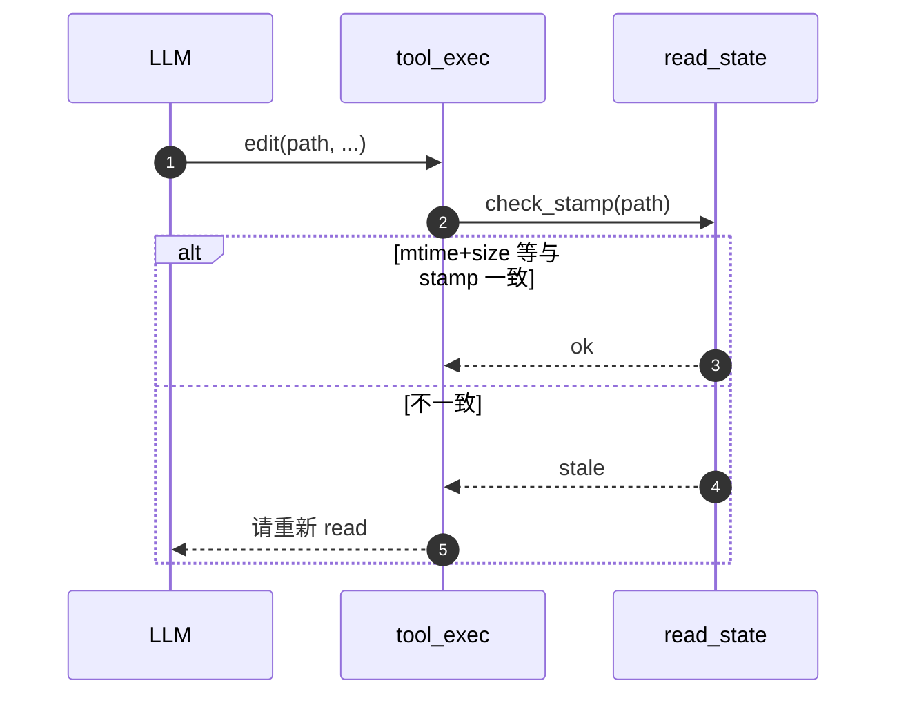

# `read` 工具：分页、去重、多模态与陈旧检测

本文档是内置工具 **`read`** 的冻结版技术方案（OpenSpec **B 类**：`docs/architecture/tools/`），承接迭代子项 **T2-P0-tools-read** 与计划 [`strengthen-read-tool_92f396c7.plan.md`](../../../../../.cursor/plans/strengthen-read-tool_92f396c7.plan.md)、[`tools-read-spec-migration_cb4d7b57.plan.md`](../../../../../.cursor/plans/tools-read-spec-migration_cb4d7b57.plan.md)。**实现以仓库代码为准**；计划文档保留讨论过程与 PR 治理顺序，本文只保留**已定稿的行为与契约**。

§4.1 落地选型决策表 **「决策」** 列（每行一句裁决结论，见 [`ARCHITECTURE_SPEC.md`](../../../openspec/specs/guides/workflow/ARCHITECTURE_SPEC.md) **§4.1 / §14.1**）。其他高密度表末列 **「说人话」** 与 **§14.1** 对齐：在已写清技术列的前提下，每行一句口语扫读；与 §1「语义（人话）」并存时，**语义列钉定义，说人话列作速记**（不替代技术表述）。

**说人话**：这是一份「读文件工具」的定稿 spec——怎么分页、怎么报错、怎么 dedup、图往哪塞，都按下面表格和协议来。

---

## 目录

- [1. 术语统一](#1-术语统一)
- [2. 竞品 / 选型对比（调研）](#2-竞品--选型对比调研)
  - [2.1 Agent 读文件的典型关切](#21-agent-读文件的典型关切)
  - [2.2 常见实现横向对比](#22-常见实现横向对比)
  - [2.2.1 维度词典（R1–R6）](#221-维度词典r1r6)
- [3. 目标与设计原则](#3-目标与设计原则)
  - [3.1 观察指标表（与 §11 验收一一对应）](#31-观察指标表与-11-验收一一对应)
  - [3.2 非目标](#32-非目标)
- [4. 落地选型与实施（已定稿）](#4-落地选型与实施已定稿)
  - [4.1 落地选型决策表（维度取舍）](#41-落地选型决策表维度取舍)
  - [4.2 实施点（已闭环）](#42-实施点已闭环)
  - [4.2.1 PR-RA：对外单名 `read`](#421-pr-ra对外单名-read)
  - [4.2.2 PR-RB（T1）：分页、二进制 hint、流式抽窗与裸读上限](#422-pr-rbt1分页二进制-hint流式抽窗与裸读上限)
  - [4.2.3 PR-RF（T2）：`cat -n`、会话表与 `FILE_UNCHANGED`](#423-pr-rft2cat-n会话表与-file_unchanged)
  - [4.2.4 PR-RJ-0 与 T3-a / b / c：多模态与 OpenAI 注入边界](#424-pr-rj-0-与-t3-a--b--c多模态与-openai-注入边界)
  - [4.2.5 PR-RM：`hashline`（xxh32）](#425-pr-rmhashlinexxh32)
  - [4.2.6 PR-RS：文档](#426-pr-rs文档)
- [5. 协议（入参 / 出参 / Schema）](#5-协议入参--出参--schema)
- [6. One-Glance Map（文件职责总览）](#6-one-glance-map文件职责总览)
- [7. 调度时序（运行时图）](#7-调度时序运行时图)
- [8. 状态机与会话表](#8-状态机与会话表)
- [9. 配置与环境变量](#9-配置与环境变量)
- [10. 错误模型 / 截断 / Stub](#10-错误模型--截断--stub)
- [11. 测试矩阵（验收）](#11-测试矩阵验收)
- [12. 风险与应对](#12-风险与应对)
- [13. 历史决策（已被本方案取代）](#13-历史决策已被本方案取代)
- [14. 关联文档](#14-关联文档)
- [附录：旧节号 → 本版对照](#附录旧节号--本版对照)

---

## 1. 术语统一


| 术语                      | 语义（人话）                                                     | 数据载体                                                                    | 行为约束                                                                                                  | 说人话 |
| ----------------------- | ---------------------------------------------------------- | ----------------------------------------------------------------------- | ----------------------------------------------------------------------------------------------------- | ------ |
| **窗口**                  | 从第几行开始、最多读几行                                               | `offset: Option<u64>`, `limit: Option<u64>`                             | `offset` 缺省等价 1；`limit` 缺省等价默认 2000；**显式** `limit` 才参与「是否分窗」判定（与 `read_state` 的 `is_partial_view` 一致） | 从第几行读、读几行。 |
| **dedup（重复读短路）**        | 同一窗口、文件看起来没变，就不再塞全文                                        | [`read_state::ReadFileState`](../../../../src/core/tools/pipeline/read_state.rs) | 命中 → `ReadResult::FileUnchanged`（在 **tool_exec** 短路，不调 primitive）                                     | 没变就别再灌全文。 |
| **staleness（陈旧）**       | 模型脑中的内容已不是磁盘最新                                             | 同上表中的 `ReadStamp`                                                       | **edit/write 入口**查表：指纹不一致 → 拒绝并要求先 `read`                                                             | 磁盘变了先逼你再 read。 |
| **FILE_UNCHANGED stub** | 告诉模型「别读了，跟上一次一样」                                           | 常量 [`FILE_UNCHANGED_STUB`](../../../../src/core/tools/pipeline/read_state.rs)    | 非错误；模型应引用上一轮 read 结果                                                                                  | 短句告诉模型「跟上轮一样」。 |
| **hashline**            | 行号 + 内容指纹前缀，供精细 edit 锚点                                    | executor 文本渲染分支                                                         | `hashline=true` 时覆盖 `line_numbers`；算法对齐 pi_agent_rust                                                 | 行尾带俩字指纹，给 edit 对齐。 |
| **「LLM 收到 tool 结果后」**   | 指 **`tool_exec` 已把 `ReadResult` 落成 chat 消息、即将进入下一轮模型推理之前** | —                                                                       | 与去重 / 注入时序讨论绑在此边界                                                                                     | tool 结果已进 transcript、下一轮推理还没开始。 |


---

## 2. 竞品 / 选型对比（调研）

对标过 pi-mono、pi_agent_rust、openclaw、hermes、cc-fork 等读文件策略。本节为**调研材料**（关切、横向、维度词典）；**已定稿的维度取舍（§4.1）与代码落点/交付（§4.2）**见 **[§4](#4-落地选型与实施已定稿)**。

### 2.1 Agent 读文件的典型关切

本地 `read` 类工具通常要同时解决四类问题：**体量**、**编码与类型**、**模型重复调用**、**写改一致性**。本方案用 **offset/limit + metadata 门 + read_state（mtime/size 快路径）+ 下一条 user 注入多模态** 四条线分别收口。

```text
┌────────────────────────────────────────────────────────────────────────────┐
│  本地 read 工具通常要同时解决的四类问题                                    │
├────────────────────┬─────────────────────────────────────────────────────┤
│  体量              │  整文件进上下文 → OOM / 费 token → 需要分页与硬上限      │
│  编码与类型        │  UTF-8 文本 vs 二进制 vs 图 / PDF → 路由与可读错误    │
│  模型行为          │  重复 read 同一窗口 → 需要软 dedup，而非误伤合法重试   │
│  写改一致性        │  文件在磁盘已变 → 需要指纹，供 edit/write 前陈旧拦截   │
└────────────────────┴─────────────────────────────────────────────────────┘
```

**说人话**：大文件要「切块」、乱码要「说人话报错」、重复读要「省 token」、写之前要「对指纹」——下面横向表看谁家的做法我们借鉴了哪条。

### 2.2 常见实现横向对比


| 来源 / 形态                | 分页与上限                  | 行号 / 锚点               | 重复读                   | 多模态                                 | 备注                      | 说人话 |
| ---------------------- | ---------------------- | --------------------- | --------------------- | ----------------------------------- | ----------------------- | ------ |
| **cc-fork 系**          | 大行数窗口 + 续读提示           | 常见 `cat -n`           | 软 stub 省 token        | 视产品而定                               | 工程上验证「窗口默认 ~2k 行」较稳     | 大行数窗口是业界共识。 |
| **pi_agent_rust**      | 类似 Agent 读盘            | **hashline**（xxh 短指纹） | 可与 edit 对齐            | 依部署                                 | 本仓库 **hashline 算法对齐**   | 指纹行我们对齐生态。 |
| **Claude / Cursor 内置** | 产品化分页策略                | 因产品而异                 | 通常由宿主去重               | 强多模态                                | 协议细节不公开处用「占位 + 侧信道」思路参照 | 产品侧做法作参照。 |
| **本仓库 `read`**         | 默认 2000 行 + 25 MiB 裸读门 | `cat -n` 或 hashline   | `FILE_UNCHANGED` stub | OpenAI：**tool 占位 + 下一条 user Parts** | wasm 友好、单测锁行为           | 分页 + dedup + 图走 user。 |

### 2.2.1 维度词典（R1–R6）

> **已定稿代码落点与交付**以 **[§4.2](#42-实施点已闭环)** 实施表为准；**§4.1** 只写维度上取舍与拒因。本表供 **§4.1「维度」** 列取值与扫读对齐。

| 维度 | 关切 | 说人话 |
|------|------|--------|
| R1 对外命名 | catalog / transcript 是否双轨 | 对外只认 `read`，别把 legacy 名当真工具。 |
| R2 体量与窗口 | 大文件、wasm 堆、token | 默认分页 + 裸读门，别整文件进上下文。 |
| R3 裸读与内存 | 无窗口时的字节上限与绕过 | 没传窗才挡整文件；传了 offset/limit 就能「只窥一角」。 |
| R4 行级锚点 | `cat -n` vs hashline vs IDE 习惯 | 行号要稳定可 diff；hashline 给 edit 短指纹。 |
| R5 重复读与 dedup | 合法重试 vs 烧 token | 同窗未变走 stub，别每次全文重发。 |
| R6 多模态与注入 | OpenAI tool 消息能否带图 | 图 / PDF 走占位 + **下一条 user** Parts。 |

---

## 3. 目标与设计原则

**一句话**：让模型在本地读盘时 **可控体量、可读错误、可续读、少重复刷屏**，并在改文件前有机会发现「磁盘已变」——而不是把整份大文件或裸二进制直接倒进上下文。

**说人话（§3 总览）**：下面这张表钉死「读工具要守住的规矩」——对外只叫 `read`、默认分页和大文件门、乱码要说清楚、图走 API 允许的通道、同窗别反复灌全文、指纹留给写改前对表。

| 原则（可观察）            | 说明                                                                                                     | 说人话 |
| ------------------ | ------------------------------------------------------------------------------------------------------ | ------ |
| **单名对外**           | 内置 catalog 仅注册 `read`；`read_file` 得到与拼错名一致的**未知工具**类错误                                                 | 只认 `read` 这一个工具名。 |
| **窗口可控**           | `offset`（1-based 行）+ `limit`（1..=10000，默认 2000）；截断时正文尾附带 `resume with offset=<next>, limit=<same>`     | 大文件先读一截，截断告诉你下一窗。 |
| **裸读有上限**          | 未传窗口时 `metadata().len()` 超过文本上限（默认 25 MiB）→ 结构化错误并提示分窗；**已传** `offset` 或 `limit` 时可绕过（允许只读大文件的一小段）     | 没窗别整锅端；有窗可以只窥一角。 |
| **二进制可诊断**         | 非 UTF-8 文本路径 → `AppError::Tool`，文案含 first-byte 十六进制与可执行建议（如 `bash file`），避免裸 `invalid utf-8`           | 乱码给 hex 和运维 hint，别裸崩。 |
| **行级可定位**          | 默认 `cat -n`（6 格右对齐行号 + Tab）；`hashline=true` 时为 `行号#双字符哈希:正文`（与 `line_numbers` 互斥，**hashline 优先**）      | 行号跟终端；要 edit 就开 hashline。 |
| **多模态走 OpenAI 约束** | 图 / PDF：`tool` 消息里占位句；真实 `InputImage` / `InputFile` 注入**下一条** `user` 的 `Parts`（`role=tool` 不接受图像 part） | 图不进 tool 正文，塞进下一条 user。 |
| **会话去重**           | 同一 `(path, offset, limit)` 且磁盘 `mtime+size` 未变 → 第二次起返回 `FILE_UNCHANGED` 短 stub                        | 同窗没变就 stub，省 token。 |
| **陈旧检测底座**         | `read_state` 存上次成功 read 的指纹；`write` / `edit` 入口可比对，防止按旧上下文误改                                           | 指纹表给写改前对表用。 |


### 3.1 观察指标表（与 §11 验收一一对应）


| 目标            | 观察指标（落地后可核对）                                           | 说人话 |
| ------------- | ------------------------------------------------------ | ------ |
| G1 工具名统一      | catalog 仅 `read`；`read_file` → 未知工具错误                  | 老名当拼错处理。 |
| G2 大文件可控      | `offset` + `limit`；截断带续读尾注                             | 分页 + 续读提示。 |
| G3 裸读有上限      | 无窗口超 `max_bytes` → 结构化错误；有窗口可绕过                        | 无窗挡整文件；有窗放行一角。 |
| G4 二进制可诊断     | Tool 错误含 hex 与建议                                       | 非 UTF-8 要说人话报错。 |
| G5 行级可定位      | `cat -n` 或 hashline 二选一渲染                              | 行号或指纹二选一渲染。 |
| G6 多模态 inline | magic + 扩展名路由；图 4.5 MiB、PDF 25 MiB 在 **metadata 阶段**拒绝 | 超限在 metadata 就挡。 |
| G7 OpenAI 路径  | 图 / PDF 占位 + 下一条 `user` 注入                             | API 约束：图跟 user Parts。 |
| G8 会话去重       | 同窗口未变 → `FileUnchanged` stub                           | 重复读走 stub。 |
| G9 陈旧检测       | `read_state` 供写改前比对                                    | 写改前对指纹。 |


### 3.2 非目标


| 非目标                         | 说明                                     | 说人话 |
| --------------------------- | -------------------------------------- | ------ |
| 服务端缩放图片                     | 不引入 `image` crate；大图由上游或用户预处理          | 工具里不缩放图。 |
| PDF 文本抽取 / Notebook         | 不解码 PDF 为文本；不解析 `.ipynb`               | 不当文本读 PDF / ipynb。 |
| `read_file` 运行时别名           | 不重定向；历史回放仅 warn（见代码注释）                 | 回放里老名只 warn。 |
| Anthropic `tool_result` 内嵌图 | 当前主线为 OpenAI Responses；Anthropic 另接时再扩 | Anthropic 图路径本期不做。 |


---

## 4. 落地选型与实施（已定稿）

### 4.1 落地选型决策表（维度取舍）

**核对**：每个可辩驳分叉独占一行；读者能回答「若不采纳本行**入选理由**，代价是什么」。**落地点、交付物、阶段**见 **[§4.2](#42-实施点已闭环)**（[`ARCHITECTURE_SPEC.md`](../../../openspec/specs/guides/workflow/ARCHITECTURE_SPEC.md) **§4.1 / §4.2** 分工）。第三列 **「决策」** 钉专业裁决结论；末列 **「说人话」** 为口语扫读（**SHOULD**，与 **§14.1** 同向）。

| 维度 | 关切 | 决策 | 取自 | 入选理由 | 未入选 + 拒因 | 说人话 |
| --- | --- | --- | --- | --- | --- | --- |
| R1 对外命名 | catalog 与 transcript 是否双轨 | **采用** 单名 `read`；legacy 仅 warn，不当别名执行。 | 本仓库 PR-RA；与 `read` 单名策略一致 | 仅注册 `read`；legacy 名 → UnknownTool + `warn`，审计单轨 | 运行时把 `read_file` 当别名执行 → 双轨与 prompt 分叉 | 一条名字走到底。 |
| R2 分页默认 | 大文件进上下文与 wasm 堆 | **采用** 默认 `limit=2000` 分页 + 截断续读尾注。 | cc-fork 系大行数窗口实践 | 默认 `limit=2000` + 截断续读尾注；可控 token | 整文件默认读入 → OOM / 费 token | 一屏加一点。 |
| R3 裸读门 | 无窗读巨文件 | **采用** 无窗 `max_bytes` 门（默认 25 MiB）；有窗可绕过。 | `infra/config` + executor metadata | 无窗时 `max_bytes`（默认 25 MiB）拒绝；**有** `offset`/`limit` 之一可绕过 | 不设门或门过低 → 误伤或仍 OOM | 没窗才挡整锅；有窗只窥一角。 |
| R4 行号默认 | IDE / diff / 人工扫读 | **采用** 默认 `cat -n`（6 格 + Tab）。 | 常见 `cat -n` 实践 | 默认 `cat -n` 6 格 + Tab | 无前缀 → 对行号不友好 | 跟终端习惯对齐。 |
| R5 同窗重复读 | 合法重试 vs 烧 token | **采用** 同窗未变 → `FileUnchanged` stub。 | dedup stub 类产品实践 | 同窗磁盘未变 → `FileUnchanged` stub | 硬拒绝误伤「再确认」；每次全文 → 烧 token | 没变就别再灌全文。 |
| R5 dedup 指纹 | 短路前是否再读全文 | **采用** dedup 命中 `mtime_ms+size`；`content_hash` 仅诊断/纵深。 | `read_state.rs` 头注释与 PR-RF | `mtime_ms + size` 快路径；`content_hash` 存表供诊断与 edit 纵深 | hash 参与 dedup 命中 → 短路前被迫再读全文 | 省读优先，hash 做纵深。 |
| R6 图片策略 | 依赖与 wasm 体积 | **采用** metadata 限长、路径级不缩放（wasm 可控）。 | OpenAI inline 限制 | metadata 限长、路径级不缩放；对齐上限 | 在工具内解码缩放 → 依赖与编译膨胀 | wasm 可控，贴 OpenAI。 |
| R4 hashline | 行级强锚点 | **采用** xxh32 + 双字符表 hashline（对齐 pi 生态）。 | **pi_agent_rust** hashline | xxh32 + 双字符表；与 edit 纵深一致 | 无行级指纹 → 精细 edit 难闭环 | 短指纹好对齐生态。 |
| R6 图 / PDF 进模型 | OpenAI tool 能否带 binary | **采用** tool 占位 + 下条 `user` Parts 注入（单测锁住）。 | OpenAI API 约束 + PR-RJ T3-c | tool 占位 + **下一条** `user` Parts 注入 | 在 tool 消息内嵌图 → API 拒收 / 浪费 | 图走侧信道，单测锁住。 |

### 4.2 实施点（已闭环）

下列顺序与 **T2-P0-tools-read** 及 `strengthen-read-tool_92f396c7.plan.md` §6–§8 一致；**2026-05-05** 已全量合入主线。

| 实施点 | 交付范围（含交付物） | 主要代码落点（含落地点） | 验收锚点（示例） | 说人话 |
|--------|----------------------|--------------------------|------------------|--------|
| **PR-RA** | catalog / system_prompt 仅 `read`；legacy transcript **warn** + UnknownTool；**交付**：单名对外与审计一致 | `src/core/tools/contract/catalog.rs`、`src/core/agent_loop/tool_exec.rs` | `tool_exec_legacy_read_file_returns_unknown_tool_error` | 老名只提醒，不当真执行。 |
| **PR-RB（T1）** | `offset`/`limit`、二进制 Tool hint、memchr 单窗、`[tools.read] max_bytes` 默认 25 MiB；**交付**：分页与裸读门可配置 | `src/core/tools/primitive/executor/read.rs`、`src/infra/config` | `read_window_test::*`、`read_with_offset_bypasses_max_bytes_check` | 大文件先挡门，有窗再读一角。 |
| **PR-RF（T2）** | `cat -n`；`ReadStamp`/`ReadFileState`/`FILE_UNCHANGED_STUB`；会话结束清理；**交付**：dedup 与会话表 | `src/core/tools/pipeline/read_state.rs`、`src/core/agent_loop/tool_exec.rs` | `tool_exec_dedup_test::*` | 指纹记在表里，重复读能短路。 |
| **PR-RJ-0** | `image_b64`/`file_b64` 统一 `(mime, &Path)`；metadata 白名单 + 单点读盘 base64 | `src/core/llm/types.rs` | `src/core/llm/tests/types_test.rs` | helper 一处校验，别重复 IO。 |
| **PR-RJ T3-a** | `ReadResult` 四态（Text/Image/Pdf/FileUnchanged）；wire 翻译 | `src/core/tools/primitive/types.rs` | `read_routes_*` | 四种结局分清楚。 |
| **PR-RJ T3-b** | magic 路由；metadata 阶段 `IMAGE_MAX_BYTES`/`FILE_MAX_BYTES` | `src/core/tools/primitive/executor/read.rs`、`src/core/llm/types.rs` | `read_oversize_image_rejected_at_metadata_stage` | 超限早拒，别读全文件。 |
| **PR-RJ T3-c** | tool 结果可带 `Vec<ChatMessageContentPart>`；dispatcher 注入**下一条** `user` | `src/core/agent_loop/tool_exec.rs`、agent loop | `tool_exec_image_result_injects_into_next_user_message_parts` 等 | 图不进 tool 正文，走 user Parts。 |
| **PR-RM** | `hashline: bool`（xxh32）；与 `line_numbers` 互斥且 **hashline 优先** | `src/core/tools/primitive/executor/read.rs`、`src/core/tools/contract/catalog.rs` | `read_with_hashline_renders_hash_prefixed_lines` | 行号带短指纹，给 edit 留锚点。 |
| **PR-RS** | 冻结 spec 合入；catalog / 看板 / 集成登记交叉引用 | `docs/architecture/tools/read.md` 等 | 不计代码 PR | 字和门禁对齐。 |


集成与并发组登记见 `tests/read_tool_tests.rs`、`scripts/test-groups.sh`（看板条目中已列门禁结果）。

下文按实施点展开**技术要点与示意图**；**交付边界与代码落点仍以表为准**，避免与表冲突。

#### 4.2.1 PR-RA：对外单名 `read`

- **交付**：catalog / system_prompt / 相关字面量统一为短名 `read`；`tool_exec` 仅匹配 `"read"`；`"read_file"` 走**未知工具**路径，语义与拼错工具名一致。
- **历史回放**：`session` 侧用 `OnceLock` 对 legacy 名打 **`tracing::warn`**（不重定向、不静默改写调用），避免双轨审计。

```text
  LLM / transcript
        │
        ▼
┌───────────────────┐     注册名仅 "read"
│  catalog.rs       │──────────────────────────────┐
└───────────────────┘                              │
        │                                            ▼
        ▼                               ┌────────────────────┐
  tool_exec  match "read"                │ "read_file" 等    │
        │                                │ → UnknownTool 错误 │
        ▼                                └────────────────────┘
   正常 read 路径
```

**说人话**：模型只能调 `read`；`read_file` 当未知工具报错，避免双轨和审计分叉。

#### 4.2.2 PR-RB（T1）：分页、二进制 hint、流式抽窗与裸读上限

- **`offset` / `limit`**：1-based 行窗口；截断时在正文尾附带续读提示（见 [§5](#5-协议入参--出参--schema)、[§10](#10-错误模型--截断--stub)）。
- **流式与内存**：分块读盘 + `memchr` 找换行，**单循环**抽出窗口内行，避免先把整文件读进 `String` 再切行（wasm / 大文件友好）。
- **`[tools.read] max_bytes`**：默认 25 MiB；**仅当** primitive 入参里 **`offset` / `limit` 均未显式出现**（`has_window = offset.is_some() || limit.is_some()` 为假）时，在 metadata 阶段用 `len()` 拒绝过大文本路径；**显式传 `offset` 或 `limit` 之一**即可绕过，用于「只窥一角」读大文件。
- **二进制 / 非 UTF-8**：返回结构化 `AppError::Tool`，带首字节 hex 与运维向建议，避免裸 `invalid utf-8` 污染模型上下文。

```text
  open(path)
      │
      ▼
 metadata.len()  +  has_window?
      │
      ├─ has_window=false 且 len > max_bytes ──▶ Tool Err（提示 offset/limit）
      │
      └─ 否则 ──▶ 分块读 + memchr ──▶ 窗口内 UTF-8 文本 + 行号/hashline
```

**说人话**：先量文件大小和有没有窗；太大又没窗就拒；否则流式扫行，不把整文件读进内存。

#### 4.2.3 PR-RF（T2）：`cat -n`、会话表与 `FILE_UNCHANGED`

- **行号**：`format_with_line_numbers` → `{:>6}\t{content}`，默认 `line_numbers=true`。
- **`src/core/tools/pipeline/read_state.rs`**：`ReadStamp { mtime, size, content_hash, offset, limit, is_partial_view }` + `ReadFileState`（`RwLock<HashMap<PathBuf, ReadStamp>>`）+ 常量 `FILE_UNCHANGED_STUB`。
- **挂载**：`Arc<ReadFileState>` 挂在 `AgentLoopConfig` / `ChatContext`，跨轮复用；会话结束清理，避免表无限涨。
- **dedup**：`tool_exec` 在调 primitive 前查表；命中且磁盘指纹未变 → 直接 `ReadResult::FileUnchanged`（**不调** executor）。

```text
        read 请求 (path, offset, limit)
                    │
                    ▼
            ReadFileState.lookup
                    │
         ┌──────────┴──────────┐
         ▼                     ▼
    mtime/size 变          key 命中且未变
         │                     │
         ▼                     ▼
   executor/read          FileUnchanged stub
   + put_stamp             （不调 primitive）
```

**说人话**：表里有同窗指纹且磁盘没变 → 直接 stub，不调真读盘。

#### 4.2.4 PR-RJ-0 与 T3-a / b / c：多模态与 OpenAI 注入边界

- **PR-RJ-0**：`ChatMessageContentPart::image_b64` / `file_b64` 统一为 **`(mime, &Path)`**（及 `file_b64` 的文件名参数）：helper 内 **metadata 二次校验 + 读盘 + base64**，避免 read 与 LLM 客户端重复 IO、重复校验。
- **T3-a**：`ReadResult` 四态 **`Text` / `Image` / `Pdf` / `FileUnchanged`**；primitive 只产出前三者，`FileUnchanged` **仅** `tool_exec` 构造。
- **T3-b**：`detect_inline_mime`（magic + 扩展名）路由 PNG/JPEG/GIF/WebP/PDF；在 metadata 阶段用 `IMAGE_MAX_BYTES` / `FILE_MAX_BYTES` 拒绝超限，**不**加载全字节。
- **T3-c**：`tool_exec` 返回值升级，可附带 `Vec<ChatMessageContentPart>`；`tool_dispatcher` 在 tool 消息之后向**下一条 user**追加 image/file part——对齐 OpenAI「tool 里不能塞图」的硬约束。

```text
  ReadResult::Image | Pdf
            │
            ├─▶ role=tool 文本：短占位说明（无 binary part）
            │
            └─▶ 紧随其后的 role=user：Parts += InputImage / InputFile
```

**说人话**：tool 里只有占位字；真图真 PDF 跟在下一条 user 里，满足 OpenAI 约束。

#### 4.2.5 PR-RM：`hashline`（xxh32）

- **依赖**：`xxhash-rust`（`xxh32`）。
- **算法**：行内容经 whitespace-stripped 后做 xxh32，取 nibbles 映射为**双字符**指纹前缀；渲染 `{:>6}#XX:{content}`。
- **优先级**：`hashline=true` 时 **覆盖** `line_numbers`（schema、system prompt、executor 分支一致）。

```text
  line_numbers=true, hashline=false     →  "    42\tcode"
  hashline=true（优先）                 →  "    42#Ab:code"
```

**说人话**：要 edit 锚点就开 hashline，行里多俩字符指纹。

#### 4.2.6 PR-RS：文档

- 将冻结 spec 合入 `docs/architecture/tools/read.md`，并与 tool catalog、看板、集成测试登记交叉引用（见 [§14](#14-关联文档)）。

**说人话**：文档和 catalog、测试分组对得上号，避免「写了 spec 门禁没登记」。

---

## 5. 协议（入参 / 出参 / Schema）

**单一事实源**：

- JSON Schema：[`catalog.rs::read_parameters`](../../../../src/core/tools/contract/catalog.rs) → `build_function_definitions()` → [`docs/tool-catalog.md`](../../../../docs/tool-catalog.md)。
- Rust 类型：[`primitive/types.rs`](../../../../src/core/tools/primitive/types.rs) 中 `ReadResult` / `ReadTextResult` / `ReadBinaryResult`。

### 5.1 入参（工具 arguments）


| 字段             | JSON 类型           | 必填    | 默认      | 说明                                    | 说人话 |
| -------------- | ----------------- | ----- | ------- | ------------------------------------- | ------ |
| `path`         | string            | **是** | —       | 绝对或相对路径；经 `PermissionGate` Read       | 读哪条路，先过权限门。 |
| `offset`       | integer ≥ 1       | 否     | 1       | 从第几行开始读（1-based）                      | 从第几行起。 |
| `limit`        | integer 1..=10000 | 否     | 2000    | 最多返回多少行；截断则附续读尾注                      | 最多读几行；不够就尾注续读。 |
| `line_numbers` | boolean           | 否     | `true`  | `cat -n` 风格前缀；与 `hashline` 互斥         | 默认带行号。 |
| `hashline`     | boolean           | 否     | `false` | `行号#XX:内容`；开启时 **优先于** `line_numbers` | 开指纹行，覆盖普通行号。 |


### 5.2 出参（Rust：`ReadResult`）

判别式枚举四种结局（wire / UI 再序列化）：

```text
ReadResult
├── Text(ReadTextResult)
│     • content      — 已带行号或 hashline、可能带截断尾注的最终字符串
│     • start_line   — 窗口起始行号（1-based）
│     • num_lines    — 本响应实际行数
│     • truncated    — 是否因 limit 截断
│     • remaining_lines — 截断时后面还剩多少行；未截断为 0
├── Image(ReadBinaryResult)   — mime + size + path + filename（primitive 不 base64）
├── Pdf(ReadBinaryResult)     — 同上，mime 为 application/pdf
└── FileUnchanged { path }    — 仅 tool_exec dedup 路径构造；primitive **不**产出此变体
```

**说人话**：正常读出来是 Text / 图 / PDF；只有 dedup 命中才会多一个「没变」的 FileUnchanged。

**Image / Pdf 与 helper**：`tool_exec` 用路径调用 `ChatMessageContentPart::image_b64(mime, &Path)` / `file_b64(filename, mime, &Path)` 完成读盘与 base64（[`types.rs`](../../../../src/core/llm/types.rs)）。

### 5.3 调用样例（jsonc）

**文本分页**：

```jsonc
{
  "path": "src/lib.rs",
  "offset": 1,
  "limit": 80
}
```

**精细锚点（hashline）**：

```jsonc
{
  "path": "src/lib.rs",
  "offset": 10,
  "limit": 40,
  "hashline": true
}
```

**说人话**：上面两段 jsonc 分别是「分页读一段」和「开 hashline 读一段」的调用样子。

---

## 6. One-Glance Map（文件职责总览）

```text
┌────────────────────────────────────────────────────────────────────────────┐
│  src/core/llm/system_prompt.rs                                             │
│  • 工具说明里使用短名 `read`，引导 offset/limit / hashline                  │
└────────────────────────────────────────────────────────────────────────────┘
        │
        ▼
┌────────────────────────────────────────────────────────────────────────────┐
│  src/core/tools/contract/catalog.rs                                                 │
│  • BUILTIN_TOOL_CATALOG：`name = "read"`，`read_parameters()` JSON Schema   │
└────────────────────────────────────────────────────────────────────────────┘
        │
        ▼
┌────────────────────────────────────────────────────────────────────────────┐
│  src/core/agent_loop/tool_exec.rs                                          │
│  • match `"read"`：解析 offset/limit/line_numbers/hashline，越界早失败       │
│  • dedup：命中 ReadFileState → 直接 FileUnchanged                           │
│  • ReadResult::Image|Pdf → 占位 tool 文本 + 注入下一条 user Parts            │
└───────────────────────────────┬────────────────────────────────────────────┘
                                │
                                ▼
┌────────────────────────────────────────────────────────────────────────────┐
│  src/core/tools/primitive/executor/read.rs                                 │
│  • read / read_file_impl：gate → metadata 上限 → 路由 Text|Image|Pdf       │
│  • 文本：分块读 + memchr 找换行，单循环抽窗；UTF-8 校验；尾注；行号/hashline │
│  • 二进制拒绝：结构化 Tool 错误                                             │
└───────────────────────────────┬────────────────────────────────────────────┘
                                │
              ┌─────────────────┴──────────────────┐
              ▼                                    ▼
┌──────────────────────────────┐      ┌──────────────────────────────────────┐
│  src/core/tools/pipeline/read_state.rs │      │  src/core/llm/types.rs               │
│  • ReadFileState / ReadStamp   │      │  • image_b64 / file_b64(path 签名)    │
│  • put_stamp / check_stamp     │      │  • metadata 尺寸白名单 + 读盘 base64 │
└──────────────────────────────┘      └──────────────────────────────────────┘
              ▲
              │ Arc 挂在 AgentLoopConfig（见 src/api/chat/mod.rs 装配）
```

**怎么读这张图**：请求先进 **`tool_exec`**（参数与去重），再进 **`executor/read`**（真 IO 与渲染），会话指纹记在 **`read_state`**；图 / PDF 的昂贵编码只在 **`types.rs` helper** 做一次。

**阅读顺序（说人话）**：`system_prompt` / `catalog` 定名 → `tool_exec` 解析与 dedup、多模态注入 → `executor/read` 真读盘 → `read_state` 记指纹 → 图/PDF 编码只在 `types.rs` 一处。

---

## 7. 调度时序（运行时图）

### 7.1 首次 read（文本窗口）

```text
LLM          tool_exec              executor/read           read_state
 │               │                       │                    │
 │ read(args)    │                       │                    │
 │──────────────>│ 校验 offset/limit      │                    │
 │               │──────────────────────>│ gate + open       │
 │               │                       │ 流式扫行/拼 content │
 │               │                       │───────────────────>│ put_stamp
 │               │<──────────────────────│ ReadResult::Text   │
 │<──────────────│ tool 消息文本         │                    │
```

**说人话**：第一次读走全链路，读完把指纹写进表。

### 7.2 同窗口第二次 read（dedup）{#sec-read-dedup}

```text
LLM          tool_exec                       read_state
 │               │                               │
 │ read(同路径同窗口) │ lookup：mtime+size 未变      │
 │──────────────>│──────────────────────────────>│
 │               │<──────────────────────────────│ hit
 │               │ 组装 FileUnchanged（不调 executor）
 │<──────────────│ stub 文本
```

**说人话**：同路径同窗且 mtime/size 没变，第二次不调 executor，直接 stub。

### 7.3 edit 前陈旧检查（概念）



**说人话**：edit 前先对表里指纹；磁盘变了就拦下来让你先 `read`，别按旧内容改。

---

## 8. 状态机与会话表

**dedup 命中**（简化条件，完整见 `ReadStamp::matches_request`）：

```text
           ┌─────────────┐
  首次 read │  no record  │
           └──────┬──────┘
                  │ put_stamp
                  ▼
           ┌─────────────┐
  再次 read │  key 对齐   │──mtime/size 变──▶ 全量重读 + 更新 stamp
           │  且磁盘未变 │
           └──────┬──────┘
                  │ 同窗口 + 未变
                  ▼
           ┌─────────────┐
           │ FILE_UNCHANGED stub
           └─────────────┘
```

**说人话**：没记录就记；有记录且没变就 stub；变了就重读更新表。

| 字段 / 概念             | 作用                                         | 说人话 |
| ------------------- | ------------------------------------------ | ------ |
| `mtime_ms` + `size` | dedup 快路径：未变才允许短路                          | 先看大小和时间戳快不快。 |
| `content_hash`      | 存储供诊断与后续 hashline_edit；**dedup 命中不强制重算比对** | 深度校验留给 edit，dedup 不强制重读。 |
| `is_partial_view`   | 分窗读与整文件读不互相 dedup                          | 半窗和全文件别互相 dedup。 |


---

## 9. 配置与环境变量

**总则**：`env > config > 默认`（本工具相关项当前以 **config / 代码常量 / 测试注入** 为主；若某 env 未实现则表中不列）。

`line_numbers` / `hashline` **不进** config：由模型按次决定，避免管理员静默改变模型上下文形状。

| 变量 | 取值 | 含义 | 优先级 | 说人话 |
|------|------|------|--------|--------|
| `[tools.read] max_bytes`（`tomcat.config.toml`） | 正整数（字节） | 文本路径**无 offset/limit 窗**时的裸读上限 | config > 内置默认 | 没传窗时挡整锅；默认约 25 MiB，可配。 |
| `IMAGE_MAX_BYTES` / `FILE_MAX_BYTES`（代码常量） | 正整数 | 图 / PDF 在 metadata 阶段的上限 | 默认（见 `types.rs`） | 超限早拒，不读全文件进内存。 |
| `DefaultPrimitiveExecutor::with_read_max_bytes` | 测试用缩小值 | 单测注入执行器阈值 | 仅测试 | 单测里把门调小，不必造巨文件。 |

**说人话**：能进用户配置文件的主要是裸读字节上限；行号 / hashline 每次工具参数里定，别让全局配置悄悄改上下文形状。

---

## 10. 错误模型 / 截断 / Stub

```text
                    read 请求
                        │
        ┌───────────────┼───────────────┐
        ▼               ▼               ▼
   参数非法         权限 / IO        文本非 UTF-8
   AppError::Tool   Permission/IO   AppError::Tool（结构化 hint）
        │               │               │
        └───────────────┴───────────────┘
                        │
        ┌───────────────┴───────────────┐
        ▼                               ▼
  裸读超 max_bytes                 limit 截断
  AppError::Tool（提示 offset/limit）  Ok(Text{truncated=true, 尾注})
        │
        ▼
  dedup 命中
  Ok(FileUnchanged) — 非错误
```

**说人话**：真错误走 `AppError::Tool`（参数、权限、IO、非 UTF-8、裸读超门）；`limit` 截断是 **Ok** 带尾注；dedup 是 **Ok(FileUnchanged)**，别当失败重试。

---

## 11. 测试矩阵（验收）


| 维度             | 用例（实际函数名）                                                                                                                                                                                                                                                                                                                                                                                    | 状态           | 说人话 |
| -------------- | -------------------------------------------------------------------------------------------------------------------------------------------------------------------------------------------------------------------------------------------------------------------------------------------------------------------------------------------------------------------------------------------- | ------------ | ------ |
| 分页 / 尾注        | `read_window_test::read_offset_limit_returns_window`、`read_offset_beyond_eof_returns_empty`、`read_limit_truncates_with_resume_hint`、`read_with_offset_bypasses_max_bytes_check`                                                                                                                                                                                                              | ✅ 2026-05-05 | 窗、截断、续读提示、有窗绕过裸读门都锁住。 |
| 大文件 / 二进制 hint | `read_window_test::read_no_offset_large_file_rejected_with_hint`、`read_binary_returns_structured_hint`                                                                                                                                                                                                                                                                                       | ✅ 2026-05-05 | 巨文件无窗拒、二进制给结构化 hint。 |
| 行号 / hashline  | `read_window_test::read_default_renders_cat_n_line_numbers`、`read_offset_window_uses_absolute_line_numbers`、`read_with_hashline_renders_hash_prefixed_lines`                                                                                                                                                                                                                                 | ✅ 2026-05-05 | 默认 cat-n、绝对行号、hashline 前缀。 |
| 路由 Image/Pdf   | `read_window_test::read_routes_png_to_image_variant`、`read_routes_pdf_to_pdf_variant`、`read_unknown_extension_falls_back_to_text`、`read_oversize_image_rejected_at_metadata_stage`                                                                                                                                                                                                           | ✅ 2026-05-05 | 图/PDF 路由与 metadata 拒超大图。 |
| 集成（黑盒）         | `tests/read_tool_tests.rs`：`read_text_offset_limit_window_with_line_numbers`、`read_binary_returns_structured_hint`、`read_hashline_renders_two_char_hash_prefix`、`read_png_routes_to_image_and_can_build_input_image_part`、`read_pdf_routes_to_pdf_and_can_build_input_file_part`、`read_oversize_image_rejected_before_loading_bytes`                                                         | ✅ 2026-05-05 | 端到端拼起来看整条 read 链。 |
| tool_exec 参数   | `submodules_test::tool_exec_read_returns_content`、`tool_exec_legacy_read_file_returns_unknown_tool_error`、`tool_exec_read_offset_zero_returns_bound_error`、`tool_exec_read_limit_over_max_returns_bound_error`                                                                                                                                                                               | ✅ 2026-05-05 | 调度层参数与老名未知工具语义。 |
| dedup / 注入     | `tool_exec_dedup_test::tool_exec_read_second_call_returns_unchanged_stub`、`tool_exec_read_after_mtime_bump_refetches`、`tool_exec_read_partial_then_full_does_not_dedup`、`tool_exec_read_different_window_does_not_dedup`、`tool_exec_read_state_clear_resets_dedup`、`tool_exec_image_result_injects_into_next_user_message_parts`、`tool_exec_pdf_result_injects_into_next_user_message_parts` | ✅ 2026-05-05 | stub、mtime 刷新、窗不等价、清表、图/PDF 注入 user。 |
| helper 签名      | `src/core/llm/tests/types_test.rs` 中 `image_b64` / `file_b64`                                                                                                                                                                                                                                                                                                                                | ✅ 2026-05-05 | helper 限长与白名单不回归。 |
| 配置解析           | `infra/config/tests/tools_cfg_test.rs`（`[tools.read] max_bytes` 覆盖）                                                                                                                                                                                                                                                                                                                          | ✅ 2026-05-05 | TOML 里改门能生效。 |


§3.1 观察指标表与本表可逐行对照（G1–G9）。

---

## 12. 风险与应对


| 风险                | 影响          | 应对（已实现或约定）                                             | 说人话 |
| ----------------- | ----------- | ------------------------------------------------------ | ------ |
| 模型坚持传 `read_file` | 工具调用失败      | catalog 仅 `read`；`submodules_test` 锁未知工具语义；prompt 写明短名 | 老名当拼错，测和 prompt 一起钉死。 |
| 大文件 OOM           | wasm / 主机内存 | metadata 门 + 分块扫行；禁止整文件读后再判大小                          | 先量再流式扫，别整文件进 String。 |
| OpenAI tool 消息塞图片 | API 拒收 / 浪费 | 图 / PDF **仅**注入下一条 `user` Parts；单测锁注入行为                | 图别塞 tool 正文，走 user Parts。 |
| `mtime` 欺骗式不变     | 陈旧漏判        | 存 `content_hash` + hashline 给 edit 侧纵深；[§8](#8-状态机与会话表) 写明边界         | dedup 快路径认 mtime；写改侧还有纵深。 |
| 重复 read 烧 token   | 成本          | dedup stub；`ReadFileState` 按会话释放                       | 同窗没变就 stub，会话结束清表。 |


---

## 13. 历史决策（已被本方案取代）

与 [`ARCHITECTURE_SPEC.md`](../../../openspec/specs/guides/workflow/ARCHITECTURE_SPEC.md) **§13** 同构：删除线表示旧案，**结论**列钉死取舍，末列口语扫读。

| 旧方案 | 结论 | 说人话 |
|--------|------|--------|
| ~~整文件 `read_file_utf8` 唯一路径~~ | **否**：LLM 工具走 `read()` + 窗口 + `ReadResult`。 | 别指望整文件 UTF-8 一条道。 |
| ~~`read_file` 与 `read` 双注册~~ | **否**：避免双轨与审计分叉。 | 对外只留一个工具名。 |
| ~~非 UTF-8 仅裸错误~~ | **否**：改为结构化 Tool 错误 + hex 提示。 | 乱码要给模型能行动的 hint。 |
| ~~图片在 primitive 内 base64~~ | **否**：统一到 `ChatMessageContentPart` helper，单点限长与白名单。 | 编码与限长集中在一处 helper。 |
| ~~用 content_hash 做 dedup 命中条件~~ | **否**：会迫使「短路前再读一遍全文」，与省读目标矛盾；改用 `mtime_ms + size` 快路径（`read_state.rs` 头注释）。 | dedup 要快路径，hash 留给纵深。 |

---

## 14. 关联文档

- 兄弟工具：[search_files.md](search_files.md) · [bash.md](bash.md)
- 权限：[../permission-system.md](../permission-system.md)
- 派生工具目录：[../../../../docs/tool-catalog.md](../../../../docs/tool-catalog.md)
- 结构标杆：[`ARCHITECTURE_SPEC.md`](../../../openspec/specs/guides/workflow/ARCHITECTURE_SPEC.md) **§1→§13**（本文节号与之对齐）。

**说人话**：想跳别的工具 spec、权限、catalog，从上面链走；章节骨架以规范为准。

---

**一句话总结**：`read` 在 **`tool_exec`** 做参数与去重、在 **`executor/read`** 做流式窗口与渲染、在 **`read_state`** 记下指纹供后续写改校验；图 / PDF 走 **helper + 下一条 user 注入**；协议以 **`primitive/types.rs` + `catalog.rs`** 为单一事实源。

---

## 附录：旧节号 → 本版对照

仓库里部分 `//!` / 错误文案仍写「`read.md` §2.x / §3.x」（计划期编号）。本版章节顺序对齐 [`ARCHITECTURE_SPEC.md`](../../../openspec/specs/guides/workflow/ARCHITECTURE_SPEC.md) **§1→§5** 骨架（术语 → 竞品调研 → 目标 → 已定稿选型与实施 → 协议），按下表跳转即可。

| 旧锚点 / 说法 | 本版位置 |
| ------------- | -------- |
| 上一版「## 1 目标」 | [§3](#3-目标与设计原则) |
| 上一版「## 2 竞品」内 2.3 / 2.4 | [§4.1](#41-落地选型决策表维度取舍) / [§4.2](#42-实施点已闭环) |
| 上一版「## 3 术语」 | [§1](#1-术语统一) |
| 上一版「## 4 协议」 | [§5](#5-协议入参--出参--schema) |
| 上一版「## 5 One-Glance」 | [§6](#6-one-glance-map文件职责总览) |
| 上一版「## 6 调度」 | [§7](#7-调度时序运行时图) |
| 上一版「## 7 状态机」 | [§8](#8-状态机与会话表) |
| 上一版「## 8 配置」 | [§9](#9-配置与环境变量) |
| 上一版「## 9 错误」 | [§10](#10-错误模型--截断--stub) |
| 上一版「## 10 测试」 | [§11](#11-测试矩阵验收) |
| §0 / §0.A 对标与决策表 | [§2](#2-竞品--选型对比调研) + [§4](#4-落地选型与实施已定稿) |
| `read.md#41-入参` 等旧 fragment | 以本节左列「本版位置」为准更新书签 |

