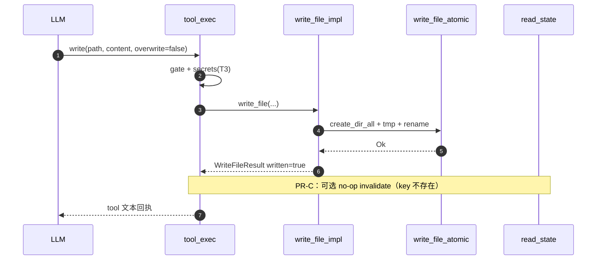
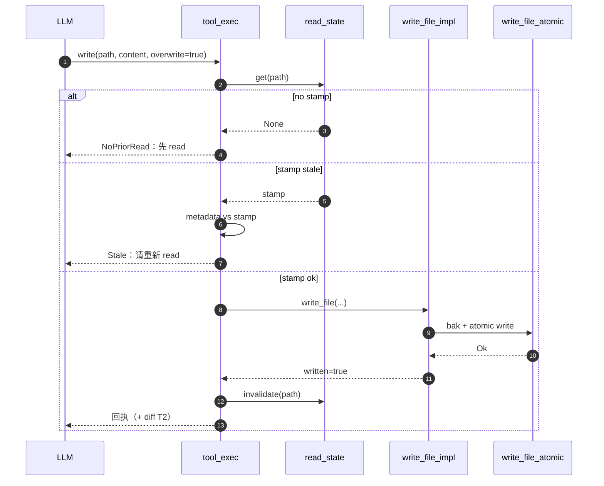

# `write` 工具：覆盖策略、陈旧检测与落盘契约

本文档是内置工具 **`write`**（当前 catalog / `tool_exec` 仍为 `write_file`，见 §12）的冻结版技术方案（OpenSpec **B 类**：`docs/architecture/tools/`），承接主计划 [strengthen-four-core-tools_b51c9eae.plan.md](../../../../../.cursor/plans/strengthen-four-core-tools_b51c9eae.plan.md) §0.3（W1–W7）、§2.2 **PR-C**、§3.2 **PR-G**、§4.2 **T3-K**，以及调研 [agent-tools-comparison.md](../../reports/agent-tools-comparison.md) §3 维 7 / §6「Write 安全」。**已定稿目标行为**与 **待合入 PR** 在 **§3.4** 总表区分，细节见 **§3.4.1** 起；**实现以合入后的仓库代码为准**。

**兄弟 spec**：[read.md](read.md)（`ReadFileState`、`ReadStamp`、`FILE_UNCHANGED`、dedup）；[edit.md](edit.md)（同表 staleness、`NoPriorRead` 与 write 同 PR 节奏、secrets T3-K）；[search_files.md](search_files.md)（先定位再写的工作流）。

**表格末列**（对齐 [ARCHITECTURE_SPEC.md](../../openspec/specs/guides/workflow/ARCHITECTURE_SPEC.md) **§4.1 / §14.1**）：**§3.3** 落地选型决策表 **`决策`** 列（每行一句裁决结论）；其他高密度表末列 **`说人话`**。图、状态机后附 **2–5 句**口语串链路。**禁止**用口语或裁决句替代技术定义正文列。

---

## 目录

- [1. 目标与设计原则](#1-目标与设计原则)
- [2. 术语统一](#2-术语统一)
- [3. 竞品 / 选型对比](#3-竞品--选型对比)
  - [3.1 Agent 写文件的典型关切](#31-agent-写文件的典型关切)
  - [3.2 常见实现横向对比（W1–W7）](#32-常见实现横向对比w1w7)
  - [3.3 落地选型决策表](#33-落地选型决策表)
  - [3.4 实施点（排期与状态）](#34-实施点排期与状态)
    - [3.4.1 PR-命名：短名 `write`](#341-pr-命名短名-write)
    - [3.4.2 PR-C（T1）：overwrite / staleness / invalidate](#342-pr-ct1overwrite--staleness--invalidate)
    - [3.4.3 PR-G（T2）：LF 与回执](#343-pr-gt2lf-与回执)
    - [3.4.4 T3-K（write 侧）：secrets](#344-t3-kwrite-侧secrets)
- [4. 协议（入参 / 出参 / Schema）](#4-协议入参--出参--schema)
- [5. One-Glance Map（文件职责总览）](#5-one-glance-map文件职责总览)
- [6. 调度时序（运行时图）](#6-调度时序运行时图)
- [7. 状态机与决策表](#7-状态机与决策表)
- [8. 配置与环境变量](#8-配置与环境变量)
- [9. 错误模型](#9-错误模型)
- [10. 测试矩阵（验收）](#10-测试矩阵验收)
- [11. 风险与应对](#11-风险与应对)
- [12. 历史决策与现状差距](#12-历史决策与现状差距)
- [13. 关联文档](#13-关联文档)

---

## 1. 目标与设计原则

**一句话**：在 **权限门（gate）** 与 **会话级 read 指纹** 约束下，让模型 **整文件创建或覆盖** 时 **语义可预测**（`overwrite` 真生效）、**磁盘可恢复**（原子写 + 可选备份）、**与 `read` / `edit` 陈旧叙事一致**，而不是「schema 写了 `overwrite` 却仍静默覆盖」。

**说人话**：别让模型**默覆盖**、**按旧缓存写**、**把密钥写进仓库**；默认「只新建」，要盖盘先证明自己读过且盘没变，写完把会话里的「读过」缓存清掉。

| 原则（可观察） | 说明 | 说人话 |
| --- | --- | --- |
| **单名对外** | catalog 仅注册 **`write`**；`write_file` 得到与拼错名一致的**未知工具**类错误（与 [read.md](read.md) PR-RA、[edit.md](edit.md) §2.4.2 口径一致） | 工具就叫 `write`，老名字别指望还能悄悄执行。 |
| **`overwrite` 真语义** | `overwrite=false` 且路径已存在 → **拒绝写盘**；`overwrite=true` 才允许替换已有文件 | 默认**不许**盖掉已有文件；真要盖，先把开关打开。 |
| **覆盖写前陈旧校验** | 目标已存在且 `overwrite=true`：须有 [`ReadFileState`](../../../../src/core/tools/pipeline/read_state.rs) 中该 path 的 stamp，且当前 `metadata` 的 `mtime_ms` + `size` 与 stamp **一致**；否则 `Stale` / `NoPriorRead`（与 [edit.md](edit.md) §9、`read_state.rs` 头注释一致） | 盖盘前得证明你**刚读过**这文件，而且磁盘**还没被别人动过**。 |
| **原子落盘** | 经 [`write_file_atomic`](../../../../src/infra/platform/mod.rs)：`create_dir_all` + 临时文件 + `rename`（W1/W2） | 先写到临时文件再一把换名，中间崩了也不会留下半拉子正文。 |
| **备份策略** | `overwrite=true` 且文件已存在：写前复制到 `path.bak`（与现状 [write_edit.rs](../../../../src/core/tools/primitive/executor/write_edit.rs) 一致）；校验失败路径不得制造孤儿 `.bak`（覆盖写若引入「先校验再备份」须与此对齐） | 真要覆盖，先悄悄留一份 `.bak`，写挂了还能往回捞。 |
| **写后会话表** | 成功写入后用 **与 read 入栈同形的 key**（即 `gate_check_path` 返回的 `path_buf`，**不**额外 `fs::canonicalize`）调用 **`ReadFileState::invalidate`**，避免下一轮 `read` 误命中 **过时** `FILE_UNCHANGED`（见 §7） | 写完了就把「上次读过」那张条子撕掉，别让模型以为文件还是旧样子。 |
| **大段 vs 手术刀** | 新文件或全文替换优先 `write`；小范围精确替换优先 `edit`（与 catalog 文案一致） | 整篇重写用 `write`，改一两行用 `edit`，别反着来。 |

### 1.1 观察指标表（与 §10 验收一一对应）

| 目标 | 观察指标（落地后可核对） | 说人话 |
| --- | --- | --- |
| G1 工具名统一 | catalog / `tool_exec` 仅 `write`；`write_file` → 未知工具错误 | 搜全仓只能看到一个对外的 `write`。 |
| G2 `overwrite=false` | 路径已存在 → 拒绝，磁盘不变 | 没说「可以盖」就别动已有文件。 |
| G3 `overwrite=true` + 已存在 | 无 stamp → `NoPriorRead`；stamp 与磁盘不一致 → `Stale` | 要覆盖？先 `read` 一下；别人改过盘？那就让你再读一遍。 |
| G4 原子写 | 崩溃语义：目标路径不出现半截 UTF-8（由 `write_file_atomic` 保证） | 进程半路死掉也不会留下读一半就断气的文件。 |
| G5 父目录 | 中间目录不存在时自动创建 | 中间文件夹没有就自动建好，别让用户先 `mkdir`。 |
| G6 写后 dedup 安全 | 成功后 `invalidate(path)`（或文档化等价策略） | 写完别还假装「跟上次读的一样」——缓存条必须废掉。 |
| G7 T2：LF 规范化 | **默认开** `\r\n → \n`；可由 `[tools.write] normalize_crlf=false` 关闭则保留模型字节（与 §3.3、§8 一致） | Windows 换行**默认收成 `\n`**；不想统一就把配置关掉。 |
| G8 T2：回执 | 成功消息中带 **字节数**；可选 **unified diff 摘要**（相对写前快照） | 告诉模型写了多少字节，必要时再给几行 diff 当收据。 |
| G9 T3：secrets | 对 `content` 扫描；命中走与 `edit` 一致的 **confirm / deny**（见 [secrets.rs](../../../../src/core/security/secrets.rs)） | 别把 API 钥匙写进仓库；扫到了要么拦要么让人点确认。 |

### 1.2 非目标

| 非目标 | 说明 | 说人话 |
| --- | --- | --- |
| **LSP `didChange` / `didSave`** | 无语言服务器后端；不触发 IDE 侧同步 | 我们不冒充 IDE 去通知语言服务。 |
| **整段 git / scm 集成** | 不写「自动 commit」；最多在回执中给 **文本 diff**（PR-G） | 不帮你自动 `git commit`，最多给段文字 diff 看看。 |
| **`write_file` 运行时别名** | 不重定向；transcript 仅 `warn`（同 `read` / `edit`） | 老录音里叫 `write_file` 只打个日志，不当真执行。 |
| **UTF-16 / 多编码自动转** | 本期 `content` 按 **UTF-8 字符串** 入参；与 `read` 文本路径一致 | 本期只玩 UTF-8 字符串，别指望工具自动猜编码。 |
| **复刻 cc-fork 全量 structuredPatch + gitDiff** | 仅采纳「结构化回执」思路，控制体积与依赖 | 抄作业抄精华，不把人家整条产品线搬进仓库。 |

---

## 2. 术语统一

对齐 [ARCHITECTURE_SPEC.md](../../openspec/specs/guides/workflow/ARCHITECTURE_SPEC.md) **§1 术语统一（MUST）**：先钉死用词，再读 **§4** 已定稿选型与 **§5** 协议，避免「overwrite / stamp / invalidate」与兄弟工具文档各说各话。

| 术语 | 语义 | 数据载体 / 约束 | 说人话 |
| --- | --- | --- | --- |
| **`overwrite`** | 是否允许替换**已存在**文件 | JSON boolean；**缺省 `false`**（与 schema description 一致） | 「能不能盖已有文件」的**总闸**；不写就默认**不盖**。 |
| **`NoPriorRead`** | 会话表无该 path 的成功 read stamp | `ReadFileState::get` 为 `None` 且策略要求先 read | 会话里**从没成功读过**这个路径，就别想覆盖写。 |
| **`Stale`** | 有 stamp，但当前 `metadata` 的 `mtime_ms`/`size` 与 stamp 不一致 | 与 [read.md](read.md) §1、`edit` §9 同名 | 你读过之后**磁盘又变了**（别人改、git 切分支等），先别写。 |
| **`atomic_write`** | 临时文件写入 + `rename` 到目标路径 | [`write_file_atomic`](../../../../src/infra/platform/mod.rs) | 「要么整文件换上去，要么别动旧文件」那种**一次性落盘**。 |
| **`invalidate`** | 写成功后移除该 path 的 stamp，强制后续 `read` 重新读盘 | [`ReadFileState::invalidate`](../../../../src/core/tools/pipeline/read_state.rs) | 写完了**忘掉旧指纹**，逼下一轮 `read` 真读盘。 |
| **与 `edit` 边界** | 全文已知、新建文件 → `write`；局部替换、保留上下文行 → `edit` | catalog `description` | 整篇换血用 `write`，抠几个字用 `edit`。 |

**行为约束（与三件套对齐）**：`overwrite=false` 时 **never** 覆盖已存在路径；`overwrite=true` 且 path exists 时 **must** 通过 `ReadStamp` 快路径校验后再写；写成功 **must** `invalidate`（见 §7）；`NoPriorRead` / `Stale` 与 [edit.md](edit.md) §10.2 **同一 PR 节奏**打开强门禁时须与 `edit` 文案一致。

---

## 3. 竞品 / 选型对比

### 3.1 Agent 写文件的典型关切

```text
┌────────────────────────────────────────────────────────────────────────────┐
│  本地 write 工具通常要同时解决的四类问题                                    │
├────────────────────┬─────────────────────────────────────────────────────┤
│  覆盖策略          │  默认创建 vs 显式覆盖；误覆盖成本极高                        │
│  陈旧 / 并发       │  模型上下文相对磁盘已旧 → 需要 read 指纹与 mtime/size 快路径    │
│  落盘可靠性        │  半截写、父目录缺失、备份与回滚                             │
│  安全与可观测      │  密钥误写入仓库、审计、写后 diff 提示                        │
└────────────────────┴─────────────────────────────────────────────────────┘
```

**说人话**：写文件最怕四件事——**手滑覆盖**、**脑子里的版本比磁盘旧**、**写到一半崩了**、**把密钥写进仓库**。本方案用 **`overwrite` + read 指纹** 管前两件，用 **原子写 + 可选 `.bak`** 管第三件，用 **secrets 扫描** 管第四件；和 **`read` / `edit`** 共用同一张会话表，避免各说各话。

### 3.2 常见实现横向对比（W1–W7）

维度定义与主计划 §0.1 一致：**W1** 原子写、**W2** 父目录、**W3** 覆盖控制、**W4** staleness、**W5** 密钥扫描、**W6** 编码与行尾、**W7** 写后回执。

| 维度 | tomcat（目标） | pi-mono | pi_agent_rust | openclaw | hermes-agent | cc-fork-01 | 说人话 |
| --- | --- | --- | --- | --- | --- | --- | --- |
| W1 | `write_file_atomic`（temp + rename） | 直接 `writeFile` | tempfile + persist | 宿主沙箱策略 | 依 `file_ops` | 业务层关键区 + 落盘语义 | 我们跟 Rust 线一样：**先 tmp 再 rename**，不整半截文件。 |
| W2 | `create_dir_all` 在 atomic 内 | `mkdir` | `create_dir_all` | 沙箱内 | 自动 | `fs.mkdir` | 父目录**顺手建好**，别指望模型先 `mkdir -p`。 |
| W3 | **`overwrite` 显式**（目标）；现状 gap 见 §12 | 无独立字段（覆盖即写） | 无 | 策略可配 | 路径锁 + 敏感路径 | **必须先 read** + 状态校验 | 各家对「能不能盖」说法不一；我们钉死：**默认不盖，要盖先 read + 开关**。 |
| W4 | 与 `read` 共用 `ReadFileState` | 无 | 无 | 策略层 | mtime + 多 agent 提示 | mtime + 内容 fallback | **跟 read 同一张指纹表**，改盘前对一下「还是不是你读的那份」。 |
| W5 | T3：`secrets::scan`（与 edit 共用） | 无 | 无 | 扩展 | 拒绝「状态文案」类写入 | `checkTeamMemSecrets` 模式 | 写入前**扫一眼像不像密钥**；跟 `edit` 一条规矩。 |
| W6 | T2：CRLF→LF **默认开**，由 `[tools.write] normalize_crlf` 关闭 | UTF-8 字节 | code-units 与 pi-mono 对齐 | 配置 | — | 强制 LF 等 | 换行符**默认收成 `\n`**；想保留模型字节把配置关掉，别静默乱改编码。 |
| W7 | T2：字节数 + 可选 `build_simple_diff` 式摘要 | `content.length` | 字节数 | — | JSON 警告字段 | structuredPatch + gitDiff 思路 | 写完了告诉模型**写了多少**；有余力再给点 **diff 摘要**当收据。 |

### 3.3 落地选型决策表（维度取舍）

**代码落点、交付物、阶段**见 **[§3.4](#34-实施点排期与状态)**，与 [`ARCHITECTURE_SPEC.md`](../../openspec/specs/guides/workflow/ARCHITECTURE_SPEC.md) **§4.1 / §4.2** 分工一致。**`决策`** 列钉本行裁决结论（**SHOULD**）。

| 维度 | 关切 | 决策 | 取自 | 入选理由 | 未入选 + 拒因 | 说人话 |
| --- | --- | --- | --- | --- | --- | --- |
| **已存在文件 + overwrite** | `overwrite=true` 时 stamp 是否可信 | **采用** 先 `read` + `check_stamp`；**拒绝** primitive 隐式读盘。 | cc-fork | 编排层要求模型先 `read`；`overwrite=true` 时 `check_stamp` 与 read 共用 `ReadFileState` | × 在 primitive 内藏「隐式 read」凑 stamp | 不许工具偷偷帮你读盘凑 stamp；**模型自己先 `read`**。 |
| **原子写** | 是否重写落盘 IO | **采用** 沿用 `write_file_atomic`；**拒绝** 为对齐重写 IO。 | 现状 + pi_agent_rust | 审计、`.bak`、错误路径已在 primitive 收敛 | × 为「对齐」重写 IO | 落盘方式**已经够用**，别为了对齐而重写一套 IO。 |
| **写后 stamp** | dedup 与真实磁盘是否一致 | **采用** 写成功后 `invalidate(path)`。 | `read_state.rs` 设计 + cc-fork 思路 | 写成功后 `invalidate(path)`，避免 `FILE_UNCHANGED` 与磁盘脱节 | × 保留旧 stamp | 写完就把「读过」的条子撕掉，**别骗 dedup**。 |
| **LF 规范化** | CRLF 默认行为与 schema 面 | **采用** `normalize_crlf` 仅全局配置。 | cc-fork 行尾策略 | `[tools.write] normalize_crlf` **仅**全局配置；与主计划 PR-G 一致 | × 静默改 UTF-16；× per-call schema 字段让模型多一维 | 默认把 `\r\n` 收成 `\n`，团队想保留**改全局配置**，别给每次调用塞开关。 |
| **diff 回执** | 写后如何让模型看见 delta | **采用** 内存 short unified diff。 | edit 已引用 diff 模块 | 成功回执可选短 unified diff（写前快照 vs 新 content） | × 依赖 git binary | 给模型看「改了啥」用**内存里 diff 几句**就行，别绑 `git`。 |
| **secrets** | 全文件 `content` 是否过密钥钩子 | **采用** `scan(content)` + confirm gate。 | cc-fork（T3-K） | `scan(content)`；编排层与 `edit` 共用 `secrets` + confirm gate | × 重型 SaaS 扫描器 | 轻量正则集 + **命中走确认**；不搞企业级扫描器。 |

### 3.4 实施点（排期与状态）

| 实施点 | 交付范围（含交付物） | 主要代码落点（含落地点） | 验收锚点（示例） | 状态 | 说人话 |
| --- | --- | --- | --- | --- | --- |
| **PR-命名** | **交付物**：catalog / `tool_exec` / `system_prompt` / 测试仅 `write`；legacy **warn**。**落地点**：对外短名与 match 表 | [`catalog.rs`](../../../../src/core/tools/contract/catalog.rs)、[`tool_exec.rs`](../../../../src/core/agent_loop/tool_exec.rs)、[`system_prompt.rs`](../../../../src/core/llm/system_prompt.rs)、测试字面量 | 与 G1 一致：`tool_exec_legacy_write_file_returns_unknown_tool_error`（命名合入后补） | ⏳ 待 PR-A | 把名字改短，和 `read`/`edit` 一排站齐。 |
| **PR-C（T1）** | **交付物**：`overwrite` 语义；stamp 校验；`invalidate`。**落地点**：`tool_exec` write 分支、`read_state`、必要时 `write_edit` 拆校验 | `tool_exec.rs` `write` 分支、[`read_state.rs`](../../../../src/core/tools/pipeline/read_state.rs)、必要时 [`write_edit.rs`](../../../../src/core/tools/primitive/executor/write_edit.rs) | `write_overwrite_false_blocks_existing`、`write_requires_prior_read_when_existing`、`write_rejects_when_mtime_changed_after_read`、`write_success_invalidates_read_stamp` | ⏳ 待 PR-C | **第一刀**：别瞎覆盖、别按旧上下文写、写完别卡 dedup。 |
| **PR-G（T2）** | **交付物**：可选 CRLF→LF；字节数 + 可选 diff 摘要。**落地点**：normalize 小函数 + `[tools.write]` | `write_edit.rs` 或独立 normalize 小函数、`infra/config` `[tools.write]` | `write_normalizes_crlf_when_enabled`、`write_result_includes_byte_count_and_diff_hint` | ⏳ 待 PR-G | **第二刀**：行尾好读一点，回执让模型心里有数。 |
| **T3-K（write 侧）** | **交付物**：`content` 过 `secrets::scan` + confirm。**落地点**：`tool_exec` 或 `write_file_impl` 前编排 | `tool_exec.rs` 或 `write_file_impl` 前编排 | `write_secrets_hit_denied_*`、`write_secrets_pass_when_no_hit`（命名对齐 edit 现有用例风格） | ⏳ 待 write 编排接入（`edit` 已部分落地） | **第三刀**：整文件内容也要过密钥扫描，和 `edit` 一条绳。 |

下文按实施点展开**技术要点**与**数据流示意**；**交付边界与代码落点仍以上表为准**，避免与表冲突。写法对齐 [ARCHITECTURE_SPEC.md](../../openspec/specs/guides/workflow/ARCHITECTURE_SPEC.md) **§4.2** 硬约束 1（表后拆小节；范例 [`read.md`](read.md) **§4.2.1** 起；本文件对应 **§3.4.1** 起）。**端到端泳道**见图：**§6**；**分支组合**见：**§7**。

#### 3.4.1 PR-命名：短名 `write`

- **交付**：`BUILTIN_TOOL_CATALOG` 与 `tool_exec` 仅匹配 `"write"`；`"write_file"` 走未知工具路径；`system_prompt` / 测试断言同步短名。
- **回放**：与 [read.md](read.md) PR-RA 一致——transcript 中 legacy 名 **`tracing::warn`**，不重定向执行。

```text
  LLM / transcript
        │
        ▼
┌───────────────────┐     注册名仅 "write"
│  catalog.rs       │──────────────────────────────┐
└───────────────────┘                              │
        │                                            ▼
        ▼                               ┌────────────────────┐
  tool_exec  match "write"               │ "write_file" 等   │
        │                                │ → UnknownTool 错误 │
        ▼                                └────────────────────┘
  正常 write 路径
```

#### 3.4.2 PR-C（T1）：overwrite / staleness / invalidate

- **`overwrite=false` 且 `path.exists()`**：在 `tool_exec` 或 `write_file_impl` 入口 **拒绝**，返回结构化 `Exists`（或等价 `AppError::Tool`），**不调** `write_file_atomic`。
- **`overwrite=true` 且 exists**：用 `gate_check_path` 返回的 `path_buf` 作 key 调 `ReadFileState::get(&path_buf)` → 无则 `NoPriorRead`；有则对 `path_buf` 取 `fs::metadata` 与 stamp 比 `mtime_ms` + `size` → 不一致则 `Stale`。
- **写成功**：以同一 `path_buf` 调 `ReadFileState::invalidate(&path_buf)`，避免 [read.md](read.md) `FILE_UNCHANGED` 与真实磁盘脱节。**Key 形式 MUST 与 read 入栈一致**——`read_state` 是 `RwLock<HashMap<PathBuf, _>>`，未做 `canonicalize`；write 端额外 `canonicalize` 会与 read 端 key 不匹配，导致 invalidate 落空。
- **primitive**：仅在「校验已全部通过」后调用现有 `write_file_atomic`；`.bak` 逻辑保持与 [write_edit.rs](../../../../src/core/tools/primitive/executor/write_edit.rs) 现状一致。

```text
  write(args) ──▶ gate
        │
        ├─ exists && !overwrite ──▶ Reject（磁盘不动）
        │
        ├─ exists && overwrite ──▶ stamp 校验 ──┬─ fail ──▶ NoPriorRead / Stale
        │                                      └─ ok ──▶ write_file_atomic
        │
        └─ !exists ──────────────▶ write_file_atomic（新建）

  成功路径末尾 ──▶ read_state.invalidate(path)
```

**见图**：覆盖写完整消息序 **§6.2**；组合真值表 **§7.2**。

#### 3.4.3 PR-G（T2）：LF 与回执

- **LF**：在 `content` 进入 `write_file_atomic` 之前 `normalize_crlf` **默认开**，由 `[tools.write] normalize_crlf=false` 关闭（**仅**全局配置，不引入 per-call 字段；与 §3.3、§4.1、§8 一致）；关则字节原样写入。
- **回执**：工具结果字符串携带 `created|updated`、UTF-8 **字节数**；可选调用 [`build_simple_diff`](../../../../src/core/tools/primitive/diff.rs) 对「写前快照 vs 新 content」生成短 unified diff（写前快照须在 stamp 校验通过后读取，避免多余 IO 与竞态——顺序与 §4.2 一致）。

**见图**：成功路径上的回执拼接可与 **§6** 中 `E-->>L` 一步对照（合入后以代码为准）。

#### 3.4.4 T3-K（write 侧）：secrets

- **编排点**：在 `write_file_atomic` 之前对 **`content`** 调用 [`secrets::scan`](../../../../src/core/security/secrets.rs)（与 `edit` 的 `new_content` 扫描同库）。
- **命中**：走 `PermissionGate` / `confirm` 与 `edit` 已落地路径一致；拒绝时磁盘不变。

**见图**：与 **§5** 中 `tool_exec` 节点「secrets::scan」边一致；错误语义见 **§9**。

---

## 4. 协议（入参 / 出参 / Schema）

**单一事实源**：JSON Schema 由 [`catalog.rs::write_file_parameters`](../../../../src/core/tools/contract/catalog.rs) 生成（迁移完成后改名为 `write_parameters`，本文表格同步更名）。

### 4.1 入参（工具 arguments）

| 字段 | JSON 类型 | 必填 | 默认 | 说明 | 说人话 |
| --- | --- | --- | --- | --- | --- |
| `path` | string | **是** | — | 绝对或相对路径；经 `PermissionGate` Write | 写哪**个文件**；没授权会被拦。 |
| `content` | string | **是** | — | 完整文件内容（UTF-8） | 文件**全文**长什么样，一次性塞进来。 |
| `overwrite` | boolean | 否 | **`false`** | `false`：路径已存在则**不得**写；`true`：允许覆盖，但须满足 §7 陈旧策略 | 默认**只建新的**；要盖旧文件得显式 `true` 且先满足「读过 + 没陈旧」。 |

**计划字段（PR-G）**：**不**新增 per-call 字段；LF 规范化仅由全局配置 `[tools.write] normalize_crlf` 控制（与 §3.3 决策表一致，避免 schema 多一维让模型混淆；pi-mono / cc-fork 均无 per-call LF 字段）。配置语义见 §8。

### 4.2 出参（工具结果文本 / 结构化）

**现状**：`tool_exec` 返回纯中文短句「已写入: path」/「写入被拒绝: path」（见 [`tool_exec.rs`](../../../../src/core/agent_loop/tool_exec.rs)）。

**目标（PR-G）**：

- 始终包含：**操作类型**（`created` \| `updated`）、**路径**、**写入字节数**（UTF-8 字节长度）。
- 可选：`diff_summary` 或内嵌几行 unified diff（对**写前磁盘快照**；写前快照仅在 `overwrite=true` 时需要读取一次以生成 diff，注意与 staleness 校验顺序：先 `metadata` 对 stamp，再读全文算 diff）。

未定稿字段在实现 PR 合入前以代码为准。

**说人话**：入参就三件事——**路径**、**全文**、**要不要覆盖**；出参从「一句已写入」进化成「**新建还是更新** + **多少字节** + 可选 **diff 小票**」，方便模型下一轮 reasoning。

### 4.3 调用样例（jsonc）

**新建文件（默认不覆盖）**：

```jsonc
{
  "path": "src/new_module.rs",
  "content": "pub fn f() {}\n"
}
```

**覆盖已存在文件（须先 read + stamp 有效）**：

```jsonc
{
  "path": "src/lib.rs",
  "content": "// entire new file\n",
  "overwrite": true
}
```

---

## 5. One-Glance Map（文件职责总览）

```text
┌────────────────────────────────────────────────────────────────────────────┐
│  src/core/llm/system_prompt.rs                                             │
│  • 引导：新文件 write；大改 write；小改 edit；覆盖须 overwrite=true + 先 read   │
└────────────────────────────────────────────────────────────────────────────┘
        │
        ▼
┌────────────────────────────────────────────────────────────────────────────┐
│  src/core/tools/contract/catalog.rs                                        │
│  • BUILTIN_TOOL_CATALOG：`name = "write"`，`write_parameters()` JSON Schema │
└────────────────────────────────────────────────────────────────────────────┘
        │
        ▼
┌────────────────────────────────────────────────────────────────────────────┐
│  src/core/agent_loop/tool_exec.rs                                          │
│  • match `"write"`：解析 path/content/overwrite                             │
│  •（PR-C）exists && overwrite → check_read_stamp(path)                      │
│  •（T3-K）secrets::scan(content) → confirm 流                              │
└───────────────────────────────┬────────────────────────────────────────────┘
                                │
                                ▼
┌────────────────────────────────────────────────────────────────────────────┐
│  src/core/tools/primitive/executor/write_edit.rs :: write_file_impl        │
│  • gate_check_path(Write) →（PR-G 可选）normalize → write_file_atomic     │
│  • overwrite=true 且 exists：.bak 备份（现状）                              │
└───────────────────────────────┬────────────────────────────────────────────┘
                                │
                                ▼
┌────────────────────────────────────────────────────────────────────────────┐
│  src/infra/platform/mod.rs :: write_file_atomic                            │
│  • create_dir_all(parent) → write tmp → rename                             │
└───────────────────────────────┬────────────────────────────────────────────┘
                                │
                                ▼
┌────────────────────────────────────────────────────────────────────────────┐
│  src/core/tools/pipeline/read_state.rs                                     │
│  • 写成功后 ReadFileState::invalidate(&path_buf)                            │
│  • Key 形式与 read 入栈同形（gate 返回的 PathBuf；不额外 canonicalize）        │
└────────────────────────────────────────────────────────────────────────────┘
```

**阅读顺序（说人话）**：模型发起调用后，**prompt/catalog** 只负责「叫什么、长什么样」；真干活在 **`tool_exec`**（权限、陈旧、密钥）；**`write_file_impl`** 做 gate 与写盘；**`write_file_atomic`** 保证目录存在且原子替换；最后 **`read_state`** 记得**擦掉旧指纹**，别让 `read` 的「没变」短路撒谎。

---

## 6. 调度时序（运行时图）

### 6.1 新建文件（路径不存在）



**说人话**：新文件路径还不存在时，流程最直——过 gate（和将来的 secrets）→ 原子落盘 → 回一句成功；**不用**跟 `read_state` 较劲（表里本来就没有这条 key）。

### 6.2 覆盖已存在文件（`overwrite=true`）



**说人话**：要盖已有文件，**先看会话里有没有「读过」的记录**；没有就回去 `read`。有记录就对一下 **mtime/size**，对不上说明磁盘变了，**再 read**。都对上了才写，写完 **invalidate**，下一轮别偷懒用旧 stub。

---

## 7. 状态机与决策表

### 7.1 写路径决策（简化）

```text
                    ┌──────────────┐
         请求 ─────▶│ Gate + Args  │──非法──▶ Reject (Tool/参数)
                    └──────┬───────┘
                           │ OK
                           ▼
                    ┌──────────────┐
                    │ path exists? │
                    └──────┬───────┘
              ┌─────────────┴─────────────┐
              ▼ no                        ▼ yes
       ┌──────────────┐            ┌──────────────┐
       │ overwrite?   │            │ overwrite?   │
       │ (无关，创建)  │            └──────┬───────┘
       └──────┬───────┘                   │
              │                      ┌──────┴──────┐
              │                      ▼ false       ▼ true
              │               ┌──────────┐  ┌──────────────┐
              │               │ Reject   │  │ StampCheck   │
              │               │ Exists   │  └──────┬───────┘
              │               └──────────┘         │
              │                           ┌────────┴────────┐
              │                           ▼ fail            ▼ ok
              │                    ┌──────────┐      ┌──────────────┐
              │                    │ Reject   │      │ AtomicWrite │
              │                    │Stale/NoPR│      └──────┬───────┘
              │                    └──────────┘             │
              └──────────────────────────┬──────────────────┘
                                         ▼
                                  ┌──────────────┐
                                  │ invalidate   │
                                  └──────────────┘
```

**说人话**：这张图就是「**先过门** → **看文件在不在** → **在的话问允不允许盖** → **允许盖再对指纹** → **最后真写盘并撕条子**」；任何一步不对都**别碰磁盘**（除了已允许的创建路径）。

### 7.2 组合表

| `exists` | `overwrite` | stamp | `mtime+size` vs stamp | 结果 | 说人话 |
| --- | --- | --- | --- | --- | --- |
| false | any | — | — | 允许写（创建） | 新文件：**直接建**。 |
| true | false | — | — | **拒绝**（不得覆盖） | 文件已在、又没允许覆盖：**别动**。 |
| true | true | 无 | — | `NoPriorRead`（PR-C 策略） | 想盖却没读过：**先去 read**。 |
| true | true | 有 | 不一致 | `Stale` | 读过但盘又变了：**再 read 一次**再写。 |
| true | true | 有 | 一致 | 允许写 → **invalidate** | 条件齐活：**允许盖**，盖完**撕指纹**。 |

**与 [edit.md](edit.md) §10.2 的对齐**：`edit` 在 Phase1 对无 stamp **不**单边硬拒；**write 覆盖**路径应在 **PR-C** 与 **T2-P0-016** 中与 `edit` 统一「强门禁」节奏，避免双工具语义分叉。

---

## 8. 配置与环境变量

**总则**：`env > config > 默认`（与仓库全局约定一致；键未实现前本节为规划）。

| 来源 | 键（规划） | 含义 | 说人话 |
| --- | --- | --- | --- |
| `tomcat.config.toml` | `[tools.write] normalize_crlf` | 是否在写入前将 `\r\n` 规范为 `\n`（PR-G）；**默认 `true`** | 默认把 Windows 换行统一成 `\n`；想原样保留就置 `false`。 |
| `tomcat.config.toml` | `[tools.write] max_content_bytes` | 可选：单请求 `content` 字节上限（对齐 pi_agent_rust 思路时再定默认） | 防止模型**一次塞爆** wasm/主机内存。 |
| 代码常量 | 与 `edit` 共享的 secrets / 大小类常量 | 见 [`secrets.rs`](../../../../src/core/security/secrets.rs) 与 `edit.md` §8 | 密钥长啥样、单请求能多大，**跟 edit 共用一套天花板**。 |

**说人话**：§8 还没全进代码前，当作「**以后要在 tomcat.config.toml 里露哪些旋钮**」的清单；真合入了再以 `infra/config` 类型为准。

---

## 9. 错误模型

| 逻辑名 | 触发条件 | 模型侧恢复 | 说人话 |
| --- | --- | --- | --- |
| `Exists` | `overwrite=false` 且路径已存在 | 改用 `overwrite=true` 或换路径；若意图覆盖须先 `read` | 文件在那儿呢，你又没说能盖——**要么换名要么先 read 再申请覆盖**。 |
| `NoPriorRead` | `overwrite=true` 且 exists 但无 stamp | 先 `read(path)` 再 `write` | **盲写不允许**；先读盘，会话里才有条子。 |
| `Stale` | stamp 与磁盘 `mtime`/`size` 不一致 | 重新 `read` 再带 `overwrite=true` | 你脑子里的版本**过期了**，别用旧内容盖盘。 |
| `SecretsRejected` | T3-K：`scan(content)` 命中且用户未确认（与 [edit.md](edit.md) 同名，对应 [`write_edit.rs`](../../../../src/core/tools/primitive/executor/write_edit.rs) `edit_file_impl` 中 `scan_new_content_for_secrets` 的拒绝路径） | 删敏后重写或走确认流 | 内容里像藏着钥匙——**要么改掉要么让用户点头**。 |
| `PermissionDenied` | gate 拒绝 | 调整 workspace / 规则或用户授权 | 路径/workspace **不让写**，找用户或改规则。 |
| `Io` | `create_dir_all` / rename 失败 | 检查磁盘、配额、只读挂载 | 盘满了、只读了、rename 失败了——**纯运维问题**。 |

错误载体：与 `edit` 一致优先 **结构化** `AppError::Tool` 或可解析前缀，便于 UI 与模型自愈（具体字符串以 PR-C 单测锁定为准）。

**说人话**：错误码不是为了骂模型，是为了告诉它**下一步该干啥**——先读、再读、改权限、删密钥、或者承认磁盘 IO 挂了。

---

## 10. 测试矩阵（验收）

### 10.1 矩阵

| 维度 | 用例（规划或已有） | 所在模块 / 文件 | 状态 | 说人话 |
| --- | --- | --- | --- | --- |
| 原语 happy path | `write_file_success` | [`suite_test.rs`](../../../../src/core/tools/primitive/tests/suite_test.rs) | ✅ 现状 | 最基础的「能写上盘」回归。 |
| 备份 | `write_file_overwrite_creates_backup` | `suite_test.rs` | ✅ 现状 | 覆盖写时 **`.bak` 真的出现**。 |
| 权限 / gate | `write_file_user_denied_*`、`gate_suite_test` 写路径 | `suite_test.rs`、`gate_suite_test.rs` | ✅ 现状 | 没授权就**别写**，审计要对得上。 |
| **PR-C** | `write_overwrite_false_blocks_existing` | `suite_test.rs` 或 `tool_exec` 集成 | ⏳ | 默认 **不许盖** 已有文件。 |
| **PR-C** | `write_requires_prior_read_when_existing`、`write_rejects_when_mtime_changed_after_read` | `tool_exec_dedup_test.rs` | ⏳ | **先读后写**、**陈旧就拒**。 |
| **PR-C** | `write_success_invalidates_read_stamp`（先 read → write → read 不得 FILE_UNCHANGED 于旧内容） | `tool_exec_dedup_test.rs` | ⏳ | 写完 **dedup 不能撒谎**。 |
| **PR-G** | `write_normalizes_crlf_when_enabled` | `suite_test.rs` | ⏳ | 换行规范化**可开可关**且行为对。 |
| **PR-G** | `write_result_includes_byte_count_and_diff_hint` | `tool_exec` 或 snapshot 测 | ⏳ | 回执里**数字要对**，diff 摘要也要附上。 |
| **T3-K** | `write_secrets_*`（对齐 `edit_secrets_*` 编排） | `suite_test.rs`、`tool_exec_dedup_test.rs` | ⏳ | 密钥命中与放行路径**跟 edit 一致**。 |
| **命名 G1** | `tool_exec_legacy_write_file_returns_unknown_tool_error` | `submodules_test.rs` 等 | ⏳ | 老工具名 **不能悄悄还能用**。 |

§1.1 观察指标表与本表可逐行对照（G1–G9）。

---

## 11. 风险与应对

| 风险 | 影响 | 应对 | 说人话 |
| --- | --- | --- | --- |
| **invalidate 遗漏** | `FILE_UNCHANGED` 基于旧 mtime 短路，模型误判 | PR-C 单测强制：write 后必须 `invalidate` 或 `put` 新指纹（若选 put，须再读一次算 hash，成本更高；**推荐 invalidate**） | 忘了撕条子 → 模型以为文件**还跟上一眼一样**。 |
| **与 `edit` 竞态** | 同一轮次交替写同一文件 | 文档与 prompt：优先单一工具链；staleness 至少防「读旧写新」 | 别同一会话里对同一文件 **又 write 又 edit 乱炖**；至少 staleness 挡读旧。 |
| **大 `content` 内存** | wasm 堆压力 | 配置 `max_content_bytes`；提示分段 `edit` | 一次塞几兆字符串会**撑爆**；该切文件或改策略。 |
| **`touch -r` 保留 mtime** | 极端陈旧漏判 | 与 [read.md](read.md) §12 一致：依赖 `content_hash` / hashline 纵深（T3） | 有人**伪造 mtime** 时，单靠时间戳会瞎；靠 hashline 等补一刀。 |
| **secrets 误报** | 合法常量串被拒 | 与 `edit` 相同：命中走 `confirm`，可配置规则集 | 别把正常代码**一棍子打死**；给人点「确认」的出路。 |

---

## 12. 历史决策与现状差距

### 12.1 现状差距（相对 §1 目标）

| 项 | 现状 | 代码锚点 | 说人话 |
| --- | --- | --- | --- |
| `overwrite=false` 未阻止已存在文件覆盖 | `write_file_impl` 在 gate 后直接 `write_file_atomic`，未分支 `exists && !overwrite` | [`write_edit.rs`](../../../../src/core/tools/primitive/executor/write_edit.rs) L38–L55 | JSON 说不能盖，代码**还在盖**——**名实不符**。 |
| `tool_exec` 未接 `read_file_state` | `write_file` 分支无 `check_stamp` | [`tool_exec.rs`](../../../../src/core/agent_loop/tool_exec.rs) L197–L211 | 写路径**还没接上**「读过没、陈旧没」那套逻辑。 |
| 工具名仍为 `write_file` | 与 `read` / `edit` 短名策略不一致 | [`catalog.rs`](../../../../src/core/tools/contract/catalog.rs) L94 | 对外名字还没改成 **`write`**。 |

### 12.2 历史决策表

| 旧方案 | 结论 | 说人话 |
| --- | --- | --- |
| schema 声明 `overwrite` 但不实现 | → **否**：PR-C 必须让语义与 JSON 一致 | 别让模型以为有个开关其实**是摆设**。 |
| 写成功后保留旧 `ReadStamp` | → **否**：与 dedup 矛盾；必须 `invalidate` | 写完还留着旧指纹 = **跟 dedup 打架**。 |
| 在 primitive 内隐式 `read` 补 stamp | → **否**：显式工具边界；由模型先 `read` | 工具**别偷偷读盘**帮模型凑条件；读就是读，写就是写。 |

---

## 13. 关联文档

- [read.md](read.md) — `ReadFileState`、`ReadStamp`、`FILE_UNCHANGED`、dedup 与 staleness 术语。
- [edit.md](edit.md) — 多段编辑、`NoPriorRead` / `Stale` 与 write 同 PR 节奏、secrets T3-K。
- [bash.md](bash.md) — shell 执行、gate、审计与超时/输出路线图（`execute_bash` → `bash`）。
- [../permission-system.md](../permission-system.md) — Write 权限与确认流。
- 主计划：[strengthen-four-core-tools_b51c9eae.plan.md](../../../../../.cursor/plans/strengthen-four-core-tools_b51c9eae.plan.md)。
- 调研：[agent-tools-comparison.md](../../reports/agent-tools-comparison.md)。
- 代码：[read_state.rs](../../../../src/core/tools/pipeline/read_state.rs)、[write_edit.rs](../../../../src/core/tools/primitive/executor/write_edit.rs)、[tool_exec.rs](../../../../src/core/agent_loop/tool_exec.rs)、[platform/mod.rs](../../../../src/infra/platform/mod.rs)、[secrets.rs](../../../../src/core/security/secrets.rs)。

---

**一句话总结**：`write` 在 **`tool_exec`** 接好 **overwrite 语义 + read 指纹 +（T3）secrets**，在 **`write_file_atomic`** 做 **目录创建与原子落盘**，写后 **`ReadFileState::invalidate`** 保证 **`read` dedup** 不撒谎；协议以 **`catalog.rs` + PR 合入后的编排层** 为单一事实源。
