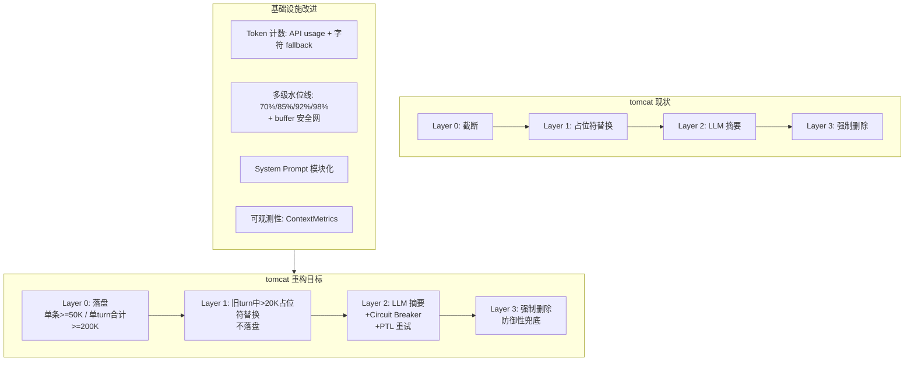

# tomcat 上下文管理重构建议报告

> **⚠️ 过时提示（2026-04）**：本提议已实施完成。`TurnEntry` / `AgentMessage` / `convert_to_llm_format` 等已删除，统一为 `ChatMessage` + `MessageKind`。实施状态见 [feature-collapse-to-chatmsg.md](../status/feature-collapse-to-chatmsg.md)，重构导读见 [collapse-to-chatmsg-guide.md](./collapse-to-chatmsg-guide.md)。

> 参考系：[Claude Code 上下文管理机制](cc-fork-01/docs/CONTEXT_MANAGEMENT.md) + [cc-fork-01/src](cc-fork-01/src) 源码
> 目标系：[tomcat](tomcat/) 项目
>
> **术语**：正文已统一用 **tomcat** 指本仓库宿主。若在其他文档仍见「**Pi**」指本仓实现，含义与 **tomcat** 同，**不是** pi-mono 上游的 `pi` CLI。

---

## 一、现状对比总览

### Claude Code (CC) 核心机制

- **五级渐进压缩管线**：Content Replacement → Snip → Microcompact → Context Collapse → AutoCompact
- **三层 Prompt Cache**：Global / Org / Ephemeral scope，配合 `cache_control`、`cache_reference`、`cache_edits` 三原语
- **精确 Token 计数**：优先从 API `usage` 字段反推，文本估算作 fallback
- **四级水位线**：AutoCompact / Warning / Error / Blocking 多级告警
- **会话稳定性锁定 (Session Stability Latching)**：一切可能改变请求 bytes 的运行时状态在会话启动时固定
- **可观测性**：Cache Break Detection 全链路追踪

### tomcat 现状

- **四层压缩级联**（[compaction.rs](tomcat/src/core/compaction.rs)）：Layer 0 截断 → Layer 1 占位符替换 → Layer 2 LLM 摘要 → Layer 3 强制删除
- **字符估算预算**（[config.rs](tomcat/src/infra/config.rs) `compute_context_budget_chars`）：`(context_window - max_output_tokens) * 4 * 0.75`，纯启发式
- **无 Prompt Cache 意识**：使用 OpenAI 兼容 API (GPT-5.2)，无 Anthropic 缓存原语
- **被动触发**：仅在 `is_over_budget()` 或 API 返回 context overflow 时触发压缩
- **无可观测性**：缺少 token 使用追踪、压缩成功率等指标

---

## 二、应当采纳的设计（取其精华）

### 2.1 基于 API Usage 的精确 Token 计数

**CC 做法**：`tokenCountWithEstimation` 优先从最近 assistant message 的 `usage` 字段反推真实 token 数，仅对 usage 之后新增的消息用文本估算叠加。

**tomcat 现状**：`estimate_context_chars` 用字符长度累加，误差可达 30-50%（中文字符尤其不准——1 个汉字 3 字节但通常 1-2 token）。API 返回的 `StreamEvent::Usage` 在 `run_reasoning_loop` 中被忽略。

**建议**：

- 在 `AgentLoop` 的 reasoning loop 中捕获 `StreamEvent::Usage`，存入 `ContextState` 的新字段 `last_api_usage: Option<ApiUsage>`
- 新增 `token_count_with_estimation(state: &ContextState) -> usize`：有 usage 时用 usage，否则 fallback 到现有字符估算
- 保留字符估算作为 fallback（首轮无 usage 时、compact 后 usage 失效时）

**理由**：token 计数准确性直接影响压缩触发时机。过早触发浪费 LLM 调用；过晚触发导致 API 413 错误。这是投入产出比最高的改进。

**涉及文件**：

- [agent_loop.rs](tomcat/src/core/agent_loop.rs)：捕获 usage
- [manager.rs](tomcat/src/core/session/manager.rs)：`ContextState` 增加 usage 字段
- [compaction.rs](tomcat/src/core/compaction.rs)：`is_over_budget` 改用 token 维度判断

---

### 2.2 多级水位线与主动压缩

**CC 做法**：四级水位线（AutoCompact 阈值 / Warning / Error / Blocking），在 token 接近上限前就主动触发压缩，而不是等到 API 报错。

**tomcat 现状**：只有单一 `is_over_budget()` 判断（字符预算），且仅在两个时机触发——`chat_loop` 用户输入后的预检，和 `agent_loop` 收到 context overflow 后的被动重试。

**建议**：

- 新增 `ContextState::usage_ratio() -> f64` 方法
- 在 `ContextConfig` 中增加 `autocompact_buffer_tokens`（默认 13000）和 `warning_buffer_tokens`（默认 20000），作为小窗口模型的安全网
- 每轮 reasoning loop 结束后，取 **ratio 阈值** 与 **buffer 阈值** 中更早触发的那个，执行对应动作

**Ratio 计算**：`ratio = estimated_input_tokens / (context_window - max_output_tokens)`。分母是**输入 token 预算**（已扣除输出预留），所以水位线百分比衡量的是输入空间的使用率，不会挤占输出空间。各模型示例：

| 模型 | context_window | max_output | input budget | ratio=0.70 时已用 |
|------|---------------|------------|-------------|-----------------|
| GPT-4o | 128K | 16K | 112K | 78K |
| GPT-5.2 | 400K | 128K | 272K | 190K |
| DeepSeek-V3 | 64K | 8K | 56K | 39K |
| Qwen2.5 | 131K | ~8K | ~123K | 86K |

> 注：当前 tomcat 代码 `compute_context_budget_chars` 在 `context_window - max_output_tokens` 基础上额外乘 0.75 安全系数，用于补偿字符→token 估算误差。有了精确 token 计数（§2.1）后，这个 0.75 可以放宽或去掉——水位线本身已提供分级保护。

**触发总表**：

| 触发条件 | 层级 | m | 动作 |
|---------|------|---|------|
| 单条 tool_result >= 50K chars | Layer 0 | — | 落盘 + preview 占位符 |
| 单个 user_turn 的 tool_result 合计 >= 200K chars | Layer 0 | — | 挑最大的 fresh 结果逐个落盘，直到合计回到预算内 |
| Layer 0 后 ratio 仍 >= 0.70（或剩余 < buffer），旧 turn(0..N-m) 中 tool_result > 20K chars | Layer 1 | 同 Layer 2 | 占位符替换（不落盘），m 由当前 ratio 档位决定 |
| `ratio >= 0.70` | Layer 2 | 5 | 温和压缩，batch 小，摘要精 |
| `ratio >= 0.85` | Layer 2 | 3 | 中等压力 |
| `ratio >= 0.92` | Layer 2 | 2 | 高压，只留最近 2 轮 |
| `ratio >= 0.98` | Layer 2 | 1 | 极限压缩 + 阻止新的工具调用 |
| `ratio >= 1.0` | Layer 3 | — | 强制删除，**删到 ratio < 0.50** |

Layer 0 在**每轮 LLM 回复完毕后立即检查**（不受 ratio 控制）；Layer 1/2/3 作为 cascade 的一环，由 ratio 或 buffer 驱动——只有 Layer 0 不够降压时才逐层升级。

**Buffer 安全网**：`autocompact_buffer_tokens`（默认 13000）和 `warning_buffer_tokens`（默认 20000）提供基于**绝对剩余 token** 的触发线，映射到等价的 ratio 档位行为：

| Buffer 条件 | 等价 ratio（128K 窗口） | 动作 |
|------------|----------------------|------|
| 剩余 < `warning_buffer`(20K) | ≈ 0.82 | Layer 2，m=3 |
| 剩余 < `autocompact_buffer`(13K) | ≈ 0.88 | Layer 2，m=2 |

对大窗口模型（128K+），ratio 几乎总是先触发；buffer 的价值在**小窗口模型**。但 13K/20K 的绝对值对小窗口不合理（32K 窗口下几乎无法使用），因此需要 cap：**实际 buffer = min(配置值, budget × 0.3)**，确保至少保留 70% 的 input budget 给正常对话。

两套机制互补：**ratio 按比例适配所有窗口大小，buffer 为「剩余空间不足以完成一轮完整工具调用」提供绝对值保底**。

**理由**：被动触发意味着用户已经遇到错误。主动触发可以无感地维持上下文健康。起始线设在 0.70 而非更早（如 0.5），是因为 0.5~0.7 这段空间应留给正常对话增长——Layer 0 已在每轮持续清理超大 tool_result，真正需要 cascade（Layer 1/2）时通常已过 0.70。过早触发 Layer 2 会增加不必要的 LLM 调用费用和延迟。高档位（0.85/0.92/0.98）在实际运行中极少触发，因为 0.70 的常规压缩通常已足够将 ratio 降回 0.1~0.3；它们的价值是作为安全网应对极端场景（如连续大量工具调用、压缩率不高等）。

---

### 2.3 Snip 机制（暂缓，当前不做）

**CC 做法**：Level 1 Snip 删除中间历史消息，保留头部与尾部，纯内存、零 API 成本。

**tomcat 决策**：**暂不实现 Snip**。Layer 2（LLM 摘要）在功能上可覆盖「中间段过长」场景；Snip 虽免费但会无摘要地丢弃中间 turn，且多一层 `keep_head` / `keep_tail` 调参与维护成本。**当前阶段保持 Layer 0 → Layer 1 → Layer 2 → Layer 3 四级级联即可**。

**后续再议**：若上线后观测到 Layer 2 触发过于频繁、延迟或费用成为瓶颈，再评估是否插入 Snip 作为 Layer 1 与 Layer 2 之间的可选中间层。

---

### 2.4 各层压缩的触发时机与职责

重构后 tomcat 保持 **Layer 0 → Layer 1 → Layer 2 → Layer 3** 四级级联，但各层的触发条件和行为需要重新定义：

**Layer 0：工具结果落盘**（对齐 CC 的 Content Replacement）

- **触发条件 A**：单条 tool_result >= **50K chars**（~12.5K token）
- **触发条件 B**：单个 user_turn 内所有 tool_result 合计 >= **200K chars**（~50K token）→ 在该条消息内挑**最大的、尚未处理过的（fresh）**结果，逐个落盘并换成预览，直到该消息的 tool_result 合计回到 200K 预算内
- **时机**：本轮 LLM 回复完毕后（**先用，再收纳**——LLM 已看到完整内容）
- **动作**：写入磁盘 `{work_dir}/agents/{id}/tool-results/{tool_call_id}.txt`，上下文中替换为 preview 占位符：
  ```
  [Tool result persisted: {path} (来源: {tool_name}("{arg}"), {size})]
  Preview: {前 500 chars}...
  ```
- **留 preview 的理由**：仅靠路径和工具名，LLM 在未来轮次无法判断内容是否与当前任务相关（尤其是 `search`/`shell` 等输出不可预知的工具）。500 chars 的 preview 成本极低（~125 token），但能帮助 LLM 决定是否需要按需读回，避免盲目忽略或盲目全量读取。

**Layer 1：旧 turn 批量占位符替换（不落盘）**

- **触发条件**：cascade 启动（ratio 达阈值或 buffer 不足）且 Layer 0 不够降压时，对 turn 0..(N-m) 中 tool_result > **20K chars** 的做替换
- **时机**：作为 cascade 的第二步，在 Layer 0 之后、Layer 2 之前执行。**不会每轮独立触发**——ratio 低时旧 tool_result 保持完整，LLM 后续仍可引用
- **动作**：直接将 tool_result 替换为 `[Previous tool result replaced to save context space]`，**不写磁盘**
- **为什么不落盘**：Layer 0 已把超大结果落盘保全；Layer 1 处理的是旧 turn 中「不算超大但仍占空间」的 tool_result，这些 turn 即将被 Layer 2 摘要覆盖，为每个都写磁盘的 I/O 和管理成本不值当
- **为什么不每轮无差别清理**：ratio 充裕时没必要丢掉旧 tool_result，且会使 Layer 2 的 m 保护变得无意义（保护了 turn 不被摘要，却偷偷换掉了其中的 tool_result）

**Layer 2：LLM 摘要压缩**

- **触发条件**：ratio 阈值或 buffer 安全网（见 §2.2 触发表），取更早触发者
- **动作**：一次性将 turn 0..(N-m) 提交给 LLM，生成一条 summary 替换这些 turn。`m` 随压力递减（见 §2.2）
- **不再使用循环 batch 模式**：旧设计中 `run_compaction_loop` 按 batch 分组逐步压缩；新设计直接按 ratio 对应的 m 值确定压缩范围，一次调用完成
- **保护**：Circuit Breaker（§2.5）+ PTL 重试（§4.2）

**Layer 3：强制删除（防御性兜底）**

- **触发条件**：`ratio >= 1.0`，或 Layer 2 被 Circuit Breaker 跳过后仍超预算
- **动作**：从最旧 summary/turn 起逐条删除，**直到 ratio < 0.50**
- **为什么删到 0.50 而不是刚好 < 1.0**：若只降到 < 1.0，下一条消息或工具调用就可能再次触发 Layer 3，形成频繁振荡。删到 0.50 一次性创造充足缓冲，远低于 Layer 2 首次触发线（0.70），确保 Layer 3 触发后有足够的对话增长空间，不会短期内再次进入高压状态
- **设计定位**：几乎不可达的安全网

**落盘时机与流程**：

```
                         当前轮（第 N 轮）
  ┌──────────────────────────────────────────────────────┐
  │  1. Agent 执行工具（如 read_file）                    │
  │     → 得到 tool_result（可能 200K 字符）              │
  │                                                      │
  │  2. tool_result 原样拼入 messages，发送给 LLM         │
  │     → LLM 看到完整内容，正常分析和回复 ✓              │
  │                                                      │
  │  3. 本轮 LLM 回复完毕后，检查该 tool_result：         │
  │     → 超过阈值？写入磁盘，将上下文中的 tool_result    │
  │       替换为 preview 占位符（路径 + 前 500 chars）    │
  └──────────────────────────────────────────────────────┘
                              │
                              ▼
                         未来轮次（第 N+1, N+2, ...）
  ┌──────────────────────────────────────────────────────┐
  │  组装上下文时，第 N 轮的 tool_result 已是短占位符     │
  │  → 不膨胀，正常构建 messages ✓                       │
  │                                                      │
  │  如果 LLM 需要再看原始内容：                         │
  │  → 按行范围读取（read_file + offset/limit），        │
  │    不要全量读，避免再次产生超大 tool_result            │
  └──────────────────────────────────────────────────────┘
```

**防振荡设计**：落盘后如果 LLM 再次全量读取同一文件，新 tool_result 仍可能超阈值、再次落盘，形成「读 → 落盘 → 再读 → 再落盘」的无效循环。

CC 的做法是在 `toolResultStorage` 层面只对 `maxResultSizeChars` 非 Infinity 的工具生效，且落盘后占位符中包含摘要文本，LLM 通常不需要再全量读取。CC 没有做显式的重复检测——它依赖的是 system prompt 引导 + 占位符提供足够信息。

tomcat 的防范策略：

1. **分页读取引导**：system prompt 中明确告知 LLM「已落盘的工具结果可通过 `read_file` 的 offset/limit 参数按需读取指定行范围，无需全量读取」
2. **占位符自包含**：preview（前 500 chars）+ 来源工具名 + 参数 + 大小，让 LLM 有足够信息决定是否需要读回、读哪部分
3. **兜底保障**：即使 LLM 仍然全量读取，Layer 0 会再次正常落盘。流程上不会死循环（每轮仍正常推进），只是浪费了一次全量读取的 token。这属于 LLM 行为问题，通过优化 system prompt 引导来改善，不需要在代码层做硬拦截

**整体触发流程（级联降压）**：

各层不是互斥的"只跑一个"，而是**瀑布式逐层尝试，每层跑完重新计算 ratio，降压成功即停**。ratio 阈值表定义的是「最少要跑到哪一层」和「m 取多少」，而不是「只跑这一层」。

这意味着当 ratio 突然从低档位飙到 0.98+ 时（如用户粘贴 80K 代码、一轮连续 10 个大工具调用），系统会从 Layer 0 开始逐层执行，直到 ratio 回到安全线：

```
工具执行完毕，LLM 已完成本轮回复
    │
    ▼
┌─ Layer 0（每轮必跑）─────────────────────────────────┐
│  单条 tool_result >= 50K？ → 落盘 + preview 占位符   │
│  单 turn tool_result 合计 >= 200K？                  │
│    → 挑最大 fresh 结果逐个落盘，直到合计 < 200K      │
└──────────────────────────────────────────────────────┘
    │
    ▼ 重新算 ratio
    │
    ratio < 0.70 且剩余 > buffer？ ──Yes──► 停止，无需 cascade
    │
    No（cascade 启动）
    ▼
┌─ Layer 1 ────────────────────────────────────────────┐
│  turn 0..(N-m) 中 tool_result > 20K                 │
│  → 占位符替换（不落盘）                              │
└──────────────────────────────────────────────────────┘
    │
    ▼ 重新算 ratio
    │
    ratio 已降到安全线？ ──Yes──► 停止
    │
    No
    ▼
┌─ Layer 2 ────────────────────────────────────────────┐
│  按当前 ratio 对应的 m 值，对 turn 0..(N-m) 做 LLM 摘要│
│  （ratio 越高 m 越小，压缩越激进）                    │
└──────────────────────────────────────────────────────┘
    │
    ▼ 重新算 ratio
    │
    ratio 已降到安全线？ ──Yes──► 停止
    │
    No
    ▼
┌─ Layer 3（防御性兜底，几乎不可达）───────────────────┐
│  从最旧 summary/turn 起逐条删除，直到 ratio < 0.50   │
│  （远低于 Layer 2 触发线，充足缓冲避免振荡）          │
└──────────────────────────────────────────────────────┘
    │
    ▼
ratio >= 0.98？ ──Yes──► 标记：阻止本轮后续新工具调用
                         （压缩已尽力，避免继续膨胀）
```

**为什么不直接跳到最高层**：低层的操作成本极低（Layer 0 是 I/O + 字符串替换，Layer 1 是纯内存操作），但可能已经足以降压。比如一轮产生了 5 个 40K 的 tool_result，Layer 0 落盘后直接释放 ~200K chars，ratio 可能从 0.95 降到 0.6，根本不需要动 Layer 2。逐层尝试避免不必要的 LLM 调用开销。

---

### 2.5 Circuit Breaker 模式

**CC 做法**：AutoCompact 连续失败 3 次后停止重试（circuit breaker），避免无限循环调用 LLM 做摘要却反复失败。

**tomcat 现状**：现有 compaction 逻辑在 LLM 返回空摘要或摘要比原文更长时 `break`，但没有跨轮次的失败计数。如果 Layer 2 反复因网络问题失败-恢复-失败，会持续消耗 token。

**建议**：

- 在 `ContextState` 中增加 `compaction_consecutive_failures: u32`
- Layer 2 LLM 摘要调用失败时递增，成功时清零
- 连续失败 >= 3 次时跳过 Layer 2，直接 fallback 到 Layer 3（强制删除）
- 通过 EventBus 发出 `CompactionCircuitBreakerTriggered` 事件

**理由**：防御性编程的基本原则。Layer 2 依赖外部 LLM 调用，任何外部依赖都可能不可用。CC 的 circuit breaker 模式简单有效，实现成本极低。

---

### 2.6 System Prompt 模块化管理

**CC 做法**：System Prompt 由多个 Section 组成，每个 Section 独立注册、独立计算、独立缓存，通过 `resolveSystemPromptSections` 动态组装。

**tomcat 现状**：`build_system_prompt(workspace_dir)` 是一个硬编码的 `format!` 模板字符串，所有内容混在一起。添加新上下文（如项目规则文件、MCP 工具描述）需要修改模板本身。

**建议**：

- 定义 `SystemPromptSection` trait：`fn name(&self) -> &str` + `fn compute(&self, ctx: &SessionContext) -> Option<String>`
- 内置 Section：`CoreIdentity`（静态）、`ToolInstructions`（根据注册工具动态生成）、`WorkspaceContext`（cwd + 时间）、`ProjectRules`（读取 AGENTS.md/SOUL.md）
- `build_system_prompt` 改为遍历注册的 sections，拼接非空结果
- 每个 section 内部可选 memoize（会话内只算一次，与 CC 的 `systemPromptSection` 一致）

**理由**：模块化 system prompt 是必经之路——随着功能增长（插件工具描述、workspace 规则文件、memory 系统等），单个模板字符串会变得难以维护。CC 的 Section 注册模式提供了很好的可扩展框架。注意：CC 的 `DANGEROUS_uncachedSystemPromptSection` 模式在 tomcat 中不需要，因为 tomcat 没有 Prompt Cache 约束。

---

### 2.7 上下文管理可观测性

**CC 做法**：`promptCacheBreakDetection.ts` 追踪每次 API 调用的 hash、token 使用、cache 命中率，异常时产生诊断事件。

**tomcat 现状**：仅有 `AgentEvent::AutoCompactionStart/End` 和 `ToolResultTruncated` 事件，缺乏系统性的上下文健康度指标。

**建议**：

- 新增 `ContextMetrics` 结构体：`input_tokens_used`、`context_utilization_ratio`、`compaction_count`、`compaction_tokens_freed`、`total_tool_result_bytes_truncated`
- 每轮 API 调用后更新指标，通过 `AgentEvent::ContextMetricsUpdate` 推送
- 在 CLI chat 模式下可选显示上下文使用率指示器（如 `[ctx: 67%]`）

**理由**：没有度量就没有优化。上下文是 agentic 系统最珍贵的资源，用户和开发者都需要知道"我还剩多少空间"以及"压缩是否在正常工作"。CC 的全链路追踪是过度设计（因为服务端 Prompt Cache），但基础指标是必须的。

---

## 三、不应采纳的设计（去其糟粕）

### 3.1 Prompt Cache 三层架构（Global / Org / Ephemeral）

**CC 做法**：精心管理 `cache_control`、`cache_reference`、`cache_edits` 三个 API 原语，按 Global / Org / Ephemeral 三层作用域标记缓存。

**不采纳理由**：这是 **Anthropic API 的专属能力**。tomcat 使用 OpenAI 兼容 API（GPT-5.2），没有对应的缓存原语。OpenAI 的 Predicted Outputs 和 Prompt Caching 是自动的、透明的，不需要客户端显式管理 cache breakpoint。强行模拟这套机制不仅无法获得性能收益，还会增加大量不必要的复杂度。

### 3.2 Cached Microcompact（服务端缓存编辑）

**CC 做法**：通过 `cache_edits` 在服务端 KV Cache 中"打洞"删除旧 tool_result，不改变本地消息，保留缓存前缀。

**不采纳理由**：同 3.1，这依赖 Anthropic 的 `cache_edits` API 原语。OpenAI API 没有对应能力。tomcat 的 Layer 1 占位符替换（直接修改本地消息内容）在没有 Prompt Cache 约束时是更简单有效的方案。

### 3.3 Session Stability Latching

**CC 做法**：会话启动时锁定 TTL、beta header、tool schema 等，防止 mid-session 变化破坏缓存前缀。

**不采纳理由**：Latching 的唯一目的是保护 Prompt Cache 不被 bust。tomcat 不管理客户端 Prompt Cache，运行时配置变化（如模型切换）对 tomcat 来说是合法操作，不需要锁定。

### 3.4 Context Collapse（实验性视图投影）

**CC 做法**：基于 commit log 的视图投影，把旧轮次替换为压缩摘要，是 read-time projection 不改变原始消息。

**不采纳理由**：CC 自己标注这是 `ant-only 实验特性`，尚未稳定。它的核心假设是对话与 git commit 有强关联（coding assistant 场景），对通用 agent 不成立。且实现复杂度高（需要维护两套消息视图），收益不确定。tomcat 的 Layer 2 LLM 摘要已经覆盖了这个需求空间。

### 3.5 Feature Flag Dead Code Elimination

**CC 做法**：通过 `bun:bundle` 编译时求值 `feature()` 函数，实现内部实验代码的零运行时开销条件编译。

**不采纳理由**：Rust 本身有 `#[cfg(feature = "...")]` 编译时条件编译，比 CC 的 JS 运行时 DCE 更彻底。如果 tomcat 需要实验性功能隔离，用 Cargo features 即可，无需引入额外的 feature flag 框架。

### 3.6 Fork Agent Cache Sharing

**CC 做法**：AutoCompact 启动 forked agent 做摘要，复用主对话的 Prompt Cache，用 `skipCacheWrite=true` 避免 fork 污染主缓存。

**不采纳理由**：tomcat 的 Layer 2 compaction 已经使用单独的 LLM 调用（可配置不同的 `compaction_model`），不需要 fork 子 agent 的复杂性。Cache sharing 的收益依赖 Anthropic Prompt Cache，在 OpenAI API 下无意义。

---

## 四、需适应性改造的设计

### 4.1 Compact Boundary 与上下文重建

**背景**：Layer 2 运行时，现有代码通过 `state.user_turns_list.drain(..)` 将被压缩的旧 turn 从内存中移除，并在头部插入 `SummaryTurn`——**同一次会话运行期间，内存状态是干净的**。

**问题出在跨次重启**：Layer 2 完成后，transcript 文件里既有旧的原始 Message entry，也有新追加的 Compaction entry。当会话重启、`init_context_state` 从 transcript 重建时，`read_entries_tail` 返回的尾部 2000 条如果同时包含旧消息和 Compaction entry，两者会被全部加载——旧消息构建为 `UserTurn`，Compaction 构建为 `SummaryTurn`，内容重复。

```
Transcript 文件（JSONL，按时间追加）
═══════════════════════════════════════════════════════════════

  entry 1:  Message { role: user,      content: "帮我重构 auth" }
  entry 2:  Message { role: assistant,  content: "好的，先读文件..." }
  entry 3:  Message { role: tool,       content: "(read_file 结果 50K)" }
  entry 4:  Message { role: assistant,  content: "建议改成..." }
  entry 5:  Message { role: user,      content: "再看看 db 层" }
  entry 6:  Message { role: assistant,  content: "db 层用了..." }
  entry 7:  Message { role: tool,       content: "(read_file 结果 30K)" }
  entry 8:  Message { role: assistant,  content: "可以优化为..." }

  ── Layer 2 摘要触发，把 entry 1~8 压缩并追加 compaction entry ──
  ── 注意：旧 entry 1~8 仍然留在 transcript 文件中（append-only） ──

  entry 9:  Compaction { summary: "用户要求重构 auth 和 db 层..." }

  entry 10: Message { role: user,      content: "接下来看 API 层" }
  entry 11: Message { role: assistant,  content: "API 层的结构..." }

═══════════════════════════════════════════════════════════════


运行时内存（drain 后，同一次会话内）—— 正确，无重复
──────────────────────────────────────────────────

  user_turns_list = [
    SummaryTurn("用户要求重构 auth 和 db 层..."),   ← drain 旧 turn 后插入
    UserTurn(entry 10~11),
  ]


跨次重启：init_context_state 从 transcript 尾部 2000 条重建
──────────────────────────────────────────────────

  若 entry 1~11 都在 tail 窗口内：

  user_turns_list = [
    UserTurn(entry 1~4),       ← 旧消息，已被 entry 9 摘要覆盖
    UserTurn(entry 5~8),       ← 旧消息，已被 entry 9 摘要覆盖
    SummaryTurn(entry 9),      ← 摘要
    UserTurn(entry 10~11),     ← 新消息
  ]
  → 旧消息和摘要内容重复！

  注：当会话足够长、旧消息已滚出 2000 条窗口时，不会重复。
  但短会话 / 多次 compact 场景下，重复是实际存在的。


加入 boundary 后：遇到 Compaction(is_boundary=true) 时截断
──────────────────────────────────────────────────

  读到 entry 1~8 → (先暂存)
  读到 entry 9, is_boundary=true → 丢弃之前暂存的所有 turn
  读到 entry 10~11 → 构建 UserTurn

  user_turns_list = [
    SummaryTurn(entry 9),
    UserTurn(entry 10~11),
  ]
  → 与运行时状态一致，干净无重复
```

**CC 做法**：AutoCompact 产生 `compact_boundary` 消息，`getMessagesAfterCompactBoundary()` 只返回 boundary 之后的消息。compact 后还需重建 file attachments、deferred tools 等多种 delta。

**tomcat 的改造方案**：tomcat 已有 `SummaryTurn` 概念且运行时 drain 逻辑正确，但 `init_context_state` 从 transcript 重建时缺少 boundary 语义。建议：

- `TranscriptEntry::BranchSummary` 增加 `is_boundary: bool` 标记
- `init_context_state` 遇到 boundary 时丢弃其前已暂存的所有 entry，使重建结果与运行时一致
- 暂不需要 CC 的复杂上下文重建（file attachments 等），tomcat 当前没有这些依赖

### 4.2 Compact 失败时的 PTL 重试

**CC 做法**：compact 自身的摘要请求如果返回 `PROMPT_TOO_LONG`，按 API round 分组丢弃最旧段落并重试。

**tomcat 的改造方案**：

改造后 Layer 2 不再是 `run_compaction_loop` 的循环 batch 模式，而是**一次性将 turn 0..(N-m) 提交给 LLM 生成一条 summary**。如果这次 LLM 调用失败：

- 错误含 context/token 关键词（PTL）→ 将摘要范围缩小为 turn 0..(N-m) 的前半部分重试
- 最多重试 2 次，每次范围减半
- 仍失败则跳过 Layer 2，由 Circuit Breaker 计数，fallback 到 Layer 3

---

## 五、实施优先级

按投入产出比排序：

1. **P0 - API Usage Token 计数**（2.1）：改动小，收益大，直接影响所有后续决策的准确性
2. **P0 - Circuit Breaker**（2.5）：几行代码的防御性改进，防止极端场景下的无限循环
3. **P1 - 多级水位线**（2.2）：依赖 P0 完成，实现主动压缩
4. **P1 - 工具结果落盘**（2.4）：独立实现，改善信息保留
5. **P2 - System Prompt 模块化**（2.6）：架构改进，为后续功能扩展铺路
6. **P2 - 可观测性**（2.7）：依赖 P0 完成，提供运维可见性
7. **P2 - Compact Boundary 改造**（4.1）+ **PTL 重试**（4.2）：精细化改进

**暂缓**：**Snip**（2.3）——见 2.3 节说明，不列入当前迭代。

---

## 六、架构演进总览



---

## 七、不采纳项决策矩阵

| CC 机制                      | 是否采纳 | 核心理由                                      |
| -------------------------- | ---- | ----------------------------------------- |
| 五级压缩管线                     | 部分采纳 | Snip 暂缓；不采纳 Microcompact/Context Collapse |
| Prompt Cache 三层架构          | 不采纳  | Anthropic 专属 API，OpenAI 无对应能力             |
| Cached Microcompact        | 不采纳  | 依赖 cache_edits 原语                         |
| Session Stability Latching | 不采纳  | 无 Prompt Cache 则无需 latching               |
| API Usage Token 计数         | 采纳   | 通用能力，OpenAI 也返回 usage                     |
| 多级水位线                      | 采纳   | 通用最佳实践                                    |
| Circuit Breaker            | 采纳   | 防御性编程基础                                   |
| System Prompt Section 化    | 采纳   | 可扩展性需要                                    |
| Context Collapse           | 不采纳  | 实验性，通用性差                                  |
| Feature Flag DCE           | 不采纳  | Rust cfg 已覆盖                              |
| Fork Agent Cache Sharing   | 不采纳  | 依赖 Prompt Cache                           |
| Cache Break Detection      | 部分采纳 | 采纳基础指标，不采纳 cache hash 对比                  |
| Content Replacement 落盘     | 采纳   | 低成本高收益                                    |
| Compact PTL 重试             | 改造采纳 | 摘要范围减半重试，最多 2 次                      |
