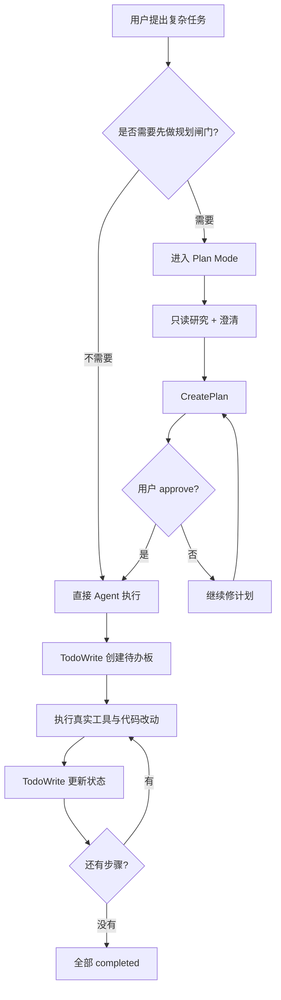

# Cursor `TodoWrite` 执行流速写：Todo 走执行板，不走 reviewer 闸门

> **目的**：给 `T2-P1-002 | plan-mode-enhance` 提供一份“可抄作业版”参考，说明 Cursor 体系里 `TodoWrite` / Todos 更像**执行期任务板**，而不是一套必须先过 reviewer / plan file / apply gate 的重流程。
>
> **说明**：本文里的“复盘”按当前语境，指**进入执行前再走一轮 plan/reviewer 审核闸门**，不是任务完成后的事后总结。若要讲事后总结，请另起一套 postmortem / review 语义，不要和 `todo` 混用。
>
> **结论先行**：Cursor 的 `todo` 能力应理解为“执行态状态板”，不是“计划审批流”。复杂任务当然可以先走 Plan Mode，但 **TodoWrite 本身不要求先过 `CreatePlan`、不要求 reviewer、也不要求文件锁计划文件**。

---

## 一、大白话先说（30 秒版本）

Cursor 实际上有两条相互独立的路：

1. **重路**：`Plan Mode -> 研究 -> AskQuestion -> CreatePlan -> 用户 approve -> 切回 Agent`
2. **轻路**：`普通 Agent 执行 -> 创建 / 更新 TodoWrite -> 一边干活一边改任务状态`

要抄的重点不是“TodoWrite 长什么样”，而是这两个事实：

- **Plan 是闸门**，解决“先别写，先想清楚”。
- **Todo 是白板**，解决“现在做到哪了，下一步做什么”。

所以 Cursor 的 todo 不天然绑定 reviewer，也不天然绑定计划文件。它更像执行期的“活任务清单”，而不是设计态的“待审批方案书”。

---

## 二、本文要回答什么

结合 [`plan-mode-execution-playbook-T2-P0-001.md`](./plan-mode-execution-playbook-T2-P0-001.md)、[`plan-mode-and-checkpoint-survey.md`](./plan-mode-and-checkpoint-survey.md)、[`plan-runtime.md`](../architecture/plan-runtime.md) 以及当前 Cursor 会话里真实可见的 `TodoWrite` 工具契约，本文重点回答 4 个问题：

1. Cursor 的 `TodoWrite` 在产品分层里到底算什么。
2. 它为什么说是“执行板”，而不是“复盘 / reviewer 流”。
3. 它和 Plan Mode / `CreatePlan` 的关系是什么。
4. 如果 Tomcat 要抄，哪些该抄，哪些别抄歪。

先说明边界：**Cursor 官方公开文档对 TodoWrite 的参数级 schema 并不完整公开**。因此本文对 `TodoWrite` 的字段与约束描述，优先依据“当前实际会话可见工具契约”，再用公开文档与社区讨论校正产品语义。

---

## 三、先把两个能力拆开：Plan 和 Todo 不是一回事

### 3.1 Plan Mode 解决的是“先不要写，先把方案定下来”

[`plan-mode-execution-playbook-T2-P0-001.md`](./plan-mode-execution-playbook-T2-P0-001.md) 已把 Cursor IDE 的 Plan Mode 流程讲得很清楚：

- 会话进入 **只读规划态**
- 允许探索、提问、形成计划
- 最终必须调用 `CreatePlan`
- 用户要明确 approve，之后才进入执行

也就是说，Plan Mode 的关键词是：

- **只读**
- **澄清**
- **产出计划**
- **用户确认**

这条链路本质上是“事前闸门”。

### 3.2 Todo 解决的是“执行过程中如何持续跟踪进度”

而 `TodoWrite` 这条能力，从当前 Cursor 工具契约看，更像一个轻量状态容器：

- 维护 `todos[]`
- 每条有 `id` / `content` / `status`
- `status ∈ {pending, in_progress, completed, cancelled}`
- **同一时间最多一个 `in_progress`**
- 支持 `merge=true` 对现有列表增量更新

这套约束明显更像“执行看板”，而不是“审批流”：

- 它没有 reviewer 输出结构
- 它没有“草案 / 待批准 / 已批准”的状态机
- 它没有“plan file 落盘并等待 apply”的强制环节
- 它也没有要求用户先点 approve 才能开始真正执行

**一句话**：Plan 在管“能不能开始干”，Todo 在管“现在干到哪了”。

---

## 四、Cursor `TodoWrite` 的最小语义模型

基于当前 Cursor 会话内的真实工具契约，可把 `TodoWrite` 概括成下面这个最小模型：

```text
TodoWrite {
  merge: boolean,
  todos: [
    { id, content, status }
  ]
}
```

### 4.1 它像什么

它更像：

- 会话内的任务板
- 给模型看的“当前执行切片”
- 给用户看的“进度投影”

### 4.2 它不太像什么

它不太像：

- 计划草案文件
- reviewer 审批单
- 长期设计文档
- 必须落盘再恢复的 durable plan artifact

### 4.3 这几个约束最值得抄

1. **稳定 `id`**：任务不是靠文案匹配，而是靠 id 定位。
2. **唯一 `in_progress`**：强迫模型聚焦当前主步骤，避免同时开 5 个“正在进行中”。
3. **`merge` 语义**：不是每次全量重建；可以对现有板子做增量修改。
4. **状态集合简单**：`pending / in_progress / completed / cancelled` 足够覆盖绝大多数执行期场景。

这几个约束都是执行态的，不是 reviewer 态的。

---

## 五、为什么说“Todo 执行不走复盘 / reviewer”

### 5.1 因为它没有重状态机

如果一条能力真的在走 reviewer / apply 闸门，它通常会有类似：

`Drafting -> Reviewing -> ReadyToApply -> Executing`

这样的状态切换。

但 `TodoWrite` 的状态只描述**任务项本身**，不是描述**计划审批阶段**。它只回答：

- 这个任务还没做？
- 正在做？
- 做完了？
- 放弃了？

它不回答：

- 这个计划是否已被 reviewer 接受？
- 用户是否批准执行？
- 当前计划是否锁定到某份计划文件？

所以 `TodoWrite` 从建模上就不是 reviewer 通道。

### 5.2 因为它允许边执行边更新

社区公开讨论里，Cursor 1.2 的 todo 典型使用方式就是：

- 用户发一个复杂请求
- 模型自动或按提示创建 todos
- 执行过程中持续更新 todos

这是一种**执行中更新**的交互，而不是“先停下来做完整审批”的交互。

如果它真的要走 reviewer 流，一般会表现成：

- 先禁止写动作
- 先把完整计划定稿
- 等用户或 reviewer 同意
- 之后才允许进入执行并更新状态

而 todo 的使用习惯明显不是这样。

### 5.3 因为它和 `CreatePlan` 是两层能力

[`plan-mode-execution-playbook-T2-P0-001.md`](./plan-mode-execution-playbook-T2-P0-001.md) 已经证明：

- `CreatePlan` 是 Plan Mode 的交付终点
- 它会触发用户 confirm
- approve 前仍然不允许写系统状态

这条链路本身已经是一个完整的 plan gate。

如果 `TodoWrite` 还要再重复承担 reviewer / approve 语义，就会出现两层重闸门叠在一起：

`CreatePlan` 审一遍，Todo 再审一遍。

这在产品上通常是多余的，也会让执行态变得很笨重。

---

## 六、Cursor 更合理的心智模型：Plan 是闸门，Todo 是白板

可以把 Cursor 的实际体验抽象成下面这张图：



这张图里最重要的是：

- **Plan Mode 是否发生**，由任务复杂度和用户需求决定。
- **TodoWrite 是否发生**，由执行期是否需要持续跟踪决定。
- 两者可以串起来，但不是同一个东西。

所以“执行不走复盘”的准确说法应该是：

> **执行期的 todo 更新，不需要每次再回到 plan/reviewer 闸门。**

---

## 七、和 Tomcat `PlanRuntime` 的差别在哪

[`plan-runtime.md`](../architecture/plan-runtime.md) 里，Tomcat 为 `T2-P1-002` 设计的是一条更重的闭环：

- `/plan` 本地命令
- planner 子 Agent
- reviewer 子 Agent
- `PlanRecord` 文件 + frontmatter
- advisory 文件锁
- `/plan apply`
- execution panel
- 里程碑与 checkpoint hook

这套东西比 Cursor 的 `TodoWrite` 重得多。

所以如果要借鉴 Cursor，**该借的是“Todo 与 Plan 解耦”**，不是把 Cursor 的轻执行板硬说成和 Tomcat 的重闭环等价。

### 7.1 Cursor Todo 更接近 Tomcat 设计里的哪一层

更接近：

- `TodoItem[]`
- 执行面板里的“当前任务”
- 执行期状态同步

不太接近：

- `PlanDraft`
- `Reviewing`
- `ReadyToApply`
- `PlanRecord` 的 durable single source of truth

### 7.2 这意味着什么

对 Tomcat 来说，更自然的借法是：

1. **`/plan` + reviewer + apply** 保持重路径。
2. **`todo` 工具**做轻路径，专注执行期状态。
3. 计划一旦被批准，可把批准后的步骤**一次性导入**到运行态 todo 板。
4. 进入执行后，后续 todo 更新**不必**再轮轮经过 reviewer。

这才是“抄 Cursor 作业但不抄歪”。

---

## 八、可直接抄的产品 / 架构结论

如果你要在 Tomcat 或别的 Agent 里复刻一版，最值得照搬的是下面 5 条。

### 8.1 让 todo 成为执行态一等状态

最小结构就够：

- `id`
- `content`
- `status`
- 唯一 `in_progress`
- 支持 merge

不要上来就把 todo 做成 reviewer 文档。

### 8.2 把 reviewer 留给 `/plan`，不要压给 `todo`

reviewer 该解决的是：

- 方案是否合理
- 范围是否对
- 风险是否被覆盖

todo 该解决的是：

- 现在做哪一项
- 哪项已完成
- 哪项取消了

两者强行合并，最后只会让执行期频繁卡顿。

### 8.3 允许非 `/plan` 场景直接使用 todo

很多任务不需要完整计划审批，但依然适合有个任务板，例如：

- 中等复杂度的多文件改动
- 一次代码 review + fix loop
- 集成测试 + 修 bug + 回归验证

这种任务如果还被迫先走 planner/reviewer，成本太高。

### 8.4 plan 批准后可导入 todo，但不要反向绑死

比较好的关系是：

- `CreatePlan` / `/plan apply` 之后，把批准后的步骤导入 todo
- 然后执行期由 todo 自己推进

而不是：

- 每次 todo 更新都回写 reviewer 状态
- 每个 completed 都要求 plan 再批准一次

### 8.5 todo 可以投影到面板，但别天然当 durable source of truth

Cursor 的 todo 更像会话板，不像强 durable 的计划资产。

如果 Tomcat 需要 durable plan file，那应该是：

- `PlanRecord` 做 durable source of truth
- `todo` 做运行态执行板

两者可同步，但不要把 `todo` 本身设计成 reviewer 文件替身。

---

## 九、反模式清单

下面几种做法，看起来像“加强治理”，其实很容易把产品做重：

| 反模式 | 问题 | 更好的做法 |
|---|---|---|
| 每次 `todo` 更新都要求 reviewer 再过一遍 | 执行态节奏被打断，模型和用户都烦 | 只在 `/plan` 阶段做 reviewer；执行期只更新 todo |
| 把 `todo` 当唯一 durable 计划文件 | 很难承载 reviewer 结论、锁、备注、人类修订 | durable 用 `PlanRecord`，执行态用 todo |
| 让 `/plan` 也变成 LLM 工具 | 模型会把控制面动作和业务动作混在一起 | `/plan` 留给本地命令或宿主控制面 |
| 把 checkpoint 语义绑进 `todo` | 一个是恢复基础设施，一个是执行板，职责错位 | 保持 `PlanRuntime -> CheckpointStore` 单向依赖 |
| todo 状态过多 | 模型容易乱选，UI 也难读 | 保持 4 态即可：`pending/in_progress/completed/cancelled` |

---

## 十、给 `T2-P1-002` 的一句拍板建议

如果 Tomcat 要同时做 **Planner + Reviewer + 计划文件 + 执行面板 + todo 工具**，最稳的落地姿势是：

> **把 reviewer 放在 `/plan` 这条重链路，把 `todo` 留在执行态这条轻链路；批准后的计划可以导入 todo，但执行中的 todo 更新不要反复回到 reviewer。**

换成更短的话就是：

> **Plan 管准入，Todo 管推进。**

---

## 十一、引用

- [`plan-mode-execution-playbook-T2-P0-001.md`](./plan-mode-execution-playbook-T2-P0-001.md)
- [`plan-mode-and-checkpoint-survey.md`](./plan-mode-and-checkpoint-survey.md)
- [`PlanRuntime：todo 工具、/plan 与 /goal 的运行时编排`](../architecture/plan-runtime.md)
- [`cursor-builtin-tools-reference.md`](./cursor-builtin-tools-reference.md)
- Cursor 官方 Plan Mode 文档：[https://cursor.com/docs/agent/plan-mode](https://cursor.com/docs/agent/plan-mode)
- Cursor 社区关于 todo 的公开说明：[https://forum.cursor.com/t/to-do-list-usage/112282](https://forum.cursor.com/t/to-do-list-usage/112282)

---

**一句话摘要**：Cursor 的 `TodoWrite` 值得抄的是“轻量执行板 + 稳定状态约束”，不值得误抄成“每次执行都要再走一轮 reviewer / 复盘审批”。
