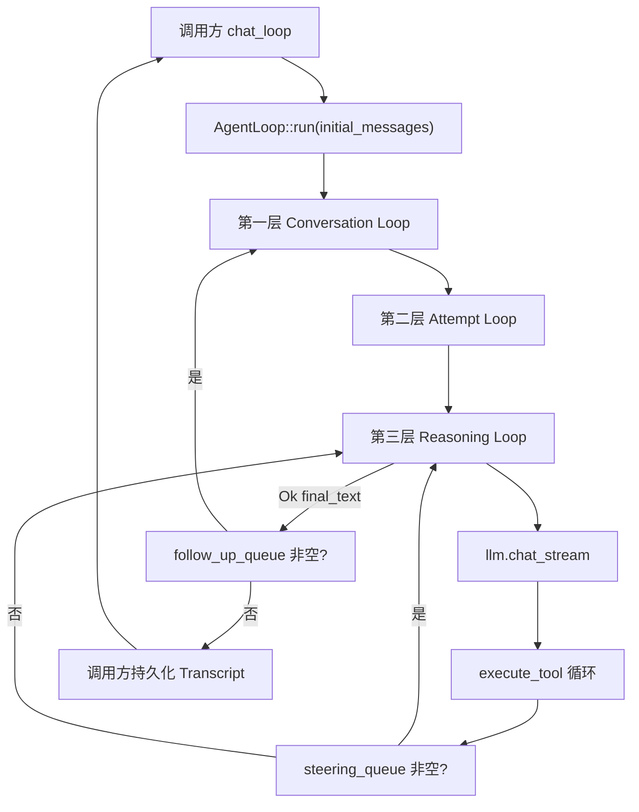

# Agent Loop 与 core 层说明 (core)

## 1. 概述 (Overview)

- **职责**：编排「用户输入 → LLM 流式调用 → 工具执行 → 结果回注 → 再调 LLM」的三层嵌套循环，支持 Steering（中途改向）、FollowUp（同上下文追问）、Abort（Ctrl+C 中断）、AgentEvent 全生命周期发布、错误分类与指数退避重试；与 **token-aware 上下文管理**、**四层 Compaction 防护**（`compaction.rs`）协同。
- **所在层级**：宿主核心能力层（`src/core/agent_loop/` 等），被 `src/api/chat.rs` 调用，依赖 `LlmProvider`、`PrimitiveExecutor`、`EventBus`。
- **核心文件**：
  - `src/core/agent_loop/` — ToolCallInfo、AgentLoopConfig、AgentLoop、LoopError
  - `src/core/compaction/` — 四层上下文防护算法（Layer 0~3）、Compaction Prompt 模板、context overflow 检测
  - `src/core/session/manager/` — ContextState、init_context_state、build_context_from_state、estimate_msg_chars
  - `src/core/llm/types.rs` — ChatMessage（含 MessageKind）、ChatRequest/ChatResponse
  - `src/lib.rs` — 对外导出 AgentLoop、AgentLoopConfig、AgentRunResult、ChatMessage、ContextState、ContextConfig 等

### 1.1 三层嵌套循环 + 干预点（ASCII）

```text
Layer 1  Conversation Loop
    |     FollowUp 队列非空 -> 注入 User 再继续
    v
Layer 2  Attempt Loop (max_attempts, 指数退避)
    |     ContextOverflow 检测 -> 触发 Layer 1~3 Compaction -> 重试
    v
Layer 3  Reasoning Loop
    |     LLM 流式 -> tool_calls?
    |     +-- 执行工具 -> Layer 0 截断超大 ToolResult -> ToolResult 回注
    |     +-- Steering 队列 -> 改向，跳过后续工具
    |     +-- Abort 信号 -> 中断
    |     +-- ContextState 动态估算更新
    v
  final_text (由调用方决定是否写 Session)
```

- **消息类型**：统一使用 `ChatMessage`（OpenAI wire format），通过 `MessageKind` 字段区分 Steering/CompactionSummary 等语义。
- **总览**：与 [src 模块索引](../README.md)「图 1」中 `core/agent_loop` 位置对照。

## 2. 设计方案 (Design Details)

- **设计模式**：三层嵌套循环（Conversation → Attempt → Reasoning），职责分离；消息统一使用 `ChatMessage`，无需在 LLM 边界做类型转换。`MessageKind` 枚举区分 Normal/Steering/CompactionSummary 等内部语义。
- **关键权衡**：System Prompt 与工具定义由**调用方**（如 chat）拼装并注入：AgentLoop 只接受已拼好的 `initial_messages`（含首条 System 若需要）和构造时传入的 `config.tool_definitions`，不在 Loop 内再拼 system，便于多调用方复用同一 Loop 逻辑。Transcript 持久化由调用方在 `run()` 返回后根据 `AgentRunResult` 自行 append 并写入 Session，AgentLoop 不依赖 SessionManager。
- **线程安全/并发**：`steering_queue`、`follow_up_queue` 为 `Arc<Mutex<Vec<ChatMessage>>>`，`abort_signal` 为 `Arc<AtomicBool>`；`steer()`、`follow_up()`、`abort()` 可从其他线程调用，`run()` 内读队列与信号，无数据竞争。流式 delta 通过 `EventBus` 的 `message_update` 事件推送，调用方（如 `chat.rs`）通过 `event_bus.on("message_update", ...)` 订阅。

## 3. 核心 API 与数据结构 (API Definitions)

- **ChatMessage**：统一消息类型（OpenAI wire format），含 `role`/`content`/`tool_calls`/`tool_call_id` 等字段。三个 `#[serde(skip)]` 字段 `msg_id`/`kind`/`timestamp` 携带内部元数据。
- **MessageKind**：`Normal`/`Steering`/`CompactionSummary`，区分不同语义的 user 消息。
- **ToolCallInfo**：`{ id, name, arguments }`，仅在流式积累 + 工具执行阶段使用的临时类型。
- **AgentLoopConfig**：`max_attempts`（默认 4，跟随 `[llm].agent_max_attempts`）、`max_tool_rounds`（默认 `usize::MAX`，由 token 预算与工具轮次逻辑兜底）、`retry_base_delay_ms`（默认 500ms，跟随 `[llm].agent_retry_base_delay_ms`，实际等待带 `±20%` jitter 且封顶 8s）、`model`、`session_id`、`tool_definitions: Vec<serde_json::Value>`（由调用方 `build_tool_definitions()` 等生成）、`context_config`。
- **AgentRunResult**：`{ final_text: String, new_messages: Vec<ChatMessage> }`，run 成功时最后一轮 LLM 文本回复及本次产生的所有新消息。
- **AgentLoop::new(llm, primitive, event_bus, config, abort_signal)**：标准构造函数；内部创建默认的 steering_queue、follow_up_queue。
- **AgentLoop::run(&mut self, initial_messages: Vec<ChatMessage>) -> Result<AgentRunResult, AppError>**：主入口；执行第一层 Conversation Loop（含 FollowUp 检查）、第二层 Attempt Loop（重试与 classify_error）、第三层 Reasoning Loop（LLM 流式 + 工具执行 + Steering/Abort 检查）。
- **AgentLoop::steer(&self, msg: String)**：向 steering_queue 推入 `ChatMessage::steering(msg)`；第三层每工具执行完后检查，非空则注入并跳过剩余工具进入下一轮 LLM。
- **AgentLoop::follow_up(&self, msg: String)**：向 follow_up_queue 推入 `ChatMessage::user(msg)`；第一层循环尾部检查，非空则 drain 追加到 messages 并 continue。
- **AgentLoop::abort(&self)**：将 `abort_signal` 置为 true；第三层每工具执行前检查，为 true 则返回 `Err` 并发布 agent_end(interrupted)。
- **LoopError**（内部）：`Retryable(AppError)`、`Fatal(AppError)`、`Aborted`；`classify_error(AppError)` 不再靠字符串猜测，而是优先基于结构化 `LlmError { stage, http_status, summary }` 判定：`401` → Fatal，`is_context_overflow(&AppError)`（如 `http_status=400 + context_length_exceeded`）→ Retryable 并触发 L3 截断，其余 `400` → Fatal，`429/500/502/503/504` 与传输阶段错误 → Retryable。

### 3.2 上下文管理 API（TASK-17）

- **ContextState**：运行时上下文状态，包含 `messages: Vec<ChatMessage>`、`estimate_context_chars: usize`、`context_budget_chars: usize`。在 `chat_loop` 外层初始化一次、跨迭代复用。Turn 边界从消息序列隐式推导（`role: user` = turn start）。
- **init_context_state(session, config, system_text) -> ContextState**：从 transcript 加载历史，解析为 ChatMessage 列表，识别已有 Compaction entry 标记为 `kind: CompactionSummary`。
- **build_context_from_state(state) -> Vec<ChatMessage>**：`state.messages.clone()`（trivial clone，内存表示 = LLM wire format）。
- **ContextConfig**：上下文管理配置，含 `context_window`、`max_output_tokens`、`keep_recent_turns`、`layer0_single_result_max_chars`、`layer0_placeholder_threshold_chars`、`current_tail_compactable_min_chars`、`current_tail_single_result_max_chars`、`compaction_model`、`compaction_max_tokens`。

### 3.3 四层防护算法（`compaction/`）

| Layer | 函数 | 机制 | 触发条件 |
|-------|------|------|----------|
| 0 | `layer0_persist_large_results` | 超大 tool result 落盘 + preview 占位符 | timing ⑤ |
| 1 | `compact_tool_results` | compactable zone 旧 tool result 替换为占位符 | timing ⑤ |
| 2 | preheat + `apply_boundary` | LLM 异步摘要 + boundary switch | timing ②/⑤ |
| 3 | `force_drop_oldest_to_target` | 强制删除最旧 turn（防御性兜底） | context overflow |

- **is_context_overflow(&AppError)**：Agent Loop 生产分类入口；结构化识别 `http_status=400 + context_length_exceeded / maximum context length / reduce the length` 等上下文溢出。
- **is_context_overflow_text(text)**：仅底层文本规则 helper；供少量纯文本场景与测试复用，不再作为 Agent Loop 生产分类入口。

## 4. core 层其它子模块（索引）

以下模块不单独拆 README，职责与主文件如下：

| 模块 | 主文件 | 职责摘要 |
|------|--------|----------|
| `executor` | `executor.rs` | `DefaultPrimitiveExecutor`，4 原语执行 |
| `primitives` | `primitives.rs` | 原语类型与 `PrimitiveExecutor` trait |
| `tools` | `tools.rs` | `Tool`/`ToolRegistry`/`DefaultToolRegistry` |
| `confirmation` | `confirmation.rs` | `UserConfirmationProvider`（允许/拒绝/交互） |
| `system_prompt` | `system_prompt.rs` | 系统提示拼装辅助 |
| `session` | `session/` | 见 [session/README.md](./session/README.md) |
| `llm` | `llm/` | 见 [llm/README.md](./llm/README.md) |

## 5. 配置项 (Configuration)

### 5.1 AgentLoopConfig

| 字段 | 类型 | 默认值 | 说明 |
|------|------|--------|------|
| max_attempts | u32 | 3 | 第二层 Attempt 最大重试次数（含首次） |
| max_tool_rounds | usize | usize::MAX | 单次 Attempt 内第三层最大工具轮次（不再硬限，由 token 预算兜底） |
| retry_base_delay_ms | u64 | 300 | 指数退避基准延迟（ms），实际 delay = base × 2^(attempt-1) |
| model | String | — | LLM 模型名，由调用方从 Session/Config 填入 |
| session_id | String | — | 会话 ID，随 AgentEvent 发布 |
| tool_definitions | Vec<serde_json::Value> | [] | 传入 LLM 的工具 JSON Schema |
| context_config | ContextConfig | ContextConfig::default() | 上下文管理配置 |

### 5.2 ContextConfig（`[context]` 配置节）

| 字段 | 类型 | 默认值 | 环境变量 | 说明 |
|------|------|--------|----------|------|
| context_window | usize | 400,000 | `PI_CONTEXT_WINDOW` | 模型 context window（tokens） |
| max_output_tokens | usize | 128,000 | `PI_MAX_OUTPUT_TOKENS` | 模型最大输出（tokens） |
| keep_recent_turns | usize | 5 | — | Layer 1 历史 placeholder 保护区 turn 数（最近几轮不动） |
| layer0_single_result_max_chars | usize | 50,000 | — | Layer 0 单条超大 tool result 落盘 + preview 阈值（chars） |
| layer0_placeholder_threshold_chars | usize | 10,000 | — | Layer 0/L1 历史 tool result placeholder 阈值（chars） |
| current_tail_compactable_min_chars | usize | 1 | — | mid-turn current-tail guard 的候选最小字符数 |
| current_tail_single_result_max_chars | usize | 10,000 | — | mid-turn current-tail guard 的大结果落盘阈值（chars） |
| compaction_model | String | gpt-5.2 | — | Compaction LLM 调用使用的模型 |
| compaction_max_tokens | usize | 10,000 | — | Compaction 摘要路径的 max tokens 配置 |

预算公式：`contextBudgetChars = (context_window - max_output_tokens) × 4`（GPT-5.4 默认 = 1,088,000 chars）。

## 6. 交互流程 (Workflow)



- 第一层：处理用户输入与 FollowUp；每次循环开始注入 steering_queue 中已有消息；Attempt 成功后在循环尾检查 follow_up_queue，非空则 drain 追加后 continue，否则 return。
- 第二层：按 attempt 计数，Retryable 错误时指数退避后重试，Fatal 或 Aborted 则终止并返回 Err。**ContextOverflow 检测**：若错误命中结构化 `is_context_overflow(&AppError)`，触发 L3 截断后以压缩后的上下文重试。provider 层的流式自动重试只允许发生在**首个 delta 前**；一旦正文已开始输出，后续 `BodyRead` / `Parse` 错误必须原样上抛给第二层，避免重复出字。
- 第三层：turn_start → chat_stream → message_start/update/end → 若有 tool_calls 则逐个 execute_tool，每工具前检查 abort、每工具后检查 steering_queue；同时**动态更新** `ContextState.estimate_context_chars`。

### 6.1 上下文管理集成流程（TASK-17）

```text
  chat_loop (api/chat.rs)
      |
      v  init_context_state() ← 从 transcript 重建 ContextState（仅首次）
      |
      v  每轮用户输入:
      |    1. 更新 estimateContextChars（新消息）
      |    2. timing ② check_before_request
      |    3. build_context_from_state → messages (= state.messages.clone())
      |    4. set_context_state → AgentLoop
      |
      v  AgentLoop::run()
      |    - Layer 0/1: timing ⑤ 后执行落盘/占位符
      |    - Layer 2: timing ②/⑤ apply boundary
      |    - Layer 3 Attempt: ContextOverflow → force_drop_oldest → 重试
      |    - 动态维护 estimate_context_chars
      |
      v  take_context_state ← 取回 ContextState
      |    - new_messages 逐条 append_message + extend context_state.messages
      |    - 下一轮继续使用同一 ContextState
```

## 7. 示例代码 (Usage Examples)

chat 层构造并调用 AgentLoop 的典型片段（见 `src/api/chat.rs`）：

```rust
let mut messages = build_context_from_state(&context_state);
messages.insert(0, ChatMessage::system(&system_text));
messages.push(ChatMessage::user(&input));

let config = AgentLoopConfig {
    max_attempts: 3,
    model: model.clone(),
    session_id: ctx.session.current_session_key().to_string(),
    tool_definitions: build_tool_definitions(),
    context_config: context_config.clone(),
    ..Default::default()
};
let mut agent_loop = AgentLoop::new(
    ctx.llm.clone(),
    ctx.primitive.clone(),
    ctx.event_bus.clone(),
    config,
    ctx.cancelled.clone(),
);

let run_result = agent_loop.run(messages).await;
match run_result {
    Ok(result) => {
        for msg in result.new_messages {
            let row_id = ctx.session.append_message(serde_json::to_value(&msg)?)?;
            let mut cm = msg;
            cm.msg_id = Some(row_id);
            context_state.messages.push(cm);
        }
    }
    Err(e) => return Err(e),
}
```

## 8. 验收标准 (Testing & QA)

- **单测**：`cargo test -j 1 --lib -- --test-threads=1` 全通过；覆盖 `core::agent_loop`、`core::compaction`、`infra::config`（含 ContextConfig）、`core::session::manager`（init_context_state 等）。
- **集成**：`tests/context_management_tests.rs` — 端到端上下文与 Compaction 场景；`context_management.md` / User_Stories Story 8 对齐。
- **门禁**：`cargo clippy --all-targets -- -D warnings` 无警告。
- **事件**：agent_start、turn_start/end、message_start/update/end、tool_execution_start/end、tool_call/tool_result、auto_retry_start/end、**auto_compaction_start/end**、**tool_result_truncated**、**compaction_error**、agent_end(success|error|interrupted)。
